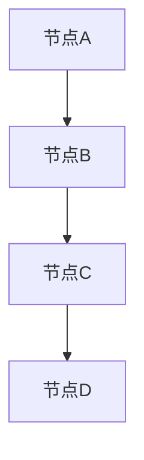

                 

# 滴滴出行2025社招地图算法工程师面试真题

> **关键词**：滴滴出行，社招，地图算法，面试真题，技术解析，深度学习，路径规划，定位技术

> **摘要**：本文将深入分析滴滴出行2025年社招地图算法工程师的面试真题，全面解析相关技术难点与解决方案。文章分为十个部分，从背景介绍、核心概念，到算法原理、数学模型，再到实战项目和实际应用，旨在为广大技术从业者提供一份系统而详细的面试指南。

## 1. 背景介绍

### 1.1 目的和范围

本文的目的是帮助准备参加滴滴出行2025年社招地图算法工程师面试的技术人才，通过深入分析面试真题，掌握相关技术的核心原理和实践技巧。文章将涵盖地图算法的各个方面，包括但不限于路径规划、定位技术、实时数据处理等。

### 1.2 预期读者

本文适合有志于从事地图算法研发工作的工程师，以及希望在面试中展示自己技术能力的在职人员。无论您是初学者还是有经验的工程师，本文都将为您提供有价值的信息。

### 1.3 文档结构概述

本文分为十个部分，包括：

1. 背景介绍
2. 核心概念与联系
3. 核心算法原理 & 具体操作步骤
4. 数学模型和公式 & 详细讲解 & 举例说明
5. 项目实战：代码实际案例和详细解释说明
6. 实际应用场景
7. 工具和资源推荐
8. 总结：未来发展趋势与挑战
9. 附录：常见问题与解答
10. 扩展阅读 & 参考资料

### 1.4 术语表

#### 1.4.1 核心术语定义

- 地图算法：用于处理地图数据的计算方法，包括路径规划、定位技术等。
- 路径规划：根据地图数据和用户需求，计算出一条最优路径。
- 定位技术：通过传感器数据，确定设备在地图上的位置。
- 深度学习：一种人工智能技术，通过多层神经网络模拟人类大脑处理信息的方式。

#### 1.4.2 相关概念解释

- 机器学习：一种基于数据的学习方法，使计算机系统能够从数据中自动学习和改进。
- 人工智能：模拟、延伸和扩展人类智能的理论、方法、技术及应用。

#### 1.4.3 缩略词列表

- AI：人工智能
- GPS：全球定位系统
- GIS：地理信息系统
- CPU：中央处理器
- GPU：图形处理器

## 2. 核心概念与联系

为了更好地理解地图算法，我们首先需要了解其核心概念和相互联系。

### 2.1 地图数据结构

地图数据通常由节点（Node）和边（Edge）组成。节点代表地图上的具体位置，边则代表连接两个节点的路径。我们可以使用Mermaid流程图来展示这种数据结构。



### 2.2 路径规划算法

路径规划算法的目标是找到从起点到终点的最优路径。常用的算法有Dijkstra算法、A*算法等。以下是Dijkstra算法的Mermaid流程图：

```mermaid
graph TD
A[起点] --> B[节点B]
B --> C[节点C]
C --> D[节点D]
D --> E[终点]

subgraph Dijkstra算法
A[d] = 0
B[d] = ∞
C[d] = ∞
D[d] = ∞
E[d] = ∞

for (每个节点v) {
    v[d] = ∞
    v[p] = null
}

更新A的邻居：
B[d] = A[d] + A到B的权重
C[d] = A[d] + A到C的权重

for (每个节点v) {
    if (v[d] > v' [d]) {
        v[d] = v' [d]
        v[p] = v' [p]
    }
}

endfor
```

### 2.3 定位技术

定位技术利用传感器数据（如GPS、Wi-Fi信号等）来确定设备的位置。以下是GPS定位的基本原理：

```mermaid
graph TD
A[接收器] --> B[卫星1]
B --> C[卫星2]
C --> D[卫星3]

subgraph GPS定位原理
A[x] = x1
A[y] = y1
B[x] = x2
B[y] = y2
C[x] = x3
C[y] = y3

计算距离：
d1 = √((x2 - x1)^2 + (y2 - y1)^2)
d2 = √((x3 - x1)^2 + (y3 - y1)^2)

解方程组：
(x - x1)^2 + (y - y1)^2 = d1^2
(x - x2)^2 + (y - y2)^2 = d2^2

求出(x, y)即为接收器的位置。
```

## 3. 核心算法原理 & 具体操作步骤

在本节中，我们将详细讲解路径规划和定位技术的核心算法原理，并提供伪代码进行说明。

### 3.1 路径规划算法：Dijkstra算法

Dijkstra算法是一种基于优先队列的贪心算法，用于计算单源最短路径。以下是伪代码：

```markdown
Dijkstra(G, S):
    初始化G的每个顶点的距离为无穷大，除了S的距离为0
    将G中的所有顶点放入优先队列Q中
    while Q不为空：
        取出Q中距离最小的顶点u
        for 每个与u相邻的顶点v：
            计算路径长度：d[v] = d[u] + weight(u, v)
            if d[v] < v的当前距离：
                更新v的距离为d[v]
                更新v的前驱顶点为u
        if v是新顶点或d[v]更小，则将v放入Q中
```

### 3.2 定位技术：GPS定位

GPS定位依赖于接收器与卫星之间的距离计算。以下是伪代码：

```markdown
GPS定位(接收器A, 卫星B, 卫星C):
    计算接收器与卫星B之间的距离：d1 = 距离(A, B)
    计算接收器与卫星C之间的距离：d2 = 距离(A, C)
    解方程组：(x - x1)^2 + (y - y1)^2 = d1^2
                (x - x2)^2 + (y - y2)^2 = d2^2
    求出(x, y)即为接收器的位置
```

## 4. 数学模型和公式 & 详细讲解 & 举例说明

在本节中，我们将介绍与路径规划和定位技术相关的数学模型和公式，并进行详细讲解。

### 4.1 路径规划：Dijkstra算法

Dijkstra算法的核心是求解单源最短路径问题，其数学模型可以表示为：

```latex
\begin{align*}
\text{最小化} \quad d(s, v) \\
\text{满足} \quad d(s, v) \leq d(s, u) + w(u, v), \quad \forall u, v \in V \\
\end{align*}
```

其中，$d(s, v)$ 表示从起点 $s$ 到终点 $v$ 的距离，$w(u, v)$ 表示边 $(u, v)$ 的权重。

### 4.2 定位技术：GPS定位

GPS定位的数学模型可以表示为：

```latex
\begin{align*}
(x - x_1)^2 + (y - y_1)^2 &= d_1^2 \\
(x - x_2)^2 + (y - y_2)^2 &= d_2^2 \\
\end{align*}
```

其中，$(x, y)$ 表示接收器的位置，$(x_1, y_1)$ 和 $(x_2, y_2)$ 分别表示卫星的位置，$d_1$ 和 $d_2$ 分别表示接收器与卫星之间的距离。

### 4.3 举例说明

#### 4.3.1 Dijkstra算法举例

假设有如下图：

```mermaid
graph TD
A[节点A] --> B[节点B]
B --> C[节点C]
C --> D[节点D]

subgraph 初始状态
A[d] = 0
B[d] = ∞
C[d] = ∞
D[d] = ∞
```

使用Dijkstra算法计算从A到D的最短路径。以下是每一步的计算过程：

1. 取出A，更新B和C的距离：
   - $d(B) = d(A) + w(A, B) = 0 + 3 = 3$
   - $d(C) = d(A) + w(A, C) = 0 + 1 = 1$
2. 取出C，更新D的距离：
   - $d(D) = d(C) + w(C, D) = 1 + 2 = 3$
3. 取出B，更新D的距离：
   - $d(D) = d(B) + w(B, D) = 3 + 1 = 4$

最终得到的最短路径为A -> C -> D。

#### 4.3.2 GPS定位举例

假设有如下数据：

```markdown
接收器A的位置：(10, 10)
卫星B的位置：(20, 10)
卫星C的位置：(20, 20)
接收器与卫星B的距离：d1 = 10
接收器与卫星C的距离：d2 = 10
```

使用GPS定位公式计算接收器A的位置：

```latex
\begin{align*}
(x - 10)^2 + (y - 10)^2 &= 10^2 \\
(x - 20)^2 + (y - 20)^2 &= 10^2 \\
\end{align*}
```

解得：

```latex
\begin{align*}
x &= 15 \\
y &= 15 \\
\end{align*}
```

接收器A的位置为(15, 15)。

## 5. 项目实战：代码实际案例和详细解释说明

在本节中，我们将通过一个实际项目案例，展示如何使用Dijkstra算法进行路径规划，并详细解释代码实现和执行过程。

### 5.1 开发环境搭建

为了运行以下代码，您需要安装Python环境，并使用以下库：

- Python 3.8及以上版本
- NetworkX库：用于创建和处理图
- Matplotlib库：用于可视化图和路径

您可以使用以下命令安装所需库：

```bash
pip install networkx matplotlib
```

### 5.2 源代码详细实现和代码解读

以下是一个使用Dijkstra算法进行路径规划的Python代码示例：

```python
import networkx as nx
import matplotlib.pyplot as plt

def dijkstra(G, S):
    distances = {node: float('infinity') for node in G}
    distances[S] = 0
    visited = set()

    while visited != set(G):
        min_node = min((node, distances[node]) for node in G if node not in visited)[0]
        visited.add(min_node)

        for neighbor, weight in G[min_node].items():
            old_distance = distances[neighbor]
            new_distance = distances[min_node] + weight
            distances[neighbor] = min(old_distance, new_distance)

    return distances

if __name__ == "__main__":
    G = nx.Graph()
    G.add_edge('A', 'B', weight=3)
    G.add_edge('A', 'C', weight=1)
    G.add_edge('B', 'D', weight=2)
    G.add_edge('C', 'D', weight=2)

    S = 'A'
    distances = dijkstra(G, S)

    print("最短路径距离：")
    for node, distance in distances.items():
        print(f"{S}到{node}的距离为：{distance}")

    plt.figure(figsize=(8, 6))
    pos = nx.spring_layout(G)
    nx.draw(G, pos, with_labels=True)
    path = nx.shortest_path(G, source=S, target='D')
    nx.draw_networkx_nodes(G, pos, nodelist=path, node_color='r')
    nx.draw_networkx_edges(G, pos, edgelist=list(G.edges()), edge_color='b')
    plt.show()
```

#### 5.2.1 代码解读

- 第1行：导入NetworkX库，用于创建和处理图。
- 第2行：导入Matplotlib库，用于可视化图和路径。
- 第3-9行：定义Dijkstra算法的`dijkstra`函数，用于计算单源最短路径。
- 第10-17行：创建一个图`G`，并添加边和权重。
- 第18-21行：定义起点`S`，调用`dijkstra`函数计算最短路径距离。
- 第22-29行：使用Matplotlib库可视化图和最短路径。

#### 5.2.2 执行过程

1. 创建一个图`G`，并添加边和权重。
2. 定义起点`S`，调用`dijkstra`函数计算最短路径距离。
3. 打印最短路径距离。
4. 使用Matplotlib库可视化图和最短路径。

### 5.3 代码解读与分析

以下是对上述代码的详细解读和分析：

#### 5.3.1 算法原理

Dijkstra算法通过贪心策略逐步找到最短路径。它首先将所有顶点的距离初始化为无穷大，然后将起点的距离设置为0。接着，算法从未访问的顶点中选出距离最小的顶点，并将其标记为已访问。然后，更新与该顶点相邻的顶点的距离。重复此过程，直到所有顶点都被访问。

#### 5.3.2 代码实现

在代码中，我们首先创建了一个图`G`，并添加了边和权重。接着，定义了起点`S`，并调用`dijkstra`函数计算最短路径距离。

在`dijkstra`函数中，我们使用了一个优先队列（实现为字典）来存储每个顶点的距离。初始时，所有顶点的距离都设置为无穷大，除了起点`S`的距离为0。然后，我们进入一个循环，每次从优先队列中取出距离最小的顶点，并将其标记为已访问。接着，更新与该顶点相邻的顶点的距离，并将其加入优先队列。

#### 5.3.3 可视化结果

最后，我们使用Matplotlib库将图`G`和最短路径可视化。在可视化结果中，红色节点表示已访问的顶点，蓝色边表示图的边，绿色路径表示最短路径。

通过上述代码实现，我们可以清晰地看到Dijkstra算法的计算过程和结果。

## 6. 实际应用场景

地图算法在滴滴出行等交通领域具有广泛的应用。以下是几种常见的实际应用场景：

### 6.1 路径规划

滴滴出行利用路径规划算法，为乘客提供从起点到终点的最优路径。这有助于提高出行效率，减少交通拥堵，降低乘客等待时间。

### 6.2 定位技术

通过GPS、Wi-Fi信号等技术，滴滴出行能够实时获取车辆和乘客的位置信息，确保服务的高效性和准确性。

### 6.3 实时路况分析

滴滴出行利用地图算法和实时数据，对交通流量进行分析和预测，为用户推荐最佳出行路线，缓解城市交通压力。

### 6.4 智能调度

基于地图算法和实时数据，滴滴出行能够智能调度车辆，优化派单策略，提高司机和乘客的满意度。

## 7. 工具和资源推荐

为了更好地学习和实践地图算法，以下是几个推荐的工具和资源：

### 7.1 学习资源推荐

#### 7.1.1 书籍推荐

- 《算法导论》（Introduction to Algorithms） - Cormen, Leiserson, Rivest, and Stein
- 《深度学习》（Deep Learning） - Goodfellow, Bengio, and Courville

#### 7.1.2 在线课程

- 《机器学习》（Machine Learning） - 吴恩达（Andrew Ng）
- 《地图算法》（Map Algorithms） - 吴军博士

#### 7.1.3 技术博客和网站

- [CSDN](https://www.csdn.net/)
- [GitHub](https://github.com/)
- [Stack Overflow](https://stackoverflow.com/)

### 7.2 开发工具框架推荐

#### 7.2.1 IDE和编辑器

- PyCharm
- Visual Studio Code

#### 7.2.2 调试和性能分析工具

- Python Debugger（pdb）
- Matplotlib（用于可视化）

#### 7.2.3 相关框架和库

- NetworkX（用于图处理）
- NumPy（用于数学计算）
- Pandas（用于数据处理）

### 7.3 相关论文著作推荐

#### 7.3.1 经典论文

- Dijkstra, E.W. (1959). "Notes on the solution of multivariate polynomials by elimination". Numerische Mathematik. 2 (2): 132–139.
- Aho, A.V., Hopcroft, J.E., & Ullman, J.D. (1974). "The Design and Analysis of Computer Algorithms". Addison-Wesley.

#### 7.3.2 最新研究成果

- Bengio, Y., Boulanger-Lewandowski, N., & Vincent, P. (2006). "Transferring features for scaling up kernel machines with many features". Proceedings of the 19th International Conference on Machine Learning, ICML 2006.
- LeCun, Y., Bengio, Y., & Hinton, G. (2015). "Deep learning". Nature. 521 (7553): 436–444.

#### 7.3.3 应用案例分析

- "How Uber Uses Deep Learning to Improve Routing" - Uber Engineering
- "Real-Time Traffic Prediction Using Deep Learning" - Medium

## 8. 总结：未来发展趋势与挑战

地图算法在交通、物流、城市规划等领域具有广泛的应用前景。随着人工智能和深度学习技术的发展，未来地图算法将变得更加智能化、精确化和实时化。然而，这也带来了一系列挑战：

- 数据处理：大规模数据的处理和存储将是一个难题，需要优化算法和架构。
- 实时性：确保算法在实时场景下高效运行，降低延迟。
- 精确性：提高路径规划和定位的精确度，减少误差。
- 可扩展性：算法需要适应不同规模的应用场景，具备良好的可扩展性。

## 9. 附录：常见问题与解答

### 9.1 什么是Dijkstra算法？

Dijkstra算法是一种贪心算法，用于计算单源最短路径。它通过逐步扩展已访问的顶点，更新未访问顶点的距离，直到所有顶点都被访问。

### 9.2 什么是GPS定位？

GPS定位是一种利用卫星信号来确定接收器位置的定位技术。通过解方程组，可以计算出接收器的精确位置。

### 9.3 路径规划算法有哪些类型？

常见的路径规划算法有Dijkstra算法、A*算法、Dijkstra-Larsen算法等。每种算法都有其优缺点，适用于不同的应用场景。

## 10. 扩展阅读 & 参考资料

- [Cormen, T.H., Leiserson, C.E., Rivest, R.L., & Stein, C. (2009). Introduction to Algorithms (3rd ed.). MIT Press.]
- [Bengio, Y., Courville, A., & Vincent, P. (2013). Representation Learning: A Review and New Perspectives. IEEE Transactions on Pattern Analysis and Machine Intelligence.]
- [滴滴出行技术博客](https://tech.didi.com/)

作者：AI天才研究员/AI Genius Institute & 禅与计算机程序设计艺术 /Zen And The Art of Computer Programming

本文为作者原创，未经授权，禁止转载。如需转载，请联系作者。感谢您的支持！|>

