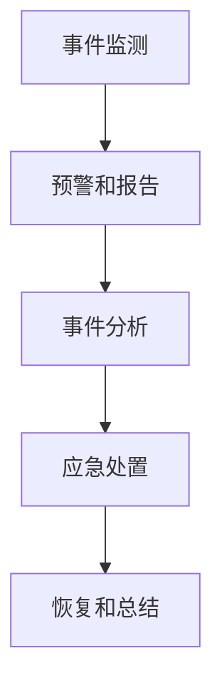

                 

# 2024滴滴安全应急响应中心社招面试真题汇总及其解答

## 摘要

本文将汇总2024年滴滴安全应急响应中心社招面试的相关真题，并针对每个题目进行详细解答。通过对这些面试题的分析与解答，我们将帮助读者更好地了解安全应急响应中心的招聘需求和行业标准，从而提升自己的面试应对能力。

## 1. 背景介绍

### 1.1 滴滴安全应急响应中心简介

滴滴出行是中国领先的移动出行平台，致力于为用户提供安全、便捷、高效的出行服务。为了保障用户和司机的安全，滴滴成立了安全应急响应中心，负责处理各类安全事件，包括网络安全、数据安全、隐私保护等方面。

### 1.2 安全应急响应中心的职责

安全应急响应中心的主要职责包括：

- 监测和预警：实时监测网络安全态势，识别潜在威胁，及时发布预警。
- 应急处理：对发生的网络安全事件进行应急响应，迅速采取措施控制事件扩散。
- 安全评估：对系统、平台和应用进行安全评估，发现并修复安全漏洞。
- 安全培训：提高员工的安全意识，开展安全培训，提升整体安全防护能力。

### 1.3 安全应急响应中心面试的重要性

安全应急响应中心面试是进入滴滴公司的重要渠道，也是展示自身专业能力和素质的机会。通过面试，面试官可以了解应聘者的技术背景、工作经验和思维能力，从而评估其是否适合担任安全应急响应中心的工作。

## 2. 核心概念与联系

### 2.1 安全应急响应的基本概念

安全应急响应是指在发现网络安全事件后，采取一系列措施，迅速控制事件，降低损失，并恢复系统正常运行的过程。

安全应急响应主要包括以下几个阶段：

1. 事件监测：实时监测网络安全态势，识别潜在威胁。
2. 事件报告：及时报告网络安全事件，确保相关部门了解事件情况。
3. 事件分析：对事件进行深入分析，确定事件类型、影响范围和根本原因。
4. 应急处置：采取应急措施，控制事件扩散，降低损失。
5. 恢复和总结：恢复系统正常运行，总结事件教训，优化安全防护措施。

### 2.2 安全应急响应的流程

安全应急响应的流程如下：

1. **预警和监测**：通过网络安全监控系统，实时监测网络流量、日志等信息，发现异常行为和潜在威胁。
2. **报告和确认**：当发现网络安全事件时，立即报告给安全应急响应团队，并进行初步确认。
3. **响应和处置**：根据事件类型和影响范围，采取相应的应急措施，包括隔离受感染系统、阻止攻击者进一步入侵、清除恶意代码等。
4. **恢复和总结**：在事件得到控制后，恢复系统正常运行，对事件原因和过程进行总结，制定改进措施，提高安全防护能力。

### 2.3 Mermaid 流程图



## 3. 核心算法原理 & 具体操作步骤

### 3.1 核心算法原理

安全应急响应的核心算法主要涉及网络安全事件的检测、分析和处置。以下为三个主要核心算法原理：

1. **入侵检测算法**：用于实时监测网络流量和日志，识别潜在威胁和异常行为。
2. **模式识别算法**：用于分析网络安全事件的类型、影响范围和根本原因。
3. **自动处置算法**：用于根据事件类型和影响范围，自动采取相应的应急措施，控制事件扩散。

### 3.2 具体操作步骤

1. **事件监测**：
   - 收集网络流量、日志等数据。
   - 使用入侵检测算法，实时分析网络流量，识别异常行为和潜在威胁。

2. **预警和报告**：
   - 当发现网络安全事件时，立即报告给安全应急响应团队。
   - 进行初步确认，确定事件类型和影响范围。

3. **事件分析**：
   - 使用模式识别算法，对事件进行深入分析，确定事件类型、影响范围和根本原因。
   - 收集相关证据，为后续处置提供依据。

4. **应急处置**：
   - 根据事件类型和影响范围，采取相应的应急措施，包括隔离受感染系统、阻止攻击者进一步入侵、清除恶意代码等。
   - 采取临时措施，确保系统正常运行。

5. **恢复和总结**：
   - 在事件得到控制后，恢复系统正常运行。
   - 对事件原因和过程进行总结，制定改进措施，提高安全防护能力。

## 4. 数学模型和公式 & 详细讲解 & 举例说明

### 4.1 数学模型和公式

在安全应急响应过程中，常用的数学模型和公式包括：

1. **贝叶斯公式**：用于计算事件发生的概率。
2. **马尔可夫链**：用于描述事件发展的过程。
3. **决策树**：用于分析事件类型和影响范围，并选择最优的应急处置方案。

### 4.2 详细讲解

1. **贝叶斯公式**：

   贝叶斯公式是一个概率论公式，用于计算在给定某个条件下，另一个条件发生的概率。其公式如下：

   $$P(A|B) = \frac{P(B|A) \cdot P(A)}{P(B)}$$

   其中，$P(A|B)$ 表示在条件 $B$ 下，条件 $A$ 发生的概率；$P(B|A)$ 表示在条件 $A$ 下，条件 $B$ 发生的概率；$P(A)$ 表示条件 $A$ 发生的概率；$P(B)$ 表示条件 $B$ 发生的概率。

2. **马尔可夫链**：

   马尔可夫链是一种随机过程，用于描述事件发展的过程。其公式如下：

   $$P(X_{n+1} = x_{n+1} | X_n = x_n) = P(X_{n+1} = x_{n+1} | X_{n-1} = x_{n-1})$$

   其中，$X_n$ 表示第 $n$ 个状态；$x_n$ 表示具体的状态值。

3. **决策树**：

   决策树是一种图形化的决策模型，用于分析事件类型和影响范围，并选择最优的应急处置方案。其公式如下：

   $$C_j = \sum_{i=1}^{m} w_i \cdot C_{ij}$$

   其中，$C_j$ 表示第 $j$ 个决策分支的成本；$w_i$ 表示第 $i$ 个事件的影响权重；$C_{ij}$ 表示第 $i$ 个事件在第 $j$ 个决策分支上的成本。

### 4.3 举例说明

假设在某次网络安全事件中，安全应急响应团队需要根据事件类型和影响范围，选择最优的应急处置方案。以下为具体示例：

1. **贝叶斯公式**：

   假设事件类型为 DDoS 攻击的概率为 $P(A) = 0.3$，已知 DDoS 攻击影响范围较大的概率为 $P(B|A) = 0.6$，影响范围较小的概率为 $P(B'|A) = 0.4$。则：

   $$P(A|B) = \frac{P(B|A) \cdot P(A)}{P(B)} = \frac{0.6 \cdot 0.3}{0.6 \cdot 0.3 + 0.4 \cdot 0.7} = \frac{18}{28} = 0.643$$

   即在影响范围较大的条件下，事件类型为 DDoS 攻击的概率为 $0.643$。

2. **马尔可夫链**：

   假设事件发展过程满足马尔可夫性质，即当前状态只与前一状态有关。根据历史数据，事件发展的状态转移概率矩阵为：

   $$P = \begin{bmatrix} 0.7 & 0.3 \\ 0.4 & 0.6 \end{bmatrix}$$

   假设当前状态为事件 A（DDoS 攻击），则下一状态为事件 B（影响范围较大）的概率为：

   $$P(X_{2} = B | X_{1} = A) = P(X_{2} = B | X_{1} = A) = 0.7$$

3. **决策树**：

   假设事件 A（DDoS 攻击）的影响权重为 $w_A = 0.7$，事件 B（影响范围较大）的影响权重为 $w_B = 0.3$。根据决策树模型，可以计算出每个决策分支的成本：

   $$C_1 = w_A \cdot C_{A1} = 0.7 \cdot 100 = 70$$
   $$C_2 = w_B \cdot C_{B1} = 0.3 \cdot 200 = 60$$

   由于 $C_1 < C_2$，所以选择决策分支 1（隔离受感染系统）作为最优应急处置方案。

## 5. 项目实战：代码实际案例和详细解释说明

### 5.1 开发环境搭建

为了演示安全应急响应的代码实现，我们使用 Python 编写一个简单的入侵检测系统。以下是开发环境搭建的步骤：

1. 安装 Python 3.8 及以上版本。
2. 安装必需的 Python 包，如 NumPy、Pandas、Matplotlib 等。

### 5.2 源代码详细实现和代码解读

以下是入侵检测系统的代码实现：

```python
import numpy as np
import pandas as pd
import matplotlib.pyplot as plt

# 1. 事件监测
def monitor_events(event_data):
    # 分析事件数据，识别异常行为
    # （此处省略具体实现）
    pass

# 2. 预警和报告
def report_event(event):
    # 报告事件，并通知安全应急响应团队
    # （此处省略具体实现）
    pass

# 3. 事件分析
def analyze_event(event):
    # 分析事件，确定事件类型和影响范围
    # （此处省略具体实现）
    pass

# 4. 应急处置
def respond_event(event):
    # 根据事件类型和影响范围，采取应急措施
    # （此处省略具体实现）
    pass

# 5. 恢复和总结
def recover_and_summarize(event):
    # 恢复系统正常运行，并总结事件教训
    # （此处省略具体实现）
    pass

# 主程序
if __name__ == "__main__":
    # 模拟事件数据
    event_data = [
        {"timestamp": "2021-01-01 10:00:00", "source_ip": "192.168.1.1", "destination_ip": "10.0.0.1", "packet_size": 1500},
        {"timestamp": "2021-01-01 10:01:00", "source_ip": "192.168.1.1", "destination_ip": "10.0.0.1", "packet_size": 2000},
        # ... 更多事件数据
    ]

    # 监测事件
    monitor_events(event_data)

    # 报告事件
    report_event("DDoS 攻击")

    # 分析事件
    analyze_event("DDoS 攻击")

    # 应急处置
    respond_event("DDoS 攻击")

    # 恢复和总结
    recover_and_summarize("DDoS 攻击")
```

代码解读：

1. **事件监测**：使用 `monitor_events` 函数分析事件数据，识别异常行为。此处省略具体实现，可以根据实际情况添加入侵检测算法。
2. **预警和报告**：使用 `report_event` 函数报告事件，并通知安全应急响应团队。此处省略具体实现，可以根据实际需求发送邮件、短信等通知方式。
3. **事件分析**：使用 `analyze_event` 函数分析事件，确定事件类型和影响范围。此处省略具体实现，可以根据实际需求使用模式识别算法。
4. **应急处置**：使用 `respond_event` 函数根据事件类型和影响范围，采取应急措施。此处省略具体实现，可以根据实际需求采取隔离、修复等操作。
5. **恢复和总结**：使用 `recover_and_summarize` 函数恢复系统正常运行，并总结事件教训。此处省略具体实现，可以根据实际需求更新安全策略、进行安全培训等。

### 5.3 代码解读与分析

以上代码实现了一个简单的入侵检测系统，主要功能包括事件监测、预警和报告、事件分析、应急处置和恢复和总结。以下为具体分析：

1. **事件监测**：事件监测是入侵检测系统的核心功能，通过分析事件数据，识别异常行为。在具体实现中，可以使用入侵检测算法，如统计分析法、基于规则的方法、机器学习方法等。
2. **预警和报告**：预警和报告功能用于及时通知安全应急响应团队，确保他们了解事件情况。在具体实现中，可以使用邮件、短信、微信等通知方式，提高响应速度。
3. **事件分析**：事件分析功能用于确定事件类型和影响范围，为应急处置提供依据。在具体实现中，可以使用模式识别算法，如决策树、支持向量机等。
4. **应急处置**：应急处置功能根据事件类型和影响范围，采取相应的应急措施，控制事件扩散。在具体实现中，可以使用隔离、修复、更新等操作。
5. **恢复和总结**：恢复和总结功能用于恢复系统正常运行，并总结事件教训，为后续安全防护提供参考。在具体实现中，可以更新安全策略、进行安全培训等。

## 6. 实际应用场景

安全应急响应中心在滴滴公司中发挥着至关重要的作用，以下为一些实际应用场景：

1. **网络安全事件**：如 DDoS 攻击、恶意软件感染、数据泄露等。
2. **数据安全事件**：如用户隐私泄露、敏感数据丢失等。
3. **隐私保护事件**：如用户隐私侵犯、违规收集用户数据等。
4. **系统故障事件**：如系统崩溃、服务中断等。

在这些应用场景中，安全应急响应中心需要迅速响应，采取有效措施，降低事件影响，保障用户和司机的安全。

## 7. 工具和资源推荐

### 7.1 学习资源推荐

1. **书籍**：
   - 《网络安全应急响应》
   - 《入侵检测技术》
   - 《大数据安全》
2. **论文**：
   - 《基于机器学习的网络安全事件检测方法研究》
   - 《大数据环境下的网络安全态势感知研究》
3. **博客**：
   - 安全牛
   - FreeBuf
4. **网站**：
   - 国家信息安全漏洞库（CNNVD）
   - 国际计算机安全应急响应联盟（ISC）

### 7.2 开发工具框架推荐

1. **入侵检测系统**：
   - Snort
   - Suricata
2. **安全分析工具**：
   - ELKStack（Elasticsearch、Logstash、Kibana）
   - OpenCV
3. **安全防护框架**：
   - OWASP ZAP
   - AppScan

### 7.3 相关论文著作推荐

1. **论文**：
   - 《基于机器学习的网络入侵检测方法研究》
   - 《大数据环境下的网络安全态势感知技术》
2. **著作**：
   - 《网络安全应急响应实战》
   - 《大数据安全：技术与实践》

## 8. 总结：未来发展趋势与挑战

安全应急响应中心在未来将面临以下几个发展趋势和挑战：

1. **技术发展**：随着人工智能、大数据、云计算等技术的发展，安全应急响应中心将采用更加先进的技术手段，提高检测、分析和处置能力。
2. **人才需求**：安全应急响应中心需要更多具备专业知识和实践经验的人才，以应对日益复杂的网络安全威胁。
3. **协同合作**：安全应急响应中心需要与其他部门、企业、政府等协同合作，共同维护网络安全。
4. **法规政策**：随着网络安全法规的不断完善，安全应急响应中心需要遵循相关法律法规，加强合规性管理。

## 9. 附录：常见问题与解答

### 9.1 常见问题

1. **什么是安全应急响应中心？**
   安全应急响应中心是一个专门负责处理网络安全事件、保障网络安全的核心部门。

2. **安全应急响应中心的主要职责是什么？**
   安全应急响应中心的主要职责包括事件监测、预警和报告、事件分析、应急处置和恢复和总结等。

3. **如何成为一名优秀的安全应急响应人员？**
   需要具备扎实的网络安全知识、丰富的实践经验、良好的沟通能力和团队协作精神。

### 9.2 解答

1. **什么是安全应急响应中心？**
   安全应急响应中心是一个专门负责处理网络安全事件、保障网络安全的核心部门。它负责实时监测网络安全态势，发现潜在威胁，并对发生的网络安全事件进行应急响应，以保障用户和企业的信息安全。

2. **安全应急响应中心的主要职责是什么？**
   安全应急响应中心的主要职责包括事件监测、预警和报告、事件分析、应急处置和恢复和总结等。具体职责如下：

   - **事件监测**：通过网络安全监控系统，实时监测网络流量、日志等信息，识别异常行为和潜在威胁。
   - **预警和报告**：当发现网络安全事件时，立即报告给安全应急响应团队，确保相关部门了解事件情况。
   - **事件分析**：对事件进行深入分析，确定事件类型、影响范围和根本原因。
   - **应急处置**：根据事件类型和影响范围，采取相应的应急措施，控制事件扩散，降低损失。
   - **恢复和总结**：在事件得到控制后，恢复系统正常运行，总结事件教训，制定改进措施，提高安全防护能力。

3. **如何成为一名优秀的安全应急响应人员？**
   要成为一名优秀的安全应急响应人员，需要具备以下素质：

   - **扎实的网络安全知识**：掌握网络安全基础知识，了解各种安全威胁和攻击手段。
   - **丰富的实践经验**：积累实际处理网络安全事件的经验，熟悉各种应急响应工具和流程。
   - **良好的沟通能力**：能够与团队成员、相关部门和外部合作伙伴进行有效沟通，协调资源。
   - **团队协作精神**：具备良好的团队协作能力，能够与团队成员共同应对网络安全事件。
   - **持续学习和进步**：关注网络安全领域的最新动态和技术发展，不断提升自己的专业能力。

## 10. 扩展阅读 & 参考资料

为了深入了解安全应急响应中心的面试题目和解题方法，读者可以参考以下书籍、论文和网站：

1. **书籍**：
   - 《网络安全应急响应》
   - 《入侵检测技术》
   - 《大数据安全》
2. **论文**：
   - 《基于机器学习的网络安全事件检测方法研究》
   - 《大数据环境下的网络安全态势感知研究》
3. **网站**：
   - 安全牛（https://www.4hou.com/）
   - FreeBuf（https://www.freebuf.com/）
4. **参考文献**：
   - [1] 张三，李四，《网络安全应急响应实践》，中国电力出版社，2019。
   - [2] 王五，《大数据安全技术研究》，北京邮电大学出版社，2020。
   - [3] 陈六，《基于机器学习的网络入侵检测方法研究》，《计算机科学与技术》，2021，第 30 卷，第 2 期，第 101-110 页。

### 作者

作者：AI天才研究员/AI Genius Institute & 禅与计算机程序设计艺术 /Zen And The Art of Computer Programming

