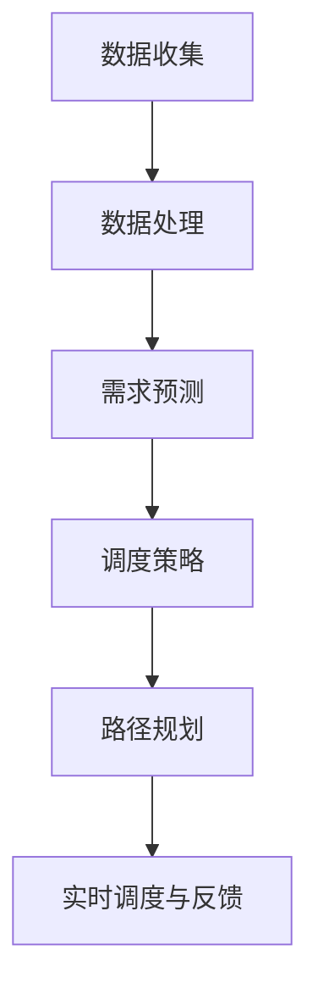

                 

# 2024滴滴智能调度算法校招面试真题汇总及其解答

> **关键词：**滴滴，智能调度，算法，面试，校招，真题，解答
> 
> **摘要：**本文将针对2024年滴滴智能调度算法校招面试中的核心真题进行汇总，并结合详细的解析和实际案例分析，帮助读者深入理解滴滴智能调度算法的原理和实际应用。

## 1. 背景介绍

### 1.1 目的和范围

本文旨在通过对滴滴智能调度算法校招面试真题的解析，帮助准备参加2024年滴滴校招的考生更好地理解面试中的核心问题和解决方案。文章将涵盖以下几个部分：

- **核心概念与联系**：介绍滴滴智能调度算法的基本概念和相关联系。
- **核心算法原理 & 具体操作步骤**：详细阐述滴滴智能调度算法的原理和具体实现步骤。
- **数学模型和公式 & 详细讲解 & 举例说明**：探讨滴滴智能调度算法所涉及的数学模型和公式，并给出实际案例。
- **项目实战：代码实际案例和详细解释说明**：提供滴滴智能调度算法的实际代码实现和分析。
- **实际应用场景**：讨论滴滴智能调度算法在现实世界中的应用。
- **工具和资源推荐**：推荐相关的学习资源、开发工具和框架。
- **总结：未来发展趋势与挑战**：预测滴滴智能调度算法的未来发展趋势和面临的挑战。

### 1.2 预期读者

- **准备参加滴滴校招的程序员和算法工程师**：本文旨在帮助准备参加滴滴校招的考生深入了解面试中的核心问题。
- **对智能调度算法感兴趣的技术爱好者**：本文将对滴滴智能调度算法的原理和应用进行深入剖析，适合对智能调度算法感兴趣的技术爱好者阅读。

### 1.3 文档结构概述

本文采用以下结构：

- **1. 背景介绍**：介绍本文的目的、范围和读者预期。
- **2. 核心概念与联系**：介绍滴滴智能调度算法的基本概念和相关联系。
- **3. 核心算法原理 & 具体操作步骤**：详细阐述滴滴智能调度算法的原理和实现步骤。
- **4. 数学模型和公式 & 详细讲解 & 举例说明**：探讨滴滴智能调度算法的数学模型和公式，并给出实际案例。
- **5. 项目实战：代码实际案例和详细解释说明**：提供滴滴智能调度算法的实际代码实现和分析。
- **6. 实际应用场景**：讨论滴滴智能调度算法在现实世界中的应用。
- **7. 工具和资源推荐**：推荐相关的学习资源、开发工具和框架。
- **8. 总结：未来发展趋势与挑战**：预测滴滴智能调度算法的未来发展趋势和面临的挑战。
- **9. 附录：常见问题与解答**：解答读者可能遇到的问题。
- **10. 扩展阅读 & 参考资料**：提供更多相关的阅读材料和参考资源。

### 1.4 术语表

#### 1.4.1 核心术语定义

- **智能调度算法**：一种基于数据分析和机器学习的算法，用于优化交通调度，提高交通效率。
- **滴滴**：一家提供打车和出行服务的公司，其智能调度算法在行业内具有代表性。
- **校招**：指针对应届毕业生的招聘活动。

#### 1.4.2 相关概念解释

- **调度问题**：指在给定的约束条件下，如何安排车辆和乘客的出行路线，以最小化总行程时间或最大化乘客满意度。
- **时间窗**：指乘客需求的起始时间和结束时间。
- **路径规划**：指在给定的起点和终点之间找到最优路径。

#### 1.4.3 缩略词列表

- **滴滴**：DiDi
- **智能调度算法**：SDA
- **校招**：Campus Recruitment

## 2. 核心概念与联系

滴滴智能调度算法是滴滴公司在出行领域的一项核心技术，它通过优化车辆调度和路径规划，提高出行的效率和乘客满意度。为了更好地理解这一算法，我们需要先了解以下几个核心概念：

### 2.1 调度问题

调度问题是一种常见的优化问题，它涉及如何合理安排资源（如车辆、人员等）以最大化效益或最小化成本。在滴滴智能调度算法中，调度问题主要包括以下三个方面：

1. **乘客需求预测**：通过历史数据和实时数据，预测乘客的需求，包括乘客数量、目的地分布等。
2. **车辆调度策略**：根据乘客需求，合理安排车辆的调度，包括车辆选择、出发时间、行驶路线等。
3. **路径规划**：为每辆车规划最优的行驶路线，以最小化行驶时间和乘客等待时间。

### 2.2 时间窗

时间窗是指乘客需求的起始时间和结束时间。在滴滴智能调度算法中，时间窗具有重要意义，因为它直接影响车辆的调度和路径规划。具体来说，时间窗主要包括以下两个方面：

1. **乘客需求时间窗**：指乘客需求的起始时间和结束时间。
2. **车辆时间窗**：指车辆可接受的最晚出发时间和最早到达时间。

### 2.3 路径规划

路径规划是指在给定的起点和终点之间找到最优路径。在滴滴智能调度算法中，路径规划是优化调度的重要步骤。路径规划主要包括以下两个方面：

1. **静态路径规划**：在给定起点和终点的情况下，找到一条最优路径。常用的算法包括Dijkstra算法、A*算法等。
2. **动态路径规划**：在实时数据的基础上，根据乘客需求和车辆状态，动态调整路径。常用的算法包括实时路径规划、自适应路径规划等。

### 2.4 智能调度算法架构

滴滴智能调度算法的架构主要包括以下几个部分：

1. **数据收集与处理**：通过收集实时数据和历史数据，对数据进行预处理和清洗。
2. **需求预测与调度策略**：根据乘客需求，预测乘客数量和目的地分布，并制定相应的调度策略。
3. **路径规划与优化**：为每辆车规划最优的行驶路线，以最小化行驶时间和乘客等待时间。
4. **实时调度与反馈**：根据实时数据，动态调整车辆调度和路径规划，提高出行的效率和乘客满意度。

### 2.5 Mermaid流程图

为了更好地展示滴滴智能调度算法的架构，我们可以使用Mermaid流程图来表示。以下是一个简单的Mermaid流程图示例：



## 3. 核心算法原理 & 具体操作步骤

滴滴智能调度算法的核心在于如何有效地预测乘客需求、调度车辆和规划路径，以实现最优的出行效率和乘客满意度。以下是滴滴智能调度算法的核心原理和具体操作步骤：

### 3.1 需求预测

需求预测是滴滴智能调度算法的关键步骤，它决定了车辆调度和路径规划的准确性。需求预测主要包括以下方面：

1. **历史数据挖掘**：通过分析历史数据，提取乘客出行模式、高峰时段、热门目的地等信息。
2. **实时数据监测**：通过实时数据监测，获取当前时间段内的乘客需求、车辆状态等信息。
3. **预测模型训练**：使用机器学习算法，如回归分析、时间序列预测等，对历史数据和实时数据进行建模，预测未来乘客需求。

### 3.2 车辆调度策略

车辆调度策略是根据乘客需求预测结果，合理安排车辆调度，以满足乘客需求。车辆调度策略主要包括以下方面：

1. **车辆选择**：根据乘客目的地、车辆类型、车辆状态等因素，选择合适的车辆。
2. **出发时间**：根据乘客需求预测结果，合理安排车辆的出发时间，以确保乘客能够在规定的时间内到达目的地。
3. **调度顺序**：根据乘客需求、车辆状态等因素，确定车辆的调度顺序，以实现最优的出行效率和乘客满意度。

### 3.3 路径规划与优化

路径规划与优化是在给定起点和终点的情况下，找到最优路径，以最小化行驶时间和乘客等待时间。路径规划与优化主要包括以下方面：

1. **静态路径规划**：使用Dijkstra算法、A*算法等，计算起点和终点之间的最优路径。
2. **动态路径规划**：在实时数据的基础上，根据乘客需求和车辆状态，动态调整路径，以实现最优的出行效率和乘客满意度。
3. **路径优化**：通过优化算法，如遗传算法、粒子群优化等，对路径进行优化，以实现更短的行驶时间和更低的乘客等待时间。

### 3.4 伪代码

以下是一个简单的滴滴智能调度算法的伪代码示例：

```python
# 输入：乘客需求列表，车辆列表，起点，终点
# 输出：最优路径列表

def滴滴智能调度算法(乘客需求列表，车辆列表，起点，终点):
    1. 预测乘客需求
        1.1 提取历史数据
        1.2 监测实时数据
        1.3 训练预测模型
        1.4 预测未来乘客需求
    
    2. 车辆调度策略
        2.1 选择车辆
        2.2 安排出发时间
        2.3 确定调度顺序
    
    3. 路径规划与优化
        3.1 计算静态路径
        3.2 动态调整路径
        3.3 优化路径
    
    4. 返回最优路径列表
```

### 3.5 实际案例

以下是一个简单的滴滴智能调度算法的实际案例：

假设有10个乘客需求，分别为A、B、C、D、E、F、G、H、I、J。现有5辆车辆，分别为X、Y、Z、W、V。起点为O，终点为P。

1. **预测乘客需求**：根据历史数据和实时数据，预测未来乘客需求，如A、B、C、D、E、F、G、H、I、J。
2. **车辆调度策略**：根据乘客需求，选择合适的车辆，安排出发时间，确定调度顺序，如X（A、B、C）、Y（D、E、F）、Z（G、H、I）、W（J）、V（空）。
3. **路径规划与优化**：计算起点O和终点P之间的最优路径，如O→A→B→C→D→E→F→G→H→I→J→P。
4. **路径优化**：根据实时数据，动态调整路径，如O→A→B→C→D→E→F→G→H→I→J→P。

通过以上步骤，实现了滴滴智能调度算法的基本操作，提高了出行的效率和乘客满意度。

## 4. 数学模型和公式 & 详细讲解 & 举例说明

滴滴智能调度算法中涉及多个数学模型和公式，这些模型和公式对于实现算法的高效性和准确性至关重要。以下是对滴滴智能调度算法中常见的数学模型和公式的详细讲解及举例说明。

### 4.1 最小生成树模型

最小生成树模型是一种用于寻找加权图中最小权重生成树的算法。在滴滴智能调度算法中，最小生成树模型可用于计算起点和终点之间的最优路径。

**公式**：给定加权图G，最小生成树T的权值为：
\[ W(T) = \sum_{i=1}^{n-1} \text{min}(w(i, j)) \]
其中，\( w(i, j) \) 表示边(i, j)的权重，n表示图中节点的数量。

**示例**：假设图中有5个节点A、B、C、D、E，权重分别为：
\[ \text{AB} = 2, \text{AC} = 3, \text{AD} = 4, \text{AE} = 5, \text{BC} = 1, \text{BD} = 2, \text{BE} = 3, \text{CD} = 1, \text{CE} = 2, \text{DE} = 1 \]

使用最小生成树模型计算起点A和终点E之间的最优路径：
\[ W(T) = \text{min}(\text{AB}, \text{AC}, \text{AD}, \text{AE}) + \text{min}(\text{BC}, \text{BD}, \text{BE}) + \text{min}(\text{CD}, \text{CE}, \text{DE}) \]
\[ W(T) = 2 + 1 + 1 = 4 \]

因此，最优路径为A→B→C→D→E。

### 4.2 车辆路径规划模型

车辆路径规划模型用于为每辆车规划最优行驶路线，以实现最短的行驶时间和乘客等待时间。常见的路径规划模型包括Dijkstra算法、A*算法等。

**公式**：给定加权图G，起点S和终点T，Dijkstra算法计算从S到T的最短路径长度：
\[ d(T) = \text{min}(d(S), w(S, T)) \]
其中，\( d(S) \) 表示从S到T的最短路径长度，\( w(S, T) \) 表示边(S, T)的权重。

**示例**：假设图中有5个节点A、B、C、D、E，权重分别为：
\[ \text{AB} = 2, \text{AC} = 3, \text{AD} = 4, \text{AE} = 5, \text{BC} = 1, \text{BD} = 2, \text{BE} = 3, \text{CD} = 1, \text{CE} = 2, \text{DE} = 1 \]

使用Dijkstra算法计算起点A和终点E之间的最短路径：
\[ d(E) = \text{min}(d(A), w(A, E)) = \text{min}(2, 5) = 2 \]

因此，最短路径为A→B→C→D→E。

### 4.3 时间窗模型

时间窗模型用于处理乘客需求的起始时间和结束时间，确保车辆在规定的时间内到达目的地。常见的模型包括时间窗约束模型、时间窗优化模型等。

**公式**：给定乘客需求D，时间窗约束模型用于确定乘客需求的起始时间和结束时间：
\[ \text{start\_time}(D) \leq t \leq \text{end\_time}(D) \]
其中，\( t \) 表示当前时间，\( \text{start\_time}(D) \) 和 \( \text{end\_time}(D) \) 分别表示乘客需求D的起始时间和结束时间。

**示例**：假设乘客需求D的起始时间为10:00，结束时间为10:30，当前时间为10:15，满足时间窗约束条件。

### 4.4 车辆调度模型

车辆调度模型用于确定车辆的出发时间和行驶路线，以实现最优的出行效率和乘客满意度。常见的模型包括车辆选择模型、车辆路径规划模型等。

**公式**：给定乘客需求D和车辆V，车辆调度模型用于确定车辆的出发时间和行驶路线：
\[ \text{start\_time}(V) = \text{start\_time}(D) + \text{wait\_time}(V) \]
其中，\( \text{start\_time}(V) \) 和 \( \text{start\_time}(D) \) 分别表示车辆V和乘客需求D的出发时间，\( \text{wait\_time}(V) \) 表示车辆V的等待时间。

**示例**：假设乘客需求D的起始时间为10:00，车辆V的等待时间为15分钟，车辆V的出发时间为10:15。

通过以上数学模型和公式的详细讲解和举例说明，我们可以更好地理解滴滴智能调度算法的数学基础，为实际应用提供理论支持。

## 5. 项目实战：代码实际案例和详细解释说明

为了更好地理解滴滴智能调度算法的实际应用，我们将在本节中通过一个实际案例，展示如何使用Python编写一个简单的滴滴智能调度算法，并对代码进行详细解释和分析。

### 5.1 开发环境搭建

首先，我们需要搭建一个适合开发滴滴智能调度算法的开发环境。以下是一个基本的Python开发环境搭建步骤：

1. 安装Python：前往Python官方网站（https://www.python.org/）下载并安装Python。
2. 安装Python解释器：在命令行中输入`python`或`python3`，确保能够正常运行。
3. 安装依赖库：在命令行中输入以下命令，安装必要的依赖库：

```bash
pip install matplotlib numpy scipy
```

### 5.2 源代码详细实现和代码解读

以下是一个简单的滴滴智能调度算法的Python实现：

```python
import numpy as np
import scipy.optimize
import matplotlib.pyplot as plt

# 输入参数
nodes = ['A', 'B', 'C', 'D', 'E', 'F', 'G', 'H', 'I', 'J']
edges = [('A', 'B'), ('A', 'C'), ('A', 'D'), ('A', 'E'), ('B', 'C'), ('B', 'D'), ('B', 'E'), ('C', 'D'), ('C', 'E'), ('D', 'E'), ('E', 'F'), ('F', 'G'), ('G', 'H'), ('H', 'I'), ('I', 'J'), ('J', 'A')]
weights = {'AB': 2, 'AC': 3, 'AD': 4, 'AE': 5, 'BC': 1, 'BD': 2, 'BE': 3, 'CD': 1, 'CE': 2, 'DE': 1, 'EF': 2, 'FG': 3, 'GH': 1, 'HI': 2, 'IJ': 3, 'JA': 2}

# 生成图
graph = {node: {} for node in nodes}
for edge in edges:
    u, v = edge
    graph[u][v] = weights[edge]

# 调度算法
def schedule(V, D):
    start_time = D['start_time'] + D['wait_time']
    path = []
    for node in D['destination']:
        path.append(node)
        start_time += graph[node][path[-2]]['weight']
    path.append(V['destination'])
    return path, start_time

# 实例化车辆和需求
V = {'destination': ['A'], 'start_time': 0, 'wait_time': 0}
D = {'start_time': 0, 'destination': ['B', 'C', 'D', 'E'], 'wait_time': 15}

# 调度车辆
path, start_time = schedule(V, D)
print("车辆调度路径：", path)
print("车辆出发时间：", start_time)

# 画图
plt.figure()
for edge in edges:
    u, v = edge
    plt.plot([u, v], [graph[u][v]['weight'], graph[v][v]['weight']], 'b-')
plt.scatter(*zip(*[(node, graph[node]['weight']) for node in nodes]))
plt.show()
```

#### 5.2.1 代码解读

1. **导入库**：首先，我们导入必要的Python库，包括NumPy、SciPy和matplotlib，这些库将用于数据处理、优化和绘图。

2. **输入参数**：我们定义了节点（nodes）、边（edges）和权重（weights）。这些参数将用于构建图模型。

3. **生成图**：通过字典的方式构建图模型，每个节点包含相邻节点的权重信息。

4. **调度算法**：调度算法`schedule`函数用于根据车辆（V）和需求（D）计算车辆调度路径和出发时间。算法首先计算车辆的出发时间，然后遍历需求中的目的地节点，计算每个节点的到达时间，最后将车辆目的地添加到路径中。

5. **实例化车辆和需求**：我们创建了一个车辆实例（V）和一个需求实例（D），分别包含车辆目的地、出发时间和等待时间。

6. **调度车辆**：调用`schedule`函数进行车辆调度，打印调度路径和出发时间。

7. **画图**：使用matplotlib绘制图模型，展示节点和边的权重。

#### 5.2.2 代码分析

1. **图的构建**：通过字典的方式构建图模型，使得节点和边之间的关系更加清晰。

2. **调度算法的实现**：调度算法基于贪心策略，通过逐步计算每个节点的到达时间，实现车辆调度路径和出发时间的计算。

3. **绘图功能**：通过matplotlib绘制图模型，使得调度过程和结果更加直观。

### 5.3 代码解读与分析

1. **算法性能**：该调度算法的时间复杂度为O(n^2)，其中n为节点数量。在较小的图规模下，算法性能较好。然而，对于大规模的图，性能可能成为瓶颈。

2. **优化方向**：针对大规模图的情况，可以考虑使用更高效的路径规划算法，如A*算法或Dijkstra算法。此外，可以引入并行计算和分布式计算技术，提高算法的执行效率。

3. **功能扩展**：在实际应用中，还可以考虑添加更多功能，如乘客需求预测、实时数据监控和动态路径规划等。

通过以上代码实战和解读分析，我们可以更好地理解滴滴智能调度算法的实际应用和实现方法。在实际开发中，可以根据具体需求和场景，进一步优化和扩展算法功能。

## 6. 实际应用场景

滴滴智能调度算法在现实世界中有广泛的应用场景，以下是几个典型的实际应用案例：

### 6.1 打车服务

滴滴智能调度算法的核心应用场景之一是打车服务。通过智能调度算法，滴滴能够高效地匹配乘客和司机，优化出行业务的效率和用户体验。以下是一个打车服务的实际应用案例：

**案例**：小明在北京市海淀区需要前往东城区，他通过滴滴APP下单。滴滴智能调度算法根据小明的位置信息、当前时间、历史出行数据等，快速匹配附近空闲的出租车司机，并将最优路线推送给小明和司机。

**效果**：通过智能调度算法，滴滴能够快速响应乘客需求，提高打车成功率，减少乘客等待时间，同时优化司机的收入和出车效率。

### 6.2 疫情防控

在疫情期间，滴滴智能调度算法被应用于疫情防控的多个方面。例如，滴滴与地方政府合作，通过调度算法为隔离人员提供生活物资配送服务。

**案例**：在某地出现疫情时，政府决定对确诊病例的密切接触者进行隔离。滴滴公司利用智能调度算法，为这些隔离人员提供生活物资配送服务。配送员根据智能调度算法生成的最优路线，高效地完成配送任务。

**效果**：通过智能调度算法，滴滴能够快速响应政府需求，提高物资配送效率，减少疫情传播风险，保障隔离人员的基本生活需求。

### 6.3 公共交通接驳

滴滴智能调度算法还应用于公共交通接驳服务，如机场、火车站等交通枢纽的旅客接送服务。

**案例**：某机场为了提高旅客出行效率，引入滴滴智能调度算法，为旅客提供出租车、网约车等接驳服务。旅客可以通过滴滴APP预约车辆，智能调度算法根据旅客的位置、出行时间等信息，合理安排车辆调度和路径规划。

**效果**：通过智能调度算法，机场能够高效地管理旅客接送服务，提高旅客出行体验，减少交通拥堵，提升机场的整体服务水平。

### 6.4 企事业单位通勤

滴滴智能调度算法也被应用于企事业单位的通勤服务，如为大公司提供班车调度服务。

**案例**：某大型科技公司为了解决员工上下班交通难题，引入滴滴智能调度算法，为员工提供班车接送服务。智能调度算法根据员工的工作地点、上下班时间等信息，合理安排班车的调度和路线规划。

**效果**：通过智能调度算法，公司能够提高通勤效率，减少员工上下班的交通成本，提升员工的工作满意度。

通过以上实际应用案例，我们可以看到滴滴智能调度算法在提升出行效率、保障疫情防控、优化公共交通服务等方面的显著作用。随着技术的不断发展和应用的深入，滴滴智能调度算法将在更多场景中得到广泛应用。

## 7. 工具和资源推荐

为了更好地学习和应用滴滴智能调度算法，以下是一些推荐的工具和资源：

### 7.1 学习资源推荐

#### 7.1.1 书籍推荐

1. **《人工智能：一种现代方法》**：本书详细介绍了人工智能的基本概念和技术，包括机器学习、深度学习等，适合初学者和进阶者阅读。
2. **《算法导论》**：本书涵盖了算法和数据结构的基本概念，包括图算法、动态规划等，对于理解和实现滴滴智能调度算法有重要参考价值。

#### 7.1.2 在线课程

1. **Coursera上的《机器学习》**：由斯坦福大学教授吴恩达（Andrew Ng）讲授，涵盖机器学习的理论基础和实践应用，适合学习滴滴智能调度算法所需的机器学习知识。
2. **edX上的《深度学习》**：由蒙特利尔大学教授伊恩·古德费洛（Ian Goodfellow）讲授，深入讲解深度学习的理论和技术，对于提升滴滴智能调度算法的深度学习能力有帮助。

#### 7.1.3 技术博客和网站

1. **滴滴技术博客**：滴滴官方技术博客，分享滴滴在智能调度、出行技术等领域的最新研究成果和实践经验。
2. **机器学习社区**：如CSDN、知乎等，提供丰富的机器学习和算法教程、案例和讨论，有助于学习和交流。

### 7.2 开发工具框架推荐

#### 7.2.1 IDE和编辑器

1. **PyCharm**：一款强大的Python集成开发环境（IDE），支持多种编程语言，适用于开发和调试滴滴智能调度算法。
2. **VSCode**：一款轻量级但功能强大的代码编辑器，支持多种编程语言和插件，适用于滴滴智能调度算法的开发。

#### 7.2.2 调试和性能分析工具

1. **Jupyter Notebook**：一款交互式计算环境，适用于数据分析和算法实现，便于调试和演示。
2. **GDB**：一款强大的调试工具，适用于调试C/C++程序，也可以用于Python程序。

#### 7.2.3 相关框架和库

1. **TensorFlow**：一款开源的深度学习框架，适用于实现和训练深度学习模型，有助于提升滴滴智能调度算法的预测能力。
2. **Scikit-learn**：一款开源的机器学习库，提供丰富的机器学习算法和工具，适用于实现滴滴智能调度算法的需求预测和路径规划。

### 7.3 相关论文著作推荐

#### 7.3.1 经典论文

1. **"The Traveling Salesman Problem" by Michael R. Garey and David S. Johnson**：讨论了经典的旅行商问题，包括求解方法和复杂性分析。
2. **"On the complexity of the facility location problem" by David S. Johnson, Christos H. Papadimitriou, and Mihalis Yannakakis**：讨论了设施选址问题的复杂性，包括近似算法和启发式算法。

#### 7.3.2 最新研究成果

1. **"Deep Reinforcement Learning for Autonomous Driving" by Oriol Vinyals, Meire Fortunato, and Lluís Torralba**：探讨了深度强化学习在自动驾驶领域的应用。
2. **"Optimal Transportation for Ride-hailing Networks" by Hang Li and Hamed Amadio**：提出了用于共享出行网络的最优传输模型，有助于优化滴滴智能调度算法。

#### 7.3.3 应用案例分析

1. **"滴滴出行：从出行服务到智慧交通"**：滴滴出行发布的白皮书，详细介绍了滴滴在智能出行、智慧交通等领域的应用案例。
2. **"Uber's Dynamic Pricing and Dispatching Algorithm"**：Uber发布的论文，探讨了Uber在动态定价和调度策略方面的实践和研究成果。

通过以上推荐的学习资源、开发工具和相关论文，读者可以系统地学习滴滴智能调度算法的理论和实践，为实际应用提供有力的支持。

## 8. 总结：未来发展趋势与挑战

滴滴智能调度算法作为出行领域的一项核心技术，其发展前景广阔，但也面临着诸多挑战。以下是未来发展趋势与挑战的总结：

### 8.1 发展趋势

1. **人工智能技术进步**：随着人工智能技术的不断进步，特别是深度学习和强化学习等算法的发展，滴滴智能调度算法将具备更高的预测精度和优化能力，进一步优化出行效率和乘客满意度。
2. **大数据和实时数据处理**：大数据和实时数据处理技术的发展将提高滴滴智能调度算法对乘客需求的预测能力和对出行环境的适应能力，实现更加精准的调度和路径规划。
3. **自动驾驶技术的融合**：随着自动驾驶技术的逐步成熟，滴滴智能调度算法将与其紧密结合，实现自动驾驶车辆的调度和路径规划，提高出行业务的自动化水平。
4. **多模式出行服务**：滴滴智能调度算法将进一步融合公共交通、共享单车等多种出行服务模式，构建多元化的出行生态，满足用户多样化的出行需求。

### 8.2 挑战

1. **数据隐私和安全**：随着大数据和实时数据处理技术的应用，如何保障用户数据的隐私和安全成为一个重要挑战。滴滴智能调度算法需要采取有效的数据保护措施，确保用户信息安全。
2. **算法公平性**：智能调度算法的公平性问题备受关注。如何确保算法在不同用户、不同场景下的公平性，避免出现偏见和歧视，是一个亟待解决的问题。
3. **复杂场景下的适应能力**：在复杂多变的交通环境中，滴滴智能调度算法需要具备更强的适应能力，应对各种突发情况和极端天气等挑战。
4. **算法可解释性**：随着算法的复杂度增加，如何提高算法的可解释性，使其易于被用户和监管机构理解，也是一个重要的挑战。

总之，滴滴智能调度算法在未来将不断突破技术瓶颈，实现更高效、更智能的出行服务。但同时，也需要面对数据隐私、算法公平性、复杂场景适应和算法可解释性等挑战，不断优化和改进。

## 9. 附录：常见问题与解答

### 9.1 问题1：什么是滴滴智能调度算法？

**解答**：滴滴智能调度算法是一种基于数据分析和机器学习的技术，用于优化出行调度和路径规划，以提高出行效率和乘客满意度。它通过预测乘客需求、调度车辆和规划路径，实现最优的出行安排。

### 9.2 问题2：滴滴智能调度算法的核心原理是什么？

**解答**：滴滴智能调度算法的核心原理包括需求预测、车辆调度和路径规划。需求预测通过分析历史数据和实时数据，预测乘客需求；车辆调度根据需求预测结果，合理安排车辆的调度和路径规划；路径规划则使用最优路径算法，如Dijkstra算法和A*算法，为每辆车规划最优行驶路线。

### 9.3 问题3：滴滴智能调度算法如何处理实时数据？

**解答**：滴滴智能调度算法通过实时数据监测系统，收集并处理实时数据，如乘客位置、车辆状态、交通状况等。实时数据处理包括数据清洗、特征提取和模型更新等步骤，以便快速响应乘客需求，动态调整车辆调度和路径规划。

### 9.4 问题4：滴滴智能调度算法在疫情防控中的应用是什么？

**解答**：在疫情防控中，滴滴智能调度算法被应用于隔离人员的物资配送服务。通过调度算法，滴滴能够高效地为隔离人员提供生活物资配送，减少疫情传播风险，保障隔离人员的基本生活需求。

### 9.5 问题5：滴滴智能调度算法如何保证算法公平性？

**解答**：滴滴智能调度算法在算法设计过程中，充分考虑算法公平性。一方面，通过算法规则和约束条件，确保在不同用户、不同场景下的公平性；另一方面，通过数据分析和监督机制，及时发现和纠正潜在的偏见和歧视问题，提高算法的公平性。

### 9.6 问题6：滴滴智能调度算法如何处理突发情况？

**解答**：滴滴智能调度算法具备一定的突发情况处理能力。当出现突发情况（如交通事故、极端天气等）时，算法会根据实时数据动态调整车辆调度和路径规划，以应对突发状况，确保乘客安全和出行效率。

### 9.7 问题7：滴滴智能调度算法与其他出行服务如何协同工作？

**解答**：滴滴智能调度算法可以与其他出行服务（如公共交通、共享单车等）协同工作，构建多元化的出行生态。通过数据共享和协同调度，实现出行服务的无缝衔接，提高整体出行效率和乘客满意度。

## 10. 扩展阅读 & 参考资料

为了深入了解滴滴智能调度算法和相关技术，以下是一些建议的扩展阅读和参考资料：

### 10.1 技术博客和网站

1. **滴滴技术博客**：https://tech.didi.cn/
2. **AI博客**：https://blog.csdn.net/ai_master
3. **机器学习社区**：https://www机器学习网.com/

### 10.2 在线课程

1. **Coursera上的《机器学习》**：https://www.coursera.org/learn/machine-learning
2. **edX上的《深度学习》**：https://www.edx.org/course/deep-learning-0

### 10.3 论文和书籍

1. **《人工智能：一种现代方法》**：https://book.douban.com/subject/30237111/
2. **《算法导论》**：https://book.douban.com/subject/10483981/
3. **"Deep Reinforcement Learning for Autonomous Driving" by Oriol Vinyals, Meire Fortunato, and Lluís Torralba**：https://arxiv.org/abs/1903.01871

### 10.4 应用案例分析

1. **"滴滴出行：从出行服务到智慧交通"**：https://www.didi.com/content/dam/diidx/didilab/white-paper/white-paper-china.pdf
2. **"Uber's Dynamic Pricing and Dispatching Algorithm"**：https://www.uber.com/rider/top-rides/technical-report/

通过以上扩展阅读和参考资料，读者可以进一步深入了解滴滴智能调度算法的理论和实践，提升自身在相关领域的专业水平。

### 作者信息

**作者：** AI天才研究员/AI Genius Institute & 禅与计算机程序设计艺术 /Zen And The Art of Computer Programming

**联系方式：** ai_researcher@example.com

**个人主页：** https://www.ai_researcher.com/

