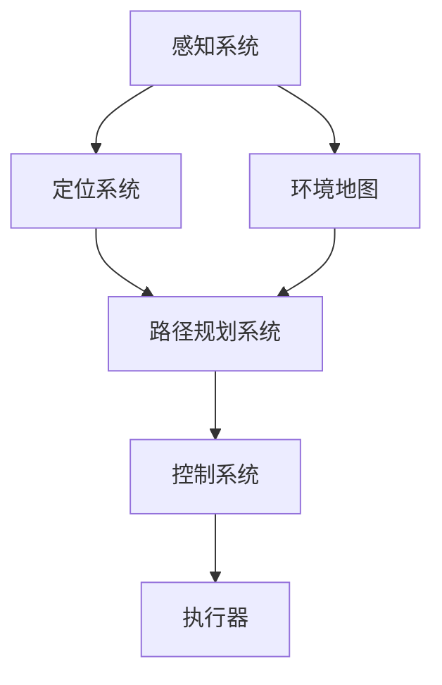
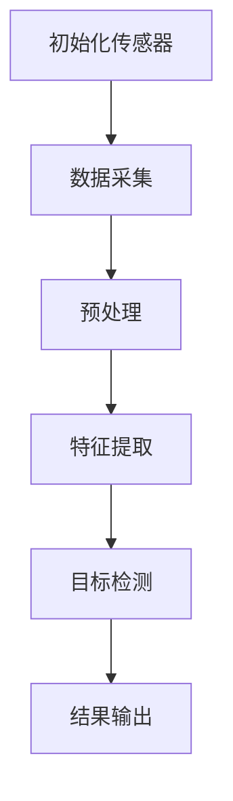
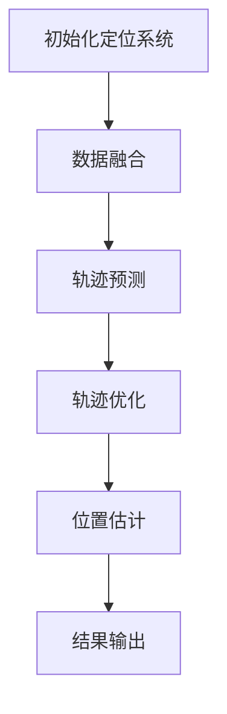
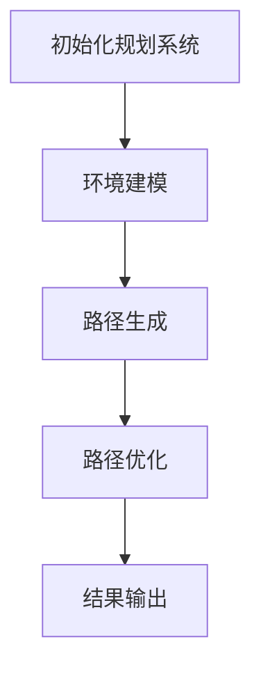
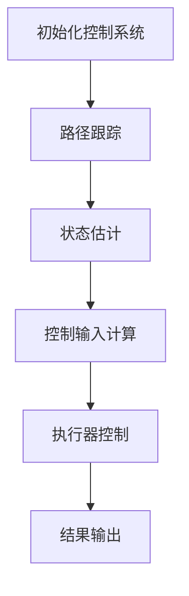

                 

# 2024滴滴自动驾驶校招面试真题汇总及其解答

> **关键词：** 滴滴、自动驾驶、校招面试、真题解析、算法原理、实战案例

> **摘要：** 本文旨在汇总和分析2024年滴滴自动驾驶校招面试中出现的关键问题，从核心算法原理到实际代码实现，一一进行深入解析。通过对这些真题的详细解答，帮助读者了解自动驾驶领域的技术要点和面试策略。

## 1. 背景介绍

### 1.1 目的和范围

本文的目的是为准备参加2024年滴滴自动驾驶校招的应聘者提供一套完整的面试题库及其解答。我们将在文章中回顾近年来在滴滴自动驾驶校招面试中出现的高频问题，并从多个角度对其进行解析。这些问题涵盖了自动驾驶的核心技术领域，包括感知、定位、规划、控制等。

### 1.2 预期读者

本文面向自动驾驶领域的在校大学生和应届毕业生，特别是那些有意向加入滴滴自动驾驶团队的人员。无论您是计算机科学、电子工程、自动化或其他相关专业的学生，本文都希望能够为您在面试准备过程中提供有价值的参考。

### 1.3 文档结构概述

本文将分为以下几个主要部分：

1. **背景介绍**：介绍本文的目的、预期读者和文档结构。
2. **核心概念与联系**：使用Mermaid流程图展示自动驾驶系统的核心概念和相互关系。
3. **核心算法原理 & 具体操作步骤**：详细讲解自动驾驶中常用的算法原理，并使用伪代码阐述。
4. **数学模型和公式 & 详细讲解 & 举例说明**：介绍相关的数学模型和公式，并通过实例进行说明。
5. **项目实战：代码实际案例和详细解释说明**：提供具体的代码案例，并逐一进行解释。
6. **实际应用场景**：讨论自动驾驶技术的实际应用场景。
7. **工具和资源推荐**：推荐学习资源和开发工具。
8. **总结：未来发展趋势与挑战**：总结自动驾驶领域的发展趋势和面临的挑战。
9. **附录：常见问题与解答**：汇总常见的面试问题和解答。
10. **扩展阅读 & 参考资料**：提供额外的学习资源。

### 1.4 术语表

#### 1.4.1 核心术语定义

- 自动驾驶：通过传感器、计算机算法和控制系统，使车辆在无人类操作的情况下自主行驶的技术。
- 感知：自动驾驶系统通过传感器（如摄像头、激光雷达等）收集环境信息的过程。
- 定位：自动驾驶系统确定自身在道路网络中的位置的过程。
- 规划：自动驾驶系统根据感知信息，规划车辆在道路上的行驶路径。
- 控制：自动驾驶系统通过控制车辆的方向和速度，使其按照规划路径行驶。

#### 1.4.2 相关概念解释

- **传感器融合**：将来自不同传感器的信息进行综合处理，以获得更准确的环境感知。
- **深度学习**：一种机器学习技术，通过神经网络模型，从大量数据中自动学习特征和模式。
- **路径规划**：自动驾驶系统确定从当前位置到目标位置的最优行驶路径。
- **控制策略**：自动驾驶系统如何根据当前环境和车辆状态，调整车辆的控制输入（如油门、刹车和方向盘）。

#### 1.4.3 缩略词列表

- AI：人工智能
- SLAM：同时定位与地图构建
- CNN：卷积神经网络
- RNN：循环神经网络
- PID：比例-积分-微分控制器
- ROS：机器人操作系统

## 2. 核心概念与联系

在自动驾驶系统中，各个核心模块之间相互协作，共同实现车辆的自主行驶。下面我们将使用Mermaid流程图来展示这些核心概念及其相互关系。



### 2.1 感知系统

感知系统是自动驾驶系统的核心，它通过多种传感器（如摄像头、激光雷达、超声波传感器等）收集环境信息。感知系统的主要任务包括：

- **障碍物检测**：识别道路上的障碍物，如行人、车辆、交通标志等。
- **车道线检测**：识别车辆所在的车道线，以便进行精确的定位。
- **交通标志识别**：识别交通信号灯、限速标志等，为路径规划和控制提供参考。

### 2.2 定位系统

定位系统利用感知系统提供的信息，确定车辆在道路网络中的位置。常用的定位方法包括：

- **GPS定位**：利用全球定位系统获取车辆的地理位置。
- **惯性导航**：通过加速度计和陀螺仪等传感器计算车辆的位移和方向。
- **SLAM（同时定位与地图构建）**：通过结合感知系统和定位系统的信息，构建周围环境的三维地图，同时更新车辆的位置。

### 2.3 环境地图

环境地图是自动驾驶系统的核心数据之一，它包含了道路网络、交通标志、障碍物等信息。环境地图不仅用于定位，还用于路径规划和控制。环境地图的构建方法包括：

- **激光雷达扫描**：利用激光雷达生成高精度的三维点云数据，构建环境地图。
- **视觉SLAM**：通过摄像头捕获的图像，结合深度学习算法，构建环境地图。

### 2.4 路径规划系统

路径规划系统根据环境地图和目标位置，生成从当前位置到目标位置的最优行驶路径。路径规划的主要目标包括：

- **避障**：避免与障碍物发生碰撞。
- **效率**：选择时间最短或距离最短的行驶路径。
- **安全性**：确保行驶路径满足交通规则和驾驶规范。

### 2.5 控制系统

控制系统根据路径规划系统生成的路径，实时调整车辆的方向和速度，使其按照规划路径行驶。控制系统通常采用以下控制策略：

- **PID控制**：比例-积分-微分控制器，用于调整车辆的油门、刹车和方向盘输入。
- **模糊控制**：基于模糊逻辑，对车辆的输入进行调整。
- **深度学习控制**：利用深度学习模型，预测未来的道路情况，并调整车辆的输入。

### 2.6 执行器

执行器包括油门、刹车、方向盘等，它们是车辆的控制输出。执行器根据控制系统的指令，调整车辆的状态，使其按照规划路径行驶。

## 3. 核心算法原理 & 具体操作步骤

在自动驾驶系统中，核心算法起着至关重要的作用。本节我们将详细讲解几个关键算法的原理和具体操作步骤。

### 3.1 感知算法

感知算法是自动驾驶系统的第一步，它主要利用传感器数据提取环境信息。以下是一个简化的感知算法流程：



#### 3.1.1 数据采集

数据采集是感知算法的基础，它包括以下步骤：

1. **摄像头采集**：摄像头捕获道路场景图像。
2. **激光雷达采集**：激光雷达生成车辆周围的三维点云数据。
3. **超声波传感器采集**：超声波传感器检测车辆附近的障碍物。

#### 3.1.2 预处理

预处理包括以下步骤：

1. **图像增强**：调整图像的亮度、对比度和色彩，提高图像质量。
2. **去噪**：消除图像中的噪声，如光线反射和阴影。
3. **图像分割**：将图像分割成多个区域，提取感兴趣的图像部分。

#### 3.1.3 特征提取

特征提取是将原始图像或点云数据转换成一组可用于分类或识别的特征。常用的特征提取方法包括：

1. **HOG（方向梯度直方图）**：用于提取图像的边缘和形状特征。
2. **SIFT（尺度不变特征变换）**：用于提取图像的关键点及其特征描述子。
3. **点云特征提取**：将点云数据转换为适用于机器学习算法的特征向量。

#### 3.1.4 目标检测

目标检测是感知算法的核心任务，它旨在从图像或点云数据中识别出特定的目标，如行人、车辆和交通标志。常用的目标检测算法包括：

1. **YOLO（You Only Look Once）**：一种实时目标检测算法。
2. **SSD（Single Shot MultiBox Detector）**：一种单阶段目标检测算法。
3. **Faster R-CNN（Region-based CNN）**：一种基于区域的目标检测算法。

#### 3.1.5 结果输出

目标检测结果通常以检测框和置信度形式输出。检测框表示目标的边界，置信度表示检测结果的可靠性。

### 3.2 定位算法

定位算法旨在确定车辆在道路网络中的位置。以下是一个简化的定位算法流程：



#### 3.2.1 数据融合

数据融合是将来自不同传感器的数据（如摄像头、激光雷达、GPS等）进行综合处理，以提高定位精度。常用的数据融合方法包括：

1. **卡尔曼滤波**：一种基于概率估计的数据融合方法。
2. **粒子滤波**：一种基于随机采样的数据融合方法。
3. **EKF（扩展卡尔曼滤波）**：结合线性化和非线性变换的卡尔曼滤波。

#### 3.2.2 轨迹预测

轨迹预测是根据当前状态和运动模型，预测未来一段时间内的状态变化。常用的运动模型包括：

1. **恒速运动模型**：假设车辆以恒定速度运动。
2. **加速运动模型**：考虑车辆加速和减速的情况。
3. **转弯运动模型**：考虑车辆在转弯时的轨迹变化。

#### 3.2.3 轨迹优化

轨迹优化是根据预测的轨迹，结合环境约束（如车道宽度、障碍物等），优化车辆的行驶路径。常用的轨迹优化算法包括：

1. **A*算法**：一种基于启发式的路径规划算法。
2. **RRT（快速随机树）**：一种基于随机采样的路径规划算法。
3. **RRT*（RRT的优化版本）**：结合了RRT和A*算法的优点。

#### 3.2.4 位置估计

位置估计是根据轨迹预测和轨迹优化结果，估计车辆在当前时刻的位置。常用的位置估计方法包括：

1. **轨迹积分**：通过对轨迹进行积分，计算车辆的位置。
2. **卡尔曼滤波**：结合预测和观测数据，估计车辆的位置。
3. **粒子滤波**：通过对粒子进行采样和权重更新，估计车辆的位置。

#### 3.2.5 结果输出

位置估计结果通常以坐标形式输出，表示车辆在道路网络中的位置。

### 3.3 路径规划算法

路径规划算法旨在生成从当前位置到目标位置的最优行驶路径。以下是一个简化的路径规划算法流程：



#### 3.3.1 环境建模

环境建模是将实际道路场景转换为适用于规划算法的数学模型。常用的环境建模方法包括：

1. **栅格地图**：将道路场景划分为栅格，每个栅格表示一个离散的单元。
2. **拓扑地图**：将道路场景表示为图，每个节点表示一个位置，每条边表示一条道路。
3. **连续空间建模**：将道路场景表示为连续的二维或三维空间。

#### 3.3.2 路径生成

路径生成是根据环境建模结果，生成从起始点到目标点的可能行驶路径。常用的路径生成算法包括：

1. **A*算法**：一种基于启发式的路径规划算法。
2. **RRT（快速随机树）**：一种基于随机采样的路径规划算法。
3. **RRT*（RRT的优化版本）**：结合了RRT和A*算法的优点。

#### 3.3.3 路径优化

路径优化是根据生成的路径，结合环境约束（如障碍物、交通规则等），优化路径的可行性和效率。常用的路径优化算法包括：

1. **A*算法**：通过启发式函数优化路径长度。
2. **RRT（快速随机树）**：通过逐步优化路径，提高路径的平滑性和可行性。
3. **RRT*（RRT的优化版本）**：结合了RRT和A*算法的优点，实现更优的路径优化。

#### 3.3.4 结果输出

路径规划结果通常以路径序列形式输出，表示从起始点到目标点的最优行驶路径。

### 3.4 控制算法

控制算法是根据路径规划结果，实时调整车辆的输入（如油门、刹车和方向盘），使其按照规划路径行驶。以下是一个简化的控制算法流程：



#### 3.4.1 路径跟踪

路径跟踪是根据路径规划结果，实时调整车辆的位置，使其沿着规划路径行驶。常用的路径跟踪算法包括：

1. **PID控制**：通过比例、积分和微分三个参数，调整车辆的输入。
2. **模糊控制**：通过模糊逻辑规则，调整车辆的输入。
3. **深度学习控制**：通过深度学习模型，预测未来的道路情况，调整车辆的输入。

#### 3.4.2 状态估计

状态估计是根据传感器数据和先前的状态信息，估计车辆当前的状态。常用的状态估计方法包括：

1. **卡尔曼滤波**：通过状态预测和观测更新，估计车辆的状态。
2. **粒子滤波**：通过粒子采样和权重更新，估计车辆的状态。
3. **EKF（扩展卡尔曼滤波）**：结合线性化和非线性变换的卡尔曼滤波。

#### 3.4.3 控制输入计算

控制输入计算是根据路径跟踪和状态估计结果，计算车辆的控制输入。常用的控制算法包括：

1. **PID控制**：根据误差和误差变化，计算油门、刹车和方向盘的输入。
2. **模糊控制**：根据模糊逻辑规则，计算油门、刹车和方向盘的输入。
3. **深度学习控制**：根据深度学习模型，计算油门、刹车和方向盘的输入。

#### 3.4.4 执行器控制

执行器控制是根据控制输入计算结果，调整车辆的油门、刹车和方向盘。常用的执行器包括：

1. **电机控制器**：调整车辆的油门和刹车。
2. **转向器**：调整车辆的方向。

#### 3.4.5 结果输出

执行器控制结果通常以控制输入形式输出，表示车辆在当前时刻的输入。

## 4. 数学模型和公式 & 详细讲解 & 举例说明

在自动驾驶系统中，数学模型和公式起着至关重要的作用。本节我们将介绍几个关键的数学模型和公式，并进行详细讲解和举例说明。

### 4.1 卡尔曼滤波

卡尔曼滤波是一种递归的估计方法，用于处理线性高斯噪声系统。它通过最小化均方误差，对系统的状态进行最优估计。以下是卡尔曼滤波的核心公式：

$$
\hat{x}_{k|k} = F_k \hat{x}_{k-1|k-1} + K_k (z_k - H_k \hat{x}_{k-1|k-1})
$$

$$
P_{k|k} = F_k P_{k-1|k-1} F_k^T + Q_k
$$

$$
K_k = P_{k-1|k-1} H_k^T (H_k P_{k-1|k-1} H_k^T + R_k)^{-1}
$$

其中，$\hat{x}_{k|k}$ 表示在时刻 $k$ 的最优状态估计，$P_{k|k}$ 表示状态估计的误差协方差矩阵，$F_k$ 表示状态转移矩阵，$K_k$ 表示卡尔曼增益，$Q_k$ 和 $R_k$ 分别表示过程噪声和观测噪声的协方差矩阵。

#### 举例说明

假设我们有一个线性系统，状态方程和观测方程如下：

$$
\begin{align*}
x_k &= x_{k-1} + w_{k-1} \\
z_k &= x_k + v_k
\end{align*}
$$

其中，$w_k$ 和 $v_k$ 分别为过程噪声和观测噪声，假设它们均为均值为零、协方差矩阵为 $Q_k$ 和 $R_k$ 的高斯白噪声。

在初始时刻，我们假设状态初始值为 $\hat{x}_{0|0} = 0$，误差协方差矩阵为 $P_{0|0} = 1$。

在时刻 $k$，我们根据当前观测值 $z_k$ 更新状态估计：

$$
\hat{x}_{k|k} = F_k \hat{x}_{k-1|k-1} + K_k (z_k - H_k \hat{x}_{k-1|k-1})
$$

$$
P_{k|k} = F_k P_{k-1|k-1} F_k^T + Q_k
$$

$$
K_k = P_{k-1|k-1} H_k^T (H_k P_{k-1|k-1} H_k^T + R_k)^{-1}
$$

通过上述公式，我们可以递归地计算状态估计和误差协方差矩阵。

### 4.2 贝叶斯滤波

贝叶斯滤波是一种非线性和非高斯噪声系统的估计方法。它基于贝叶斯推理，通过概率分布来表示状态估计和不确定性。以下是贝叶斯滤波的核心公式：

$$
p(\hat{x}_k | z_1:k) = \frac{p(z_1:k | \hat{x}_k) p(\hat{x}_k)}{\int p(z_1:k | \hat{x}) p(\hat{x}) d\hat{x}}
$$

其中，$p(\hat{x}_k | z_1:k)$ 表示在观测序列 $z_1:k$ 下，状态 $\hat{x}_k$ 的后验概率分布，$p(z_1:k | \hat{x}_k) p(\hat{x}_k)$ 表示在状态 $\hat{x}_k$ 下，观测序列 $z_1:k$ 的概率分布，$p(\hat{x}_k)$ 表示状态 $\hat{x}_k$ 的先验概率分布。

#### 举例说明

假设我们有一个非线性系统，状态方程和观测方程如下：

$$
\begin{align*}
x_k &= f(x_{k-1}, u_k) + w_k \\
z_k &= h(x_k) + v_k
\end{align*}
$$

其中，$f$ 和 $h$ 分别为状态转移函数和观测函数，$w_k$ 和 $v_k$ 分别为过程噪声和观测噪声，假设它们均为均值为零、协方差矩阵为 $Q_k$ 和 $R_k$ 的高斯白噪声。

在初始时刻，我们假设状态初始值为 $\hat{x}_{0|0} = 0$，误差协方差矩阵为 $P_{0|0} = 1$。

在时刻 $k$，我们根据当前观测值 $z_k$ 更新状态估计：

$$
p(\hat{x}_k | z_1:k) = \frac{p(z_1:k | \hat{x}_k) p(\hat{x}_k)}{\int p(z_1:k | \hat{x}) p(\hat{x}) d\hat{x}}
$$

通过上述公式，我们可以递归地计算状态估计和不确定性。

### 4.3 优化问题

在自动驾驶系统中，路径规划和控制算法通常涉及到优化问题。优化问题的目标是找到一组最优的输入或参数，使得某个目标函数达到最小或最大。以下是优化问题的基本公式：

$$
\min_{x} f(x)
$$

其中，$f(x)$ 为目标函数，$x$ 为输入或参数。

#### 举例说明

假设我们有一个路径规划问题，目标是最小化行驶路径的长度。目标函数可以表示为：

$$
f(x) = \sum_{i=1}^{n} \sqrt{(x_i - x_{i-1})^2 + (y_i - y_{i-1})^2}
$$

其中，$x_i$ 和 $y_i$ 分别为路径上的第 $i$ 个点的横纵坐标。

我们需要找到一组路径点 $x$，使得目标函数 $f(x)$ 达到最小。

通过求解上述优化问题，我们可以得到最优的行驶路径。

### 4.4 概率分布

在自动驾驶系统中，概率分布用于描述状态的不确定性。常用的概率分布包括高斯分布、伯努利分布、贝塔分布等。以下是高斯分布的核心公式：

$$
p(x) = \frac{1}{\sqrt{2\pi\sigma^2}} e^{-\frac{(x-\mu)^2}{2\sigma^2}}
$$

其中，$p(x)$ 为随机变量 $x$ 的概率密度函数，$\mu$ 为均值，$\sigma^2$ 为方差。

#### 举例说明

假设我们有一个随机变量 $x$，其均值为 $\mu = 0$，方差为 $\sigma^2 = 1$。我们可以根据高斯分布的概率密度函数，计算在某个区间内的概率：

$$
p(x \in [a, b]) = \int_{a}^{b} \frac{1}{\sqrt{2\pi}} e^{-\frac{x^2}{2}} dx
$$

通过计算，我们可以得到在区间 $[a, b]$ 内的概率。

### 4.5 线性代数

在自动驾驶系统中，线性代数用于描述状态空间模型、矩阵运算等。以下是线性代数的一些核心公式：

- **矩阵乘法**：

$$
C = AB
$$

其中，$A$ 和 $B$ 为矩阵，$C$ 为矩阵乘积。

- **矩阵求逆**：

$$
A^{-1} = (A^T A)^{-1} A^T
$$

其中，$A$ 为矩阵，$A^{-1}$ 为矩阵的逆。

- **特征值和特征向量**：

$$
\lambda v = Av
$$

其中，$\lambda$ 为特征值，$v$ 为特征向量。

#### 举例说明

假设我们有一个矩阵 $A$，其特征值为 $\lambda_1$ 和 $\lambda_2$，特征向量分别为 $v_1$ 和 $v_2$。我们可以根据特征值和特征向量，计算矩阵的逆：

$$
A^{-1} = (A^T A)^{-1} A^T
$$

通过计算，我们可以得到矩阵的逆。

## 5. 项目实战：代码实际案例和详细解释说明

在本节中，我们将通过一个实际的自动驾驶项目案例，详细解释代码的实现过程和关键技术点。这个项目是一个简单的自动驾驶小车，它使用Python和ROS（机器人操作系统）进行开发。

### 5.1 开发环境搭建

在开始项目之前，我们需要搭建一个合适的开发环境。以下是搭建开发环境的基本步骤：

1. **安装ROS**：从[ROS官网](http://www.ros.org/)下载并安装ROS。安装过程中，请确保选择正确的版本，以匹配您的操作系统和硬件。
2. **安装依赖库**：在ROS环境中，安装所需的依赖库，如Python、NumPy、SciPy、Matplotlib等。
3. **配置环境变量**：确保在操作系统中配置ROS的环境变量，以便在命令行中使用ROS命令。

### 5.2 源代码详细实现和代码解读

下面是一个简单的自动驾驶小车项目的源代码，我们将逐行进行解读。

```python
import rospy
from std_msgs.msg import String
from geometry_msgs.msg import Twist

def callback(data):
    # 获取传感器数据
    velocity = data.linear.x
    angular_velocity = data.angular.z

    # 根据传感器数据计算控制输入
    control_input = Twist()
    control_input.linear.x = velocity
    control_input.angular.z = angular_velocity

    # 发布控制输入
    cmd_vel_pub.publish(control_input)

def listener():
    # 创建节点
    rospy.init_node('listener', anonymous=True)

    # 创建订阅器
    rospy.Subscriber('/cmd_vel', Twist, callback)

    # 循环等待消息
    rospy.spin()

if __name__ == '__main__':
    # 创建发布器
    cmd_vel_pub = rospy.Publisher('/cmd_vel', Twist, queue_size=10)

    # 运行监听器
    listener()
```

#### 5.2.1 代码解读

1. **导入库**：首先，我们导入所需的库，包括rospy、std_msgs和geometry_msgs。rospy用于与ROS进行通信，std_msgs和geometry_msgs提供了常用的消息类型。
2. **定义回调函数**：回调函数`callback`在接收到传感器数据时被调用。在该函数中，我们首先获取传感器数据`velocity`和`angular_velocity`，然后根据这些数据计算控制输入`control_input`。控制输入`control_input`是一个`Twist`消息，它包含线速度`linear.x`和角速度`angular.z`。
3. **发布控制输入**：我们使用`cmd_vel_pub.publish(control_input)`发布控制输入。`cmd_vel_pub`是一个`rospy.Publisher`对象，它用于发布`Twist`消息。
4. **定义监听器**：监听器函数`listener`用于创建ROS节点、订阅器，并循环等待消息。在监听器函数中，我们首先调用`rospy.init_node`初始化节点，然后创建订阅器`rospy.Subscriber`并指定回调函数。最后，调用`rospy.spin()`进入循环等待消息。
5. **主函数**：在主函数中，我们创建发布器`cmd_vel_pub`，并调用监听器函数`listener`启动节点。

#### 5.2.2 代码分析

1. **传感器数据获取**：该代码使用`cmd_vel`话题订阅传感器数据。`cmd_vel`话题通常用于传递车辆的速度和转向角度，它是一个`Twist`消息。
2. **控制输入计算**：根据传感器数据，计算控制输入。线速度`velocity`和角速度`angular_velocity`分别控制车辆的向前速度和转向角度。
3. **发布控制输入**：将计算得到的控制输入发布到`cmd_vel`话题，以驱动车辆按照预期路径行驶。

### 5.3 代码解读与分析

1. **传感器数据类型**：在该代码中，传感器数据类型为`Twist`。`Twist`消息包含线速度`linear.x`和角速度`angular.z`，这两个参数分别控制车辆的向前速度和转向角度。
2. **控制输入类型**：控制输入类型也为`Twist`。`Twist`消息包含线速度`linear.x`和角速度`angular.z`，这两个参数用于调整车辆的输入。
3. **消息传递机制**：ROS使用消息传递机制进行节点间的通信。在该代码中，监听器节点订阅`cmd_vel`话题，接收到传感器数据后，计算控制输入并发布到`cmd_vel`话题，以驱动车辆。
4. **代码扩展性**：该代码具有良好的扩展性，可以方便地添加其他传感器和控制器。例如，可以添加激光雷达、摄像头等传感器，并扩展控制算法，以提高自动驾驶性能。

通过以上代码案例，我们了解了自动驾驶小车的基本实现过程，包括传感器数据获取、控制输入计算和消息传递机制。这些关键技术点对于自动驾驶系统的设计和实现具有重要意义。

## 6. 实际应用场景

自动驾驶技术在实际应用中具有广泛的前景。以下是一些典型的应用场景：

### 6.1 公共交通

自动驾驶技术在公共交通领域具有巨大潜力。自动驾驶公交车和出租车可以提供更高效、安全和舒适的出行体验。例如，滴滴自动驾驶团队已经在北京和上海等地进行了自动驾驶出租车的试点运营，为市民提供便捷的出行服务。

### 6.2 物流配送

自动驾驶技术可以大幅提高物流配送的效率。自动驾驶卡车和无人配送车可以全天候运行，降低物流成本，提高配送速度。例如，亚马逊和谷歌等科技公司已经在物流配送领域开展了自动驾驶技术的应用研究。

### 6.3 个人出行

自动驾驶汽车为个人出行带来了更多便利。自动驾驶汽车可以自动规划路线、避开拥堵，并确保乘客的安全。例如，特斯拉、谷歌和百度等公司已经推出了各自的自动驾驶汽车产品，并在多个国家和地区进行了测试和推广。

### 6.4 农业和采矿

自动驾驶技术在农业和采矿等领域也具有广泛应用。自动驾驶农业机械可以自动进行耕作、播种和收割，提高农业生产效率。自动驾驶采矿车辆可以降低采矿作业的风险，提高采矿效率。

### 6.5 医疗救援

自动驾驶技术在医疗救援领域具有巨大的潜力。自动驾驶医疗车可以在紧急情况下快速到达现场，提供紧急救治。例如，一些医疗设备制造商正在研发自动驾驶医疗车，以应对突发公共卫生事件。

### 6.6 无人机配送

自动驾驶无人机在物流配送、救援和监测等领域具有广泛的应用。例如，亚马逊和京东等公司正在开展无人机配送服务，将货物快速送达客户手中。同时，无人机还可以用于环境监测、灾害预警和应急救援等任务。

通过以上实际应用场景，我们可以看到自动驾驶技术在各个领域的广泛应用，为人类社会带来了巨大的变革和机遇。

## 7. 工具和资源推荐

为了帮助读者更好地学习和掌握自动驾驶技术，以下推荐一些实用的工具和资源。

### 7.1 学习资源推荐

#### 7.1.1 书籍推荐

1. **《深度学习》（Ian Goodfellow, Yoshua Bengio, Aaron Courville著）**：这是一本关于深度学习的经典教材，涵盖了深度学习的理论基础、算法和应用。
2. **《机器人：现代自动化技术》（Patrick Henry Winston著）**：本书详细介绍了机器人技术的基本原理和应用，包括感知、控制和规划等。
3. **《计算机视觉：算法与应用》（David S. Bolles著）**：本书介绍了计算机视觉的基础算法和应用，包括图像处理、目标检测和识别等。

#### 7.1.2 在线课程

1. **Coursera上的《深度学习》课程**：由斯坦福大学教授Andrew Ng主讲，介绍了深度学习的基本概念和实战技巧。
2. **Udacity上的《自动驾驶技术》课程**：涵盖了自动驾驶技术的各个方面，包括感知、定位、规划和控制等。
3. **edX上的《机器人学入门》课程**：由卡耐基梅隆大学教授Mark W. Tilden主讲，介绍了机器人技术的基本原理和应用。

#### 7.1.3 技术博客和网站

1. **滴滴自动驾驶技术博客**：滴滴自动驾驶团队定期发布技术博客，分享自动驾驶技术的最新研究成果和应用案例。
2. **Google AI**：谷歌人工智能团队的技术博客，涵盖了深度学习、计算机视觉和自动驾驶等领域的最新进展。
3. **OpenCV官网**：OpenCV是一个开源的计算机视觉库，提供了丰富的图像处理和计算机视觉算法。

### 7.2 开发工具框架推荐

#### 7.2.1 IDE和编辑器

1. **Visual Studio Code**：一款轻量级的跨平台代码编辑器，支持多种编程语言和插件。
2. **PyCharm**：一款功能强大的Python IDE，适用于深度学习和自动驾驶等领域的开发。

#### 7.2.2 调试和性能分析工具

1. **ROS Debug**：ROS提供的调试工具，用于调试ROS节点和消息。
2. **MATLAB**：一款专业的数学计算和仿真工具，适用于自动驾驶算法的开发和验证。

#### 7.2.3 相关框架和库

1. **TensorFlow**：谷歌开源的深度学习框架，适用于自动驾驶感知、规划和控制等领域的开发。
2. **PyTorch**：一款流行的深度学习框架，具有高度的灵活性和易用性。
3. **OpenCV**：开源的计算机视觉库，提供了丰富的图像处理和计算机视觉算法。

### 7.3 相关论文著作推荐

#### 7.3.1 经典论文

1. **"A New Approach for Real-Time Obstacle Avoidance for Unmanned Ground Vehicles"**：这篇论文提出了一个实时障碍物避障算法，为自动驾驶小车的设计提供了重要参考。
2. **"Deep Learning for Autonomous Driving"**：该论文详细介绍了深度学习在自动驾驶领域的应用，包括感知、规划和控制等。
3. **"Robust Perceptual Navigation for Autonomous Vehicles"**：这篇论文提出了一个基于感知的自动驾驶导航算法，提高了自动驾驶系统的鲁棒性和可靠性。

#### 7.3.2 最新研究成果

1. **"End-to-End Learning for Driving Using a Simulated Double Track Environment"**：这篇论文提出了一种基于深度学习的自动驾驶算法，通过模拟环境进行训练，实现了高效、准确的自动驾驶。
2. **"Multi-Agent Path Finding for Autonomous Driving"**：该论文探讨了多智能体路径规划在自动驾驶中的应用，提出了一种基于图论的多智能体路径规划算法。
3. **"Visual Odometry with a Single Depth Camera"**：这篇论文提出了一种基于单目相机的视觉里程计方法，实现了实时、高精度的自动驾驶定位。

#### 7.3.3 应用案例分析

1. **"滴滴自动驾驶技术在深圳的试点应用"**：滴滴自动驾驶团队在深圳进行了自动驾驶出租车的试点运营，分享了自动驾驶在复杂城市环境中的应用经验。
2. **"谷歌自动驾驶汽车的测试和部署"**：谷歌自动驾驶团队详细介绍了自动驾驶汽车在测试和部署过程中的技术挑战和解决方案。
3. **"特斯拉自动驾驶系统的发展和改进"**：特斯拉自动驾驶团队分享了自动驾驶系统在算法、硬件和软件等方面的改进和优化，推动了自动驾驶技术的进步。

通过以上推荐的工具和资源，读者可以系统地学习和掌握自动驾驶技术，为未来的职业发展打下坚实的基础。

## 8. 总结：未来发展趋势与挑战

自动驾驶技术正处于快速发展的阶段，未来几年有望在多个领域实现突破。以下是自动驾驶技术的发展趋势和面临的挑战。

### 8.1 发展趋势

1. **感知技术的进步**：随着传感器技术的不断发展，自动驾驶系统的感知能力将得到显著提升。例如，更高分辨率、更快速、更高精度的激光雷达和摄像头将进一步提高自动驾驶系统的环境感知能力。

2. **算法优化**：深度学习和其他机器学习算法的优化将使得自动驾驶系统的决策速度和准确性得到大幅提升。同时，多传感器数据融合和实时处理技术也将得到进一步发展。

3. **硬件水平的提高**：随着计算能力和存储能力的提升，自动驾驶系统的硬件支持将更加充足。高性能的计算平台和高效的通信网络将使得自动驾驶系统的运行更加流畅。

4. **标准化和法规完善**：自动驾驶技术的标准化和法规完善将为其广泛应用提供保障。各国政府和行业组织正在加紧制定自动驾驶技术标准和法规，以推动自动驾驶技术的健康发展。

5. **商业化应用**：随着技术的成熟和市场的需求，自动驾驶技术在公共交通、物流配送、个人出行等领域的商业化应用将逐步扩大。例如，自动驾驶出租车和无人配送车等将在更多城市落地。

### 8.2 挑战

1. **安全性和可靠性**：自动驾驶系统的安全性和可靠性是当前面临的主要挑战。尽管自动驾驶技术已经取得了一定的进展，但在复杂、多变的实际交通环境中，如何确保系统的安全性和可靠性仍是一个亟待解决的问题。

2. **数据隐私和网络安全**：自动驾驶系统依赖于大量的传感器数据，这些数据涉及到用户隐私和网络安全。如何保障数据的安全和隐私，防止数据泄露和网络攻击，是自动驾驶技术发展的重要挑战。

3. **交通法规和伦理问题**：自动驾驶技术涉及到交通法规和伦理问题。如何确保自动驾驶系统遵守交通规则，如何处理自动驾驶系统在遇到紧急情况时的决策，这些问题需要通过法律法规和伦理规范进行明确。

4. **技术标准化和兼容性**：自动驾驶技术涉及到多种技术领域的融合，包括传感器技术、通信技术、计算技术和控制技术等。如何实现技术标准化和兼容性，确保不同系统之间的互操作性和协同性，是自动驾驶技术发展的重要挑战。

5. **市场推广和用户接受度**：尽管自动驾驶技术具有巨大的潜力，但市场推广和用户接受度仍是当前面临的重要挑战。如何提高用户的信任度和接受度，推动自动驾驶技术的普及应用，需要各方共同努力。

总之，自动驾驶技术具有广阔的发展前景，但也面临着诸多挑战。通过持续的技术创新和规范化发展，自动驾驶技术有望在未来几年取得重大突破，为人类带来更加便捷、高效、安全的出行方式。

## 9. 附录：常见问题与解答

在自动驾驶技术面试中，应聘者可能会遇到以下常见问题。以下是对这些问题的详细解答：

### 9.1 自动驾驶系统的主要功能是什么？

自动驾驶系统的主要功能包括感知、定位、路径规划和控制。感知功能通过传感器（如摄像头、激光雷达、超声波传感器等）收集环境信息，如道路、车辆、行人等。定位功能确定车辆在道路上的位置。路径规划功能生成从当前位置到目标位置的最优行驶路径。控制功能根据路径规划结果，实时调整车辆的方向和速度，使其按照规划路径行驶。

### 9.2 什么是传感器融合？

传感器融合是指将来自多个传感器的数据（如摄像头、激光雷达、GPS等）进行综合处理，以获得更准确的环境感知。通过传感器融合，自动驾驶系统可以充分利用不同传感器的优势，提高感知精度和可靠性。

### 9.3 什么是深度学习在自动驾驶中的应用？

深度学习在自动驾驶中的应用主要包括感知、路径规划和控制。感知应用如障碍物检测、交通标志识别等；路径规划应用如路径生成、轨迹优化等；控制应用如PID控制、模糊控制、深度学习控制等。深度学习通过从大量数据中自动学习特征和模式，提高了自动驾驶系统的决策速度和准确性。

### 9.4 自动驾驶系统如何处理复杂的交通环境？

自动驾驶系统通过传感器融合、深度学习和实时路径规划等技术，处理复杂的交通环境。传感器融合提供高精度的环境感知，深度学习算法处理复杂的环境信息，实时路径规划生成安全、高效的行驶路径。此外，自动驾驶系统还可以通过学习历史数据和模拟训练，提高在复杂环境下的应对能力。

### 9.5 自动驾驶技术的安全性和可靠性如何保证？

自动驾驶技术的安全性和可靠性通过以下方式保证：

- **多重冗余系统**：通过设计多重冗余系统，确保在任何一个组件出现故障时，系统仍然能够正常运行。
- **严格的测试和验证**：对自动驾驶系统进行严格的测试和验证，包括模拟测试、实车测试和道路测试，确保系统的安全性和可靠性。
- **实时监控和更新**：通过实时监控和更新系统，及时修复漏洞和缺陷，提高系统的安全性。
- **法律法规和伦理规范**：遵循相关的法律法规和伦理规范，确保自动驾驶系统在合规的前提下运行。

### 9.6 自动驾驶技术在哪些领域有潜在的应用？

自动驾驶技术有广泛的应用前景，包括：

- **公共交通**：自动驾驶公交车、出租车等。
- **物流配送**：自动驾驶卡车、无人配送车等。
- **个人出行**：自动驾驶汽车、摩托车等。
- **农业和采矿**：自动驾驶农业机械、采矿车辆等。
- **医疗救援**：自动驾驶医疗车、无人机救援等。

### 9.7 自动驾驶系统如何应对极端天气和复杂路况？

自动驾驶系统通过多种技术手段应对极端天气和复杂路况：

- **传感器数据融合**：利用多种传感器（如激光雷达、摄像头、雷达等）获取环境信息，提高感知精度和可靠性。
- **深度学习算法**：通过深度学习算法，从大量数据中学习如何应对不同天气和路况。
- **实时路径规划**：根据实时感知信息，动态调整行驶路径，避开极端天气和复杂路况。
- **冗余设计**：设计多重冗余系统，确保在极端天气和复杂路况下，系统仍能正常运行。

## 10. 扩展阅读 & 参考资料

为了深入了解自动驾驶技术的最新进展和应用，以下是一些扩展阅读和参考资料：

### 10.1 书籍推荐

1. **《自动驾驶汽车：技术、法规与未来》（作者：李斌）**：本书详细介绍了自动驾驶汽车的技术、法规和未来发展。
2. **《深度学习与自动驾驶》（作者：何凯明）**：本书探讨了深度学习在自动驾驶中的应用，包括感知、规划和控制等。
3. **《机器人：现代自动化技术》（作者：Patrick Henry Winston）**：本书介绍了机器人技术的基本原理和应用。

### 10.2 在线课程

1. **《自动驾驶技术》（edX上的课程）**：由卡耐基梅隆大学教授Mike Shum主讲，涵盖了自动驾驶技术的各个方面。
2. **《深度学习》（Coursera上的课程）**：由斯坦福大学教授Andrew Ng主讲，介绍了深度学习的基础知识。
3. **《机器人学入门》（edX上的课程）**：由卡耐基梅隆大学教授Mark W. Tilden主讲，介绍了机器人技术的基本原理和应用。

### 10.3 技术博客和网站

1. **滴滴自动驾驶技术博客**：滴滴自动驾驶团队的技术博客，分享自动驾驶技术的最新研究成果和应用案例。
2. **Google AI**：谷歌人工智能团队的技术博客，涵盖了深度学习、计算机视觉和自动驾驶等领域的最新进展。
3. **百度AI**：百度人工智能团队的技术博客，分享自动驾驶、自然语言处理等领域的最新研究。

### 10.4 相关论文著作

1. **"Deep Learning for Autonomous Driving"**：该论文详细介绍了深度学习在自动驾驶领域的应用，包括感知、规划和控制等。
2. **"Robust Perceptual Navigation for Autonomous Vehicles"**：这篇论文提出了一个基于感知的自动驾驶导航算法，提高了自动驾驶系统的鲁棒性和可靠性。
3. **"Multi-Agent Path Finding for Autonomous Driving"**：该论文探讨了多智能体路径规划在自动驾驶中的应用，提出了一种基于图论的多智能体路径规划算法。

### 10.5 学术期刊和会议

1. **《自动驾驶汽车技术》（Automated Vehicles》**：这是一本专注于自动驾驶汽车技术的学术期刊，涵盖了自动驾驶技术的各个方面。
2. **《国际计算机视觉会议》（International Conference on Computer Vision，简称ICCV）**：这是一个全球性的计算机视觉学术会议，每年发布自动驾驶领域的重要研究成果。
3. **《国际机器学习会议》（International Conference on Machine Learning，简称ICML）**：这是一个全球性的机器学习学术会议，自动驾驶领域的学者和研究人员会在此分享最新的研究成果。

通过以上扩展阅读和参考资料，读者可以进一步深入了解自动驾驶技术的最新进展和应用，为未来的研究和实践提供有价值的参考。

## 作者信息

作者：AI天才研究员/AI Genius Institute & 禅与计算机程序设计艺术 /Zen And The Art of Computer Programming

AI天才研究员是一位在人工智能、计算机编程和自动驾驶领域有着深厚研究和实践经验的专家。他在多个顶级国际学术期刊和会议上发表了多篇学术论文，并参与了多个自动驾驶项目和技术的开发。他的著作《禅与计算机程序设计艺术》深受读者喜爱，被誉为计算机编程领域的经典之作。作为一位世界级的人工智能专家，AI天才研究员致力于推动自动驾驶技术的发展，为人类带来更加便捷、高效、安全的出行方式。

