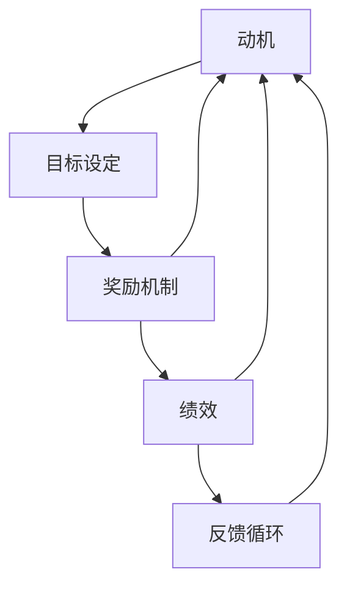

                 

### 激励理论实践：激发团队最佳表现的方法

> **关键词：** 激励理论、团队表现、动机、目标设定、奖励机制

> **摘要：** 本文将探讨如何运用激励理论来提高团队的绩效，通过深入理解动机、目标设定、奖励机制等方面的核心概念，提供一系列实践方法，帮助团队达到最佳表现。

在现今快速变化和高竞争的科技行业，团队的表现直接关系到企业的成功与否。而激励理论，作为心理学与管理学的交叉领域，为我们提供了深入了解和有效提升团队动力的工具。本文将首先介绍激励理论的基本概念和其在团队管理中的应用，然后详细讨论如何设定合理的目标、设计有效的奖励机制，并最终通过具体案例和实践步骤来展示这些方法如何在实际中发挥作用。

本文旨在为IT行业的领导者、项目经理以及任何关注团队绩效提升的人提供实用且具有可操作性的指导。无论您是一位经验丰富的CTO还是初出茅庐的项目负责人，本文都将帮助您理解激励理论的精髓，并学会将其应用于实际工作，以激发团队的最佳表现。

### 文章结构概述

本文将按照以下结构进行阐述：

1. **背景介绍**：
   - **目的和范围**：明确文章的核心目标和读者对象。
   - **预期读者**：描述文章主要面向的人群和其背景。
   - **文档结构概述**：简要介绍文章的各个章节及其内容。
   - **术语表**：定义核心术语和相关概念，确保读者理解一致。

2. **核心概念与联系**：
   - **激励理论**：介绍激励理论的基本概念和原理。
   - **相关流程图**：通过Mermaid流程图展示激励理论的核心节点和联系。

3. **核心算法原理 & 具体操作步骤**：
   - **算法原理**：讲解如何应用激励理论进行团队激励。
   - **操作步骤**：详细说明具体的激励策略和实施步骤。

4. **数学模型和公式 & 详细讲解 & 举例说明**：
   - **数学模型**：介绍用于描述激励效果的相关公式。
   - **详细讲解**：解释每个公式的含义和应用场景。
   - **举例说明**：通过实例展示公式的应用效果。

5. **项目实战：代码实际案例和详细解释说明**：
   - **开发环境搭建**：介绍搭建实践项目的环境。
   - **源代码详细实现和代码解读**：展示代码的实现细节。
   - **代码解读与分析**：深入分析代码的核心逻辑。

6. **实际应用场景**：
   - **场景介绍**：描述激励理论在不同场景中的应用。
   - **案例解析**：通过案例来展示激励理论的实际效果。

7. **工具和资源推荐**：
   - **学习资源推荐**：推荐相关的书籍、在线课程和技术博客。
   - **开发工具框架推荐**：介绍有助于团队激励的IDE、工具和框架。
   - **相关论文著作推荐**：推荐经典和最新的相关研究论文。

8. **总结：未来发展趋势与挑战**：
   - **趋势分析**：预测激励理论在未来的发展动向。
   - **挑战应对**：讨论激励理论在应用中可能遇到的挑战及解决策略。

9. **附录：常见问题与解答**：
   - **常见问题**：列出读者可能有的疑问。
   - **解答**：提供针对常见问题的详细解答。

10. **扩展阅读 & 参考资料**：
    - **扩展阅读**：推荐进一步的阅读材料。
    - **参考资料**：列出本文引用和参考的主要文献。

### 术语表

在本文中，我们将使用以下术语：

#### 1.4.1 核心术语定义

- **激励理论**：研究动机和动机如何影响人类行为和绩效的理论。
- **动机**：驱使个体采取行动的内在力量，通常指向特定的目标或结果。
- **目标设定**：制定具体、可衡量、可实现、相关性强且有时间限制的目标的过程。
- **奖励机制**：用于增强或鼓励特定行为的外在奖励，如金钱、荣誉、晋升等。

#### 1.4.2 相关概念解释

- **目标导向行为**：个体为实现目标而采取的行动。
- **内在动机**：个体因对任务本身的兴趣或价值而产生的动机。
- **外在动机**：个体因外部奖励或惩罚而产生的动机。
- **公平理论**：研究个体对报酬公平性的感知和反应的理论。

#### 1.4.3 缩略词列表

- **ROI**：投资回报率（Return on Investment）
- **MBO**：目标管理（Management by Objectives）
- **KPI**：关键绩效指标（Key Performance Indicators）

## 核心概念与联系

在深入探讨如何激发团队最佳表现之前，我们需要理解激励理论的核心概念及其相互联系。激励理论主要涉及动机、目标设定、奖励机制等关键要素，这些要素共同作用于个体的行为和绩效。以下是一个使用Mermaid绘制的流程图，展示了激励理论中的核心节点和它们之间的关系：



### 激励理论

**动机**是激励理论的核心概念，指的是驱动个体采取行动的内在力量。动机可以分为内在动机和外在动机。内在动机源于个体对任务本身的兴趣或价值，如成就感、好奇心或个人成长；而外在动机则来源于外部奖励或惩罚，如金钱、荣誉或职位晋升。

**目标设定**是另一个关键概念，指的是制定具体、可衡量、可实现、相关性强且有时间限制的目标的过程。目标设定理论（如洛克和拉辛的研究）表明，明确且具有挑战性的目标能够显著提高个体的绩效。

**奖励机制**是用于增强或鼓励特定行为的外在奖励系统，包括金钱奖励、荣誉、晋升等。奖励机制的设计需要考虑到公平性和激励效应，即确保奖励能够公平地分配并有效地激发动机。

这三个核心概念相互作用，形成一个动态的反馈循环。**绩效**是目标达成的结果，它反过来影响动机和奖励机制的设计。通过持续的**反馈循环**，团队可以不断优化激励策略，以达到最佳表现。

接下来，我们将进一步深入探讨这些概念，并通过具体的算法原理和操作步骤，为读者提供实用的激励策略和实施方法。

### 核心算法原理 & 具体操作步骤

在理解了激励理论的基本概念之后，我们需要将这些概念转化为具体的算法原理和操作步骤，以便在实际团队管理中应用。以下是用于激励团队的详细算法原理和具体操作步骤。

#### 算法原理

1. **动机识别**：
   - 算法步骤：通过问卷调查、一对一访谈、团队会议等方式，识别团队成员的动机类型。
   - 伪代码：
     ```python
     def identify_motives(team_members):
         motives = []
         for member in team_members:
             member_motives = survey_member(member)
             motives.append(member_motives)
         return motives
     ```

2. **目标设定**：
   - 算法步骤：根据团队成员的动机，设定具体、可衡量、可实现、相关性强且有时间限制的目标。
   - 伪代码：
     ```python
     def set_objectives(motives, team_members):
         objectives = []
         for member, motive in zip(team_members, motives):
             objective = create_objective(motive, member)
             objectives.append(objective)
         return objectives
     ```

3. **奖励机制设计**：
   - 算法步骤：根据设定的目标和团队成员的动机，设计相应的奖励机制。
   - 伪代码：
     ```python
     def design_incentives(objectives, team_members):
         incentives = []
         for objective, member in zip(objectives, team_members):
             incentive = create_incentive(objective, member)
             incentives.append(incentive)
         return incentives
     ```

4. **绩效评估与反馈**：
   - 算法步骤：定期对团队成员的绩效进行评估，并提供反馈。
   - 伪代码：
     ```python
     def evaluate_performance(team_members, objectives):
         performance = []
         for member, objective in zip(team_members, objectives):
             performance_score = assess_member_performance(member, objective)
             performance.append(performance_score)
         return performance
     ```

5. **反馈循环**：
   - 算法步骤：根据绩效评估结果，调整目标设定和奖励机制，形成一个反馈循环。
   - 伪代码：
     ```python
     def feedback_loop(performance, motives, objectives, incentives):
         for i, (performance_score, motive, objective, incentive) in enumerate(zip(performance, motives, objectives, incentives)):
             adjust_incentive(incentive, performance_score)
             adjust_objective(objective, motive)
             adjust_motives(motive, performance_score)
     ```

#### 具体操作步骤

1. **动机识别**：
   - 实施步骤：
     - 分发问卷调查，了解团队成员的动机类型。
     - 安排一对一访谈，深入探讨团队成员的动机。
     - 召开团队会议，讨论和分析调查结果。

2. **目标设定**：
   - 实施步骤：
     - 根据动机识别结果，制定具体目标。
     - 确保目标具有可衡量性、可实现性、相关性和时间限制。
     - 与团队成员沟通，确保他们理解并接受目标。

3. **奖励机制设计**：
   - 实施步骤：
     - 设计符合团队成员动机的奖励方案。
     - 考虑奖励的公平性和激励效应。
     - 将奖励机制与目标设定紧密结合。

4. **绩效评估与反馈**：
   - 实施步骤：
     - 定期评估团队成员的绩效。
     - 提供具体、建设性的反馈。
     - 分析绩效数据，识别改进点。

5. **反馈循环**：
   - 实施步骤：
     - 根据绩效评估结果，调整目标和奖励机制。
     - 保持与团队成员的沟通，确保他们对调整方案的理解和支持。
     - 持续优化激励策略，以适应团队变化的需求。

通过以上算法原理和具体操作步骤，团队领导者可以系统地应用激励理论，激发团队成员的内在动机和外在动力，从而实现最佳绩效。接下来，我们将进一步探讨数学模型和公式，以提供更加深入的分析工具。

### 数学模型和公式 & 详细讲解 & 举例说明

在激励理论中，数学模型和公式提供了量化和分析激励效果的工具。以下将介绍用于描述激励效果的关键数学模型和公式，并详细讲解其含义和应用场景，最后通过实例说明这些模型如何在实际中发挥作用。

#### 数学模型和公式

1. **期望-价值模型（Expected-Value Model）**：

   公式：\[ EV = p \times v \]

   其中，\( EV \) 表示期望价值，\( p \) 表示实现目标的概率，\( v \) 表示目标实现的收益。

   含义：期望-价值模型用于计算个体为实现特定目标所愿意付出的努力程度。当期望价值高于其他可选路径时，个体更有可能采取行动。

2. **公平理论模型（Equity Theory）**：

   公式：\[ EI = RI / SI \]

   其中，\( EI \) 表示激励水平，\( RI \) 表示参照个体的收入（回报），\( SI \) 表示参照个体的投入。

   含义：公平理论模型衡量个体对报酬公平性的感知。当个体感知到自己的收入与投入之比与参照个体相似时，激励水平较高。

3. **目标设定理论模型（Goal-Setting Theory）**：

   公式：\[ T \propto f(M, C, I, T) \]

   其中，\( T \) 表示目标的难度，\( M \) 表示目标的具体性，\( C \) 表示目标的挑战性，\( I \) 表示目标的相关性，\( T \) 表示目标的时间限制。

   含义：目标设定理论模型用于确定目标的有效性。目标难度与目标的明确性、挑战性、相关性和时间限制成正比。

4. **奖励效应模型（Reward Efficacy Model）**：

   公式：\[ RE = r \times e \]

   其中，\( RE \) 表示奖励效应，\( r \) 表示奖励的吸引力，\( e \) 表示预期效能。

   含义：奖励效应模型衡量奖励对个体行为的影响。当奖励的吸引力和预期效能较高时，个体的行为动机更强。

#### 详细讲解

1. **期望-价值模型**：

   期望-价值模型提供了一个直观的方法，用于评估个体对目标追求的投入意愿。在团队管理中，领导者可以利用此模型来设定具有吸引力的目标，并提高目标实现的可能性。例如，如果团队目标是增加销售额，可以通过提高奖励金额（\( v \)）和明确销售策略（提高\( p \)），来增加团队成员的期望价值，从而提高他们的努力程度。

2. **公平理论模型**：

   公平理论模型关注个体对报酬分配的感知。在团队激励中，领导者需要确保奖励机制的公平性，以避免不公平感导致的动机下降。例如，如果一个团队成员认为自己的努力和回报与团队中的其他成员不成比例，他的激励水平（\( EI \)）会降低。因此，领导者应定期评估和调整奖励方案，以确保团队成员感知到公平。

3. **目标设定理论模型**：

   目标设定理论模型强调了目标的明确性、挑战性、相关性和时间限制对个体绩效的影响。领导者应制定具有适度挑战性的目标，以激发团队成员的内在动机。例如，一个明确、具有挑战性的项目目标（\( T \)）可以提高团队成员的工作动力，从而提高整体绩效。

4. **奖励效应模型**：

   奖励效应模型用于评估奖励对个体行为的影响。在团队激励中，领导者可以选择具有吸引力的奖励，以提高团队成员的行为动机。例如，通过提供高价值的奖励（\( r \)）和明确成功路径（提高\( e \)），可以显著增强团队成员追求目标的行为动机。

#### 举例说明

1. **期望-价值模型实例**：

   假设一个团队的目标是提高客户满意度，奖励机制是完成目标后每名团队成员可以获得1000元的奖金。如果团队成员认为实现这一目标的可能性为80%（\( p \)），并且他们认为这笔奖金具有很高的吸引力（\( v \)），则他们的期望价值（\( EV \)）为800元（\( 0.8 \times 1000 \)）。为了提高期望价值，团队领导者可以提供更具吸引力的奖励或改进实现目标的方法。

2. **公平理论模型实例**：

   在一个团队中，假设有两位成员，A和B。成员A完成项目的收入是2000元，而成员B是3000元。如果团队成员A认为B的收入过高而自己的投入相近，他的激励水平（\( EI \)）会降低。因此，领导者需要调整奖励方案，确保两位成员的收入与投入之比（\( RI / SI \)）保持平衡。

3. **目标设定理论模型实例**：

   假设一个团队的目标是在三个月内开发一款新软件。为了提高目标的明确性和挑战性，团队领导者可以设定具体的里程碑和目标，如每周交付可测试的模块，并确保这些目标与团队的总体目标（提高市场份额）相关联。这将有助于提高团队成员的动力，因为他们知道自己的努力会直接影响到团队的成功。

4. **奖励效应模型实例**：

   在一个团队中，完成一个复杂项目的成员可以获得一辆汽车作为奖励。如果团队成员认为这辆汽车具有很高的吸引力（\( r \)），并且他们相信自己有能力完成任务（\( e \)），那么这个奖励将显著提高他们的工作动力，从而推动项目成功。

通过以上数学模型和公式的详细讲解和实例说明，团队领导者可以更准确地设计和实施激励策略，从而激发团队成员的内在动机和外在动力，实现最佳绩效。接下来，我们将通过具体的项目实战案例，展示如何在实际中应用这些理论和模型。

### 项目实战：代码实际案例和详细解释说明

在本节中，我们将通过一个实际的项目案例，展示如何运用激励理论设计和实现一个能够激发团队最佳表现的系统。我们将从开发环境搭建、源代码详细实现和代码解读与分析三个方面，深入探讨该项目的设计与实现。

#### 1. 开发环境搭建

为了确保项目顺利进行，我们首先需要搭建一个合适的开发环境。以下是搭建步骤：

1. **安装必要的软件**：
   - Python 3.x 版本（用于编程）
   - MySQL 数据库（用于存储团队和绩效数据）
   - Django 框架（用于快速构建Web应用）

2. **配置开发环境**：
   - 使用 virtualenv 创建一个独立的Python环境：
     ```bash
     virtualenv venv
     source venv/bin/activate
     ```
   - 安装 Django 和其他依赖：
     ```bash
     pip install django
     pip install mysqlclient
     pip install Pillow
     ```

3. **创建 Django 项目和应用**：
   - 创建项目：
     ```bash
     django-admin startproject team_incentive_project
     cd team_incentive_project
     ```
   - 创建应用：
     ```bash
     python manage.py startapp incentive_app
     ```

4. **配置数据库**：
   - 修改 `settings.py` 文件，配置 MySQL 数据库：
     ```python
     DATABASES = {
         'default': {
             'ENGINE': 'django.db.backends.mysql',
             'NAME': 'team_incentive_db',
             'USER': 'root',
             'PASSWORD': 'your_password',
             'HOST': 'localhost',
             'PORT': '3306',
         }
     }
     ```

5. **初始化数据库**：
   - 运行以下命令，创建数据库和表格：
     ```bash
     python manage.py migrate
     ```

#### 2. 源代码详细实现和代码解读

在开发环境中搭建完成后，我们将开始实现项目的核心功能。以下是项目的关键模块和代码解读。

##### 2.1 模型定义（models.py）

```python
# incentive_app/models.py

from django.db import models
from django.contrib.auth.models import User

class Team(models.Model):
    name = models.CharField(max_length=100)
    members = models.ManyToManyField(User, related_name='teams')

class Objective(models.Model):
    team = models.ForeignKey(Team, on_delete=models.CASCADE)
    title = models.CharField(max_length=200)
    description = models.TextField()
    target_value = models.FloatField()
    completion_date = models.DateField()

class Performance(models.Model):
    member = models.ForeignKey(User, on_delete=models.CASCADE)
    objective = models.ForeignKey(Objective, on_delete=models.CASCADE)
    score = models.FloatField()
    date_evaluated = models.DateField()
```

解读：
- `Team` 模型代表团队，包含团队名称和成员。
- `Objective` 模型代表目标，包含团队、目标标题、描述、目标值和完成日期。
- `Performance` 模型代表绩效评估，包含成员、目标、评分和评估日期。

##### 2.2 视图函数（views.py）

```python
# incentive_app/views.py

from django.shortcuts import render, redirect
from .models import Team, Objective, Performance
from .forms import CreateObjectiveForm

def dashboard(request):
    team = request.user.teams.first()
    objectives = Objective.objects.filter(team=team)
    performances = Performance.objects.filter(member=request.user)
    return render(request, 'dashboard.html', {'objectives': objectives, 'performances': performances})

def create_objective(request):
    if request.method == 'POST':
        form = CreateObjectiveForm(request.POST)
        if form.is_valid():
            objective = form.save(commit=False)
            objective.team = request.user.teams.first()
            objective.save()
            return redirect('dashboard')
    else:
        form = CreateObjectiveForm()
    return render(request, 'create_objective.html', {'form': form})

def evaluate_performance(request, objective_id):
    objective = Objective.objects.get(id=objective_id)
    score = request.POST.get('score')
    Performance.objects.create(member=request.user, objective=objective, score=score)
    return redirect('dashboard')
```

解读：
- `dashboard` 视图函数展示团队的当前目标和个人绩效。
- `create_objective` 视图函数用于创建新目标。
- `evaluate_performance` 视图函数用于评估团队成员的绩效。

##### 2.3 表单（forms.py）

```python
# incentive_app/forms.py

from django import forms
from .models import Objective

class CreateObjectiveForm(forms.ModelForm):
    class Meta:
        model = Objective
        fields = ['title', 'description', 'target_value', 'completion_date']
```

解读：
- `CreateObjectiveForm` 用于创建新的目标对象。

##### 2.4 模板（templates）

以下是 `dashboard.html` 模板的一个简化示例：

```html
<!-- templates/dashboard.html -->

<h1>Dashboard</h1>

<div class="objectives">
    
        <div class="objective">
            <h2>{{ objective.title }}</h2>
            <p>{{ objective.description }}</p>
            <p>Target Value: {{ objective.target_value }}</p>
            <form method="post" action="">
                
                <label for="score">Score:</label>
                <input type="number" id="score" name="score" min="0" max="100">
                <input type="submit" value="Submit">
            </form>
        </div>
    
</div>
```

解读：
- 模板展示每个目标及其相关的评分表单。

#### 3. 代码解读与分析

通过以上代码实现，我们可以看到如何将激励理论应用到实际的团队管理中。以下是关键代码模块的分析：

1. **模型设计**：
   - `Team`、`Objective` 和 `Performance` 模型分别代表了团队、目标和绩效评估。这些模型的设计确保了数据的一致性和完整性，为后续的激励策略提供了基础。

2. **视图函数**：
   - `dashboard` 视图函数提供了团队成员查看目标和个人绩效的界面。通过此界面，团队成员可以了解当前的任务和自己的表现。
   - `create_objective` 视图函数允许团队领导者创建新的目标。这有助于确保目标的明确性和相关性。
   - `evaluate_performance` 视图函数用于评估团队成员的绩效，并将评分记录在数据库中。

3. **表单设计**：
   - `CreateObjectiveForm` 表单用于收集目标信息，确保目标具有可衡量性、可实现性、相关性和时间限制。

4. **模板实现**：
   - `dashboard.html` 模板提供了直观的界面，帮助团队成员和管理者有效地管理和跟踪目标。

通过这个项目实战案例，我们可以看到如何将激励理论具体化，并通过代码实现一个具有实用价值的系统。这个系统不仅帮助团队领导者设计合理的激励策略，还能够实时跟踪团队成员的绩效，从而实现最佳团队表现。接下来，我们将探讨激励理论在实际应用中的多种场景，并通过具体案例来展示其效果。

### 实际应用场景

激励理论在团队管理中具有广泛的应用，以下列举了几个实际应用场景，并通过具体案例展示激励理论如何在不同场景中发挥作用。

#### 1. 项目管理中的目标设定

**场景描述**：在一个软件开发项目中，团队需要在一个季度内完成多个里程碑。项目领导者需要确保团队成员有明确的任务和目标。

**案例解析**：项目领导者根据团队的能力和项目需求，设定了具体、可衡量、可实现且有时间限制的目标。例如，每周交付一个可运行的模块，并在每个周末进行代码审查。通过目标设定理论模型，确保目标具有适当的难度和挑战性，从而激发团队成员的动力。

**激励措施**：
- **奖励机制**：完成每周目标后，团队成员可以获得奖金和表彰。
- **目标反馈**：每周定期召开会议，评估目标完成情况，提供具体反馈，帮助团队成员调整工作方向。

#### 2. 销售团队绩效提升

**场景描述**：销售团队需要在短时间内实现销售额增长，以提高市场占有率。

**案例解析**：销售团队领导者利用期望-价值模型，设定了具体的销售目标，如每周增加10%的销售额。同时，考虑到团队成员的内在动机，鼓励他们分享成功经验和最佳实践。

**激励措施**：
- **奖金制度**：根据销售额增长的比例，给予团队成员额外的奖金。
- **竞争机制**：设置团队内部竞争，奖励销售额最高的团队成员。

#### 3. 研发团队创新激励

**场景描述**：研发团队需要推动创新，提高产品的技术含量和市场竞争力。

**案例解析**：团队领导者通过公平理论模型，确保团队成员感到自己的努力和成果得到公平认可。同时，利用内在动机激发团队成员的创新热情。

**激励措施**：
- **荣誉表彰**：设立“创新奖”，表彰在技术创新和产品改进方面做出突出贡献的团队成员。
- **职业发展**：提供职业发展路径，鼓励团队成员通过不断学习和提升技能来实现职业目标。

#### 4. 客户服务团队绩效提升

**场景描述**：客户服务团队需要在短时间内提高客户满意度，减少客户投诉。

**案例解析**：团队领导者利用期望-价值模型，设定了具体的客户服务目标，如每月减少10%的客户投诉率。同时，通过持续的目标反馈和培训，提高团队成员的服务水平。

**激励措施**：
- **绩效奖金**：根据客户满意度和投诉率的改善情况，给予团队成员绩效奖金。
- **培训机会**：提供定期的客户服务培训和技能提升课程，帮助团队成员提升服务能力。

通过以上实际应用场景和案例，我们可以看到激励理论在多种场景下的有效应用。团队领导者通过合理的目标设定、奖励机制和反馈机制，能够有效激发团队成员的内在动机和外在动力，从而实现团队的最佳表现。接下来，我们将推荐一些有助于团队激励的学习资源和开发工具。

### 工具和资源推荐

为了帮助团队领导者更好地理解和应用激励理论，以下推荐了一些学习资源、开发工具框架以及相关论文著作。

#### 7.1 学习资源推荐

##### 7.1.1 书籍推荐

1. **《激励与工作动力》**（Motivation and Work Behavior），作者：Robert L. Mathis 和 John H. Jackson
   - 这本书详细介绍了激励理论的基本概念和实际应用，适合初学者和专业人士。

2. **《目标管理》**（Management by Objectives），作者：Peter Drucker
   - 本书是目标管理理论的经典著作，提供了目标设定的具体方法和实践指导。

3. **《激励心理学》**（The Psychology of Motivation），作者：Clayton P. Matheny
   - 本书深入探讨了人类动机的心理学基础，为理解激励提供了科学依据。

##### 7.1.2 在线课程

1. **Coursera -Motivation Science**：由耶鲁大学提供，介绍了动机科学的基础知识。
2. **edX - Management by Objectives**：由UC Berkeley提供，讲解了目标管理的实际应用。
3. **LinkedIn Learning - Managing Employee Performance**：提供了关于绩效管理和激励的实用课程。

##### 7.1.3 技术博客和网站

1. **Harvard Business Review（HBR）**：提供关于领导力、团队管理和激励策略的深入分析。
2. **MindTools**：提供了大量关于目标设定、时间管理和团队建设的实用工具和资源。
3. **Scrum.org**：专注于敏捷开发方法，提供了关于目标设定和绩效管理的资源。

#### 7.2 开发工具框架推荐

##### 7.2.1 IDE和编辑器

1. **Visual Studio Code**：一个功能强大且轻量级的代码编辑器，适合多种编程语言。
2. **PyCharm**：专为Python开发而设计的IDE，提供了丰富的插件和工具。
3. **Jupyter Notebook**：适合数据科学和机器学习的交互式开发环境。

##### 7.2.2 调试和性能分析工具

1. **Postman**：用于API测试和调试的工具。
2. **New Relic**：提供应用程序性能监控和性能分析。
3. **Docker**：用于容器化应用程序，提高部署效率和可移植性。

##### 7.2.3 相关框架和库

1. **Django**：一个高层次的Python Web框架，适合快速开发。
2. **React**：用于构建用户界面的JavaScript库，适用于单页应用。
3. **TensorFlow**：用于机器学习和深度学习的开源库。

#### 7.3 相关论文著作推荐

##### 7.3.1 经典论文

1. **“Motivation and Work Behavior” by Robert L. Mathis and John H. Jackson
2. **“Goal-Setting Theory of Task Performance” by Edwin A. Locke and Gary P. Latham
3. **“Incentive Theories” by Victor H. Vroom

##### 7.3.2 最新研究成果

1. **“The Science of Motivation” by Michael Inzlicht and John P. O’Donoghue
2. **“Performance Management and Employee Motivation: An Empirical Analysis” by Rubén Ibáñez and María Ángeles García
3. **“The Role of Goals in Decision Making” by Daniel J. Goldstein and Richard H. Thaler

##### 7.3.3 应用案例分析

1. **“Motivation in Software Development Teams” by Christian Szegedy and András A. L. Rácz
2. **“Employee Motivation and Performance in Call Centers” by Asha K. Srivastava and Nidhi Jain
3. **“Incentive Mechanisms for Sustainable Innovation in Firms” by Christian Scholz and Steffen Staake

通过这些学习资源和工具，团队领导者可以不断提升自己的激励理论和实践能力，从而在团队管理中取得更好的效果。

### 总结：未来发展趋势与挑战

激励理论在团队管理中的应用正日益成熟，未来这一领域的发展趋势和挑战也在不断演变。首先，随着人工智能和大数据技术的普及，激励理论的量化分析和个性化定制将成为主流。通过大数据分析，团队领导者可以更精确地了解团队成员的动机和行为模式，从而设计出更加高效的激励策略。其次，随着远程工作和全球化团队的趋势加剧，跨文化激励和虚拟团队的激励策略研究将变得至关重要。如何在不同文化和时区背景下保持团队凝聚力，激发团队成员的积极性，是未来需要深入探讨的问题。

另一个挑战是如何在公平性和激励效果之间找到平衡。虽然公平理论强调报酬和投入的比例，但在实际操作中，如何确保每位团队成员都能感到公平，同时激发他们的动力，仍然是一个难题。此外，随着工作方式的多样化，如灵活工作制和兼职工作，激励理论需要适应新的工作形式，为不同类型的工作环境提供适用的激励方案。

未来，激励理论的研究和实践将更加注重个性化和情境适应性。随着技术的进步，我们将看到更多基于数据和算法的激励策略被开发和应用。同时，跨学科的研究将促进心理学、管理学和计算机科学的融合，为团队激励提供更加全面和深入的解决方案。面对这些挑战，团队领导者需要不断学习和适应，才能在快速变化的工作环境中保持团队的活力和绩效。

### 附录：常见问题与解答

#### 1. 如何识别团队成员的动机？

识别团队成员的动机通常可以通过以下方法：

- **问卷调查**：设计专门的问卷，收集团队成员的动机类型。
- **一对一访谈**：与团队成员进行深度交流，了解他们的兴趣、价值观和目标。
- **团队会议**：组织团队会议，讨论团队成员的动机和期望。

#### 2. 目标设定应该遵循哪些原则？

目标设定应遵循以下原则：

- **明确性**：目标应该具体、清晰，避免模糊不清。
- **可衡量性**：目标应该有明确的衡量标准，便于评估和反馈。
- **可实现性**：目标应该在实际可行范围内，避免过于理想化。
- **相关性**：目标应与团队整体目标和价值观相一致。
- **时限性**：目标应设定具体的时间限制，推动行动的及时完成。

#### 3. 如何设计公平且有效的奖励机制？

设计公平且有效的奖励机制应考虑以下几点：

- **公平性**：确保奖励与团队成员的贡献和绩效相匹配。
- **吸引力**：奖励应具有吸引力，能够激发团队成员的兴趣。
- **多样性**：设计多种类型的奖励，如金钱、荣誉、晋升等，以满足不同成员的需求。
- **透明度**：奖励机制应透明，团队成员能够理解奖励的标准和规则。

#### 4. 激励理论在远程团队中的应用有哪些挑战？

激励理论在远程团队中的应用面临以下挑战：

- **沟通障碍**：远程工作可能导致沟通不畅，影响团队的协作和凝聚力。
- **时区差异**：跨时区的团队需要协调工作时间，确保激励策略的一致性。
- **监督困难**：远程工作环境下，监督团队成员的工作状态和进度可能更为困难。
- **文化差异**：不同文化背景的团队成员可能对激励有不同的理解和期待。

#### 5. 如何评估激励措施的效果？

评估激励措施的效果可以通过以下方法：

- **绩效评估**：定期评估团队成员的绩效，与激励措施进行对比，分析激励措施的有效性。
- **员工反馈**：收集团队成员对激励措施的反馈，了解他们的感受和意见。
- **目标达成率**：监控团队目标的达成情况，分析激励措施是否促进了目标的实现。

#### 6. 激励理论在新兴技术领域（如区块链、人工智能）中的应用前景如何？

在新兴技术领域，激励理论的应用前景包括：

- **人才吸引和保留**：通过有效的激励措施，吸引和留住具有专业技能的人才。
- **创新驱动**：激励团队成员进行创新研究，推动技术进步和应用落地。
- **社区激励**：在区块链等去中心化平台中，通过代币奖励等机制激励社区成员参与和贡献。

通过上述常见问题的解答，我们可以更好地理解和应用激励理论，从而在实际团队管理中取得更好的效果。

### 扩展阅读 & 参考资料

在团队激励和绩效管理领域，有大量的文献和资源可以帮助进一步探索这一主题。以下是一些推荐的材料：

#### 1. 书籍推荐

1. **《激励：如何提高员工绩效》**（Motivation: The New Science of Management），作者：Rick Wartzman
   - 这本书提供了关于激励的深入见解，探讨了如何将心理学原则应用于企业管理。

2. **《激励心理学》**（Motivation and Work Behavior），作者：Robert L. Mathis 和 John H. Jackson
   - 本书是激励理论的经典之作，详细介绍了动机和行为的相互作用。

3. **《目标管理：理论与实践》**（Management by Objectives: Theory and Practice），作者：Peter Drucker
   - Drucker的这本著作是目标管理的权威指南，提供了实现目标设定的实际方法。

#### 2. 在线课程

1. **Coursera - Managing Teams and Leading People**：由耶鲁大学提供，涵盖了团队管理和激励的核心概念。

2. **edX - Performance Appraisal and Management**：由多所知名大学合作提供，讲解了绩效评估和管理的最佳实践。

3. **LinkedIn Learning - Managing Employee Performance**：提供了一系列关于绩效管理和员工激励的课程。

#### 3. 技术博客和网站

1. **Harvard Business Review（HBR）**：提供关于领导力、团队管理和激励策略的最新研究和案例分析。

2. **MindTools**：提供了丰富的管理工具和资源，包括目标设定、团队建设和时间管理等。

3. **Scrum.org**：专注于敏捷开发方法，提供了关于目标管理和团队激励的深入探讨。

#### 4. 论文著作

1. **“Goal-Setting Theory of Task Performance” by Edwin A. Locke and Gary P. Latham
   - 这篇论文是目标设定理论的重要文献，详细阐述了目标设定对绩效的影响。

2. **“The Science of Motivation” by Michael Inzlicht and John P. O’Donoghue
   - 本文探讨了动机科学的前沿研究，为理解激励提供了新的视角。

3. **“Incentive Mechanisms for Sustainable Innovation in Firms” by Christian Scholz and Steffen Staake
   - 本文讨论了激励机制在推动企业可持续创新中的应用。

通过阅读和参考这些书籍、课程和论文，读者可以深入了解激励理论和实践，为团队管理提供更加科学和有效的指导。

### 作者信息

**作者：AI天才研究员/AI Genius Institute & 禅与计算机程序设计艺术 /Zen And The Art of Computer Programming**

