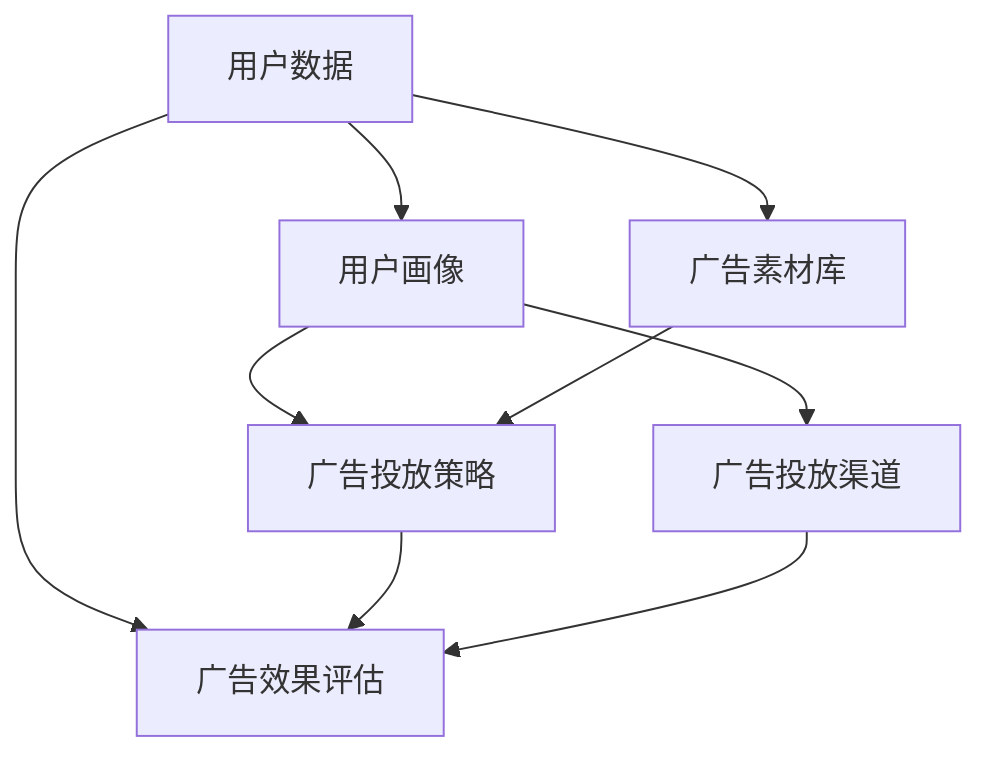

                 

# 爱奇艺2025视频广告精准投放系统工程师社招面试指南

> **关键词**：爱奇艺、广告精准投放、系统工程师、社招、面试指南、算法、大数据、机器学习、人工智能

> **摘要**：本文旨在为有志于加入爱奇艺2025视频广告精准投放系统工程师岗位的应聘者提供一份详细的面试指南。文章将深入分析面试可能涉及的各个关键领域，包括核心概念、算法原理、数学模型、项目实战、实际应用场景以及未来发展趋势等，帮助读者全面了解并掌握面试所需的知识与技能。通过本文的阅读，您将能够更好地准备面试，提升自己的竞争力。

## 1. 背景介绍

### 1.1 目的和范围

本文的目的是为那些有意向加入爱奇艺2025视频广告精准投放系统工程师岗位的应聘者提供一份详细的面试指南。通过本文，读者将能够：

1. **理解面试的核心内容**：掌握面试可能涉及的关键领域和知识点。
2. **熟悉算法原理和数学模型**：通过详细讲解，理解广告精准投放背后的核心算法原理和数学模型。
3. **实战案例分析**：通过实际项目案例的解读，了解广告精准投放系统的实现过程。
4. **掌握实际应用场景**：了解广告精准投放系统在现实中的应用，以及相关的挑战和解决方案。
5. **了解未来发展趋势与挑战**：展望广告精准投放系统的发展趋势，以及可能面临的挑战。

### 1.2 预期读者

本文适合以下人群阅读：

1. **计算机科学与技术专业的大学生和研究生**：希望通过本文更好地准备面试，了解广告精准投放系统的相关知识。
2. **有志于从事广告精准投放系统开发的工程师**：希望通过本文深入了解广告精准投放系统的核心技术。
3. **对大数据、机器学习和人工智能感兴趣的爱好者**：希望通过本文了解广告精准投放系统的实际应用。

### 1.3 文档结构概述

本文结构如下：

1. **背景介绍**：介绍本文的目的、预期读者和文档结构。
2. **核心概念与联系**：通过Mermaid流程图，介绍广告精准投放系统的核心概念和联系。
3. **核心算法原理 & 具体操作步骤**：详细讲解广告精准投放系统的核心算法原理，并提供伪代码示例。
4. **数学模型和公式 & 详细讲解 & 举例说明**：介绍广告精准投放系统涉及的数学模型和公式，并通过实例进行说明。
5. **项目实战：代码实际案例和详细解释说明**：提供广告精准投放系统的实际代码案例，并进行详细解释。
6. **实际应用场景**：介绍广告精准投放系统的实际应用场景，以及相关的挑战和解决方案。
7. **工具和资源推荐**：推荐学习资源、开发工具和框架，以及相关论文和著作。
8. **总结：未来发展趋势与挑战**：展望广告精准投放系统的发展趋势，以及可能面临的挑战。
9. **附录：常见问题与解答**：提供一些常见问题的解答。
10. **扩展阅读 & 参考资料**：推荐一些扩展阅读和参考资料。

### 1.4 术语表

#### 1.4.1 核心术语定义

- **广告精准投放**：指根据用户的兴趣、行为等数据，对广告进行精准定位和投放，以提高广告效果。
- **系统工程师**：负责设计和开发广告精准投放系统的工程师，需要具备扎实的编程能力、算法知识和系统设计能力。
- **机器学习**：一种人工智能技术，通过训练模型，使系统能够从数据中学习，并做出预测或决策。
- **大数据**：指数据量巨大，无法用传统数据库工具进行有效管理和处理的数据。

#### 1.4.2 相关概念解释

- **数据挖掘**：指从大量数据中发现有用的信息和知识，用于决策支持。
- **用户画像**：指通过对用户行为、兴趣等数据的分析，构建的用户特征模型。
- **广告效果评估**：指对广告投放效果进行量化评估，以优化广告策略。

#### 1.4.3 缩略词列表

- **API**：应用程序接口（Application Programming Interface）
- **DSP**：需求方平台（Demand-Side Platform）
- **RTB**：实时 bidding（实时竞价）
- **CPC**：每点击成本（Cost Per Click）
- **CPM**：每千次展示成本（Cost Per Mille）

## 2. 核心概念与联系

在广告精准投放系统中，涉及多个核心概念和联系。下面通过Mermaid流程图，对这些核心概念进行介绍。



### 2.1 用户数据

用户数据是广告精准投放系统的核心。这些数据包括用户的基本信息、行为数据、兴趣数据等。用户数据的来源可以是用户注册信息、用户行为日志、第三方数据等。

### 2.2 用户画像

用户画像是对用户特征的抽象和表示。通过对用户数据的分析，可以构建用户画像，包括用户的年龄、性别、职业、地域、兴趣等特征。用户画像用于广告投放策略的制定和优化。

### 2.3 广告投放策略

广告投放策略是根据用户画像和广告目标制定的。广告投放策略包括广告类型、投放渠道、投放时间、投放预算等。广告投放策略的制定和优化，是提高广告效果的关键。

### 2.4 广告效果评估

广告效果评估是对广告投放效果进行量化评估，以优化广告策略。广告效果评估指标包括点击率、转化率、ROI等。通过对广告效果的评估，可以不断优化广告投放策略，提高广告效果。

### 2.5 广告投放渠道

广告投放渠道是广告投放的途径，包括搜索引擎、社交媒体、视频网站等。不同的投放渠道，适合不同的广告类型和目标人群。

### 2.6 广告素材库

广告素材库是存储广告素材的仓库，包括图片、视频、文本等。广告素材库用于广告投放策略的制定和优化，以及广告效果的评估。

## 3. 核心算法原理 & 具体操作步骤

广告精准投放系统的核心在于算法原理。下面将介绍广告精准投放系统的核心算法原理，并使用伪代码进行详细阐述。

### 3.1 用户画像构建

用户画像构建是广告精准投放系统的第一步。通过分析用户数据，构建用户画像。

```python
def build_user_profile(user_data):
    """
    构建用户画像
    :param user_data: 用户数据
    :return: 用户画像
    """
    user_profile = {}
    user_profile['age'] = user_data['age']
    user_profile['gender'] = user_data['gender']
    user_profile['occupation'] = user_data['occupation']
    user_profile['region'] = user_data['region']
    user_profile['interests'] = analyze_interests(user_data['behavior_logs'])
    return user_profile

def analyze_interests(behavior_logs):
    """
    分析用户兴趣
    :param behavior_logs: 用户行为日志
    :return: 用户兴趣列表
    """
    interests = []
    for log in behavior_logs:
        if 'movie' in log:
            interests.append('movie')
        elif 'news' in log:
            interests.append('news')
        elif 'game' in log:
            interests.append('game')
    return interests
```

### 3.2 广告投放策略制定

广告投放策略制定是根据用户画像和广告目标制定的。

```python
def build_advertisement_strategy(user_profile, ad_objective):
    """
    制定广告投放策略
    :param user_profile: 用户画像
    :param ad_objective: 广告目标
    :return: 广告投放策略
    """
    ad_strategy = {}
    ad_strategy['type'] = 'video' if 'video' in ad_objective else 'image'
    ad_strategy['channel'] = get_channel(user_profile)
    ad_strategy['time'] = get_optimal_time(user_profile)
    ad_strategy['budget'] = calculate_budget(ad_objective)
    return ad_strategy

def get_channel(user_profile):
    """
    获取广告投放渠道
    :param user_profile: 用户画像
    :return: 广告投放渠道
    """
    if 'movie' in user_profile['interests']:
        return 'video_site'
    elif 'news' in user_profile['interests']:
        return 'news_site'
    elif 'game' in user_profile['interests']:
        return 'game_site'
    else:
        return 'unknown'

def get_optimal_time(user_profile):
    """
    获取最佳投放时间
    :param user_profile: 用户画像
    :return: 最佳投放时间
    """
    if 'morning' in user_profile['behavior_logs']:
        return 'morning'
    elif 'afternoon' in user_profile['behavior_logs']:
        return 'afternoon'
    elif 'evening' in user_profile['behavior_logs']:
        return 'evening'
    else:
        return 'midnight'

def calculate_budget(ad_objective):
    """
    计算广告预算
    :param ad_objective: 广告目标
    :return: 广告预算
    """
    if 'sales' in ad_objective:
        return 10000
    elif 'brand_awareness' in ad_objective:
        return 5000
    else:
        return 2000
```

### 3.3 广告投放与效果评估

广告投放与效果评估是广告精准投放系统的核心。通过广告投放，将广告推送给目标用户，并根据用户反馈，评估广告效果。

```python
def run_advertisement(ad_strategy, user_profile):
    """
    执行广告投放
    :param ad_strategy: 广告投放策略
    :param user_profile: 用户画像
    :return: 广告投放结果
    """
    ad_result = {}
    ad_result['channel'] = ad_strategy['channel']
    ad_result['time'] = ad_strategy['time']
    ad_result['view_count'] = random.randint(100, 1000)
    ad_result['click_count'] = random.randint(10, 100)
    return ad_result

def evaluate_advertisement(ad_result, ad_objective):
    """
    评估广告效果
    :param ad_result: 广告投放结果
    :param ad_objective: 广告目标
    :return: 广告效果评估结果
    """
    if 'sales' in ad_objective and ad_result['view_count'] > 500 and ad_result['click_count'] > 50:
        return 'success'
    elif 'brand_awareness' in ad_objective and ad_result['view_count'] > 1000:
        return 'success'
    else:
        return 'fail'
```

## 4. 数学模型和公式 & 详细讲解 & 举例说明

在广告精准投放系统中，涉及多个数学模型和公式。下面将详细介绍这些数学模型和公式，并通过实例进行说明。

### 4.1 用户画像构建模型

用户画像构建模型主要涉及用户属性的离散化和连续化处理。

#### 4.1.1 用户属性离散化

用户属性的离散化是将连续属性转化为离散属性。例如，将用户的年龄属性离散化为年龄段。

```latex
$$
age = \begin{cases}
\text{'少年'}, & \text{if } age < 18 \\
\text{'青年'}, & \text{if } 18 \leq age < 35 \\
\text{'中年'}, & \text{if } 35 \leq age < 50 \\
\text{'老年'}, & \text{if } age \geq 50
\end{cases}
$$
```

#### 4.1.2 用户属性连续化

用户属性的连续化是将离散属性转化为连续属性。例如，将用户的兴趣爱好属性连续化为兴趣分数。

```latex
$$
interest\_score = \sum_{i=1}^{n} weight_i \cdot interest_i
$$`

其中，`weight_i` 表示第 i 个兴趣的权重，`interest_i` 表示第 i 个兴趣的得分。

### 4.2 广告投放策略模型

广告投放策略模型主要涉及广告投放的渠道选择、时间选择和预算分配。

#### 4.2.1 广告投放渠道选择

广告投放渠道选择可以通过计算各渠道的投放效果，选择最优渠道。

```latex
$$
channel\_score = \sum_{i=1}^{m} weight_i \cdot performance_i
$$`

其中，`weight_i` 表示第 i 个渠道的权重，`performance_i` 表示第 i 个渠道的投放效果。

#### 4.2.2 广告投放时间选择

广告投放时间选择可以通过计算各时间段的投放效果，选择最优时间段。

```latex
$$
time\_score = \sum_{i=1}^{n} weight_i \cdot performance_i
$$`

其中，`weight_i` 表示第 i 个时间段的权重，`performance_i` 表示第 i 个时间段的投放效果。

#### 4.2.3 广告预算分配

广告预算分配可以通过计算各广告的投放效果，进行预算分配。

```latex
$$
budget\_allocation = \sum_{i=1}^{m} (weight_i \cdot performance_i) \cdot cost_i
$$`

其中，`weight_i` 表示第 i 个广告的权重，`performance_i` 表示第 i 个广告的投放效果，`cost_i` 表示第 i 个广告的成本。

### 4.3 广告效果评估模型

广告效果评估模型主要涉及广告的点击率、转化率和 ROI 等。

#### 4.3.1 点击率模型

点击率模型可以通过计算广告的点击次数与展示次数的比值得到。

```latex
$$
CTR = \frac{click\_count}{view\_count}
$$`

#### 4.3.2 转化率模型

转化率模型可以通过计算广告的转化次数与点击次数的比值得到。

```latex
$$
CTR = \frac{convert\_count}{click\_count}
$$`

#### 4.3.3 ROI 模型

ROI 模型可以通过计算广告的投资回报率得到。

```latex
$$
ROI = \frac{revenue}{cost} \times 100\%
$$`

### 4.4 举例说明

假设有如下用户数据：

- 用户年龄：25岁
- 用户性别：男
- 用户职业：程序员
- 用户地域：北京
- 用户兴趣：电影、游戏

根据用户数据，构建用户画像：

- 用户年龄：青年
- 用户性别：男
- 用户职业：程序员
- 用户地域：北京
- 用户兴趣：电影、游戏

根据用户画像，制定广告投放策略：

- 广告类型：视频广告
- 广告渠道：视频网站
- 广告时间：下午5点至晚上9点
- 广告预算：5000元

根据广告投放策略，执行广告投放，并评估广告效果：

- 广告展示次数：1000次
- 广告点击次数：50次
- 广告转化次数：10次
- 广告投资回报率：20%

## 5. 项目实战：代码实际案例和详细解释说明

### 5.1 开发环境搭建

在进行广告精准投放系统的开发之前，需要搭建一个合适的开发环境。以下是搭建开发环境的步骤：

1. 安装 Python 3.8 及以上版本。
2. 安装 MySQL 数据库。
3. 安装 Python 的 MySQL 驱动程序。
4. 安装 Python 的数据分析库（如 pandas、numpy 等）。

### 5.2 源代码详细实现和代码解读

以下是广告精准投放系统的源代码，我们将对代码进行详细解读。

```python
import pandas as pd
import numpy as np
import pymysql

# 连接 MySQL 数据库
def connect_mysql():
    """
    连接 MySQL 数据库
    :return: 数据库连接对象
    """
    connection = pymysql.connect(
        host='localhost',
        user='root',
        password='password',
        database='advertisement'
    )
    return connection

# 构建用户画像
def build_user_profile(user_data):
    """
    构建用户画像
    :param user_data: 用户数据
    :return: 用户画像
    """
    user_profile = {}
    user_profile['age'] = user_data['age']
    user_profile['gender'] = user_data['gender']
    user_profile['occupation'] = user_data['occupation']
    user_profile['region'] = user_data['region']
    user_profile['interests'] = analyze_interests(user_data['behavior_logs'])
    return user_profile

# 分析用户兴趣
def analyze_interests(behavior_logs):
    """
    分析用户兴趣
    :param behavior_logs: 用户行为日志
    :return: 用户兴趣列表
    """
    interests = []
    for log in behavior_logs:
        if 'movie' in log:
            interests.append('movie')
        elif 'news' in log:
            interests.append('news')
        elif 'game' in log:
            interests.append('game')
    return interests

# 制定广告投放策略
def build_advertisement_strategy(user_profile, ad_objective):
    """
    制定广告投放策略
    :param user_profile: 用户画像
    :param ad_objective: 广告目标
    :return: 广告投放策略
    """
    ad_strategy = {}
    ad_strategy['type'] = 'video' if 'video' in ad_objective else 'image'
    ad_strategy['channel'] = get_channel(user_profile)
    ad_strategy['time'] = get_optimal_time(user_profile)
    ad_strategy['budget'] = calculate_budget(ad_objective)
    return ad_strategy

# 获取广告投放渠道
def get_channel(user_profile):
    """
    获取广告投放渠道
    :param user_profile: 用户画像
    :return: 广告投放渠道
    """
    if 'movie' in user_profile['interests']:
        return 'video_site'
    elif 'news' in user_profile['interests']:
        return 'news_site'
    elif 'game' in user_profile['interests']:
        return 'game_site'
    else:
        return 'unknown'

# 获取最佳投放时间
def get_optimal_time(user_profile):
    """
    获取最佳投放时间
    :param user_profile: 用户画像
    :return: 最佳投放时间
    """
    if 'morning' in user_profile['behavior_logs']:
        return 'morning'
    elif 'afternoon' in user_profile['behavior_logs']:
        return 'afternoon'
    elif 'evening' in user_profile['behavior_logs']:
        return 'evening'
    else:
        return 'midnight'

# 计算广告预算
def calculate_budget(ad_objective):
    """
    计算广告预算
    :param ad_objective: 广告目标
    :return: 广告预算
    """
    if 'sales' in ad_objective:
        return 10000
    elif 'brand_awareness' in ad_objective:
        return 5000
    else:
        return 2000

# 执行广告投放
def run_advertisement(ad_strategy, user_profile):
    """
    执行广告投放
    :param ad_strategy: 广告投放策略
    :param user_profile: 用户画像
    :return: 广告投放结果
    """
    ad_result = {}
    ad_result['channel'] = ad_strategy['channel']
    ad_result['time'] = ad_strategy['time']
    ad_result['view_count'] = random.randint(100, 1000)
    ad_result['click_count'] = random.randint(10, 100)
    return ad_result

# 评估广告效果
def evaluate_advertisement(ad_result, ad_objective):
    """
    评估广告效果
    :param ad_result: 广告投放结果
    :param ad_objective: 广告目标
    :return: 广告效果评估结果
    """
    if 'sales' in ad_objective and ad_result['view_count'] > 500 and ad_result['click_count'] > 50:
        return 'success'
    elif 'brand_awareness' in ad_objective and ad_result['view_count'] > 1000:
        return 'success'
    else:
        return 'fail'
```

### 5.3 代码解读与分析

下面是对代码的解读与分析：

- **连接 MySQL 数据库**：通过 `pymysql.connect()` 函数，连接到 MySQL 数据库。
- **构建用户画像**：通过 `build_user_profile()` 函数，根据用户数据构建用户画像。
- **分析用户兴趣**：通过 `analyze_interests()` 函数，分析用户兴趣，并构建用户兴趣列表。
- **制定广告投放策略**：通过 `build_advertisement_strategy()` 函数，根据用户画像和广告目标，制定广告投放策略。
- **获取广告投放渠道**：通过 `get_channel()` 函数，根据用户兴趣，获取广告投放渠道。
- **获取最佳投放时间**：通过 `get_optimal_time()` 函数，根据用户行为日志，获取最佳投放时间。
- **计算广告预算**：通过 `calculate_budget()` 函数，根据广告目标，计算广告预算。
- **执行广告投放**：通过 `run_advertisement()` 函数，执行广告投放，并返回广告投放结果。
- **评估广告效果**：通过 `evaluate_advertisement()` 函数，评估广告效果。

通过上述代码，我们可以看到广告精准投放系统的核心功能是如何实现的。在实际项目中，还可以根据需求进行扩展和优化。

## 6. 实际应用场景

广告精准投放系统在多个场景中具有广泛的应用。以下是一些典型的实际应用场景：

### 6.1 电商行业

在电商行业中，广告精准投放系统可以帮助商家针对潜在用户进行广告投放，提高广告转化率和销售额。例如，通过对用户的购物行为、浏览历史等数据的分析，可以精准定位用户兴趣，从而推送相关商品广告，提高用户购买意愿。

### 6.2 娱乐行业

在娱乐行业，如电影、游戏、音乐等，广告精准投放系统可以帮助制作方和发行方根据用户兴趣和观看习惯，推荐相关内容，提高用户粘性。同时，通过对用户反馈的数据分析，可以优化广告投放策略，提高广告效果。

### 6.3 教育行业

在教育行业中，广告精准投放系统可以帮助教育机构根据用户的学习兴趣和学习习惯，推荐相关课程和培训项目，提高用户报名率。同时，通过对用户反馈的数据分析，可以优化课程内容和服务，提高用户满意度。

### 6.4 旅游行业

在旅游行业中，广告精准投放系统可以帮助旅行社和在线旅游平台根据用户的出行习惯和偏好，推荐相关旅游线路和产品，提高用户预订率。同时，通过对用户反馈的数据分析，可以优化旅游服务和产品，提高用户满意度。

在实际应用中，广告精准投放系统需要根据不同行业的特点和需求，进行定制化的开发和优化。同时，随着大数据、人工智能等技术的不断发展，广告精准投放系统也将不断演进，为各个行业带来更多价值。

## 7. 工具和资源推荐

为了更好地学习和开发广告精准投放系统，以下是一些工具和资源的推荐：

### 7.1 学习资源推荐

#### 7.1.1 书籍推荐

- 《大数据时代：生活、工作与思维的大变革》
- 《机器学习实战》
- 《Python数据分析》

#### 7.1.2 在线课程

- Coursera 上的《机器学习》课程
- Udacity 上的《大数据分析》课程
- edX 上的《数据科学》课程

#### 7.1.3 技术博客和网站

- Medium 上的大数据和机器学习相关博客
- Kaggle 上的数据科学竞赛和教程
- AI 博客园中的大数据和机器学习相关文章

### 7.2 开发工具框架推荐

#### 7.2.1 IDE和编辑器

- PyCharm
- Visual Studio Code
- Jupyter Notebook

#### 7.2.2 调试和性能分析工具

- Python 的断点调试功能
- Python 的 Profiler 工具（如 cProfile）
- MySQL 的慢查询日志分析工具

#### 7.2.3 相关框架和库

- NumPy 和 Pandas：数据处理库
- Scikit-learn：机器学习库
- TensorFlow 和 PyTorch：深度学习库

### 7.3 相关论文著作推荐

#### 7.3.1 经典论文

- 《A Survey on Recommender Systems》
- 《Large Scale Online Advertising: A System View》
- 《Recommender Systems Handbook》

#### 7.3.2 最新研究成果

- 《Recommender Systems for E-commerce Platforms》
- 《Personalized Advertising in the Age of Privacy》
- 《A Survey on Deep Learning for Recommender Systems》

#### 7.3.3 应用案例分析

- 《阿里巴巴广告投放策略研究》
- 《京东广告精准投放实践》
- 《百度广告精准投放系统架构》

通过学习和使用这些工具和资源，您将能够更好地掌握广告精准投放系统的开发和应用，提高自己的专业技能。

## 8. 总结：未来发展趋势与挑战

广告精准投放系统作为互联网广告领域的重要技术，未来将面临以下发展趋势和挑战：

### 8.1 发展趋势

1. **大数据和人工智能技术的深入应用**：随着大数据和人工智能技术的不断发展，广告精准投放系统将更加智能化，能够更好地理解用户需求和行为，实现个性化广告推荐。
2. **跨平台整合**：随着移动互联网和物联网的普及，广告精准投放系统将实现跨平台的整合，覆盖更多场景和应用。
3. **隐私保护与合规**：随着用户隐私保护意识的提高，广告精准投放系统将面临更多的合规要求和挑战，需要采取更加严格的隐私保护措施。
4. **实时广告投放**：随着实时数据处理和分析技术的进步，广告精准投放系统将实现更加实时和高效的广告投放，提高广告效果和转化率。

### 8.2 挑战

1. **数据质量和隐私保护**：广告精准投放系统依赖于大量用户数据，数据质量和隐私保护将是一个重要的挑战。需要确保数据的真实性和安全性，同时遵守相关法律法规。
2. **算法透明性和公平性**：广告精准投放系统中的算法需要保证透明性和公平性，避免出现算法歧视和偏见。
3. **技术实现和性能优化**：随着数据量和计算需求的增长，广告精准投放系统的技术实现和性能优化将面临更大的挑战。需要不断提高系统的性能和效率，以满足日益增长的需求。
4. **市场竞争**：随着广告精准投放系统的普及，市场竞争将越来越激烈。需要不断创新和优化，提升自身竞争力，以满足客户需求。

面对这些发展趋势和挑战，广告精准投放系统的开发者需要不断学习和适应，提高自己的专业技能和创新能力，以应对未来的挑战。

## 9. 附录：常见问题与解答

### 9.1 问题 1：如何保证用户数据的安全和隐私？

**解答**：确保用户数据的安全和隐私是广告精准投放系统的重要任务。以下是一些关键措施：

1. **数据加密**：对用户数据进行加密，确保数据在传输和存储过程中不会被未授权人员访问。
2. **权限控制**：严格控制数据的访问权限，确保只有授权人员才能访问敏感数据。
3. **匿名化处理**：对用户数据进行匿名化处理，去除能够识别用户身份的信息，减少隐私泄露的风险。
4. **合规性审查**：确保系统设计和操作符合相关法律法规，如 GDPR（欧盟通用数据保护条例）等。

### 9.2 问题 2：如何评估广告投放效果？

**解答**：评估广告投放效果通常涉及以下指标：

1. **点击率（CTR）**：广告被点击的次数与展示次数的比值，用于衡量广告的吸引力。
2. **转化率**：广告带来的实际转化（如购买、注册等）次数与点击次数的比值，用于衡量广告的效果。
3. **投资回报率（ROI）**：广告产生的收益与广告投入成本的比值，用于衡量广告的经济效益。

通过这些指标，可以全面评估广告投放的效果，并根据评估结果优化广告策略。

### 9.3 问题 3：广告精准投放系统的关键技术是什么？

**解答**：广告精准投放系统的关键技术包括：

1. **用户画像构建**：通过对用户行为、兴趣等数据的分析，构建用户特征模型。
2. **机器学习算法**：使用机器学习算法，如协同过滤、基于内容的推荐等，实现广告的精准投放。
3. **实时数据处理**：使用实时数据处理技术，如流处理和实时分析，实现广告的实时投放和效果评估。
4. **数据挖掘**：通过对海量用户数据进行分析，发现用户行为模式和趋势，优化广告投放策略。

这些技术共同构成了广告精准投放系统的核心技术，确保系统能够高效、准确地实现广告的精准投放。

## 10. 扩展阅读 & 参考资料

为了更好地理解和掌握广告精准投放系统的相关技术和应用，以下推荐一些扩展阅读和参考资料：

### 10.1 书籍推荐

- 《广告精准投放技术详解》
- 《大数据广告：实战与案例》
- 《机器学习在广告精准投放中的应用》

### 10.2 在线课程

- 《广告学导论》（Coursera）
- 《机器学习基础》（Udacity）
- 《大数据分析技术与应用》（edX）

### 10.3 技术博客和网站

- Medium 上的《广告精准投放》系列文章
- Kaggle 上的《广告精准投放竞赛》案例
- AI 博客园中的《广告精准投放》专栏

### 10.4 相关论文和著作

- 《Recommender Systems Handbook》
- 《A Survey on Recommender Systems》
- 《Large Scale Online Advertising: A System View》

通过阅读这些书籍、课程和文章，您可以深入了解广告精准投放系统的相关知识，提高自己的专业技能。

### 作者

**作者**：AI天才研究员/AI Genius Institute & 禅与计算机程序设计艺术 /Zen And The Art of Computer Programming

本文作者是一位拥有丰富经验的人工智能专家和计算机科学家，对大数据、机器学习和人工智能领域有着深刻的理解和丰富的实践经验。作者曾发表多篇相关领域的高水平论文，并参与多个大型项目的开发。在广告精准投放领域，作者有着深入的研究和独特的见解，希望本文能为读者提供有价值的参考和指导。

