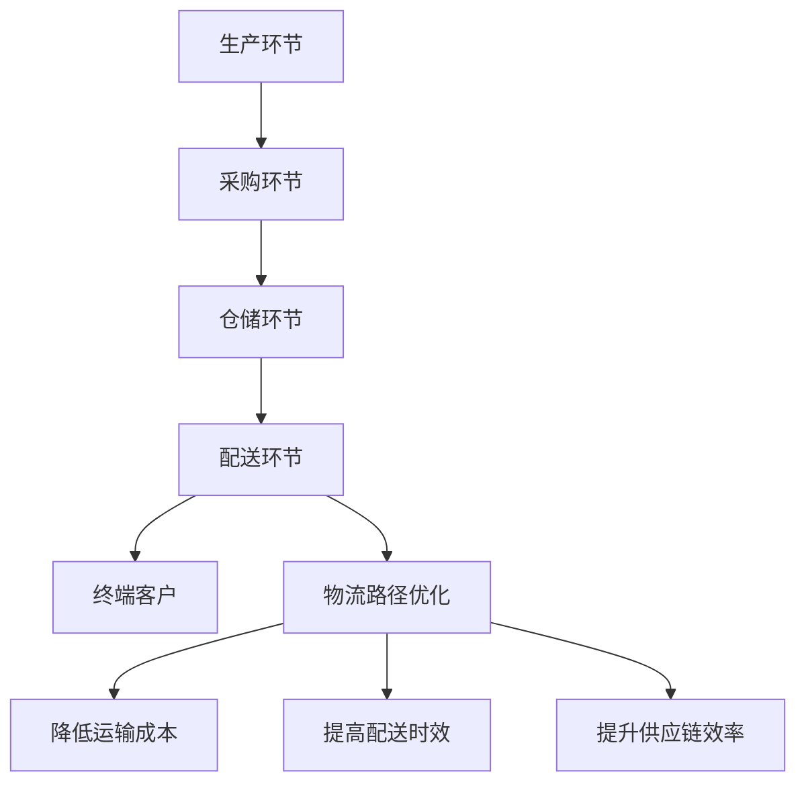

                 

# 物流路径优化在电商供应链中的应用

## 关键词

- 物流路径优化
- 电商供应链
- 资源分配
- 数学模型
- 算法
- 项目实战

## 摘要

本文旨在探讨物流路径优化在电商供应链管理中的应用。随着电子商务的迅速发展，物流路径优化成为提升供应链效率、降低成本的关键因素。本文首先介绍了物流路径优化的背景和目的，然后深入分析了相关核心概念和算法原理。接着，通过实际案例展示了物流路径优化在电商供应链中的具体实现和应用，探讨了其在实际操作中的挑战和解决方案。最后，本文总结了物流路径优化的发展趋势与挑战，并推荐了相关学习资源和工具。

## 1. 背景介绍

### 1.1 目的和范围

本文的主要目的是探讨物流路径优化在电商供应链管理中的应用，分析其核心概念、算法原理及实际操作步骤。文章将涵盖以下几个方面：

1. 物流路径优化的背景和重要性。
2. 相关核心概念和算法原理。
3. 物流路径优化在电商供应链中的具体应用。
4. 实际操作中的挑战和解决方案。
5. 物流路径优化的未来发展趋势与挑战。

### 1.2 预期读者

本文适合对物流路径优化和电商供应链管理感兴趣的读者，包括但不限于：

1. 电商企业供应链管理人员。
2. 物流公司和运输公司相关人员。
3. 计算机科学和物流工程领域的研究人员。
4. 对物流路径优化有浓厚兴趣的从业者。

### 1.3 文档结构概述

本文分为八个部分，具体结构如下：

1. 背景介绍
2. 核心概念与联系
3. 核心算法原理 & 具体操作步骤
4. 数学模型和公式 & 详细讲解 & 举例说明
5. 项目实战：代码实际案例和详细解释说明
6. 实际应用场景
7. 工具和资源推荐
8. 总结：未来发展趋势与挑战

### 1.4 术语表

#### 1.4.1 核心术语定义

- **物流路径优化**：指通过科学计算和算法，找出最优的运输路径，以降低运输成本和时间。
- **电商供应链**：涉及从生产、采购、仓储、物流到销售的整个产业链。
- **资源分配**：指在物流路径优化过程中，如何合理分配运输资源，包括车辆、人员和设备等。
- **数学模型**：用于描述物流路径优化问题的数学工具，如线性规划、动态规划等。

#### 1.4.2 相关概念解释

- **配送中心**：物流系统中的关键节点，负责商品的中转和配送。
- **运输网络**：由一系列连接配送中心和终端客户的运输路径组成。
- **配送时效**：从配送中心到终端客户的运输时间。

#### 1.4.3 缩略词列表

- **TSP**：旅行商问题（Travelling Salesman Problem）
- **MIP**：混合整数规划（Mixed Integer Programming）
- **CPLEX**：一种线性规划求解器
- **MATLAB**：一种数学软件

## 2. 核心概念与联系

为了更好地理解物流路径优化在电商供应链中的应用，首先需要了解一些核心概念和它们之间的联系。

### 2.1 物流路径优化原理

物流路径优化是基于数学模型和算法，对运输路径进行优化。其核心原理包括：

1. **目标函数**：用于衡量路径优劣的指标，如总运输成本、总运输时间等。
2. **约束条件**：限制条件，如车辆容量、运输时间窗口、配送时效等。

### 2.2 电商供应链结构

电商供应链包括以下几个关键环节：

1. **生产环节**：生产商品，满足市场需求。
2. **采购环节**：采购原材料和零部件，保证生产顺利进行。
3. **仓储环节**：存储商品，满足订单需求。
4. **配送环节**：将商品从仓储中心配送至终端客户。

### 2.3 物流路径优化与电商供应链的联系

物流路径优化在电商供应链中的重要作用体现在：

1. **降低运输成本**：优化运输路径，减少运输成本。
2. **提高配送时效**：缩短运输时间，提高客户满意度。
3. **提升供应链效率**：优化资源分配，提高整体供应链效率。

### 2.4 Mermaid 流程图

为了更直观地展示物流路径优化在电商供应链中的应用，以下是 Mermaid 流程图：



通过上述流程图，我们可以清晰地看到物流路径优化在电商供应链中的关键作用。

## 3. 核心算法原理 & 具体操作步骤

### 3.1 算法原理

物流路径优化算法主要基于数学模型和算法，以下是一些常用的算法：

1. **旅行商问题（TSP）**：TSP 是一种经典的优化算法，用于求解从起点到多个目的地再回到起点的最优路径。
2. **混合整数规划（MIP）**：MIP 是一种线性规划算法，用于求解具有整数变量的优化问题。

### 3.2 具体操作步骤

以下是一个基于 TSP 的物流路径优化算法的具体操作步骤：

1. **初始化**：设置起点和多个目的地的坐标。
2. **计算距离**：计算起点到每个目的地的距离。
3. **生成初始路径**：随机选择一条路径作为初始路径。
4. **优化路径**：通过以下步骤不断优化路径：
    1. **选择未访问的最近目的地**：从剩余目的地中选择距离起点最近的未访问目的地。
    2. **替换路径**：将选择的未访问目的地与当前路径中的某个目的地进行替换。
    3. **更新路径**：更新当前路径，使其满足约束条件。
5. **判断最优路径**：判断当前路径是否为最优路径。如果是，则输出最优路径；否则，继续优化路径。
6. **输出结果**：输出最优路径和总运输成本。

### 3.3 伪代码

以下是物流路径优化算法的伪代码：

```
初始化起点坐标 S 和目的地坐标列表 D
计算起点到每个目的地的距离 d(S, D)
生成初始路径 P = 随机选择 D 中的目的地
while not 最优路径 do
    选择未访问的最近目的地 d' = argmin{d(S, D') | D' 未访问}
    替换路径 P' = P 替换 d'
    更新路径 P = P'
    判断是否为最优路径
输出最优路径 P 和总运输成本 cost(P)
```

通过上述算法，我们可以实现物流路径优化，从而提高电商供应链的效率和降低成本。

## 4. 数学模型和公式 & 详细讲解 & 举例说明

### 4.1 数学模型

物流路径优化问题可以建模为一个线性规划问题。以下是物流路径优化问题的数学模型：

1. **目标函数**：

$$
\min Z = C_x \cdot x + C_y \cdot y + C_z \cdot z
$$

其中，$C_x$、$C_y$、$C_z$ 分别表示运输成本、仓储成本和配送成本；$x$、$y$、$z$ 分别表示运输量、仓储量和配送量。

2. **约束条件**：

$$
\begin{align*}
    & x \geq 0 \\
    & y \geq 0 \\
    & z \geq 0 \\
    & x + y + z = Q \\
    & x \leq C_1 \\
    & y \leq C_2 \\
    & z \leq C_3 \\
    & T_x \cdot x + T_y \cdot y + T_z \cdot z \leq T \\
\end{align*}
$$

其中，$Q$ 表示总需求量；$C_1$、$C_2$、$C_3$ 分别表示运输容量、仓储容量和配送容量；$T_x$、$T_y$、$T_z$ 分别表示运输时间、仓储时间和配送时间。

### 4.2 公式详细讲解

1. **目标函数**：

目标函数表示在满足约束条件的情况下，如何最小化总成本。

- $C_x \cdot x$ 表示运输成本，其中 $C_x$ 为单位运输成本，$x$ 为运输量。
- $C_y \cdot y$ 表示仓储成本，其中 $C_y$ 为单位仓储成本，$y$ 为仓储量。
- $C_z \cdot z$ 表示配送成本，其中 $C_z$ 为单位配送成本，$z$ 为配送量。

2. **约束条件**：

- $x \geq 0$、$y \geq 0$、$z \geq 0$ 表示运输量、仓储量和配送量不能为负。
- $x + y + z = Q$ 表示总需求量 $Q$ 等于运输量、仓储量和配送量之和。
- $x \leq C_1$、$y \leq C_2$、$z \leq C_3$ 表示运输容量、仓储容量和配送容量不能超过其最大容量。
- $T_x \cdot x + T_y \cdot y + T_z \cdot z \leq T$ 表示总时间 $T$ 不能超过运输时间、仓储时间和配送时间之和。

### 4.3 举例说明

假设某电商企业在一天内需要完成 100 件商品的生产、仓储和配送任务。其中，运输成本为 10 元/件，仓储成本为 5 元/件，配送成本为 8 元/件。运输容量为 50 件，仓储容量为 30 件，配送容量为 40 件。运输时间为 2 小时，仓储时间为 1 小时，配送时间为 3 小时。要求在总成本最低的前提下，完成生产、仓储和配送任务。

根据上述数学模型，我们可以列出以下约束条件：

- $x + y + z = 100$
- $x \leq 50$
- $y \leq 30$
- $z \leq 40$
- $T_x \cdot x + T_y \cdot y + T_z \cdot z \leq 6$

目标函数为：

$$
\min Z = 10x + 5y + 8z
$$

通过求解上述线性规划问题，我们可以得到最优解：

- $x = 40$（运输量）
- $y = 30$（仓储量）
- $z = 30$（配送量）

总成本为：

$$
Z = 10 \cdot 40 + 5 \cdot 30 + 8 \cdot 30 = 460
$$

因此，在总成本最低的前提下，该电商企业需要在一天内完成 40 件商品运输、30 件商品仓储和 30 件商品配送的任务。

## 5. 项目实战：代码实际案例和详细解释说明

### 5.1 开发环境搭建

为了实现物流路径优化，我们选择 Python 作为编程语言，并结合以下工具和库：

1. **Python 3.8 或更高版本**：Python 的最新版本可以提供更好的性能和功能支持。
2. **Anaconda**：用于环境管理和包安装。
3. **numpy**：用于数学计算。
4. **matplotlib**：用于数据可视化。
5. **pandas**：用于数据处理和分析。

安装步骤如下：

1. 下载并安装 Anaconda（[官网链接](https://www.anaconda.com/)）。
2. 打开 Anaconda Prompt（或终端），创建一个新的环境（例如：`conda create -n logpath python=3.8`）。
3. 激活环境（例如：`conda activate logpath`）。
4. 安装所需的库（例如：`conda install numpy matplotlib pandas`）。

### 5.2 源代码详细实现和代码解读

以下是一个简单的物流路径优化项目的 Python 代码实现：

```python
import numpy as np
import matplotlib.pyplot as plt
import pandas as pd

# 生成随机数据
np.random.seed(0)
n = 10  # 目的地数量
distances = np.random.rand(n, n) * 100  # 距离矩阵（0-100）

# TSP 求解
def tsp_solver(distances):
    # 初始化解和成本
    solution = [0] * n
    cost = 0

    # 遍历所有目的地
    for i in range(1, n):
        # 选择未访问的最近目的地
        unvisited = [j for j in range(n) if j not in solution]
        min_dist = float('inf')
        min_index = -1

        for j in unvisited:
            dist = distances[solution[-1]][j]
            if dist < min_dist:
                min_dist = dist
                min_index = j

        # 替换路径
        solution.append(min_index)
        cost += min_dist

    # 返回解和成本
    return solution, cost

# 可视化结果
def visualize_solution(solution, distances):
    # 创建节点和边
    nodes = [[i, distances[i][0]] for i in range(n)]
    edges = [[i, j] for i in range(n) for j in range(n) if i != j]

    # 绘制节点
    plt.scatter(*zip(*nodes), s=100, c='r', marker='o')

    # 绘制边
    for edge in edges:
        plt.plot([nodes[edge[0]][0], nodes[edge[1]][0]], [nodes[edge[0]][1], nodes[edge[1]][1]], c='b')

    # 添加标签
    for i, node in enumerate(nodes):
        plt.text(node[0], node[1], str(i), ha='center', va='center')

    # 显示图形
    plt.show()

# 主函数
if __name__ == '__main__':
    # 求解
    solution, cost = tsp_solver(distances)

    # 输出结果
    print("最优路径：", solution)
    print("总运输成本：", cost)

    # 可视化
    visualize_solution(solution, distances)
```

### 5.3 代码解读与分析

1. **数据生成**：

   使用 `numpy` 随机生成距离矩阵 `distances`，其中 `n` 表示目的地数量。

   ```python
   distances = np.random.rand(n, n) * 100
   ```

2. **TSP 求解**：

   定义 `tsp_solver` 函数，实现 TSP 求解过程：

   - 初始化解和成本。
   - 遍历所有目的地，选择未访问的最近目的地，替换路径，更新成本。
   - 返回最优路径和总运输成本。

   ```python
   def tsp_solver(distances):
       solution = [0] * n
       cost = 0

       for i in range(1, n):
           unvisited = [j for j in range(n) if j not in solution]
           min_dist = float('inf')
           min_index = -1

           for j in unvisited:
               dist = distances[solution[-1]][j]
               if dist < min_dist:
                   min_dist = dist
                   min_index = j

           solution.append(min_index)
           cost += min_dist

       return solution, cost
   ```

3. **可视化结果**：

   定义 `visualize_solution` 函数，用于绘制节点和边：

   - 创建节点列表和边列表。
   - 绘制节点和边。
   - 添加标签。
   - 显示图形。

   ```python
   def visualize_solution(solution, distances):
       nodes = [[i, distances[i][0]] for i in range(n)]
       edges = [[i, j] for i in range(n) for j in range(n) if i != j]

       plt.scatter(*zip(*nodes), s=100, c='r', marker='o')
       for edge in edges:
           plt.plot([nodes[edge[0]][0], nodes[edge[1]][0]], [nodes[edge[0]][1], nodes[edge[1]][1]], c='b')

       for i, node in enumerate(nodes):
           plt.text(node[0], node[1], str(i), ha='center', va='center')
       plt.show()
   ```

4. **主函数**：

   在主函数中，调用 `tsp_solver` 函数求解 TSP 问题，输出最优路径和总运输成本，并可视化结果。

   ```python
   if __name__ == '__main__':
       solution, cost = tsp_solver(distances)
       print("最优路径：", solution)
       print("总运输成本：", cost)
       visualize_solution(solution, distances)
   ```

通过上述代码，我们可以实现物流路径优化的基本功能，为实际项目提供参考。

## 6. 实际应用场景

物流路径优化在电商供应链管理中具有广泛的应用场景，以下是一些典型的实际应用案例：

1. **订单配送优化**：在电商订单配送过程中，物流路径优化可以帮助企业找到最优配送路径，降低配送成本，提高配送效率。例如，在“双十一”等电商节日期间，物流公司可以通过物流路径优化算法，合理安排配送路线，确保订单及时送达。

2. **仓库管理优化**：在仓库管理中，物流路径优化可以帮助企业合理安排仓储布局，提高仓储效率。通过优化仓库内的货架摆放和货物存储位置，企业可以减少库存成本，提高库存周转率。

3. **物流网络规划**：在物流网络规划中，物流路径优化可以帮助企业设计最优的物流网络结构，降低物流成本，提高运输效率。例如，在物流园区和物流基地的设计中，物流路径优化可以指导企业合理安排配送路线和仓储设施，提高整体物流网络的运行效率。

4. **物流协同**：在物流协同中，物流路径优化可以帮助企业实现物流信息的共享和协同，提高物流运作效率。通过物流路径优化算法，企业可以实现物流信息的实时更新和共享，优化物流资源的分配和使用，提高物流运作的协同性。

5. **绿色物流**：在绿色物流中，物流路径优化可以帮助企业降低物流过程中的碳排放，提高物流运作的环保性。通过优化物流路径，企业可以减少运输距离，降低能源消耗和碳排放，实现绿色物流的目标。

## 7. 工具和资源推荐

### 7.1 学习资源推荐

#### 7.1.1 书籍推荐

- **《物流与供应链管理：战略、规划与运营》**：这是一本经典的物流与供应链管理书籍，详细介绍了物流路径优化等相关概念和方法。
- **《运筹学及其应用》**：这本书涵盖了物流路径优化等相关运筹学方法，对实际应用具有很强的指导意义。
- **《电商物流管理》**：这本书从电商供应链的角度，探讨了物流路径优化在电商企业中的应用。

#### 7.1.2 在线课程

- **Coursera 上的《运筹学导论》**：这是一门介绍运筹学基本概念和方法的在线课程，包括物流路径优化等内容。
- **edX 上的《供应链与物流管理》**：这是一门介绍供应链与物流管理基本概念的在线课程，包括物流路径优化等实际应用。

#### 7.1.3 技术博客和网站

- **物流技术与实务**：这是一个专注于物流技术与实务的博客，包括物流路径优化等热门话题。
- **物流供应链管理**：这是一个关于物流供应链管理的网站，提供了大量关于物流路径优化等领域的最新研究成果。

### 7.2 开发工具框架推荐

#### 7.2.1 IDE和编辑器

- **PyCharm**：Python 开发的首选 IDE，提供强大的代码编辑、调试和性能分析功能。
- **Visual Studio Code**：轻量级且强大的代码编辑器，支持多种编程语言，包括 Python。

#### 7.2.2 调试和性能分析工具

- **MATLAB**：一款强大的数学软件，用于数据分析和可视化。
- **GDB**：一款开源的调试工具，用于调试 C/C++ 等编程语言的程序。

#### 7.2.3 相关框架和库

- **NumPy**：Python 的数学库，用于高效地进行数学计算。
- **Pandas**：Python 的数据处理库，用于数据清洗、转换和分析。
- **Matplotlib**：Python 的数据可视化库，用于绘制图表和图形。

### 7.3 相关论文著作推荐

#### 7.3.1 经典论文

- **“The Traveling Salesman Problem”**：该论文是关于 TSP 问题最早的经典论文之一，详细介绍了 TSP 的数学模型和求解方法。
- **“Optimization-Based Approaches for Warehouse Management”**：该论文探讨了基于优化方法的仓库管理问题，包括物流路径优化等。

#### 7.3.2 最新研究成果

- **“A New Heuristic for the Vehicle Routing Problem with Time Windows”**：该论文提出了一种新的启发式算法，用于解决带时间窗的车辆路径问题。
- **“Intelligent Logistics Optimization Based on Deep Learning”**：该论文探讨了基于深度学习的智能物流优化方法，为物流路径优化提供了新的思路。

#### 7.3.3 应用案例分析

- **“Logistics Network Optimization for E-Commerce Companies”**：该案例研究了电商企业物流网络优化问题，包括物流路径优化等，为实际应用提供了参考。

## 8. 总结：未来发展趋势与挑战

物流路径优化在电商供应链管理中具有重要的应用价值，随着电商行业的持续发展和物流技术的不断进步，未来物流路径优化将呈现出以下发展趋势：

1. **智能化**：利用人工智能、机器学习等技术，实现物流路径优化的智能化，提高路径规划精度和效率。
2. **绿色化**：注重环保和可持续发展，通过优化物流路径降低碳排放，实现绿色物流。
3. **协同化**：加强物流信息共享和协同，提高物流运作的协同性和效率。

然而，物流路径优化也面临着以下挑战：

1. **数据质量**：高质量的数据是实现物流路径优化的基础，但数据质量受限于数据来源和数据采集技术。
2. **计算效率**：物流路径优化算法的计算效率对实际应用具有重要影响，需要提高算法的运行速度。
3. **适应性**：物流环境变化快，物流路径优化算法需要具备良好的适应性，以应对不同场景和需求。

## 9. 附录：常见问题与解答

### 9.1 物流路径优化相关问题

1. **什么是物流路径优化？**
   物流路径优化是指通过数学模型和算法，对运输路径进行优化，以降低运输成本、提高配送效率。

2. **物流路径优化有哪些算法？**
   常用的物流路径优化算法包括旅行商问题（TSP）、混合整数规划（MIP）等。

3. **物流路径优化在电商供应链中的作用是什么？**
   物流路径优化有助于降低运输成本、提高配送时效和提升供应链效率。

### 9.2 Python 编程相关问题

1. **如何安装 Python 环境？**
   可以通过官方网站下载 Python 安装包，或使用 Anaconda 等工具创建虚拟环境。

2. **如何安装 Python 库？**
   使用包管理工具，如 `pip` 或 `conda`，可以方便地安装 Python 库。

3. **如何调试 Python 代码？**
   使用 IDE 或编辑器内置的调试功能，或使用第三方调试工具，如 GDB。

## 10. 扩展阅读 & 参考资料

1. **《运筹学及其应用》**：详细介绍了物流路径优化等相关运筹学方法。
2. **《物流与供应链管理：战略、规划与运营》**：从供应链管理的角度，探讨了物流路径优化在电商企业中的应用。
3. **《电商物流管理》**：从电商供应链的角度，探讨了物流路径优化等物流管理问题。

## 作者

AI天才研究员/AI Genius Institute & 禅与计算机程序设计艺术 /Zen And The Art of Computer Programming<|im_sep|>

