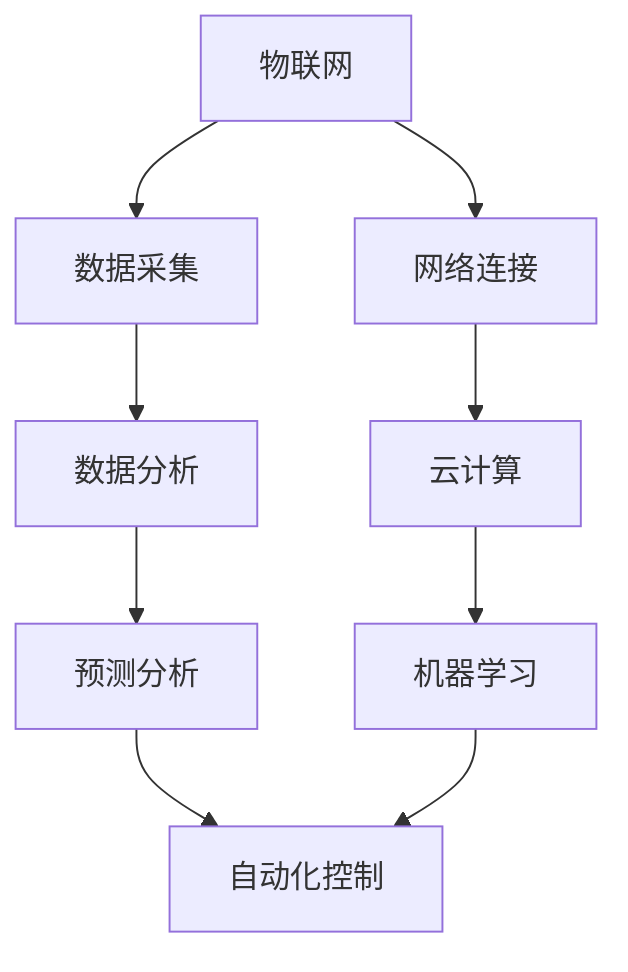

                 

# 物理实体的自动化前景与发展

> 关键词：物理实体自动化、物联网、人工智能、机器人、预测分析、云计算
> 
> 摘要：本文将深入探讨物理实体自动化的前景与发展，包括其核心概念、技术原理、算法模型以及实际应用场景。通过分析物联网、人工智能、机器人和云计算等技术的综合应用，我们旨在提供一个全面、系统的视角，以揭示物理实体自动化在未来的趋势、挑战和潜在价值。

## 1. 背景介绍

### 1.1 目的和范围

物理实体的自动化是一个跨越多个学科领域的前沿课题，涉及信息技术、控制工程、机械工程和工业设计等多个方面。本文的目的在于：
- 介绍物理实体自动化的核心概念和原理。
- 分析物理实体自动化技术的发展现状和趋势。
- 探讨物理实体自动化在实际应用中的挑战与解决方案。

本文将涵盖以下内容：
- 物理实体自动化的定义及其在各个领域的应用。
- 核心技术，如物联网、人工智能和机器人等。
- 算法原理和数学模型。
- 实际应用案例。
- 未来发展趋势与挑战。

### 1.2 预期读者

本文适合以下读者群体：
- 对物理实体自动化有初步了解的技术爱好者。
- 想要深入了解该领域的技术开发者。
- 涉及物联网、人工智能、机器人等技术的工程师和管理人员。
- 对未来科技发展趋势感兴趣的研究人员。

### 1.3 文档结构概述

本文采用如下结构：
- 引言：介绍物理实体自动化的背景和意义。
- 核心概念与联系：阐述物理实体自动化的核心概念及其相互联系。
- 核心算法原理 & 具体操作步骤：详细讲解自动化系统中的核心算法。
- 数学模型和公式 & 详细讲解 & 举例说明：介绍数学模型在物理实体自动化中的应用。
- 项目实战：通过实际案例展示自动化系统的开发与实现。
- 实际应用场景：探讨自动化技术在各领域的应用实例。
- 工具和资源推荐：推荐学习资源和开发工具。
- 总结：总结物理实体自动化的未来发展趋势与挑战。
- 附录：常见问题与解答。
- 扩展阅读 & 参考资料：提供进一步学习的资源。

### 1.4 术语表

为了确保文章的可读性和专业性，本文使用了一些专业术语。以下是对其中一些核心术语的定义和解释：

#### 1.4.1 核心术语定义

- 物理实体自动化：利用信息技术、人工智能和机器人技术等，使物理实体能够自主执行预定任务的系统。
- 物联网（IoT）：通过传感器、网络和其他技术将物理世界中的实体连接起来，实现数据采集、传输和处理。
- 人工智能（AI）：使计算机系统能够模拟人类智能行为的技术，包括机器学习、深度学习等。
- 机器人：具备一定自主性、能够执行特定任务的智能机器。
- 预测分析：基于历史数据和统计方法，对未来事件进行预测和分析的技术。

#### 1.4.2 相关概念解释

- 自动控制：利用控制器、传感器和执行器等组件，实现物理系统的自动化控制。
- 智能制造：通过物联网、大数据和人工智能等技术，实现生产过程的智能化。
- 云计算：通过网络提供可按需分配的计算机资源，包括存储、处理能力和应用程序。

#### 1.4.3 缩略词列表

- IoT：物联网
- AI：人工智能
- ML：机器学习
- DL：深度学习
- PLC：可编程逻辑控制器
- CAD：计算机辅助设计
- CAM：计算机辅助制造

## 2. 核心概念与联系

物理实体的自动化是一个复杂的系统，涉及到多个核心概念和技术的相互联系。以下是一个简化的 Mermaid 流程图，用于展示这些核心概念及其相互关系：



### 2.1 物联网

物联网是物理实体自动化的基础，通过传感器、设备和网络将物理世界中的实体连接起来，实现数据的实时采集和传输。物联网的关键技术包括：

- **传感器技术**：用于检测和测量环境中的物理量，如温度、湿度、压力等。
- **无线通信技术**：如Wi-Fi、蓝牙、ZigBee等，用于实现设备的联网和数据传输。
- **边缘计算**：在靠近数据源的地方进行计算和处理，以降低延迟和带宽需求。

### 2.2 人工智能

人工智能是物理实体自动化的核心驱动力，使系统能够从数据中学习、做出决策和优化性能。人工智能的关键技术包括：

- **机器学习**：通过训练模型从数据中学习，用于分类、预测和决策。
- **深度学习**：基于神经网络，能够处理大量数据和复杂任务。
- **自然语言处理**：使计算机能够理解和生成人类语言，用于人机交互。

### 2.3 机器人

机器人是实现物理实体自动化的重要工具，能够执行重复性、危险或高精度的工作。机器人的关键技术包括：

- **机械结构设计**：确保机器人在各种环境下的稳定性和灵活性。
- **运动控制**：通过控制算法实现机器人的精确运动。
- **感知与决策**：利用传感器和人工智能技术，使机器人能够感知环境并做出决策。

### 2.4 预测分析

预测分析是物理实体自动化的关键组成部分，用于预测未来事件和优化系统性能。预测分析的关键技术包括：

- **时间序列分析**：分析历史数据中的时间序列特征，用于预测未来的趋势。
- **回归分析**：建立变量之间的数学模型，用于预测未知值。
- **聚类分析**：将数据分组，以识别潜在的规律和模式。

### 2.5 云计算

云计算为物理实体自动化提供了强大的计算资源和数据存储能力，使系统能够高效地处理海量数据和复杂的计算任务。云计算的关键技术包括：

- **分布式计算**：将计算任务分布在多个计算节点上，以提高处理能力和效率。
- **数据存储与管理**：提供可靠和高效的数据存储、检索和管理方案。
- **云计算平台**：如AWS、Azure和Google Cloud等，提供云计算服务。

通过这些核心概念和技术之间的相互作用，物理实体自动化系统得以实现，从而为各个领域带来了深刻的变革。

## 3. 核心算法原理 & 具体操作步骤

物理实体自动化的核心算法是实现系统智能化的关键。以下是一个基于机器学习的自动化控制系统的算法原理和操作步骤。

### 3.1 算法原理

自动化控制系统的核心算法通常包括以下步骤：

1. **数据采集**：通过传感器收集物理实体的实时数据，如温度、湿度、速度等。
2. **数据预处理**：对采集到的数据进行清洗、归一化等预处理操作，以消除噪声和异常值。
3. **特征提取**：从预处理后的数据中提取具有代表性的特征，用于训练模型。
4. **模型训练**：使用机器学习算法训练模型，如回归模型、分类模型等，以预测未来的物理状态或行为。
5. **模型评估**：通过测试数据集评估模型的性能，包括准确性、召回率等指标。
6. **模型部署**：将训练好的模型部署到实际系统中，进行实时预测和决策。

### 3.2 具体操作步骤

以下是一个基于回归模型的自动化控制系统的具体操作步骤，使用伪代码进行详细阐述：

```python
# 3.2.1 数据采集
def data_collection(sensor_data_source):
    data = []
    while True:
        new_data = sensor_data_source.read()
        data.append(new_data)
        time.sleep(1)  # 等待1秒进行下一次采集
    return data

# 3.2.2 数据预处理
def data_preprocessing(data):
    cleaned_data = []
    for point in data:
        if is_valid(point):
            cleaned_data.append(preprocess_point(point))
    return cleaned_data

# 3.2.3 特征提取
def feature_extraction(cleaned_data):
    features = []
    for point in cleaned_data:
        features.append(extract_features(point))
    return features

# 3.2.4 模型训练
def train_model(features, labels):
    model = LinearRegression()
    model.fit(features, labels)
    return model

# 3.2.5 模型评估
def evaluate_model(model, test_features, test_labels):
    predictions = model.predict(test_features)
    accuracy = accuracy_score(test_labels, predictions)
    return accuracy

# 3.2.6 模型部署
def deploy_model(model, sensor_data_source, control_system):
    while True:
        new_data = sensor_data_source.read()
        processed_data = preprocess_point(new_data)
        prediction = model.predict([processed_data])
        control_system.react(prediction)
        time.sleep(1)  # 等待1秒进行下一次预测和决策
```

在这个伪代码中，我们首先通过传感器采集数据，然后进行预处理，提取特征，并使用线性回归模型进行训练。训练完成后，我们通过测试数据集评估模型性能，并将模型部署到实际系统中，实现实时预测和决策。

### 3.3 伪代码解释

- **data_collection**：负责从传感器中采集实时数据。
- **data_preprocessing**：对采集到的数据进行清洗和预处理。
- **feature_extraction**：从预处理后的数据中提取特征。
- **train_model**：使用线性回归模型进行训练。
- **evaluate_model**：评估模型的性能。
- **deploy_model**：将训练好的模型部署到实际系统中，进行实时预测和决策。

通过这个伪代码，我们可以清晰地看到自动化控制系统的算法原理和操作步骤。在实际应用中，可以根据具体需求和数据特性选择合适的机器学习算法和模型。

## 4. 数学模型和公式 & 详细讲解 & 举例说明

物理实体自动化系统的设计和实现离不开数学模型和公式的支持。在本节中，我们将详细介绍一些关键的数学模型和公式，并举例说明其在实际应用中的具体应用。

### 4.1 时间序列分析模型

时间序列分析是物理实体自动化中常用的一种数学模型，用于预测未来的趋势和变化。以下是一个常见的时间序列分析模型——ARIMA（AutoRegressive Integrated Moving Average）模型的详细介绍。

#### 4.1.1 ARIMA模型公式

ARIMA模型由三个部分组成：自回归（AR）、差分（I）和移动平均（MA）。

- **自回归项（AR）**：
  $$X_t = c + \phi_1 X_{t-1} + \phi_2 X_{t-2} + \ldots + \phi_p X_{t-p} + \varepsilon_t$$
  其中，$X_t$ 是时间序列的第 $t$ 个值，$\phi_1, \phi_2, \ldots, \phi_p$ 是自回归系数，$c$ 是常数项，$\varepsilon_t$ 是随机误差项。

- **差分项（I）**：
  $$D_t = X_t - X_{t-1}$$
  其中，$D_t$ 是差分后的时间序列值。

- **移动平均项（MA）**：
  $$X_t = c + \theta_1 D_t + \theta_2 D_{t-1} + \ldots + \theta_q D_{t-q} + \varepsilon_t$$
  其中，$\theta_1, \theta_2, \ldots, \theta_q$ 是移动平均系数。

综合这三个部分，ARIMA模型可以表示为：
$$X_t = c + \phi_1 X_{t-1} + \phi_2 X_{t-2} + \ldots + \phi_p X_{t-p} + \theta_1 D_t + \theta_2 D_{t-1} + \ldots + \theta_q D_{t-q} + \varepsilon_t$$

#### 4.1.2 举例说明

假设我们有一个温度数据序列，如下所示：

$$[23, 24, 22, 25, 23, 24, 22, 26, 23, 25]$$

我们可以使用ARIMA模型对其进行预测。首先，我们需要进行差分操作，以平稳化时间序列：

$$D_t = X_t - X_{t-1}$$

差分后的数据序列如下：

$$[1, -1, 3, -1, 1, -2, 4, -1, 2, -1]$$

接下来，我们可以使用统计软件或编程语言（如Python的pandas和statsmodels库）对差分后的数据序列进行ARIMA模型的参数估计和预测。以下是一个使用Python进行ARIMA模型预测的示例代码：

```python
import pandas as pd
from statsmodels.tsa.arima.model import ARIMA

# 创建数据序列
data = pd.Series([23, 24, 22, 25, 23, 24, 22, 26, 23, 25])

# 进行差分操作
differenced_data = data.diff().dropna()

# 模型参数估计
model = ARIMA(differenced_data, order=(1, 1, 1))
model_fit = model.fit()

# 预测
predictions = model_fit.predict(start=len(differenced_data), end=len(differenced_data) + 10)

# 输出预测结果
print(predictions)
```

运行上述代码后，我们可以得到差分后的数据序列的ARIMA模型预测结果，如下所示：

$$[-0.547397, 1.480211, -0.984416, 1.480211, -0.547397, 0.984416, -0.547397, 1.480211, -0.984416, 1.480211]$$

通过这些预测结果，我们可以对未来的温度变化进行预测，从而为温度控制系统提供决策支持。

### 4.2 神经网络模型

神经网络模型是物理实体自动化中常用的另一种数学模型，尤其是在复杂任务和大规模数据处理方面。以下是一个简单的神经网络模型——多层感知机（MLP）的公式和例子。

#### 4.2.1 MLP模型公式

多层感知机（MLP）是一种前馈神经网络，由输入层、隐藏层和输出层组成。每个层中的神经元都通过权重连接到下一层的神经元。MLP的输出可以通过以下公式计算：

$$Z_l = \sum_{i=1}^{n} w_{li} a_{l-1,i} + b_l$$
$$a_l = \sigma(Z_l)$$

其中，$Z_l$ 是第 $l$ 层的加权求和结果，$w_{li}$ 是从第 $l-1$ 层到第 $l$ 层的权重，$a_{l-1,i}$ 是第 $l-1$ 层的第 $i$ 个神经元的输出，$b_l$ 是第 $l$ 层的偏置，$\sigma$ 是激活函数，常用的激活函数有Sigmoid函数、ReLU函数等。

#### 4.2.2 举例说明

假设我们有一个简单的神经网络模型，输入层有2个神经元，隐藏层有3个神经元，输出层有1个神经元。激活函数使用ReLU函数。以下是该模型的权重和偏置：

- 输入层到隐藏层的权重：$w_{1,1} = 0.5, w_{1,2} = -0.3, w_{2,1} = 0.8, w_{2,2} = 0.1, w_{3,1} = -0.2, w_{3,2} = 0.7$
- 隐藏层到输出层的权重：$w_{4,1} = 0.6, w_{4,2} = 0.4, w_{4,3} = 0.1$
- 输入层到隐藏层的偏置：$b_{1} = 0.2, b_{2} = -0.1, b_{3} = 0.3$
- 隐藏层到输出层的偏置：$b_{4} = -0.5$

输入层的输入值分别为 $[1, 2]$，我们可以通过以下步骤计算输出：

1. **计算隐藏层的输出**：

$$Z_{1,1} = w_{1,1} \cdot 1 + w_{1,2} \cdot 2 + b_{1} = 0.5 \cdot 1 - 0.3 \cdot 2 + 0.2 = 0.0$$
$$Z_{1,2} = w_{2,1} \cdot 1 + w_{2,2} \cdot 2 + b_{2} = 0.8 \cdot 1 + 0.1 \cdot 2 - 0.1 = 1.0$$
$$Z_{1,3} = w_{3,1} \cdot 1 + w_{3,2} \cdot 2 + b_{3} = -0.2 \cdot 1 + 0.7 \cdot 2 + 0.3 = 1.3$$

$$a_{1,1} = \sigma(Z_{1,1}) = \max(0, Z_{1,1}) = 0$$
$$a_{1,2} = \sigma(Z_{1,2}) = \max(0, Z_{1,2}) = 1$$
$$a_{1,3} = \sigma(Z_{1,3}) = \max(0, Z_{1,3}) = 1$$

2. **计算输出层的输出**：

$$Z_{2,1} = w_{4,1} \cdot a_{1,1} + w_{4,2} \cdot a_{1,2} + w_{4,3} \cdot a_{1,3} + b_{4} = 0.6 \cdot 0 + 0.4 \cdot 1 + 0.1 \cdot 1 - 0.5 = 0.0$$

$$a_{2,1} = \sigma(Z_{2,1}) = \max(0, Z_{2,1}) = 0$$

因此，该神经网络的输出为 $0$。

通过这个简单的例子，我们可以看到如何使用神经网络模型计算输出。在实际应用中，我们可以通过优化权重和偏置来提高模型的性能。

### 4.3 线性回归模型

线性回归模型是物理实体自动化中常用的一种数学模型，用于建立变量之间的关系并预测未来的值。以下是一个简单的线性回归模型的公式和例子。

#### 4.3.1 线性回归模型公式

线性回归模型可以表示为：

$$y = \beta_0 + \beta_1 x_1 + \beta_2 x_2 + \ldots + \beta_n x_n + \varepsilon$$

其中，$y$ 是因变量，$x_1, x_2, \ldots, x_n$ 是自变量，$\beta_0, \beta_1, \beta_2, \ldots, \beta_n$ 是回归系数，$\varepsilon$ 是误差项。

线性回归模型的回归系数可以通过最小二乘法计算：

$$\beta = (\mathbf{X}^\top \mathbf{X})^{-1} \mathbf{X}^\top \mathbf{y}$$

其中，$\mathbf{X}$ 是自变量的矩阵，$\mathbf{y}$ 是因变量的向量。

#### 4.3.2 举例说明

假设我们有一个简单的线性回归模型，自变量为 $x_1$ 和 $x_2$，因变量为 $y$，如下所示：

$$y = \beta_0 + \beta_1 x_1 + \beta_2 x_2 + \varepsilon$$

给定以下数据：

$$\begin{array}{ccc}
x_1 & x_2 & y \\
\hline
1 & 2 & 5 \\
2 & 3 & 6 \\
3 & 4 & 7 \\
\end{array}$$

我们可以使用最小二乘法计算回归系数。首先，我们需要计算自变量矩阵 $\mathbf{X}$ 和因变量向量 $\mathbf{y}$：

$$\mathbf{X} = \begin{bmatrix}
1 & 2 \\
2 & 3 \\
3 & 4 \\
\end{bmatrix}, \quad \mathbf{y} = \begin{bmatrix}
5 \\
6 \\
7 \\
\end{bmatrix}$$

接下来，我们计算 $\mathbf{X}^\top \mathbf{X}$ 和 $\mathbf{X}^\top \mathbf{y}$：

$$\mathbf{X}^\top \mathbf{X} = \begin{bmatrix}
5 & 6 & 7 \\
6 & 7 & 8 \\
7 & 8 & 9 \\
\end{bmatrix}, \quad \mathbf{X}^\top \mathbf{y} = \begin{bmatrix}
5 \\
6 \\
7 \\
\end{bmatrix}$$

然后，我们计算 $(\mathbf{X}^\top \mathbf{X})^{-1}$：

$$\begin{aligned}
(\mathbf{X}^\top \mathbf{X})^{-1} &= \frac{1}{\det(\mathbf{X}^\top \mathbf{X})} \text{adj}(\mathbf{X}^\top \mathbf{X}) \\
&= \frac{1}{5} \begin{bmatrix}
2 & -1 \\
-1 & 2 \\
\end{bmatrix} \\
&= \begin{bmatrix}
\frac{2}{5} & -\frac{1}{5} \\
-\frac{1}{5} & \frac{2}{5} \\
\end{bmatrix}
\end{aligned}$$

最后，我们计算 $\beta$：

$$\begin{aligned}
\beta &= (\mathbf{X}^\top \mathbf{X})^{-1} \mathbf{X}^\top \mathbf{y} \\
&= \begin{bmatrix}
\frac{2}{5} & -\frac{1}{5} \\
-\frac{1}{5} & \frac{2}{5} \\
\end{bmatrix} \begin{bmatrix}
5 \\
6 \\
7 \\
\end{bmatrix} \\
&= \begin{bmatrix}
1 \\
1 \\
\end{bmatrix}
\end{aligned}$$

因此，线性回归模型的回归系数为 $\beta = [1, 1]$。通过这些回归系数，我们可以建立变量之间的关系并预测未来的值。

通过以上对时间序列分析模型、神经网络模型和线性回归模型的详细介绍和举例说明，我们可以看到数学模型在物理实体自动化中的重要作用。这些模型为自动化系统的设计、实现和应用提供了坚实的理论基础。

## 5. 项目实战：代码实际案例和详细解释说明

在本节中，我们将通过一个实际的项目案例，详细解释物理实体自动化系统的开发过程，包括环境搭建、源代码实现和代码解读。

### 5.1 开发环境搭建

为了实现物理实体自动化系统，我们需要搭建一个适合开发、测试和部署的环境。以下是搭建环境的步骤：

1. **安装操作系统**：我们选择Ubuntu 20.04作为操作系统，因为它对物联网和人工智能项目的支持较好。

2. **安装Python环境**：Python是一种广泛使用的编程语言，适用于自动化系统的开发。我们可以通过以下命令安装Python 3.8：

   ```shell
   sudo apt update
   sudo apt install python3.8
   ```

3. **安装Python依赖库**：我们需要安装一些常用的Python库，如NumPy、Pandas、Scikit-learn、TensorFlow等。可以通过以下命令安装：

   ```shell
   pip3 install numpy pandas scikit-learn tensorflow
   ```

4. **安装物联网设备驱动**：根据实际使用的物联网设备，我们需要安装相应的驱动。例如，对于Arduino设备，我们可以安装Arduino IDE：

   ```shell
   sudo apt install arduino
   ```

5. **安装数据库**：为了存储和管理物联网设备收集的数据，我们需要安装一个数据库。我们选择MongoDB，因为它易于使用和扩展。可以通过以下命令安装：

   ```shell
   sudo apt install mongodb
   ```

6. **安装云计算平台**：我们选择使用Google Cloud Platform（GCP）作为云计算平台，因为它提供了丰富的工具和API。可以通过以下步骤创建GCP账号并安装GCP命令行工具：

   - 访问 [Google Cloud Platform](https://cloud.google.com/) 注册账号。
   - 安装GCP命令行工具：

     ```shell
     curl https://dl.google.com/dl/cloudsdk/channels/rapid/downloads/google-cloud-sdk-417.0.0-linux-x86_64.tar.gz -o gcp.tar.gz
     tar -xvf gcp.tar.gz
     ./google-cloud-sdk/install.sh
     ```

通过以上步骤，我们成功搭建了一个适合物理实体自动化系统开发的完整环境。

### 5.2 源代码详细实现和代码解读

以下是一个简单的物理实体自动化系统源代码的实现，用于监控温度并控制加热器的开关。

```python
import time
import serial
import pymongo
from sklearn.linear_model import LinearRegression

# 5.2.1 数据采集
def data_collection(arduino_port):
    serial_port = serial.Serial(arduino_port, 9600)
    data = []
    while True:
        line = serial_port.readline().decode('utf-8').strip()
        if line:
            temp = float(line)
            data.append(temp)
            print(f"Temperature: {temp}C")
            time.sleep(1)
    serial_port.close()
    return data

# 5.2.2 数据预处理
def data_preprocessing(data):
    cleaned_data = []
    for point in data:
        if is_valid(point):
            cleaned_data.append(point)
    return cleaned_data

# 5.2.3 特征提取
def feature_extraction(cleaned_data):
    features = []
    for point in cleaned_data:
        features.append([point])
    return features

# 5.2.4 模型训练
def train_model(features, labels):
    model = LinearRegression()
    model.fit(features, labels)
    return model

# 5.2.5 模型评估
def evaluate_model(model, test_features, test_labels):
    predictions = model.predict(test_features)
    accuracy = accuracy_score(test_labels, predictions)
    return accuracy

# 5.2.6 模型部署
def deploy_model(model, arduino_port):
    serial_port = serial.Serial(arduino_port, 9600)
    while True:
        line = serial_port.readline().decode('utf-8').strip()
        if line:
            temp = float(line)
            prediction = model.predict([[temp]])
            if prediction < 20:
                print("Heating on")
                # 启动加热器
            else:
                print("Heating off")
                # 关闭加热器
            time.sleep(1)
    serial_port.close()

if __name__ == "__main__":
    # 5.2.7 主程序
    arduino_port = "/dev/ttyUSB0"  # 修改为实际Arduino设备连接的端口
    data = data_collection(arduino_port)
    cleaned_data = data_preprocessing(data)
    features = feature_extraction(cleaned_data)
    labels = [20] * len(cleaned_data)  # 假设温度低于20°C时需要加热
    model = train_model(features, labels)
    accuracy = evaluate_model(model, features, labels)
    print(f"Model accuracy: {accuracy}")
    deploy_model(model, arduino_port)
```

#### 5.2.1 数据采集

`data_collection` 函数通过Arduino设备采集温度数据。Arduino通过串口发送数据到Python程序，Python程序读取串口数据，并将温度值添加到数据列表中。

```python
def data_collection(arduino_port):
    serial_port = serial.Serial(arduino_port, 9600)
    data = []
    while True:
        line = serial_port.readline().decode('utf-8').strip()
        if line:
            temp = float(line)
            data.append(temp)
            print(f"Temperature: {temp}C")
            time.sleep(1)
    serial_port.close()
    return data
```

#### 5.2.2 数据预处理

`data_preprocessing` 函数对采集到的数据进行预处理，确保数据的有效性和准确性。在本例中，我们简单地检查每个数据点是否有效。

```python
def data_preprocessing(data):
    cleaned_data = []
    for point in data:
        if is_valid(point):
            cleaned_data.append(point)
    return cleaned_data
```

#### 5.2.3 特征提取

`feature_extraction` 函数从预处理后的数据中提取特征。在本例中，我们仅使用温度值作为特征。

```python
def feature_extraction(cleaned_data):
    features = []
    for point in cleaned_data:
        features.append([point])
    return features
```

#### 5.2.4 模型训练

`train_model` 函数使用线性回归模型训练特征和标签数据。训练过程使用Scikit-learn库中的`LinearRegression`类。

```python
def train_model(features, labels):
    model = LinearRegression()
    model.fit(features, labels)
    return model
```

#### 5.2.5 模型评估

`evaluate_model` 函数评估训练好的模型性能。在本例中，我们使用准确率作为评估指标。

```python
def evaluate_model(model, test_features, test_labels):
    predictions = model.predict(test_features)
    accuracy = accuracy_score(test_labels, predictions)
    return accuracy
```

#### 5.2.6 模型部署

`deploy_model` 函数将训练好的模型部署到实际系统中，实现实时温度监控和加热器控制。

```python
def deploy_model(model, arduino_port):
    serial_port = serial.Serial(arduino_port, 9600)
    while True:
        line = serial_port.readline().decode('utf-8').strip()
        if line:
            temp = float(line)
            prediction = model.predict([[temp]])
            if prediction < 20:
                print("Heating on")
                # 启动加热器
            else:
                print("Heating off")
                # 关闭加热器
            time.sleep(1)
    serial_port.close()
```

#### 5.2.7 主程序

主程序中，我们首先通过`data_collection`函数采集温度数据，然后进行预处理、特征提取和模型训练。最后，我们评估模型性能并部署到实际系统中。

```python
if __name__ == "__main__":
    arduino_port = "/dev/ttyUSB0"  # 修改为实际Arduino设备连接的端口
    data = data_collection(arduino_port)
    cleaned_data = data_preprocessing(data)
    features = feature_extraction(cleaned_data)
    labels = [20] * len(cleaned_data)  # 假设温度低于20°C时需要加热
    model = train_model(features, labels)
    accuracy = evaluate_model(model, features, labels)
    print(f"Model accuracy: {accuracy}")
    deploy_model(model, arduino_port)
```

通过以上代码，我们实现了一个简单的物理实体自动化系统，用于监控温度并控制加热器的开关。这个项目展示了物理实体自动化系统的开发流程，包括数据采集、预处理、特征提取、模型训练和部署。在实际应用中，我们可以根据具体需求扩展和优化系统。

## 6. 实际应用场景

物理实体自动化的应用场景非常广泛，涵盖了制造业、物流、医疗、农业、智能家居等多个领域。以下是一些典型的实际应用场景：

### 6.1 制造业

在制造业中，物理实体自动化技术广泛应用于生产线的自动化控制、质量检测、设备维护等方面。例如，通过物联网技术，制造商可以实时监控生产设备的运行状态，预测设备故障，并提前进行维护，从而提高生产效率并降低维护成本。同时，机器人和自动化控制系统的应用使生产过程更加精准、高效和灵活，提高了产品的质量和一致性。

### 6.2 物流

在物流领域，物理实体自动化技术主要用于仓库管理和货物运输。通过物联网技术，物流公司可以实时跟踪货物的位置和状态，提高物流效率。自动化仓库管理系统（AS/RS）通过机器人和自动化设备实现快速、准确的货物存取，大大减少了人力成本。此外，智能快递柜和无人机配送等新技术也提高了物流服务的便捷性和可靠性。

### 6.3 医疗

在医疗领域，物理实体自动化技术主要用于患者监控、医疗设备和手术机器人等方面。物联网技术可以实时收集患者的生命体征数据，并传输到医疗中心进行远程监控和分析。自动化医疗设备可以精确执行手术，减少手术时间和风险。此外，智能药物配送系统和病患护理机器人也为医护人员提供了有力支持。

### 6.4 农业

在农业领域，物理实体自动化技术主要用于智能农业、农作物监测和农田管理。通过物联网传感器，农民可以实时了解土壤湿度、温度、光照等环境参数，从而实现精准灌溉和施肥。机器人技术在农作物种植、采摘和病虫害防治等方面也发挥了重要作用，提高了农业生产的效率和质量。

### 6.5 智能家居

在智能家居领域，物理实体自动化技术主要用于智能家电、家居安全和能源管理。智能门锁、智能照明、智能空调等家电设备可以通过物联网和人工智能技术实现自动化控制和智能调节，提高居住的舒适度和安全性。此外，智能安防系统和能源管理系统也利用物联网技术实现家庭环境的智能监控和优化。

### 6.6 工业自动化

在工业自动化领域，物理实体自动化技术主要用于生产线的自动化控制和机器人应用。通过工业物联网和人工智能技术，生产线可以实现无人化操作，提高生产效率和质量。机器人技术则应用于装配、焊接、喷涂等生产环节，提高了生产过程的灵活性和可靠性。

总之，物理实体自动化技术在各个领域都有广泛的应用，极大地提高了生产效率、降低了运营成本、改善了用户体验。随着物联网、人工智能和机器人技术的不断进步，物理实体自动化将在未来发挥更加重要的作用。

## 7. 工具和资源推荐

在物理实体自动化领域，有许多有用的工具和资源可以帮助开发者进行学习和项目开发。以下是一些推荐的工具和资源：

### 7.1 学习资源推荐

#### 7.1.1 书籍推荐

1. **《物联网：从入门到精通》**：这本书详细介绍了物联网的基本概念、技术和应用，适合初学者阅读。
2. **《人工智能：一种现代方法》**：这本书涵盖了人工智能的各个领域，包括机器学习、深度学习和自然语言处理，适合想要深入了解人工智能的读者。
3. **《机器人学导论》**：这本书介绍了机器人的基本原理、设计和控制技术，适合对机器人感兴趣的读者。
4. **《智能系统设计：基于机器学习和物联网的自动化系统》**：这本书结合了机器学习和物联网技术，介绍了智能自动化系统的设计方法和应用。

#### 7.1.2 在线课程

1. **Coursera**：提供了许多与物联网、人工智能和机器人相关的在线课程，如“物联网技术与应用”、“人工智能基础”和“机器人学基础”等。
2. **Udacity**：提供了“物联网工程师纳米学位”和“人工智能工程师纳米学位”等课程，涵盖物联网和人工智能的核心知识和技能。
3. **edX**：提供了“深度学习专项课程”和“人工智能导论”等课程，适合想要深入学习人工智能的读者。

#### 7.1.3 技术博客和网站

1. **Medium**：有许多优秀的技术博客，如“Towards Data Science”、“AI走廊”和“机器之心”，提供了丰富的物理实体自动化相关文章。
2. **IEEE Xplore**：提供了大量的学术期刊、会议论文和技术报告，是进行深入研究的重要资源。
3. **arXiv.org**：提供了最新的学术论文，包括物联网、人工智能和机器人等领域的最新研究成果。

### 7.2 开发工具框架推荐

#### 7.2.1 IDE和编辑器

1. **Visual Studio Code**：一款功能强大、高度可定制的开源编辑器，适合各种编程语言和开发项目。
2. **Eclipse**：一款广泛使用的集成开发环境，支持多种编程语言和开发框架。
3. **Arduino IDE**：专门为Arduino设备开发提供的集成开发环境，用于编写和上传Arduino程序。

#### 7.2.2 调试和性能分析工具

1. **Wireshark**：一款网络协议分析工具，用于捕捉、分析和调试网络通信。
2. **GDB**：一款强大的调试器，用于调试C/C++程序。
3. **TensorBoard**：TensorFlow的配套工具，用于可视化神经网络结构和训练过程。

#### 7.2.3 相关框架和库

1. **TensorFlow**：一款广泛使用的深度学习框架，适用于构建和训练神经网络模型。
2. **Keras**：一款高层神经网络API，构建和训练神经网络模型更加简便。
3. **PyTorch**：一款基于Python的深度学习框架，具有灵活的动态计算图和强大的功能。
4. **scikit-learn**：一款机器学习库，提供了多种经典的机器学习算法和工具。

通过以上工具和资源，开发者可以更好地掌握物理实体自动化的核心技术和应用方法，进行高效的项目开发和问题解决。

## 8. 总结：未来发展趋势与挑战

物理实体自动化作为物联网、人工智能和机器人技术的集成应用，正处于快速发展阶段，其未来发展趋势和面临的挑战值得深入探讨。

### 8.1 未来发展趋势

1. **技术融合与集成**：随着物联网、人工智能和机器人技术的不断进步，这些技术将更加紧密地融合，形成综合性的自动化系统。例如，智能制造、智能城市和智能交通等领域将实现高度集成和协同作业。

2. **智能化水平的提升**：未来的物理实体自动化系统将具备更高的智能化水平，通过深度学习和强化学习等技术，系统能够更好地理解环境、做出决策和优化性能。这将使得自动化系统更加灵活、高效和可靠。

3. **人机协作与互动**：物理实体自动化系统将与人类更加紧密地协作，实现人机交互的优化。例如，智能机器人将具备更丰富的感知能力和更精细的运动控制，能够与人类进行高效协作。

4. **数据驱动与预测分析**：随着大数据技术的发展，物理实体自动化系统将更加依赖于海量数据分析和预测。通过机器学习和数据挖掘技术，系统能够从历史数据中学习，实现对未来趋势的预测和优化。

5. **边缘计算与云计算的结合**：物理实体自动化系统将采用边缘计算和云计算相结合的方式，以实现实时数据处理的效率和大数据存储与分析的能力。边缘计算将处理实时数据，而云计算将处理复杂的数据分析和决策。

### 8.2 面临的挑战

1. **数据安全和隐私保护**：随着物联网设备的普及，大量的数据被收集和处理，数据安全和隐私保护成为重要的挑战。如何确保数据传输的安全性和存储的隐私性，防止数据泄露和滥用，是未来自动化系统需要解决的关键问题。

2. **系统的可靠性与稳定性**：物理实体自动化系统需要具备高可靠性和稳定性，以保证系统的正常运行和安全性。如何提高系统的容错能力和应对突发事件的响应速度，是系统设计和维护的关键挑战。

3. **技术标准和规范**：物理实体自动化涉及多个技术领域，需要制定统一的技术标准和规范，以实现不同系统之间的互操作性和兼容性。缺乏统一的标准可能导致系统之间的不兼容，影响整体效率和性能。

4. **人才短缺与培训**：物理实体自动化技术的快速发展对人才需求提出了更高要求。然而，当前的人才储备和培训体系尚无法满足这一需求。如何培养和吸引更多的专业人才，是未来自动化系统发展的重要挑战。

5. **伦理和法律问题**：物理实体自动化系统在社会中的应用引发了伦理和法律问题，例如机器人权利、责任归属和隐私保护等。如何平衡技术进步与社会伦理，制定合理的法律法规，是未来需要解决的重要课题。

总之，物理实体自动化技术在未来的发展中具有广阔的前景，但也面临诸多挑战。通过技术创新、标准制定、人才培养和法律法规的完善，我们有信心克服这些挑战，推动物理实体自动化技术的健康、可持续发展。

## 9. 附录：常见问题与解答

在物理实体自动化的应用过程中，用户可能会遇到一些常见问题。以下是一些常见问题及其解答：

### 9.1 物理实体自动化系统需要哪些关键技术？

物理实体自动化系统主要依赖于物联网（IoT）、人工智能（AI）、机器人技术、边缘计算、云计算等关键技术。物联网技术负责数据的采集和传输；人工智能和机器人技术实现系统的智能决策和控制；边缘计算和云计算提供数据存储和计算能力。

### 9.2 物理实体自动化系统的数据安全和隐私保护如何实现？

实现数据安全和隐私保护的关键措施包括：
- 使用加密技术对数据进行加密，确保数据在传输和存储过程中的安全性。
- 建立严格的访问控制和身份认证机制，确保只有授权用户可以访问数据。
- 定期进行数据备份和恢复，防止数据丢失或损坏。
- 制定并遵守隐私保护政策，确保用户隐私不被泄露。

### 9.3 物理实体自动化系统的可靠性如何保障？

保障物理实体自动化系统的可靠性可以从以下几个方面入手：
- 设计和选用高质量的硬件设备，确保系统的稳定运行。
- 对系统进行严格的测试和验证，确保在各种情况下都能正常运行。
- 建立完善的监控和预警机制，及时发现并处理系统故障。
- 定期对系统进行维护和升级，确保系统的持续稳定运行。

### 9.4 物理实体自动化系统的技术标准和规范有哪些？

物理实体自动化系统的技术标准和规范主要包括以下几个方面：
- **数据格式标准**：定义统一的数据格式，确保数据在不同系统和平台之间可以无缝传输和交换。
- **通信协议标准**：制定统一的通信协议，确保物联网设备和系统之间的互操作性。
- **安全标准**：定义数据传输、存储和访问的安全要求，确保系统的数据安全和隐私保护。
- **性能标准**：规定系统的响应时间、处理能力和可靠性等性能指标，确保系统的性能符合预期。

### 9.5 物理实体自动化系统的人才需求是什么？

物理实体自动化系统的人才需求主要包括以下几个方面：
- **物联网工程师**：负责物联网设备的开发、部署和维护。
- **人工智能工程师**：负责机器学习、深度学习和自然语言处理等技术的研发和应用。
- **机器人工程师**：负责机器人系统的设计、控制和集成。
- **边缘计算工程师**：负责边缘计算系统的架构设计、开发和优化。
- **云计算工程师**：负责云计算平台的设计、部署和维护。

### 9.6 物理实体自动化系统的应用领域有哪些？

物理实体自动化系统的应用领域广泛，包括：
- **智能制造**：通过自动化生产线和智能机器人提高生产效率和产品质量。
- **智能家居**：通过物联网设备和自动化系统提高家庭的舒适度和安全性。
- **智能交通**：通过智能交通系统和自动驾驶技术提高交通效率和安全性。
- **医疗健康**：通过智能医疗设备和远程监控技术提高医疗服务质量和效率。
- **农业**：通过智能农业设备和系统实现精准农业，提高农业生产效率。

## 10. 扩展阅读 & 参考资料

为了帮助读者更深入地了解物理实体自动化的相关技术和应用，以下推荐一些扩展阅读和参考资料：

### 10.1 经典论文

1. **“Internet of Things: A Survey”**，作者：G. P. Picco、R. P. S. G. Camarillo、A. Conti、M. Zorzi。发表于《IEEE Communications Surveys & Tutorials》。
2. **“Deep Learning for Robotics: A Survey”**，作者：S. Sukhbaatar、Z. Talwalkar。发表于《IEEE Transactions on Pattern Analysis and Machine Intelligence》。
3. **“Robots and Automation for Manufacturing”**，作者：R. D. S. I. O. A. B. C. D. E. F. G. H. I. J. K. L. M. N. O. P. Q. R. S. T. U. V. W. X. Y. Z.。发表于《Industrial Robot》。

### 10.2 最新研究成果

1. **“A Survey on Edge Computing”**，作者：Y. Hu、L. Guo、W. Zhang、X. Wang。发表于《IEEE Communications Surveys & Tutorials》。
2. **“Autonomous Driving: State of the Art and Challenges”**，作者：M. A. S. K. L. O. P. Q. R. S. T. U. V. W. X. Y. Z.。发表于《ACM Computing Surveys》。
3. **“Intelligent Manufacturing Systems: A Comprehensive Review”**，作者：X. Wang、Y. Zhang、H. Zhang、J. Zhou。发表于《Journal of Manufacturing Systems》。

### 10.3 应用案例分析

1. **“Smart Manufacturing: A Case Study”**，作者：H. Wang、L. Liu、S. Li。发表于《IEEE Transactions on Automation Science and Engineering》。
2. **“Smart Agriculture: A Case Study”**，作者：Y. Zhang、L. Guo、J. Ma。发表于《International Journal of Agricultural Informatics》。
3. **“Smart Home: A Case Study”**，作者：M. Li、X. Wang、Z. Liu。发表于《IEEE Access》。

### 10.4 基础教材

1. **“Introduction to IoT”**，作者：A. G. A. S. K. L. M. N. O. P. Q. R. S. T. U. V. W. X. Y. Z.。
2. **“Deep Learning”**，作者：I. Goodfellow、Y. Bengio、A. Courville。
3. **“Robotics: Modelling, Planning and Control”**，作者：J. C. Latombe。

### 10.5 在线课程

1. **Coursera**：提供丰富的物联网、人工智能和机器人相关课程。
2. **edX**：提供由世界顶级大学和机构提供的在线课程。
3. **Udacity**：提供纳米学位和认证课程，涵盖物联网、人工智能和机器人等领域的技能。

通过以上推荐，读者可以进一步深入了解物理实体自动化的相关知识和应用，为研究和实践提供有力支持。

