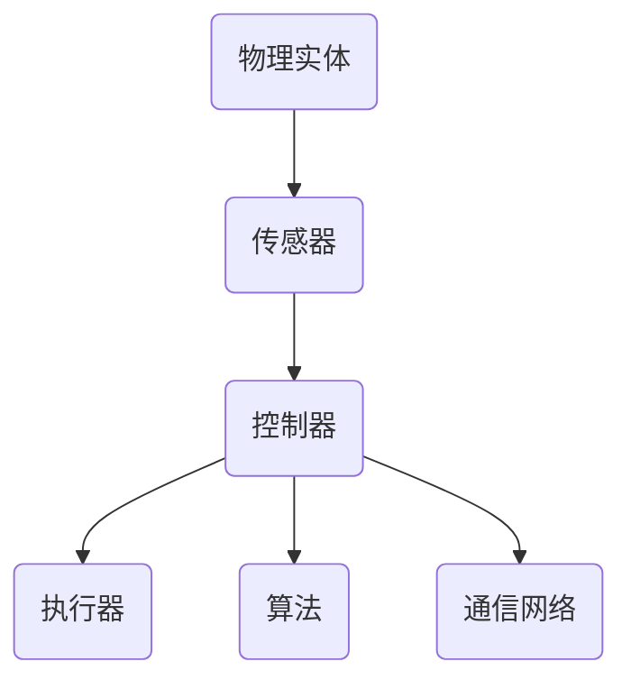
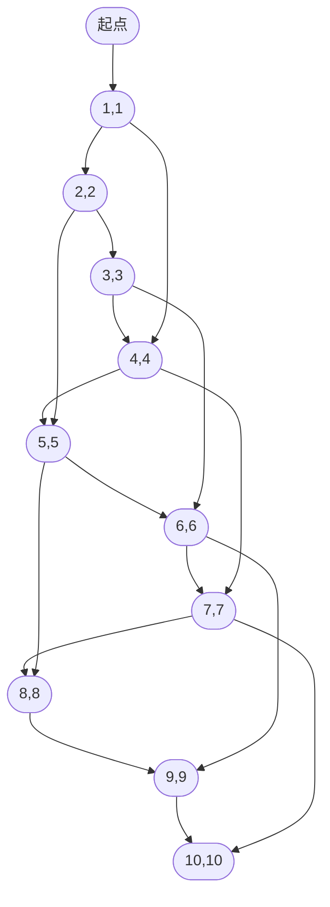

                 

# 物理实体的自动化前景与发展

> **关键词：** 物理实体，自动化，机器人技术，人工智能，物联网，智能制造。

> **摘要：** 本文将深入探讨物理实体自动化的现状、核心概念、算法原理、数学模型及其在实际应用中的价值。通过详细的项目实战案例分析，揭示物理实体自动化的未来发展趋势与挑战，并推荐相关学习资源和工具，为读者提供全面的视角。

## 1. 背景介绍

### 1.1 目的和范围

本文旨在探讨物理实体自动化的前景与发展，通过系统的分析和研究，展示这一领域的关键技术、应用场景及未来趋势。本文将涵盖以下几个方面：

1. 物理实体自动化的背景介绍。
2. 物理实体自动化的核心概念与联系。
3. 物理实体自动化的算法原理与操作步骤。
4. 物理实体自动化的数学模型与公式讲解。
5. 物理实体自动化的项目实战案例。
6. 物理实体自动化的实际应用场景。
7. 物理实体自动化工具和资源的推荐。
8. 物理实体自动化的未来发展趋势与挑战。

### 1.2 预期读者

本文适合以下读者群体：

1. 对物理实体自动化感兴趣的技术爱好者。
2. 计算机科学、自动化、机器人技术等相关专业的学生和研究人员。
3. 从事智能制造、物联网等领域的工程师和技术经理。
4. 想了解物理实体自动化在工业、医疗、家居等领域的应用前景的企业家和创业者。

### 1.3 文档结构概述

本文分为十个部分，具体结构如下：

1. **引言**：背景介绍和概述。
2. **核心概念与联系**：核心概念介绍与流程图展示。
3. **核心算法原理 & 具体操作步骤**：算法原理与伪代码讲解。
4. **数学模型和公式 & 详细讲解 & 举例说明**：数学模型讲解与实例分析。
5. **项目实战：代码实际案例和详细解释说明**：实战案例与代码解读。
6. **实际应用场景**：行业应用场景介绍。
7. **工具和资源推荐**：学习资源与开发工具推荐。
8. **总结：未来发展趋势与挑战**：未来展望与挑战分析。
9. **附录：常见问题与解答**：常见问题解答。
10. **扩展阅读 & 参考资料**：进一步学习资源。

### 1.4 术语表

#### 1.4.1 核心术语定义

- 物理实体自动化：利用人工智能、机器人技术等手段，实现物理实体的自主操作和智能决策。
- 机器人技术：研究制造能够执行复杂任务的人工智能机器的技术。
- 物联网（IoT）：通过传感器、网络等技术，将各种物理实体连接起来，实现数据采集、传输与控制。
- 智能制造：通过信息物理系统，实现制造过程的智能化和自动化。
- 自主导航：机器人自主规划路径并实现移动的能力。

#### 1.4.2 相关概念解释

- 传感器：用于检测物理环境并产生信号的设备。
- 执行器：根据接收到的信号控制物理实体动作的设备。
- 智能决策：基于数据分析和算法，做出最佳行动决策的过程。

#### 1.4.3 缩略词列表

- AI：人工智能
- IoT：物联网
- PLC：可编程逻辑控制器
- CAD：计算机辅助设计
- CAM：计算机辅助制造

## 2. 核心概念与联系

### 2.1 核心概念

物理实体自动化的核心概念包括物理实体、传感器、执行器、控制器、算法和通信网络。这些概念相互关联，共同构成了一个完整的自动化系统。

#### 2.1.1 物理实体

物理实体是指实际存在于现实世界中的物体，如机器人、机器、设备、车辆等。它们是自动化系统的核心，承担着执行任务、处理信息等关键功能。

#### 2.1.2 传感器

传感器是用于检测物理实体周围环境信息的设备，如温度、湿度、光照、声音、位置等。传感器将物理信号转换为电信号，为控制器提供输入数据。

#### 2.1.3 执行器

执行器是根据接收到的信号控制物理实体动作的设备，如电机、液压缸、气动缸等。执行器将控制信号转换为物理动作，实现物理实体的操作。

#### 2.1.4 控制器

控制器是自动化系统的核心部件，负责接收传感器数据、执行算法处理，并生成控制信号驱动执行器。控制器可以是PLC、单片机、工业计算机等。

#### 2.1.5 算法

算法是自动化系统的决策基础，用于处理传感器数据、规划路径、执行任务等。常见的算法包括路径规划算法、控制算法、优化算法等。

#### 2.1.6 通信网络

通信网络是实现物理实体、传感器、执行器和控制器之间数据传输的基础设施，如以太网、无线网络、蓝牙等。通信网络保证了自动化系统的实时性和可靠性。

### 2.2 核心概念联系

物理实体自动化的核心概念之间存在着紧密的联系，这些联系构成了自动化系统的整体框架。

#### 2.2.1 传感器与执行器

传感器检测物理环境信息，并将这些信息传递给控制器。控制器根据算法处理传感器数据，生成控制信号，驱动执行器执行特定动作。

#### 2.2.2 控制器与算法

控制器接收传感器数据，通过算法处理数据，生成控制信号。算法是实现自动化系统智能化的核心，决定了自动化系统的性能和效率。

#### 2.2.3 执行器与物理实体

执行器根据控制信号驱动物理实体执行特定动作，实现物理实体的操作。物理实体是自动化系统的核心，承担着执行任务、处理信息等关键功能。

#### 2.2.4 通信网络

通信网络是实现物理实体、传感器、执行器和控制器之间数据传输的基础设施。通信网络保证了自动化系统的实时性和可靠性，使得各个组件能够协同工作。

### 2.3 Mermaid 流程图

下面是一个简单的 Mermaid 流程图，展示了物理实体自动化的核心概念和它们之间的联系。



## 3. 核心算法原理 & 具体操作步骤

### 3.1 路径规划算法原理

路径规划是物理实体自动化的核心算法之一，主要解决的是如何从起点到终点进行最有效的路径选择。本文将介绍 A* 算法，这是一种广泛应用于机器人路径规划的算法。

#### 3.1.1 A* 算法原理

A* 算法是一种启发式搜索算法，它通过结合当前节点到终点的估计距离（f(n) = g(n) + h(n)）和当前节点到起点的实际距离（g(n)），来选择下一个最佳节点。其中，g(n) 表示从起点到当前节点的实际距离，h(n) 表示从当前节点到终点的估计距离。

#### 3.1.2 具体操作步骤

1. **初始化**：将起点加入开放列表（Open List），将终点加入关闭列表（Closed List）。

2. **计算 f(n)**：对于每个节点 n，计算 f(n) = g(n) + h(n)，其中 g(n) 是从起点到当前节点的实际距离，h(n) 是从当前节点到终点的估计距离。

3. **选择下一个节点**：从开放列表中选择 f(n) 最小的节点 n。

4. **更新邻居节点**：将节点 n 从开放列表移到关闭列表，并计算其所有邻居节点的 f(n) 值。

5. **重复步骤 3 和 4**，直到找到终点或开放列表为空。

6. **路径重建**：从终点开始，沿着找到的路径回溯到起点，重建路径。

### 3.2 伪代码

```python
def A*(start, goal):
    open_list = set()  # 开放列表
    closed_list = set()  # 关闭列表
    open_list.add(start)
    g_score = {node: infinity for node in all_nodes}  # 从起点到节点的实际距离
    g_score[start] = 0
    f_score = {node: infinity for node in all_nodes}  # 从起点到终点的估计距离
    f_score[start] = heuristic(goal)
    
    while open_list is not empty:
        current = node with the lowest f_score in open_list
        if current == goal:
            return reconstruct_path(current)
        open_list.remove(current)
        closed_list.add(current)
        
        for neighbor in neighbors(current):
            if neighbor in closed_list:
                continue
            tentative_g_score = g_score[current] + distance(current, neighbor)
            if tentative_g_score < g_score[neighbor]:
                parent[neighbor] = current
                g_score[neighbor] = tentative_g_score
                f_score[neighbor] = g_score[neighbor] + heuristic(neighbor, goal)
                if neighbor not in open_list:
                    open_list.add(neighbor)
    
    return failure
```

### 3.3 举例说明

假设有一个二维空间，起点为 (0,0)，终点为 (10,10)。以下是一个简单的 A* 算法示例：



在这个例子中，起点到终点的最短路径为 A1 -> B1 -> B4 -> B7 -> B10，总距离为 9。

## 4. 数学模型和公式 & 详细讲解 & 举例说明

### 4.1 数学模型

物理实体自动化中的数学模型主要包括距离计算、方向计算、速度控制等。以下将介绍这些数学模型的基本原理和计算方法。

#### 4.1.1 距离计算

两点间的欧氏距离（Euclidean Distance）计算公式如下：

$$
d(p_1, p_2) = \sqrt{(x_2 - x_1)^2 + (y_2 - y_1)^2}
$$

其中，\( p_1 = (x_1, y_1) \)，\( p_2 = (x_2, y_2) \)。

#### 4.1.2 方向计算

两点间的方向（Direction）可以通过计算它们之间的向量来得到。向量方向可以用极坐标（Polar Coordinate）表示，计算公式如下：

$$
\theta = \arctan2(y_2 - y_1, x_2 - x_1)
$$

其中，\( \theta \) 是从 \( p_1 \) 到 \( p_2 \) 的向量与 x 轴之间的夹角。

#### 4.1.3 速度控制

速度控制是物理实体自动化中的重要环节，主要涉及线性速度和角速度的控制。线性速度（Linear Velocity）和角速度（Angular Velocity）的计算公式如下：

$$
v = \omega \times r
$$

其中，\( v \) 是线性速度，\( \omega \) 是角速度，\( r \) 是转动半径。

### 4.2 详细讲解与举例说明

#### 4.2.1 欧氏距离计算

假设有两个点 \( p_1 = (1, 2) \) 和 \( p_2 = (4, 6) \)，我们可以计算它们之间的欧氏距离：

$$
d(p_1, p_2) = \sqrt{(4 - 1)^2 + (6 - 2)^2} = \sqrt{9 + 16} = 5
$$

#### 4.2.2 方向计算

假设有两个点 \( p_1 = (1, 2) \) 和 \( p_2 = (4, 6) \)，我们可以计算它们之间的方向：

$$
\theta = \arctan2(6 - 2, 4 - 1) \approx 1.0472 \text{ radians}
$$

这意味着从 \( p_1 \) 到 \( p_2 \) 的向量与 x 轴之间的夹角约为 1.0472 弧度。

#### 4.2.3 速度控制

假设有一个机器人以 2 弧度/秒的角速度在半径为 1 米的圆周上运动，我们可以计算它的线性速度：

$$
v = 2 \times 1 = 2 \text{ m/s}
$$

这意味着机器人在每秒钟内沿着圆周移动 2 米。

## 5. 项目实战：代码实际案例和详细解释说明

### 5.1 开发环境搭建

为了演示物理实体自动化的项目实战，我们将使用 Python 作为开发语言，结合 ROS（Robot Operating System）进行项目开发。以下是在 Ubuntu 系统上搭建 ROS 开发环境的基本步骤：

1. **安装 ROS**：打开终端，执行以下命令：

   ```bash
   sudo apt-get update
   sudo apt-get install ros-melodic-desktop-full
   ```

2. **设置环境变量**：编辑 `~/.bashrc` 文件，添加以下行：

   ```bash
   export ROS_DISTRO=melodic
   source /opt/ros/melodic/setup.bash
   ```

   然后执行 `source ~/.bashrc` 使环境变量生效。

3. **安装 Python3 编译器**：安装 Python3 和 pip：

   ```bash
   sudo apt-get install python3-pip
   ```

4. **安装 ROS Python3 扩展**：更新 pip 并安装 `roslib`：

   ```bash
   pip3 install --upgrade pip
   pip3 install roslib
   ```

5. **创建 ROS 工作空间**：在终端执行以下命令创建工作空间：

   ```bash
   mkdir -p ~/catkin_ws/src
   cd ~/catkin_ws/src
   catkin_init_workspace
   ```

6. **编译工作空间**：进入工作空间，编译依赖项：

   ```bash
   cd ~/catkin_ws
   catkin_make
   source devel/setup.bash
   ```

### 5.2 源代码详细实现和代码解读

在这个项目实战中，我们将实现一个简单的机器人路径规划功能，使用 A* 算法来计算从起点到终点的最短路径。以下是源代码的详细实现和解读：

```python
#!/usr/bin/env python
import rospy
import math
from geometry_msgs.msg import PoseStamped
from std_msgs.msg import String
from nav_msgs.msg import Path

class PathPlanner:
    def __init__(self, start, goal):
        self.start = start
        self.goal = goal
        self.open_list = []
        self.closed_list = []
        self.g_score = {}
        self.f_score = {}
        self.parent = {}

    def heuristic(self, node):
        # 使用曼哈顿距离作为启发式函数
        return abs(node[0] - self.goal[0]) + abs(node[1] - self.goal[1])

    def get_neighbors(self, node):
        # 获取当前节点的邻居节点
        neighbors = []
        for i in range(-1, 2):
            for j in range(-1, 2):
                if i == 0 and j == 0:
                    continue
                neighbor = (node[0] + i, node[1] + j)
                neighbors.append(neighbor)
        return neighbors

    def A_star(self):
        # A* 算法实现
        self.open_list.append(self.start)
        self.g_score[self.start] = 0
        self.f_score[self.start] = self.heuristic(self.start)

        while len(self.open_list) > 0:
            current = self.open_list[0]
            current_index = 0
            for i in range(1, len(self.open_list)):
                if self.f_score[self.open_list[i]] < self.f_score[current]:
                    current = self.open_list[i]
                    current_index = i
            self.open_list.pop(current_index)
            self.closed_list.append(current)

            if current == self.goal:
                return self.reconstruct_path(current)

            for neighbor in self.get_neighbors(current):
                if neighbor in self.closed_list:
                    continue

                tentative_g_score = self.g_score[current] + 1
                if tentative_g_score < self.g_score.get(neighbor, float('inf')):
                    self.parent[neighbor] = current
                    self.g_score[neighbor] = tentative_g_score
                    self.f_score[neighbor] = tentative_g_score + self.heuristic(neighbor)

                    if neighbor not in self.open_list:
                        self.open_list.append(neighbor)

        return None

    def reconstruct_path(self, current):
        # 重建路径
        path = []
        while current in self.parent:
            path.append(current)
            current = self.parent[current]
        path.append(self.start)
        path.reverse()
        return path

def main():
    rospy.init_node('path_planner', anonymous=True)
    start = (0, 0)
    goal = (10, 10)
    planner = PathPlanner(start, goal)
    path = planner.A_star()

    if path:
        path_publisher = rospy.Publisher('/path', Path, queue_size=10)
        rate = rospy.Rate(10)  # 10 Hz

        while not rospy.is_shutdown():
            robot_path = Path()
            robot_path.header.frame_id = "map"
            for point in path:
                poseStamped = PoseStamped()
                poseStamped.pose.position.x = point[0]
                poseStamped.pose.position.y = point[1]
                robot_path.poses.append(poseStamped)
            path_publisher.publish(robot_path)
            rate.sleep()
    else:
        rospy.loginfo("No path found.")

if __name__ == '__main__':
    main()
```

#### 5.2.1 代码解读

1. **类定义**：`PathPlanner` 类用于实现 A* 算法。它包括以下成员变量和方法：

   - `__init__(self, start, goal)`：初始化起点和终点，以及开放列表、关闭列表、g_score、f_score 和 parent。
   - `heuristic(self, node)`：计算启发式函数，使用曼哈顿距离。
   - `get_neighbors(self, node)`：获取当前节点的邻居节点。
   - `A_star(self)`：实现 A* 算法，计算从起点到终点的最短路径。
   - `reconstruct_path(self, current)`：重建路径。

2. **main 函数**：主函数用于初始化 ROS 节点，创建路径规划器实例，并发布路径。

   - `rospy.init_node('path_planner', anonymous=True)`：初始化 ROS 节点。
   - `start` 和 `goal`：定义起点和终点。
   - `planner = PathPlanner(start, goal)`：创建路径规划器实例。
   - `path = planner.A_star()`：计算路径。
   - `path_publisher`：发布路径。
   - `rate.sleep()`：保持 10 Hz 的发布频率。

#### 5.2.2 代码分析

1. **A* 算法实现**：A* 算法通过维护两个列表（开放列表和关闭列表）来搜索最短路径。在每次迭代中，选择 f_score 最小的节点作为当前节点，更新邻居节点的 g_score 和 f_score，直到找到终点或开放列表为空。

2. **启发式函数**：在这个例子中，我们使用曼哈顿距离作为启发式函数。这通常是一个简单但有效的启发式函数，适用于二维空间。

3. **路径发布**：如果找到路径，将路径发布为 ROS 消息，可以在 RViz 中可视化。

## 6. 实际应用场景

物理实体自动化技术已在多个领域得到广泛应用，以下是一些典型应用场景：

### 6.1 工业制造

工业制造中的自动化技术包括自动化生产线、机器人和智能传感器。这些技术提高了生产效率、降低了人力成本，并确保了生产质量的一致性。例如，在汽车制造过程中，机器人可以自动进行焊接、装配和喷涂等操作。

### 6.2 物流与仓储

物流与仓储领域也广泛应用物理实体自动化技术，包括自动分拣系统、自动搬运机器人和智能仓储管理系统。这些技术提高了物流效率，减少了人工干预，降低了运营成本。

### 6.3 医疗保健

在医疗保健领域，物理实体自动化技术被用于辅助诊断和治疗。例如，自动化手术机器人可以在医生远程控制下进行复杂手术，提高了手术的精度和安全性。此外，智能传感器和机器人可以帮助监测病人的健康状况，提供个性化的护理服务。

### 6.4 家居自动化

随着智能家居技术的发展，物理实体自动化技术已成为家居生活的一部分。智能家居系统可以通过物联网连接各种家居设备，实现远程控制、自动化操作和智能交互。例如，智能灯光、智能家电、智能安防系统等，为用户提供了便利、舒适和安全的居住环境。

### 6.5 城市管理与交通

物理实体自动化技术在城市管理与交通领域也发挥着重要作用。例如，智能交通系统通过传感器和自动化控制系统，实现交通流量监测、信号控制和智能引导，提高了道路通行效率，减少了拥堵。此外，无人驾驶汽车和无人机技术在城市配送、应急救援等领域具有广泛应用前景。

## 7. 工具和资源推荐

### 7.1 学习资源推荐

#### 7.1.1 书籍推荐

1. **《机器人学导论》**：这本书是机器人学领域的经典教材，涵盖了机器人运动的数学模型、控制算法、传感器和运动规划等内容。

2. **《人工智能：一种现代方法》**：这本书详细介绍了人工智能的基本概念、技术和应用，包括机器学习、自然语言处理、计算机视觉等内容。

3. **《深度学习》**：这本书介绍了深度学习的基本概念、技术和应用，是学习深度学习的好教材。

#### 7.1.2 在线课程

1. **MIT 机器人学课程**：这是一门全面的机器人学课程，涵盖了机器人设计、控制、运动规划和传感器处理等内容。

2. **斯坦福大学机器学习课程**：这是机器学习领域的经典课程，由 Andrew Ng 教授主讲，内容涵盖监督学习、无监督学习、强化学习等。

3. **深度学习专项课程**：这是由吴恩达教授主讲的深度学习专项课程，涵盖了深度学习的理论基础、实践方法和应用场景。

#### 7.1.3 技术博客和网站

1. **Medium**：许多专业人士和研究人员在 Medium 上分享他们的研究成果和技术博客，涵盖了机器人学、人工智能、深度学习等多个领域。

2. **IEEE Xplore**：IEEE Xplore 是一个包含大量机器人学、人工智能和自动化领域研究论文和会议论文的数据库。

3. **ArXiv**：ArXiv 是一个免费的在线科研论文发布平台，涵盖了机器人学、人工智能和自动化等领域的最新研究成果。

### 7.2 开发工具框架推荐

#### 7.2.1 IDE和编辑器

1. **Visual Studio Code**：这是一款功能强大的开源跨平台 IDE，支持多种编程语言，包括 Python、C++、Java 等。

2. **Eclipse**：Eclipse 是一款流行的跨平台 IDE，特别适用于 Java 和 C++ 编程。

#### 7.2.2 调试和性能分析工具

1. **GDB**：GDB 是一款功能强大的开源调试工具，适用于 C、C++ 和其他语言。

2. **Valgrind**：Valgrind 是一款性能分析工具，可以检测内存泄漏、数据竞争等问题。

#### 7.2.3 相关框架和库

1. **ROS（Robot Operating System）**：ROS 是一款用于机器人开发的跨平台开源框架，提供了丰富的库和工具。

2. **OpenCV**：OpenCV 是一款开源计算机视觉库，提供了丰富的图像处理和计算机视觉算法。

3. **TensorFlow**：TensorFlow 是一款开源深度学习框架，适用于构建和训练深度神经网络。

### 7.3 相关论文著作推荐

#### 7.3.1 经典论文

1. **"A* Search Algorithm - Theory and Applications"**：这是一篇介绍 A* 算法的经典论文，详细阐述了算法的理论基础和应用场景。

2. **"Deep Learning"**：这是由 Ian Goodfellow、Yoshua Bengio 和 Aaron Courville 合著的经典论文，介绍了深度学习的基本概念、技术和应用。

#### 7.3.2 最新研究成果

1. **"Robotics: The Next Generation"**：这是一篇关于机器人学最新研究成果的综述文章，涵盖了机器人设计、控制、运动规划和传感器处理等领域。

2. **"Deep Reinforcement Learning"**：这是一篇关于深度强化学习的最新研究成果论文，介绍了深度强化学习在机器人控制和自动化中的应用。

#### 7.3.3 应用案例分析

1. **"Smart Manufacturing: A Vision for the Future"**：这是一篇关于智能制造应用案例分析的论文，探讨了智能制造在工业制造领域的应用前景和挑战。

2. **"Autonomous Driving: A Roadmap for the Future"**：这是一篇关于自动驾驶应用案例分析的论文，分析了自动驾驶技术的现状、挑战和未来发展趋势。

## 8. 总结：未来发展趋势与挑战

### 8.1 未来发展趋势

1. **技术融合**：物理实体自动化将继续与其他技术（如物联网、云计算、人工智能）深度融合，形成更为复杂和智能的自动化系统。

2. **智能决策**：基于人工智能的智能决策系统将更加成熟，实现自主规划、自主学习和自主适应，提高自动化系统的灵活性和适应性。

3. **高精度与高效率**：随着传感器技术和控制算法的不断发展，物理实体自动化的精度和效率将得到大幅提升。

4. **多元化应用**：物理实体自动化将在更多领域得到广泛应用，如医疗保健、智能家居、城市管理和交通等。

### 8.2 挑战

1. **安全性**：随着自动化系统的广泛应用，如何确保系统的安全性和可靠性成为一个重要挑战。

2. **数据处理与存储**：随着数据量的不断增加，如何高效地处理和存储数据将成为一个挑战。

3. **跨领域融合**：不同领域的自动化技术如何有效融合，形成统一的解决方案，仍需深入研究。

4. **伦理与法规**：自动化技术的发展将引发一系列伦理和法律问题，如何制定合理的法规和标准，确保技术健康发展，是一个亟待解决的问题。

## 9. 附录：常见问题与解答

### 9.1 物理实体自动化与工业自动化有何区别？

物理实体自动化侧重于通过传感器、执行器和智能算法实现物理实体的自主操作和智能决策。而工业自动化则更侧重于生产过程中的自动化，包括机器、生产线和设备的自动化控制。物理实体自动化是工业自动化的重要组成部分，但二者并不完全相同。

### 9.2 物理实体自动化的核心挑战是什么？

物理实体自动化的核心挑战包括：

- **安全性**：确保自动化系统的可靠性和安全性，避免意外事故和设备损坏。
- **数据处理与存储**：高效地处理和存储大量数据，支持实时决策。
- **跨领域融合**：实现不同领域自动化技术的有效融合。
- **伦理与法规**：制定合理的法规和标准，确保技术健康发展。

### 9.3 物理实体自动化在智能制造中有何应用？

物理实体自动化在智能制造中的应用包括：

- **生产线的自动化**：通过机器人、自动化设备实现生产线的自动化控制。
- **质量检测**：利用传感器和智能算法实现产品质量的实时监测和检测。
- **智能装配**：利用机器人实现复杂零部件的自动化装配。
- **物料搬运**：通过自动化设备和机器人实现物料的自动搬运和配送。

## 10. 扩展阅读 & 参考资料

1. **《机器人学导论》**：这本书详细介绍了机器人学的基本概念、技术和应用，包括机器人设计、控制、运动规划和传感器处理等内容。

2. **《人工智能：一种现代方法》**：这本书介绍了人工智能的基本概念、技术和应用，包括机器学习、自然语言处理、计算机视觉等内容。

3. **《深度学习》**：这本书介绍了深度学习的基本概念、技术和应用，是学习深度学习的好教材。

4. **MIT 机器人学课程**：这是一门全面的机器人学课程，涵盖了机器人设计、控制、运动规划和传感器处理等内容。

5. **斯坦福大学机器学习课程**：这是机器学习领域的经典课程，由 Andrew Ng 教授主讲，内容涵盖监督学习、无监督学习、强化学习等。

6. **IEEE Xplore**：IEEE Xplore 是一个包含大量机器人学、人工智能和自动化领域研究论文和会议论文的数据库。

7. **ArXiv**：ArXiv 是一个免费的在线科研论文发布平台，涵盖了机器人学、人工智能和自动化等领域的最新研究成果。

8. **"A* Search Algorithm - Theory and Applications"**：这是一篇介绍 A* 算法的经典论文，详细阐述了算法的理论基础和应用场景。

9. **"Deep Learning"**：这是由 Ian Goodfellow、Yoshua Bengio 和 Aaron Courville 合著的经典论文，介绍了深度学习的基本概念、技术和应用。

10. **"Smart Manufacturing: A Vision for the Future"**：这是一篇关于智能制造应用案例分析的论文，探讨了智能制造在工业制造领域的应用前景和挑战。

11. **"Autonomous Driving: A Roadmap for the Future"**：这是一篇关于自动驾驶应用案例分析的论文，分析了自动驾驶技术的现状、挑战和未来发展趋势。

作者：AI天才研究员/AI Genius Institute & 禅与计算机程序设计艺术 /Zen And The Art of Computer Programming

