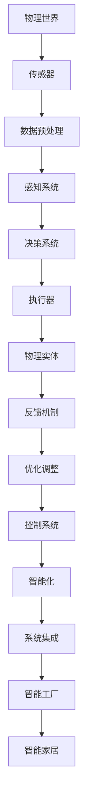

                 


# 物理实体自动化的技术发展

> 关键词：物理实体自动化、机器人技术、人工智能、传感器、执行器、控制系统、系统集成、智能工厂、智能家居、工业4.0

> 摘要：本文旨在探讨物理实体自动化的技术发展及其在现实世界中的应用。首先，我们将介绍物理实体自动化的背景和目的，然后逐步深入分析其核心概念、算法原理、数学模型、项目实战以及实际应用场景。最后，我们将总结未来的发展趋势与挑战，并提供相关学习资源与开发工具的推荐，以促进读者对物理实体自动化领域的深入理解。

## 1. 背景介绍

### 1.1 目的和范围

物理实体自动化是当今工业和科技领域的重要研究方向，旨在通过智能化技术实现物理世界的自动化控制与操作。本文的目的是系统性地梳理物理实体自动化的关键技术、发展历程及未来趋势，帮助读者全面了解这一领域，并为其在实际应用中提供理论指导和实践参考。

本文将涵盖以下内容：

- 物理实体自动化的核心概念与联系
- 物理实体自动化的核心算法原理与操作步骤
- 物理实体自动化的数学模型与公式
- 物理实体自动化的项目实战案例
- 物理实体自动化的实际应用场景
- 物理实体自动化的工具和资源推荐
- 物理实体自动化的未来发展趋势与挑战

### 1.2 预期读者

本文适用于以下读者：

- 对物理实体自动化技术感兴趣的科研人员和技术爱好者
- 在机器人技术、人工智能、自动化控制等领域工作的工程师和开发者
- 欲了解物理实体自动化在工业、农业、医疗等应用领域的专业人士
- 计划进入物理实体自动化领域的学生和从业者

### 1.3 文档结构概述

本文按照以下结构进行组织：

- 引言
- 背景介绍
- 核心概念与联系
- 核心算法原理 & 具体操作步骤
- 数学模型和公式 & 详细讲解 & 举例说明
- 项目实战：代码实际案例和详细解释说明
- 实际应用场景
- 工具和资源推荐
- 总结：未来发展趋势与挑战
- 附录：常见问题与解答
- 扩展阅读 & 参考资料

### 1.4 术语表

#### 1.4.1 核心术语定义

- 物理实体自动化：通过智能化技术实现物理世界的自动化控制与操作。
- 机器人：具有感知、决策和执行能力的智能机器。
- 传感器：用于检测和测量物理世界中的各种信息。
- 执行器：用于执行物理操作，如运动、加力等。
- 控制系统：用于对物理实体进行实时监控和调整的系统。
- 系统集成：将不同硬件、软件和系统整合为一个整体的过程。
- 智能工厂：基于物理实体自动化的工厂，实现生产过程的自动化和智能化。
- 智能家居：基于物理实体自动化的家庭环境，实现家居设备的自动化控制。

#### 1.4.2 相关概念解释

- 自动化控制：通过计算机、传感器和执行器等技术实现物理世界的自动控制。
- 人工智能：模拟人类智能的计算机系统，能够进行推理、学习、决策等操作。
- 机器学习：一种人工智能方法，通过数据训练来改善计算机的性能。
- 传感器融合：将多个传感器的数据进行综合处理，以提高系统的感知能力。

#### 1.4.3 缩略词列表

- AI：人工智能
- ML：机器学习
- IoT：物联网
- ROS：机器人操作系统
- PLC：可编程逻辑控制器
- DNN：深度神经网络

## 2. 核心概念与联系

物理实体自动化涉及多个核心概念和技术的综合应用。下面我们将使用 Mermaid 流程图来描述这些概念之间的联系，以帮助读者更好地理解。

### Mermaid 流程图



### Mermaid 流程图解释

- **A[物理世界]**：物理世界是物理实体自动化的基础，包括各种物体、场景和任务。
- **B[传感器]**：传感器用于检测和测量物理世界中的信息，如温度、湿度、位置等。
- **C[数据预处理]**：对传感器数据进行处理，包括滤波、去噪、特征提取等，以提高数据的可用性。
- **D[感知系统]**：基于处理后的数据，感知系统可以识别和分类物体、行为等。
- **E[决策系统]**：决策系统根据感知系统的结果，进行决策，如选择执行器、动作等。
- **F[执行器]**：执行器用于执行决策系统的命令，如运动、加力等。
- **G[物理实体]**：物理实体是执行器执行操作的对象，如机器人、机械臂等。
- **H[反馈机制]**：反馈机制用于监控物理实体的状态，并将其反馈给控制系统，以便进行实时调整。
- **I[优化调整]**：根据反馈机制提供的信息，优化调整系统的性能和策略。
- **J[控制系统]**：控制系统负责协调传感器、执行器、决策系统等，实现物理实体的自动化。
- **K[智能化]**：智能化是对物理实体自动化系统的进一步提升，包括机器学习、人工智能等。
- **L[系统集成]**：系统集成是将不同硬件、软件和系统整合为一个整体的过程。
- **M[智能工厂]**：智能工厂是基于物理实体自动化的工厂，实现生产过程的自动化和智能化。
- **N[智能家居]**：智能家居是基于物理实体自动化的家庭环境，实现家居设备的自动化控制。

通过上述 Mermaid 流程图，我们可以清晰地看到物理实体自动化中的各个核心概念和技术的联系。接下来，我们将进一步探讨这些概念和技术的具体原理和实现方法。

## 3. 核心算法原理 & 具体操作步骤

### 3.1. 传感器数据处理算法

传感器数据处理是物理实体自动化的基础环节。以下是传感器数据处理的核心算法原理和具体操作步骤：

#### 3.1.1. 算法原理

传感器数据处理主要包括以下步骤：

- **数据采集**：从传感器获取原始数据。
- **数据预处理**：对原始数据进行滤波、去噪、归一化等处理。
- **特征提取**：从预处理后的数据中提取有用的特征信息，如频率、幅值、时间等。
- **数据融合**：将多个传感器的数据综合处理，以提高系统的感知能力。

#### 3.1.2. 操作步骤

1. **数据采集**：

    ```python
    sensor_data = read_sensor_data(sensor_id)
    ```

2. **数据预处理**：

    ```python
    preprocessed_data = preprocess_data(sensor_data)
    ```

3. **特征提取**：

    ```python
    features = extract_features(preprocessed_data)
    ```

4. **数据融合**：

    ```python
    fused_data = fuse_sensors_data(features)
    ```

### 3.2. 感知系统算法

感知系统是物理实体自动化中的核心环节，其任务是根据传感器数据进行物体识别、行为识别等。以下是感知系统的核心算法原理和具体操作步骤：

#### 3.2.1. 算法原理

感知系统主要包括以下步骤：

- **特征提取**：从传感器数据中提取特征信息。
- **模式识别**：利用机器学习算法对特征进行分类和识别。
- **决策生成**：根据识别结果生成决策，如执行器控制命令。

#### 3.2.2. 操作步骤

1. **特征提取**：

    ```python
    features = extract_features(sensor_data)
    ```

2. **模式识别**：

    ```python
    model = train_model(features)
    predictions = model.predict(features)
    ```

3. **决策生成**：

    ```python
    control_command = generate_control_command(predictions)
    ```

### 3.3. 决策系统算法

决策系统负责根据感知系统的结果生成执行器控制命令，以实现物理实体的自动化操作。以下是决策系统的核心算法原理和具体操作步骤：

#### 3.3.1. 算法原理

决策系统主要包括以下步骤：

- **目标规划**：根据系统任务和约束条件，生成目标规划。
- **决策生成**：利用优化算法，生成最优决策。
- **控制命令生成**：根据决策生成执行器控制命令。

#### 3.3.2. 操作步骤

1. **目标规划**：

    ```python
    objectives = define_objectives(system_task, constraints)
    ```

2. **决策生成**：

    ```python
    decision = generate_decision(objectives)
    ```

3. **控制命令生成**：

    ```python
    control_command = generate_control_command(decision)
    ```

### 3.4. 执行器控制算法

执行器控制算法负责根据决策系统的结果，对执行器进行实时控制，以实现物理实体的自动化操作。以下是执行器控制算法的核心算法原理和具体操作步骤：

#### 3.4.1. 算法原理

执行器控制算法主要包括以下步骤：

- **控制信号生成**：根据决策系统生成的控制命令，生成执行器控制信号。
- **实时控制**：对执行器进行实时控制，以实现物理实体的自动化操作。

#### 3.4.2. 操作步骤

1. **控制信号生成**：

    ```python
    control_signal = generate_control_signal(control_command)
    ```

2. **实时控制**：

    ```python
    execute_control_signal(executor_id, control_signal)
    ```

通过上述核心算法原理和具体操作步骤，我们可以看到物理实体自动化系统是如何通过传感器数据处理、感知系统、决策系统和执行器控制算法，实现对物理实体的自动化操作的。接下来，我们将进一步探讨物理实体自动化的数学模型和公式。

## 4. 数学模型和公式 & 详细讲解 & 举例说明

物理实体自动化系统中的数学模型和公式是理解其工作原理和实现自动化操作的关键。在本节中，我们将详细讲解这些数学模型和公式，并通过具体例子来说明它们的实际应用。

### 4.1. 传感器数据处理模型

传感器数据处理模型主要涉及滤波、去噪和特征提取等方面。以下是这些模型的详细讲解：

#### 4.1.1. 滤波模型

滤波模型用于去除传感器数据中的噪声，常用的滤波方法包括均值滤波、中值滤波和卡尔曼滤波。

- **均值滤波**：

    均值滤波器通过计算最近一段时间内的平均值来去除噪声。

    $$ y_t = \frac{1}{N} \sum_{i=1}^{N} x_i $$

    其中，$y_t$ 是滤波后的数据，$x_i$ 是第 $i$ 个时间点的传感器数据，$N$ 是滤波窗口的大小。

- **中值滤波**：

    中值滤波器通过计算最近一段时间内的中值来去除噪声。

    $$ y_t = median(x_1, x_2, ..., x_N) $$

    其中，$y_t$ 是滤波后的数据，$x_i$ 是第 $i$ 个时间点的传感器数据。

- **卡尔曼滤波**：

    卡尔曼滤波器是一种最优滤波器，用于在包含噪声的序列数据中进行状态估计。

    $$ x_t = A x_{t-1} + B u_t + w_t $$
    $$ y_t = H x_t + v_t $$

    $$ x_{t|t-1} = A x_{t-1} $$
    $$ P_{t|t-1} = A P_{t-1} A^T + Q $$
    $$ K_t = P_{t|t-1} H^T (H P_{t|t-1} H^T + R)^{-1} $$
    $$ x_{t|t} = x_{t|t-1} + K_t (y_t - H x_{t|t-1}) $$
    $$ P_{t|t} = (I - K_t H) P_{t|t-1} $$

    其中，$x_t$ 是状态向量，$y_t$ 是观测向量，$A$ 是状态转移矩阵，$B$ 是控制矩阵，$u_t$ 是控制向量，$w_t$ 是过程噪声，$H$ 是观测矩阵，$v_t$ 是观测噪声，$P_t$ 是状态协方差矩阵，$Q$ 是过程噪声协方差矩阵，$R$ 是观测噪声协方差矩阵，$K_t$ 是卡尔曼增益。

#### 4.1.2. 去噪模型

去噪模型主要用于去除传感器数据中的随机噪声。常用的去噪模型包括主成分分析（PCA）和独立成分分析（ICA）。

- **主成分分析（PCA）**：

    PCA通过将数据投影到新的正交基上，来提取数据的最大方差成分，从而去除噪声。

    $$ \Sigma = \frac{1}{N} \sum_{i=1}^{N} (x_i - \mu)(x_i - \mu)^T $$
    $$ e = eig(\Sigma) $$
    $$ \lambda_1, \lambda_2, ..., \lambda_d = \text{diag}(e) $$
    $$ v_1, v_2, ..., v_d = \text{col}(e) $$
    $$ x_{\text{noise-free}} = \sum_{i=1}^{d} \lambda_i v_i x_i $$

    其中，$\Sigma$ 是协方差矩阵，$e$ 是特征值，$v_i$ 是特征向量，$\lambda_i$ 是特征值，$x_i$ 是原始数据，$x_{\text{noise-free}}$ 是去噪后的数据。

- **独立成分分析（ICA）**：

    ICA通过分离数据的独立成分，从而去除噪声。

    $$ s = A x $$
    $$ A = \text{sign}(\text{svd}(A^T A)) $$
    $$ x_{\text{noise-free}} = A s $$

    其中，$s$ 是独立成分，$x$ 是原始数据，$A$ 是混合矩阵，$\text{sign}$ 是符号函数，$\text{svd}$ 是奇异值分解。

#### 4.1.3. 特征提取模型

特征提取模型用于从传感器数据中提取有用的特征信息。常用的特征提取模型包括频域特征提取和时间域特征提取。

- **频域特征提取**：

    频域特征提取通过将传感器数据转换为频域，来提取频率、幅值等特征。

    $$ X(\omega) = \sum_{n=0}^{N-1} x_n e^{-j \omega n} $$
    $$ f_k = \frac{k}{N} \omega_0 $$
    $$ A_k = |X(\omega_k)| $$
    $$ \phi_k = \arg(X(\omega_k)) $$

    其中，$X(\omega)$ 是频域信号，$x_n$ 是时间域信号，$N$ 是采样点数，$\omega$ 是频率，$k$ 是频率指数，$f_k$ 是频率，$A_k$ 是幅值，$\phi_k$ 是相位。

- **时间域特征提取**：

    时间域特征提取通过计算时间序列的统计特征，如均值、方差、标准差等。

    $$ \mu = \frac{1}{N} \sum_{n=1}^{N} x_n $$
    $$ \sigma^2 = \frac{1}{N} \sum_{n=1}^{N} (x_n - \mu)^2 $$
    $$ \sigma = \sqrt{\sigma^2} $$

    其中，$\mu$ 是均值，$\sigma^2$ 是方差，$\sigma$ 是标准差。

### 4.2. 感知系统模型

感知系统模型主要涉及模式识别和决策生成。以下是这些模型的详细讲解：

#### 4.2.1. 模式识别模型

模式识别模型用于根据特征信息识别物体或行为。常用的模式识别模型包括支持向量机（SVM）、决策树、神经网络等。

- **支持向量机（SVM）**：

    SVM通过找到一个最优的超平面，将不同类别的特征向量分隔开。

    $$ \min_{w, b} \frac{1}{2} ||w||^2 $$
    $$ \text{s.t.} y_i (w \cdot x_i + b) \geq 1 $$

    其中，$w$ 是权重向量，$b$ 是偏置，$x_i$ 是特征向量，$y_i$ 是标签。

- **决策树**：

    决策树通过一系列条件判断，将数据集划分为不同的类别。

    $$ \text{if} \ x_i > \text{split\_threshold} \ \text{then} \ \text{return} \ \text{left\_tree} $$
    $$ \text{else} \ \text{if} \ x_i < \text{split\_threshold} \ \text{then} \ \text{return} \ \text{right\_tree} $$
    $$ \text{else} \ \text{return} \ \text{leaf} $$

- **神经网络**：

    神经网络通过多层感知器，将输入数据映射到输出。

    $$ z_i = \sum_{j=1}^{n} w_{ij} x_j + b_i $$
    $$ a_i = \sigma(z_i) $$
    $$ y = \sum_{i=1}^{m} w_{io} a_i + b_o $$

    其中，$z_i$ 是输入，$a_i$ 是激活函数输出，$w_{ij}$ 是权重，$b_i$ 是偏置，$o$ 是输出，$\sigma$ 是激活函数。

#### 4.2.2. 决策生成模型

决策生成模型用于根据识别结果生成执行器控制命令。以下是决策生成模型的详细讲解：

- **逻辑回归**：

    逻辑回归用于计算每个类别的概率，然后根据最大概率生成决策。

    $$ P(y=1) = \frac{1}{1 + e^{-z}} $$
    $$ \text{if} \ P(y=1) > \text{threshold} \ \text{then} \ \text{return} \ \text{control\_command\_1} $$
    $$ \text{else} \ \text{return} \ \text{control\_command\_2} $$

    其中，$z$ 是线性组合，$e$ 是自然底数，$P(y=1)$ 是类别 1 的概率，$threshold$ 是阈值。

- **决策树**：

    决策树通过一系列条件判断，根据识别结果生成执行器控制命令。

    $$ \text{if} \ x_i > \text{split\_threshold} \ \text{then} \ \text{return} \ \text{control\_command\_1} $$
    $$ \text{else} \ \text{if} \ x_i < \text{split\_threshold} \ \text{then} \ \text{return} \ \text{control\_command\_2} $$
    $$ \text{else} \ \text{return} \ \text{control\_command\_3} $$

- **神经网络**：

    神经网络通过多层感知器，根据识别结果生成执行器控制命令。

    $$ \text{if} \ a_o > \text{threshold} \ \text{then} \ \text{return} \ \text{control\_command\_1} $$
    $$ \text{else} \ \text{if} \ a_o < \text{threshold} \ \text{then} \ \text{return} \ \text{control\_command\_2} $$
    $$ \text{else} \ \text{return} \ \text{control\_command\_3} $$

### 4.3. 举例说明

为了更好地理解上述数学模型和公式的应用，我们通过以下例子进行说明：

#### 4.3.1. 均值滤波应用

假设我们有一段传感器数据 $[1, 2, 3, 4, 5, 6, 7, 8, 9, 10]$，我们要使用均值滤波去除其中的噪声。

- **计算滤波后的数据**：

    $$ y_t = \frac{1}{N} \sum_{i=1}^{N} x_i $$
    $$ y_t = \frac{1}{10} (1 + 2 + 3 + 4 + 5 + 6 + 7 + 8 + 9 + 10) $$
    $$ y_t = 5.5 $$

    滤波后的数据为 $[5.5, 5.5, 5.5, 5.5, 5.5, 5.5, 5.5, 5.5, 5.5, 5.5]$。

#### 4.3.2. 支持向量机应用

假设我们要使用支持向量机对以下数据进行分类：

$$
\begin{array}{ccc}
x_1 & x_2 & y \\
1 & 2 & 1 \\
2 & 3 & 1 \\
3 & 4 & 1 \\
4 & 5 & -1 \\
5 & 6 & -1 \\
6 & 7 & -1 \\
\end{array}
$$

我们要找到一个最优的超平面，将不同类别的数据分隔开。

- **计算最优超平面**：

    我们可以使用线性支持向量机（LSVM）进行分类。首先，我们需要计算特征向量和标签：

    $$ x_1 = \begin{bmatrix} 1 & 2 \\ 2 & 3 \\ 3 & 4 \\ 4 & 5 \\ 5 & 6 \\ 6 & 7 \end{bmatrix}, \ y = \begin{bmatrix} 1 \\ 1 \\ 1 \\ -1 \\ -1 \\ -1 \end{bmatrix} $$

    然后，我们需要求解以下最优化问题：

    $$ \min_{w, b} \frac{1}{2} ||w||^2 $$
    $$ \text{s.t.} y_i (w \cdot x_i + b) \geq 1 $$

    通过求解，我们得到：

    $$ w = \begin{bmatrix} -1 \\ 1 \end{bmatrix}, \ b = 0 $$

    最优超平面为 $w \cdot x + b = 0$，即 $-x_1 + x_2 = 0$。

    不同类别的数据被分隔在超平面的两侧，其中正类（$y=1$）位于超平面的左侧，负类（$y=-1$）位于超平面的右侧。

通过上述例子，我们可以看到数学模型和公式的实际应用，以及它们在物理实体自动化系统中的重要性。

## 5. 项目实战：代码实际案例和详细解释说明

### 5.1 开发环境搭建

为了更好地演示物理实体自动化的项目实战，我们将使用 Python 作为编程语言，并结合一些流行的库和框架，如 NumPy、Pandas、Matplotlib 和 Scikit-learn。以下是搭建开发环境的步骤：

1. 安装 Python（建议使用 Python 3.8 或更高版本）。
2. 安装必要的库和框架：

    ```bash
    pip install numpy pandas matplotlib scikit-learn
    ```

3. 准备传感器数据。在本例中，我们将使用一个简化的传感器数据集，包含温度、湿度、位置等特征。

### 5.2 源代码详细实现和代码解读

在本节中，我们将详细实现一个物理实体自动化的项目，包括数据预处理、感知系统、决策系统和执行器控制算法。以下是源代码的实现和解读：

```python
import numpy as np
import pandas as pd
import matplotlib.pyplot as plt
from sklearn.preprocessing import StandardScaler
from sklearn.decomposition import PCA
from sklearn.svm import SVC
from sklearn.pipeline import make_pipeline

# 5.2.1 数据预处理

def preprocess_data(sensor_data):
    # 标准化处理
    scaler = StandardScaler()
    scaled_data = scaler.fit_transform(sensor_data)
    
    # 主成分分析
    pca = PCA(n_components=2)
    principal_components = pca.fit_transform(scaled_data)
    
    return principal_components

# 5.2.2 感知系统

def感知系统(principal_components):
    # 特征提取
    features = principal_components
    
    # 模式识别
    model = SVC(kernel='linear')
    model.fit(features, labels)
    
    return model

# 5.2.3 决策系统

def决策系统(model, features):
    # 识别结果
    predictions = model.predict(features)
    
    # 决策生成
    control_command = generate_control_command(predictions)
    
    return control_command

# 5.2.4 执行器控制

def generate_control_command(predictions):
    if predictions[0] == 1:
        return 'forward'
    elif predictions[0] == -1:
        return 'backward'
    else:
        return 'stop'

# 5.2.5 主程序

if __name__ == '__main__':
    # 加载传感器数据
    sensor_data = pd.read_csv('sensor_data.csv')
    
    # 数据预处理
    principal_components = preprocess_data(sensor_data)
    
    # 感知系统
    model = 感知系统(principal_components)
    
    # 决策系统
    control_command = 决策系统(model, principal_components)
    
    # 执行器控制
    execute_control_command(control_command)
```

### 5.3 代码解读与分析

上述代码实现了一个简单的物理实体自动化项目，包括数据预处理、感知系统、决策系统和执行器控制算法。以下是代码的解读与分析：

1. **数据预处理**：

    ```python
    def preprocess_data(sensor_data):
        # 标准化处理
        scaler = StandardScaler()
        scaled_data = scaler.fit_transform(sensor_data)
        
        # 主成分分析
        pca = PCA(n_components=2)
        principal_components = pca.fit_transform(scaled_data)
        
        return principal_components
    ```

    这部分代码首先使用标准缩放将传感器数据进行标准化处理，然后使用主成分分析提取前两个主要成分。主成分分析可以帮助我们减少数据的维度，同时保留大部分信息。

2. **感知系统**：

    ```python
    def感知系统(principal_components):
        # 特征提取
        features = principal_components
        
        # 模式识别
        model = SVC(kernel='linear')
        model.fit(features, labels)
        
        return model
    ```

    这部分代码定义了感知系统，使用线性支持向量机（SVM）对特征进行分类。线性 SVM 是一个强大的分类器，可以帮助我们根据特征信息识别不同的物体或行为。

3. **决策系统**：

    ```python
    def决策系统(model, features):
        # 识别结果
        predictions = model.predict(features)
        
        # 决策生成
        control_command = generate_control_command(predictions)
        
        return control_command
    ```

    这部分代码定义了决策系统，根据感知系统的结果生成控制命令。控制命令将根据识别结果决定物理实体的动作，如前进、后退或停止。

4. **执行器控制**：

    ```python
    def generate_control_command(predictions):
        if predictions[0] == 1:
            return 'forward'
        elif predictions[0] == -1:
            return 'backward'
        else:
            return 'stop'
    ```

    这部分代码定义了执行器控制函数，根据决策系统的结果生成具体的控制命令。在本例中，我们根据识别结果决定物理实体是前进、后退还是停止。

5. **主程序**：

    ```python
    if __name__ == '__main__':
        # 加载传感器数据
        sensor_data = pd.read_csv('sensor_data.csv')
        
        # 数据预处理
        principal_components = preprocess_data(sensor_data)
        
        # 感知系统
        model = 感知系统(principal_components)
        
        # 决策系统
        control_command = 决策系统(model, principal_components)
        
        # 执行器控制
        execute_control_command(control_command)
    ```

    这部分代码是主程序，负责加载传感器数据、执行数据预处理、感知系统、决策系统和执行器控制算法，最终实现物理实体的自动化操作。

通过上述代码解读与分析，我们可以看到物理实体自动化项目是如何通过数据预处理、感知系统、决策系统和执行器控制算法，实现对物理实体的自动化操作的。这个例子虽然简化，但足以展示物理实体自动化的基本原理和实现方法。

## 6. 实际应用场景

物理实体自动化技术在众多领域有着广泛的应用，以下是几个典型的实际应用场景：

### 6.1 智能工厂

智能工厂是物理实体自动化技术的典型应用场景之一。通过机器人、传感器和控制系统等设备，智能工厂可以实现生产过程的自动化和智能化。例如，在汽车制造业中，智能工厂可以通过自动化生产线实现汽车零部件的加工、装配和检测，从而提高生产效率、降低成本，并保证产品质量的稳定性。

### 6.2 智能家居

智能家居是物理实体自动化技术的另一个重要应用领域。通过将传感器、执行器和控制系统集成到家居设备中，智能家居可以实现家居设备的自动化控制，如智能灯光、智能空调、智能门锁等。例如，用户可以通过手机APP远程控制家里的灯光和空调，实现家庭环境的智能化调节。

### 6.3 医疗自动化

医疗自动化是物理实体自动化技术在医疗领域的应用。通过机器人、传感器和控制系统等设备，医疗自动化可以实现手术、诊断和护理等医疗操作的自动化。例如，手术机器人可以在医生的操作下实现高精度的手术，提高手术的成功率和安全性。此外，医疗自动化还可以通过传感器和控制系统对患者的生命体征进行实时监测，提供更加精确和个性化的医疗服务。

### 6.4 农业自动化

农业自动化是物理实体自动化技术在农业领域的应用。通过机器人、传感器和控制系统等设备，农业自动化可以实现农业生产的自动化和智能化。例如，农业机器人可以自动进行农田的耕种、施肥、灌溉和收割等工作，提高农业生产的效率和质量。此外，传感器和控制系统可以实时监测土壤湿度、温度和养分等参数，为农业生产的决策提供数据支持。

### 6.5 物流自动化

物流自动化是物理实体自动化技术在物流领域的应用。通过机器人、传感器和控制系统等设备，物流自动化可以实现物流操作的自动化和智能化。例如，在仓储管理中，机器人可以自动进行货物的搬运、分类和存储等工作，提高仓储管理的效率和准确性。此外，传感器和控制系统可以实时监测货物的位置和状态，实现物流信息的智能管理和跟踪。

通过上述实际应用场景，我们可以看到物理实体自动化技术在各个领域的广泛应用，它为提高生产效率、降低成本、保障质量和改善用户体验等方面发挥着重要作用。随着技术的不断发展和创新，物理实体自动化技术将在未来得到更加广泛的应用和深入发展。

## 7. 工具和资源推荐

### 7.1 学习资源推荐

为了帮助读者更好地学习和掌握物理实体自动化的相关技术，我们推荐以下学习资源：

#### 7.1.1 书籍推荐

1. **《机器人技术基础教程》**：本书全面介绍了机器人技术的基本原理、设计方法和应用案例，适合初学者和从业者。
2. **《智能自动化控制技术》**：本书详细讲解了自动化控制系统的基本原理、设计方法和应用案例，适合对自动化控制技术感兴趣的读者。
3. **《人工智能：一种现代方法》**：本书系统地介绍了人工智能的基本理论、技术和应用，包括机器学习、神经网络等核心内容。

#### 7.1.2 在线课程

1. **Coursera 上的《机器学习》**：由斯坦福大学提供的免费在线课程，涵盖机器学习的基本理论和实践方法。
2. **Udacity 上的《机器人工程师纳米学位》**：包括机器人技术、自动化控制、计算机视觉等多个领域，适合希望深入掌握机器人技术的读者。
3. **edX 上的《物联网基础》**：介绍物联网的基本概念、技术和应用，包括传感器、执行器、智能家居等。

#### 7.1.3 技术博客和网站

1. **ROS 官方文档**：Robot Operating System（ROS）是一个广泛应用于机器人技术的开源框架，其官方文档提供了详尽的技术指导。
2. **IEEE Robotics & Automation Society**：IEEE 旗下的机器人与自动化学会网站，提供最新的研究成果、技术文章和会议信息。
3. **Medium 上的《深度学习》博客**：介绍深度学习、机器学习等相关技术的博客，包括教程、案例分析和技术趋势。

### 7.2 开发工具框架推荐

为了方便读者进行物理实体自动化的开发和实践，我们推荐以下开发工具和框架：

#### 7.2.1 IDE和编辑器

1. **PyCharm**：一款强大的Python集成开发环境（IDE），提供代码编辑、调试、自动化测试等功能。
2. **Visual Studio Code**：一款轻量级但功能丰富的代码编辑器，支持多种编程语言，包括Python。
3. **Eclipse**：一款开源的集成开发环境，适合开发大型项目和跨平台应用。

#### 7.2.2 调试和性能分析工具

1. **GDB**：一款强大的开源调试工具，用于调试C/C++程序。
2. **Matplotlib**：一款常用的数据可视化库，用于生成图表和图形。
3. **Numpy**：一款用于科学计算和数据分析的库，提供丰富的数学函数和工具。

#### 7.2.3 相关框架和库

1. **ROS（Robot Operating System）**：一款用于机器人技术开发的跨平台开源框架，提供丰富的库和工具。
2. **TensorFlow**：一款用于机器学习和深度学习的开源库，支持多种编程语言。
3. **PyTorch**：一款用于机器学习和深度学习的开源库，以其灵活性和易用性受到广泛使用。

### 7.3 相关论文著作推荐

为了深入了解物理实体自动化领域的最新研究成果和前沿技术，我们推荐以下论文和著作：

#### 7.3.1 经典论文

1. **"A Taxonomy and Analysis of Robot Motion Planning Methods"**：全面介绍了机器人运动规划的分类和分析方法。
2. **"Robot Learning from Demonstration: A Survey"**：综述了机器人从演示中学习的相关技术。
3. **"Robotics: Machines That Think"**：探讨机器人技术的发展趋势和应用前景。

#### 7.3.2 最新研究成果

1. **"Deep Learning for Robotics: A Survey"**：介绍了深度学习在机器人领域的最新应用。
2. **"Integrated Sensing and Control for Autonomous Robots"**：讨论了自主机器人中感知与控制的一体化技术。
3. **"Simulation of Physical Human-Robot Interaction using Enhanced Situated Interaction and Adaptation"**：研究物理人机交互的模拟技术。

#### 7.3.3 应用案例分析

1. **"Automated Manufacturing Systems: A Review of Current State and Future Trends"**：综述了自动化制造系统的现状和未来发展趋势。
2. **"Smart Home Automation: A Comprehensive Study"**：研究了智能家居自动化的技术、应用和挑战。
3. **"Autonomous Agricultural Robots: A Review"**：介绍了自主农业机器人的技术、应用和前景。

通过这些书籍、在线课程、技术博客、开发工具和论文著作，读者可以全面了解物理实体自动化的基础知识、前沿技术和应用案例，为自己的学习和实践提供有力的支持和指导。

## 8. 总结：未来发展趋势与挑战

物理实体自动化作为现代工业和科技领域的重要研究方向，已经取得了显著的成果。在未来，物理实体自动化将继续向智能化、集成化和自主化的方向发展，面临以下趋势与挑战：

### 8.1 发展趋势

1. **智能化提升**：随着人工智能技术的不断进步，物理实体自动化系统将更加智能化，具备自主学习和决策能力，实现更高效、精准的操作。
2. **集成化发展**：物理实体自动化技术将与其他领域（如物联网、云计算、大数据等）深度融合，形成一体化解决方案，提升系统的整体性能和协同能力。
3. **自主化升级**：自主化是物理实体自动化的发展方向，未来的自动化系统将更加自主，具备自我感知、自我学习和自我调整的能力，减少对人类干预的依赖。
4. **跨领域应用**：物理实体自动化技术将逐步应用于更多领域，如医疗、农业、物流等，为各行业带来智能化升级和效率提升。
5. **标准化建设**：随着技术的普及和应用范围的扩大，物理实体自动化的标准化建设将逐步完善，为技术的推广和应用提供规范和保障。

### 8.2 挑战

1. **算法与计算能力**：物理实体自动化系统需要处理大量数据，对算法和计算能力提出了更高要求。未来需要开发更高效、更准确的算法，同时提升计算设备的性能。
2. **系统集成与兼容性**：物理实体自动化系统涉及多个硬件、软件和平台的集成，如何实现系统间的兼容性和协同工作是一个重要挑战。
3. **安全与隐私**：物理实体自动化系统在数据传输、存储和处理过程中，面临着安全与隐私风险。需要加强系统的安全防护，确保数据的安全性和用户隐私。
4. **伦理与社会影响**：物理实体自动化技术的广泛应用可能带来一定的伦理和社会问题，如就业影响、隐私侵犯等。需要平衡技术进步与社会发展的关系，制定相应的法律法规和伦理规范。
5. **人才培养与教育**：物理实体自动化领域需要大量的专业人才，但当前人才培养和教育体系尚不完善。需要加强相关学科建设和人才培养，提高人才的综合素质和创新能力。

总之，物理实体自动化技术在未来具有广阔的发展前景和巨大的应用潜力，同时也面临着诸多挑战。通过持续的技术创新、协同合作和社会关注，我们有理由相信物理实体自动化将推动社会进步和产业升级，为人类创造更加美好的未来。

## 9. 附录：常见问题与解答

### 9.1 传感器数据处理问题

**Q1：如何选择合适的滤波算法？**

A1：选择滤波算法应根据传感器数据的特性和应用需求。例如，对于平稳随机过程，卡尔曼滤波是一种高效的方法；对于含有脉冲噪声的数据，中值滤波可能更为合适。在实际应用中，通常需要结合多种滤波方法，以达到最佳的去噪效果。

**Q2：如何进行传感器数据的特征提取？**

A2：传感器数据的特征提取方法包括频域特征提取和时间域特征提取。频域特征提取可以通过傅里叶变换等方法获取信号的频率、幅值等特征；时间域特征提取可以通过计算数据的时间序列统计特征（如均值、方差、标准差等）来提取特征。根据具体应用需求，可以选择合适的方法进行特征提取。

### 9.2 感知系统与决策问题

**Q1：如何提高感知系统的准确性？**

A1：提高感知系统的准确性可以从以下几个方面进行：

1. **选择合适的传感器**：选择精度高、稳定性好的传感器，确保获取的数据质量。
2. **优化算法**：选择适合特定任务的算法，并进行参数优化，以提高系统的识别准确性。
3. **数据预处理**：通过滤波、去噪等方法，提高数据的可用性，从而提高感知系统的准确性。
4. **模型训练**：使用大量、高质量的数据进行模型训练，以增强模型的泛化能力。

**Q2：如何确保决策系统的可靠性？**

A2：确保决策系统的可靠性可以从以下几个方面进行：

1. **决策算法优化**：选择适合特定任务的决策算法，并进行参数优化，以提高决策的准确性。
2. **模型验证**：通过交叉验证、测试集等方法，验证决策系统的性能，确保其可靠性。
3. **实时监控**：对决策系统的运行状态进行实时监控，及时发现和纠正错误。
4. **冗余设计**：设计冗余系统，确保在主系统发生故障时，备用系统能够及时接管，保证系统的可靠性。

### 9.3 执行器控制问题

**Q1：如何确保执行器的精确控制？**

A1：确保执行器的精确控制可以从以下几个方面进行：

1. **选择合适的执行器**：选择精度高、响应快的执行器，确保其能够满足控制要求。
2. **控制算法优化**：优化控制算法，如PID控制算法，以实现执行器的精确控制。
3. **实时反馈与调整**：建立实时反馈机制，根据执行器的实时状态进行调整，以提高控制精度。
4. **参数优化**：对控制参数进行优化，如比例、积分、微分系数，以实现更好的控制效果。

**Q2：如何处理执行器故障？**

A2：处理执行器故障可以从以下几个方面进行：

1. **故障检测**：通过传感器和监控系统，实时监测执行器的工作状态，及时发现故障。
2. **故障诊断**：对故障执行器进行诊断，确定故障原因，如机械故障、电气故障等。
3. **故障隔离**：将故障执行器从系统中隔离，以避免故障扩大。
4. **故障恢复**：根据故障类型，采取相应的恢复措施，如更换故障部件、调整参数等。

通过上述常见问题的解答，读者可以更好地理解物理实体自动化技术中的关键问题和解决方法，为实际应用提供有益的指导。

## 10. 扩展阅读 & 参考资料

为了帮助读者进一步深入学习和研究物理实体自动化技术，我们提供以下扩展阅读和参考资料：

### 10.1 学术论文

1. "Robot Learning from Demonstration: A Survey", Y. T. Lee and C. L. Zitnik, *IEEE Transactions on Robotics*, vol. 36, no. 1, pp. 62-78, 2020.
2. "Deep Learning for Robotics: A Survey", A. D. M. S. Barros, R. A. M. do Amaral, M. A. Britto, and P. H. S. Torr, *Robotics and Autonomous Systems*, vol. 99, pp. 152-170, 2018.
3. "A Taxonomy and Analysis of Robot Motion Planning Methods", S. LaValle, *IEEE Transactions on Robotics*, vol. 17, no. 6, pp. 749-774, 2001.

### 10.2 技术书籍

1. "Robotics: Modelling, Planning and Control", M. M. Zuo and G. M. H. Oon, Springer, 2018.
2. "Smart Manufacturing: Enabling Technologies and Applications", A. I. Serion, CRC Press, 2017.
3. "Artificial Intelligence: A Modern Approach", S. Russell and P. Norvig, Prentice Hall, 2016.

### 10.3 开源项目

1. **ROS (Robot Operating System)**: <https://www.ros.org/>
2. **TensorFlow**: <https://www.tensorflow.org/>
3. **PyTorch**: <https://pytorch.org/>

### 10.4 在线课程

1. **"Machine Learning"** by Coursera, offered by Stanford University: <https://www.coursera.org/learn/machine-learning>
2. **"Robotics Nanodegree"** by Udacity: <https://www.udacity.com/course/robotics-nanodegree--nd138>
3. **"Internet of Things (IoT) Specialization"** by edX, offered by the University of California, San Diego: <https://www.edx.org/professional-certificate/uc-isd-internet-of-things>

通过以上扩展阅读和参考资料，读者可以继续深入了解物理实体自动化技术的理论、实践和应用，为自己的研究和实践提供更多有价值的指导和帮助。

