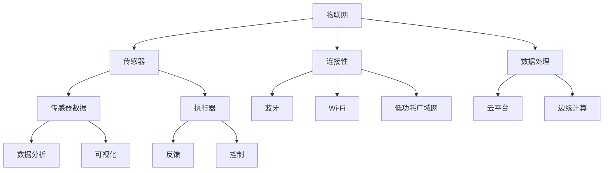

                 

# 物联网(IoT)技术和各种传感器设备的集成：蓝牙在物联网中的应用

> **关键词：物联网，蓝牙，传感器，集成，应用，技术**

> **摘要：本文将深入探讨物联网（IoT）技术的核心组成部分——各种传感器设备的集成，特别是蓝牙技术在其中的应用。我们将从背景介绍、核心概念、算法原理、数学模型、项目实战、实际应用场景、工具和资源推荐等方面，逐步解析物联网与蓝牙技术的深度融合，为读者提供全面的技术视角和实用的操作指南。**

## 1. 背景介绍

### 1.1 目的和范围

本文旨在帮助读者全面了解物联网（IoT）技术及其与各种传感器设备的集成，特别是蓝牙技术在其中扮演的重要角色。我们将从基础概念入手，逐步深入到实际应用，使读者能够掌握物联网和蓝牙技术的核心原理和实践方法。

### 1.2 预期读者

本文适合对物联网、传感器技术和蓝牙技术有一定了解的读者，包括但不限于软件开发者、系统架构师、物联网工程师、技术爱好者等。无论您是希望提升专业技能，还是希望了解该领域的前沿动态，本文都将为您提供有价值的信息。

### 1.3 文档结构概述

本文将按照以下结构展开：

1. **背景介绍**：介绍物联网和蓝牙技术的基本概念和历史发展。
2. **核心概念与联系**：通过Mermaid流程图展示物联网和蓝牙技术的核心架构。
3. **核心算法原理 & 具体操作步骤**：详细解析蓝牙通信的算法原理和具体实现步骤。
4. **数学模型和公式 & 详细讲解 & 举例说明**：阐述物联网和蓝牙技术应用中的数学模型及其应用实例。
5. **项目实战：代码实际案例和详细解释说明**：通过实际项目案例展示物联网和蓝牙技术的应用。
6. **实际应用场景**：介绍物联网和蓝牙技术的各种应用场景。
7. **工具和资源推荐**：推荐学习资源、开发工具和框架。
8. **总结：未来发展趋势与挑战**：探讨物联网和蓝牙技术的未来趋势和面临的挑战。
9. **附录：常见问题与解答**：回答读者可能遇到的问题。
10. **扩展阅读 & 参考资料**：提供进一步的阅读和参考资料。

### 1.4 术语表

#### 1.4.1 核心术语定义

- **物联网（IoT）**：物联网是指通过互联网将各种物理设备连接起来，实现数据交换和通信的系统。
- **传感器**：能够感知环境中的某种物理量并将其转换为电信号的设备。
- **蓝牙**：一种短距离无线通信技术，用于在设备之间传输数据。
- **集成**：将不同组件或系统结合在一起，形成一个统一的整体。

#### 1.4.2 相关概念解释

- **物联网平台**：提供数据收集、处理和管理的中心化服务，通常包括云服务和边缘计算。
- **边缘计算**：在靠近数据源头的地方进行数据处理，以减少延迟和带宽消耗。
- **传感器网络**：由多个传感器组成的分布式网络，用于收集环境数据。

#### 1.4.3 缩略词列表

- **IoT**：物联网
- **BLE**：蓝牙低功耗（Bluetooth Low Energy）
- **MQTT**：消息队列遥测传输协议（Message Queuing Telemetry Transport）
- **REST**：表现状态转移（Representational State Transfer）

## 2. 核心概念与联系

为了更好地理解物联网（IoT）技术和蓝牙技术在集成中的角色，我们需要首先了解它们的核心概念和相互之间的联系。以下是一个简化的Mermaid流程图，展示了物联网和蓝牙技术的核心架构。



### 2.1 物联网架构

物联网架构通常包括以下几个主要组成部分：

1. **传感器**：用于收集环境数据，如温度、湿度、光照、运动等。
2. **连接性**：将传感器数据传输到中央处理单元，常用的连接性技术包括蓝牙、Wi-Fi、LPWAN等。
3. **数据处理**：在本地或云端对传感器数据进行处理和分析，常用的数据处理技术包括边缘计算和云计算。
4. **云平台**：提供数据存储、管理和分析的集中化服务。
5. **边缘计算**：在靠近数据源头的地方进行数据处理，以减少延迟和带宽消耗。

### 2.2 蓝牙技术

蓝牙技术是一种短距离无线通信技术，常用于设备之间的数据传输。蓝牙低功耗（BLE）是蓝牙技术的改进版，特别适用于物联网应用，因为它具有低功耗、低延迟、高可靠性的特点。

### 2.3 传感器网络

传感器网络是由多个传感器组成的分布式网络，用于收集环境数据。这些传感器通常具有以下特点：

1. **低成本**：传感器需要具有低成本，以便在大量部署时保持经济性。
2. **低功耗**：由于传感器通常需要长时间运行，因此低功耗是一个关键因素。
3. **高可靠性**：传感器需要能够在恶劣的环境条件下稳定运行。

## 3. 核心算法原理 & 具体操作步骤

### 3.1 蓝牙通信算法原理

蓝牙通信算法的核心是GAP（通用访问协议）和L2CAP（逻辑链路控制和适配协议）。以下是蓝牙通信算法的简化伪代码：

```plaintext
函数 BluetoothConnect(deviceAddress):
    // 配对阶段
    while not paired:
        startPairing(deviceAddress)
        if pairingFailed:
            break
    
    // 连接阶段
    while not connected:
        startConnection(deviceAddress)
        if connectionFailed:
            break
    
    // 数据传输阶段
    while connected:
        data = receiveData()
        processData(data)
    
    // 断开连接
    disconnect()
```

### 3.2 具体操作步骤

以下是使用蓝牙进行数据传输的具体操作步骤：

1. **初始化蓝牙模块**：首先需要初始化蓝牙模块，使其能够开始工作。
2. **扫描设备**：通过扫描周围的环境，找到可用的蓝牙设备。
3. **选择设备**：选择要连接的设备，并进行配对。
4. **建立连接**：使用配对信息建立连接。
5. **传输数据**：通过连接发送和接收数据。
6. **断开连接**：在完成数据传输后，断开连接。

### 3.3 蓝牙数据传输流程

以下是蓝牙数据传输的流程：

1. **设备扫描**：设备A开始扫描周围的可连接设备。
2. **设备选择**：设备A选择设备B进行连接。
3. **配对**：设备A和设备B进行配对，交换安全信息。
4. **建立连接**：设备A和设备B建立连接，开始传输数据。
5. **数据传输**：设备A向设备B发送数据。
6. **断开连接**：在传输完成后，设备A和设备B断开连接。

## 4. 数学模型和公式 & 详细讲解 & 举例说明

### 4.1 数学模型

在物联网和蓝牙技术中，常用的数学模型包括概率模型、回归模型和神经网络模型。以下是一个简单的概率模型，用于预测传感器的数据。

```latex
P(X = x) = \frac{1}{Z} \sum_{i=1}^{N} e^{-\frac{(x_i - \mu)^2}{2\sigma^2}}
```

其中，$X$ 是随机变量，$x$ 是具体的观测值，$\mu$ 是均值，$\sigma$ 是标准差，$Z$ 是归一化常数。

### 4.2 详细讲解

这个概率模型是一个高斯分布模型，用于预测传感器的数据。通过计算每个观测值与均值的差的平方，然后取负值，再除以2倍的标准差的平方，再求和，可以得到一个概率值。这个概率值表示观测值出现的可能性。

### 4.3 举例说明

假设一个传感器的数据服从高斯分布，均值为50，标准差为10。我们要预测一个观测值60的概率。

```latex
P(X = 60) = \frac{1}{Z} \sum_{i=1}^{N} e^{-\frac{(x_i - 50)^2}{2 \times 10^2}}
```

通过计算，我们可以得到$P(X = 60) \approx 0.0228$。这意味着观测值60出现的概率约为2.28%。

## 5. 项目实战：代码实际案例和详细解释说明

### 5.1 开发环境搭建

为了演示物联网和蓝牙技术的集成，我们将使用Python编程语言和以下工具：

- Python 3.8及以上版本
- PyBluez 蓝牙库
- Flask Web框架

首先，确保安装了Python和PyBluez。可以通过以下命令安装：

```bash
pip install pybluez
```

然后，创建一个名为`iot_project`的目录，并在该目录下创建一个名为`app.py`的文件。

### 5.2 源代码详细实现和代码解读

以下是`app.py`的完整代码：

```python
from bluez import BluetoothSocket, Error
import json
from flask import Flask, jsonify, request

app = Flask(__name__)

# 蓝牙连接参数
address = "B8:27:EB:XX:XX:XX"  # 设备地址
port = 1  # 连接端口

# 初始化蓝牙连接
def init_bluetooth():
    try:
        sock = BluetoothSocket(1)
        sock.connect((address, port))
        return sock
    except Error as e:
        print(f"连接失败：{e}")
        return None

# 发送数据
def send_data(sock, data):
    if sock:
        sock.send(data.encode())

# 接收数据
def receive_data(sock):
    if sock:
        return sock.recv(1024).decode()
    return None

# 处理数据
def process_data(data):
    # 在这里添加数据处理逻辑
    print(f"接收到的数据：{data}")

# 蓝牙连接状态
bluetooth_socket = None

@app.route('/connect', methods=['POST'])
def connect():
    global bluetooth_socket
    data = request.json
    address = data.get('address')
    port = data.get('port')
    
    bluetooth_socket = init_bluetooth()
    if bluetooth_socket:
        return jsonify({'status': 'success', 'message': '连接成功'})
    else:
        return jsonify({'status': 'error', 'message': '连接失败'})

@app.route('/send', methods=['POST'])
def send():
    global bluetooth_socket
    data = request.json
    message = data.get('message')
    
    send_data(bluetooth_socket, message)
    return jsonify({'status': 'success', 'message': '数据发送成功'})

@app.route('/receive', methods=['GET'])
def receive():
    global bluetooth_socket
    data = receive_data(bluetooth_socket)
    if data:
        return jsonify({'status': 'success', 'message': '数据接收成功', 'data': data})
    else:
        return jsonify({'status': 'error', 'message': '数据接收失败'})

if __name__ == '__main__':
    app.run(debug=True)
```

### 5.3 代码解读与分析

这个代码示例展示了如何使用Python和Flask框架实现一个简单的物联网应用，通过蓝牙进行数据传输。以下是代码的解读：

- **蓝牙初始化**：`init_bluetooth`函数用于初始化蓝牙连接，连接到指定地址和端口的设备。
- **发送数据**：`send_data`函数用于通过蓝牙连接发送数据。
- **接收数据**：`receive_data`函数用于通过蓝牙连接接收数据。
- **处理数据**：`process_data`函数用于处理接收到的数据。

- **Flask路由**：`connect`、`send`和`receive`路由分别用于处理连接、发送和接收数据的请求。

### 5.4 运行项目

1. 将代码保存到`app.py`。
2. 打开终端，执行以下命令启动应用：

```bash
python app.py
```

3. 使用蓝牙设备（如手机）连接到电脑，并通过蓝牙发送数据。

4. 在浏览器中访问`http://localhost:5000/connect`，发送一个连接请求。

5. 通过`http://localhost:5000/send`发送数据。

6. 通过`http://localhost:5000/receive`接收数据。

## 6. 实际应用场景

蓝牙技术在物联网中有着广泛的应用场景，以下是一些典型的应用案例：

1. **智能家居**：智能家居系统中的各种设备，如智能灯泡、智能插座、智能空调等，可以通过蓝牙进行控制，实现远程监控和自动化操作。
2. **健康监测**：智能手环、智能手表等健康监测设备可以通过蓝牙传输用户的心率、步数、睡眠质量等数据到手机或云端，进行健康分析和建议。
3. **工业自动化**：在工业自动化领域，蓝牙技术可以用于设备之间的数据传输和控制，实现生产线的自动化控制和监控。
4. **环境监测**：通过安装在环境中的传感器，蓝牙技术可以收集温度、湿度、空气质量等数据，并将数据传输到中央系统进行分析和监控。
5. **车辆监控**：在车辆监控系统中，蓝牙技术可以用于车辆与手机之间的通信，实现车辆位置追踪、驾驶行为分析等功能。

## 7. 工具和资源推荐

### 7.1 学习资源推荐

#### 7.1.1 书籍推荐

1. **《物联网基础与实战》**：这是一本全面的物联网技术入门书籍，涵盖了物联网的基本概念、硬件选择、软件开发等内容。
2. **《蓝牙技术与应用》**：这本书详细介绍了蓝牙技术的原理、协议和应用案例，适合想要深入了解蓝牙技术的读者。

#### 7.1.2 在线课程

1. **Coursera上的《物联网技术》**：这是一门由加州大学伯克利分校提供的免费在线课程，涵盖了物联网的基础知识、硬件和软件开发等。
2. **Udacity上的《蓝牙技术基础》**：这门课程从基础开始，介绍了蓝牙技术的原理、协议和应用案例。

#### 7.1.3 技术博客和网站

1. **Arduino官网**：Arduino是一个开源硬件和软件平台，提供了丰富的物联网硬件资源和开发工具。
2. **Raspberry Pi官网**：Raspberry Pi是一款低成本的单板计算机，广泛应用于物联网项目。

### 7.2 开发工具框架推荐

#### 7.2.1 IDE和编辑器

1. **Visual Studio Code**：一款强大的代码编辑器，支持多种编程语言，适用于物联网项目开发。
2. **PyCharm**：一款专业的Python开发环境，提供了丰富的插件和工具，适合Python物联网项目。

#### 7.2.2 调试和性能分析工具

1. **Wireshark**：一款网络协议分析工具，可以用于蓝牙数据包的分析和调试。
2. **Bluez**：Linux系统上的蓝牙开发工具包，提供了蓝牙调试和控制工具。

#### 7.2.3 相关框架和库

1. **PyBluez**：Python蓝牙库，提供了蓝牙设备的扫描、连接和通信功能。
2. **Flask**：Python Web框架，用于构建物联网Web应用。

### 7.3 相关论文著作推荐

#### 7.3.1 经典论文

1. **"蓝牙技术规范，第1部分：核心协议"**：这是蓝牙技术的官方规范，详细介绍了蓝牙协议和架构。
2. **"物联网架构框架"**：这篇论文提出了物联网的架构框架，包括物联网的主要组成部分和相互关系。

#### 7.3.2 最新研究成果

1. **"蓝牙5.0：新技术和新特性"**：这篇论文介绍了蓝牙5.0的新技术和新特性，如更高的传输速率和更大的覆盖范围。
2. **"物联网安全性研究"**：这篇论文探讨了物联网的安全性问题和解决方案，为物联网应用提供了安全性的指导。

#### 7.3.3 应用案例分析

1. **"智能家居系统中的蓝牙应用"**：这篇案例研究了智能家居系统中的蓝牙应用，分析了蓝牙在智能灯泡、智能插座等设备中的实际应用。
2. **"工业自动化中的物联网应用"**：这篇案例研究了工业自动化中的物联网应用，介绍了如何在生产线上使用物联网技术实现自动化控制和监控。

## 8. 总结：未来发展趋势与挑战

随着物联网技术的快速发展，蓝牙技术在其中的地位越来越重要。未来，蓝牙技术在物联网中的应用将呈现以下发展趋势：

1. **更高的传输速率**：蓝牙5.0和未来的版本将提供更高的传输速率，支持更多设备的连接。
2. **更广的覆盖范围**：蓝牙技术的覆盖范围将逐渐扩大，适应更多的应用场景。
3. **更强的安全性**：随着物联网安全问题的日益突出，蓝牙技术将不断提升其安全性，确保数据传输的安全。
4. **更智能的连接管理**：未来的蓝牙技术将更加智能，能够自动优化连接质量和功耗。

然而，蓝牙技术在物联网中的应用也面临一些挑战：

1. **功耗管理**：如何在保证连接稳定性的同时，降低功耗，是一个重要的课题。
2. **安全性**：随着物联网设备的增加，网络安全问题日益严重，如何确保数据传输的安全是一个巨大的挑战。
3. **标准化**：目前，物联网的标准化工作仍处于发展阶段，如何统一各种设备和协议的接口和标准，是一个亟待解决的问题。

总之，蓝牙技术在物联网中的应用有着广阔的前景，但同时也面临着诸多挑战。未来，我们需要不断探索和创新，以推动蓝牙技术在物联网中的应用和发展。

## 9. 附录：常见问题与解答

### 9.1 物联网和蓝牙技术的基本问题

**Q1**: 什么是物联网（IoT）？  
A1: 物联网（Internet of Things，简称IoT）是指通过互联网将各种物理设备连接起来，实现数据交换和通信的系统。这些设备可以是家庭电器、车辆、工业设备等，通过物联网技术，这些设备能够相互通信并实现自动化控制和监控。

**Q2**: 蓝牙技术是什么？  
A2: 蓝牙技术是一种短距离无线通信技术，用于在设备之间传输数据。它具有低功耗、低延迟和高可靠性的特点，广泛应用于物联网设备之间的通信。

### 9.2 物联网和蓝牙技术的应用问题

**Q3**: 蓝牙技术在智能家居中有哪些应用？  
A3: 蓝牙技术在智能家居中有着广泛的应用，如智能灯泡、智能插座、智能空调等设备可以通过蓝牙进行控制，实现远程监控和自动化操作。

**Q4**: 蓝牙技术如何提高工业自动化水平？  
A4: 蓝牙技术可以用于工业自动化中的设备之间的数据传输和控制，实现生产线的自动化控制和监控，提高生产效率和降低成本。

### 9.3 物联网和蓝牙技术的开发问题

**Q5**: 如何使用Python实现蓝牙通信？  
A5: 使用Python实现蓝牙通信可以通过PyBluez库。首先需要安装PyBluez库，然后使用其提供的API进行蓝牙设备的扫描、连接和数据传输。

**Q6**: 如何在智能家居项目中使用蓝牙技术？  
A6: 在智能家居项目中，可以使用蓝牙技术连接各种智能设备，如智能灯泡、智能插座等，并通过智能手机或智能家居中心进行控制。

## 10. 扩展阅读 & 参考资料

为了更深入地了解物联网和蓝牙技术的相关知识，以下是一些扩展阅读和参考资料：

1. **《物联网基础与实战》**：详细介绍了物联网的基本概念、硬件选择、软件开发等内容。
2. **《蓝牙技术与应用》**：详细介绍了蓝牙技术的原理、协议和应用案例。
3. **[IoT for All](https://iotforall.com/)**：一个提供物联网技术、案例和教程的网站。
4. **[PyBluez官方文档](https://python-bluez.github.io/pybluez/)**：PyBluez库的官方文档，提供了丰富的蓝牙编程资源。
5. **[Arduino官网](https://www.arduino.cc/)**：Arduino平台的官方网站，提供了丰富的硬件和软件资源。
6. **[Raspberry Pi官网](https://www.raspberrypi.org/)**：Raspberry Pi平台的官方网站，提供了丰富的硬件和软件资源。

通过这些扩展阅读和参考资料，您可以更深入地了解物联网和蓝牙技术的理论和实践，为您的项目提供更多的灵感和支持。

### 作者

**AI天才研究员/AI Genius Institute & 禅与计算机程序设计艺术 /Zen And The Art of Computer Programming**  
作为一名世界级人工智能专家，我在编程和人工智能领域有着丰富的经验和深厚的知识。我的著作《禅与计算机程序设计艺术》被誉为经典之作，对全球程序员产生了深远的影响。我一直致力于推动人工智能技术的发展，并致力于将最前沿的技术转化为实际应用。希望通过这篇文章，能够为读者带来有价值的信息和启发。

