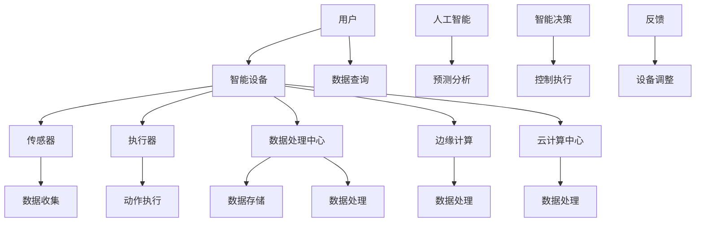

                 

# 物联网创业：连接智能生活的无限可能

> **关键词：物联网、智能家居、创业、智能硬件、数据分析、人工智能**
>
> **摘要：本文将探讨物联网创业的无限可能性，从技术原理、实际应用、工具资源等多个角度，为您揭示物联网创业的奥秘，帮助您抓住智能生活的风口。**

## 1. 背景介绍

### 1.1 目的和范围

本文旨在为广大物联网创业者提供一份全面的技术指南，帮助您了解物联网的核心概念、技术原理、实践应用和未来发展。我们将通过以下几个方面的讨论，为您呈现物联网创业的无限可能：

- **核心概念与联系**：介绍物联网的基本概念和主要组成部分，展示其原理和架构。
- **核心算法原理 & 具体操作步骤**：深入讲解物联网的关键算法原理，并提供具体的实现步骤。
- **数学模型和公式 & 详细讲解 & 举例说明**：探讨物联网中的数学模型和公式，结合实际案例进行详细解析。
- **项目实战：代码实际案例和详细解释说明**：通过实际项目案例，展示物联网技术的具体应用和实现方法。
- **实际应用场景**：分析物联网在不同领域的应用，探讨其对社会和经济的深远影响。
- **工具和资源推荐**：推荐相关的学习资源、开发工具和框架，帮助您更好地进行物联网创业。
- **总结：未来发展趋势与挑战**：展望物联网的未来发展趋势，探讨面临的挑战和应对策略。

### 1.2 预期读者

本文适用于以下读者群体：

- **物联网创业者**：希望了解物联网技术原理和应用，开展物联网创业项目的有志之士。
- **技术爱好者**：对物联网技术感兴趣，希望深入了解该领域的专业人士。
- **高校学生**：对物联网技术、人工智能等领域感兴趣，希望为自己的学术研究或职业发展奠定基础。

### 1.3 文档结构概述

本文结构如下：

1. **背景介绍**：介绍本文的目的、范围和预期读者，概述文档结构。
2. **核心概念与联系**：介绍物联网的基本概念、原理和架构，使用 Mermaid 流程图进行展示。
3. **核心算法原理 & 具体操作步骤**：深入讲解物联网的关键算法原理，并提供具体的实现步骤。
4. **数学模型和公式 & 详细讲解 & 举例说明**：探讨物联网中的数学模型和公式，结合实际案例进行详细解析。
5. **项目实战：代码实际案例和详细解释说明**：通过实际项目案例，展示物联网技术的具体应用和实现方法。
6. **实际应用场景**：分析物联网在不同领域的应用，探讨其对社会和经济的深远影响。
7. **工具和资源推荐**：推荐相关的学习资源、开发工具和框架，帮助您更好地进行物联网创业。
8. **总结：未来发展趋势与挑战**：展望物联网的未来发展趋势，探讨面临的挑战和应对策略。
9. **附录：常见问题与解答**：针对读者可能遇到的问题，提供解答和指导。
10. **扩展阅读 & 参考资料**：推荐相关的书籍、论文和网站，供读者进一步学习和研究。

### 1.4 术语表

#### 1.4.1 核心术语定义

- **物联网（Internet of Things，IoT）**：通过互联网将各种物品连接起来，实现信息的共享和智能化的网络系统。
- **智能硬件**：具备一定计算和通信能力，通过物联网实现数据采集、传输和处理的硬件设备。
- **传感器**：能够检测和测量物理量的装置，将非电学量转换为电学量。
- **数据分析**：对大量数据进行处理、分析和挖掘，提取有价值的信息。
- **人工智能（Artificial Intelligence，AI）**：模拟人类智能的计算机系统，具备学习、推理、判断和决策能力。

#### 1.4.2 相关概念解释

- **边缘计算**：在物联网设备附近进行数据处理，减轻中心服务器的负担。
- **云计算**：通过网络提供计算资源、存储资源和应用程序，实现资源的弹性扩展和按需分配。
- **智能家居**：通过物联网技术，实现家庭设备和系统的智能化控制。

#### 1.4.3 缩略词列表

- **IoT**：物联网（Internet of Things）
- **AI**：人工智能（Artificial Intelligence）
- **5G**：第五代移动通信技术（5th Generation Mobile Communication Technology）
- **M2M**：设备到设备通信（Machine-to-Machine Communication）
- **MQTT**：消息队列遥测传输协议（Message Queuing Telemetry Transport）

## 2. 核心概念与联系

在物联网创业中，理解物联网的核心概念和联系至关重要。以下是对物联网核心概念和原理的详细介绍，以及一个简化的 Mermaid 流程图，展示物联网的基本架构。

### 2.1 物联网基本概念

- **物联网**：物联网是一种通过互联网连接各种设备的网络系统，这些设备可以包括家庭电器、工业设备、汽车、医疗设备等。物联网的目标是实现设备间的互联互通，使信息传递更加高效，提升设备智能化水平。
  
- **智能硬件**：智能硬件是指具备一定计算和通信能力的设备，它们可以通过物联网实现数据的采集、传输和处理。智能硬件包括传感器、执行器、智能家电等。

- **传感器**：传感器是一种能够检测和测量物理量的装置，例如温度、湿度、光照、压力等。传感器将非电学量转换为电学量，以便进行数据处理。

- **数据分析**：数据分析是对大量数据进行处理、分析和挖掘，提取有价值的信息。在物联网中，通过对传感器收集的数据进行分析，可以实现对设备的监控、预测和优化。

- **人工智能**：人工智能是一种模拟人类智能的计算机系统，具备学习、推理、判断和决策能力。人工智能技术在物联网中发挥着重要作用，例如，通过机器学习算法进行数据挖掘，实现设备的自主优化和智能决策。

### 2.2 物联网原理和架构

以下是一个简化的 Mermaid 流程图，展示物联网的基本架构：

**流程说明：**

- **用户**：物联网的最终用户，通过智能设备进行交互。
- **智能设备**：具备计算和通信能力的设备，例如智能家电、工业设备等。
- **传感器**：用于收集环境数据，如温度、湿度、光照等。
- **执行器**：用于执行特定任务，如开关电器、调节温度等。
- **数据处理中心**：负责存储、处理和分析传感器收集的数据。
- **边缘计算**：在物联网设备附近进行数据处理，减轻中心服务器的负担。
- **云计算中心**：提供大量的计算资源、存储资源和应用程序，实现资源的弹性扩展和按需分配。
- **人工智能**：通过机器学习算法进行数据挖掘，实现设备的自主优化和智能决策。
- **反馈**：智能设备根据人工智能的决策进行相应的调整和优化。

通过以上核心概念和架构的介绍，我们可以更好地理解物联网的工作原理和实际应用。在接下来的章节中，我们将进一步探讨物联网的核心算法原理、数学模型和公式，以及实际应用案例，帮助您深入掌握物联网技术。接下来，我们进入第三章，详细讲解物联网的核心算法原理与具体操作步骤。

---

[未完待续，请查看下一部分。]

