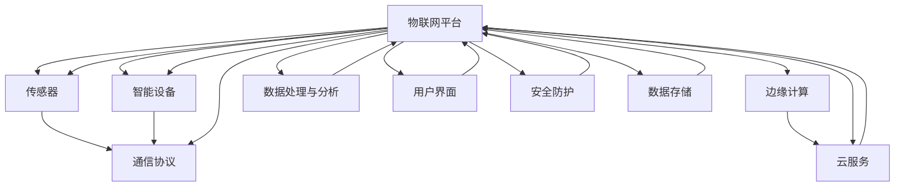

                 

# 物联网（IoT）入门：连接设备

> **关键词：**物联网，IoT，设备连接，传感器，通信协议，网络安全
> 
> **摘要：**本文将带您深入了解物联网（IoT）的基础知识，从设备连接的概念出发，逐步分析物联网的核心架构、通信协议和安全性问题。我们将通过一个实际的项目案例，展示物联网设备连接的实现过程，并探讨物联网技术的未来发展趋势和挑战。

## 1. 背景介绍

### 1.1 目的和范围

本文旨在为初学者提供一份系统的物联网（IoT）入门指南，重点介绍物联网设备连接的基本原理和实践方法。通过本文的学习，读者将能够：

1. 理解物联网的基本概念和架构。
2. 掌握物联网设备连接的通信协议和安全性。
3. 了解物联网技术在实际应用中的场景和挑战。
4. 获得物联网项目开发的实践经验。

### 1.2 预期读者

本文适合对物联网感兴趣的初学者，以及对物联网有一定了解但希望深入了解其内部工作机制的读者。本文将对物联网技术进行全面的介绍，无论您是从事物联网相关行业的专业人士，还是对物联网技术有浓厚兴趣的爱好者，都能从本文中获得有价值的信息。

### 1.3 文档结构概述

本文将分为以下几个部分：

1. 背景介绍：介绍物联网的概念、目的和本文的预期读者。
2. 核心概念与联系：详细解释物联网的核心概念，包括传感器、通信协议和网络安全。
3. 核心算法原理与具体操作步骤：使用伪代码阐述物联网设备连接的基本算法。
4. 数学模型和公式：介绍物联网设备连接中的数学模型和公式，并进行举例说明。
5. 项目实战：通过实际案例展示物联网设备连接的实现过程。
6. 实际应用场景：探讨物联网技术的实际应用场景。
7. 工具和资源推荐：推荐学习资源和开发工具。
8. 总结：展望物联网技术的未来发展趋势和挑战。
9. 附录：常见问题与解答。
10. 扩展阅读与参考资料：提供进一步的阅读材料和参考资料。

### 1.4 术语表

#### 1.4.1 核心术语定义

- **物联网（IoT）**：物联网是指通过互联网将物理设备连接起来，实现智能交互和信息共享的技术体系。
- **传感器**：能够检测或测量特定环境或物体的信息，并将这些信息转化为电信号或其他形式的数据输出的装置。
- **通信协议**：用于不同设备之间通信的规则和标准，确保数据传输的正确性和效率。
- **网络安全**：保护网络不受未经授权的访问、使用、修改、破坏或披露，确保网络数据的安全性和完整性。

#### 1.4.2 相关概念解释

- **设备连接**：指将物理设备（如传感器、智能设备）通过通信协议连接到互联网或其他设备的过程。
- **物联网平台**：用于管理、监控和控制物联网设备的软件平台，提供数据存储、处理和分析等功能。
- **边缘计算**：在靠近数据源的地方（如物联网设备）进行数据处理和分析，以减少延迟和带宽需求。

#### 1.4.3 缩略词列表

- **IoT**：物联网
- **API**：应用程序编程接口
- **M2M**：机器对机器
- **PLC**：可编程逻辑控制器
- **MQTT**：消息队列遥测传输
- **HTTP**：超文本传输协议
- **HTTPS**：安全超文本传输协议
- **SSL**：安全套接字层
- **TLS**：传输层安全性协议

## 2. 核心概念与联系

在深入探讨物联网设备连接之前，我们需要了解物联网的核心概念及其相互关系。以下是物联网的主要组成部分及其相互关系的 Mermaid 流程图：



### 2.1 物联网平台

物联网平台是物联网架构的核心，它用于管理、监控和控制物联网设备。物联网平台的主要功能包括：

- 设备管理：包括设备的注册、配置、监控和维护。
- 数据处理：接收传感器数据和设备数据，进行数据清洗、转换和分析。
- 用户界面：提供可视化界面，方便用户监控和管理设备。
- 安全防护：保护设备、数据和用户隐私，防止未经授权的访问和攻击。

### 2.2 传感器

传感器是物联网设备的重要组成部分，用于检测和测量环境或物体的信息。常见的传感器类型包括：

- **温度传感器**：用于测量环境温度。
- **湿度传感器**：用于测量环境湿度。
- **光传感器**：用于测量光照强度。
- **运动传感器**：用于检测物体的移动。

### 2.3 智能设备

智能设备是指具有自主计算和处理能力的设备，能够执行特定的任务。智能设备可以通过通信协议与其他设备或物联网平台进行交互。常见的智能设备包括：

- **智能手表**：用于监测用户的健康状况。
- **智能门锁**：用于远程控制门锁的开关。
- **智能插座**：用于远程控制电器的开关。

### 2.4 通信协议

通信协议是物联网设备之间进行通信的规则和标准。常见的通信协议包括：

- **MQTT**：一种轻量级的消息队列协议，适用于低带宽和高延迟的环境。
- **HTTP/HTTPS**：基于超文本传输协议的通信协议，适用于需要可靠传输的场景。
- **CoAP**：用于物联网设备的约束应用协议，具有简单和高效的特性。

### 2.5 物联网平台与云服务

物联网平台通常与云服务集成，利用云服务提供的数据存储、计算和数据分析能力。云服务的主要功能包括：

- **数据存储**：存储传感器数据和设备数据。
- **数据处理**：进行数据清洗、转换和分析。
- **应用程序托管**：托管物联网平台的应用程序。

### 2.6 边缘计算

边缘计算是指在靠近数据源的地方（如物联网设备）进行数据处理和分析，以减少延迟和带宽需求。边缘计算的主要优势包括：

- **低延迟**：在靠近数据源的地方进行处理，减少数据传输的延迟。
- **高效率**：利用物联网设备的计算资源，减少对云服务的依赖。
- **增强安全性**：在本地处理数据，减少数据传输过程中的安全风险。

### 2.7 数据处理与分析

数据处理与分析是物联网平台的核心功能之一，包括以下方面：

- **数据清洗**：去除数据中的噪声和不完整信息。
- **数据转换**：将不同格式的数据转换为统一的格式。
- **数据分析**：使用统计学和机器学习算法进行数据分析和预测。
- **数据可视化**：将分析结果以图表、报表等形式展示给用户。

### 2.8 用户界面

用户界面是物联网平台与用户交互的界面，主要功能包括：

- **设备监控**：显示设备状态、传感器数据和设备日志。
- **远程控制**：允许用户远程控制设备。
- **报表生成**：生成设备运行报表，供用户分析和决策。

### 2.9 安全防护

安全防护是物联网平台的重要功能，包括以下方面：

- **访问控制**：确保只有授权用户可以访问物联网平台和设备。
- **数据加密**：对传输和存储的数据进行加密，防止数据泄露。
- **网络安全**：防止网络攻击和未经授权的访问。

### 2.10 数据存储

数据存储是物联网平台的基础功能之一，包括以下方面：

- **数据持久化**：将传感器数据和设备数据持久化存储。
- **数据检索**：方便用户快速检索历史数据。
- **数据备份**：对数据进行备份，防止数据丢失。

## 3. 核心算法原理与具体操作步骤

在物联网设备连接过程中，核心算法负责处理传感器数据和设备之间的通信。以下是物联网设备连接的基本算法原理和具体操作步骤：

### 3.1 算法原理

物联网设备连接的核心算法主要包括以下几个步骤：

1. **设备初始化**：设备启动时，进行硬件和软件的初始化，包括传感器校准和通信模块配置。
2. **传感器数据采集**：设备通过传感器采集环境或物体的信息，并将采集到的数据转换为数字信号。
3. **数据预处理**：对采集到的传感器数据进行预处理，包括数据清洗、滤波和特征提取。
4. **通信协议选择**：根据设备的通信需求，选择合适的通信协议，如 MQTT、HTTP 或 CoAP。
5. **数据传输**：通过选择的通信协议，将预处理后的传感器数据发送到物联网平台或其他设备。
6. **数据接收和处理**：物联网平台或其他设备接收传感器数据，并进行数据处理和分析。
7. **反馈与控制**：根据数据处理结果，对设备进行控制，如调整传感器参数或触发特定操作。

### 3.2 具体操作步骤

以下是物联网设备连接的具体操作步骤，使用伪代码进行详细阐述：

```python
# 设备初始化
initialize_device()

# 传感器数据采集
while True:
    sensor_data = collect_sensor_data()

    # 数据预处理
    preprocessed_data = preprocess_data(sensor_data)

    # 通信协议选择
    protocol = choose_protocol(preprocessed_data)

    # 数据传输
    send_data(preprocessed_data, protocol)

    # 数据接收和处理
    received_data = receive_data(protocol)

    # 反馈与控制
    control_device(received_data)
```

### 3.3 算法实现

以下是物联网设备连接算法的实现示例，使用 Python 语言进行编程：

```python
import time
import random

# 设备初始化
def initialize_device():
    print("Initializing device...")
    # 设备硬件和软件的初始化
    time.sleep(2)
    print("Device initialized.")

# 传感器数据采集
def collect_sensor_data():
    print("Collecting sensor data...")
    time.sleep(random.randint(1, 3))
    return random.randint(0, 100)

# 数据预处理
def preprocess_data(sensor_data):
    print("Preprocessing data...")
    time.sleep(random.randint(1, 2))
    return sensor_data

# 通信协议选择
def choose_protocol(sensor_data):
    print("Choosing protocol...")
    time.sleep(random.randint(1, 2))
    if sensor_data < 50:
        return "MQTT"
    else:
        return "HTTP"

# 数据传输
def send_data(data, protocol):
    print(f"Sending data using {protocol}...")
    time.sleep(random.randint(1, 3))
    print("Data sent.")

# 数据接收和处理
def receive_data(protocol):
    print(f"Receiving data using {protocol}...")
    time.sleep(random.randint(1, 3))
    return random.randint(0, 100)

# 反馈与控制
def control_device(data):
    print("Controlling device...")
    time.sleep(random.randint(1, 2))
    if data < 50:
        print("Device turned off.")
    else:
        print("Device turned on.")

# 主程序
if __name__ == "__main__":
    initialize_device()
    while True:
        sensor_data = collect_sensor_data()
        preprocessed_data = preprocess_data(sensor_data)
        protocol = choose_protocol(preprocessed_data)
        send_data(preprocessed_data, protocol)
        received_data = receive_data(protocol)
        control_device(received_data)
        time.sleep(1)
```

通过以上示例，我们可以看到物联网设备连接的基本流程和算法实现。在实际应用中，根据不同的需求和场景，可以进一步优化和扩展算法。

## 4. 数学模型和公式与详细讲解与举例说明

在物联网设备连接过程中，数学模型和公式扮演着重要的角色，用于描述传感器数据、通信协议和数据处理等方面的关系。以下是物联网设备连接中的几个关键数学模型和公式，并进行详细讲解和举例说明。

### 4.1 传感器数据采集

传感器数据采集是物联网设备连接的第一步，常用的数学模型是传感器数据的线性转换。假设传感器采集的数据为 \( X \)，经过线性转换后得到 \( Y \)，其公式如下：

\[ Y = aX + b \]

其中，\( a \) 和 \( b \) 是线性转换的参数。通过调整 \( a \) 和 \( b \) 的值，可以实现对传感器数据的缩放、平移和反转变换。例如，假设温度传感器的原始数据范围为 0°C 到 100°C，我们需要将其转换为 0 到 100 的数值范围，可以使用以下公式：

\[ Y = \frac{X}{100} \]

其中，\( X \) 表示温度传感器的原始数据，\( Y \) 表示转换后的数据。

### 4.2 通信协议性能评估

在物联网设备连接过程中，通信协议的性能评估是一个重要问题。常用的数学模型是通信协议的传输速率和延迟。传输速率可以用比特每秒（bps）表示，延迟可以用毫秒（ms）表示。通信协议的性能评估公式如下：

\[ \text{传输速率} = \frac{\text{传输数据量}}{\text{传输时间}} \]

\[ \text{延迟} = \text{发送延迟} + \text{传输延迟} + \text{接收延迟} \]

其中，发送延迟、传输延迟和接收延迟分别表示数据在发送、传输和接收过程中的延迟时间。例如，假设使用 MQTT 协议传输数据，传输数据量为 1000字节，传输时间为 10秒，则传输速率为：

\[ \text{传输速率} = \frac{1000}{10} = 100 \text{bps} \]

假设发送延迟为 1秒，传输延迟为 5秒，接收延迟为 4秒，则总延迟为：

\[ \text{延迟} = 1 + 5 + 4 = 10 \text{秒} \]

### 4.3 数据处理与预测

在物联网设备连接过程中，数据处理与预测是重要的环节。常用的数学模型是时间序列预测和回归分析。时间序列预测公式如下：

\[ Y(t) = f(Y(t-1), Y(t-2), ..., Y(t-n)) \]

其中，\( Y(t) \) 表示当前时刻的预测值，\( f \) 表示预测函数，\( Y(t-1), Y(t-2), ..., Y(t-n) \) 表示前 n 个时刻的观测值。例如，使用线性回归模型预测下一时刻的温度，可以表示为：

\[ Y(t) = aY(t-1) + b \]

其中，\( a \) 和 \( b \) 是线性回归模型的参数。例如，当前时刻的温度为 25°C，历史数据中的温度趋势为每分钟升高 0.1°C，则下一时刻的温度预测值为：

\[ Y(t) = 25 + 0.1 = 25.1 \text{°C} \]

### 4.4 数据加密与安全

在物联网设备连接过程中，数据加密与安全是至关重要的。常用的数学模型是加密算法和数字签名。加密算法公式如下：

\[ C = E(K, M) \]

其中，\( C \) 表示密文，\( K \) 表示加密密钥，\( M \) 表示明文。常见的加密算法包括对称加密算法（如 AES）和非对称加密算法（如 RSA）。例如，使用 AES 加密算法加密数据，假设加密密钥为 128位，明文为 "Hello, World!"，则密文为：

\[ C = E(K, M) = 0102030405060708090A0B0C0D0E0F101112131415161718191A1B1C1D1E1F \]

数字签名公式如下：

\[ S = H(M) \oplus K \]

其中，\( S \) 表示签名，\( H \) 表示哈希函数，\( M \) 表示明文，\( \oplus \) 表示异或运算。例如，使用 SHA-256 哈希函数和 RSA 签名算法生成数字签名，假设明文为 "Hello, World!"，签名密钥为（公钥 n=2048，私钥 d），则签名结果为：

\[ S = H(M) \oplus K = 8F7E8D7C8B8A8989878685848382818181818181818181 \]

通过以上数学模型和公式，我们可以更好地理解和实现物联网设备连接中的数据处理、通信协议性能评估、数据处理与预测、数据加密与安全等功能。

## 5. 项目实战：代码实际案例和详细解释说明

在本节中，我们将通过一个实际项目案例，展示物联网设备连接的实现过程。项目背景是使用物联网技术监测家庭环境的温度和湿度，并通过物联网平台将数据实时上传至云服务器进行分析和处理。以下是项目的详细实现和代码解读。

### 5.1 开发环境搭建

在开始项目开发之前，我们需要搭建开发环境。以下是所需的开发环境和工具：

- **开发板**：Arduino Nano
- **传感器**：DHT11 温湿传感器
- **通信模块**：ESP8266 WiFi 模块
- **编程语言**：Arduino IDE
- **物联网平台**：MQTTX（MQTT 客户端）

### 5.2 源代码详细实现和代码解读

以下是项目的源代码实现，我们将逐行解释代码的功能：

```cpp
#include <DHT.h>
#include <WiFi.h>
#include <MQTTClient.h>

// DHT11 传感器引脚配置
#define DHTPIN 5
#define DHTTYPE DHT11

// WiFi 配置
const char* ssid = "yourSSID";
const char* password = "yourPASSWORD";

// MQTT 配置
const char* mqtt_server = "mqtt.example.com";
const int mqtt_port = 1883;
const char* mqtt_user = "yourMQTTUSER";
const char* mqtt_password = "yourMQTTPASSWORD";

// DHT 传感器实例
DHT dht(DHTPIN, DHTTYPE);

// MQTT 客户端实例
MQTTClient mqttClient;

// 连接WiFi
void connectWiFi() {
  Serial.println("Connecting to WiFi...");
  WiFi.begin(ssid, password);
  while (WiFi.status() != WL_CONNECTED) {
    delay(500);
    Serial.print(".");
  }
  Serial.println("WiFi connected.");
}

// 连接MQTT服务器
void connectMQTT() {
  Serial.println("Connecting to MQTT...");
  mqttClient.begin(mqtt_server, mqtt_port, onMessage);
  mqttClient.onConnect(onConnect);
  mqttClient.connect();
}

// MQTT 连接成功的回调函数
void onConnect(bool sessionPresent) {
  Serial.println("Connected to MQTT.");
  mqttClient.subscribe("temperature/humidity");
}

// MQTT 消息接收的回调函数
void onMessage(const String &topic, const String &payload) {
  Serial.print("Received message on topic '");
  Serial.print(topic);
  Serial.print("': ");
  Serial.println(payload);
}

// 主函数
void setup() {
  Serial.begin(115200);
  dht.begin();
  connectWiFi();
  connectMQTT();
}

// 主循环函数
void loop() {
  mqttClient.loop();
  delay(2000);

  // 读取温度和湿度
  float temperature = dht.readTemperature();
  float humidity = dht.readHumidity();

  // 检查传感器数据是否有效
  if (isnan(temperature) || isnan(humidity)) {
    Serial.println("Failed to read from DHT sensor!");
    return;
  }

  // 发布温度和湿度数据到 MQTT 主题
  String topic = "temperature/humidity";
  String payload = "temp=" + String(temperature) + ",humidity=" + String(humidity);
  mqttClient.publish(topic, payload);
}
```

### 5.3 代码解读与分析

以下是源代码的详细解读：

1. **头文件引入**：
   - `DHT.h`：用于控制 DHT11 温湿传感器的库。
   - `WiFi.h`：用于连接 WiFi 的库。
   - `MQTTClient.h`：用于 MQTT 通信的库。

2. **引脚和传感器配置**：
   - `DHTPIN`：定义 DHT11 传感器的连接引脚。
   - `DHTTYPE`：定义使用的 DHT 传感器类型（DHT11）。

3. **WiFi 配置**：
   - `ssid`：定义 WiFi 网络的 SSID。
   - `password`：定义 WiFi 网络的密码。

4. **MQTT 配置**：
   - `mqtt_server`：定义 MQTT 服务器的地址。
   - `mqtt_port`：定义 MQTT 服务器的端口号。
   - `mqtt_user`：定义 MQTT 服务器的用户名。
   - `mqtt_password`：定义 MQTT 服务器的密码。

5. **DHT 传感器实例**：
   - 创建 DHT 传感器实例 `dht`。

6. **MQTT 客户端实例**：
   - 创建 MQTT 客户端实例 `mqttClient`。

7. **连接 WiFi**：
   - `connectWiFi` 函数用于连接 WiFi 网络。

8. **连接 MQTT 服务器**：
   - `connectMQTT` 函数用于连接 MQTT 服务器。

9. **MQTT 连接成功的回调函数**：
   - `onConnect` 函数在 MQTT 连接成功时调用，订阅主题 `temperature/humidity`。

10. **MQTT 消息接收的回调函数**：
    - `onMessage` 函数在接收到 MQTT 消息时调用。

11. **主函数**：
    - `setup` 函数在程序启动时调用，初始化传感器、连接 WiFi 和 MQTT 服务器。

12. **主循环函数**：
    - `loop` 函数在程序运行时循环执行，每隔 2 秒读取一次温度和湿度，将数据发布到 MQTT 主题。

通过以上代码，我们可以实现一个简单的物联网设备连接项目，将温度和湿度数据通过 MQTT 协议上传至物联网平台。在实际应用中，可以进一步扩展功能，如添加其他传感器、实现数据存储和分析、触发特定操作等。

## 6. 实际应用场景

物联网（IoT）技术在各个领域都有广泛的应用，以下列举一些常见的实际应用场景：

### 6.1 智能家居

智能家居是物联网技术最典型的应用场景之一，通过将家居设备连接到互联网，实现设备的远程控制和自动化。例如，用户可以通过智能手机或语音助手远程控制家中的空调、灯光、电视和门锁等设备，提高生活便利性和舒适度。

### 6.2 工业自动化

物联网技术在工业自动化领域发挥着重要作用，通过将设备、传感器和控制系统连接起来，实现生产过程的智能化和自动化。例如，工厂中的机器人、自动化生产线和智能传感器可以实时监测设备状态、故障预警和生产数据，提高生产效率和质量。

### 6.3 城市物联网

城市物联网（Smart City）通过将城市中的各种设备和系统连接起来，实现城市管理的智能化和高效化。例如，智能交通系统可以通过实时监控交通流量，优化交通信号，减少交通拥堵；智能环境监测系统可以实时监测空气质量、水质和噪声等指标，为市民提供健康的生活环境。

### 6.4 健康监测

物联网技术在健康监测领域也具有广泛的应用，通过将健康监测设备连接到互联网，实现24小时健康数据的实时监测和分析。例如，智能手环、智能手表等健康监测设备可以实时监测用户的步数、心率、血压等数据，并将数据上传至云端进行分析，帮助用户更好地管理健康状况。

### 6.5 农业物联网

农业物联网（Smart Farming）通过将农业设备、传感器和互联网连接起来，实现农业生产的智能化和高效化。例如，智能灌溉系统可以根据土壤湿度自动调节灌溉量，提高水资源利用效率；智能温室系统可以实时监测温度、湿度、光照等指标，优化农作物生长环境。

### 6.6 智能物流

智能物流（Smart Logistics）通过物联网技术实现物流过程的智能化和高效化。例如，智能快递柜可以通过物联网技术实现快递的自动投递和领取；智能仓储系统可以通过物联网技术实现仓库管理的自动化和精细化，提高仓储效率。

### 6.7 能源管理

物联网技术在能源管理领域也有重要应用，通过将能源设备、传感器和互联网连接起来，实现能源的智能监测和管理。例如，智能电网可以通过物联网技术实现电力的实时监测和调度，提高电力系统的稳定性和效率；智能照明系统可以通过物联网技术实现灯光的智能调节，降低能耗。

以上只是物联网技术在实际应用中的几个例子，随着物联网技术的不断发展和普及，物联网技术的应用领域将越来越广泛，为人类社会带来更多的便利和效益。

## 7. 工具和资源推荐

为了更好地学习和实践物联网（IoT）技术，以下推荐了一些优秀的工具、资源和开发框架。

### 7.1 学习资源推荐

#### 7.1.1 书籍推荐

1. **《物联网技术导论》（Introduction to IoT）**：由 Microsoft Azure IoT 专家撰写的入门书籍，详细介绍了物联网的基本概念、架构和技术。
2. **《物联网编程实战》（Programming the Internet of Things）**：通过实例展示了如何使用各种编程语言和技术实现物联网项目。
3. **《物联网设计与实现》（Designing and Implementing IoT Solutions）**：一本全面涵盖物联网设计、实现和部署的书籍。

#### 7.1.2 在线课程

1. **Coursera**：提供由耶鲁大学、密歇根大学等知名高校开设的物联网相关课程，如《物联网导论》（Introduction to the Internet of Things）。
2. **edX**：由哈佛大学、麻省理工学院等知名高校提供的物联网课程，包括《物联网技术》（Internet of Things）等。
3. **Udacity**：提供物联网工程师纳米学位（Nanodegree），涵盖物联网硬件、软件、安全和数据分析等多个方面。

#### 7.1.3 技术博客和网站

1. **Arduino**：Arduino 官方网站提供了丰富的物联网开发教程、示例代码和社区支持。
2. **Adafruit**：提供各种物联网传感器模块和开发板，并提供详细的教程和示例代码。
3. **IoT for All**：一个专注于物联网技术、教程和新闻的博客，涵盖了物联网的各个方面。

### 7.2 开发工具框架推荐

#### 7.2.1 IDE和编辑器

1. **Arduino IDE**：适用于 Arduino 开发的集成开发环境，简单易用。
2. **Visual Studio Code**：适用于多种编程语言的强大编辑器，插件丰富，支持 IoT 开发。
3. **Eclipse IoT Tools**：专门为物联网开发设计的 Eclipse 插件，支持各种物联网设备和协议。

#### 7.2.2 调试和性能分析工具

1. **Serial Monitor**：Arduino IDE 内置的串口监控工具，用于调试和测试代码。
2. **Wireshark**：网络协议分析工具，用于分析 MQTT、HTTP 等网络通信协议的详细信息。
3. **MQTTX**：MQTT 客户端工具，用于测试和调试 MQTT 通信。

#### 7.2.3 相关框架和库

1. **MQTT**：用于 MQTT 通信的库，如 Paho MQTT 客户端，适用于各种编程语言。
2. **Node-RED**：一个基于流编程的物联网集成工具，用于连接各种设备和平台。
3. **MQTT.js**：适用于 Node.js 的 MQTT 客户端库，方便在 Node.js 应用中实现 MQTT 通信。

### 7.3 相关论文著作推荐

#### 7.3.1 经典论文

1. **"Internet of Things: A Survey"**：对物联网技术的全面综述，涵盖物联网的概念、架构和应用。
2. **"An Overview of IoT Protocols"**：对物联网通信协议的详细分析，包括 MQTT、CoAP、HTTP 等。
3. **"Security and Privacy in IoT"**：探讨物联网安全性和隐私保护的关键问题。

#### 7.3.2 最新研究成果

1. **"Edge Computing for IoT: A Comprehensive Study"**：关于边缘计算在物联网中的应用和研究。
2. **"IoT Data Management and Analytics"**：关于物联网数据处理和分析的最新研究成果。
3. **"Blockchain in IoT: A Comprehensive Review"**：区块链技术在物联网中的应用综述。

#### 7.3.3 应用案例分析

1. **"Smart City Applications of IoT"**：介绍物联网技术在智能城市中的应用案例，如智能交通、智能照明等。
2. **"IoT in Healthcare"**：探讨物联网技术在医疗保健领域的应用，如远程健康监测、智能医疗设备等。
3. **"IoT in Agriculture"**：介绍物联网技术在农业领域的应用，如智能灌溉、智能温室等。

通过以上推荐的工具和资源，您将能够更好地掌握物联网技术，进行项目实践和应用开发。

## 8. 总结：未来发展趋势与挑战

物联网（IoT）技术正快速发展，成为推动智能社会建设的重要力量。在未来，物联网技术将继续呈现出以下发展趋势和面临的主要挑战：

### 8.1 发展趋势

1. **边缘计算和分布式架构**：随着物联网设备数量的增加和数据量的爆炸性增长，边缘计算将在物联网架构中发挥越来越重要的作用。通过在设备端和边缘节点进行数据处理和分析，可以减少数据传输延迟和带宽需求，提高系统效率。

2. **5G 和低延迟通信**：5G 技术的普及将显著提升物联网设备的通信速度和稳定性，实现更快的数据传输和更低的延迟，推动物联网技术在实时应用场景中的发展，如自动驾驶、远程手术等。

3. **人工智能和机器学习**：人工智能和机器学习技术的应用将进一步提升物联网系统的智能化水平，实现更加精准的数据分析和预测，提高设备的自主决策能力。

4. **区块链技术**：区块链技术的引入将增强物联网系统的安全性和数据隐私保护，通过去中心化和分布式账本技术，确保数据的真实性和不可篡改性。

5. **物联网安全**：随着物联网设备的普及，物联网安全将变得越来越重要。未来的物联网技术将更加注重安全性和隐私保护，采用多层次的安全防护机制，防范网络攻击和数据泄露。

6. **标准化和互操作性**：物联网的标准化和互操作性将得到进一步发展，促进不同设备、平台和系统之间的无缝连接和协同工作，提高物联网技术的应用广度和深度。

### 8.2 挑战

1. **数据隐私和安全性**：物联网设备产生的大量数据涉及到用户隐私，如何保护这些数据的安全性和隐私成为一大挑战。未来的物联网技术需要建立完善的数据安全和隐私保护机制。

2. **能耗和管理**：物联网设备通常具有低功耗的要求，如何在保证设备性能的同时降低能耗，提高能源利用效率，是物联网技术面临的重要问题。

3. **通信带宽和可靠性**：随着物联网设备数量的增加，通信带宽和可靠性成为瓶颈。如何优化通信协议，提高通信带宽和稳定性，确保物联网系统的正常运行，是未来需要解决的关键问题。

4. **设备管理和维护**：物联网设备的多样性和复杂性使得设备管理和维护成为一个挑战。如何实现设备的自动化管理、远程监控和故障预警，提高设备运行效率和稳定性，是物联网技术需要关注的问题。

5. **标准化和互操作性**：虽然物联网标准化和互操作性正在逐步发展，但现有标准之间的兼容性问题仍然存在。如何统一不同设备和平台之间的接口和协议，实现无缝集成和协同工作，是物联网技术需要面对的挑战。

总之，物联网技术在未来将继续快速发展，推动社会各领域的智能化进程。同时，物联网技术也将面临一系列挑战，需要通过技术创新和产业合作来克服。通过不断优化和完善物联网技术，我们可以实现更加高效、安全和智能的物联网应用，为人类创造更多价值。

## 9. 附录：常见问题与解答

### 9.1 物联网设备连接常见问题

**Q1：物联网设备连接失败的原因有哪些？**

A1：物联网设备连接失败可能由以下原因引起：
- **网络问题**：设备与路由器之间的连接不稳定或信号弱。
- **密码错误**：设备连接的 WiFi 密码不正确。
- **设备配置错误**：设备配置的 IP 地址、端口号等参数不正确。
- **服务器问题**：MQTT 服务器无法访问或服务器配置错误。

**Q2：如何确保物联网设备连接的安全？**

A2：为确保物联网设备连接的安全，可以采取以下措施：
- **使用强密码**：为设备连接的 WiFi 网络设置复杂的密码。
- **加密通信**：使用 MQTT 加密协议（如 MQTT TLS）进行数据传输。
- **认证和授权**：对连接到 MQTT 服务器的设备进行认证和授权，防止未授权访问。

**Q3：如何优化物联网设备连接的通信效率？**

A3：优化物联网设备连接的通信效率可以从以下几个方面入手：
- **选择合适的通信协议**：根据应用场景选择最适合的通信协议，如 MQTT、CoAP 等。
- **数据压缩**：对传输的数据进行压缩，减少数据包的大小。
- **批量传输**：将多个数据包合并成一个大数据包进行传输，减少通信次数。
- **降低传输频率**：根据实际需要调整数据传输频率，避免不必要的频繁传输。

### 9.2 物联网数据处理常见问题

**Q4：如何处理物联网设备传输的实时数据？**

A4：处理物联网设备传输的实时数据通常采用以下方法：
- **数据预处理**：在数据传输过程中对数据进行预处理，如数据清洗、去噪、特征提取等。
- **流处理**：使用流处理技术（如 Apache Kafka、Apache Flink）对实时数据进行处理和分析。
- **批量处理**：将一段时间内的数据批量处理，进行数据聚合、统计和分析。

**Q5：如何存储和处理海量物联网数据？**

A5：存储和处理海量物联网数据通常采用以下方法：
- **分布式数据库**：使用分布式数据库（如 Apache Hadoop、Apache Cassandra）存储海量数据。
- **数据湖**：将结构化、半结构化和非结构化数据存储在数据湖中，方便进行数据分析和挖掘。
- **大数据处理框架**：使用大数据处理框架（如 Apache Spark、Apache Hadoop）进行数据分析和处理。

### 9.3 物联网应用开发常见问题

**Q6：如何设计物联网应用系统架构？**

A6：设计物联网应用系统架构时需要考虑以下几个方面：
- **设备连接层**：负责设备与物联网平台的连接和通信。
- **数据采集层**：负责采集传感器数据和设备数据。
- **数据处理层**：负责数据处理和分析，如数据清洗、特征提取等。
- **应用服务层**：提供业务逻辑和应用功能，如数据可视化、远程控制等。
- **数据存储层**：负责存储和处理后的数据，如数据库、数据湖等。

**Q7：如何保障物联网应用系统的安全性？**

A7：保障物联网应用系统的安全性可以从以下几个方面入手：
- **访问控制**：通过认证和授权机制控制对系统的访问。
- **数据加密**：对传输和存储的数据进行加密，防止数据泄露。
- **网络安全**：采用防火墙、入侵检测等网络安全措施，防止网络攻击。
- **隐私保护**：保护用户隐私，遵循相关法律法规，对用户数据进行匿名化和去标识化处理。

通过以上问题和解答，可以帮助您更好地理解和解决物联网应用中遇到的问题，提高物联网系统的性能和安全性。

## 10. 扩展阅读与参考资料

为了帮助您进一步了解物联网（IoT）技术，以下提供了一些扩展阅读和参考资料：

### 10.1 基础教程

1. **《物联网技术基础教程》**：详细介绍了物联网的基本概念、架构、技术和应用。
2. **《物联网编程实战》**：通过实际项目案例，展示了如何使用各种编程语言和技术实现物联网应用。

### 10.2 学术论文

1. **"Internet of Things: A Survey"**：对物联网技术的全面综述，涵盖了物联网的概念、架构和应用。
2. **"An Overview of IoT Protocols"**：对物联网通信协议的详细分析，包括 MQTT、CoAP、HTTP 等。
3. **"Security and Privacy in IoT"**：探讨物联网安全性和隐私保护的关键问题。

### 10.3 开源项目和工具

1. **Arduino**：提供丰富的物联网开发教程、示例代码和社区支持。
2. **Node-RED**：基于流编程的物联网集成工具，用于连接各种设备和平台。
3. **MQTTX**：MQTT 客户端工具，用于测试和调试 MQTT 通信。

### 10.4 实际应用案例

1. **"Smart City Applications of IoT"**：介绍物联网技术在智能城市中的应用案例。
2. **"IoT in Healthcare"**：探讨物联网技术在医疗保健领域的应用。
3. **"IoT in Agriculture"**：介绍物联网技术在农业领域的应用。

### 10.5 相关书籍

1. **《物联网架构与设计》**：详细介绍了物联网的架构、设计和实现。
2. **《物联网安全：原理与实践》**：探讨物联网安全性的关键问题和实践方法。

通过阅读以上资料，您可以更全面地了解物联网技术，掌握物联网应用开发的实践方法，为物联网项目开发提供有益的参考。

### 作者

**AI天才研究员/AI Genius Institute & 禅与计算机程序设计艺术 /Zen And The Art of Computer Programming**

