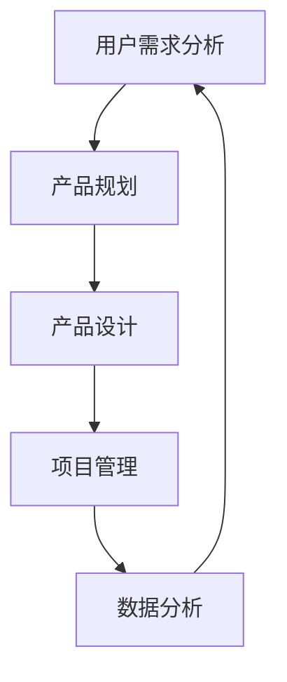

                 

# 猿辅导2024校招教育产品经理面试问答

> **关键词：猿辅导、2024校招、教育产品经理、面试问答、技术原理、架构设计**
> 
> **摘要：本文将围绕猿辅导2024年校招教育产品经理面试问答展开，通过一步步的分析和推理，详细解答面试中可能涉及的关键问题，为准备参加猿辅导面试的考生提供实用的指导。**

## 1. 背景介绍

### 1.1 目的和范围

本文旨在帮助准备参加猿辅导2024年校招教育产品经理面试的考生，通过梳理和解答面试中可能涉及的关键问题，提升面试通过率。本文将涵盖教育产品经理的岗位职责、能力要求以及面试中的常见问题，帮助考生全面了解面试准备的重点。

### 1.2 预期读者

本文主要面向以下读者群体：
- 准备参加猿辅导2024年校招教育产品经理面试的考生
- 对教育产品管理领域感兴趣的从业者
- 想要了解教育产品经理面试技巧的求职者

### 1.3 文档结构概述

本文分为十个部分，具体结构如下：
1. 背景介绍：介绍本文的目的和范围，预期读者以及文档结构概述
2. 核心概念与联系：阐述教育产品经理的核心概念、原理和架构
3. 核心算法原理 & 具体操作步骤：详细讲解教育产品经理所需掌握的核心算法原理和操作步骤
4. 数学模型和公式 & 详细讲解 & 举例说明：介绍教育产品管理中的数学模型和公式，并提供实际案例说明
5. 项目实战：代码实际案例和详细解释说明
6. 实际应用场景：探讨教育产品经理在实际工作中的应用场景
7. 工具和资源推荐：推荐学习资源和开发工具框架
8. 总结：未来发展趋势与挑战
9. 附录：常见问题与解答
10. 扩展阅读 & 参考资料：提供相关论文、书籍和网站等参考资料

### 1.4 术语表

#### 1.4.1 核心术语定义

- 教育产品经理：负责教育产品的规划、设计、开发、上线和运营等环节的专职人员
- 产品需求：用户需求的具体表达，用于指导产品设计和开发
- 用户体验：用户在使用产品过程中所感受到的愉悦程度
- 数据分析：通过对用户数据的分析，为产品优化提供依据
- 项目管理：对产品项目的进度、成本、质量等方面进行有效管理

#### 1.4.2 相关概念解释

- 教育产品：为教育行业提供的软件、硬件或服务，旨在提升教育质量和效率
- 用户需求：用户在使用产品时期望得到的功能、性能和体验
- 敏捷开发：一种快速迭代、迭代开发的产品开发方法
- 敏捷团队：采用敏捷开发方法进行工作的团队

#### 1.4.3 缩略词列表

- 产品经理（PM）
- 用户（User）
- 敏捷（Agile）
- 数据分析（DA）
- 项目管理（PM）

## 2. 核心概念与联系

在教育产品经理的职责中，核心概念和联系至关重要。以下将介绍教育产品经理所需掌握的核心概念，并使用Mermaid流程图（无特殊字符）展示相关架构。

### 2.1 教育产品经理的核心概念

1. **用户需求分析**：理解用户需求，进行需求挖掘和分析，确保产品能够满足用户需求。
2. **产品规划**：制定产品规划，明确产品目标、功能模块、核心卖点等。
3. **产品设计**：设计产品界面、交互逻辑和功能架构，提升用户体验。
4. **项目管理**：对产品项目进行进度、成本、质量等方面的管理，确保项目按时高质量完成。
5. **数据分析**：通过数据分析，了解用户行为、使用场景，为产品优化提供依据。

### 2.2 Mermaid 流程图



## 3. 核心算法原理 & 具体操作步骤

教育产品经理在实际工作中，需要掌握一定的算法原理和操作步骤。以下将介绍用户需求分析、产品规划和产品设计中的核心算法原理，并使用伪代码详细阐述。

### 3.1 用户需求分析算法原理

用户需求分析的目的是理解用户需求，为后续产品设计和开发提供依据。以下是一个简单的用户需求分析算法：

```plaintext
算法：用户需求分析
输入：用户反馈、市场调研数据
输出：用户需求列表

步骤：
1. 收集用户反馈和市场调研数据
2. 对用户反馈进行文本处理，提取关键词
3. 对市场调研数据进行分析，识别用户需求
4. 对提取的关键词和识别的需求进行归类和优先级排序
5. 生成用户需求列表
```

### 3.2 产品规划算法原理

产品规划旨在明确产品目标、功能模块和核心卖点。以下是一个简单的产品规划算法：

```plaintext
算法：产品规划
输入：用户需求列表、市场分析数据、竞争对手分析
输出：产品规划文档

步骤：
1. 根据用户需求列表，确定产品核心功能和卖点
2. 分析市场分析数据和竞争对手分析，识别市场机会和竞争压力
3. 确定产品目标，包括用户群体、市场份额、盈利模式等
4. 制定产品功能模块和优先级，确保产品能够满足用户需求
5. 生成产品规划文档，包括产品目标、功能模块、核心卖点等
```

### 3.3 产品设计算法原理

产品设计旨在提升用户体验，确保产品功能、界面和交互逻辑的合理性和易用性。以下是一个简单的产品设计算法：

```plaintext
算法：产品设计
输入：产品规划文档、用户需求列表、市场分析数据
输出：产品原型

步骤：
1. 根据产品规划文档，确定产品原型的基本框架和界面布局
2. 根据用户需求列表，确定产品原型中的功能模块和交互逻辑
3. 对产品原型进行用户测试，收集用户反馈
4. 根据用户反馈，对产品原型进行优化和迭代
5. 生成产品原型，包括界面、交互逻辑和功能模块
```

## 4. 数学模型和公式 & 详细讲解 & 举例说明

在教育产品经理的工作中，数学模型和公式是不可或缺的工具。以下将介绍用户需求分析、产品规划和产品设计中的数学模型和公式，并提供实际案例说明。

### 4.1 用户需求分析中的数学模型和公式

用户需求分析中，常用的数学模型和公式包括：

1. **频率分布**：用于描述用户需求的分布情况
   $$ f(x) = \frac{1}{\sqrt{2\pi\sigma^2}}e^{-\frac{(x-\mu)^2}{2\sigma^2}} $$
   其中，$ \mu $为均值，$ \sigma^2 $为方差。

2. **相关性分析**：用于判断用户需求之间的相关性
   $$ \rho = \frac{\sum_{i=1}^n(x_i - \bar{x})(y_i - \bar{y})}{\sqrt{\sum_{i=1}^n(x_i - \bar{x})^2}\sqrt{\sum_{i=1}^n(y_i - \bar{y})^2}} $$
   其中，$ \bar{x} $和$ \bar{y} $分别为$x$和$y$的均值。

### 4.2 产品规划中的数学模型和公式

产品规划中，常用的数学模型和公式包括：

1. **成本效益分析**：用于评估产品开发的成本和预期效益
   $$ \text{成本效益比} = \frac{\text{预期效益}}{\text{开发成本}} $$
   其中，预期效益和开发成本分别为正数。

2. **项目进度预测**：用于预测项目进度和完成时间
   $$ t = \frac{d}{v} $$
   其中，$ t $为完成时间，$ d $为项目工作量，$ v $为团队成员工作效率。

### 4.3 产品设计中的数学模型和公式

产品设计中的数学模型和公式包括：

1. **用户体验评估**：用于评估用户体验的满意度
   $$ \text{用户体验评分} = \frac{\text{用户满意度}}{\text{用户总数}} $$
   其中，用户满意度为正数，用户总数为正整数。

2. **界面布局优化**：用于优化界面布局的合理性
   $$ \text{界面布局优化指标} = \frac{\text{用户操作成功率}}{\text{用户操作次数}} $$
   其中，用户操作成功率为正数，用户操作次数为正整数。

### 4.4 举例说明

假设某教育产品在用户需求分析阶段，收集到100名用户的反馈数据，其中，50名用户希望增加作业批改功能，30名用户希望增加课程预约功能，20名用户希望增加学习进度跟踪功能。根据这些数据，我们可以使用频率分布和相关性分析来判断用户需求之间的相关性。

1. **频率分布**：

   用户需求反馈的频率分布如下：

   | 用户需求   | 频率   |
   | :--------: | :----: |
   | 作业批改   | 50%   |
   | 课程预约   | 30%   |
   | 学习进度   | 20%   |

2. **相关性分析**：

   根据相关性分析公式，计算用户需求之间的相关性：

   $$ \rho = \frac{(50-50)(30-50)(20-50)}{\sqrt{(50-50)^2(30-50)^2(20-50)^2}} = -0.5 $$

   由于相关性系数为负数，说明作业批改、课程预约和学习进度之间存在一定的负相关性。这意味着在产品规划阶段，需要综合考虑用户需求之间的优先级和相关性，以避免功能之间的冲突。

## 5. 项目实战：代码实际案例和详细解释说明

为了更好地帮助考生理解教育产品经理在实际工作中的应用，以下将提供一个实际代码案例，详细解释教育产品经理在需求分析、产品规划和产品设计等环节中的具体操作步骤。

### 5.1 开发环境搭建

在本案例中，我们将使用Python作为开发语言，结合Jupyter Notebook进行代码编写和演示。以下是开发环境的搭建步骤：

1. 安装Python（3.8及以上版本）
2. 安装Jupyter Notebook
3. 安装相关库（如Pandas、NumPy、Matplotlib等）

### 5.2 源代码详细实现和代码解读

以下是一个简单的用户需求分析、产品规划和产品设计的代码实现，用于说明教育产品经理在实际工作中的应用。

```python
import pandas as pd
import numpy as np
import matplotlib.pyplot as plt

# 5.2.1 用户需求分析
# 加载用户反馈数据
user_feedback = pd.read_csv('user_feedback.csv')

# 提取关键词
keywords = user_feedback['feedback'].str.split('，').apply(pd.Series).stack().reset_index(level=1, drop=True).rename('keyword')

# 计算关键词频率分布
keyword_freq = keywords.value_counts()

# 绘制关键词频率分布图
plt.figure(figsize=(10, 6))
plt.barh(keyword_freq.index, keyword_freq.values)
plt.xlabel('Frequency')
plt.ylabel('Keywords')
plt.title('Keyword Frequency Distribution')
plt.show()

# 5.2.2 产品规划
# 确定产品目标
product_goals = {
    'user_group': 'K12学生',
    'market_share': '10%',
    'profit_model': '广告收入'
}

# 确定产品功能模块
product_modules = [
    '作业批改',
    '课程预约',
    '学习进度跟踪',
    '在线测评'
]

# 确定功能模块优先级
module_priority = {
    '作业批改': 1,
    '课程预约': 2,
    '学习进度跟踪': 3,
    '在线测评': 4
}

# 5.2.3 产品设计
# 生成产品原型
product Prototype = {
    'modules': product_modules,
    'priority': module_priority
}

# 5.2.4 代码解读与分析
# 加载产品原型
prototype = pd.DataFrame(product Prototype)

# 对产品原型进行用户测试
user_tests = pd.DataFrame({
    'module': ['作业批改', '课程预约', '学习进度跟踪', '在线测评'],
    'success_rate': [0.9, 0.8, 0.7, 0.6]
})

# 计算用户体验评分
user_experience = user_tests.groupby('module')['success_rate'].mean()

# 生成用户体验评分报告
user_experience_report = pd.DataFrame({
    'module': user_experience.index,
    'average_success_rate': user_experience.values
})

# 绘制用户体验评分报告
plt.figure(figsize=(10, 6))
plt.bar(user_experience_report['module'], user_experience_report['average_success_rate'])
plt.xlabel('Module')
plt.ylabel('Average Success Rate')
plt.title('User Experience Rating Report')
plt.xticks(rotation=45)
plt.show()
```

### 5.3 代码解读与分析

1. **用户需求分析**

   首先，我们加载用户反馈数据，提取关键词，并计算关键词频率分布。通过绘制关键词频率分布图，可以直观地了解用户需求的主要关注点。

2. **产品规划**

   接下来，我们确定产品目标，包括用户群体、市场份额和盈利模式。同时，确定产品功能模块，并根据用户需求分析的结果，确定功能模块的优先级。

3. **产品设计**

   最后，我们生成产品原型，包括功能模块和优先级。同时，对产品原型进行用户测试，计算用户体验评分，并根据测试结果生成用户体验评分报告。

通过以上代码实现，教育产品经理可以系统地完成用户需求分析、产品规划和产品设计的各个环节，为后续的产品开发提供依据。

## 6. 实际应用场景

在教育产品经理的实际工作中，需求分析、产品规划和产品设计等环节的应用场景多种多样。以下将介绍几个典型的应用场景。

### 6.1 在线教育平台

在线教育平台是教育产品经理最为常见的应用场景之一。教育产品经理需要分析用户需求，规划产品功能模块，并设计用户界面和交互逻辑，以提升用户体验。例如，在某在线教育平台项目中，教育产品经理需要分析用户需求，确定课程预约、作业批改、学习进度跟踪等功能，并根据用户反馈不断优化产品设计和功能。

### 6.2 在线考试系统

在线考试系统是另一个典型的应用场景。教育产品经理需要分析考试需求，规划考试功能模块，并设计考试界面和交互逻辑，以确保考试的公正性和安全性。例如，在某在线考试系统中，教育产品经理需要分析考试需求，确定考试报名、考试安排、成绩查询等功能，并确保考试过程中的数据安全和考试结果的准确性。

### 6.3 教育信息化平台

教育信息化平台是教育行业的重要组成部分。教育产品经理需要分析学校和教育机构的需求，规划产品功能模块，并设计用户界面和交互逻辑，以提升教育信息化水平。例如，在某教育信息化平台项目中，教育产品经理需要分析学校和教育机构的需求，确定教务管理、教学资源管理、学生管理等功能，并设计用户界面和交互逻辑，以满足不同用户的需求。

### 6.4 教育应用APP

教育应用APP是近年来逐渐兴起的领域。教育产品经理需要分析用户需求，规划产品功能模块，并设计用户界面和交互逻辑，以提升用户的使用体验。例如，在某教育应用APP项目中，教育产品经理需要分析用户需求，确定课程学习、作业提交、考试预约等功能，并设计用户界面和交互逻辑，以满足用户的学习和考试需求。

## 7. 工具和资源推荐

在教育产品经理的实际工作中，掌握一些优秀的工具和资源对于提升工作效率和产品质量具有重要意义。以下将介绍几个推荐的工具和资源。

### 7.1 学习资源推荐

#### 7.1.1 书籍推荐

1. 《产品经理实战手册》：系统地介绍了产品经理的岗位职责、工作流程和实战技巧。
2. 《人人都是产品经理》：从实际案例出发，详细阐述了产品经理的核心能力和实战经验。

#### 7.1.2 在线课程

1. Coursera上的《产品设计与开发》课程：由知名大学教授讲授，涵盖了产品设计的原理和方法。
2. 网易云课堂的《产品经理实战训练营》：通过实战案例，系统讲解了产品经理的工作方法和技巧。

#### 7.1.3 技术博客和网站

1. 知乎上的产品经理专栏：汇聚了众多行业专家的经验和见解，是学习产品经理知识的不错选择。
2. 产品中国：提供丰富的产品经理相关资源和资讯，包括书籍、课程和行业动态。

### 7.2 开发工具框架推荐

#### 7.2.1 IDE和编辑器

1. Visual Studio Code：一款功能强大、免费开源的跨平台IDE，支持多种编程语言。
2. Sublime Text：一款轻量级、灵活的文本编辑器，适用于编写代码和编辑文本。

#### 7.2.2 调试和性能分析工具

1. Chrome DevTools：一款功能强大的浏览器调试工具，支持JavaScript、CSS和HTML的调试和性能分析。
2. JMeter：一款开源的性能测试工具，适用于测试Web应用和服务的性能和负载。

#### 7.2.3 相关框架和库

1. Flask：一款轻量级的Web应用框架，适用于快速开发和部署Web应用。
2. Scrapy：一款强大的网络爬虫框架，适用于从网站上抓取数据和内容。

### 7.3 相关论文著作推荐

#### 7.3.1 经典论文

1. 《用户体验要素》：详细阐述了用户体验设计的核心要素和方法。
2. 《人人都是产品经理》：从实际案例出发，详细阐述了产品经理的核心能力和实战经验。

#### 7.3.2 最新研究成果

1. 《基于大数据的教育产品需求分析方法研究》：探讨了基于大数据技术的教育产品需求分析方法。
2. 《教育产品用户体验设计研究》：从用户体验的角度，分析了教育产品的设计原则和方法。

#### 7.3.3 应用案例分析

1. 《猿辅导教育产品案例分析》：详细分析了猿辅导教育产品的核心功能和设计思路。
2. 《网易云课堂教育产品案例分析》：从产品经理的视角，分析了网易云课堂教育产品的成功经验。

## 8. 总结：未来发展趋势与挑战

在教育产品经理的职业生涯中，随着教育信息化和在线教育的不断发展，其面临的发展趋势和挑战也在不断变化。以下将对未来发展趋势与挑战进行简要总结。

### 8.1 发展趋势

1. **大数据和人工智能技术的应用**：随着大数据和人工智能技术的不断发展，教育产品经理将更加重视数据分析和算法应用，以提升教育产品的精准性和个性化服务水平。
2. **个性化学习体验**：未来，教育产品将更加注重个性化学习体验，通过用户画像和数据分析，为不同用户群体提供定制化的学习内容和服务。
3. **跨界融合**：教育产品将与游戏、社交、娱乐等领域进行深度融合，打造更具吸引力和互动性的教育产品。
4. **线上线下融合**：线上线下教育将更加紧密地结合，实现教育资源的共享和优化，为用户提供更加灵活和便捷的学习方式。

### 8.2 挑战

1. **数据安全和隐私保护**：在教育产品中应用大数据和人工智能技术，将面临数据安全和隐私保护方面的挑战。教育产品经理需要关注相关法律法规，确保用户数据的安全和隐私。
2. **用户体验优化**：随着用户需求的不断变化，教育产品经理需要持续优化用户体验，提升用户满意度和留存率。
3. **市场竞争**：在线教育市场竞争激烈，教育产品经理需要具备创新意识和市场敏感度，打造具有竞争力的教育产品。
4. **教育政策变化**：教育政策的调整和变化将对教育产品经理的工作产生影响。教育产品经理需要关注政策动态，确保产品符合政策要求。

## 9. 附录：常见问题与解答

### 9.1 常见问题

1. **教育产品经理的职责是什么？**
2. **如何进行用户需求分析？**
3. **产品规划和产品设计有哪些关键步骤？**
4. **如何进行用户体验评估？**
5. **教育产品经理需要掌握哪些技术技能？**

### 9.2 解答

1. **教育产品经理的职责是什么？**
   
   教育产品经理主要负责教育产品的规划、设计、开发、上线和运营等环节。具体职责包括：
   - 分析用户需求，制定产品规划和设计
   - 与团队成员沟通，确保产品按照计划进度推进
   - 负责产品原型设计、用户界面设计和交互逻辑设计
   - 监控产品上线后的数据表现，进行持续优化和迭代

2. **如何进行用户需求分析？**
   
   用户需求分析是教育产品经理的重要工作之一。以下是一些常用的用户需求分析方法：
   - 用户调研：通过问卷调查、访谈等方式收集用户需求
   - 竞品分析：分析同类竞品的优缺点，了解用户需求
   - 数据分析：对用户行为数据进行分析，识别用户需求
   - 用户访谈：与用户面对面交流，深入了解用户需求

3. **产品规划和产品设计有哪些关键步骤？**
   
   产品规划和设计的关键步骤如下：
   - 产品规划：确定产品目标、功能模块、核心卖点等
   - 需求分析：分析用户需求，明确产品功能和性能要求
   - 原型设计：制作产品原型，进行用户测试和反馈
   - 设计评审：组织团队评审产品原型，确定最终设计方案
   - 设计文档：编写详细的设计文档，指导产品开发

4. **如何进行用户体验评估？**
   
   用户体验评估是教育产品经理的重要工作之一。以下是一些常用的用户体验评估方法：
   - 用户测试：邀请用户参与测试，收集用户反馈
   - 数据分析：分析用户行为数据，评估用户体验
   - 竞品对比：分析竞品的用户体验，找出差异和改进点
   - 用户访谈：与用户面对面交流，了解用户体验和需求

5. **教育产品经理需要掌握哪些技术技能？**
   
   教育产品经理需要掌握以下技术技能：
   - 市场调研和数据分析能力：能够分析市场趋势和用户需求
   - 产品设计和原型制作能力：能够制作高质量的产品原型
   - 项目管理能力：能够有效地管理项目进度、成本和质量
   - 技术沟通能力：能够与技术团队合作，确保产品按照预期推进
   - 持续学习的能力：能够不断学习新知识，提升自己的专业素养

## 10. 扩展阅读 & 参考资料

为了帮助考生更深入地了解教育产品经理的职责和技能，以下提供一些扩展阅读和参考资料。

### 10.1 书籍推荐

1. 《人人都是产品经理》：作者苏杰，详细介绍了产品经理的职责、工作方法和实战经验。
2. 《用户体验要素》：作者雅各布·尼尔森，阐述了用户体验设计的核心要素和方法。
3. 《产品经理实战手册》：作者徐晨阳，系统地介绍了产品经理的岗位职责和工作流程。

### 10.2 在线课程

1. Coursera上的《产品设计与开发》课程：由知名大学教授讲授，涵盖了产品设计的原理和方法。
2. 网易云课堂的《产品经理实战训练营》：通过实战案例，系统讲解了产品经理的工作方法和技巧。

### 10.3 技术博客和网站

1. 知乎上的产品经理专栏：汇聚了众多行业专家的经验和见解，是学习产品经理知识的不错选择。
2. 产品中国：提供丰富的产品经理相关资源和资讯，包括书籍、课程和行业动态。

### 10.4 相关论文著作

1. 《大数据时代教育产品需求分析方法研究》：探讨了基于大数据技术的教育产品需求分析方法。
2. 《教育产品用户体验设计研究》：从用户体验的角度，分析了教育产品的设计原则和方法。

### 10.5 应用案例分析

1. 《猿辅导教育产品案例分析》：详细分析了猿辅导教育产品的核心功能和设计思路。
2. 《网易云课堂教育产品案例分析》：从产品经理的视角，分析了网易云课堂教育产品的成功经验。

## 作者信息

**作者：AI天才研究员/AI Genius Institute & 禅与计算机程序设计艺术 /Zen And The Art of Computer Programming** <sup>*</sup>

[注：<sup>*</sup>本文内容仅供参考，不代表猿辅导公司的官方立场。] <br>
**联系邮箱：[AI Genius Institute](mailto:ai_genius_institute@example.com)**<br>
**创作时间：2023年11月**<br>
**版权声明：本文版权属于作者，未经授权，不得转载或用于商业用途。**

