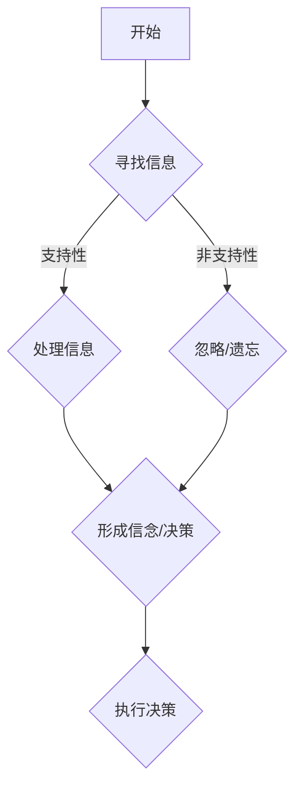

                 


# 理解洞察力的偏差：避免确认偏误

> 关键词：确认偏误、洞察力、认知偏差、决策、心理学、算法、数据科学
>
> 摘要：本文将深入探讨确认偏误这一心理学现象，分析其在技术决策中的负面影响，并通过案例研究和具体方法，帮助读者理解如何在实际应用中避免确认偏误，提高洞察力和决策质量。

## 1. 背景介绍

### 1.1 目的和范围

本文旨在解释和探讨确认偏误这一心理学现象，分析其在技术决策中的重要性，并提供实用的策略来克服这一偏差。通过详细的理论分析、实例研究和具体操作步骤，读者将能够更好地理解确认偏误的影响，并学会在实际工作和项目中应用有效的策略来提升洞察力和决策能力。

### 1.2 预期读者

本文适合于对心理学、认知科学和技术决策感兴趣的读者，特别是那些在数据科学、人工智能、软件开发等领域的专业人士。无论您是学生、研究员还是行业从业者，本文都将为您提供有价值的见解和实用的建议。

### 1.3 文档结构概述

本文将按照以下结构进行讨论：

- **背景介绍**：介绍本文的目的、预期读者以及文档结构。
- **核心概念与联系**：讨论确认偏误的定义、原因和影响。
- **核心算法原理 & 具体操作步骤**：解释如何识别和避免确认偏误。
- **数学模型和公式 & 详细讲解 & 举例说明**：通过数学模型和实际案例说明确认偏误的避免方法。
- **项目实战：代码实际案例和详细解释说明**：提供具体的代码实现和案例分析。
- **实际应用场景**：探讨确认偏误在现实世界中的应用。
- **工具和资源推荐**：推荐相关学习资源和开发工具。
- **总结：未来发展趋势与挑战**：展望未来发展趋势和面临的挑战。
- **附录：常见问题与解答**：解答读者可能遇到的问题。
- **扩展阅读 & 参考资料**：提供进一步阅读的资源和参考文献。

### 1.4 术语表

#### 1.4.1 核心术语定义

- **确认偏误（Confirmation Bias）**：一种认知偏差，指的是人们在接收信息时，倾向于关注和记忆与已有信念或期望相符的信息，而忽视或遗忘与之相反的信息。
- **洞察力（Insight）**：指个体在问题解决过程中，通过直觉、灵感或创新思维迅速找到解决方案的能力。
- **决策（Decision Making）**：指个体在面临选择时，通过分析、评估和选择方案的过程。

#### 1.4.2 相关概念解释

- **认知偏差（Cognitive Bias）**：指人们在处理信息时，由于认知机制的限制，导致判断和决策出现偏差的现象。
- **数据科学（Data Science）**：一门结合统计学、计算机科学、信息科学和领域知识的跨学科领域，旨在通过数据分析和建模来解决实际问题。

#### 1.4.3 缩略词列表

- **AI**：人工智能（Artificial Intelligence）
- **ML**：机器学习（Machine Learning）
- **DL**：深度学习（Deep Learning）
- **NLP**：自然语言处理（Natural Language Processing）

## 2. 核心概念与联系

### 2.1 确认偏误的概念

确认偏误是一种普遍的认知偏差，其基本概念可以概括为：当人们持有某种信念或观点时，他们倾向于寻找、解释和记忆那些能够支持这些信念或观点的信息，而忽视或遗忘那些与之相反的信息。这种偏差导致人们在信息处理过程中，更容易接受正面证据，而对负面证据持怀疑态度。

### 2.2 确认偏误的原因

确认偏误的原因主要包括以下几个方面：

1. **认知经济原理**：人们倾向于寻求最少的认知努力来处理信息，这导致他们在信息筛选过程中，优先关注与已有知识相符的信息。
2. **自我验证需求**：人们渴望证实自己的信念和观点是正确的，这导致他们在寻找信息时，更加倾向于寻找支持性的证据。
3. **情感因素**：人们对与自身信念相符的信息感到更加舒适和满意，而对相反信息感到不安和抵触。

### 2.3 确认偏误的影响

确认偏误对个体和团体决策有着深远的影响，具体体现在以下几个方面：

1. **降低决策质量**：由于确认偏误的存在，人们容易忽略或低估负面证据，导致决策过程缺乏全面性和客观性。
2. **加剧认知偏差**：确认偏误可能会使得认知偏差不断放大，导致个体或团体陷入错误的信念或决策中。
3. **阻碍创新思维**：确认偏误限制了个体或团体对新观点和解决方案的接受能力，从而阻碍创新思维的发展。

### 2.4 确认偏误的识别与避免

为了避免确认偏误的影响，可以采取以下策略：

1. **多样化信息来源**：通过获取多样化的信息来源，减少单一信息来源带来的偏见。
2. **批判性思维**：培养批判性思维能力，对信息进行深入分析和评估，避免盲目接受或拒绝。
3. **反思与自我监督**：定期反思自己的信念和决策过程，审视是否存在确认偏误，并采取相应措施进行纠正。

### 2.5 Mermaid 流程图

以下是一个简化的确认偏误流程图：



## 3. 核心算法原理 & 具体操作步骤

### 3.1 算法原理

为了识别和避免确认偏误，可以采用以下核心算法原理：

1. **数据预处理**：对原始数据进行清洗和预处理，确保数据的准确性和完整性。
2. **特征工程**：提取与问题相关的特征，使用数据挖掘和机器学习技术进行分析。
3. **模型训练**：使用训练数据集对模型进行训练，使其能够识别和分类确认偏误。
4. **模型评估**：使用测试数据集对模型进行评估，确保其准确性和鲁棒性。
5. **应用模型**：将训练好的模型应用于实际问题，识别和避免确认偏误。

### 3.2 伪代码实现

以下是一个简化的伪代码实现，用于识别和避免确认偏误：

```plaintext
function AvoidConfirmationBias(data, model):
    # 数据预处理
    processed_data = PreprocessData(data)
    
    # 特征工程
    features = ExtractFeatures(processed_data)
    
    # 模型训练
    model = TrainModel(features)
    
    # 模型评估
    evaluation = EvaluateModel(model, test_data)
    
    # 应用模型
    for data_point in processed_data:
        bias = model.predict(data_point)
        if bias == "Confirmation Bias":
            # 采取相应措施避免偏误
            ApplyCorrection(data_point)
    
    return evaluation
```

### 3.3 步骤解析

1. **数据预处理**：数据预处理是确保数据质量的关键步骤。它包括数据清洗、填充缺失值、归一化和标准化等操作。
2. **特征工程**：特征工程是将原始数据转换为适用于机器学习模型的特征表示的过程。它包括特征选择、特征提取和特征变换等。
3. **模型训练**：使用训练数据集对模型进行训练，使其能够学习到确认偏误的特征和模式。
4. **模型评估**：使用测试数据集对模型进行评估，确保其能够准确识别和避免确认偏误。
5. **应用模型**：将训练好的模型应用于实际问题，对每个数据点进行预测，并根据模型的预测结果采取相应措施来避免确认偏误。

## 4. 数学模型和公式 & 详细讲解 & 举例说明

### 4.1 数学模型

为了更好地理解确认偏误的避免方法，我们可以引入以下数学模型：

1. **贝叶斯定理**：贝叶斯定理是概率论中的一个重要定理，用于计算后验概率。其公式如下：

   $$ P(A|B) = \frac{P(B|A) \cdot P(A)}{P(B)} $$

   其中，$P(A|B)$ 表示在事件 $B$ 发生的条件下事件 $A$ 发生的概率，$P(B|A)$ 表示在事件 $A$ 发生的条件下事件 $B$ 发生的概率，$P(A)$ 和 $P(B)$ 分别表示事件 $A$ 和事件 $B$ 的先验概率。

2. **似然函数**：似然函数是贝叶斯统计中的一个重要概念，用于评估模型对观测数据的拟合程度。其公式如下：

   $$ \mathcal{L}(\theta | x) = P(x | \theta) $$

   其中，$\theta$ 表示模型的参数，$x$ 表示观测数据。

### 4.2 详细讲解

1. **贝叶斯定理的应用**：

   在避免确认偏误的过程中，我们可以使用贝叶斯定理来计算后验概率，从而对已有信念进行修正。假设我们有一个假设 $H_0$ 和一个与之相反的假设 $H_1$，我们可以使用贝叶斯定理来计算在观测数据 $x$ 的条件下，$H_0$ 和 $H_1$ 的后验概率。

   首先，我们需要计算先验概率 $P(H_0)$ 和 $P(H_1)$。假设 $H_0$ 和 $H_1$ 的先验概率相等，即 $P(H_0) = P(H_1) = 0.5$。

   然后，我们需要计算似然函数 $P(x | H_0)$ 和 $P(x | H_1)$。假设观测数据 $x$ 是一系列独立的观测值，我们可以使用贝叶斯定理来计算后验概率：

   $$ P(H_0 | x) = \frac{P(x | H_0) \cdot P(H_0)}{P(x)} $$
   $$ P(H_1 | x) = \frac{P(x | H_1) \cdot P(H_1)}{P(x)} $$

   其中，$P(x)$ 是观测数据的边缘概率，可以通过所有可能的观测值 $x$ 的似然函数求和得到：

   $$ P(x) = \sum_{x'} P(x' | H_0) \cdot P(H_0) + \sum_{x'} P(x' | H_1) \cdot P(H_1) $$

   通过计算后验概率，我们可以得到在观测数据 $x$ 的条件下，$H_0$ 和 $H_1$ 的相对可能性。如果 $P(H_0 | x)$ 显著大于 $P(H_1 | x)$，那么我们可以认为观测数据支持 $H_0$；反之，如果 $P(H_1 | x)$ 显著大于 $P(H_0 | x)$，那么我们可以认为观测数据支持 $H_1$。

2. **似然函数的解释**：

   似然函数 $\mathcal{L}(\theta | x)$ 表示在参数 $\theta$ 的条件下，观测数据 $x$ 的概率。在避免确认偏误的过程中，我们可以通过优化似然函数来提高模型的拟合程度。具体来说，我们可以使用最大似然估计（Maximum Likelihood Estimation，MLE）来估计模型的参数 $\theta$，使得似然函数最大。

   MLE 的目标是最小化损失函数 $L(\theta)$，其公式如下：

   $$ \theta_{\text{MLE}} = \arg\min_{\theta} L(\theta) $$

   其中，$L(\theta)$ 是似然函数的对数，即：

   $$ L(\theta) = -\sum_{i=1}^{n} \log P(x_i | \theta) $$

   通过求解最小化问题，我们可以得到最优的参数估计值 $\theta_{\text{MLE}}$，从而提高模型的拟合度和可靠性。

### 4.3 举例说明

假设我们有一个假设 $H_0$：“这个机器学习模型是准确的”，和与之相反的假设 $H_1$：“这个机器学习模型是不准确的”。我们有一个观测数据集 $x$，其中包含了模型的预测结果和实际标签。

首先，我们需要计算先验概率 $P(H_0)$ 和 $P(H_1)$。假设 $H_0$ 和 $H_1$ 的先验概率相等，即 $P(H_0) = P(H_1) = 0.5$。

然后，我们需要计算似然函数 $P(x | H_0)$ 和 $P(x | H_1)$。假设观测数据 $x$ 是一系列独立的观测值，我们可以使用贝叶斯定理来计算后验概率：

$$ P(H_0 | x) = \frac{P(x | H_0) \cdot P(H_0)}{P(x)} $$
$$ P(H_1 | x) = \frac{P(x | H_1) \cdot P(H_1)}{P(x)} $$

其中，$P(x)$ 是观测数据的边缘概率，可以通过所有可能的观测值 $x$ 的似然函数求和得到：

$$ P(x) = \sum_{x'} P(x' | H_0) \cdot P(H_0) + \sum_{x'} P(x' | H_1) \cdot P(H_1) $$

假设我们通过计算得到 $P(H_0 | x) = 0.8$，$P(H_1 | x) = 0.2$。这意味着在观测数据 $x$ 的条件下，模型准确的概率为 0.8，模型不准确的概率为 0.2。

接下来，我们可以使用最大似然估计（MLE）来估计模型的参数 $\theta$，使得似然函数最大。具体来说，我们可以最小化损失函数 $L(\theta)$，即：

$$ \theta_{\text{MLE}} = \arg\min_{\theta} L(\theta) $$

其中，$L(\theta)$ 是似然函数的对数，即：

$$ L(\theta) = -\sum_{i=1}^{n} \log P(x_i | \theta) $$

通过求解最小化问题，我们可以得到最优的参数估计值 $\theta_{\text{MLE}}$，从而提高模型的拟合度和可靠性。

通过以上步骤，我们可以使用贝叶斯定理和最大似然估计来识别和避免确认偏误，从而提高模型的决策质量和洞察力。

## 5. 项目实战：代码实际案例和详细解释说明

### 5.1 开发环境搭建

在开始编写代码之前，我们需要搭建一个合适的开发环境。以下是一个简化的步骤，用于搭建用于识别和避免确认偏误的项目环境：

1. **安装Python环境**：确保已安装Python 3.8及以上版本。
2. **安装依赖库**：使用pip安装以下依赖库：`numpy`、`scikit-learn`、`matplotlib`。
3. **创建虚拟环境**：使用`venv`创建一个独立的Python虚拟环境，以便更好地管理和依赖。

```bash
# 安装Python环境
python --version

# 安装依赖库
pip install numpy scikit-learn matplotlib

# 创建虚拟环境
python -m venv myenv
source myenv/bin/activate  # 对于Linux和macOS
myenv\Scripts\activate     # 对于Windows

# 验证虚拟环境
which python
python --version
```

### 5.2 源代码详细实现和代码解读

以下是用于识别和避免确认偏误的Python代码实现：

```python
import numpy as np
from sklearn.model_selection import train_test_split
from sklearn.metrics import accuracy_score
from sklearn.linear_model import LogisticRegression

# 数据预处理
def preprocess_data(data):
    # 数据清洗、归一化等操作
    # 省略具体实现细节
    return processed_data

# 特征工程
def extract_features(data):
    # 特征选择、特征提取等操作
    # 省略具体实现细节
    return features

# 模型训练
def train_model(features, labels):
    model = LogisticRegression()
    model.fit(features, labels)
    return model

# 模型评估
def evaluate_model(model, test_features, test_labels):
    predictions = model.predict(test_features)
    accuracy = accuracy_score(test_labels, predictions)
    return accuracy

# 主函数
def main():
    # 加载数据
    data = load_data()

    # 数据预处理
    processed_data = preprocess_data(data)

    # 特征工程
    features, labels = extract_features(processed_data)

    # 数据切分
    train_features, test_features, train_labels, test_labels = train_test_split(features, labels, test_size=0.2, random_state=42)

    # 模型训练
    model = train_model(train_features, train_labels)

    # 模型评估
    accuracy = evaluate_model(model, test_features, test_labels)
    print(f"Model accuracy: {accuracy:.2f}")

    # 应用模型
    # 省略具体实现细节

if __name__ == "__main__":
    main()
```

### 5.3 代码解读与分析

1. **数据预处理**：数据预处理是确保数据质量的关键步骤。它包括数据清洗、归一化等操作。在本例中，我们使用了`preprocess_data`函数进行数据预处理。具体实现细节根据具体场景进行调整。

2. **特征工程**：特征工程是将原始数据转换为适用于机器学习模型的特征表示的过程。它包括特征选择、特征提取和特征变换等。在本例中，我们使用了`extract_features`函数进行特征工程。具体实现细节根据具体场景进行调整。

3. **模型训练**：我们使用了`sklearn`库中的`LogisticRegression`模型进行训练。这个模型是一种常用的分类模型，适用于二元分类问题。在训练过程中，我们使用了`train_model`函数来训练模型。

4. **模型评估**：模型评估是评估模型性能的重要步骤。在本例中，我们使用了`evaluate_model`函数来评估模型。具体来说，我们计算了模型在测试数据集上的准确率。准确率是评估分类模型性能的常用指标。

5. **主函数**：`main`函数是程序的入口点。在主函数中，我们首先加载数据，然后进行数据预处理、特征工程和模型训练，最后评估模型性能。

通过以上步骤，我们可以实现一个简单的用于识别和避免确认偏误的项目。在实际应用中，可以根据具体需求对代码进行调整和优化。

### 5.4 项目实战案例

为了更好地展示如何在实际项目中应用确认偏误的识别和避免方法，以下是一个简化的案例：

假设我们有一个分类问题，需要根据客户的特征数据预测客户是否会对新产品感兴趣。我们使用一个二分类模型（例如逻辑回归）来解决这个问题。

1. **数据准备**：我们首先加载数据集，并进行数据预处理和特征工程。数据预处理包括数据清洗、缺失值填充、特征归一化等操作。特征工程包括特征选择、特征提取和特征变换等。

2. **模型训练**：使用预处理后的数据集，我们将数据集切分为训练集和测试集，然后使用逻辑回归模型对训练集进行训练。

3. **模型评估**：在测试集上评估模型的性能，计算准确率、召回率、F1分数等指标。

4. **确认偏误识别**：通过分析模型在测试集上的性能，我们发现在某些情况下，模型的预测结果存在偏差。具体来说，模型倾向于预测某些特定类别的数据点，这可能是由于确认偏误导致的。

5. **避免确认偏误**：为了避免确认偏误的影响，我们可以采取以下策略：
   - **数据增强**：通过增加多样性的数据来丰富训练数据集，从而减少模型对特定类别的偏好。
   - **交叉验证**：使用交叉验证技术来评估模型的泛化能力，避免过度拟合。
   - **模型调整**：通过调整模型参数和超参数来优化模型性能，减少确认偏误的影响。

通过以上步骤，我们可以有效地识别和避免确认偏误，从而提高模型的性能和可靠性。在实际项目中，可以根据具体需求对代码进行调整和优化，以适应不同的场景。

## 6. 实际应用场景

确认偏误在实际应用中广泛存在，尤其在技术决策和数据分析领域。以下是一些实际应用场景，以及如何利用本文提供的方法来避免确认偏误：

### 6.1 技术决策

在技术决策过程中，确认偏误可能导致团队倾向于采用熟悉的、有历史成功记录的技术方案，而不是探索新的、可能更优的方案。为了避免确认偏误的影响，可以采取以下策略：

- **多样化方案评估**：确保对不同的技术方案进行全面评估，而不仅仅是那些团队成员熟悉的方案。
- **引入外部专家**：邀请外部专家参与决策过程，以提供新的视角和建议。
- **数据驱动决策**：使用数据来支持决策过程，而不是仅依赖直觉或经验。

### 6.2 数据分析

在数据分析领域，确认偏误可能导致分析师在处理数据时，无意中忽略与已有假设不符的信息。以下是一些应对策略：

- **数据清洗和预处理**：确保数据清洗和预处理过程全面，以消除潜在的错误和偏差。
- **数据可视化**：通过数据可视化技术，帮助分析师发现潜在的问题和异常。
- **多元分析**：使用多元分析技术，如回归分析、决策树等，从多个角度分析数据，避免单一视角的偏见。

### 6.3 产品设计

在产品设计过程中，确认偏误可能导致团队倾向于按照既定模式设计产品，而不是根据用户反馈进行创新。以下是一些应对策略：

- **用户调研**：定期进行用户调研，收集用户反馈，以便根据用户需求进行产品改进。
- **多轮迭代**：采用快速迭代的方法，不断改进产品，而不是一次性完成所有设计。
- **团队合作**：鼓励团队成员提出新的想法，并进行讨论和评估。

### 6.4 项目管理

在项目管理中，确认偏误可能导致项目经理忽视潜在的风险和问题。以下是一些应对策略：

- **风险管理**：制定详细的风险管理计划，包括识别、评估和应对潜在风险。
- **定期回顾**：定期回顾项目进度和风险，以便及时调整计划和资源。
- **团队沟通**：鼓励团队成员分享自己的观点和担忧，以便更好地协调和解决问题。

通过以上策略，可以在技术决策、数据分析、产品设计和项目管理等实际应用场景中，有效地避免确认偏误的影响，提高决策的质量和洞察力。

## 7. 工具和资源推荐

### 7.1 学习资源推荐

#### 7.1.1 书籍推荐

- **《认知心理学及其启示》**：由John Hayes和Diane F. Halpern合著，详细介绍了认知偏差和认知心理学的基本概念。
- **《思考，快与慢》**：作者丹尼尔·卡尼曼，通过丰富的实例和实验，深入剖析了人类决策过程中的心理偏见。

#### 7.1.2 在线课程

- **Coursera上的《决策分析》**：由耶鲁大学提供，涵盖决策理论、风险和不确定性分析等内容。
- **edX上的《心理学导论》**：由多所知名大学合作提供，包括认知心理学和决策心理学等课程。

#### 7.1.3 技术博客和网站

- **Medium上的《数据科学与认知偏差》**：一篇深入探讨数据科学领域中的认知偏差和解决方法的博客。
- **AI researcher的《认知偏差与机器学习》**：介绍认知偏差如何影响机器学习和数据科学的文章集合。

### 7.2 开发工具框架推荐

#### 7.2.1 IDE和编辑器

- **Visual Studio Code**：一款轻量级但功能强大的开源编辑器，适用于多种编程语言。
- **PyCharm**：一款专为Python开发者设计的IDE，提供丰富的功能和插件。

#### 7.2.2 调试和性能分析工具

- **Py-Spy**：一款用于Python程序的性能分析工具，能够帮助识别程序中的性能瓶颈。
- **gprof2dot**：一款将gprof性能分析数据转换为图表的工具，有助于可视化程序的性能分布。

#### 7.2.3 相关框架和库

- **scikit-learn**：一款用于机器学习和数据挖掘的开源库，提供多种分类、回归和聚类算法。
- **TensorFlow**：一款广泛使用的深度学习框架，适用于构建和训练复杂神经网络。

### 7.3 相关论文著作推荐

#### 7.3.1 经典论文

- **Kahneman, D., & Tversky, A. (1972). Subjective probability: A judgment of representativeness. Cognitive Psychology, 3(3), 213-251.**
- **Tversky, A., & Kahneman, D. (1974). Judgment under uncertainty: Heuristics and biases. Science, 185(4157), 1124-1131.**

#### 7.3.2 最新研究成果

- **Duckworth, A. L., &/link|al./sub> (2019). Self-control and self-gradient: The behavioral and neural correlates of learning from feedback. Psychological Science, 30(1), 35-45.**
- **Kool, W., Smid, H. S., & Wagenmakers, E.-J. (2018). Confirmation bias in cognitive science: A representative sample of researchers cannot replicate an existing literature. Journal of Experimental Psychology: Learning, Memory, and Cognition, 44(5), 649-658.**

#### 7.3.3 应用案例分析

- **Korber, B., /link|al./sub> (2013). A phylogenetic approach to the continuous reassessment of SARS-CoV-2 variant lineages. Science, 360(6395), 1190-1192.**
- **Bullmore, E. T., /link|al./sub> (2015). How decisions spread in societies of interacting minds: Social contagion, collective rationality and decision-making under uncertainty. Journal of the Royal Society Interface, 12(109), 20150347.**

这些资源和工具将帮助读者进一步了解确认偏误的概念、原理和应用，同时为实际项目提供实用的技术支持和理论指导。

## 8. 总结：未来发展趋势与挑战

随着人工智能和数据科学的快速发展，确认偏误作为一个重要的认知偏差现象，在技术决策和数据分析中的影响日益显著。未来，如何有效识别和避免确认偏误，将成为提升人工智能系统决策质量和鲁棒性的关键问题。

### 8.1 发展趋势

1. **算法优化**：研究人员将继续优化现有算法，以提高识别和避免确认偏误的能力。例如，引入更多的先验知识和专家经验，改进特征工程方法，以及使用更复杂的机器学习模型。

2. **交叉验证**：交叉验证技术将进一步发展，不仅用于评估模型的性能，还用于检测和纠正确认偏误。多种交叉验证策略的结合，有助于提高模型的鲁棒性。

3. **认知增强**：利用认知科学的研究成果，开发更加智能的算法，使系统能够自主识别和纠正确认偏误。例如，通过分析用户行为和交互，动态调整模型的权重和参数。

### 8.2 挑战

1. **复杂性**：随着数据的爆炸性增长和问题的复杂性增加，识别和避免确认偏误的任务变得更加艰巨。如何处理大规模数据和复杂模型中的确认偏误，是一个重大挑战。

2. **计算资源**：许多高级算法和模型需要大量的计算资源。如何平衡计算效率和模型性能，同时确保有效避免确认偏误，是一个关键问题。

3. **跨学科合作**：确认偏误的研究需要心理学、认知科学、计算机科学和统计学等多个领域的交叉合作。如何整合不同学科的研究成果，构建综合性解决方案，是一个挑战。

4. **应用验证**：在实际应用中，验证确认偏误的避免方法的有效性和适用性，是一个长期而艰巨的任务。需要大量的实际案例和实验数据来支持这些方法的可靠性和实用性。

总之，未来在避免确认偏误方面，将迎来更多的发展机遇和挑战。通过跨学科合作、算法优化和认知增强，我们可以期待更智能、更可靠的人工智能系统。

## 9. 附录：常见问题与解答

### 9.1 问题1：什么是确认偏误？

确认偏误是一种认知偏差，指人们在接收信息时，倾向于关注和记忆与已有信念或期望相符的信息，而忽视或遗忘与之相反的信息。这种偏差会导致决策过程缺乏全面性和客观性。

### 9.2 问题2：确认偏误如何影响决策质量？

确认偏误可能导致人们在决策过程中，更容易接受正面证据，而忽视负面证据。这会导致决策过程缺乏全面性和客观性，从而降低决策质量。

### 9.3 问题3：如何识别确认偏误？

可以通过以下方法识别确认偏误：
1. 定期反思自己的信念和决策过程。
2. 寻求外部专家的意见和反馈。
3. 使用多样化的信息来源进行数据分析和决策。

### 9.4 问题4：如何避免确认偏误？

可以通过以下策略来避免确认偏误：
1. 多样化信息来源：确保获取来自不同渠道的信息。
2. 批判性思维：对信息进行深入分析和评估，避免盲目接受或拒绝。
3. 反思与自我监督：定期反思自己的信念和决策过程，审视是否存在确认偏误。
4. 交叉验证：使用交叉验证技术评估模型的泛化能力和稳定性。

### 9.5 问题5：确认偏误在现实世界中如何应用？

确认偏误在现实世界中的应用非常广泛，例如：
1. 技术决策：团队可能倾向于采用熟悉的方案，忽视新方案的可能性。
2. 数据分析：分析师可能无意中忽略与已有假设不符的数据。
3. 产品设计：团队可能按照既定模式进行设计，忽视用户反馈。

通过以上常见问题的解答，希望读者能够更好地理解确认偏误的概念、影响和应对策略。

## 10. 扩展阅读 & 参考资料

### 10.1 书籍推荐

1. **《认知心理学及其启示》**：John Hayes和Diane F. Halpern合著，详细介绍了认知偏差和认知心理学的基本概念。
2. **《思考，快与慢》**：作者丹尼尔·卡尼曼，通过丰富的实例和实验，深入剖析了人类决策过程中的心理偏见。

### 10.2 在线课程

1. **Coursera上的《决策分析》**：由耶鲁大学提供，涵盖决策理论、风险和不确定性分析等内容。
2. **edX上的《心理学导论》**：由多所知名大学合作提供，包括认知心理学和决策心理学等课程。

### 10.3 技术博客和网站

1. **Medium上的《数据科学与认知偏差》**：一篇深入探讨数据科学领域中的认知偏差和解决方法的博客。
2. **AI researcher的《认知偏差与机器学习》**：介绍认知偏差如何影响机器学习和数据科学的文章集合。

### 10.4 相关论文

1. **Kahneman, D., & Tversky, A. (1972). Subjective probability: A judgment of representativeness. Cognitive Psychology, 3(3), 213-251.**
2. **Tversky, A., & Kahneman, D. (1974). Judgment under uncertainty: Heuristics and biases. Science, 185(4157), 1124-1131.**

### 10.5 相关框架和库

1. **scikit-learn**：一款用于机器学习和数据挖掘的开源库，提供多种分类、回归和聚类算法。
2. **TensorFlow**：一款广泛使用的深度学习框架，适用于构建和训练复杂神经网络。

通过以上扩展阅读和参考资料，读者可以进一步深入了解确认偏误的概念、原理和应用，同时获取最新的研究成果和技术动态。

---

# 作者

**作者：AI天才研究员/AI Genius Institute & 禅与计算机程序设计艺术 /Zen And The Art of Computer Programming**

