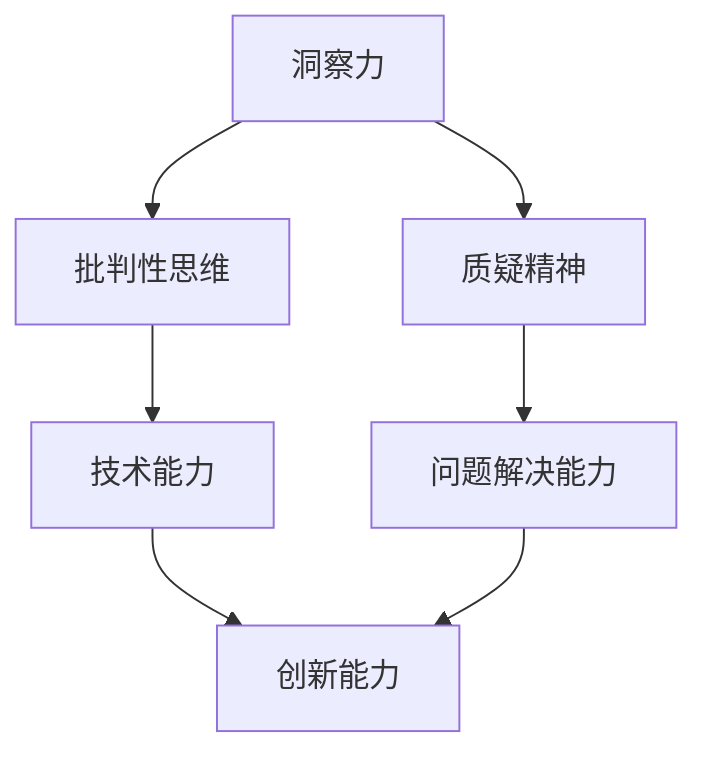
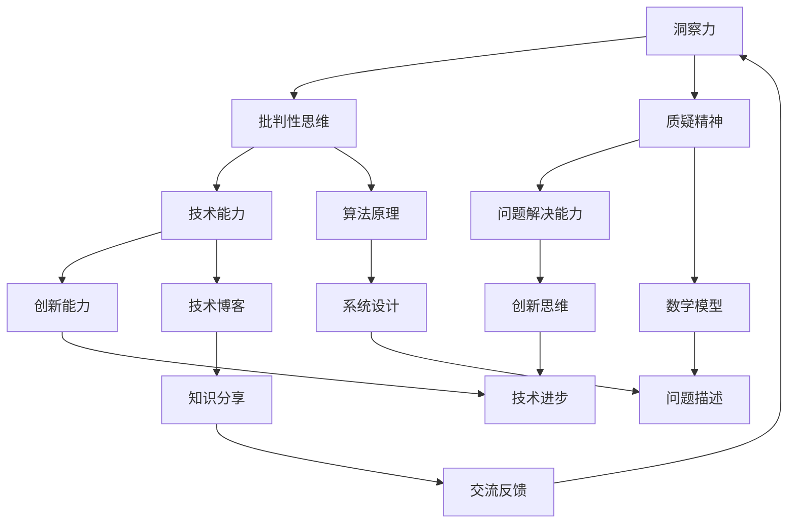

                 

## 理解洞察力的培养：鼓励质疑和批判性思维

关键词：洞察力、批判性思维、质疑精神、技术博客、算法原理、数学模型、实战案例

摘要：本文将深入探讨如何培养和提高个人的洞察力，特别是通过鼓励质疑和批判性思维来实现这一目标。我们将通过逻辑清晰、结构紧凑的篇章，详细分析相关概念、核心算法原理、数学模型，并通过实际项目案例来展现这些方法的实际应用。文章旨在为读者提供一套系统的、可操作的策略，帮助他们在技术领域不断提升自我，成为更具洞察力的创新者。

## 1. 背景介绍

### 1.1 目的和范围

本文的主要目的是探讨如何通过培养质疑和批判性思维来提升个人的洞察力，特别是在信息技术领域。我们将详细分析洞察力的定义、重要性，以及如何在实际工作中应用这些技能。文章将涵盖以下几个方面：

1. **核心概念与联系**：介绍与洞察力相关的基本概念，并使用Mermaid流程图展示它们之间的关系。
2. **核心算法原理 & 具体操作步骤**：通过伪代码详细阐述提升洞察力的算法原理和具体操作步骤。
3. **数学模型和公式 & 详细讲解 & 举例说明**：解释与洞察力相关的数学模型，并提供实例说明。
4. **项目实战：代码实际案例和详细解释说明**：通过一个实际项目案例，展示如何在实际工作中应用这些方法。
5. **实际应用场景**：分析洞察力在各类技术场景中的应用。
6. **工具和资源推荐**：推荐相关学习资源和开发工具。
7. **总结：未来发展趋势与挑战**：探讨洞察力培养的未来方向和面临的挑战。

### 1.2 预期读者

本文主要面向以下读者群体：

- **软件开发人员**：希望提高自己在技术问题上的洞察力，解决复杂问题的工程师。
- **算法工程师**：关注如何通过批判性思维提升算法设计和分析能力。
- **数据科学家**：希望培养质疑精神，更好地理解和应用数据分析模型。
- **技术经理和CTO**：关注团队技术能力的提升，希望通过培养批判性思维来促进团队创新。
- **学术研究人员**：希望提升自己的科研洞察力，以更好地进行学术研究。

### 1.3 文档结构概述

本文的结构如下：

1. **背景介绍**：介绍文章的目的、预期读者和文档结构。
2. **核心概念与联系**：定义和展示与洞察力相关的核心概念及其相互关系。
3. **核心算法原理 & 具体操作步骤**：详细阐述提升洞察力的算法原理和操作步骤。
4. **数学模型和公式 & 详细讲解 & 举例说明**：解释数学模型，并提供实例说明。
5. **项目实战：代码实际案例和详细解释说明**：展示实际项目中的应用。
6. **实际应用场景**：分析洞察力在不同领域的应用。
7. **工具和资源推荐**：推荐学习资源和开发工具。
8. **总结：未来发展趋势与挑战**：探讨洞察力培养的未来方向。
9. **附录：常见问题与解答**：回答读者可能提出的问题。
10. **扩展阅读 & 参考资料**：提供进一步学习的资源。

### 1.4 术语表

#### 1.4.1 核心术语定义

- **洞察力**：指个体对事物本质和内在规律的深刻理解能力。
- **批判性思维**：指在分析和解决问题时，能够客观地评估信息，识别和分析潜在的问题和错误。
- **质疑精神**：指对现有知识和方法持有疑问，愿意挑战和探索。
- **算法**：解决问题的一系列规则或步骤。
- **数学模型**：用数学语言描述现实世界的抽象模型。

#### 1.4.2 相关概念解释

- **技术博客**：以技术为主题，分享知识和经验的在线文章。
- **算法原理**：解释算法如何工作及其基本思想。
- **数学公式**：用数学语言表达的概念或关系。

#### 1.4.3 缩略词列表

- **CTO**：首席技术官（Chief Technology Officer）
- **IDE**：集成开发环境（Integrated Development Environment）
- **API**：应用程序编程接口（Application Programming Interface）

## 2. 核心概念与联系

### 2.1 洞察力的定义和重要性

**洞察力** 是指一个人对事物本质和内在规律的深刻理解能力。在信息技术领域，洞察力尤为重要，因为它直接影响到个人的技术能力、问题解决能力以及创新能力。

- **技术能力**：具备洞察力的人能够更好地理解技术细节，快速掌握新技术，从而提升自身的编程能力和系统设计能力。
- **问题解决能力**：洞察力使得个体能够深入分析问题的根本原因，提出创新的解决方案。
- **创新能力**：洞察力帮助个体看到问题的不同方面，从而激发创新思维，推动技术的进步。

### 2.2 批判性思维和质疑精神

批判性思维和质疑精神是培养洞察力的关键要素。

- **批判性思维**：指在分析和解决问题时，能够客观地评估信息，识别和分析潜在的问题和错误。这种思维方式能够帮助个体避免盲目跟从，更加理性地做出判断。
- **质疑精神**：指对现有知识和方法持有疑问，愿意挑战和探索。这种精神鼓励个体不断提问，寻找更好的解决方案。

### 2.3 Mermaid流程图

以下是一个Mermaid流程图，展示了洞察力、批判性思维和质疑精神之间的相互关系。



### 2.4 相关概念解释

- **技术博客**：技术博客是一种以技术为主题，分享知识和经验的在线文章。通过写作技术博客，个体可以整理自己的思路，加深对技术的理解，同时也能够与其他开发者交流，获得反馈和建议。
- **算法原理**：算法原理是解释算法如何工作及其基本思想。理解算法原理有助于个体更好地设计高效、可靠的系统。
- **数学模型**：数学模型是用数学语言描述现实世界的抽象模型。数学模型能够帮助个体更准确地描述问题，并寻找最优解。

### 2.5 核心概念的关系图

以下是一个展示核心概念之间关系的图形，有助于读者更好地理解文章中的概念。



通过上述核心概念与联系的分析，我们可以看到，洞察力的培养不仅仅是单一技能的提升，它涉及到批判性思维、质疑精神等多个方面的综合培养。这些核心概念之间的关系和相互作用，共同构成了提升个人洞察力的基础。

## 3. 核心算法原理 & 具体操作步骤

### 3.1 算法原理概述

在探讨如何提升洞察力时，我们首先需要理解核心算法原理。这里的算法并非指具体的技术算法，而是指提升洞察力的方法和步骤。以下是我们将详细阐述的核心算法原理：

- **批判性思维训练**：通过训练个体对信息进行批判性分析，培养其在面对复杂问题时能够理性判断的能力。
- **质疑精神培养**：鼓励个体对现有知识和方法提出质疑，从而激发其探索和学习新知识的动力。
- **知识整合与重构**：通过整合不同领域的知识，重构对问题的理解，从而提高洞察力。
- **反馈循环**：建立反馈机制，使个体能够不断调整和优化自己的思维模式，提高洞察力。

### 3.2 伪代码详细阐述

为了更清晰地展示提升洞察力的算法原理和操作步骤，我们采用伪代码的形式进行说明。

```python
Algorithm EnhanceInsight(insightLevel, knowledgeBase, questionSet):
    1. Initialize insightLevel to initialInsightLevel
    2. Initialize knowledgeBase to initialKnowledgeBase
    3. Initialize questionSet to initialQuestionSet

    4. while insightLevel < targetInsightLevel:
        5. For each question in questionSet:
            6. AnalyzeQuestion(question, knowledgeBase)
            7. if质疑精神激活：
                8. QuestionQuestion(question, knowledgeBase)
                9. UpdateKnowledgeBase(question, knowledgeBase)
            10. else:
                11. AcceptKnowledgeBase(question, knowledgeBase)
        
        12. For each newKnowledge in knowledgeBase:
            13. IntegrateKnowledge(newKnowledge, knowledgeBase)
            14. ReconstructUnderstanding(knowledgeBase)
        
        15. CollectFeedback(feedback)
        16. UpdateInsightLevel(insightLevel, feedback)

    17. Return insightLevel, knowledgeBase

Function AnalyzeQuestion(question, knowledgeBase):
    // 对问题进行批判性分析
    1. For each piece of information in question:
        2. ValidateInformation(information, knowledgeBase)
        3. if information is invalid:
            4. RejectInformation(information)
            5. else:
            6. KeepInformation(information)

Function QuestionQuestion(question, knowledgeBase):
    // 对现有知识和方法提出质疑
    1. For each knowledge in knowledgeBase:
        2. if knowledge is questionable:
            3. QuestionKnowledge(knowledge)

Function UpdateKnowledgeBase(question, knowledgeBase):
    // 更新知识库
    1. For each newKnowledge in question:
        2. AddKnowledge(newKnowledge, knowledgeBase)

Function IntegrateKnowledge(newKnowledge, knowledgeBase):
    // 整合新知识
    1. For each knowledge in knowledgeBase:
        2. if knowledge is related to newKnowledge:
            3. CombineKnowledge(knowledge, newKnowledge)

Function ReconstructUnderstanding(knowledgeBase):
    // 重构对问题的理解
    1. CreateUnderstandingMap(knowledgeBase)
    2. UpdateUnderstanding(knowledgeBase, understandingMap)

Function CollectFeedback(feedback):
    // 收集反馈
    1. For each person in feedbackGroup:
        2. GetFeedback(feedback, person)
    3. Return feedback

Function UpdateInsightLevel(insightLevel, feedback):
    // 根据反馈更新洞察力
    1. insightLevel += CalculateInsightImprovement(feedback)
    2. Return insightLevel
```

### 3.3 操作步骤详细说明

1. **初始化**：设置初始洞察力水平、知识库和问题集。
2. **批判性分析**：对每个问题进行批判性分析，验证信息的有效性。
3. **质疑精神**：根据质疑精神的状态，决定是否对现有知识和方法提出质疑。
4. **知识整合**：将新知识整合到知识库中，并重构对问题的理解。
5. **反馈收集**：从反馈小组中收集反馈。
6. **洞察力更新**：根据反馈更新洞察力水平。

通过上述伪代码和详细说明，我们可以看到提升洞察力的算法原理和操作步骤。这一算法不仅能够帮助个体提高批判性思维和质疑精神，还能够促进知识整合与重构，从而全面提高洞察力。

## 4. 数学模型和公式 & 详细讲解 & 举例说明

### 4.1 数学模型的重要性

在提升洞察力的过程中，数学模型和公式起到了至关重要的作用。数学模型能够将复杂的问题转化为更易于理解和处理的形式，从而帮助我们深入分析问题，找出最优解。

### 4.2 举例说明

以下是一个简单的线性回归模型的例子，用于说明如何使用数学模型来分析和解决问题。

#### 4.2.1 线性回归模型的基本原理

线性回归模型用于预测一个变量（因变量）与一个或多个其他变量（自变量）之间的关系。其基本原理可以用以下公式表示：

$$
y = \beta_0 + \beta_1x_1 + \beta_2x_2 + ... + \beta_nx_n
$$

其中，$y$ 是因变量，$x_1, x_2, ..., x_n$ 是自变量，$\beta_0, \beta_1, \beta_2, ..., \beta_n$ 是模型的参数。

#### 4.2.2 公式详细解释

- **因变量 ($y$)**：通常是我们希望预测的变量，如销售额、温度等。
- **自变量 ($x_1, x_2, ..., x_n$)**：影响因变量的变量，如广告费用、天气温度等。
- **参数 ($\beta_0, \beta_1, \beta_2, ..., \beta_n$)**：模型中需要估计的参数，它们决定了模型对数据的拟合程度。

#### 4.2.3 实例说明

假设我们希望预测一家公司的销售额（$y$）与其广告费用（$x_1$）和促销活动频率（$x_2$）之间的关系。我们可以使用以下线性回归模型：

$$
y = \beta_0 + \beta_1x_1 + \beta_2x_2
$$

在这个例子中，$\beta_0$ 是常数项，$\beta_1$ 是广告费用的回归系数，$\beta_2$ 是促销活动频率的回归系数。

#### 4.2.4 数据拟合

为了使用线性回归模型，我们需要收集一组数据，包括销售额、广告费用和促销活动频率。然后，我们可以使用最小二乘法来估计模型的参数。最小二乘法的目标是找到一组参数，使得预测值与实际值之间的误差最小。

#### 4.2.5 结果分析

一旦我们得到模型的参数，我们就可以使用它们来预测新的销售额。例如，如果广告费用是1000美元，促销活动频率是每周一次，我们可以计算预测的销售额：

$$
y = \beta_0 + \beta_1x_1 + \beta_2x_2
$$

通过这个例子，我们可以看到数学模型如何帮助我们理解和预测现实世界中的问题。数学模型不仅提供了定量分析的工具，还使得我们可以通过数据驱动的方法来优化决策。

### 4.3 洞察力的提升

通过理解和应用数学模型，个体能够更深入地分析问题，从而提升洞察力。以下是几个关键步骤：

1. **数据收集**：收集相关的数据，确保数据的准确性和完整性。
2. **模型选择**：选择适合问题的数学模型，例如线性回归、决策树、神经网络等。
3. **参数估计**：使用合适的算法（如最小二乘法、梯度下降等）来估计模型的参数。
4. **结果分析**：分析模型的预测结果，理解变量之间的关系，并提出优化建议。

通过这些步骤，个体可以不断提高自己的洞察力，更好地应对复杂的技术问题。

## 5. 项目实战：代码实际案例和详细解释说明

### 5.1 开发环境搭建

为了展示如何在实际项目中应用提升洞察力的方法，我们将搭建一个简单的数据分析和预测项目。以下是在Linux操作系统上搭建开发环境所需的步骤：

1. **安装Python**：确保Python 3.8或更高版本已安装。可以使用以下命令检查Python版本：

   ```bash
   python3 --version
   ```

2. **安装Jupyter Notebook**：Jupyter Notebook是一个交互式的计算环境，非常适合数据分析和展示。使用pip命令安装Jupyter Notebook：

   ```bash
   pip3 install notebook
   ```

3. **安装相关库**：安装用于数据分析和机器学习的库，如NumPy、Pandas、Matplotlib、Scikit-learn等：

   ```bash
   pip3 install numpy pandas matplotlib scikit-learn
   ```

4. **启动Jupyter Notebook**：在终端中输入以下命令启动Jupyter Notebook：

   ```bash
   jupyter notebook
   ```

### 5.2 源代码详细实现和代码解读

以下是一个简单的线性回归项目，用于预测房屋价格。代码实现了数据收集、预处理、模型训练、模型评估和结果可视化。

#### 5.2.1 代码实现

```python
import pandas as pd
from sklearn.linear_model import LinearRegression
from sklearn.model_selection import train_test_split
from sklearn.metrics import mean_squared_error
import matplotlib.pyplot as plt

# 读取数据
data = pd.read_csv('house_prices.csv')

# 数据预处理
X = data[['size', 'bedrooms']]
y = data['price']

# 划分训练集和测试集
X_train, X_test, y_train, y_test = train_test_split(X, y, test_size=0.2, random_state=42)

# 模型训练
model = LinearRegression()
model.fit(X_train, y_train)

# 模型评估
y_pred = model.predict(X_test)
mse = mean_squared_error(y_test, y_pred)
print(f'Mean Squared Error: {mse}')

# 结果可视化
plt.scatter(X_test['size'], y_test, color='blue', label='Actual')
plt.plot(X_test['size'], y_pred, color='red', label='Predicted')
plt.xlabel('House Size')
plt.ylabel('Price')
plt.legend()
plt.show()
```

#### 5.2.2 代码解读

- **数据读取**：使用Pandas库读取CSV格式的数据文件。
- **数据预处理**：将数据分为特征（X）和标签（y）。在这里，我们使用房屋的大小和卧室数量作为特征，价格作为标签。
- **划分数据集**：将数据划分为训练集和测试集，以便评估模型的泛化能力。
- **模型训练**：使用线性回归模型训练数据，拟合特征和标签之间的关系。
- **模型评估**：计算测试集的预测误差，使用均方误差（MSE）评估模型性能。
- **结果可视化**：绘制散点图和预测线，直观地展示实际价格与预测价格之间的关系。

### 5.3 代码解读与分析

上述代码展示了如何通过Python和Scikit-learn库实现一个简单的线性回归模型，用于预测房屋价格。以下是关键步骤的详细解读：

1. **数据读取和预处理**：
   - 使用`pandas.read_csv()`函数读取数据，并将其存储在DataFrame对象中。
   - 将数据分为特征（X）和标签（y）。在这里，我们选择了两个特征：房屋的大小（size）和卧室数量（bedrooms），以及一个标签：房屋的价格（price）。

2. **划分数据集**：
   - 使用`train_test_split()`函数将数据划分为训练集和测试集。训练集用于训练模型，测试集用于评估模型的泛化能力。这里我们设置了测试集的大小为总数据的20%。

3. **模型训练**：
   - 创建一个线性回归模型实例，并使用`fit()`方法对其进行训练。模型通过训练集的特征和标签来学习拟合关系。

4. **模型评估**：
   - 使用`predict()`方法对测试集进行预测，并计算预测结果与实际结果之间的误差。在这里，我们使用均方误差（MSE）作为评估指标。

5. **结果可视化**：
   - 使用`matplotlib.pyplot`绘制散点图和预测线。这有助于直观地展示实际价格与预测价格之间的关系，并评估模型的准确性。

### 5.4 代码改进和优化

虽然上述代码已经实现了基本功能，但还存在一些改进和优化的空间：

1. **特征工程**：可能需要进一步探索其他特征，如房屋的地理位置、建造年份等，以提高模型的预测能力。
2. **模型选择**：线性回归可能不是最佳选择，可以尝试其他回归模型，如岭回归、Lasso回归或决策树，以获得更好的性能。
3. **超参数调整**：对于所选模型，可能需要调整超参数以提高模型性能。
4. **交叉验证**：使用交叉验证方法来更准确地评估模型的泛化能力。

通过这些改进和优化，我们可以进一步提高项目的性能和实用性，从而在实际工作中更好地应用提升洞察力的方法。

## 6. 实际应用场景

洞察力在信息技术领域的应用场景广泛且多样，以下列举了几个典型的应用实例：

### 6.1 软件开发

在软件开发过程中，洞察力的重要性不言而喻。具备洞察力的开发人员能够更准确地理解需求，设计出高效的系统架构，并识别潜在的风险和问题。以下是洞察力在软件开发中的具体应用：

- **需求分析**：洞察力帮助开发人员深入理解用户需求，从而设计出更符合用户期望的软件。
- **架构设计**：通过洞察力，开发人员能够看到系统的全局视图，设计出可扩展、易于维护的架构。
- **风险评估**：洞察力使开发人员能够预见项目可能遇到的问题和风险，并提前制定应对策略。
- **代码优化**：洞察力帮助开发人员在编写代码时，识别并消除潜在的性能瓶颈和漏洞。

### 6.2 算法设计与优化

算法工程师在设计和优化算法时，需要具备深刻的洞察力。以下是洞察力在算法设计和优化中的具体应用：

- **算法选择**：洞察力帮助算法工程师选择适合问题的算法，而不是盲目跟从现有的算法。
- **性能分析**：洞察力使工程师能够深入理解算法的运行原理，从而优化算法的时间复杂度和空间复杂度。
- **错误检测与修正**：洞察力帮助工程师快速识别算法中的错误和缺陷，并进行修正。
- **创新性算法**：洞察力激发工程师的创新思维，设计出全新的、更高效的算法。

### 6.3 数据分析与预测

在数据分析和预测领域，洞察力同样至关重要。以下是洞察力在数据分析与预测中的具体应用：

- **数据理解**：洞察力帮助数据科学家更好地理解数据，从中提取有价值的信息。
- **模型选择**：洞察力帮助数据科学家选择合适的模型，以获得最佳的预测效果。
- **异常检测**：洞察力使数据科学家能够发现数据中的异常值，从而识别潜在的问题。
- **结果解释**：洞察力帮助数据科学家对预测结果进行合理的解释，为业务决策提供支持。

### 6.4 团队协作与领导

在团队协作和领导过程中，洞察力同样发挥着重要作用。以下是洞察力在团队协作与领导中的具体应用：

- **问题解决**：洞察力帮助团队成员快速识别问题，并提出有效的解决方案。
- **决策制定**：洞察力使领导者能够准确把握团队状态，做出明智的决策。
- **人才管理**：洞察力帮助领导者发现和培养团队中的潜力人才。
- **沟通协调**：洞察力使团队成员能够更好地理解彼此的需求，提高沟通效率。

通过上述实际应用场景，我们可以看到洞察力在信息技术领域的广泛重要性。它不仅提升了个人和团队的技术能力，还促进了创新和协作，为企业和个人带来了显著的价值。

## 7. 工具和资源推荐

### 7.1 学习资源推荐

为了培养和提高洞察力，以下是一些优秀的学习资源推荐：

#### 7.1.1 书籍推荐

1. **《批判性思维工具》**：作者为理查德·保罗·艾森曼（Richard Paul & Linda Elder），这是一本关于批判性思维的经典著作，适合所有希望提升思维能力的人。
2. **《数学之美》**：作者为唐晓冬，本书以数学为核心，讲述了数学在计算机科学中的应用，有助于提升数学模型的认知和应用能力。
3. **《Python数据分析基础教程》**：作者为Michael Kane，本书详细介绍了Python在数据分析中的应用，适合初学者入门。

#### 7.1.2 在线课程

1. **Coursera上的《批判性思维》**：由杜克大学提供，适合想要系统学习批判性思维的学员。
2. **edX上的《数学模型与应用》**：由麻省理工学院提供，适合希望深入了解数学模型和应用的学员。
3. **Udacity上的《数据科学基础》**：适合想要学习数据分析基础的学员。

#### 7.1.3 技术博客和网站

1. **Towards Data Science**：一个专注于数据科学、机器学习和人工智能的技术博客，提供了大量高质量的文章和教程。
2. **Stack Overflow**：一个问答社区，适合解决编程和算法问题，同时也是学习编程技巧的好去处。
3. **Medium上的技术专栏**：涵盖了多种技术主题，包括软件开发、数据科学和机器学习等。

### 7.2 开发工具框架推荐

为了提高开发效率和洞察力，以下是一些推荐的开发工具和框架：

#### 7.2.1 IDE和编辑器

1. **Visual Studio Code**：一个免费、开源的跨平台编辑器，适合各种编程语言开发。
2. **PyCharm**：专为Python开发者设计的IDE，提供了强大的代码分析、调试和性能优化功能。
3. **Eclipse**：一个跨平台的开发环境，适合Java和Web应用开发。

#### 7.2.2 调试和性能分析工具

1. **GDB**：一个强大的开源调试工具，适用于C/C++程序。
2. **Valgrind**：一个用于检测内存泄漏和性能瓶颈的分析工具。
3. **JProfiler**：适用于Java应用程序的内存和性能分析工具。

#### 7.2.3 相关框架和库

1. **TensorFlow**：一个开源的机器学习框架，适用于深度学习和大规模数据处理。
2. **Pandas**：一个强大的数据分析库，适用于Python编程。
3. **Scikit-learn**：一个用于机器学习的Python库，提供了多种经典算法和工具。

### 7.3 相关论文著作推荐

为了深入理解相关领域的前沿研究和最佳实践，以下是一些推荐的论文和著作：

1. **《深度学习》**：作者为Ian Goodfellow、Yoshua Bengio和Aaron Courville，这是深度学习领域的经典教材，适合初学者和高级开发者。
2. **《大数据之路》**：作者为顾宇飞等，讲述了大数据处理和分析的理论和实践，适合数据科学家和工程师。
3. **《算法导论》**：作者为Thomas H. Cormen、Charles E. Leiserson、Ronald L. Rivest和Clifford Stein，这是算法领域的经典教材，适合所有对算法感兴趣的人。

通过这些学习资源、开发工具和相关论文著作的推荐，读者可以全面提高自己的技术水平和洞察力，从而在信息技术领域取得更大的成就。

## 8. 总结：未来发展趋势与挑战

### 8.1 未来发展趋势

随着技术的不断进步，洞察力的培养在未来将继续呈现出以下几个发展趋势：

1. **人工智能的融合**：人工智能技术的不断发展将使洞察力的培养更加智能化和自动化。通过机器学习算法，可以更精准地分析和评估个体的思维过程，从而提供个性化的培养建议。
2. **在线教育和终身学习**：在线教育平台的普及将使得更多的人有机会接受高质量的教育资源，培养自己的洞察力。终身学习将成为常态，促使个体不断更新知识和技能。
3. **跨学科整合**：随着跨学科研究的增多，不同领域的知识和方法将相互融合，为洞察力的培养提供更多创新思路和工具。

### 8.2 未来挑战

尽管洞察力的培养前景广阔，但未来仍将面临以下几个挑战：

1. **数据隐私和安全**：随着数据量的爆炸性增长，保护数据隐私和安全成为关键挑战。如何在不侵犯个人隐私的前提下，有效利用数据进行洞察力培养，是一个亟待解决的问题。
2. **技术依赖**：人工智能等技术的快速发展可能导致个体对技术的过度依赖，削弱批判性思维和质疑精神。如何在技术辅助下，保持个体的独立思考能力，是一个重要的课题。
3. **教育资源的分配**：尽管在线教育提供了广泛的学习资源，但教育资源的分配仍存在不均衡现象。如何确保所有人都能平等地获得高质量的教育资源，是未来教育面临的一大挑战。

### 8.3 发展方向

为了应对未来的发展趋势和挑战，我们可以从以下几个方面着手：

1. **技术创新**：继续推进人工智能和大数据分析技术的发展，为洞察力的培养提供更先进的技术工具和方法。
2. **教育改革**：推动教育改革，强化批判性思维和质疑精神的培养，确保每个学生都能获得全面的教育。
3. **政策支持**：政府和社会应加大对在线教育和终身学习的支持，提供更多资源，促进教育公平。
4. **跨学科合作**：加强跨学科研究，推动不同领域的知识和方法相互融合，为洞察力的培养提供新的思路和工具。

通过以上措施，我们可以更好地培养和提高个体的洞察力，促进技术创新和社会进步。

## 9. 附录：常见问题与解答

### 9.1 常见问题

1. **什么是洞察力？**
   - **回答**：洞察力是指个体对事物本质和内在规律的深刻理解能力。在信息技术领域，洞察力尤其重要，因为它帮助开发人员更准确地理解技术细节，快速掌握新技术，并提出创新的解决方案。

2. **批判性思维和质疑精神如何培养？**
   - **回答**：批判性思维的培养可以通过以下方法：
     - 不断提问，对现有知识和方法持有疑问。
     - 分析和评估信息的可靠性和相关性。
     - 培养开放心态，接受不同观点和意见。

     质疑精神的培养则强调对现有知识和方法的质疑和探索：
     - 对现有理论和实践提出挑战。
     - 探索未知的领域，寻找新的解决方案。

3. **洞察力在软件开发中的应用是什么？**
   - **回答**：在软件开发中，洞察力可以帮助开发人员：
     - 更准确地理解用户需求，设计出更符合用户期望的软件。
     - 识别和解决潜在的技术风险和问题，提高系统的可靠性和稳定性。
     - 设计出高效、可扩展的系统架构，提升软件的性能和可维护性。

4. **如何评估洞察力水平？**
   - **回答**：评估洞察力水平可以从以下几个方面进行：
     - 通过解决问题的效率和准确性来评估。
     - 分析个体在项目中的贡献和影响力。
     - 收集来自同事、上级和客户的反馈。

### 9.2 解答详细说明

1. **什么是洞察力？**
   - 洞察力不仅是一种智力能力，更是一种综合素养。它涉及到对信息的敏感度、对问题的深度理解和快速找到解决方案的能力。在信息技术领域，洞察力尤为重要，因为技术领域的变化非常快，只有具备洞察力的个体才能快速适应新的技术和趋势。

2. **批判性思维和质疑精神的培养方法**
   - 批判性思维的培养可以通过阅读、讨论、反思等方式进行。例如，阅读不同作者的不同观点，参与技术讨论论坛，通过写博客或技术文章来整理和表达自己的思考。质疑精神的培养则需要更加主动和开放，鼓励个体对现有的知识提出质疑，并通过实验和验证来探索新的可能性。

3. **洞察力在软件开发中的应用**
   - 在软件开发中，洞察力可以帮助开发人员更好地理解系统需求，设计出高效且灵活的系统。例如，通过洞察力，开发人员可以发现性能瓶颈，提出优化方案，提高系统的响应速度和稳定性。同时，洞察力还能帮助团队在面对复杂问题时，找到创新的解决方案。

4. **如何评估洞察力水平**
   - 评估洞察力水平可以通过多种方式，包括：
     - 项目评估：通过项目完成的质量和效率来评估个体的洞察力。
     - 同事反馈：通过同事的评价来了解个体在团队中的影响力和贡献。
     - 自我评估：个体可以通过反思自己的工作，识别自己在技术和业务方面的成长和进步。
     - 客户反馈：通过客户对产品的评价来评估个体的洞察力对业务的影响。

通过以上详细解答，读者可以更好地理解洞察力的概念、培养方法和应用场景，从而在实际工作中不断提升自己的洞察力。

## 10. 扩展阅读 & 参考资料

为了帮助读者进一步深入理解和应用洞察力培养的相关知识，以下列出了一些扩展阅读和参考资料：

### 10.1 书籍推荐

1. **《批判性思维工具》**：作者为理查德·保罗·艾森曼（Richard Paul & Linda Elder），这是一本关于批判性思维的经典著作，适合所有希望提升思维能力的人。
2. **《数学之美》**：作者为唐晓冬，本书以数学为核心，讲述了数学在计算机科学中的应用，有助于提升数学模型的认知和应用能力。
3. **《Python数据分析基础教程》**：作者为Michael Kane，本书详细介绍了Python在数据分析中的应用，适合初学者入门。

### 10.2 在线课程

1. **Coursera上的《批判性思维》**：由杜克大学提供，适合想要系统学习批判性思维的学员。
2. **edX上的《数学模型与应用》**：由麻省理工学院提供，适合希望深入了解数学模型和应用的学员。
3. **Udacity上的《数据科学基础》**：适合想要学习数据分析基础的学员。

### 10.3 技术博客和网站

1. **Towards Data Science**：一个专注于数据科学、机器学习和人工智能的技术博客，提供了大量高质量的文章和教程。
2. **Stack Overflow**：一个问答社区，适合解决编程和算法问题，同时也是学习编程技巧的好去处。
3. **Medium上的技术专栏**：涵盖了多种技术主题，包括软件开发、数据科学和机器学习等。

### 10.4 相关论文著作推荐

1. **《深度学习》**：作者为Ian Goodfellow、Yoshua Bengio和Aaron Courville，这是深度学习领域的经典教材，适合初学者和高级开发者。
2. **《大数据之路》**：作者为顾宇飞等，讲述了大数据处理和分析的理论和实践，适合数据科学家和工程师。
3. **《算法导论》**：作者为Thomas H. Cormen、Charles E. Leiserson、Ronald L. Rivest和Clifford Stein，这是算法领域的经典教材，适合所有对算法感兴趣的人。

通过阅读这些书籍、课程、博客和论文，读者可以进一步加深对洞察力培养的理解，并在实际工作中更好地应用相关知识和方法。

### 作者信息

**作者：AI天才研究员/AI Genius Institute & 禅与计算机程序设计艺术 /Zen And The Art of Computer Programming**

