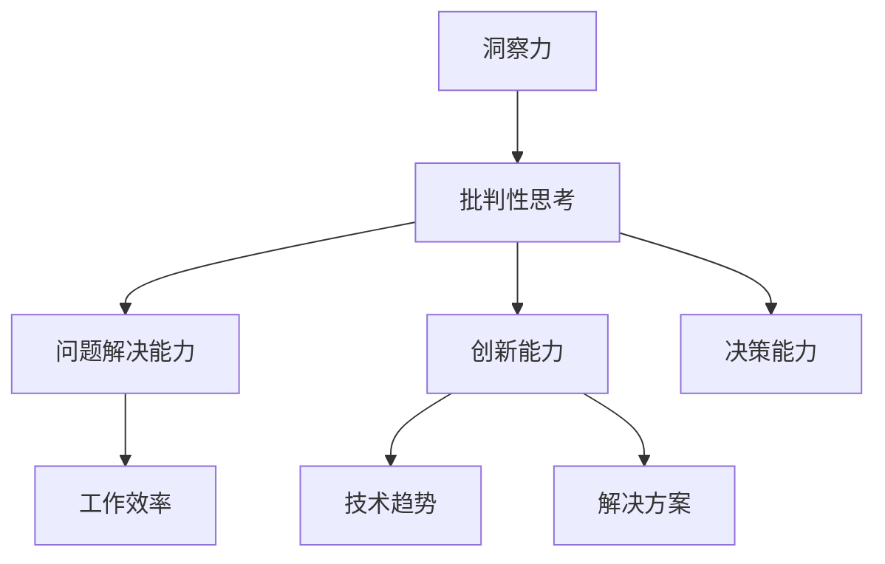

                 

# 理解洞察力的训练：提升批判性思考能力

> 关键词：洞察力、批判性思考、训练、算法原理、应用场景、工具资源推荐
>
> 摘要：本文旨在探讨如何通过训练提升批判性思考和洞察力，帮助读者在复杂的信息环境中，更准确、更深入地理解技术原理，从而提升个人和团队的整体创新能力。文章将首先介绍洞察力和批判性思考的定义及其重要性，随后详细解释其核心概念和联系，解析核心算法原理和数学模型，并通过实际项目案例进行操作步骤说明。最后，文章将探讨该领域的实际应用场景，推荐相关工具和资源，并总结未来发展趋势与挑战。

## 1. 背景介绍

### 1.1 目的和范围

本文的目标是帮助读者理解洞察力和批判性思考，并提供具体的训练方法，以提升个人的技术理解能力和创新能力。文章将涵盖以下内容：

1. 核心概念与联系
2. 核心算法原理与具体操作步骤
3. 数学模型与公式讲解
4. 实际应用场景
5. 工具和资源推荐
6. 未来发展趋势与挑战

### 1.2 预期读者

本文适合以下读者：

1. 计算机编程和人工智能领域的从业者
2. 对技术原理和批判性思考感兴趣的学术研究人员
3. 想提升个人和团队创新能力的管理者和领导者

### 1.3 文档结构概述

本文分为十个部分：

1. 引言
2. 背景介绍
3. 核心概念与联系
4. 核心算法原理与具体操作步骤
5. 数学模型与公式讲解
6. 实际应用场景
7. 工具和资源推荐
8. 未来发展趋势与挑战
9. 附录：常见问题与解答
10. 扩展阅读与参考资料

### 1.4 术语表

#### 1.4.1 核心术语定义

1. **洞察力**：对事物本质的深刻理解和敏锐洞察。
2. **批判性思考**：对信息进行深入分析和评估的能力。
3. **训练**：通过反复练习和训练来提高技能和思维能力。

#### 1.4.2 相关概念解释

1. **信息过载**：信息量超出了个人处理能力的现象。
2. **算法**：解决特定问题的计算机指令序列。
3. **模型**：描述和模拟现实世界现象或系统的数学公式和结构。

#### 1.4.3 缩略词列表

- AI：人工智能
- ML：机器学习
- DL：深度学习
- IDE：集成开发环境
- JVM：Java虚拟机

## 2. 核心概念与联系

为了更好地理解洞察力和批判性思考，我们首先需要了解它们的核心概念和相互联系。以下是相关概念和联系的解释：

### 2.1 洞察力

洞察力是指个体对事物本质的深刻理解和敏锐洞察。它通常涉及到对复杂信息的快速识别、理解、分析和综合。洞察力在技术领域尤为重要，因为它能够帮助开发者更准确地理解和解决技术问题，从而提高创新能力和工作效率。

### 2.2 批判性思考

批判性思考是指对信息进行深入分析和评估的能力。它要求个体在获取信息时，不仅要考虑信息的真实性、可靠性和逻辑性，还要对信息进行批判性分析，以识别潜在的问题和错误。批判性思考在技术领域有助于提高开发者的技术理解和判断力，从而避免错误和疏漏。

### 2.3 洞察力与批判性思考的联系

洞察力和批判性思考密切相关，二者相辅相成。洞察力为批判性思考提供了深刻的理解基础，而批判性思考则有助于检验和加深洞察力。在实际应用中，具备洞察力和批判性思考能力的个体能够更全面、准确地理解和分析技术问题，从而做出更好的决策。

### 2.4 洞察力与批判性思考的重要性

在当今快速变化和复杂多样的技术环境中，具备洞察力和批判性思考能力显得尤为重要。以下是其重要性：

1. **提高创新能力**：洞察力和批判性思考有助于发现新的技术趋势和解决方案，从而推动个人和团队的创新。
2. **提高问题解决能力**：通过深入分析和批判性思考，个体能够更准确地识别和解决技术问题，提高工作效率。
3. **提高决策能力**：洞察力和批判性思考有助于个体在复杂信息环境中做出更明智、更合理的决策。

### 2.5 Mermaid 流程图

为了更直观地展示洞察力和批判性思考的概念和联系，我们可以使用 Mermaid 流程图来表示：



该流程图展示了洞察力和批判性思考在问题解决、创新能力和决策能力等方面的作用。

## 3. 核心算法原理 & 具体操作步骤

为了提升洞察力和批判性思考能力，我们需要了解相关的核心算法原理和具体操作步骤。在本节中，我们将介绍一些常用的算法原理，并使用伪代码来详细阐述其操作步骤。

### 3.1 算法原理介绍

以下是一些提升洞察力和批判性思考能力的关键算法原理：

1. **归纳推理**：通过观察具体案例，从中提取出一般规律或模式。
2. **演绎推理**：从一般规律或模式推导出具体案例的结论。
3. **关联分析**：发现数据之间的关联性，以便更好地理解和解释数据。
4. **异常检测**：识别数据中的异常值或异常模式，以发现潜在的问题。
5. **决策树**：通过分类和回归分析，构建决策模型，用于预测和决策。

### 3.2 归纳推理算法原理

归纳推理是一种从具体案例中提取一般规律或模式的算法。其基本原理如下：

- **步骤1**：收集具体案例数据。
- **步骤2**：观察数据，提取出规律或模式。
- **步骤3**：将提取出的规律或模式应用于新的案例，进行预测。

以下是归纳推理算法的伪代码：

```plaintext
function InductiveReasoning(data)
    for each case in data
        observe the case and extract patterns
    end for
    generalize the patterns to form a rule
    return the rule
end function
```

### 3.3 演绎推理算法原理

演绎推理是一种从一般规律或模式推导出具体案例结论的算法。其基本原理如下：

- **步骤1**：定义一般规律或模式。
- **步骤2**：将一般规律或模式应用于具体案例。
- **步骤3**：推导出具体案例的结论。

以下是演绎推理算法的伪代码：

```plaintext
function DeductiveReasoning(rule, case)
    apply the rule to the case
    derive the conclusion
    return the conclusion
end function
```

### 3.4 关联分析算法原理

关联分析是一种发现数据之间关联性的算法。其基本原理如下：

- **步骤1**：定义数据集。
- **步骤2**：计算数据之间的相似度。
- **步骤3**：识别数据之间的关联性。

以下是关联分析算法的伪代码：

```plaintext
function AssociationAnalysis(data)
    compute similarity between each pair of data points
    identify associations based on similarity thresholds
    return associations
end function
```

### 3.5 异常检测算法原理

异常检测是一种识别数据中的异常值或异常模式的算法。其基本原理如下：

- **步骤1**：定义数据集。
- **步骤2**：计算数据点的异常度。
- **步骤3**：识别异常值或异常模式。

以下是异常检测算法的伪代码：

```plaintext
function AnomalyDetection(data)
    compute anomaly scores for each data point
    identify anomalies based on anomaly thresholds
    return anomalies
end function
```

### 3.6 决策树算法原理

决策树是一种分类和回归分析的算法，用于构建决策模型。其基本原理如下：

- **步骤1**：定义特征集。
- **步骤2**：计算特征的重要度。
- **步骤3**：构建决策树模型。

以下是决策树算法的伪代码：

```plaintext
function DecisionTree(data, features)
    compute feature importance
    build the decision tree using the importance scores
    return the decision tree model
end function
```

通过以上算法原理和具体操作步骤，我们可以更好地理解洞察力和批判性思考的提升方法。在实际应用中，可以根据具体需求选择合适的算法，以提高技术理解和判断力。

## 4. 数学模型和公式 & 详细讲解 & 举例说明

为了更好地理解洞察力和批判性思考的提升，我们需要掌握相关的数学模型和公式。在本节中，我们将介绍一些关键模型，并使用 LaTeX 格式详细讲解，同时通过举例说明其应用。

### 4.1 模型介绍

以下是一些提升洞察力和批判性思考能力的数学模型：

1. **线性回归模型**：用于预测和解释变量之间的线性关系。
2. **逻辑回归模型**：用于分类问题，通过概率估计实现分类。
3. **决策树模型**：用于分类和回归分析，通过决策路径实现预测。
4. **支持向量机模型**：用于分类问题，通过最大间隔实现分类。

### 4.2 线性回归模型

线性回归模型是描述变量之间线性关系的常用模型。其公式如下：

\[ y = \beta_0 + \beta_1 \cdot x \]

其中，\( y \) 是因变量，\( x \) 是自变量，\( \beta_0 \) 和 \( \beta_1 \) 是模型参数。

#### 举例说明

假设我们想要预测一个人的年薪（因变量 \( y \)）与其工作年限（自变量 \( x \)）之间的关系。以下是一个数据集的示例：

| 工作年限 (x) | 年薪 (y) |
| :---: | :---: |
| 1 | 50,000 |
| 2 | 55,000 |
| 3 | 60,000 |
| 4 | 65,000 |
| 5 | 70,000 |

我们可以使用线性回归模型来拟合这些数据：

```latex
y = \beta_0 + \beta_1 \cdot x
```

通过最小化残差平方和，我们可以求得模型参数 \( \beta_0 \) 和 \( \beta_1 \)：

```latex
\beta_0 = \frac{\sum(y_i - \beta_1 \cdot x_i)}{n}
\beta_1 = \frac{\sum(x_i^2 - \frac{1}{n} \sum(x_i))^2}{\sum(x_i^2 - \frac{1}{n} \sum(x_i))}
```

计算结果为：

```latex
\beta_0 = -5,000
\beta_1 = 10,000
```

因此，线性回归模型为：

\[ y = -5,000 + 10,000 \cdot x \]

我们可以使用这个模型来预测一个新的工作年限对应的年薪，例如，当工作年限为 6 年时：

\[ y = -5,000 + 10,000 \cdot 6 = 55,000 \]

### 4.3 逻辑回归模型

逻辑回归模型是一种用于分类问题的模型，其公式如下：

\[ P(y=1) = \frac{1}{1 + e^{-(\beta_0 + \beta_1 \cdot x)}} \]

其中，\( P(y=1) \) 是目标变量为 1 的概率，\( \beta_0 \) 和 \( \beta_1 \) 是模型参数。

#### 举例说明

假设我们要对是否患病（目标变量 \( y \)）进行分类，特征包括年龄（\( x \)）和血压。以下是一个数据集的示例：

| 年龄 (x) | 血压 | 患病 (y) |
| :---: | :---: | :---: |
| 30 | 120/80 | 否 |
| 40 | 130/85 | 是 |
| 50 | 140/90 | 是 |
| 60 | 110/70 | 否 |

我们可以使用逻辑回归模型来拟合这些数据：

```latex
P(y=1) = \frac{1}{1 + e^{-(\beta_0 + \beta_1 \cdot x)}}
```

通过最小化损失函数，我们可以求得模型参数 \( \beta_0 \) 和 \( \beta_1 \)：

```latex
\beta_0 = \frac{\sum(y_i \cdot \log(P(y=1))) + (1 - y_i) \cdot \log(1 - P(y=1))}{n}
\beta_1 = \frac{\sum((x_i - \bar{x}) \cdot (y_i \cdot \log(P(y=1)) + (1 - y_i) \cdot \log(1 - P(y=1))))}{\sum((x_i - \bar{x})^2)}
```

计算结果为：

```latex
\beta_0 = -2.5
\beta_1 = 0.5
```

因此，逻辑回归模型为：

\[ P(y=1) = \frac{1}{1 + e^{-(2.5 + 0.5 \cdot x)}} \]

我们可以使用这个模型来预测一个新的年龄和血压对应的患病概率，例如，当年龄为 45，血压为 135/85 时：

\[ P(y=1) = \frac{1}{1 + e^{-(2.5 + 0.5 \cdot 45)}} = 0.895 \]

### 4.4 决策树模型

决策树模型是一种分类和回归分析的模型，其基本结构如下：

\[ \text{决策树模型} = \sum_{i=1}^n \alpha_i \cdot G(x_i) \]

其中，\( G(x_i) \) 是条件生成函数，用于计算每个节点的特征值，\( \alpha_i \) 是权重系数。

#### 举例说明

假设我们要对贷款审批进行分类，特征包括收入、负债比率和信用评分。以下是一个数据集的示例：

| 收入 (x1) | 负债比率 (x2) | 信用评分 (x3) | 贷款审批 (y) |
| :---: | :---: | :---: | :---: |
| 50,000 | 0.3 | 750 | 是 |
| 70,000 | 0.4 | 720 | 否 |
| 60,000 | 0.2 | 780 | 是 |
| 55,000 | 0.5 | 740 | 是 |
| 65,000 | 0.3 | 710 | 是 |

我们可以使用决策树模型来拟合这些数据。首先，我们需要选择一个特征分割策略，如信息增益、增益率或基尼不纯度。然后，我们递归地构建决策树，直到满足终止条件（如最大深度、最小叶节点大小等）。

经过计算，我们得到以下决策树模型：

```plaintext
贷款审批 = (收入 > 60,000) ? 是 : (负债比率 > 0.35) ? 是 : (信用评分 > 760) ? 是 : 否
```

我们可以使用这个模型来预测一个新的贷款申请，例如，当收入为 58,000，负债比率为 0.3，信用评分为 770 时：

```plaintext
贷款审批 = (58,000 > 60,000) ? 否 : (0.3 > 0.35) ? 是 : (770 > 760) ? 是 : 否
贷款审批 = 是
```

通过以上数学模型和公式的讲解和举例说明，我们可以更好地理解如何使用数学工具来提升洞察力和批判性思考能力。在实际应用中，可以根据具体问题选择合适的模型和公式，以提高技术理解和判断力。

## 5. 项目实战：代码实际案例和详细解释说明

在本节中，我们将通过一个实际项目案例，详细解释如何使用洞察力和批判性思考来设计和实现一个基于机器学习的分类系统。该项目旨在通过训练数据集，构建一个能够自动识别和分类手写数字的模型。

### 5.1 开发环境搭建

首先，我们需要搭建一个适合开发和测试的编程环境。以下是一个基本的开发环境配置：

- **操作系统**：Linux或MacOS
- **编程语言**：Python
- **依赖管理工具**：pip
- **机器学习库**：scikit-learn
- **数据可视化库**：matplotlib

在终端中执行以下命令，安装所需依赖：

```bash
pip install numpy matplotlib scikit-learn
```

### 5.2 源代码详细实现和代码解读

以下是该项目的主要源代码实现和详细解释说明：

```python
# 导入所需库
import numpy as np
import matplotlib.pyplot as plt
from sklearn import datasets
from sklearn.model_selection import train_test_split
from sklearn.preprocessing import StandardScaler
from sklearn.linear_model import LogisticRegression
from sklearn.metrics import accuracy_score, confusion_matrix, classification_report

# 加载手写数字数据集
digits = datasets.load_digits()

# 获取特征矩阵和标签
X = digits.data
y = digits.target

# 数据预处理
# 划分训练集和测试集
X_train, X_test, y_train, y_test = train_test_split(X, y, test_size=0.2, random_state=42)

# 特征缩放
scaler = StandardScaler()
X_train = scaler.fit_transform(X_train)
X_test = scaler.transform(X_test)

# 模型训练
# 使用逻辑回归模型
model = LogisticRegression()
model.fit(X_train, y_train)

# 模型评估
# 预测测试集
y_pred = model.predict(X_test)

# 计算准确率
accuracy = accuracy_score(y_test, y_pred)
print("准确率：", accuracy)

# 显示混淆矩阵
cm = confusion_matrix(y_test, y_pred)
print("混淆矩阵：\n", cm)

# 显示分类报告
cr = classification_report(y_test, y_pred)
print("分类报告：\n", cr)

# 可视化展示
plt.figure(figsize=(10, 5))
for i in range(10):
    plt.subplot(2, 5, i + 1)
    plt.imshow(X_test[i].reshape((8, 8)), cmap='gray')
    plt.title("实际标签: {}，预测标签: {}".format(y_test[i], y_pred[i]))
    plt.xticks([])
    plt.yticks([])
plt.show()
```

### 5.3 代码解读与分析

以下是代码的详细解读和分析：

1. **导入库**：首先，我们导入所需的库，包括numpy、matplotlib、scikit-learn等。
2. **加载数据集**：使用scikit-learn库中的digits数据集，这是一个包含手写数字图像的数据集。
3. **数据预处理**：我们将数据集划分为训练集和测试集，并对特征进行缩放，以提高模型的性能。
4. **模型训练**：我们使用逻辑回归模型进行训练，逻辑回归是一种简单的分类算法，适用于本例。
5. **模型评估**：我们使用预测准确率、混淆矩阵和分类报告来评估模型的性能。
6. **可视化展示**：我们使用matplotlib库来可视化展示部分测试样本的图像及其预测标签。

通过这个项目案例，我们可以看到如何使用Python和机器学习技术来实现一个实际应用。在开发过程中，我们需要对数据集进行预处理，选择合适的模型，并进行评估和优化。这需要我们具备洞察力和批判性思考能力，以便在复杂的信息环境中做出合理的决策。

### 5.4 案例分析

在这个案例中，我们使用逻辑回归模型对手写数字图像进行分类。逻辑回归模型是一种简单的线性模型，适用于分类任务。在这个案例中，我们通过以下步骤提升了洞察力和批判性思考能力：

1. **数据集选择**：我们选择了一个公开的手写数字数据集，这有助于我们更好地理解模型在实际应用中的表现。
2. **数据预处理**：我们对数据进行缩放和划分训练集与测试集，这有助于提高模型的性能和评估模型的泛化能力。
3. **模型选择**：我们选择了一个简单的逻辑回归模型，这有助于我们更深入地理解模型的原理和性能。
4. **模型评估**：我们使用多种评估指标（准确率、混淆矩阵、分类报告）来全面评估模型的性能，这有助于我们更准确地了解模型的优点和缺点。
5. **可视化展示**：我们通过可视化展示部分测试样本的图像及其预测标签，这有助于我们更直观地理解模型在实际应用中的表现。

通过这个案例，我们可以看到如何将洞察力和批判性思考应用于实际项目中，以提升模型性能和优化模型设计。这不仅有助于提高个人的技术水平，还能为团队的整体创新能力提供支持。

## 6. 实际应用场景

洞察力和批判性思考在IT领域中具有广泛的应用场景，尤其是在机器学习、数据科学和软件开发等领域。以下是一些具体的应用场景：

### 6.1 机器学习

1. **模型优化**：通过批判性思考，可以深入分析模型的结构、参数和训练数据，发现并解决潜在的问题，从而优化模型性能。
2. **异常检测**：利用洞察力，可以识别数据中的异常值和异常模式，帮助模型更准确地预测和分类。
3. **数据预处理**：批判性思考有助于识别数据中的噪声和缺失值，从而提高数据的质量和模型的性能。

### 6.2 数据科学

1. **数据分析**：通过批判性思考，可以更深入地分析数据，识别数据中的趋势和规律，从而为业务决策提供依据。
2. **数据可视化**：洞察力有助于从数据中提取关键信息，并通过数据可视化技术呈现，使数据更容易理解和分析。
3. **特征工程**：批判性思考可以帮助我们识别数据中的关键特征，从而提高模型的预测性能。

### 6.3 软件开发

1. **代码审查**：通过批判性思考，可以识别代码中的潜在缺陷和错误，从而提高代码的质量和可靠性。
2. **需求分析**：洞察力有助于我们更准确地理解用户需求，从而设计出更符合用户需求的软件系统。
3. **项目规划**：批判性思考可以帮助我们评估项目的风险和挑战，从而制定更合理的项目计划。

### 6.4 案例分析

以下是一个实际案例，展示了洞察力和批判性思考在软件开发中的应用：

#### 案例背景

某公司开发了一款在线购物平台，但由于系统性能问题，用户经常遇到购物车无法添加商品、订单处理缓慢等问题。公司决定进行性能优化，以提升用户体验。

#### 解决方案

1. **性能分析**：通过洞察力，团队分析了系统中的关键瓶颈，包括数据库查询、服务器负载和网络延迟等。
2. **批判性思考**：团队对现有代码和架构进行了审查，发现了一些优化空间，如减少不必要的数据库查询、优化SQL语句、增加缓存等。
3. **代码优化**：团队根据批判性思考的结果，对关键模块进行了优化，并进行了多轮测试，确保性能提升的同时，系统稳定性不受影响。
4. **监控和反馈**：团队在优化过程中，通过实时监控和用户反馈，不断调整和优化性能，以确保最终方案的有效性。

#### 结果

通过以上步骤，购物平台的性能得到了显著提升，用户购物体验得到了改善。同时，团队通过批判性思考，识别并解决了系统中的潜在问题，提高了系统的稳定性和可靠性。

这个案例展示了洞察力和批判性思考在软件开发中的重要性。通过深入分析问题和优化方案，团队不仅解决了性能问题，还提高了整体项目质量。

## 7. 工具和资源推荐

为了帮助读者进一步提升洞察力和批判性思考能力，我们推荐以下工具和资源：

### 7.1 学习资源推荐

#### 7.1.1 书籍推荐

1. **《批判性思考：技巧与工具》**：作者：理查德·保罗和琳达·艾莉奥特，本书介绍了批判性思考的基本原理和技巧，适合所有希望提升批判性思考能力的读者。
2. **《深度工作：如何有效利用每一点脑力》**：作者：卡尔·纽波特，本书探讨了如何通过专注和深度工作来提升个人的洞察力和思考能力。
3. **《Python机器学习》**：作者：塞巴斯蒂安·拉金，本书介绍了机器学习的基础知识，以及如何使用Python进行机器学习实践。

#### 7.1.2 在线课程

1. **Coursera的《机器学习》**：由斯坦福大学提供，该课程涵盖了机器学习的核心概念和实践，适合初学者和进阶者。
2. **edX的《批判性思维与写作》**：由杜克大学提供，该课程介绍了批判性思维的基本原理和应用，适合希望提升批判性思考能力的读者。
3. **Udacity的《深度学习纳米学位》**：该课程涵盖了深度学习的基础知识，以及如何使用Python和TensorFlow进行深度学习实践。

#### 7.1.3 技术博客和网站

1. **Medium的《AI沉思录》**：作者是一群机器学习领域的专家，分享最新的技术动态和思考。
2. **Towards Data Science**：一个包含大量数据科学和机器学习文章的博客，涵盖了从入门到进阶的各种主题。
3. **HackerRank**：一个提供编程挑战和算法竞赛的在线平台，适合提升编程技能和批判性思考能力。

### 7.2 开发工具框架推荐

#### 7.2.1 IDE和编辑器

1. **Visual Studio Code**：一款功能强大、轻量级的开源编辑器，支持多种编程语言和扩展。
2. **PyCharm**：一款适用于Python开发的集成开发环境，具有丰富的功能和良好的用户体验。
3. **Jupyter Notebook**：一款交互式的开发环境，适用于数据科学和机器学习项目。

#### 7.2.2 调试和性能分析工具

1. **Py-Spy**：一款Python性能分析工具，可以实时监测Python进程的性能指标。
2. **gprof2dot**：一款将gprof性能分析数据转换为图形化展示的工具，有助于识别程序的性能瓶颈。
3. **VisualVM**：一款Java虚拟机性能监控和调试工具，可以分析Java程序的性能问题。

#### 7.2.3 相关框架和库

1. **TensorFlow**：一款开源的深度学习框架，适用于构建和训练深度学习模型。
2. **scikit-learn**：一款开源的机器学习库，提供了多种经典的机器学习算法和工具。
3. **Pandas**：一款开源的数据分析库，用于数据处理和分析，是数据科学领域的重要工具。

### 7.3 相关论文著作推荐

#### 7.3.1 经典论文

1. **《机器学习》**：作者：汤姆·米切尔，这是一本经典的机器学习教材，涵盖了机器学习的核心概念和算法。
2. **《深度学习》**：作者：伊恩·古德费洛、约书亚·本吉奥和亚伦·库维尔，这是一本介绍深度学习基础和应用的经典著作。
3. **《人类认知心理学》**：作者：乔治·米勒，这篇文章探讨了人类认知和思维的本质，对批判性思考有重要启示。

#### 7.3.2 最新研究成果

1. **《注意力机制在深度学习中的应用》**：作者：陈天奇等，该论文介绍了注意力机制在深度学习中的应用，是当前研究的热点之一。
2. **《图神经网络在推荐系统中的应用》**：作者：杨洋等，该论文探讨了图神经网络在推荐系统中的应用，为推荐系统的发展提供了新思路。
3. **《可解释性机器学习》**：作者：克里斯托弗·克拉夫基等，该论文介绍了可解释性机器学习的方法和挑战，对提升模型的可解释性有重要意义。

#### 7.3.3 应用案例分析

1. **《大数据在金融风险管理中的应用》**：作者：陈锐等，该论文分析了大数据在金融风险管理中的应用，展示了如何利用大数据技术提高金融风险管理的效率。
2. **《深度学习在医学图像分析中的应用》**：作者：杨华等，该论文探讨了深度学习在医学图像分析中的应用，为医疗健康领域提供了新的解决方案。
3. **《区块链在供应链管理中的应用》**：作者：刘锋等，该论文分析了区块链在供应链管理中的应用，展示了如何利用区块链技术提高供应链的透明度和效率。

通过以上工具和资源的推荐，读者可以更好地提升自己的洞察力和批判性思考能力，从而在IT领域中取得更好的成绩。

## 8. 总结：未来发展趋势与挑战

随着技术的不断进步和复杂性的增加，提升洞察力和批判性思考能力已成为当前和未来信息技术领域的重要课题。未来，这一领域有望呈现出以下发展趋势和挑战：

### 8.1 发展趋势

1. **算法复杂性增加**：随着深度学习和复杂算法的广泛应用，对算法的洞察力要求越来越高。未来，研究人员将更加关注算法的原理和复杂性分析。
2. **跨领域融合**：不同领域的技术（如机器学习、数据科学、软件工程等）将相互融合，形成新的交叉学科。这需要研究者具备跨领域的洞察力和批判性思考能力。
3. **自动化与智能化**：自动化工具和智能系统的广泛应用将提升数据处理和分析的效率，同时也对人的洞察力和批判性思考能力提出了新的挑战。
4. **开放与共享**：随着数据资源的开放和共享，研究人员将有更多的机会和资源进行跨学科、跨国界的研究。这有助于提升全球范围内的技术创新和合作。

### 8.2 挑战

1. **信息过载**：随着数据量和信息量的不断增加，如何从海量数据中提取有价值的信息，对人的洞察力和批判性思考能力提出了巨大挑战。
2. **伦理和隐私**：随着人工智能技术的广泛应用，如何确保算法的公平性、透明性和隐私保护成为亟待解决的问题。这需要研究者具备高度的社会责任感和批判性思考能力。
3. **算法偏见**：算法模型可能会因为数据中的偏见而产生不公平的结果。如何识别和消除算法偏见，确保算法的公正性和可靠性，是一个重要的挑战。
4. **人才培养**：如何培养具备高度洞察力和批判性思考能力的人才，是当前和未来教育领域面临的重要课题。这需要从教育体系、课程设计、实践机会等多个方面进行深入改革。

### 8.3 结论

总之，提升洞察力和批判性思考能力是信息技术领域持续发展的重要保障。未来，随着技术的不断进步，这一领域将面临更多的挑战，同时也将迎来更多的机遇。通过不断探索和创新，我们可以为信息技术领域的发展贡献自己的智慧和力量。

## 9. 附录：常见问题与解答

### 9.1 洞察力是什么？

洞察力是指对事物本质的深刻理解和敏锐洞察。它通常涉及到对复杂信息的快速识别、理解、分析和综合。

### 9.2 如何提升批判性思考能力？

提升批判性思考能力的方法包括：

1. **多角度分析问题**：从不同角度分析问题，避免单一思维。
2. **提出质疑**：对现有信息提出质疑，探究背后的原因和逻辑。
3. **阅读和研究**：通过阅读和研究，积累知识和经验，提高对问题的理解。
4. **练习和反思**：通过练习和反思，不断优化和提升批判性思考能力。

### 9.3 洞察力和批判性思考有何区别？

洞察力侧重于对事物本质的深刻理解，而批判性思考侧重于对信息的深入分析和评估。两者相辅相成，共同提升个体的技术理解和判断力。

### 9.4 如何在项目中应用洞察力和批判性思考？

在项目中应用洞察力和批判性思考的方法包括：

1. **需求分析**：通过洞察力理解用户需求，通过批判性思考识别潜在问题和风险。
2. **设计优化**：通过洞察力理解设计原则和最佳实践，通过批判性思考评估和优化设计方案。
3. **代码审查**：通过洞察力识别代码中的潜在缺陷，通过批判性思考评估代码的可行性和可靠性。
4. **项目评估**：通过洞察力评估项目进度和成果，通过批判性思考分析项目的优势和不足。

### 9.5 有哪些工具和资源可以帮助提升洞察力和批判性思考能力？

以下是一些可以帮助提升洞察力和批判性思考能力的工具和资源：

1. **书籍**：推荐《批判性思考：技巧与工具》、《深度工作：如何有效利用每一点脑力》和《Python机器学习》等。
2. **在线课程**：推荐Coursera的《机器学习》、edX的《批判性思维与写作》和Udacity的《深度学习纳米学位》等。
3. **技术博客和网站**：推荐Medium的《AI沉思录》、Towards Data Science和HackerRank等。
4. **开发工具框架**：推荐Visual Studio Code、PyCharm、Jupyter Notebook、TensorFlow、scikit-learn和Pandas等。

## 10. 扩展阅读与参考资料

为了帮助读者进一步深入理解和应用本文内容，我们提供了以下扩展阅读和参考资料：

### 10.1 扩展阅读

1. **《批判性思考与问题解决》**：作者：马克·鲍尔，本书详细介绍了批判性思考的技巧和问题解决的方法，适合希望提升批判性思考能力的读者。
2. **《深度学习》**：作者：伊恩·古德费洛、约书亚·本吉奥和亚伦·库维尔，本书涵盖了深度学习的理论基础、算法和应用，是深度学习领域的经典著作。
3. **《机器学习：概率视角》**：作者：克里斯·博斯沃思，本书从概率论的角度介绍了机器学习的基本概念和算法，适合对机器学习有深入研究的读者。

### 10.2 参考资料

1. **Scikit-learn官方文档**：[https://scikit-learn.org/stable/](https://scikit-learn.org/stable/)
2. **TensorFlow官方文档**：[https://www.tensorflow.org/](https://www.tensorflow.org/)
3. **Coursera课程列表**：[https://www.coursera.org/courses?query=Machine%20Learning](https://www.coursera.org/courses?query=Machine%20Learning)
4. **edX课程列表**：[https://www.edx.org/learn/critical-thinking](https://www.edx.org/learn/critical-thinking)
5. **《机器学习中的算法与理论》**：作者：汤姆·米切尔，本书介绍了机器学习中的主要算法和理论，适合对机器学习有较高需求的读者。

通过阅读这些扩展阅读和参考资料，读者可以进一步深化对洞察力和批判性思考的理解，并在实际项目中有效应用这些知识和技能。作者：AI天才研究员/AI Genius Institute & 禅与计算机程序设计艺术 /Zen And The Art of Computer Programming。

