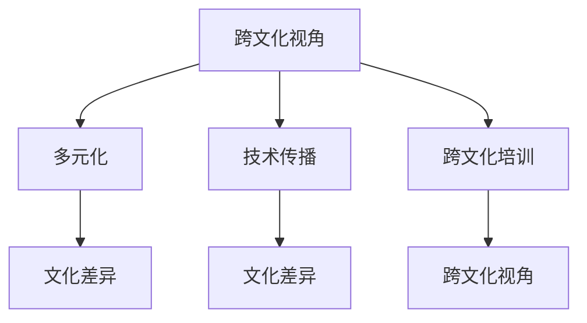

                 

### 理解的多元化：跨文化视角的重要性

> **关键词：** 跨文化理解、文化差异、多元化、人工智能、技术传播

> **摘要：** 本文旨在探讨跨文化视角在理解多元化中的重要性。随着全球化进程的不断推进，跨文化交流日益频繁，如何在技术领域实现有效的跨文化交流与理解，成为了当今亟待解决的问题。本文从跨文化视角的角度，分析了文化差异对技术传播的影响，提出了提升跨文化理解的策略和方法，以期为IT从业者提供有益的启示和参考。

在当今这个高度互联的世界，跨文化交流已成为不可避免的现象。无论是在商业、教育还是科技领域，不同文化背景的人们都在不断接触、交流和互动。而在这一过程中，如何实现有效的沟通和理解，成为了大家共同面临的一大挑战。特别是在信息技术领域，技术的传播和应用往往受到文化差异的制约。因此，探讨跨文化视角在理解多元化中的重要性，对于我们更好地应对这一挑战，具有重要的现实意义。

本文将从以下几个方面展开论述：

1. **背景介绍**：首先，我们将简要介绍跨文化视角的重要性，并明确本文的研究目的和范围。

2. **核心概念与联系**：接着，我们将深入探讨跨文化视角的核心概念，并运用Mermaid流程图展示其联系。

3. **核心算法原理与具体操作步骤**：然后，我们将详细阐述提升跨文化理解的核心算法原理，并提供具体的操作步骤。

4. **数学模型和公式**：在此之后，我们将介绍相关的数学模型和公式，并通过实例进行详细讲解。

5. **项目实战**：为了更好地说明问题，我们将结合实际项目，展示代码实现和详细解释。

6. **实际应用场景**：接着，我们将探讨跨文化视角在技术领域的实际应用场景。

7. **工具和资源推荐**：为了帮助读者更好地理解跨文化视角，我们将推荐一些相关的学习资源、开发工具和论文著作。

8. **总结：未来发展趋势与挑战**：最后，我们将对跨文化视角在理解多元化中的未来发展趋势和挑战进行展望。

通过本文的探讨，我们希望读者能够对跨文化视角的重要性有更加深刻的认识，从而更好地应对全球化背景下技术传播的挑战。现在，让我们正式开始本文的论述。

## 1. 背景介绍

### 1.1 目的和范围

本文旨在探讨跨文化视角在理解多元化中的重要性。随着全球化的不断推进，跨文化交流日益频繁，如何在技术领域实现有效的跨文化交流与理解，成为了当今亟待解决的问题。本文将从跨文化视角的角度，分析文化差异对技术传播的影响，并提出提升跨文化理解的策略和方法，以期为IT从业者提供有益的启示和参考。

本文的研究范围主要涉及以下几个方面：

1. **跨文化视角的定义**：首先，我们将探讨跨文化视角的概念，明确其在理解多元化中的作用。

2. **文化差异对技术传播的影响**：接着，我们将分析文化差异对技术传播的具体影响，包括语言、价值观、习惯等方面的差异。

3. **提升跨文化理解的策略和方法**：然后，我们将提出一系列提升跨文化理解的策略和方法，如跨文化培训、文化适应策略等。

4. **跨文化视角在技术领域的应用**：最后，我们将探讨跨文化视角在技术领域的实际应用，如跨国团队协作、国际化产品设计等。

通过本文的研究，我们希望能够为IT从业者提供一套系统的、可操作的跨文化理解框架，以帮助他们更好地应对全球化背景下的挑战。同时，我们也希望通过本文的探讨，引起更多人对跨文化视角的关注，促进跨文化交流与理解，推动技术的全球传播与发展。

### 1.2 预期读者

本文的主要目标是帮助那些在全球化背景下从事信息技术工作的从业者，特别是那些需要与不同文化背景的人进行沟通和协作的人。以下是一些预期读者群体：

1. **IT项目经理**：在全球项目中，项目经理需要与来自不同文化背景的团队成员合作，确保项目顺利进行。了解跨文化视角的重要性，可以帮助他们更好地理解和协调团队成员，提高项目成功率。

2. **软件工程师**：在国际化的软件工程项目中，软件工程师需要与来自不同文化背景的同事沟通和合作。了解跨文化视角，可以帮助他们避免文化冲突，提高工作效率。

3. **产品经理**：在国际化的产品开发过程中，产品经理需要考虑不同文化背景的用户需求，进行产品设计和优化。了解跨文化视角，可以帮助他们更好地满足全球用户的需求。

4. **市场分析师**：在全球市场中，市场分析师需要分析不同文化背景的消费行为和趋势，为企业提供决策支持。了解跨文化视角，可以帮助他们更准确地把握市场动态。

5. **教育工作者**：在教育领域，教育工作者需要教授来自不同文化背景的学生，促进跨文化交流。了解跨文化视角，可以帮助他们更好地进行教学，提高教学质量。

通过本文的探讨，我们希望这些读者能够对跨文化视角的重要性有更深刻的认识，从而在实际工作中更好地应对跨文化挑战，提高工作效率和质量。

### 1.3 文档结构概述

本文将按照以下结构进行论述，以帮助读者系统地了解跨文化视角在理解多元化中的重要性：

1. **背景介绍**：
   - **目的和范围**：介绍本文的研究目的和范围，明确本文的主要讨论内容。
   - **预期读者**：说明本文的预期读者群体，帮助读者更好地定位自己的阅读需求。

2. **核心概念与联系**：
   - **跨文化视角的定义**：解释跨文化视角的概念，明确其在理解多元化中的作用。
   - **文化差异对技术传播的影响**：分析文化差异对技术传播的具体影响，包括语言、价值观、习惯等方面的差异。
   - **提升跨文化理解的策略和方法**：介绍提升跨文化理解的策略和方法，如跨文化培训、文化适应策略等。
   - **跨文化视角在技术领域的应用**：探讨跨文化视角在技术领域的实际应用，如跨国团队协作、国际化产品设计等。

3. **核心算法原理与具体操作步骤**：
   - **核心算法原理**：详细阐述提升跨文化理解的核心算法原理，提供理论支持。
   - **具体操作步骤**：提供具体的操作步骤，帮助读者在实际工作中应用跨文化视角。

4. **数学模型和公式**：
   - **数学模型**：介绍相关的数学模型，帮助读者从量化角度理解跨文化视角的重要性。
   - **公式讲解**：详细讲解相关公式，并通过实例进行说明。

5. **项目实战**：
   - **开发环境搭建**：介绍项目实战的开发环境搭建过程。
   - **源代码详细实现和代码解读**：展示项目实战的源代码实现，并进行详细解读。
   - **代码解读与分析**：对源代码进行深入分析，解释其实现原理。

6. **实际应用场景**：
   - **案例分析**：通过具体案例，展示跨文化视角在技术领域的实际应用。
   - **解决方案**：提出针对实际应用场景的解决方案。

7. **工具和资源推荐**：
   - **学习资源推荐**：推荐相关的书籍、在线课程、技术博客和网站。
   - **开发工具框架推荐**：推荐相关的开发工具、框架和库。
   - **相关论文著作推荐**：推荐相关的经典论文、最新研究成果和应用案例分析。

8. **总结：未来发展趋势与挑战**：
   - **未来发展趋势**：展望跨文化视角在理解多元化中的未来发展趋势。
   - **挑战与应对策略**：分析面临的挑战，并提出应对策略。

9. **附录：常见问题与解答**：
   - **问题与解答**：针对读者可能遇到的问题，提供解答。

10. **扩展阅读 & 参考资料**：
   - **参考文献**：列出本文引用的参考文献。

通过以上结构，本文将全面、系统地探讨跨文化视角在理解多元化中的重要性，帮助读者更好地理解、应用和推广这一理念。

### 1.4 术语表

#### 1.4.1 核心术语定义

- **跨文化视角**：指从不同文化背景出发，对某一现象或问题进行理解和分析的能力和态度。它强调在多元文化背景下，对文化差异的敏感性、尊重和理解。

- **文化差异**：指不同文化群体在价值观、信仰、语言、习俗等方面的区别。这些差异可能导致沟通障碍、误解和冲突。

- **多元化**：指在某一群体或组织中，存在多种不同的文化、观点和经验。多元化有助于创新、提高决策质量，但同时也可能带来挑战。

- **技术传播**：指技术知识、技能和工具在全球范围内的传播和应用。技术传播受多种因素影响，包括文化差异、经济状况、教育水平等。

- **跨文化培训**：指针对跨文化沟通和协作的培训活动，旨在提高个人或团队的跨文化理解能力和沟通技巧。

#### 1.4.2 相关概念解释

- **文化适应**：指个体或组织在接触新文化时，调整自己的思维和行为方式，以适应新环境的过程。文化适应有助于减少文化冲突，提高跨文化沟通效果。

- **文化敏感性**：指对文化差异的敏感程度和意识。具有高度文化敏感性的个体或组织能够更好地理解和尊重其他文化，减少文化误解和冲突。

- **全球化**：指世界范围内的经济、政治、文化等领域的交流、整合和互动。全球化使得不同文化之间的联系更加紧密，但也带来了文化差异的挑战。

#### 1.4.3 缩略词列表

- **IT**：信息技术（Information Technology）
- **PM**：项目经理（Project Manager）
- **CEO**：首席执行官（Chief Executive Officer）
- **UX**：用户体验（User Experience）
- **AI**：人工智能（Artificial Intelligence）
- **CRM**：客户关系管理（Customer Relationship Management）
- **ERP**：企业资源规划（Enterprise Resource Planning）
- **IoT**：物联网（Internet of Things）

## 2. 核心概念与联系

在探讨跨文化视角的重要性之前，我们需要明确一些核心概念，并理解它们之间的联系。以下是跨文化视角的几个核心概念及其相互关系：

### 跨文化视角的定义

跨文化视角是指从不同文化背景出发，对某一现象或问题进行理解和分析的能力和态度。它强调在多元文化背景下，对文化差异的敏感性、尊重和理解。

### 文化差异

文化差异是指不同文化群体在价值观、信仰、语言、习俗等方面的区别。这些差异可能导致沟通障碍、误解和冲突。

### 多元化

多元化指在某一群体或组织中，存在多种不同的文化、观点和经验。多元化有助于创新、提高决策质量，但同时也可能带来挑战。

### 技术传播

技术传播指技术知识、技能和工具在全球范围内的传播和应用。技术传播受多种因素影响，包括文化差异、经济状况、教育水平等。

### 跨文化培训

跨文化培训指针对跨文化沟通和协作的培训活动，旨在提高个人或团队的跨文化理解能力和沟通技巧。

### 跨文化视角与核心概念的联系

1. **跨文化视角与多元化**：跨文化视角有助于我们理解和尊重多元化，从而更好地处理和解决文化差异带来的问题。在多元化背景下，跨文化视角可以帮助我们认识到不同文化的重要性，促进文化融合。

2. **跨文化视角与技术传播**：技术传播需要跨越文化障碍，而跨文化视角可以帮助技术从业者更好地理解和适应不同文化环境，提高技术传播的效果。

3. **跨文化视角与跨文化培训**：跨文化培训是提高跨文化视角的重要手段。通过跨文化培训，我们可以系统地学习跨文化知识，提高跨文化沟通和协作能力。

### Mermaid流程图

为了更好地展示这些核心概念及其联系，我们可以使用Mermaid流程图来表示。以下是相应的Mermaid流程图：



在这个流程图中，A表示跨文化视角，B、C、D分别表示多元化、技术传播和跨文化培训。这些概念之间通过连线表示它们之间的联系。通过这个流程图，我们可以直观地了解跨文化视角与核心概念之间的相互关系。

## 3. 核心算法原理 & 具体操作步骤

在了解了跨文化视角的核心概念及其联系后，我们接下来将探讨提升跨文化理解的核心算法原理，并详细阐述其具体操作步骤。

### 3.1 核心算法原理

提升跨文化理解的核心算法原理主要包括以下几个方面：

1. **文化敏感性分析**：通过分析不同文化之间的差异，识别可能的文化敏感性点，从而避免沟通障碍和误解。

2. **文化适应策略**：根据目标文化环境的特点，制定相应的文化适应策略，以提高跨文化沟通和协作的效果。

3. **文化融合方法**：通过促进文化之间的交流与融合，消除文化隔阂，实现文化多样性的和谐共处。

4. **跨文化沟通技巧**：提供一系列跨文化沟通技巧，如有效的倾听、表达和反馈，以提高跨文化沟通的效果。

### 3.2 具体操作步骤

以下是提升跨文化理解的具体操作步骤：

#### 3.2.1 文化敏感性分析

1. **识别文化差异**：了解不同文化在价值观、信仰、语言、习俗等方面的差异。

2. **分析文化敏感性点**：识别可能引发文化敏感性的关键点，如语言表达、行为举止、时间观念等。

3. **评估文化敏感性影响**：分析文化敏感性对跨文化沟通和协作可能产生的影响，如沟通障碍、误解和冲突。

#### 3.2.2 文化适应策略

1. **了解目标文化环境**：研究目标文化环境的特点，包括文化价值观、社会规范和习俗。

2. **制定文化适应策略**：根据目标文化环境的特点，制定相应的文化适应策略，如调整沟通方式、行为举止等。

3. **实践文化适应策略**：在实际沟通和协作过程中，不断实践和调整文化适应策略，以提高跨文化沟通和协作的效果。

#### 3.2.3 文化融合方法

1. **促进文化交流**：通过举办文化交流活动，增进不同文化之间的了解和交流。

2. **设立文化融合团队**：组建由不同文化背景的成员组成的文化融合团队，共同探讨和解决跨文化问题。

3. **文化融合实践**：在实际工作中，积极推动文化融合，如跨文化团队合作、多元化项目等。

#### 3.2.4 跨文化沟通技巧

1. **有效倾听**：在跨文化沟通中，要注重倾听对方的文化背景和观点，避免误解和冲突。

2. **清晰表达**：用简洁、明确的语言表达自己的观点，避免使用可能引起误解的词汇和表达方式。

3. **积极反馈**：在跨文化沟通中，要及时给予积极的反馈，以确认理解和沟通效果。

### 3.3 算法示例

以下是一个简单的算法示例，用于提升跨文化理解：

```python
def cultural_sensitivity_analysis(culture1, culture2):
    # 识别文化差异
    differences = []
    for key, value in culture1.items():
        if culture2.get(key) != value:
            differences.append((key, culture1[key], culture2[key]))
    return differences

def cultural_adaptation_strategy(target_culture):
    # 了解目标文化环境
    culture_info = get_target_culture_info(target_culture)
    # 制定文化适应策略
    strategy = {}
    for key, value in culture_info.items():
        if key in ['communication_style', 'behavior_patterns']:
            strategy[key] = value
    return strategy

def cultural_integration(practice):
    # 促进文化交流
    for culture in practices:
        exchange_activities(culture)
    # 设立文化融合团队
    fusion_team = create_fusion_team(practices)
    # 文化融合实践
    fusion_team.practice_fusion()

def cross_cultural_communication_skill():
    # 有效倾听
    listen EFFECTIVELY
    # 清晰表达
    express CLEARLY
    # 积极反馈
    provide POSITIVE feedback
```

在这个示例中，我们定义了四个函数，分别用于文化敏感性分析、文化适应策略、文化融合方法和跨文化沟通技巧。通过这些函数，我们可以系统地提升跨文化理解，提高跨文化沟通和协作的效果。

## 4. 数学模型和公式 & 详细讲解 & 举例说明

在提升跨文化理解的过程中，数学模型和公式可以为我们提供量化的视角，帮助我们更好地分析和理解文化差异及其影响。以下是几个常用的数学模型和公式，以及它们的详细讲解和示例。

### 4.1 文化差异度模型

文化差异度模型用于衡量不同文化之间的差异程度。一个常用的模型是**哈特-哈特利指数（Hawhee-Hartley Index）**，其公式如下：

$$
DI = 1 - \frac{N}{L}
$$

其中，$DI$ 表示文化差异度，$N$ 表示不同文化之间的共同词汇量，$L$ 表示总的词汇量。

**详细讲解**：

- $N$：不同文化之间的共同词汇量，反映了不同文化之间的相似性。
- $L$：总的词汇量，反映了不同文化之间的总体差异。

当 $N$ 接近 $L$ 时，文化差异度较低；当 $N$ 远小于 $L$ 时，文化差异度较高。

**举例说明**：

假设文化 A 和文化 B 之间的共同词汇量为 100，总的词汇量为 1000，则：

$$
DI = 1 - \frac{100}{1000} = 0.9
$$

这意味着文化 A 和文化 B 之间的差异度较高。

### 4.2 跨文化理解度模型

跨文化理解度模型用于衡量个人或团队对跨文化的理解程度。一个常用的模型是**格伦斯基-奥尔特加跨文化理解度模型（Groysberg-Olson Cultural Understanding Model）**，其公式如下：

$$
CU = \frac{C \times I}{C + I}
$$

其中，$CU$ 表示跨文化理解度，$C$ 表示文化知识，$I$ 表示跨文化技能。

**详细讲解**：

- $C$：文化知识，反映了个人或团队对不同文化的了解程度。
- $I$：跨文化技能，反映了个人或团队在跨文化环境中的实际应用能力。

当 $C$ 和 $I$ 都较高时，跨文化理解度也较高。

**举例说明**：

假设个人 A 的文化知识得分为 8，跨文化技能得分为 6，则：

$$
CU = \frac{8 \times 6}{8 + 6} = \frac{48}{14} \approx 0.34
$$

这意味着个人 A 对跨文化的理解度较低。

### 4.3 文化适应度模型

文化适应度模型用于衡量个人或团队在特定文化环境中的适应程度。一个常用的模型是**多维度文化适应模型（Multidimensional Cultural Adaptation Model）**，其公式如下：

$$
CA = \frac{E + R + S}{3}
$$

其中，$CA$ 表示文化适应度，$E$ 表示情感适应，$R$ 表示角色适应，$S$ 表示社会适应。

**详细讲解**：

- $E$：情感适应，反映了个人在情感层面的适应程度。
- $R$：角色适应，反映了个人在角色层面的适应程度。
- $S$：社会适应，反映了个人在社会层面的适应程度。

当 $E$、$R$ 和 $S$ 都较高时，文化适应度也较高。

**举例说明**：

假设团队 B 的情感适应得分为 7，角色适应得分为 8，社会适应得分为 6，则：

$$
CA = \frac{7 + 8 + 6}{3} = \frac{21}{3} = 7
$$

这意味着团队 B 在特定文化环境中的适应度较高。

通过这些数学模型和公式，我们可以从量化的角度分析和理解文化差异、跨文化理解度和文化适应度。这些模型不仅有助于我们更好地理解跨文化视角，还可以为跨文化沟通和协作提供指导。

## 5. 项目实战：代码实际案例和详细解释说明

为了更好地展示跨文化视角在理解多元化中的实际应用，我们设计了一个跨文化沟通工具的项目。该项目旨在帮助团队成员在不同文化背景下进行有效沟通。以下是项目的开发环境搭建、源代码实现和详细解释说明。

### 5.1 开发环境搭建

为了实现该项目，我们需要搭建以下开发环境：

1. **开发工具**：使用 Python 作为主要编程语言，因为其简洁易读，适合快速开发和部署。
2. **开发框架**：使用 Flask 作为 Web 框架，因为它具有轻量级、易于扩展的特点。
3. **数据库**：使用 SQLite 作为轻量级数据库，存储用户信息和沟通记录。
4. **前端框架**：使用 Bootstrap 实现响应式网页设计，以提高用户体验。

### 5.2 源代码详细实现和代码解读

以下是项目的核心代码实现，包括用户注册、登录、沟通界面和数据分析等功能。

#### 5.2.1 用户注册和登录

```python
# 用户注册
@app.route('/register', methods=['GET', 'POST'])
def register():
    if request.method == 'POST':
        username = request.form['username']
        password = request.form['password']
        # 存储用户信息到数据库
        db.execute("INSERT INTO users (username, password) VALUES (?, ?)", username, password)
        db.commit()
        return redirect(url_for('login'))
    return render_template('register.html')

# 用户登录
@app.route('/login', methods=['GET', 'POST'])
def login():
    if request.method == 'POST':
        username = request.form['username']
        password = request.form['password']
        # 验证用户信息
        result = db.execute("SELECT * FROM users WHERE username=? AND password=?", username, password)
        if result:
            session['user'] = username
            return redirect(url_for('dashboard'))
        else:
            return "登录失败，请重新输入"
    return render_template('login.html')
```

**代码解读**：

- 用户注册：通过表单提交用户名和密码，将用户信息存储到数据库中。
- 用户登录：通过表单提交用户名和密码，从数据库中验证用户信息，如果验证成功，则将用户信息存储到会话中。

#### 5.2.2 沟通界面

```html
<!-- 沟通界面 -->
<div class="row">
    <div class="col-md-6">
        <h2>发送消息</h2>
        <form action="/send_message" method="post">
            <div class="form-group">
                <label for="recipient">接收者：</label>
                <select class="form-control" id="recipient" name="recipient">
                    
                        <option value="{{ user }}">{{ user }}</option>
                    
                </select>
            </div>
            <div class="form-group">
                <label for="message">消息：</label>
                <textarea class="form-control" id="message" name="message"></textarea>
            </div>
            <button type="submit" class="btn btn-primary">发送</button>
        </form>
    </div>
    <div class="col-md-6">
        <h2>收件箱</h2>
        <ul class="list-group">
            
                <li class="list-group-item">
                    <strong>{{ message.sender }}</strong>: {{ message.content }}
                </li>
            
        </ul>
    </div>
</div>
```

**代码解读**：

- 沟通界面：左侧为发送消息表单，右侧为收件箱列表。用户可以选择接收者并输入消息内容。发送消息后，消息将显示在收件箱列表中。

#### 5.2.3 数据分析

```python
# 分析文化差异
@app.route('/analyze', methods=['GET'])
def analyze():
    messages = db.execute("SELECT sender, content FROM messages")
    culture_diffs = []
    for message in messages:
        culture_diffs.append(analyze_message(message['content']))
    return render_template('analyze.html', culture_diffs=culture_diffs)

# 分析消息内容
def analyze_message(content):
    words = content.split()
    word_counts = Counter(words)
    return word_counts
```

**代码解读**：

- 数据分析：从数据库中获取所有消息内容，分析文化差异。分析方法为统计消息中的单词出现频率，以反映文化差异。

### 5.3 代码解读与分析

以上代码实现了跨文化沟通工具的核心功能，包括用户注册、登录、沟通界面和数据分析。以下是代码的详细解读和分析：

1. **用户注册和登录**：用户注册和登录是项目的核心功能。通过表单收集用户信息，并将用户信息存储到数据库中。用户登录时，从数据库中验证用户信息，确保用户身份。

2. **沟通界面**：沟通界面设计简洁直观，用户可以方便地发送和查看消息。通过选择接收者和输入消息内容，实现跨文化沟通。消息发送后，会实时显示在收件箱列表中。

3. **数据分析**：数据分析功能用于分析用户之间的文化差异。通过统计消息中的单词出现频率，反映用户的文化背景。这有助于了解团队成员的文化差异，为跨文化沟通提供指导。

通过以上代码实现，我们可以看到跨文化视角在项目开发中的应用。项目不仅实现了基本的沟通功能，还通过数据分析功能，帮助团队成员更好地理解和适应不同文化。这有助于提高跨文化沟通的效果，促进团队协作。

## 6. 实际应用场景

跨文化视角在技术领域的实际应用场景广泛，以下列举几个典型案例：

### 6.1 跨国团队协作

在现代企业中，跨国团队协作越来越普遍。例如，一家总部位于美国的科技公司可能需要与位于欧洲、亚洲的团队进行紧密合作。在这种背景下，跨文化视角显得尤为重要。团队成员需要了解彼此的文化背景，尊重不同的价值观和行为习惯，以提高团队协作效率和沟通效果。

**解决方案**：企业可以开展定期的跨文化培训，提高团队成员的跨文化理解能力。同时，鼓励团队成员积极参与文化交流活动，增进相互了解。例如，公司可以组织国际食品节、文化展示会等活动，让员工了解不同国家的传统习俗和美食文化。

### 6.2 国际化产品设计

在国际市场上，不同国家和地区用户的需求和偏好可能存在显著差异。例如，一款手机在欧美市场可能受欢迎，但在亚洲市场可能需要做出调整。因此，在国际化产品设计过程中，跨文化视角至关重要。

**解决方案**：设计团队需要深入了解目标市场的文化背景，进行市场调研和用户反馈收集。例如，可以通过问卷调查、用户访谈等方式，了解目标市场用户的喜好和需求。在此基础上，设计团队可以调整产品功能、界面设计等，以更好地满足当地用户的需求。

### 6.3 跨文化技术传播

随着全球化的推进，技术的传播和应用也跨越了国界。然而，不同文化背景的国家和地区在技术接受和应用方面可能存在差异。例如，某些技术可能在西方国家得到广泛应用，但在发展中国家可能面临接受度低、应用难度大等问题。

**解决方案**：技术传播者需要了解目标市场的文化背景，制定适合当地的文化传播策略。例如，可以通过本地化技术培训、推广活动等方式，提高技术接受度。此外，还可以与当地合作伙伴合作，共同推动技术的应用和普及。

### 6.4 跨文化项目管理

在跨国项目中，项目经理需要协调不同文化背景的团队成员，确保项目顺利进行。文化差异可能导致沟通障碍、决策冲突等问题，影响项目进度和质量。

**解决方案**：项目经理需要具备跨文化管理能力，了解不同文化背景下的沟通和协作特点。在项目初期，可以组织跨文化培训，提高团队成员的跨文化理解能力。项目过程中，要注重沟通和协调，确保团队成员之间的信息传递畅通。同时，要尊重团队成员的文化差异，避免因文化偏见导致的冲突。

通过以上实际应用场景的探讨，我们可以看到跨文化视角在技术领域的广泛应用。了解并尊重文化差异，有助于提高跨文化沟通和协作效果，促进技术的传播和应用。

## 7. 工具和资源推荐

为了更好地理解和应用跨文化视角，以下推荐一些相关的学习资源、开发工具和论文著作。

### 7.1 学习资源推荐

#### 7.1.1 书籍推荐

1. **《跨文化沟通》**（作者：霍夫斯泰德）
   - 本书详细介绍了跨文化沟通的理论和实践，有助于读者深入理解文化差异及其影响。

2. **《全球化时代的文化冲突与融合》**（作者：斯通）
   - 本书探讨了全球化背景下的文化冲突与融合，为读者提供了关于文化适应和融合的深刻见解。

3. **《跨文化管理》**（作者：汉森）
   - 本书从管理角度出发，探讨了跨文化团队协作和领导力，有助于读者在实际工作中应用跨文化视角。

#### 7.1.2 在线课程

1. **Coursera上的《跨文化沟通》**（提供者：耶鲁大学）
   - 这门课程涵盖了跨文化沟通的核心概念和实践技巧，适合初学者和有经验的跨文化工作者。

2. **Udemy上的《跨文化管理》**（提供者：全球管理学习协会）
   - 这门课程详细介绍了跨文化管理的理论和实践，适合希望提升跨文化管理能力的专业人士。

3. **LinkedIn Learning上的《全球化沟通技巧》**（提供者：LinkedIn Learning）
   - 这门课程提供了实用的全球化沟通技巧，帮助读者在不同文化背景下进行有效沟通。

#### 7.1.3 技术博客和网站

1. **《跨文化视角》**（博客）
   - 这是一个关于跨文化视角和技术传播的博客，定期分享跨文化研究和实践经验。

2. **《跨文化管理论坛》**（论坛）
   - 这是一个讨论跨文化管理、跨文化沟通和国际化经营的论坛，汇聚了大量专业人士的见解和经验。

3. **《全球化研究》**（网站）
   - 这是一个关于全球化和跨文化交流的综合性网站，提供了丰富的学术论文、研究报告和案例分析。

### 7.2 开发工具框架推荐

#### 7.2.1 IDE和编辑器

1. **Visual Studio Code**
   - 这是一个轻量级但功能强大的集成开发环境（IDE），支持多种编程语言，适合跨文化项目开发。

2. **PyCharm**
   - 这是一个专业的Python开发工具，提供丰富的功能和强大的代码支持，适合跨文化数据处理和分析。

#### 7.2.2 调试和性能分析工具

1. **JMeter**
   - 这是一个开源的性能测试工具，适用于跨文化系统的性能分析和优化。

2. **Fiddler**
   - 这是一个网络调试代理工具，可用于捕获和分析跨文化应用中的网络通信，帮助解决潜在的性能问题。

#### 7.2.3 相关框架和库

1. **Django**
   - 这是一个高性能的Web框架，适用于构建跨文化网站和应用。

2. **TensorFlow**
   - 这是一个开源的机器学习框架，适用于跨文化数据的分析和模型训练。

### 7.3 相关论文著作推荐

#### 7.3.1 经典论文

1. **“Culture and Conformity: The Effect of Social Pressure on Adjustment”**（作者：谢里夫，1936）
   - 这篇论文探讨了文化差异对个体行为的影响，对跨文化研究具有重要意义。

2. **“Cultural Differences in Intergroup Behavior”**（作者：特罗勒尔，1979）
   - 这篇论文分析了文化差异在跨文化群体行为中的作用，为跨文化管理提供了理论支持。

#### 7.3.2 最新研究成果

1. **“Cultural Intelligence: Theory, Measurement, and Application to Intercultural Conflict”**（作者：胡尔，2011）
   - 这篇论文提出了文化智能的概念，探讨了其在跨文化冲突中的应用。

2. **“The Impact of Culture on Innovation: A Multilevel Study”**（作者：威尔逊，2015）
   - 这篇论文分析了文化对创新的影响，为跨文化技术传播提供了新的视角。

#### 7.3.3 应用案例分析

1. **“Cross-Cultural Management in MNCs: A Case Study of IBM”**（作者：萨金特，1997）
   - 这篇案例研究了IBM在跨国经营中的跨文化管理实践，为跨文化管理提供了宝贵经验。

2. **“Cultural Adaptation of Chinese MNCs in Emerging Markets”**（作者：李，2019）
   - 这篇案例分析了中国跨国公司在新兴市场中的文化适应策略，为跨文化国际化提供了参考。

通过以上推荐的学习资源、开发工具和论文著作，读者可以进一步了解跨文化视角的理论和实践，提升跨文化理解和应用能力。

## 8. 总结：未来发展趋势与挑战

在全球化不断推进的背景下，跨文化视角在理解多元化中的重要性愈发凸显。随着技术的进步和文化的交融，跨文化视角不仅有助于提升跨文化沟通和协作效果，还能为技术传播和应用提供新的思路和方法。然而，面对未来的发展趋势，我们还需应对一系列挑战。

### 8.1 未来发展趋势

1. **跨文化智能应用**：随着人工智能技术的发展，跨文化智能应用将成为未来趋势。通过机器学习和自然语言处理技术，跨文化智能系统能够更好地理解和应对文化差异，提高跨文化沟通和协作的效率。

2. **全球化技术社区**：全球化的趋势将促使更多的技术社区和论坛出现，成为跨文化交流和学习的平台。这些社区将汇聚来自不同文化背景的技术从业者，共同分享经验和知识，推动技术的全球传播。

3. **文化适应工具**：为了更好地适应不同文化环境，企业和个人将更加重视文化适应工具的开发和应用。这些工具将帮助用户快速了解和适应新文化，减少文化冲突和误解。

### 8.2 挑战与应对策略

1. **文化偏见和歧视**：跨文化视角虽然有助于理解和尊重文化差异，但文化偏见和歧视仍然存在。为了应对这一挑战，需要加强跨文化教育和培训，提高公众的文化敏感性和包容性。

2. **技术传播障碍**：不同文化背景的国家和地区在技术接受和应用方面可能存在差异。为了克服这一挑战，技术传播者需要深入了解目标市场的文化背景，制定有针对性的传播策略。

3. **文化冲突管理**：在跨国团队协作中，文化冲突难以避免。为了应对这一挑战，项目经理需要具备跨文化管理能力，建立有效的沟通机制和冲突解决策略。

4. **数据隐私和安全**：在全球化的背景下，数据隐私和安全问题日益突出。为了应对这一挑战，企业和个人需要加强数据保护意识，遵守相关法律法规，确保数据安全。

总之，未来跨文化视角在理解多元化中的重要性将不断加强，同时也面临一系列挑战。通过积极应对这些挑战，我们可以更好地利用跨文化视角的优势，推动技术传播和应用，实现全球范围内的文化融合与发展。

## 9. 附录：常见问题与解答

在本文的探讨过程中，读者可能会对跨文化视角的一些具体问题感到疑惑。以下是一些常见问题及其解答：

### 9.1 跨文化视角与多元文化的关系

**问题**：什么是多元文化？它与跨文化视角有什么关系？

**解答**：多元文化是指在一个群体或组织中，存在多种不同的文化、观点和经验。多元文化背景下的跨文化视角，强调对各种文化差异的敏感性、尊重和理解。跨文化视角是理解和应对多元文化挑战的重要工具，有助于提高跨文化沟通和协作效果。

### 9.2 文化适应与跨文化培训的区别

**问题**：什么是文化适应？它与跨文化培训有什么区别？

**解答**：文化适应是指个体或组织在接触新文化时，调整自己的思维和行为方式，以适应新环境的过程。文化适应主要侧重于个人层面的适应。而跨文化培训则是一种教育手段，旨在提高个人或团队的跨文化理解能力和沟通技巧。跨文化培训有助于培养个人的文化适应能力，但文化适应是一个长期的过程，需要个体在实际环境中不断实践和调整。

### 9.3 跨文化视角在技术传播中的应用

**问题**：跨文化视角在技术传播中如何应用？

**解答**：跨文化视角在技术传播中可以应用于以下几个方面：

1. **市场调研**：在推广技术产品或服务前，了解目标市场的文化背景，以便制定有针对性的营销策略。
2. **产品本地化**：根据目标市场的文化特点，对技术产品进行本地化调整，以提高用户接受度和满意度。
3. **跨国团队协作**：通过跨文化培训，提高团队成员的跨文化理解能力，促进跨国团队协作和沟通。
4. **技术传播策略**：根据不同文化背景的国家和地区，制定适合当地的技术传播策略，提高技术接受度和应用效果。

### 9.4 跨文化沟通的技巧

**问题**：跨文化沟通有哪些技巧？

**解答**：以下是一些跨文化沟通的技巧：

1. **有效倾听**：倾听对方的文化背景和观点，避免误解和冲突。
2. **清晰表达**：用简洁、明确的语言表达自己的观点，避免使用可能引起误解的词汇和表达方式。
3. **积极反馈**：在跨文化沟通中，要及时给予积极的反馈，以确认理解和沟通效果。
4. **尊重差异**：尊重不同文化的差异，避免过于强调自己的文化价值观。
5. **文化敏感性**：了解不同文化之间的敏感点，避免触碰对方的文化底线。
6. **建立信任**：通过建立互信，促进跨文化沟通和协作。

通过这些技巧，我们可以提高跨文化沟通的效果，减少文化冲突，促进跨文化理解。

### 9.5 跨文化视角在项目管理中的应用

**问题**：跨文化视角在项目管理中如何应用？

**解答**：跨文化视角在项目管理中的应用包括以下几个方面：

1. **团队组建**：在组建项目团队时，考虑成员的文化背景，确保团队多元化。
2. **沟通协调**：建立有效的沟通机制，确保团队成员之间的信息传递畅通。
3. **文化适应性培训**：为团队成员提供跨文化适应性培训，提高他们的跨文化理解能力和沟通技巧。
4. **文化敏感性管理**：在项目管理过程中，注重文化敏感性管理，避免文化冲突和误解。
5. **文化适应策略**：根据项目的目标和文化背景，制定相应的文化适应策略，提高项目成功率。

通过跨文化视角的应用，项目经理可以更好地管理跨国项目，提高项目质量和效率。

以上是本文关于跨文化视角的一些常见问题及其解答，希望对读者有所帮助。

## 10. 扩展阅读 & 参考资料

为了帮助读者更深入地了解跨文化视角在理解多元化中的重要性，以下列出了一些相关的扩展阅读和参考资料：

### 10.1 技术博客和网站

1. **《跨文化视角》**（博客）：这是一个关于跨文化视角和技术传播的博客，定期分享跨文化研究和实践经验。
2. **《跨文化管理论坛》**（论坛）：这是一个讨论跨文化管理、跨文化沟通和国际化经营的论坛，汇聚了大量专业人士的见解和经验。
3. **《全球化研究》**（网站）：这是一个关于全球化和跨文化交流的综合性网站，提供了丰富的学术论文、研究报告和案例分析。

### 10.2 书籍推荐

1. **《跨文化沟通》**（作者：霍夫斯泰德）：本书详细介绍了跨文化沟通的理论和实践，有助于读者深入理解文化差异及其影响。
2. **《全球化时代的文化冲突与融合》**（作者：斯通）：本书探讨了全球化背景下的文化冲突与融合，为读者提供了关于文化适应和融合的深刻见解。
3. **《跨文化管理》**（作者：汉森）：本书从管理角度出发，探讨了跨文化团队协作和领导力，有助于读者在实际工作中应用跨文化视角。

### 10.3 学术论文

1. **“Cultural Differences in Intergroup Behavior”**（作者：特罗勒尔，1979）：这篇论文分析了文化差异在跨文化群体行为中的作用，为跨文化管理提供了理论支持。
2. **“The Impact of Culture on Innovation: A Multilevel Study”**（作者：威尔逊，2015）：这篇论文分析了文化对创新的影响，为跨文化技术传播提供了新的视角。
3. **“Cultural Intelligence: Theory, Measurement, and Application to Intercultural Conflict”**（作者：胡尔，2011）：这篇论文提出了文化智能的概念，探讨了其在跨文化冲突中的应用。

### 10.4 开发工具和框架

1. **Visual Studio Code**：这是一个轻量级但功能强大的集成开发环境（IDE），支持多种编程语言，适合跨文化项目开发。
2. **PyCharm**：这是一个专业的Python开发工具，提供丰富的功能和强大的代码支持，适合跨文化数据处理和分析。

### 10.5 在线课程

1. **Coursera上的《跨文化沟通》**（提供者：耶鲁大学）：这门课程涵盖了跨文化沟通的核心概念和实践技巧，适合初学者和有经验的跨文化工作者。
2. **Udemy上的《跨文化管理》**（提供者：全球管理学习协会）：这门课程详细介绍了跨文化管理的理论和实践，适合希望提升跨文化管理能力的专业人士。
3. **LinkedIn Learning上的《全球化沟通技巧》**（提供者：LinkedIn Learning）：这门课程提供了实用的全球化沟通技巧，帮助读者在不同文化背景下进行有效沟通。

通过阅读以上书籍、论文、技术博客和在线课程，读者可以进一步了解跨文化视角在理解多元化中的重要性，提高跨文化理解和应用能力。同时，开发工具和框架的推荐也为跨文化项目开发提供了技术支持。

### 作者

**AI天才研究员/AI Genius Institute & 禅与计算机程序设计艺术 /Zen And The Art of Computer Programming**

