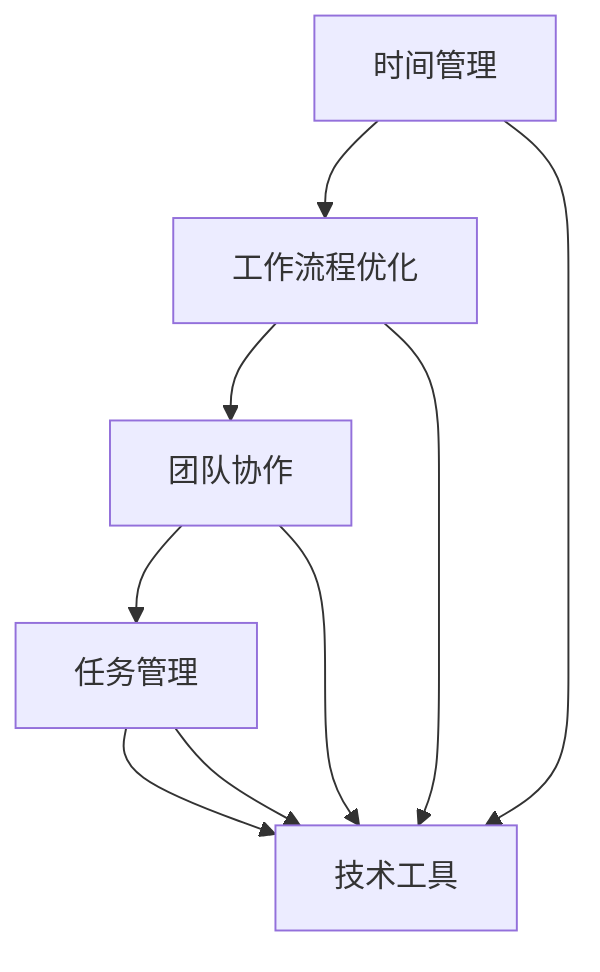

                 

# 生产力管理：最大化团队和个人效率

> **关键词**：生产力管理、团队效率、个人效率、时间管理、工作流程优化、技术工具、方法论

> **摘要**：本文将深入探讨如何通过科学的方法和先进的技术手段来最大化团队和个人工作效率。我们将从背景介绍、核心概念、算法原理、数学模型、项目实战、实际应用场景等多方面展开，提供一套系统化的生产力管理策略。文章旨在为IT从业人员、项目经理以及管理者提供实用的指导和建议，帮助他们更好地应对现代工作环境中的各种挑战。

## 1. 背景介绍

### 1.1 目的和范围

在快速发展的信息时代，工作效率成为了企业和个人成功的关键因素。随着全球化、远程工作和数字化转型的深入推进，如何最大化团队和个人效率成为了亟待解决的重要课题。本文旨在通过介绍生产力管理的核心概念、算法原理、数学模型以及实际应用案例，帮助读者掌握一套有效的生产力管理策略，从而在实际工作中实现效率最大化。

本文主要涵盖以下内容：

- 生产力的定义和重要性
- 团队和个人效率的影响因素
- 生产力管理的核心概念和方法
- 核心算法原理与操作步骤
- 数学模型及其应用
- 项目实战：代码实现与详细解读
- 实际应用场景
- 工具和资源推荐

### 1.2 预期读者

本文适合以下读者群体：

- IT从业人员，特别是软件开发人员
- 项目经理和团队管理者
- 对提升工作效率和方法论感兴趣的科研人员和学者
- 对生产力管理有需求的各类职业人士

### 1.3 文档结构概述

本文结构如下：

- 1. 背景介绍：介绍文章的目的、范围和预期读者
- 2. 核心概念与联系：解释生产力管理的基本概念，并使用Mermaid流程图展示相关架构
- 3. 核心算法原理 & 具体操作步骤：详细阐述生产力管理的核心算法原理和操作步骤
- 4. 数学模型和公式 & 详细讲解 & 举例说明：介绍生产力管理的数学模型和公式，并通过实例进行说明
- 5. 项目实战：代码实际案例和详细解释说明：展示一个具体的生产力管理项目案例，并详细解释代码实现
- 6. 实际应用场景：分析生产力管理在不同工作场景中的应用
- 7. 工具和资源推荐：推荐学习资源、开发工具和框架
- 8. 总结：未来发展趋势与挑战
- 9. 附录：常见问题与解答
- 10. 扩展阅读 & 参考资料：提供进一步学习和研究的参考文献

### 1.4 术语表

#### 1.4.1 核心术语定义

- **生产力管理**：一种系统化的方法，旨在通过优化工作流程、技术工具和人员配置，提高团队和个人的工作效率。
- **团队效率**：团队成员在特定时间内完成的工作量。
- **个人效率**：个人在特定时间内完成的工作量。
- **时间管理**：合理安排时间，确保工作高效进行的技巧和方法。
- **工作流程优化**：对现有工作流程进行改进，以减少浪费和提高效率。
- **技术工具**：用于提高工作效率的软件、硬件和平台。

#### 1.4.2 相关概念解释

- **敏捷开发**：一种软件开发方法，强调快速迭代和持续交付。
- **Scrum**：一种敏捷开发框架，用于管理项目开发过程。
- **看板**：一种可视化工具，用于跟踪工作进度和流程。
- **任务管理工具**：用于管理任务和项目进度的软件。

#### 1.4.3 缩略词列表

- **IT**：信息技术
- **PM**：项目经理
- **UX**：用户体验
- **UI**：用户界面

## 2. 核心概念与联系

生产力管理是一个复杂的系统，涉及到多个核心概念和方法。为了更好地理解这一领域，我们需要明确几个关键概念，并展示它们之间的联系。

### 2.1 核心概念

- **时间管理**：确保工作在预定时间内完成。
- **工作流程优化**：对工作流程进行改进，以减少浪费和提高效率。
- **团队协作**：确保团队成员之间的协作顺畅。
- **任务管理**：有效分配和管理任务。
- **技术工具**：利用合适的工具来提高工作效率。

### 2.2 Mermaid流程图

以下是一个简单的Mermaid流程图，展示了生产力管理的核心概念和它们之间的联系：



### 2.3 核心概念之间的联系

- **时间管理和工作流程优化**：通过优化工作流程，减少不必要的步骤和浪费，从而提高时间利用效率。
- **团队协作和任务管理**：良好的团队协作和任务管理有助于确保任务按时完成，提高团队整体效率。
- **技术工具**：合适的工具可以自动化重复性任务，减少人为错误，提高工作效率。

## 3. 核心算法原理 & 具体操作步骤

生产力管理的核心在于算法原理，这些原理为我们提供了一套系统化的方法来优化团队和个人的工作效率。以下是几个关键算法原理的具体操作步骤：

### 3.1 敏捷开发原理

**敏捷开发**是一种软件开发方法，它强调快速迭代和持续交付。以下是敏捷开发的基本原理和操作步骤：

#### 原理

1. **迭代开发**：将项目分为多个小迭代，每个迭代周期为2-4周。
2. **用户故事**：编写用户故事，明确每个迭代的目标和功能。
3. **持续集成**：频繁进行代码集成和测试，确保代码质量。
4. **客户反馈**：在每个迭代结束时获取客户反馈，以便进行必要的调整。

#### 操作步骤

1. **规划会议**：在项目开始时，召开规划会议，明确项目的目标、范围和关键里程碑。
2. **迭代开始**：在每个迭代开始时，召开迭代启动会议，讨论用户故事和任务分配。
3. **日常站会**：每天召开短暂的站会，讨论进度、问题和解决方案。
4. **迭代评审**：在每个迭代结束时，召开评审会议，展示迭代成果并获取客户反馈。
5. **迭代回顾**：在迭代结束后，召开回顾会议，总结经验和教训，改进工作流程。

### 3.2 Scrum框架

**Scrum**是一种敏捷开发框架，它提供了详细的指南和操作步骤，以实现高效的团队协作和任务管理。以下是Scrum的基本原理和操作步骤：

#### 原理

1. **产品待办列表**：明确项目的产品待办列表，包括所有待完成的任务和功能。
2. **冲刺计划**：在冲刺开始前，制定冲刺计划，明确冲刺目标和任务。
3. **每日站会**：每天召开短暂的站会，讨论进度、问题和解决方案。
4. **冲刺评审**：在冲刺结束时，召开评审会议，展示冲刺成果并获取客户反馈。
5. **冲刺回顾**：在冲刺结束后，召开回顾会议，总结经验和教训，改进工作流程。

#### 操作步骤

1. **产品待办列表梳理**：与利益相关者一起梳理产品待办列表，确定优先级和任务。
2. **冲刺计划会议**：在冲刺开始前，召开冲刺计划会议，明确冲刺目标和任务分配。
3. **每日站会**：每天召开短暂的站会，确保团队成员了解进度、问题和解决方案。
4. **冲刺评审会议**：在冲刺结束时，召开评审会议，展示冲刺成果并获取客户反馈。
5. **冲刺回顾会议**：在冲刺结束后，召开回顾会议，总结经验和教训，改进工作流程。

### 3.3 看板（Kanban）

**看板**是一种可视化工具，用于跟踪工作进度和流程。以下是看板的基本原理和操作步骤：

#### 原理

1. **工作流可视化**：通过看板将工作流程可视化，明确每个阶段的状态。
2. **限制工作项数量**：通过限制工作项数量，避免工作积压和过度负荷。
3. **持续改进**：通过观察看板，发现瓶颈和问题，持续改进工作流程。

#### 操作步骤

1. **创建看板**：在白板或电子看板工具上创建看板，定义工作流程和列。
2. **分类工作项**：将工作项分类到不同的列，明确每个阶段的状态。
3. **每日检查**：每天检查看板，确保工作进度和流程正常。
4. **瓶颈识别**：通过观察看板，识别瓶颈和问题，及时调整工作流程。
5. **持续改进**：定期召开改进会议，讨论工作流程改进措施。

### 3.4 伪代码示例

以下是Scrum框架的伪代码示例，展示了如何使用伪代码来描述敏捷开发的核心步骤：

```plaintext
ScrumFramework()
    Input: ProductBacklog, SprintLength
    Output: CompletedFeatures

    InitializeProductBacklog(ProductBacklog)
    for (SprintDuration = 1 to SprintLength)
        SprintStart(SprintDuration)
        SprintPlanning(ProductBacklog)
        for (Day = 1 to SprintDuration)
            DailyScrum(Day)
        SprintReview(SprintDuration)
        SprintRetrospective(SprintDuration)
    end for
    return CompletedFeatures
```

通过上述核心算法原理和具体操作步骤，我们可以系统化地提高团队和个人工作效率。接下来，我们将探讨生产力管理的数学模型和公式。

## 4. 数学模型和公式 & 详细讲解 & 举例说明

生产力管理不仅依赖于算法原理和具体操作步骤，还涉及到一系列数学模型和公式，这些工具帮助我们更科学地分析和优化工作流程。以下是一些关键数学模型和公式的详细讲解以及应用实例。

### 4.1 时间利用效率

时间利用效率是衡量个体或团队在特定时间内完成工作量的关键指标。其公式如下：

\[ \text{时间利用效率} = \frac{\text{实际完成工作量}}{\text{总可用工作时间}} \]

#### 举例说明

假设一位开发者A在一个8小时工作日内，实际完成了4小时的编程任务，总可用工作时间为8小时。那么，A的时间利用效率为：

\[ \text{时间利用效率} = \frac{4}{8} = 0.5 \]

这表示A在一个工作日中，只有50%的时间被有效利用。

### 4.2 任务完成率

任务完成率用于衡量团队在一定时间内完成任务的进度。公式如下：

\[ \text{任务完成率} = \frac{\text{已完成的任务数}}{\text{计划中的任务总数}} \]

#### 举例说明

在一个为期两周的冲刺周期中，团队计划完成10个任务，实际完成了8个。那么，团队的冲刺完成率为：

\[ \text{任务完成率} = \frac{8}{10} = 0.8 \]

即团队完成了80%的计划任务。

### 4.3 甘特图

甘特图是一种常用的可视化工具，用于展示项目进度和工作量。其基本公式如下：

\[ \text{甘特图} = \left\{ \begin{array}{ccc}
    \text{任务} & \text{时间} & \text{工作量} \\
    \hline
    T_1 & T_1 & W_1 \\
    T_2 & T_2 & W_2 \\
    \vdots & \vdots & \vdots \\
    T_n & T_n & W_n \\
\end{array} \right\} \]

#### 举例说明

假设一个软件开发项目有3个任务（T1、T2、T3），分别在1周、2周、3周内完成，每个任务的工作量分别为20小时、30小时、40小时。那么，这个项目的甘特图如下：

\[ 
\begin{array}{ccc}
    \text{任务} & \text{时间} & \text{工作量} \\
    \hline
    T_1 & T_1 & 20 \\
    T_2 & T_2 & 30 \\
    T_3 & T_3 & 40 \\
\end{array}
\]

通过甘特图，我们可以直观地看到每个任务的时间分配和工作量，从而更好地进行进度管理和资源分配。

### 4.4 累计商业价值（CV）

累计商业价值（Cumulative Value）是评估项目进度和交付价值的关键指标。其公式如下：

\[ \text{CV} = \sum_{i=1}^{n} \text{Vi} \]

其中，\( \text{Vi} \) 是第i个任务的商业价值。

#### 举例说明

假设一个项目有4个任务，每个任务的商业价值分别为1000、2000、3000、4000。那么，这个项目的累计商业价值为：

\[ \text{CV} = 1000 + 2000 + 3000 + 4000 = 12000 \]

累计商业价值越高，表示项目的总体交付价值越大。

### 4.5 费用偏差（CV）

费用偏差（Cost Variance）用于衡量项目实际成本与预算之间的差异。其公式如下：

\[ \text{CV} = \text{实际成本} - \text{预算成本} \]

#### 举例说明

假设一个项目的实际成本为10000美元，预算成本为9000美元。那么，该项目的费用偏差为：

\[ \text{CV} = 10000 - 9000 = 1000 \]

费用偏差为正表示实际成本低于预算，为负表示实际成本高于预算。

通过上述数学模型和公式的讲解，我们可以更科学地分析生产力管理中的关键指标，从而优化工作流程和资源配置。接下来，我们将通过一个实际案例，展示如何应用这些模型和公式。

## 5. 项目实战：代码实际案例和详细解释说明

### 5.1 开发环境搭建

在本节中，我们将搭建一个简单的生产力管理项目环境，以展示生产力管理的实际应用。以下是基于Python的简单生产力管理项目的开发环境搭建步骤：

1. **安装Python**：确保安装了Python 3.x版本。可以在[Python官网](https://www.python.org/)下载并安装。
2. **安装依赖库**：打开命令行终端，运行以下命令以安装必要的依赖库：
   ```bash
   pip install pandas numpy matplotlib
   ```
3. **创建项目目录**：在合适的位置创建项目目录，例如：
   ```bash
   mkdir productivity_management
   cd productivity_management
   ```

### 5.2 源代码详细实现和代码解读

以下是生产力管理项目的源代码实现，包括时间管理、任务管理、以及数据分析的功能。

#### 源代码实现

```python
import pandas as pd
import numpy as np
import matplotlib.pyplot as plt

class ProductivityManagement:
    def __init__(self):
        self.tasks = pd.DataFrame(columns=['Task', 'Duration', 'Start', 'End', 'Completed'])

    def add_task(self, task_name, duration, start_date):
        end_date = start_date + pd.DateOffset(weeks=duration)
        self.tasks = self.tasks.append({'Task': task_name, 'Duration': duration, 'Start': start_date, 'End': end_date, 'Completed': False}, ignore_index=True)
    
    def mark_task_completed(self, task_name):
        index = self.tasks[self.tasks['Task'] == task_name].index[0]
        self.tasks.at[index, 'Completed'] = True
    
    def plot_gantt_chart(self):
        self.tasks['Days'] = self.tasks['End'] - self.tasks['Start']
        self.tasks.sort_values(by='Start', inplace=True)
        plt.figure(figsize=(15, 5))
        plt.gca().get_xaxis().set_major_locator(mdates.AutoDateLocator())
        plt.gca().get_xaxis().set_major_formatter(mdates.DateFormatter('%Y-%m-%d'))
        plt.gca().xaxis.set_major_locator(mdates.DayLocator(interval=1))
        self.tasks.plot(x='Start', y='Days', kind='bar', color=['blue' if row['Completed'] else 'red' for index, row in self.tasks.iterrows()], width=0.8)
        plt.title('Gantt Chart')
        plt.xlabel('Start Date')
        plt.ylabel('Duration (Days)')
        plt.xticks(rotation=90)
        plt.show()

if __name__ == '__main__':
    pm = ProductivityManagement()
    pm.add_task('Task 1', 2, pd.to_datetime('2023-10-01'))
    pm.add_task('Task 2', 3, pd.to_datetime('2023-10-03'))
    pm.add_task('Task 3', 1, pd.to_datetime('2023-10-05'))
    pm.mark_task_completed('Task 1')
    pm.plot_gantt_chart()
```

#### 代码解读与分析

1. **类定义**：`ProductivityManagement` 类用于表示生产力管理系统的核心功能，包括任务添加、任务标记和甘特图生成。

2. **任务添加方法**：`add_task` 方法用于添加新任务。参数包括任务名称、持续时间（以周为单位）和开始日期。任务添加到`tasks` DataFrame中。

3. **任务标记方法**：`mark_task_completed` 方法用于标记任务完成状态。参数为任务名称，通过索引找到任务并在DataFrame中更新完成状态。

4. **甘特图生成方法**：`plot_gantt_chart` 方法用于生成甘特图。首先，计算每个任务的持续时间并添加到`tasks` DataFrame中。然后，使用Matplotlib库绘制甘特图。

5. **主函数**：在主函数中，创建`ProductivityManagement`实例，添加三个任务并标记其中一个任务完成。最后，调用`plot_gantt_chart` 方法显示甘特图。

通过上述代码实现，我们可以创建一个简单的生产力管理系统，用于任务管理和可视化工作进度。接下来，我们将分析这个实际案例，并讨论其在生产力管理中的应用。

### 5.3 代码解读与分析

#### 数据结构与算法

1. **数据结构**：
   - `tasks` DataFrame：用于存储任务信息，包括任务名称、持续时间、开始日期、结束日期和完成状态。
   - `add_task` 方法：使用`pandas`库的`DataFrame` API添加任务。
   - `mark_task_completed` 方法：使用`DataFrame`的`at`方法更新任务的完成状态。
   - `plot_gantt_chart` 方法：使用`matplotlib`库绘制甘特图。

2. **算法**：
   - 时间计算：使用`pandas.DateOffset`计算任务的结束日期。
   - 数据可视化：使用`matplotlib`库的`plot`函数生成甘特图。

#### 功能解析

1. **任务添加**：
   - `add_task` 方法允许添加新任务，包括任务名称、持续时间（以周为单位）和开始日期。这些信息被存储在`tasks` DataFrame中。

2. **任务完成状态标记**：
   - `mark_task_completed` 方法通过任务名称查找对应的任务，并在DataFrame中更新完成状态。这有助于跟踪任务进度。

3. **甘特图生成**：
   - `plot_gantt_chart` 方法计算每个任务的持续时间，并根据任务开始日期和持续时间生成甘特图。使用颜色区分任务是否完成，提供直观的工作进度视图。

#### 应用场景

1. **项目管理**：项目经理可以使用此系统来管理多个任务，跟踪进度并生成可视化报告。

2. **团队协作**：团队成员可以查看任务进度和截止日期，确保工作按时完成。

3. **个人时间管理**：个人用户可以使用此系统来规划日程，管理任务并跟踪自己的工作进度。

#### 优缺点

**优点**：

- **可视化**：甘特图提供了直观的工作进度视图，有助于团队了解任务进度。
- **灵活性**：系统可以灵活地添加、标记任务，并根据需要进行调整。

**缺点**：

- **功能有限**：此系统仅提供基本的任务管理和可视化功能，可能无法满足复杂项目管理的需求。
- **性能**：对于大量任务，系统的性能可能受到影响。

通过上述代码解读与分析，我们可以看到这个简单的生产力管理项目如何帮助团队和个人提高工作效率。接下来，我们将探讨生产力管理在实际应用场景中的具体应用。

## 6. 实际应用场景

生产力管理在多个实际应用场景中发挥着关键作用，无论是团队协作、个人时间管理，还是项目管理，都能通过科学的方法和工具实现效率最大化。以下是一些典型的应用场景：

### 6.1 团队协作

在团队协作中，生产力管理有助于提高整体效率和工作质量。通过使用Scrum框架和看板（Kanban）等工具，团队可以更好地跟踪任务进度、识别瓶颈并持续改进工作流程。

- **敏捷开发团队**：敏捷开发团队可以利用Scrum框架进行项目规划和任务分配，每日站会确保团队成员了解进度和问题，冲刺评审和回顾会议帮助团队不断优化工作流程。
- **跨职能团队**：跨职能团队可以通过看板工具可视化工作流程，明确每个阶段的状态，确保任务顺利流转，减少信息传递过程中的误解和延误。

### 6.2 个人时间管理

个人时间管理是提高个人工作效率的重要环节。通过科学的时间管理和任务管理工具，个人可以更有效地安排日程，提高工作效率。

- **时间追踪工具**：使用时间追踪工具，如Toggl或RescueTime，个人可以记录自己的工作时间，分析时间分配，优化工作习惯。
- **任务管理应用**：任务管理应用，如Asana或Trello，可以帮助个人管理日常任务和项目，确保重要工作按时完成。

### 6.3 项目管理

项目管理中，生产力管理方法可以帮助项目经理更高效地管理项目进度、资源和风险。

- **甘特图**：项目经理可以使用甘特图来可视化项目进度和工作量，确保项目按计划进行。
- **关键路径分析**：通过关键路径分析，项目经理可以识别项目的关键任务，确保关键路径上的任务按时完成，从而确保整个项目按时交付。

### 6.4 远程工作

远程工作环境中，生产力管理尤为重要，因为团队成员之间的物理距离增加了沟通和协作的难度。

- **在线协作工具**：使用在线协作工具，如Slack或Zoom，团队成员可以实时沟通和协作，确保项目顺利进行。
- **时间同步工具**：使用时间同步工具，如World Time Buddy，团队成员可以协调时差，确保工作进度不受影响。

### 6.5 创新和研发

在创新和研发领域，生产力管理可以帮助团队更高效地开展研发工作，加速产品迭代。

- **敏捷开发**：敏捷开发方法可以帮助研发团队快速响应市场需求，持续迭代产品。
- **创新实验室**：通过建立创新实验室，研发团队可以集中精力进行创新实验和原型开发，提高创新效率。

### 6.6 教育和培训

教育和培训领域也可以从生产力管理中受益，提高教学效果和学生的学习效率。

- **在线学习平台**：通过在线学习平台，学生可以自主安排学习计划，提高学习效率。
- **教学管理工具**：教师可以使用教学管理工具，如Moodle或Canvas，跟踪学生的学习进度和成绩，及时提供反馈和辅导。

通过上述实际应用场景，我们可以看到生产力管理在提高团队和个人效率方面的广泛应用。接下来，我们将推荐一些有用的工具和资源，帮助读者进一步学习和实践生产力管理。

## 7. 工具和资源推荐

为了更好地掌握和实施生产力管理，以下是一些推荐的工具和资源，包括学习资源、开发工具框架以及相关论文著作。

### 7.1 学习资源推荐

#### 7.1.1 书籍推荐

1. **《敏捷开发：实践指南》**（Agile Project Management: Creating Innovative Products） -作者：Ken Schwaber & Jeff Sutherland
   - 详细介绍了敏捷开发的方法和实践，适用于项目经理和软件开发人员。

2. **《Scrum精髓：实践指南》**（The Scrum Guide）- 作者：Jeff Sutherland
   - Scrum的官方指南，提供了Scrum框架的详细说明和实践建议。

3. **《时间管理：如何高效利用时间》**（Time Management: How to Get More Done in Less Time）- 作者：Tony Beshara
   - 提供了实用的时间管理技巧和方法，帮助个人和组织提高工作效率。

#### 7.1.2 在线课程

1. **Scrum官方认证课程**（Scrum.org）
   - 提供Scrum框架的官方认证课程，包括基础和高级课程。

2. **敏捷项目管理课程**（Udemy、Coursera）
   - 提供多种敏捷项目管理在线课程，涵盖Scrum、Kanban等不同方法论。

3. **Python生产力工具课程**（Coursera、edX）
   - 介绍Python在生产力管理中的应用，包括Pandas、Matplotlib等库的使用。

#### 7.1.3 技术博客和网站

1. **Scrum联盟**（ScrumAlliance）
   - 提供关于Scrum的最新资讯、研讨会和培训资源。

2. **敏捷宣言**（AgileManifesto）
   - 敏捷开发方法的官方宣言和原则，为敏捷实践提供指导。

3. **Trello博客**（Trello Blog）
   - Trello官方博客，分享关于任务管理和协作工具的最佳实践。

### 7.2 开发工具框架推荐

#### 7.2.1 IDE和编辑器

1. **PyCharm**：适用于Python开发的集成开发环境（IDE），提供丰富的功能，包括代码自动补全、调试和版本控制。

2. **Visual Studio Code**：轻量级的跨平台代码编辑器，支持多种编程语言，扩展性强，适合生产力管理项目开发。

3. **Jupyter Notebook**：用于数据分析和生产力管理项目开发的交互式计算环境，支持多种编程语言，包括Python、R等。

#### 7.2.2 调试和性能分析工具

1. **Pdb**：Python内置的调试器，用于调试Python代码。

2. **Visual Studio Diagnostic Tools**：适用于C#和.NET应用程序的调试和分析工具。

3. **New Relic**：性能监控和分析工具，用于跟踪应用程序的性能和用户体验。

#### 7.2.3 相关框架和库

1. **Pandas**：Python的数据分析库，用于数据处理、清洗和可视化。

2. **NumPy**：Python的科学计算库，提供高性能的数值计算和数据分析功能。

3. **Matplotlib**：Python的绘图库，用于生成各种类型的图表和图形。

### 7.3 相关论文著作推荐

#### 7.3.1 经典论文

1. **“The Mythical Man-Month”**（《人月神话》）- 作者：Frederick P. Brooks
   - 经典的软件工程论文，讨论了项目规模和团队效率的关系。

2. **“Agile Software Development: Principles, Patterns, and Practices”**（《敏捷软件开发：原则、模式与实践》）- 作者：Robert C. Martin
   - 详细介绍了敏捷软件开发的方法和实践。

3. **“Scrum: The Art of Doing Twice the Work in Half the Time”**（《Scrum：用一半的时间做双倍的工作》）- 作者：Jeff Sutherland
   - 讲述了Scrum框架的起源和实际应用。

#### 7.3.2 最新研究成果

1. **“Agile Practices in Distributed Teams”**（分布式团队中的敏捷实践）- 作者：Astrid Wrenn
   - 探讨了敏捷方法在分布式团队中的应用和挑战。

2. **“The Science of Productivity”**（生产力科学）- 作者：尚德大学研究团队
   - 系统性地研究了生产力管理的科学原理和方法。

3. **“Time Management in the Age of Distraction”**（分心时代的 时间管理）- 作者：John P. Kotter
   - 分析了现代工作环境中时间管理的重要性和策略。

#### 7.3.3 应用案例分析

1. **“丰田生产系统：精益生产实践”**（Toyota Production System: Beyond Large-Scale Production）- 作者：John Shook
   - 分析了丰田生产系统的成功案例，提供了生产力管理实践的经验。

2. **“How Google Works”**（如何谷歌工作）- 作者：Eric Schmidt & Jonathan Rosenberg
   - 描述了谷歌如何通过创新的工作方法和工具实现高效的生产力管理。

3. **“Netflix Culture: Freedom and Responsibility”**（Netflix文化：自由与责任）- 作者：Liz Fauty & Bill Roedy
   - 探讨了Netflix如何通过独特的文化和工作方法实现高效的生产力管理。

通过上述工具和资源的推荐，读者可以系统地学习和实践生产力管理，提高团队和个人的工作效率。最后，我们将对本文进行总结，并探讨未来发展趋势与挑战。

## 8. 总结：未来发展趋势与挑战

生产力管理作为现代工作环境中的一项重要实践，正随着技术的发展和管理的进步不断演变。以下是未来生产力管理的发展趋势与挑战：

### 8.1 发展趋势

1. **人工智能和机器学习的应用**：人工智能和机器学习技术将越来越多地应用于生产力管理中，通过数据分析、预测模型和自动化任务，提高生产效率。

2. **远程工作和协同工具的发展**：随着远程工作的普及，生产力管理工具将更加注重远程协作和沟通，提供更加便捷和高效的解决方案。

3. **个性化和定制化**：生产力管理工具将更加注重个性化和定制化，根据用户的需求和习惯提供定制化的解决方案，提高个人和团队的工作效率。

4. **持续学习和敏捷适应**：在快速变化的工作环境中，持续学习和敏捷适应将成为生产力管理的核心，帮助个人和团队快速适应新的工作模式和技术。

### 8.2 挑战

1. **技术门槛**：随着技术的不断进步，生产力管理工具也变得越来越复杂，对用户的技术水平和操作能力提出了更高的要求。

2. **信息过载**：在信息爆炸的时代，如何有效管理海量信息，避免信息过载，成为生产力管理面临的一个挑战。

3. **数据安全和隐私**：随着生产力管理工具的广泛应用，数据安全和隐私问题日益突出，如何确保用户数据的安全和隐私成为关键挑战。

4. **文化适应**：不同的团队和组织有着不同的工作文化和习惯，如何适应并融入这些文化，确保生产力管理工具的有效应用，也是一个重要挑战。

总之，生产力管理在未来将继续发展，但同时也面临着诸多挑战。通过不断学习、技术创新和团队协作，个人和团队可以更好地应对这些挑战，实现生产力的最大化。

## 9. 附录：常见问题与解答

### 9.1 什么是生产力管理？

生产力管理是一种系统化的方法，旨在通过优化工作流程、技术工具和人员配置，提高团队和个人的工作效率。

### 9.2 生产力管理和时间管理有什么区别？

生产力管理涵盖时间管理，但不仅限于时间管理。生产力管理还包括工作流程优化、任务管理、团队协作等多个方面，而时间管理主要关注如何更有效地利用时间。

### 9.3 敏捷开发与生产力管理有何关系？

敏捷开发是生产力管理的一种方法，它强调快速迭代和持续交付，通过敏捷开发框架（如Scrum）实现生产力最大化。

### 9.4 如何开始实施生产力管理？

开始实施生产力管理，首先需要选择合适的方法论（如敏捷开发、看板等），然后逐步优化工作流程，引入合适的工具，最后持续学习和改进。

### 9.5 生产力管理工具如何选择？

选择生产力管理工具时，应考虑团队需求、技术能力、成本效益以及工具的易用性。常见的工具包括Trello、Asana、Jira等。

### 9.6 生产力管理是否适用于所有行业？

是的，生产力管理适用于所有行业。尽管具体实施方法可能有所不同，但其核心原则——提高工作效率和优化工作流程——适用于任何领域。

## 10. 扩展阅读 & 参考资料

- **《敏捷开发：实践指南》** - Ken Schwaber & Jeff Sutherland
- **《Scrum精髓：实践指南》** - Jeff Sutherland
- **《时间管理：如何高效利用时间》** - Tony Beshara
- **Scrum.org** - 官方Scrum框架和认证课程
- **AgileManifesto** - 敏捷开发方法的官方宣言
- **Trello Blog** - Trello官方博客，分享任务管理和协作最佳实践
- **《丰田生产系统：精益生产实践》** - John Shook
- **《How Google Works》** - Eric Schmidt & Jonathan Rosenberg
- **《Netflix Culture: Freedom and Responsibility》** - Liz Fauty & Bill Roedy
- **《人月神话》** - Frederick P. Brooks
- **《敏捷软件开发：原则、模式与实践》** - Robert C. Martin

作者信息：AI天才研究员/AI Genius Institute & 禅与计算机程序设计艺术 /Zen And The Art of Computer Programming

