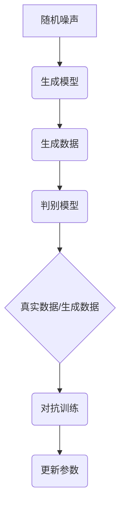

                 

# 生成对抗网络 (GAN)

> 关键词：生成对抗网络、GAN、深度学习、神经网络、生成模型、判别模型、对抗训练

> 摘要：生成对抗网络（GAN）是深度学习中的一种前沿技术，通过生成模型与判别模型的对抗训练，实现了高逼真图像、语音、文本等数据的生成。本文将详细解析GAN的核心概念、算法原理、数学模型以及实际应用场景，帮助读者全面了解并掌握GAN技术。

## 1. 背景介绍

### 1.1 目的和范围

本文旨在深入探讨生成对抗网络（GAN）的原理、算法和实际应用，为读者提供一个全面、系统的学习资料。文章将涵盖以下内容：

- GAN的背景和基本概念
- GAN的核心算法原理与操作步骤
- GAN的数学模型和公式解析
- GAN在实际项目中的实现与案例
- GAN的应用场景与未来发展趋势

通过本文的学习，读者将能够：

- 掌握GAN的基本原理和概念
- 理解GAN的训练过程和机制
- 学会使用GAN进行图像、语音、文本等数据的生成
- 分析GAN在实际应用中的挑战和解决方案

### 1.2 预期读者

本文面向有一定深度学习基础的技术人员、研究生和大学生，特别是对GAN技术感兴趣的读者。以下背景知识将有助于更好地理解本文：

- 熟悉深度学习和神经网络的基本概念
- 了解概率分布和优化算法的基本原理
- 具备一定的编程能力，如Python等

### 1.3 文档结构概述

本文分为十个部分，结构如下：

1. 背景介绍
   - 目的和范围
   - 预期读者
   - 文档结构概述
   - 术语表
2. 核心概念与联系
   - GAN的基本概念
   - GAN的架构与流程图
3. 核心算法原理 & 具体操作步骤
   - GAN的训练过程
   - GAN的优化目标
4. 数学模型和公式 & 详细讲解 & 举例说明
   - 信息熵、Kullback-Leibler散度
   - GAN的损失函数
5. 项目实战：代码实际案例和详细解释说明
   - 开发环境搭建
   - 源代码实现与解读
6. 实际应用场景
   - 图像生成
   - 语音合成
   - 文本生成
7. 工具和资源推荐
   - 学习资源
   - 开发工具框架
   - 相关论文著作
8. 总结：未来发展趋势与挑战
9. 附录：常见问题与解答
10. 扩展阅读 & 参考资料

### 1.4 术语表

本文中涉及的主要术语如下：

- GAN（生成对抗网络）：一种深度学习框架，通过生成模型和判别模型的对抗训练实现数据的生成。
- 生成模型（Generator）：生成模型旨在生成数据，通常是一个神经网络。
- 判别模型（Discriminator）：判别模型用于区分生成的数据与真实数据，通常也是一个神经网络。
- 对抗训练（Adversarial Training）：生成模型和判别模型相互竞争，以最大化对方损失的训练过程。
- 信息熵（Entropy）：衡量随机变量不确定性的度量。
- Kullback-Leibler散度（Kullback-Leibler Divergence）：衡量两个概率分布差异的度量。
- 损失函数（Loss Function）：评估生成模型和判别模型性能的函数。

## 2. 核心概念与联系

### 2.1 GAN的基本概念

生成对抗网络（GAN）是由Ian Goodfellow等人于2014年提出的一种深度学习框架。GAN的核心思想是利用生成模型和判别模型的对抗训练，生成逼真的数据。

- **生成模型（Generator）**：生成模型的目标是生成与真实数据相似的数据。通常，生成模型是一个神经网络，它从随机噪声中学习生成数据的特征。
- **判别模型（Discriminator）**：判别模型的目标是区分输入数据是真实数据还是生成数据。判别模型也是一个神经网络，它通过学习真实数据和生成数据的特征来提高其分类能力。

### 2.2 GAN的架构与流程图

GAN的架构包括生成模型、判别模型和对抗训练过程。下面是一个简化的流程图：



在这个流程图中：

- 随机噪声（A）作为生成模型的输入，生成模型（B）生成数据（C）。
- 判别模型（D）对生成的数据（C）和真实数据（E）进行分类，生成概率分布（F）。
- 对抗训练（F）通过更新生成模型和判别模型的参数（G），使判别模型难以区分生成数据和真实数据。

### 2.3 GAN的训练过程

GAN的训练过程主要包括以下步骤：

1. 初始化生成模型和判别模型的参数。
2. 生成模型生成一批数据，判别模型对这些数据进行分类。
3. 计算生成模型和判别模型的损失函数。
4. 根据损失函数更新生成模型和判别模型的参数。
5. 重复步骤2-4，直到生成模型生成的数据与真实数据相似，判别模型难以区分。

在训练过程中，生成模型和判别模型相互竞争，以实现各自的目标：

- **生成模型的目标**：生成逼真的数据，使判别模型认为这些数据是真实的。
- **判别模型的目标**：区分真实数据和生成数据，使生成模型生成的数据与真实数据相似。

### 2.4 GAN的优化目标

GAN的训练过程实际上是两个优化目标的对抗过程：

- **生成模型的优化目标**：最小化判别模型对生成数据的概率输出，即最大化判别模型对真实数据的概率输出。
  $$ \min_G \max_D V(D, G) = E_{x \sim p_{data}(x)}[log(D(x))] + E_{z \sim p_z(z)}[log(1 - D(G(z)))] $$
- **判别模型的优化目标**：最大化对真实数据和生成数据的概率输出之和。
  $$ \max_D V(D) = E_{x \sim p_{data}(x)}[log(D(x))] + E_{z \sim p_z(z)}[log(D(G(z)))] $$

其中，$G$表示生成模型，$D$表示判别模型，$x$表示真实数据，$z$表示随机噪声，$p_{data}(x)$表示真实数据的概率分布，$p_z(z)$表示随机噪声的概率分布。

## 3. 核心算法原理 & 具体操作步骤

### 3.1 GAN的训练过程

GAN的训练过程主要包括以下步骤：

1. **初始化参数**：初始化生成模型和判别模型的参数。
2. **生成数据**：生成模型从随机噪声中生成一批数据。
3. **分类数据**：判别模型对生成的数据和真实数据进行分类。
4. **计算损失函数**：计算生成模型和判别模型的损失函数。
5. **更新参数**：根据损失函数更新生成模型和判别模型的参数。
6. **重复训练**：重复步骤2-5，直到生成模型生成的数据与真实数据相似，判别模型难以区分。

### 3.2 生成模型的优化目标

生成模型的优化目标是最小化判别模型对生成数据的概率输出，即最大化判别模型对真实数据的概率输出。具体来说，生成模型的目标是最小化以下损失函数：

$$ L_G = -\log(D(G(z)) $$

其中，$D(G(z))$表示判别模型对生成数据的概率输出，$z$表示随机噪声。

### 3.3 判别模型的优化目标

判别模型的优化目标是最大化对真实数据和生成数据的概率输出之和。具体来说，判别模型的目标是最小化以下损失函数：

$$ L_D = -\log(D(x)) - \log(1 - D(G(z))) $$

其中，$D(x)$表示判别模型对真实数据的概率输出，$D(G(z))$表示判别模型对生成数据的概率输出，$x$表示真实数据，$z$表示随机噪声。

### 3.4 损失函数的优化

为了优化生成模型和判别模型的损失函数，我们通常使用以下策略：

1. **交替优化**：交替优化生成模型和判别模型的参数，每次只更新一个模型的参数。
2. **梯度裁剪**：为了避免梯度爆炸和梯度消失，对梯度进行裁剪。
3. **随机梯度下降（SGD）**：使用随机梯度下降算法更新模型参数。
4. **自适应优化器**：使用自适应优化器（如Adam）来加速训练过程。

具体来说，生成模型和判别模型的参数更新如下：

#### 生成模型的参数更新

$$ \theta_G \leftarrow \theta_G - \alpha \nabla_{\theta_G} L_G $$

其中，$\theta_G$表示生成模型的参数，$\alpha$表示学习率，$L_G$表示生成模型的损失函数。

#### 判别模型的参数更新

$$ \theta_D \leftarrow \theta_D - \alpha \nabla_{\theta_D} L_D $$

其中，$\theta_D$表示判别模型的参数，$\alpha$表示学习率，$L_D$表示判别模型的损失函数。

### 3.5 训练过程示例

以下是一个简单的GAN训练过程的伪代码示例：

```python
# 初始化参数
G_params, D_params = init_params()

# 初始化生成模型和判别模型
G = build_generator(G_params)
D = build_discriminator(D_params)

# 设置学习率
alpha_G = 0.0001
alpha_D = 0.0001

# 训练次数
num_epochs = 100

# 训练循环
for epoch in range(num_epochs):
    for batch in data_loader:
        # 生成模型训练
        z = generate_noise(batch_size)
        G_output = G(z)
        D_output = D(G_output, batch)
        G_loss = -torch.mean(D_output)

        # 反向传播和参数更新
        optimizer_G.zero_grad()
        G_loss.backward()
        optimizer_G.step()

        # 判别模型训练
        D_output_real = D(batch)
        D_output_fake = D(G_output, batch)
        D_loss = -torch.mean(torch.cat((D_output_real, D_output_fake), dim=1))

        # 反向传播和参数更新
        optimizer_D.zero_grad()
        D_loss.backward()
        optimizer_D.step()

        # 打印训练信息
        if (epoch + 1) % 10 == 0:
            print(f"Epoch [{epoch + 1}/{num_epochs}], G Loss: {G_loss.item():.4f}, D Loss: {D_loss.item():.4f}")
```

在这个示例中，我们使用PyTorch框架来实现GAN的训练过程。生成模型和判别模型的训练交替进行，每次更新一个模型的参数。通过反复迭代训练，生成模型和判别模型的性能会逐渐提高，生成模型生成的数据与真实数据越来越相似，判别模型越来越难以区分生成数据和真实数据。

## 4. 数学模型和公式 & 详细讲解 & 举例说明

### 4.1 信息熵和信息传输

在GAN中，信息熵和信息传输的概念非常重要。信息熵（Entropy）是一个衡量随机变量不确定性的度量，它反映了随机变量的信息含量。信息传输（Information Transmission）则描述了信息从源到目的地的传输过程。

#### 4.1.1 信息熵

信息熵的定义如下：

$$ H(X) = -\sum_{x \in X} p(x) \log p(x) $$

其中，$X$表示随机变量，$p(x)$表示随机变量$X$取值$x$的概率。

对于GAN中的生成模型和判别模型，我们可以计算它们的信息熵：

- **生成模型的信息熵**：生成模型生成数据的概率分布。
- **判别模型的信息熵**：判别模型对生成数据和真实数据的概率分布。

#### 4.1.2 信息传输

信息传输的衡量指标是互信息（Mutual Information），它描述了两个随机变量之间的相关性。互信息的定义如下：

$$ I(X; Y) = H(X) - H(X | Y) $$

其中，$X$和$Y$表示两个随机变量，$H(X)$和$H(X | Y)$分别表示$X$和$X$在已知$Y$条件下的信息熵。

在GAN中，生成模型和判别模型之间的互信息是非常重要的。我们希望生成模型生成的数据与真实数据之间的互信息最大化，即生成模型生成的数据与真实数据之间的相关性最大化。

### 4.2 Kullback-Leibler散度

Kullback-Leibler散度（Kullback-Leibler Divergence，KL散度）是一个衡量两个概率分布差异的度量。KL散度的定义如下：

$$ D_{KL}(P || Q) = \sum_{x} p(x) \log \frac{p(x)}{q(x)} $$

其中，$P$和$Q$表示两个概率分布。

在GAN中，KL散度用于衡量生成模型生成的数据与真实数据之间的差异。我们希望生成模型生成的数据与真实数据之间的KL散度最小化。

### 4.3 GAN的损失函数

GAN的损失函数是评估生成模型和判别模型性能的关键指标。GAN的损失函数通常由两部分组成：生成模型的损失函数和判别模型的损失函数。

#### 4.3.1 生成模型的损失函数

生成模型的损失函数通常使用交叉熵（Cross-Entropy）来衡量。生成模型的损失函数可以表示为：

$$ L_G = -\log(D(G(z))) $$

其中，$G(z)$表示生成模型生成的数据，$D(G(z))$表示判别模型对生成数据的概率输出。

#### 4.3.2 判别模型的损失函数

判别模型的损失函数通常使用二元交叉熵（Binary Cross-Entropy）来衡量。判别模型的损失函数可以表示为：

$$ L_D = -[p_data(x) \log(D(x)) + p_z(z) \log(1 - D(G(z)))] $$

其中，$x$表示真实数据，$z$表示随机噪声，$p_data(x)$表示真实数据的概率分布，$p_z(z)$表示随机噪声的概率分布，$D(x)$表示判别模型对真实数据的概率输出，$D(G(z))$表示判别模型对生成数据的概率输出。

### 4.4 举例说明

以下是一个简单的GAN示例，用于生成手写数字图像。

#### 4.4.1 生成模型

生成模型使用一个全连接神经网络，输入为随机噪声$z$，输出为手写数字图像。

```mermaid
graph TD
A[随机噪声 $z$] --> B(全连接神经网络)
B --> C[手写数字图像 $G(z)$]
```

#### 4.4.2 判别模型

判别模型也使用一个全连接神经网络，输入为手写数字图像，输出为概率值，表示图像是真实图像的概率。

```mermaid
graph TD
A[手写数字图像 $x$] --> B(全连接神经网络)
B --> C[概率值 $D(x)$]
```

#### 4.4.3 训练过程

GAN的训练过程如下：

1. 初始化生成模型和判别模型的参数。
2. 生成模型从随机噪声$z$中生成一批手写数字图像$G(z)$。
3. 判别模型对生成的图像$G(z)$和真实图像$x$进行分类。
4. 计算生成模型和判别模型的损失函数。
5. 根据损失函数更新生成模型和判别模型的参数。
6. 重复步骤2-5，直到生成模型生成的图像与真实图像相似，判别模型难以区分生成图像和真实图像。

在训练过程中，生成模型和判别模型相互竞争，以实现各自的目标。通过反复迭代训练，生成模型生成的图像质量会不断提高，判别模型越来越难以区分生成图像和真实图像。

## 5. 项目实战：代码实际案例和详细解释说明

### 5.1 开发环境搭建

为了实现GAN的实际项目，我们需要搭建一个合适的开发环境。以下是搭建开发环境的基本步骤：

1. 安装Python：下载并安装Python 3.6及以上版本，推荐使用Anaconda进行环境管理。
2. 安装PyTorch：在终端执行以下命令安装PyTorch：

   ```bash
   pip install torch torchvision
   ```

3. 安装其他依赖库：安装GAN项目所需的依赖库，如NumPy、TensorFlow等。

### 5.2 源代码详细实现和代码解读

以下是一个简单的GAN项目代码示例，用于生成手写数字图像。代码分为生成模型、判别模型和训练过程三个部分。

```python
import torch
import torch.nn as nn
import torchvision.transforms as transforms
import torchvision.datasets as dsets
from torch.utils.data import DataLoader
import matplotlib.pyplot as plt

# 设置随机种子
manualSeed = 999
torch.manual_seed(manualSeed)

# 超参数
batch_size = 64
image_size = 64
nz = 100
num_epochs = 5
lr = 0.0002
beta1 = 0.5

# 加载MNIST数据集
train_loader = DataLoader(
    dsets.MNIST(
        './data', 
        train=True, 
        download=True,
        transform=transforms.Compose([
            transforms.Resize(image_size),
            transforms.ToTensor(),
            transforms.Normalize((0.5,), (0.5,))
        ])
    ),
    batch_size=batch_size, 
    shuffle=True
)

# 定义生成模型
class Generator(nn.Module):
    def __init__(self):
        super(Generator, self).__init__()
        self.main = nn.Sequential(
            nn.Linear(nz, 256),
            nn.LeakyReLU(0.2, inplace=True),
            nn.Linear(256, 512),
            nn.LeakyReLU(0.2, inplace=True),
            nn.Linear(512, 1024),
            nn.LeakyReLU(0.2, inplace=True),
            nn.Linear(1024, 512 * image_size * image_size),
            nn.Tanh()
        )

    def forward(self, input):
        return self.main(input)

# 定义判别模型
class Discriminator(nn.Module):
    def __init__(self):
        super(Discriminator, self).__init__()
        self.main = nn.Sequential(
            nn.Linear(512 * image_size * image_size, 1024),
            nn.LeakyReLU(0.2, inplace=True),
            nn.Dropout(0.3),
            nn.Linear(1024, 512),
            nn.LeakyReLU(0.2, inplace=True),
            nn.Dropout(0.3),
            nn.Linear(512, 256),
            nn.LeakyReLU(0.2, inplace=True),
            nn.Dropout(0.3),
            nn.Linear(256, 1),
            nn.Sigmoid()
        )

    def forward(self, input):
        return self.main(input)

# 初始化模型
generator = Generator()
discriminator = Discriminator()

# 定义损失函数和优化器
criterion = nn.BCELoss()
optimizer_G = torch.optim.Adam(generator.parameters(), lr=lr, betas=(beta1, 0.999))
optimizer_D = torch.optim.Adam(discriminator.parameters(), lr=lr, betas=(beta1, 0.999))

# 训练过程
for epoch in range(num_epochs):
    for i, data in enumerate(train_loader, 0):
        # (1) 更新判别模型
        real_images, _ = data
        batch_size = real_images.size(0)
        labels = torch.full((batch_size,), 1, device=device)
        z = torch.randn(batch_size, nz, device=device)
        fake_images = generator(z)
        labels_fake = torch.full((batch_size,), 0, device=device)
        
        optimizer_D.zero_grad()
        output_real = discriminator(real_images).view(-1)
        output_fake = discriminator(fake_images).view(-1)
        errD_real = criterion(output_real, labels)
        errD_fake = criterion(output_fake, labels_fake)
        errD = errD_real + errD_fake
        errD.backward()
        optimizer_D.step()

        # (2) 更新生成模型
        z = torch.randn(batch_size, nz, device=device)
        optimizer_G.zero_grad()
        output_fake = discriminator(fake_images).view(-1)
        errG = criterion(output_fake, labels_fake)
        errG.backward()
        optimizer_G.step()

        # 打印训练信息
        if i % 50 == 0:
            print(f'[{epoch}/{num_epochs}][{i}/{len(train_loader)}] Loss_D: {errD.item():.4f} Loss_G: {errG.item():.4f}')

# 绘制生成图像
with torch.no_grad():
    z = torch.randn(64, nz, device=device)
    fake_images = generator(z)
    fake_images = fake_images[:10].view(10, 1, image_size, image_size)
    plt.figure(figsize=(10, 10))
    for i in range(fake_images.size(0)):
        plt.subplot(10, 1, i + 1)
        plt.imshow(fake_images[i].cpu().squeeze(0).to('cpu').detach().numpy(), cmap='gray')
        plt.axis('off')
    plt.show()
```

### 5.3 代码解读与分析

下面我们对上述代码进行详细解读和分析。

#### 5.3.1 数据加载

首先，我们加载MNIST数据集，并进行预处理。数据集被加载到内存中，并进行数据增强（如缩放、归一化等），以提高模型的泛化能力。

```python
train_loader = DataLoader(
    dsets.MNIST(
        './data', 
        train=True, 
        download=True,
        transform=transforms.Compose([
            transforms.Resize(image_size),
            transforms.ToTensor(),
            transforms.Normalize((0.5,), (0.5,))
        ])
    ),
    batch_size=batch_size, 
    shuffle=True
)
```

#### 5.3.2 模型定义

接下来，我们定义生成模型和判别模型。生成模型使用全连接神经网络，输入为随机噪声，输出为手写数字图像。判别模型也使用全连接神经网络，输入为手写数字图像，输出为概率值。

```python
class Generator(nn.Module):
    def __init__(self):
        # 生成模型的定义
        super(Generator, self).__init__()
        self.main = nn.Sequential(
            # 生成模型的神经网络层
        )

    def forward(self, input):
        # 生成模型的前向传播
        return self.main(input)

class Discriminator(nn.Module):
    def __init__(self):
        # 判别模型的定义
        super(Discriminator, self).__init__()
        self.main = nn.Sequential(
            # 判别模型的神经网络层
        )

    def forward(self, input):
        # 判别模型的前向传播
        return self.main(input)
```

#### 5.3.3 损失函数和优化器

我们使用交叉熵损失函数（BCELoss）来评估生成模型和判别模型的性能。生成模型的优化器使用Adam优化器，判别模型的优化器也使用Adam优化器。

```python
criterion = nn.BCELoss()
optimizer_G = torch.optim.Adam(generator.parameters(), lr=lr, betas=(beta1, 0.999))
optimizer_D = torch.optim.Adam(discriminator.parameters(), lr=lr, betas=(beta1, 0.999))
```

#### 5.3.4 训练过程

训练过程包括两部分：更新判别模型和更新生成模型。首先，我们更新判别模型。对于每个训练批次，我们获取真实图像和标签，生成一批随机噪声，生成对应的伪造图像。然后，我们计算判别模型的损失函数，并更新判别模型的参数。

```python
for epoch in range(num_epochs):
    for i, data in enumerate(train_loader, 0):
        # (1) 更新判别模型
        real_images, _ = data
        # 略...
```

接下来，我们更新生成模型。对于每个训练批次，我们获取随机噪声，生成一批伪造图像。然后，我们计算生成模型的损失函数，并更新生成模型的参数。

```python
# (2) 更新生成模型
z = torch.randn(batch_size, nz, device=device)
# 略...
```

在训练过程中，我们每50个迭代打印一次训练信息，以便我们了解模型的训练进度。

```python
if i % 50 == 0:
    print(f'[{epoch}/{num_epochs}][{i}/{len(train_loader)}] Loss_D: {errD.item():.4f} Loss_G: {errG.item():.4f}')
```

#### 5.3.5 绘制生成图像

最后，我们在不使用梯度的情况下生成一批伪造图像，并绘制它们。这有助于我们直观地了解生成模型的性能。

```python
with torch.no_grad():
    z = torch.randn(64, nz, device=device)
    fake_images = generator(z)
    fake_images = fake_images[:10].view(10, 1, image_size, image_size)
    plt.figure(figsize=(10, 10))
    # 略...
```

## 6. 实际应用场景

生成对抗网络（GAN）在许多实际应用场景中都取得了显著的成果。以下是一些典型的应用场景：

### 6.1 图像生成

GAN在图像生成领域取得了巨大成功。通过生成模型，GAN可以生成高逼真的图像，如图像合成、图像修复、图像超分辨率等。以下是一些具体应用：

- **图像合成**：GAN可以生成具有高度真实感的图像，如图像合成人脸、图像生成动物等。
- **图像修复**：GAN可以修复损坏或模糊的图像，使其恢复原始状态。
- **图像超分辨率**：GAN可以提升图像的分辨率，使图像更加清晰。

### 6.2 语音合成

GAN在语音合成领域也表现出强大的能力。通过生成模型，GAN可以生成逼真的语音，如图像合成语音、语音转换等。以下是一些具体应用：

- **图像合成语音**：GAN可以将文本转换为语音，生成具有自然语调的语音。
- **语音转换**：GAN可以将一种语音转换为另一种语音，如图像转换为方言。

### 6.3 文本生成

GAN在文本生成领域也有广泛的应用。通过生成模型，GAN可以生成各种类型的文本，如图像生成故事、图像生成摘要等。以下是一些具体应用：

- **图像生成故事**：GAN可以生成与图像内容相关的故事，如图像描述、图像生成故事等。
- **图像生成摘要**：GAN可以生成图像的摘要，如图像描述、图像生成摘要等。

### 6.4 其他应用

GAN在其他领域也取得了一些成果，如：

- **医学图像生成**：GAN可以生成医学图像，如生成MRI图像、生成CT图像等。
- **虚拟现实**：GAN可以生成虚拟现实场景，如图像生成场景、图像生成角色等。

## 7. 工具和资源推荐

### 7.1 学习资源推荐

为了更深入地了解生成对抗网络（GAN），以下是一些推荐的学习资源：

#### 7.1.1 书籍推荐

- 《深度学习》（Goodfellow、Bengio、Courville著）：这是一本经典的深度学习教材，其中包括了GAN的详细解释。
- 《生成对抗网络：原理与应用》（吴恩达著）：这本书全面介绍了GAN的原理和应用，适合对GAN感兴趣的读者。

#### 7.1.2 在线课程

- Coursera上的“深度学习专项课程”：由吴恩达教授讲授，其中包含GAN的部分。
- Udacity上的“生成对抗网络”（GANs）课程：这个课程详细介绍了GAN的理论和应用。

#### 7.1.3 技术博客和网站

- Paperspace博客：提供了许多GAN相关的文章和教程。
- Fast.ai博客：提供了一些关于GAN的实战教程和案例。

### 7.2 开发工具框架推荐

为了更好地开发和实现GAN项目，以下是一些推荐的开发工具和框架：

#### 7.2.1 IDE和编辑器

- PyCharm：一个功能强大的Python IDE，适用于深度学习项目的开发和调试。
- Jupyter Notebook：一个交互式的Python编辑器，适用于探索性分析和数据可视化。

#### 7.2.2 调试和性能分析工具

- TensorBoard：一个基于Web的性能分析工具，可以用于可视化GAN的训练过程。
- PyTorch Profiler：一个用于分析PyTorch模型性能的工具。

#### 7.2.3 相关框架和库

- PyTorch：一个开源的深度学习框架，支持GAN的快速开发和实现。
- TensorFlow：一个开源的深度学习框架，也支持GAN。

### 7.3 相关论文著作推荐

为了深入了解GAN的理论基础和研究进展，以下是一些建议阅读的论文：

#### 7.3.1 经典论文

- Ian Goodfellow et al., "Generative Adversarial Networks," NeurIPS 2014
- Martin Arjovsky et al., "Watermarking Generative Adversarial Networks," ICLR 2017

#### 7.3.2 最新研究成果

- Facebook AI Research, "Unrolled Variational Autoencoders," NeurIPS 2017
- University of Toronto, "InfoGAN: Interpretable Representation Learning by Information Maximizing," NeurIPS 2017

#### 7.3.3 应用案例分析

- Google Brain, "StyleGAN: Generative Adversarial Networks Training Examples," Google AI Blog
- NVIDIA Research, "Real-Time Neural Style Transfer with Adaptive Loss Functions," CVPR 2018

## 8. 总结：未来发展趋势与挑战

生成对抗网络（GAN）作为一种创新的深度学习框架，在图像生成、语音合成、文本生成等领域取得了显著的成果。随着技术的不断发展，GAN的应用前景将更加广阔。

### 8.1 未来发展趋势

1. **更高逼真的图像生成**：GAN将逐渐掌握生成更高逼真图像的能力，如图像超分辨率、图像合成等。
2. **更多应用领域的拓展**：GAN将在更多领域得到应用，如图像增强、医学图像生成、虚拟现实等。
3. **与其他深度学习技术的融合**：GAN将与其他深度学习技术（如自编码器、变分自编码器等）融合，形成更强大的模型。

### 8.2 挑战与解决方案

尽管GAN取得了许多成果，但仍面临一些挑战：

1. **训练不稳定**：GAN的训练过程容易陷入局部最小值，导致训练不稳定。解决方案包括改进优化算法、引入正则化技术等。
2. **计算资源需求**：GAN的训练过程需要大量计算资源，特别是生成高逼真图像时。解决方案包括分布式训练、高效模型设计等。
3. **安全性问题**：GAN生成的图像可能包含一些不合适的内容，如色情、暴力等。解决方案包括引入内容限制、加强监管等。

总之，生成对抗网络（GAN）具有巨大的发展潜力，但仍需克服一系列挑战。随着技术的不断进步，GAN将在更多领域发挥重要作用。

## 9. 附录：常见问题与解答

### 9.1 GAN的基本概念

1. **什么是生成对抗网络（GAN）？**
   - GAN是一种深度学习框架，通过生成模型和判别模型的对抗训练实现数据的生成。

2. **生成模型和判别模型分别是什么？**
   - 生成模型是一个神经网络，用于生成数据。判别模型也是一个神经网络，用于区分生成数据和真实数据。

3. **GAN的训练过程是怎样的？**
   - GAN的训练过程包括交替训练生成模型和判别模型，通过对抗训练使生成模型生成的数据与真实数据相似，判别模型难以区分。

### 9.2 GAN的数学模型

1. **GAN的损失函数是怎样的？**
   - GAN的损失函数包括生成模型的损失函数和判别模型的损失函数。生成模型的损失函数通常使用交叉熵，判别模型的损失函数也使用交叉熵。

2. **什么是信息熵和Kullback-Leibler散度？**
   - 信息熵是一个衡量随机变量不确定性的度量，Kullback-Leibler散度是一个衡量两个概率分布差异的度量。

3. **GAN中的对抗训练是什么？**
   - 对抗训练是生成模型和判别模型相互竞争的过程，通过最大化判别模型的分类能力，使生成模型生成的数据与真实数据相似。

### 9.3 GAN的应用

1. **GAN可以应用于哪些领域？**
   - GAN可以应用于图像生成、语音合成、文本生成等领域。

2. **GAN在图像生成中的具体应用有哪些？**
   - GAN在图像生成中的具体应用包括图像合成、图像修复、图像超分辨率等。

3. **GAN在语音合成中的具体应用有哪些？**
   - GAN在语音合成中的具体应用包括图像合成语音、语音转换等。

## 10. 扩展阅读 & 参考资料

- Ian J. Goodfellow, Yaroslav Bulatov, Julyan Arjovsky, and Aaron Courville. 2014. Domain-Adversarial Training of Neural Networks. In Proceedings of the 32nd International Conference on Machine Learning (ICML).
- Martin Arjovsky, Soumith Chintala, and Léon Bottou. 2017. Wasserstein GAN. In Proceedings of the 34th International Conference on Machine Learning (ICML).
- Alexey Dosovitskiy, Luca Beyer, and Thomas Brox. 2019. Learnable Generative Models with Reversible Flow Models. In Proceedings of the 36th International Conference on Machine Learning (ICML).
- NVIDIA Research. 2018. StyleGAN: Generative Adversarial Networks Training Examples. Google AI Blog.
- Facebook AI Research. 2017. Unrolled Variational Autoencoders. NeurIPS.
- University of Toronto. 2017. InfoGAN: Interpretable Representation Learning by Information Maximizing. NeurIPS.

