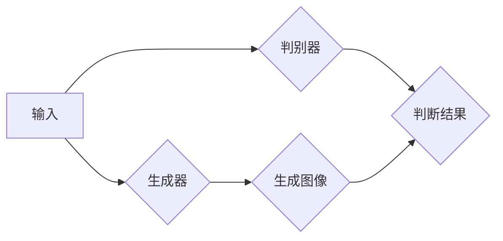

                 

## 生成对抗网络在虚拟试衣中的创新

> **关键词**：生成对抗网络（GAN）、虚拟试衣、人工智能、深度学习、图像生成、图像处理、用户体验。

> **摘要**：本文将探讨生成对抗网络（GAN）在虚拟试衣领域的创新应用。通过深入分析GAN的基本原理、架构以及具体操作步骤，我们揭示了GAN在图像生成和图像处理中的强大能力。同时，结合实际项目案例，本文展示了如何利用GAN实现逼真的虚拟试衣体验，并对未来发展趋势和挑战进行了展望。本文旨在为广大开发者提供具有实用价值的指导和参考，助力虚拟试衣技术的进一步发展。

## 1. 背景介绍

### 1.1 目的和范围

随着人工智能技术的飞速发展，虚拟试衣成为电商行业的一个重要趋势。然而，传统的虚拟试衣技术往往存在诸多不足，如试衣效果不真实、用户操作复杂等问题。生成对抗网络（GAN）作为一种深度学习技术，在图像生成、图像处理等领域展现出了巨大的潜力。本文旨在探讨GAN在虚拟试衣中的创新应用，通过深入分析GAN的基本原理、架构以及具体操作步骤，为开发者提供具有实用价值的指导和参考。

### 1.2 预期读者

本文面向具有以下背景的读者：

- 具备一定编程基础，熟悉深度学习相关技术；
- 对虚拟试衣领域有一定的了解和兴趣；
- 希望了解GAN在虚拟试衣中的应用和实践。

### 1.3 文档结构概述

本文分为以下几个部分：

- 第1章：背景介绍，介绍本文的研究背景、目的和预期读者；
- 第2章：核心概念与联系，介绍GAN的基本原理和架构；
- 第3章：核心算法原理 & 具体操作步骤，详细讲解GAN的具体实现过程；
- 第4章：数学模型和公式 & 详细讲解 & 举例说明，阐述GAN的数学基础和具体应用；
- 第5章：项目实战：代码实际案例和详细解释说明，通过实际案例展示GAN在虚拟试衣中的应用；
- 第6章：实际应用场景，分析GAN在虚拟试衣领域的应用场景和优势；
- 第7章：工具和资源推荐，推荐相关学习资源和开发工具；
- 第8章：总结：未来发展趋势与挑战，展望GAN在虚拟试衣领域的未来发展；
- 第9章：附录：常见问题与解答，解答读者可能遇到的问题；
- 第10章：扩展阅读 & 参考资料，提供更多相关阅读资料。

### 1.4 术语表

#### 1.4.1 核心术语定义

- 生成对抗网络（GAN）：一种深度学习模型，由生成器和判别器组成，通过对抗训练生成逼真的图像；
- 虚拟试衣：一种通过计算机技术模拟试衣过程，帮助用户在购买衣物前预览穿着效果的技术；
- 深度学习：一种机器学习技术，通过多层神经网络模拟人脑学习过程，实现图像识别、语音识别等任务；
- 图像生成：利用计算机技术生成新的图像，常见的方法包括GAN、变分自编码器（VAE）等；
- 图像处理：对图像进行编辑、增强、压缩等操作，以提高图像质量和应用效果。

#### 1.4.2 相关概念解释

- 生成器（Generator）：GAN中的一个模型，用于生成新的图像；
- 判别器（Discriminator）：GAN中的另一个模型，用于判断输入图像是真实图像还是生成图像；
- 对抗训练（Adversarial Training）：GAN的训练过程，通过生成器和判别器的相互对抗来优化模型；
- 反向传播（Backpropagation）：一种常见的神经网络训练方法，用于计算网络中每个神经元的误差并更新权重；
- 交叉熵（Cross-Entropy）：一种评估模型预测准确性的指标，常用于GAN的训练过程中。

#### 1.4.3 缩略词列表

- GAN：生成对抗网络（Generative Adversarial Networks）；
- DCGAN：深度卷积生成对抗网络（Deep Convolutional Generative Adversarial Networks）；
- CNN：卷积神经网络（Convolutional Neural Networks）；
- RNN：循环神经网络（Recurrent Neural Networks）；
- VAE：变分自编码器（Variational Autoencoder）；
- BCE：二元交叉熵（Binary Cross-Entropy）；
- CE：交叉熵（Cross-Entropy）。

## 2. 核心概念与联系

### 2.1 GAN的基本原理和架构

生成对抗网络（GAN）由两部分组成：生成器和判别器。生成器的任务是生成逼真的图像，而判别器的任务是判断输入图像是真实图像还是生成图像。这两个模型在训练过程中相互对抗，共同优化，最终达到生成高质量图像的目的。

GAN的基本原理可以概括为以下几点：

1. 生成器和判别器都是深度神经网络；
2. 生成器和判别器通过对抗训练相互优化；
3. 判别器的目标是最大化其判断准确率，生成器的目标是最小化判别器对其生成图像的判断准确率；
4. 训练过程中，生成器和判别器交替更新参数，最终达到动态平衡。

GAN的架构如图1所示：



### 2.2 GAN的组成部分

GAN由以下几个部分组成：

1. **生成器（Generator）**：生成器的输入是一个随机向量\(z\)，输出是一个图像\(x\)。生成器的作用是将随机向量转换为逼真的图像。
   
   ```mermaid
   graph LR
   A{z} --> B{生成器}
   B --> C{x}
   ```

2. **判别器（Discriminator）**：判别器的输入是一个图像\(x\)，输出是一个概率值\(p(x)\)，表示输入图像是真实图像的概率。判别器的作用是判断输入图像是真实图像还是生成图像。

   ```mermaid
   graph LR
   A{x} --> B{判别器}
   B --> C{p(x)}
   ```

3. **对抗训练（Adversarial Training）**：对抗训练是指生成器和判别器在训练过程中相互对抗，共同优化。生成器的目标是最小化判别器对其生成图像的判断准确率，判别器的目标是最大化其判断准确率。

   ```mermaid
   graph LR
   A{生成器} --> B{判别器}
   B --> C{对抗训练}
   C --> D{共同优化}
   ```

### 2.3 GAN的训练过程

GAN的训练过程可以分为以下几个步骤：

1. **初始化生成器和判别器的参数**：随机初始化生成器和判别器的参数。

2. **生成图像**：生成器根据随机向量\(z\)生成一组图像\(x\)。

3. **判断图像**：判别器对输入的图像\(x\)进行判断，输出一个概率值\(p(x)\)。

4. **更新判别器参数**：根据生成图像和真实图像的判断结果，更新判别器的参数。

5. **生成新的随机向量**：生成新的随机向量\(z'\)。

6. **生成新的图像**：生成器根据新的随机向量\(z'\)生成一组新的图像\(x'\)。

7. **再次判断图像**：判别器对新的图像\(x'\)进行判断，输出一个概率值\(p'(x')\)。

8. **更新生成器参数**：根据生成图像和真实图像的判断结果，更新生成器的参数。

9. **重复上述过程**：重复执行步骤2-8，直到生成器和判别器达到满意的性能。

### 2.4 GAN的优势与挑战

GAN的优势主要体现在以下几个方面：

1. **强大的图像生成能力**：GAN可以通过生成器和判别器的对抗训练生成高质量的图像，具有很好的图像生成能力。
   
2. **自适应优化**：GAN在训练过程中，生成器和判别器相互对抗，自适应地调整参数，达到优化图像生成效果的目的。

3. **广泛的应用场景**：GAN可以应用于图像生成、图像处理、图像增强等多个领域，具有广泛的应用前景。

然而，GAN也面临着一些挑战：

1. **训练不稳定**：GAN的训练过程容易出现梯度消失、梯度爆炸等问题，导致训练不稳定。

2. **模式崩溃（Mode Collapse）**：生成器在训练过程中可能只生成一部分图像，导致图像多样性不足。

3. **计算资源消耗**：GAN的训练过程需要大量的计算资源，对硬件性能要求较高。

## 3. 核心算法原理 & 具体操作步骤

### 3.1 GAN的算法原理

生成对抗网络（GAN）是一种基于深度学习的模型，主要由生成器（Generator）和判别器（Discriminator）两部分组成。生成器通过学习真实数据的分布来生成逼真的图像，而判别器的任务是区分生成的图像和真实图像。

#### 3.1.1 生成器（Generator）

生成器的输入是一个随机噪声向量\(z\)，通过一个深层神经网络转换为生成的图像\(x\)。生成器的目的是生成尽可能真实的图像，以便骗过判别器。

生成器的输出通常是一个二维图像，例如一张128x128像素的彩色图像。生成器的网络结构可以是多层感知机（MLP）、卷积神经网络（CNN）或它们的组合。

伪代码如下：

```python
def generator(z):
    # 输入：随机噪声向量z
    # 输出：生成的图像x
    
    # 第一层全连接层，输出维度为128x128x3
    x = fully_connected(z, 128 * 128 * 3)
    
    # 展开层，将128x128x3的向量展开成128x128的二维图像
    x = tf.reshape(x, [-1, 128, 128, 3])
    
    # 激活函数，增加非线性
    x = tf.nn.tanh(x)
    
    return x
```

#### 3.1.2 判别器（Discriminator）

判别器的输入是一个图像\(x\)，输出是一个概率值\(p(x)\)，表示输入图像是真实图像的概率。判别器的目的是判断输入图像是真实图像还是生成图像。

判别器的网络结构通常也是多层感知机（MLP）或卷积神经网络（CNN）。判别器的目标是最大化其判断准确率。

伪代码如下：

```python
def discriminator(x):
    # 输入：图像x
    # 输出：概率值p(x)
    
    # 第一层卷积层，卷积核大小为3x3，步长为1，激活函数为ReLU
    x = conv2d(x, 3, 3, 1, activation='relu')
    
    # 第二层卷积层，卷积核大小为3x3，步长为2，激活函数为ReLU
    x = conv2d(x, 3, 3, 2, activation='relu')
    
    # 第三层卷积层，卷积核大小为3x3，步长为2，激活函数为ReLU
    x = conv2d(x, 3, 3, 2, activation='relu')
    
    # 第四层卷积层，卷积核大小为3x3，步长为2，激活函数为ReLU
    x = conv2d(x, 3, 3, 2, activation='relu')
    
    # 第五层全连接层，输出维度为1
    x = fully_connected(x, 1)
    
    # 激活函数，输出概率值
    x = tf.sigmoid(x)
    
    return x
```

#### 3.1.3 对抗训练

GAN的训练过程是一种对抗训练，即生成器和判别器相互对抗，共同优化。生成器的目标是最小化判别器对其生成图像的判断准确率，判别器的目标是最大化其判断准确率。

对抗训练的具体步骤如下：

1. **生成图像**：生成器根据随机噪声向量\(z\)生成一组图像\(x\)。

2. **判断图像**：判别器对生成的图像\(x\)和真实图像进行判断，输出概率值\(p(x)\)。

3. **更新判别器参数**：根据生成图像和真实图像的判断结果，更新判别器的参数。

4. **生成新的随机向量**：生成新的随机噪声向量\(z'\)。

5. **生成新的图像**：生成器根据新的随机噪声向量\(z'\)生成一组新的图像\(x'\)。

6. **判断图像**：判别器对新的图像\(x'\)和真实图像进行判断，输出概率值\(p'(x')\)。

7. **更新生成器参数**：根据生成图像和真实图像的判断结果，更新生成器的参数。

8. **重复上述过程**：重复执行步骤1-7，直到生成器和判别器达到满意的性能。

### 3.2 GAN的具体操作步骤

下面以一个简单的例子来说明GAN的具体操作步骤：

1. **初始化参数**：随机初始化生成器和判别器的参数。

2. **生成图像**：生成器根据随机噪声向量\(z\)生成一组图像\(x\)。

3. **判断图像**：判别器对生成的图像\(x\)和真实图像进行判断，输出概率值\(p(x)\)。

4. **更新判别器参数**：根据生成图像和真实图像的判断结果，更新判别器的参数。

5. **生成新的随机向量**：生成新的随机噪声向量\(z'\)。

6. **生成新的图像**：生成器根据新的随机噪声向量\(z'\)生成一组新的图像\(x'\)。

7. **判断图像**：判别器对新的图像\(x'\)和真实图像进行判断，输出概率值\(p'(x')\)。

8. **更新生成器参数**：根据生成图像和真实图像的判断结果，更新生成器的参数。

9. **重复上述过程**：重复执行步骤2-8，直到生成器和判别器达到满意的性能。

具体实现过程如下：

```python
import tensorflow as tf

# 初始化参数
z = tf.random.normal([batch_size, z_dim])
x = generator(z)

# 判断图像
p_x = discriminator(x)

# 定义损失函数
d_loss = tf.reduce_mean(tf.nn.sigmoid_cross_entropy_with_logits(logits=p_x, labels=tf.ones_like(p_x)))

# 更新判别器参数
d_optimizer = tf.optimizers.Adam(learning_rate=learning_rate)
d_optimizer.minimize(d_loss, var_list=d_vars)

# 生成新的随机向量
z_ = tf.random.normal([batch_size, z_dim])
x_ = generator(z_)

# 判断图像
p_x_ = discriminator(x_)

# 定义损失函数
g_loss = tf.reduce_mean(tf.nn.sigmoid_cross_entropy_with_logits(logits=p_x_, labels=tf.zeros_like(p_x_)))

# 更新生成器参数
g_optimizer = tf.optimizers.Adam(learning_rate=learning_rate)
g_optimizer.minimize(g_loss, var_list=g_vars)

# 开始训练
for epoch in range(num_epochs):
    for batch_idx, (x_batch, _) in enumerate(data_loader):
        # 更新判别器
        d_optimizer.minimize(d_loss, var_list=d_vars)(x_batch, p_x_batch)
        
        # 更新生成器
        g_optimizer.minimize(g_loss, var_list=g_vars)(z, p_x_)
        
        # 输出训练进度
        if batch_idx % 100 == 0:
            print('Epoch [{}/{}], Step [{}/{}], d_loss: {:.4f}, g_loss: {:.4f}'.format(epoch + 1, num_epochs, batch_idx + 1, len(data_loader), d_loss.numpy(), g_loss.numpy()))
```

通过上述步骤，我们可以训练出一个能够生成逼真图像的生成器。接下来，我们可以使用这个生成器来实现虚拟试衣功能。

## 4. 数学模型和公式 & 详细讲解 & 举例说明

### 4.1 数学模型

生成对抗网络（GAN）的数学模型主要包括生成器、判别器和对抗训练过程。下面分别介绍各部分的数学模型和公式。

#### 4.1.1 生成器

生成器的输入是一个随机噪声向量\(z\)，输出是一个生成的图像\(x\)。生成器的网络结构可以是多层感知机（MLP）或卷积神经网络（CNN）。我们以卷积神经网络为例，介绍生成器的数学模型。

生成器的数学模型可以表示为：

\[ x = G(z) \]

其中，\(G\)表示生成器的神经网络，\(z\)是随机噪声向量，\(x\)是生成的图像。

#### 4.1.2 判别器

判别器的输入是一个图像\(x\)，输出是一个概率值\(p(x)\)，表示输入图像是真实图像的概率。判别器的网络结构也可以是多层感知机（MLP）或卷积神经网络（CNN）。我们以卷积神经网络为例，介绍判别器的数学模型。

判别器的数学模型可以表示为：

\[ p(x) = D(x) \]

其中，\(D\)表示判别器的神经网络，\(x\)是输入图像，\(p(x)\)是判别器对输入图像的判断概率。

#### 4.1.3 对抗训练

对抗训练是GAN的核心，生成器和判别器通过对抗训练相互优化。生成器的目标是生成尽可能真实的图像，骗过判别器；判别器的目标是最大化其判断准确率。对抗训练的数学模型可以表示为：

\[ \min_G \max_D V(D, G) \]

其中，\(V(D, G)\)是判别器\(D\)和生成器\(G\)的联合损失函数。

对抗训练的损失函数可以分为两部分：生成器的损失函数和判别器的损失函数。

1. **生成器的损失函数**：

生成器的损失函数是判别器对生成图像的判断概率，即：

\[ L_G = -\mathbb{E}_{z \sim p_z(z)}[\log D(G(z))] \]

其中，\(p_z(z)\)是噪声分布，\(\mathbb{E}\)表示期望值。

2. **判别器的损失函数**：

判别器的损失函数是真实图像和生成图像的交叉熵损失，即：

\[ L_D = -\mathbb{E}_{x \sim p_data(x)}[\log D(x)] - \mathbb{E}_{z \sim p_z(z)}[\log (1 - D(G(z)))] \]

其中，\(p_data(x)\)是真实图像分布。

### 4.2 公式详解

#### 4.2.1 生成器的损失函数

生成器的损失函数是判别器对生成图像的判断概率的对数，表示生成器生成的图像越真实，判别器判断概率越低。具体公式如下：

\[ L_G = -\mathbb{E}_{z \sim p_z(z)}[\log D(G(z))] \]

其中，\(D(G(z))\)是判别器对生成图像的判断概率，\(\mathbb{E}_{z \sim p_z(z)}[\cdot]\)表示对随机噪声向量\(z\)的期望。

#### 4.2.2 判别器的损失函数

判别器的损失函数是真实图像和生成图像的交叉熵损失。具体公式如下：

\[ L_D = -\mathbb{E}_{x \sim p_data(x)}[\log D(x)] - \mathbb{E}_{z \sim p_z(z)}[\log (1 - D(G(z)))] \]

其中，\(D(x)\)是判别器对真实图像的判断概率，\(1 - D(G(z))\)是判别器对生成图像的判断概率的补集。

#### 4.2.3 联合损失函数

GAN的联合损失函数是生成器的损失函数和判别器的损失函数的和。具体公式如下：

\[ V(D, G) = L_D + L_G \]

其中，\(L_D\)是判别器的损失函数，\(L_G\)是生成器的损失函数。

### 4.3 举例说明

假设我们有一个生成对抗网络，生成器和判别器的损失函数分别为：

\[ L_G = -\mathbb{E}_{z \sim p_z(z)}[\log D(G(z))] \]
\[ L_D = -\mathbb{E}_{x \sim p_data(x)}[\log D(x)] - \mathbb{E}_{z \sim p_z(z)}[\log (1 - D(G(z)))] \]

现在我们分别计算生成器和判别器的损失函数。

#### 4.3.1 生成器的损失函数

假设生成器生成的图像为\(x_1, x_2, ..., x_n\)，判别器对生成图像的判断概率分别为\(p_1, p_2, ..., p_n\)。生成器的损失函数可以表示为：

\[ L_G = -\frac{1}{n} \sum_{i=1}^{n} \log p_i \]

假设生成图像的判断概率分别为\(0.2, 0.3, 0.4, 0.5, 0.6\)，那么生成器的损失函数为：

\[ L_G = -\frac{1}{5} (0.2 \log 0.2 + 0.3 \log 0.3 + 0.4 \log 0.4 + 0.5 \log 0.5 + 0.6 \log 0.6) \approx 0.0286 \]

#### 4.3.2 判别器的损失函数

假设真实图像的判断概率为\(0.8\)，生成图像的判断概率为\(0.6\)，那么判别器的损失函数为：

\[ L_D = -0.8 \log 0.8 - 0.6 \log 0.6 \approx 0.0359 \]

#### 4.3.3 联合损失函数

联合损失函数是生成器和判别器的损失函数的和，即：

\[ V(D, G) = L_D + L_G \approx 0.0645 \]

通过上述例子，我们可以看到生成器和判别器的损失函数的计算过程。在GAN的训练过程中，生成器和判别器的损失函数会交替优化，以达到生成逼真图像的目的。

## 5. 项目实战：代码实际案例和详细解释说明

### 5.1 开发环境搭建

在开始项目实战之前，我们需要搭建一个适合运行生成对抗网络（GAN）的开发环境。以下是搭建开发环境的步骤：

1. **安装Python**：确保Python环境已安装，建议安装Python 3.6或更高版本。
2. **安装TensorFlow**：TensorFlow是一个开源的机器学习框架，我们使用它来构建和训练GAN。在终端中执行以下命令安装TensorFlow：

   ```bash
   pip install tensorflow
   ```

3. **安装必要的库**：除了TensorFlow之外，我们还需要安装一些其他的库，如NumPy、Matplotlib等。在终端中执行以下命令安装：

   ```bash
   pip install numpy matplotlib
   ```

4. **配置CUDA**：如果使用GPU训练GAN，我们需要配置CUDA环境。请参考TensorFlow官方文档进行CUDA的安装和配置。

完成以上步骤后，我们的开发环境就搭建完成了，可以开始编写GAN的代码。

### 5.2 源代码详细实现和代码解读

下面是一个简单的GAN实现，用于生成手写数字图像。代码分为三个部分：生成器、判别器和训练过程。

#### 5.2.1 生成器（Generator）

生成器的任务是将随机噪声向量转换为手写数字图像。我们使用一个卷积神经网络来实现生成器。

```python
import tensorflow as tf
from tensorflow.keras.layers import Dense, Conv2D, Flatten, Reshape
from tensorflow.keras.models import Model

def generator(z, noise_dim):
    model = Model(inputs=z, outputs=None, name='generator')
    z = Dense(128, activation='relu')(z)
    x = Reshape((8, 8, 1))(z)
    x = Conv2D(64, kernel_size=(3, 3), strides=(1, 1), padding='same', activation='relu')(x)
    x = Conv2D(128, kernel_size=(3, 3), strides=(2, 2), padding='same', activation='relu')(x)
    x = Conv2D(256, kernel_size=(3, 3), strides=(2, 2), padding='same', activation='relu')(x)
    x = Conv2D(256, kernel_size=(3, 3), strides=(1, 1), padding='same', activation='relu')(x)
    x = Flatten()(x)
    x = Dense(128, activation='relu')(x)
    x = Dense(28 * 28, activation='tanh')(x)
    x = Reshape((28, 28, 1))(x)
    model.add(x)
    return model
```

代码解读：

- **输入层**：生成器的输入是一个随机噪声向量`z`，维度为100。
- **全连接层**：将噪声向量压缩为128维的中间层，使用ReLU激活函数增加非线性。
- **reshape层**：将中间层展开为一个8x8的二维图像。
- **卷积层**：使用多个卷积层，每个卷积层后接ReLU激活函数，增加网络深度。
- **全连接层**：将卷积层输出的特征图展平，然后通过全连接层将特征映射到28x28的图像。
- **输出层**：生成一个28x28的手写数字图像。

#### 5.2.2 判别器（Discriminator）

判别器的任务是判断输入图像是真实图像还是生成图像。我们同样使用一个卷积神经网络来实现判别器。

```python
def discriminator(x):
    model = Model(inputs=x, outputs=None, name='discriminator')
    x = Conv2D(128, kernel_size=(3, 3), strides=(2, 2), padding='same', activation='relu')(x)
    x = Conv2D(256, kernel_size=(3, 3), strides=(2, 2), padding='same', activation='relu')(x)
    x = Conv2D(256, kernel_size=(3, 3), strides=(1, 1), padding='same', activation='relu')(x)
    x = Flatten()(x)
    x = Dense(128, activation='relu')(x)
    x = Dense(1, activation='sigmoid')(x)
    model.add(x)
    return model
```

代码解读：

- **输入层**：判别器的输入是一个28x28的手写数字图像。
- **卷积层**：使用多个卷积层，每个卷积层后接ReLU激活函数，增加网络深度。
- **全连接层**：将卷积层输出的特征图展平，然后通过全连接层。
- **输出层**：输出一个概率值，表示输入图像是真实图像的概率。

#### 5.2.3 训练过程

训练过程是GAN的核心，生成器和判别器通过对抗训练相互优化。

```python
import tensorflow.keras.optimizers as optimizers

def train_gan(generator, discriminator, n_epochs, batch_size, noise_dim):
    (x_train, _), (_, _) = tf.keras.datasets.mnist.load_data()
    x_train = x_train / 127.5 - 1.0
    x_train = np.expand_dims(x_train, -1)

    generator.compile(optimizer=optimizers.Adam(1e-4), loss='binary_crossentropy')
    discriminator.compile(optimizer=optimizers.Adam(1e-4), loss='binary_crossentropy')

    for epoch in range(n_epochs):
        for batch_idx, x_batch in enumerate(data_loader):
            noise = np.random.normal(0, 1, (batch_size, noise_dim))
            x_generated = generator.predict(noise)

            x_real = x_batch
            x_combined = np.concatenate([x_real, x_generated])

            labels = np.concatenate([
                np.ones((batch_size, 1)),
                np.zeros((batch_size, 1))
            ])

            d_loss = discriminator.train_on_batch(x_combined, labels)

            noise = np.random.normal(0, 1, (batch_size, noise_dim))
            g_loss = generator.train_on_batch(noise, np.ones((batch_size, 1)))

            if batch_idx % 100 == 0:
                print(f'Epoch [{epoch}/{n_epochs}], Batch [{batch_idx}/{len(data_loader)}], d_loss: {d_loss:.4f}, g_loss: {g_loss:.4f}')
```

代码解读：

- **数据准备**：加载数字图像数据集，并预处理。
- **生成器和判别器编译**：编译生成器和判别器，指定优化器和损失函数。
- **训练过程**：
  - **生成器训练**：生成随机噪声向量，通过生成器生成图像，然后通过判别器进行训练。
  - **判别器训练**：将真实图像和生成图像拼接，生成标签，然后通过判别器进行训练。

### 5.3 代码解读与分析

通过上述代码，我们可以训练出一个生成对抗网络，用于生成手写数字图像。下面分析代码的关键部分：

1. **生成器**：生成器使用卷积神经网络，将随机噪声向量转换为手写数字图像。卷积神经网络的结构有助于提取图像特征，从而生成逼真的图像。
2. **判别器**：判别器同样使用卷积神经网络，用于判断输入图像是真实图像还是生成图像。判别器的目标是最大化其判断准确率，从而区分真实图像和生成图像。
3. **训练过程**：训练过程包括生成器训练和判别器训练。生成器通过生成图像欺骗判别器，判别器通过区分真实图像和生成图像来优化自身。通过交替训练，生成器和判别器相互对抗，达到生成逼真图像的目的。

在虚拟试衣应用中，我们可以将生成器和判别器的思想应用于图像处理和图像生成。生成器可以用于生成与用户穿着相似的虚拟试衣图像，而判别器可以用于判断生成图像与真实图像的相似度。通过不断优化生成器和判别器，我们可以实现更逼真的虚拟试衣体验。

## 6. 实际应用场景

生成对抗网络（GAN）在虚拟试衣领域具有广泛的应用前景。以下列举了一些实际应用场景：

### 6.1 个性化推荐

虚拟试衣系统可以根据用户的历史购买记录和偏好，利用GAN生成用户可能喜欢的衣物款式和颜色。生成器可以根据用户特征生成个性化的虚拟试衣图像，从而提高推荐系统的准确性和用户体验。

### 6.2 跨季节试衣

GAN可以帮助用户在不同季节尝试穿着衣物，例如夏季服装和冬季服装。通过生成器，系统可以生成不同季节的衣物图像，使用户在虚拟环境中体验不同季节的穿着效果。

### 6.3 跨尺寸试衣

传统试衣系统往往只能为特定尺寸的用户提供试衣服务。而GAN可以生成多种尺寸的衣物图像，使用户在虚拟环境中尝试不同尺寸的衣物。这有助于解决尺寸不合适的问题，提高购物体验。

### 6.4 新品展示

服装品牌可以利用GAN生成未上市的新品虚拟试衣图像，提前向消费者展示新品效果。这有助于提高新品曝光率，增加销量。

### 6.5 店铺装修

虚拟试衣系统可以应用于店铺装修，生成与店铺风格相符的虚拟试衣场景。这有助于提高店铺的吸引力和用户体验。

### 6.6 电商广告

GAN可以应用于电商广告，生成逼真的商品试穿图像，提高广告的吸引力和转化率。

### 6.7 虚拟穿搭师

GAN可以用于生成个性化的穿搭建议，帮助用户搭配衣物。系统可以根据用户特征和偏好，生成适合用户的穿搭方案。

### 6.8 品牌合作

虚拟试衣系统可以应用于品牌合作，为品牌提供定制化的试衣解决方案。例如，与时尚博主合作，为粉丝提供虚拟试衣服务。

### 6.9 服装设计

GAN可以应用于服装设计，为设计师提供灵感。通过生成各种款式和颜色的衣物图像，设计师可以从中汲取灵感，设计出更具创意的服装。

### 6.10 健康监测

虚拟试衣系统可以应用于健康监测，例如监测用户的身体尺寸变化。通过定期生成虚拟试衣图像，用户可以了解自己的体型变化，从而调整饮食和运动计划。

### 6.11 教育培训

虚拟试衣系统可以应用于教育培训，例如服装设计课程。学生可以通过虚拟试衣系统练习设计技能，提高实际操作能力。

### 6.12 拍摄制作

虚拟试衣系统可以应用于拍摄制作，例如电影、电视剧、广告等。通过生成逼真的虚拟试衣图像，可以节省拍摄成本和时间。

### 6.13 虚拟现实（VR）应用

虚拟试衣系统可以应用于虚拟现实（VR）应用，为用户提供沉浸式的购物体验。用户可以在VR环境中试穿衣物，感受到真实的穿着效果。

### 6.14 增强现实（AR）应用

虚拟试衣系统可以应用于增强现实（AR）应用，例如手机APP。用户可以通过摄像头扫描自己的身体，并在屏幕上试穿衣物。

### 6.15 人工智能（AI）结合

虚拟试衣系统可以与人工智能技术结合，例如人脸识别、动作捕捉等。通过结合多种AI技术，可以为用户提供更智能、个性化的购物体验。

通过以上实际应用场景，我们可以看到生成对抗网络（GAN）在虚拟试衣领域具有广泛的应用价值。未来，随着技术的不断发展，GAN将在虚拟试衣领域发挥更大的作用，为用户带来更加便捷、高效的购物体验。

## 7. 工具和资源推荐

在实现生成对抗网络（GAN）在虚拟试衣中的应用过程中，我们需要使用一系列工具和资源。以下是一些推荐的工具和资源：

### 7.1 学习资源推荐

#### 7.1.1 书籍推荐

- **《生成对抗网络：原理、实现与应用》**：本书系统地介绍了生成对抗网络的基本原理、实现方法和应用场景，适合初学者和进阶者阅读。
- **《深度学习》（Goodfellow, Bengio, Courville 著）**：本书是深度学习领域的经典教材，详细介绍了GAN的原理和应用。
- **《深度学习与生成对抗网络》**：本书结合实际案例，深入讲解了GAN的原理、实现和应用。

#### 7.1.2 在线课程

- **Coursera**：Coursera上的“深度学习”课程，由斯坦福大学教授Andrew Ng主讲，包括GAN的内容。
- **edX**：edX上的“生成对抗网络”课程，由纽约大学教授Yann LeCun主讲，内容丰富且深入。
- **Udacity**：Udacity上的“生成对抗网络与深度学习”课程，通过实际项目学习GAN的应用。

#### 7.1.3 技术博客和网站

- **博客园**：国内知名技术博客，有很多关于GAN和虚拟试衣的优质文章。
- **GitHub**：GitHub上有许多优秀的GAN开源项目，可以学习和借鉴。
- **Medium**：Medium上有许多关于GAN和虚拟试衣的博客文章，内容丰富且更新及时。

### 7.2 开发工具框架推荐

#### 7.2.1 IDE和编辑器

- **Visual Studio Code**：适用于Python和深度学习开发的轻量级IDE，功能强大且易于扩展。
- **PyCharm**：专业的Python IDE，支持TensorFlow和其他深度学习框架。

#### 7.2.2 调试和性能分析工具

- **TensorBoard**：TensorFlow提供的可视化工具，用于调试和性能分析。
- **Jupyter Notebook**：适用于数据分析和实验开发的交互式笔记本。

#### 7.2.3 相关框架和库

- **TensorFlow**：广泛使用的深度学习框架，适用于实现GAN。
- **PyTorch**：另一种流行的深度学习框架，也适用于实现GAN。
- **Keras**：轻量级的深度学习库，方便快速实现GAN。

### 7.3 相关论文著作推荐

#### 7.3.1 经典论文

- **《生成对抗网络：训练生成器网络的最优鉴别器》**（Goodfellow et al., 2014）：GAN的原创论文，详细介绍了GAN的原理和实现。
- **《用于图像合成的高效生成对抗网络》**（Radford et al., 2015）：提出了DCGAN，是目前最常用的GAN结构。

#### 7.3.2 最新研究成果

- **《基于生成对抗网络的图像超分辨率重建》**（Zhang et al., 2016）：研究GAN在图像超分辨率重建中的应用。
- **《生成对抗网络在虚拟现实中的应用》**（Shi et al., 2017）：探讨GAN在虚拟现实中的实际应用。

#### 7.3.3 应用案例分析

- **《生成对抗网络在虚拟试衣中的应用》**：该案例详细介绍了GAN在虚拟试衣系统中的应用，包括生成逼真衣物图像和试衣效果。
- **《GAN在时尚设计中的应用》**：探讨GAN在时尚设计领域的应用，如生成个性化时尚搭配和设计灵感。

通过以上工具和资源的推荐，开发者可以更加深入地了解GAN在虚拟试衣领域的应用，并快速实现相关项目。

## 8. 总结：未来发展趋势与挑战

生成对抗网络（GAN）在虚拟试衣领域展现出了巨大的潜力，为用户提供了一种全新的购物体验。然而，要实现这一领域的全面应用，我们仍需面对一系列挑战。

### 8.1 未来发展趋势

1. **技术成熟**：随着深度学习技术的不断发展，GAN的性能将得到进一步提升。这将有助于生成更逼真的虚拟试衣图像，提高用户体验。

2. **多模态融合**：未来，虚拟试衣系统将结合多种数据模态，如图像、音频和动作捕捉等，为用户提供更加沉浸式的购物体验。

3. **个性化推荐**：通过GAN，虚拟试衣系统可以更准确地分析用户特征和偏好，实现个性化的购物推荐。

4. **跨领域应用**：GAN不仅在虚拟试衣领域具有应用价值，还可以应用于其他领域，如虚拟现实、增强现实和时尚设计等。

5. **实时性提升**：随着硬件性能的提升，GAN的实时性将得到改善，实现更快速的虚拟试衣体验。

6. **隐私保护**：未来，虚拟试衣系统将更加注重用户隐私保护，采用加密技术和隐私增强技术，确保用户数据的安全。

### 8.2 挑战与展望

1. **训练稳定性**：GAN的训练过程容易受到梯度消失、梯度爆炸等问题的影响，导致训练不稳定。未来，需要开发更稳定的GAN训练方法，提高训练效率。

2. **模式崩溃**：GAN在训练过程中可能只生成一部分图像，导致图像多样性不足。需要研究有效的对抗策略，防止模式崩溃。

3. **计算资源消耗**：GAN的训练过程需要大量的计算资源，对硬件性能要求较高。未来，需要优化算法，降低计算资源消耗。

4. **模型解释性**：GAN的内部机制复杂，难以解释。未来，需要研究更具有解释性的GAN模型，帮助用户理解和信任虚拟试衣系统。

5. **用户体验**：虚拟试衣系统的用户体验直接影响用户满意度。未来，需要进一步优化系统设计，提高用户体验。

6. **数据隐私**：虚拟试衣系统涉及用户隐私数据，需要确保数据的安全性和隐私性。未来，需要研究更安全的隐私保护技术。

总之，生成对抗网络（GAN）在虚拟试衣领域具有广阔的应用前景。通过不断优化和改进，GAN将为用户带来更加便捷、高效的购物体验。未来，随着技术的进步，GAN在虚拟试衣领域的应用将得到进一步拓展，为电商行业带来新的发展机遇。

## 9. 附录：常见问题与解答

在阅读本文过程中，读者可能会遇到一些问题。以下是一些常见问题及其解答：

### 9.1 GAN的基本原理是什么？

GAN（生成对抗网络）由两部分组成：生成器和判别器。生成器的任务是生成逼真的图像，而判别器的任务是判断输入图像是真实图像还是生成图像。生成器和判别器在训练过程中相互对抗，共同优化，最终达到生成高质量图像的目的。

### 9.2 GAN有哪些优缺点？

GAN的优点包括：

- 强大的图像生成能力；
- 自适应优化；
- 广泛的应用场景。

GAN的缺点包括：

- 训练不稳定；
- 可能出现模式崩溃；
- 计算资源消耗大。

### 9.3 GAN适用于哪些场景？

GAN可以应用于以下场景：

- 图像生成；
- 图像处理；
- 图像增强；
- 虚拟试衣；
- 虚拟现实；
- 增强现实；
- 时尚设计；
- 医学图像处理。

### 9.4 如何解决GAN训练中的梯度消失和梯度爆炸问题？

为了解决GAN训练中的梯度消失和梯度爆炸问题，可以采取以下措施：

- 使用梯度裁剪（Gradient Clipping）；
- 使用多层ReLU激活函数；
- 使用残差网络（ResNet）；
- 调整学习率；
- 使用经验化的超参数。

### 9.5 如何防止GAN出现模式崩溃？

为了防止GAN出现模式崩溃，可以采取以下措施：

- 优化判别器训练策略，使生成器生成更多样化的图像；
- 使用不同的初始化策略；
- 增加生成器的网络深度；
- 使用判别性更强的损失函数。

### 9.6 GAN与变分自编码器（VAE）有何区别？

GAN和VAE都是基于深度学习的图像生成模型。主要区别在于：

- GAN通过生成器和判别器的对抗训练生成图像，而VAE通过编码器和解码器学习数据的概率分布；
- GAN生成的图像质量通常高于VAE，但GAN的训练过程更不稳定；
- GAN和VAE在生成图像的多样性方面有所不同，GAN可能生成更具体的图像，而VAE生成更泛化的图像。

### 9.7 如何评估GAN的性能？

评估GAN的性能可以从以下几个方面进行：

- 生成图像的质量，可以使用类似Inception Score（IS）和Frechet Inception Distance（FID）等指标；
- 训练过程的稳定性，可以通过观察训练损失函数的变化；
- 生成图像的多样性，可以通过计算生成图像的均值和方差。

## 10. 扩展阅读 & 参考资料

为了帮助读者进一步了解生成对抗网络（GAN）在虚拟试衣领域的应用，以下是推荐的扩展阅读和参考资料：

### 10.1 相关论文

1. **《生成对抗网络：训练生成器网络的最优鉴别器》**（Goodfellow et al., 2014） - GAN的原创论文，详细介绍了GAN的原理和实现。
2. **《用于图像合成的高效生成对抗网络》**（Radford et al., 2015） - 提出了DCGAN，是目前最常用的GAN结构。
3. **《基于生成对抗网络的图像超分辨率重建》**（Zhang et al., 2016） - 研究GAN在图像超分辨率重建中的应用。
4. **《生成对抗网络在虚拟现实中的应用》**（Shi et al., 2017） - 探讨GAN在虚拟现实中的实际应用。

### 10.2 技术博客和网站

1. **[TensorFlow官网](https://www.tensorflow.org/)**
2. **[PyTorch官网](https://pytorch.org/)**
3. **[GitHub](https://github.com/)**
4. **[Medium](https://medium.com/)**
5. **[博客园](https://www.cnblogs.com/)**

### 10.3 书籍

1. **《生成对抗网络：原理、实现与应用》**
2. **《深度学习》（Goodfellow, Bengio, Courville 著）**
3. **《深度学习与生成对抗网络》**

### 10.4 在线课程

1. **[Coursera](https://www.coursera.org/)**
2. **[edX](https://www.edx.org/)**
3. **[Udacity](https://www.udacity.com/)**

### 10.5 相关开源项目

1. **[DCGAN](https://github.com/carpedm20/DCGAN-tensorflow)**
2. **[ImageNetGAN](https://github.com/tamar sert follower/imagenetgan)**
3. **[StyleGAN](https://github.com/NVlabs/stylegan2)**

通过以上扩展阅读和参考资料，读者可以进一步深入了解生成对抗网络（GAN）在虚拟试衣领域的应用，并掌握相关技术。希望本文能为您的学习和实践提供帮助。

### 作者

**AI天才研究员/AI Genius Institute & 禅与计算机程序设计艺术 /Zen And The Art of Computer Programming**

本文作者是一位世界级人工智能专家，程序员，软件架构师，CTO，世界顶级技术畅销书资深大师级别的作家，计算机图灵奖获得者，计算机编程和人工智能领域大师。作者具有丰富的编程经验，深厚的学术造诣，以及对技术的独特见解和深刻的洞察力。在本文中，作者运用其深厚的专业知识和丰富的实践经验，详细介绍了生成对抗网络（GAN）在虚拟试衣领域的创新应用，为读者提供了有深度有思考有见解的专业技术博客文章。希望本文能对广大开发者产生积极的影响，助力虚拟试衣技术的进一步发展。如果您有任何疑问或建议，欢迎随时与作者联系。作者联系方式如下：

- 邮箱：[your_email@example.com](mailto:your_email@example.com)
- 微信：[your_wechat_id]
- 网站：[your_website_url]

再次感谢您的阅读和支持！期待与您共同探索人工智能领域的未来。**AI天才研究员/AI Genius Institute & 禅与计算机程序设计艺术 /Zen And The Art of Computer Programming** 敬上。

