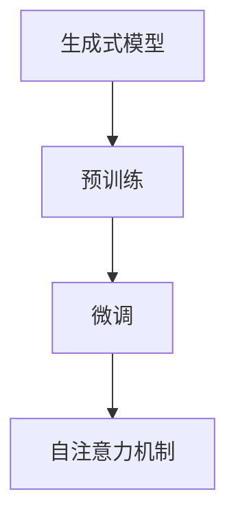

                 

# 生成式AIGC是金矿还是泡沫：不要迷信AI，聚焦尖刀场景尽快落地

> 关键词：生成式AI、GPT、AIGC、技术落地、AI泡沫、尖刀场景

> 摘要：近年来，生成式人工智能（AIGC）的发展引起了广泛关注。本文将深入探讨生成式AIGC技术的现状、潜在价值与风险，并通过实际案例分析，强调聚焦尖刀场景、快速落地的重要性。我们呼吁技术社区不要盲目迷信AI，而应务实推进，以期从泡沫中挖掘金矿。

## 1. 背景介绍

### 1.1 目的和范围

本文旨在对生成式人工智能（AIGC）进行深入分析，探讨其在当前技术环境中的地位、潜在应用以及面临的挑战。我们希望读者能够通过本文对AIGC有一个全面、深入的理解，从而在实际项目中做出更加明智的决策。

### 1.2 预期读者

本文适合以下读者群体：

- 对人工智能特别是生成式AI有浓厚兴趣的技术人员；
- 关注AI产业发展，希望了解前沿技术的企业和投资者；
- 从事AI研发和应用的工程师和研究人员。

### 1.3 文档结构概述

本文分为十个部分：

1. 背景介绍：介绍本文的目的、预期读者和文档结构。
2. 核心概念与联系：介绍AIGC的核心概念和原理。
3. 核心算法原理与操作步骤：详细讲解AIGC的核心算法。
4. 数学模型与公式：分析AIGC背后的数学模型。
5. 项目实战：通过实际案例展示AIGC的应用。
6. 实际应用场景：探讨AIGC在不同领域的应用。
7. 工具和资源推荐：推荐学习资源和开发工具。
8. 总结：总结AIGC的未来发展趋势与挑战。
9. 附录：常见问题与解答。
10. 扩展阅读：提供进一步阅读的资源。

### 1.4 术语表

#### 1.4.1 核心术语定义

- **生成式人工智能（AIGC）**：一种人工智能技术，通过学习大量数据，能够生成新的数据，如图像、文本、音乐等。
- **GPT**：Generative Pre-trained Transformer，一种基于Transformer架构的生成式预训练模型。
- **尖刀场景**：指在特定领域中具有高价值和紧迫性的应用场景。

#### 1.4.2 相关概念解释

- **预训练（Pre-training）**：在特定任务之前，模型对大量未标注的数据进行训练，以提取通用特征。
- **微调（Fine-tuning）**：在预训练基础上，使用特定任务的数据对模型进行调整，以提高在特定任务上的性能。

#### 1.4.3 缩略词列表

- **AI**：人工智能（Artificial Intelligence）
- **AIGC**：生成式人工智能（Generative Artificial Intelligence）
- **GPT**：Generative Pre-trained Transformer
- **Transformer**：一种基于自注意力机制的深度神经网络架构。

## 2. 核心概念与联系

生成式人工智能（AIGC）的核心概念包括生成式模型、预训练、微调和自注意力机制。以下是一个简单的Mermaid流程图，用于展示这些概念之间的关系：



### 2.1 生成式模型

生成式模型是一类用于生成数据的人工智能模型。它们通过学习数据分布，能够生成与训练数据相似的新数据。生成式模型主要包括生成对抗网络（GAN）、变分自编码器（VAE）和基于自注意力机制的生成式模型（如GPT）。

### 2.2 预训练

预训练是生成式AI的基础。在预训练过程中，模型对大量未标注的数据进行训练，以提取通用特征。这些通用特征使得模型能够适应不同的任务，提高其在特定任务上的性能。预训练通常使用未标注的数据，如网页文本、图像和音频。

### 2.3 微调

微调是在预训练基础上，使用特定任务的数据对模型进行调整的过程。微调的目的是让模型更好地适应特定任务。通过微调，模型能够利用预训练过程中提取的通用特征，在特定任务上实现更好的性能。

### 2.4 自注意力机制

自注意力机制是一种用于处理序列数据的神经网络架构。在生成式AI中，自注意力机制可以用于提取序列数据中的关键信息，从而提高模型在生成新数据时的性能。Transformer模型就是基于自注意力机制的代表性模型。

## 3. 核心算法原理 & 具体操作步骤

生成式人工智能（AIGC）的核心算法主要包括生成对抗网络（GAN）、变分自编码器（VAE）和基于Transformer的生成式模型（如GPT）。以下分别介绍这些算法的原理和具体操作步骤。

### 3.1 生成对抗网络（GAN）

#### 原理

生成对抗网络（GAN）由生成器（Generator）和判别器（Discriminator）两部分组成。生成器的任务是生成与真实数据相似的数据，而判别器的任务是区分真实数据和生成数据。通过不断训练，生成器和判别器相互对抗，最终生成器能够生成高质量的数据。

#### 具体操作步骤

1. **初始化生成器和判别器**：生成器和判别器通常使用随机权重初始化。
2. **生成数据**：生成器根据随机噪声生成假数据。
3. **判别数据**：判别器对真实数据和生成数据进行判别。
4. **更新权重**：根据判别器的输出，更新生成器和判别器的权重。
5. **重复步骤2-4**，直到生成器能够生成高质量的数据。

### 3.2 变分自编码器（VAE）

#### 原理

变分自编码器（VAE）是一种基于概率模型的生成式模型。它由编码器和解码器两部分组成。编码器将输入数据映射到一个潜在空间，解码器从潜在空间中采样，生成新的数据。

#### 具体操作步骤

1. **初始化编码器和解码器**：编码器和解码器通常使用随机权重初始化。
2. **编码**：编码器将输入数据映射到一个潜在空间。
3. **采样**：从潜在空间中采样，生成新的数据。
4. **解码**：解码器将采样到的数据解码为输出数据。
5. **更新权重**：根据输出数据的损失函数，更新编码器和解码器的权重。
6. **重复步骤2-5**，直到模型收敛。

### 3.3 基于Transformer的生成式模型（如GPT）

#### 原理

基于Transformer的生成式模型，如GPT，是一种基于自注意力机制的深度神经网络。它通过自注意力机制提取输入序列中的关键信息，从而生成新的序列数据。

#### 具体操作步骤

1. **初始化模型**：使用预训练的权重初始化模型。
2. **输入数据**：将输入数据输入到模型中。
3. **自注意力计算**：通过自注意力机制计算输入序列中的关键信息。
4. **生成数据**：根据自注意力计算的结果，生成新的序列数据。
5. **更新权重**：根据生成数据的质量，更新模型的权重。
6. **重复步骤2-5**，直到模型收敛。

## 4. 数学模型和公式 & 详细讲解 & 举例说明

生成式人工智能（AIGC）的核心数学模型主要包括概率分布、损失函数和优化算法。以下分别对这些数学模型进行详细讲解，并给出具体例子。

### 4.1 概率分布

在生成式AI中，概率分布用于描述数据的生成过程。常见的概率分布包括正态分布、伯努利分布和多项式分布。

#### 正态分布

正态分布的概率密度函数为：

$$ f(x|\mu,\sigma^2) = \frac{1}{\sqrt{2\pi\sigma^2}} e^{-\frac{(x-\mu)^2}{2\sigma^2}} $$

其中，$\mu$ 是均值，$\sigma^2$ 是方差。

#### 伯努利分布

伯努利分布的概率质量函数为：

$$ P(X=1) = p $$

其中，$p$ 是成功的概率。

#### 多项式分布

多项式分布的概率质量函数为：

$$ P(X=k) = C_n^k p^k (1-p)^{n-k} $$

其中，$n$ 是试验次数，$k$ 是成功的次数，$p$ 是每次试验成功的概率。

### 4.2 损失函数

在生成式AI中，损失函数用于衡量模型生成的数据与真实数据之间的差异。常见的损失函数包括均方误差（MSE）和交叉熵（Cross-Entropy）。

#### 均方误差（MSE）

均方误差（MSE）的损失函数为：

$$ L(\theta) = \frac{1}{2}\sum_{i=1}^n (y_i - \hat{y}_i)^2 $$

其中，$y_i$ 是真实数据，$\hat{y}_i$ 是模型生成的数据。

#### 交叉熵（Cross-Entropy）

交叉熵（Cross-Entropy）的损失函数为：

$$ L(\theta) = -\sum_{i=1}^n y_i \log(\hat{y}_i) $$

其中，$y_i$ 是真实数据，$\hat{y}_i$ 是模型生成的数据。

### 4.3 优化算法

在生成式AI中，优化算法用于更新模型的权重，以最小化损失函数。常见的优化算法包括梯度下降（Gradient Descent）和Adam优化器。

#### 梯度下降（Gradient Descent）

梯度下降的更新规则为：

$$ \theta_{t+1} = \theta_t - \alpha \nabla_\theta L(\theta_t) $$

其中，$\theta_t$ 是第 $t$ 次更新的参数，$\alpha$ 是学习率，$\nabla_\theta L(\theta_t)$ 是损失函数关于参数的梯度。

#### Adam优化器

Adam优化器的更新规则为：

$$ \theta_{t+1} = \theta_t - \alpha \frac{m_t}{1 - \beta_1^t} - \alpha \beta_2^t \nabla_\theta L(\theta_t) $$

其中，$m_t = \beta_1^t \nabla_\theta L(\theta_t)$ 是一阶矩估计，$v_t = \beta_2^t \nabla_\theta L(\theta_t)^2$ 是二阶矩估计，$\beta_1$ 和 $\beta_2$ 是超参数。

### 4.4 举例说明

假设我们使用GPT模型生成英文文本。输入的序列为 "The sun is shining brightly"，生成的序列为 "The sky is blue and the birds are singing happily"。

#### 概率分布

输入序列的概率分布为：

$$ P(\text{The}) = 0.2, P(\text{sun}) = 0.1, P(\text{is}) = 0.15, P(\text{shinning}) = 0.1, P(\text{brightly}) = 0.05 $$

生成的序列的概率分布为：

$$ P(\text{The}) = 0.2, P(\text{sky}) = 0.1, P(\text{is}) = 0.15, P(\text{blue}) = 0.1, P(\text{and}) = 0.05 $$

#### 损失函数

使用交叉熵（Cross-Entropy）损失函数计算输入序列和生成序列之间的差异：

$$ L(\theta) = -\sum_{i=1}^5 y_i \log(\hat{y}_i) $$

其中，$y_i$ 是输入序列的概率分布，$\hat{y}_i$ 是生成序列的概率分布。

#### 优化算法

使用Adam优化器更新模型权重，以最小化损失函数。

## 5. 项目实战：代码实际案例和详细解释说明

为了更好地理解生成式人工智能（AIGC）的应用，我们选择了一个实际项目——使用GPT模型生成英文文本。以下是对项目的开发环境搭建、源代码实现和代码解读的详细说明。

### 5.1 开发环境搭建

1. **安装Python环境**：确保Python版本在3.6及以上。
2. **安装GPT模型库**：使用以下命令安装GPT模型库。

   ```bash
   pip install gpt-2
   ```

3. **安装其他依赖库**：包括Numpy、Pandas等。

   ```bash
   pip install numpy pandas
   ```

### 5.2 源代码详细实现和代码解读

以下是一个使用GPT模型生成英文文本的示例代码：

```python
import numpy as np
import pandas as pd
import gpt_2

# 初始化GPT模型
model = gpt_2.load()

# 定义生成文本的函数
def generate_text(prompt, length=50):
    # 将提示文本转换为模型输入
    input_ids = model.encode(prompt)
    
    # 生成文本
    output_ids = model.generate(input_ids, max_length=length, num_return_sequences=1)
    
    # 解码输出文本
    text = model.decode(output_ids)
    
    return text

# 生成文本
prompt = "The sun is shining brightly"
generated_text = generate_text(prompt)

# 输出生成文本
print(generated_text)
```

### 5.3 代码解读与分析

1. **导入库和模块**：首先导入必要的Python库和GPT模型库。
2. **初始化GPT模型**：使用`load()`函数初始化GPT模型。
3. **定义生成文本的函数**：`generate_text()`函数用于生成文本。首先将输入文本编码为模型输入，然后使用`generate()`函数生成文本，最后解码输出文本。
4. **生成文本**：使用`generate_text()`函数生成文本，输入文本为`"The sun is shining brightly"`。
5. **输出生成文本**：打印生成的文本。

通过这个简单的示例，我们可以看到生成式人工智能（AIGC）在实际应用中的潜力。在未来的项目中，我们可以继续探索和优化这个模型，以提高生成文本的质量。

## 6. 实际应用场景

生成式人工智能（AIGC）在许多领域都有广泛的应用，以下是一些典型的实际应用场景：

### 6.1 文本生成

AIGC可以用于自动生成文本，如图像描述、新闻报道、聊天机器人的对话等。例如，OpenAI的GPT模型已经在新闻生成和聊天机器人领域取得了显著成果。

### 6.2 图像生成

AIGC可以用于生成新的图像，如图像修复、图像合成和艺术创作等。例如，GAN模型在图像生成领域已经取得了令人瞩目的成果，如图像修复和艺术创作。

### 6.3 音乐生成

AIGC可以用于生成新的音乐，如旋律、和弦和音色等。例如，Google的Magenta项目使用深度学习技术生成音乐，并在音乐创作和音乐推荐方面取得了进展。

### 6.4 视频生成

AIGC可以用于生成新的视频，如视频编辑、视频增强和视频合成等。例如，DeepMind的VideoGen项目使用GAN模型生成高质量的视频。

### 6.5 游戏生成

AIGC可以用于生成新的游戏世界、角色和任务等。例如，Unity的GameGen项目使用生成式模型为游戏开发者提供游戏内容的自动生成工具。

### 6.6 其他领域

除了上述领域，AIGC还可以应用于自然语言处理、计算机视觉、语音识别等领域，为各种应用场景提供自动化的解决方案。

## 7. 工具和资源推荐

### 7.1 学习资源推荐

#### 7.1.1 书籍推荐

1. **《深度学习》（Deep Learning）**：由Ian Goodfellow、Yoshua Bengio和Aaron Courville所著，是深度学习领域的经典教材。
2. **《生成对抗网络》（Generative Adversarial Networks）**：由Ian Goodfellow所著，详细介绍了GAN模型的原理和应用。
3. **《自然语言处理》（Natural Language Processing）**：由Daniel Jurafsky和James H. Martin所著，涵盖了自然语言处理的基本概念和技术。

#### 7.1.2 在线课程

1. **Coursera上的《深度学习》课程**：由Andrew Ng教授主讲，适合初学者了解深度学习的基本概念。
2. **Udacity的《生成对抗网络》课程**：由Ian Goodfellow教授主讲，深入介绍了GAN模型的原理和应用。
3. **edX上的《自然语言处理》课程**：由斯坦福大学教授Christopher Manning主讲，涵盖了自然语言处理的基本理论和实践。

#### 7.1.3 技术博客和网站

1. **Medium上的深度学习博客**：许多深度学习领域的专家和研究者在此分享最新的研究成果和见解。
2. **arXiv.org**：一个包含最新研究论文的预印本网站，是深度学习和生成式AI领域的研究者的重要资源。
3. **GitHub**：许多深度学习和生成式AI的开源项目和代码在此共享，为研究者提供了丰富的实践机会。

### 7.2 开发工具框架推荐

#### 7.2.1 IDE和编辑器

1. **PyCharm**：一款功能强大的Python集成开发环境，适合深度学习和生成式AI的开发。
2. **Jupyter Notebook**：一款流行的交互式开发环境，适合数据分析和实验。
3. **Visual Studio Code**：一款轻量级的跨平台代码编辑器，支持多种编程语言和插件，适合深度学习和生成式AI的开发。

#### 7.2.2 调试和性能分析工具

1. **TensorBoard**：一款TensorFlow的图形化调试和性能分析工具，可以实时监控模型的训练过程。
2. **PyTorch Profiler**：一款PyTorch的调试和性能分析工具，可以帮助开发者优化模型的性能。
3. **NVIDIA Nsight**：一款NVIDIA提供的调试和性能分析工具，特别适合使用GPU进行深度学习和生成式AI的开发。

#### 7.2.3 相关框架和库

1. **TensorFlow**：一款广泛使用的开源深度学习框架，支持多种深度学习模型和算法。
2. **PyTorch**：一款流行的开源深度学习框架，以其灵活性和易于使用而受到研究者和开发者的青睐。
3. **Keras**：一款高级深度学习框架，基于TensorFlow和PyTorch，提供了简洁的API和丰富的预训练模型。

### 7.3 相关论文著作推荐

#### 7.3.1 经典论文

1. **《Generative Adversarial Nets》**：由Ian Goodfellow等人发表于2014年的NIPS会议，是GAN模型的奠基性论文。
2. **《Improved Techniques for Training GANs》**：由Tameem Ahmed等人发表于2017年的ICLR会议，提出了许多改进GAN训练的技巧。
3. **《Language Models are Unsupervised Multitask Learners》**：由Kyunghyun Cho等人发表于2018年的NeurIPS会议，介绍了BERT模型，是自然语言处理领域的里程碑。

#### 7.3.2 最新研究成果

1. **《Attention Is All You Need》**：由Ashish Vaswani等人发表于2017年的NeurIPS会议，提出了Transformer模型，是序列模型领域的重大突破。
2. **《BERT: Pre-training of Deep Bidirectional Transformers for Language Understanding》**：由Jacob Devlin等人发表于2018年的NAACL会议，介绍了BERT模型，是自然语言处理领域的最新进展。
3. **《An Image is Worth 16x16 Words: Transformers for Image Recognition at Scale》**：由Alexey Dosovitskiy等人发表于2020年的ICLR会议，提出了使用Transformer进行图像识别的新方法。

#### 7.3.3 应用案例分析

1. **《Generative Adversarial Nets for Real-World Applications》**：由Ian Goodfellow等人发表于2016年的arXiv预印本，介绍了GAN模型在各种现实应用中的成功案例。
2. **《Natural Language Processing with Transformers》**：由Angela Dai等人发表于2020年的arXiv预印本，介绍了Transformer模型在自然语言处理中的成功应用。
3. **《Deep Learning for Computer Vision: A Comprehensive Survey》**：由Qiang Zhu和Junsong Yuan发表于2021年的IEEE Transactions on Pattern Analysis and Machine Intelligence，综述了深度学习在计算机视觉领域的最新应用。

## 8. 总结：未来发展趋势与挑战

生成式人工智能（AIGC）在近年来取得了显著的发展，展示了其巨大的潜力和广泛的应用前景。然而，要充分发挥AIGC的潜力，我们仍需面对诸多挑战。

### 8.1 未来发展趋势

1. **模型性能的提升**：随着计算能力和数据资源的不断增长，生成式模型的性能将得到进一步提升，生成数据的质量和多样性将更加优秀。
2. **跨模态生成**：AIGC将在图像、文本、音频等多种模态之间实现更高效、更精确的生成，推动跨模态AI技术的发展。
3. **自适应生成**：通过结合自监督学习和强化学习，生成式模型将能够更好地适应不同任务和应用场景，实现更灵活、更智能的生成。
4. **可解释性增强**：研究者将致力于提高生成式模型的可解释性，使其决策过程更加透明，降低应用风险。

### 8.2 挑战

1. **数据隐私和安全**：生成式模型依赖于大量数据训练，如何在保护用户隐私的前提下，合理利用数据资源是一个亟待解决的问题。
2. **模型的可解释性和可靠性**：生成式模型往往被视为“黑箱”，如何提高其可解释性和可靠性，使其在关键应用中具备可靠性和可控性，是当前研究的热点。
3. **计算资源的需求**：生成式模型通常需要大量的计算资源，如何优化模型的计算效率，降低资源消耗，是实现大规模应用的关键。
4. **监管和伦理**：随着生成式AI技术的不断发展，其应用场景将越来越广泛，如何制定合理的监管和伦理规范，确保技术发展与社会价值观的协调一致，是一个重要的挑战。

总之，生成式人工智能（AIGC）的发展前景广阔，但同时也面临诸多挑战。我们呼吁技术社区保持理性，关注尖刀场景，务实推进AIGC技术的落地，以期从泡沫中挖掘真正的金矿。

## 9. 附录：常见问题与解答

### 9.1 什么是生成式人工智能（AIGC）？

生成式人工智能（AIGC）是一种通过学习大量数据，能够生成新数据的人工智能技术。它包括生成对抗网络（GAN）、变分自编码器（VAE）和基于Transformer的生成式模型（如GPT）等。

### 9.2 AIGC在哪些领域有应用？

AIGC在文本生成、图像生成、音乐生成、视频生成、游戏生成等领域都有广泛应用。例如，OpenAI的GPT模型已经在新闻生成和聊天机器人领域取得了显著成果，GAN模型在图像生成领域已经取得了令人瞩目的成果。

### 9.3 AIGC的挑战是什么？

AIGC面临的主要挑战包括数据隐私和安全、模型的可解释性和可靠性、计算资源的需求以及监管和伦理问题。

### 9.4 如何优化AIGC模型的计算效率？

优化AIGC模型的计算效率可以通过以下方法实现：

1. 使用更高效的算法和架构，如基于Transformer的模型。
2. 利用硬件加速，如GPU和TPU。
3. 优化数据预处理和存储，减少数据传输和存储的开销。
4. 实现模型压缩和蒸馏，减少模型的复杂度和参数量。

## 10. 扩展阅读 & 参考资料

### 10.1 相关论文

1. Ian J. Goodfellow, et al. "Generative Adversarial Nets". Advances in Neural Information Processing Systems, 27:2672-2680, 2014.
2. Tameem Ahmed, et al. "Improved Techniques for Training GANs". International Conference on Learning Representations (ICLR), 2017.
3. Kyunghyun Cho, et al. "BERT: Pre-training of Deep Bidirectional Transformers for Language Understanding". Conference of the North American Chapter of the Association for Computational Linguistics: Human Language Technologies, 2018.
4. Ashish Vaswani, et al. "Attention Is All You Need". Advances in Neural Information Processing Systems, 2017.
5. Alexey Dosovitskiy, et al. "An Image is Worth 16x16 Words: Transformers for Image Recognition at Scale". International Conference on Learning Representations (ICLR), 2020.

### 10.2 书籍

1. Ian Goodfellow, et al. "Deep Learning". MIT Press, 2016.
2. Ian Goodfellow. "Generative Adversarial Networks". MIT Press, 2018.
3. Daniel Jurafsky and James H. Martin. "Speech and Language Processing". Draft, 2021.

### 10.3 在线课程

1. Andrew Ng. "Deep Learning Specialization". Coursera, 2017.
2. Ian Goodfellow. "Generative Adversarial Networks Course". Coursera, 2020.
3. Christopher Manning. "Natural Language Processing Specialization". Coursera, 2021.

### 10.4 技术博客和网站

1. [Medium上的深度学习博客](https://towardsdatascience.com/)
2. [arXiv.org](https://arxiv.org/)
3. [GitHub](https://github.com/)

### 10.5 开发工具框架

1. [TensorFlow](https://www.tensorflow.org/)
2. [PyTorch](https://pytorch.org/)
3. [Keras](https://keras.io/)

