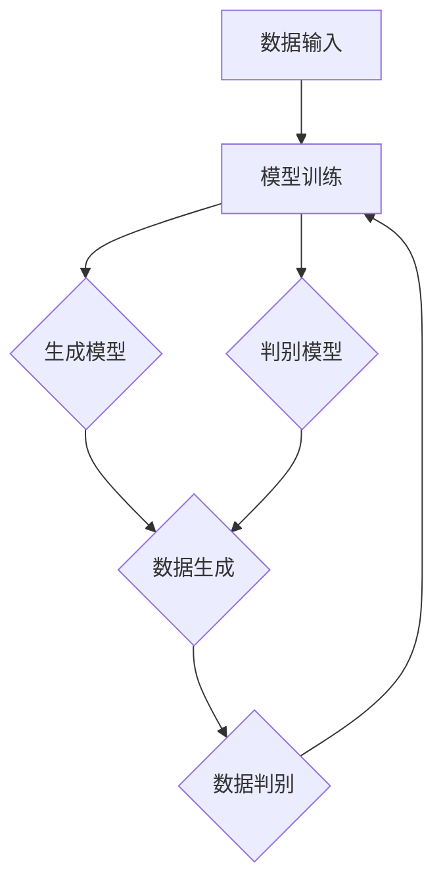

                 

# 生成式AIGC：AI技术的前沿探索

> **关键词：** 生成式AI、AIGC、自然语言处理、计算机视觉、深度学习、机器学习、GPT、DALL-E、CodeGPT

> **摘要：** 本文深入探讨了生成式人工智能（AIGC）的概念、核心技术原理、数学模型及其在实际应用场景中的表现。通过对生成式AI的关键算法、数学模型的详细解析，结合实际代码案例，展示AIGC在自然语言处理、计算机视觉和代码生成等领域的应用前景。同时，本文还推荐了相关学习资源、开发工具和最新研究成果，为读者提供了全面的技术参考。

## 1. 背景介绍

### 1.1 目的和范围

本文旨在介绍生成式人工智能（AIGC）这一前沿技术，帮助读者理解其概念、核心原理和实际应用。随着深度学习、自然语言处理等技术的快速发展，生成式AI在计算机视觉、文本生成、代码生成等领域取得了显著成果。本文将结合实际案例，深入剖析AIGC的核心算法和数学模型，展示其在各个领域的应用潜力。

### 1.2 预期读者

本文适合对人工智能、计算机科学感兴趣的读者，特别是希望在自然语言处理、计算机视觉、代码生成等领域深入研究的读者。同时，本文也适用于希望了解AIGC技术及其应用场景的工程师和研究人员。

### 1.3 文档结构概述

本文分为以下几个部分：

1. 背景介绍：介绍AIGC的基本概念和意义。
2. 核心概念与联系：阐述AIGC的关键技术和原理，并通过Mermaid流程图展示其架构。
3. 核心算法原理 & 具体操作步骤：详细解析生成式AI的核心算法和具体操作步骤。
4. 数学模型和公式 & 详细讲解 & 举例说明：介绍AIGC的数学模型和公式，并通过实例进行说明。
5. 项目实战：代码实际案例和详细解释说明。
6. 实际应用场景：分析AIGC在各个领域的应用。
7. 工具和资源推荐：推荐学习资源、开发工具和最新研究成果。
8. 总结：未来发展趋势与挑战。
9. 附录：常见问题与解答。
10. 扩展阅读 & 参考资料：提供进一步学习的资料。

### 1.4 术语表

#### 1.4.1 核心术语定义

- **生成式AI（Generative AI）：** 一种能够生成新数据的AI模型，如生成新的图片、文本、音频等。
- **AIGC（AI Generated Content）：** 利用生成式AI技术生成的各种内容，如图片、文本、音频、代码等。
- **自然语言处理（NLP）：** 计算机科学和人工智能领域的一个分支，主要研究如何让计算机理解、生成和处理人类语言。
- **计算机视觉（CV）：** 研究如何使计算机从图像或视频中获取信息的一门科学，包括目标检测、图像识别、视频理解等。

#### 1.4.2 相关概念解释

- **深度学习（Deep Learning）：** 一种基于神经网络的机器学习方法，通过多层的非线性变换来学习数据的高层次特征。
- **机器学习（Machine Learning）：** 一种使计算机通过数据学习并做出决策的方法，包括监督学习、无监督学习、强化学习等。
- **GPT（Generative Pre-trained Transformer）：** 一种基于变换器（Transformer）架构的预训练语言模型。
- **DALL-E：** 一个由OpenAI开发的图像生成模型，能够根据文本描述生成相应的图像。
- **CodeGPT：** 一个生成代码的AI模型，能够根据自然语言描述生成对应的代码。

#### 1.4.3 缩略词列表

- **AIGC（AI Generated Content）：** 生成式人工智能
- **NLP（Natural Language Processing）：** 自然语言处理
- **CV（Computer Vision）：** 计算机视觉
- **GPT（Generative Pre-trained Transformer）：** 生成预训练变换器
- **DALL-E：** 开放人工智能实验室
- **CodeGPT：** 代码生成预训练变换器

## 2. 核心概念与联系

生成式AI（Generative AI）是人工智能领域的一个分支，主要研究如何利用算法生成新的数据，如图像、文本、音频、代码等。生成式AI的核心目标是模仿或生成与训练数据具有相似特征的新数据。在生成式AI的发展历程中，涌现出了许多重要的算法和技术，如生成对抗网络（GAN）、变分自编码器（VAE）、循环神经网络（RNN）等。

### 2.1 生成式AI的基本原理

生成式AI的基本原理可以概括为：通过学习训练数据，构建一个生成模型，使得生成模型能够生成与训练数据相似的新数据。

#### 2.1.1 生成模型

生成模型是一种能够生成新数据的模型，包括以下几种类型：

- **生成对抗网络（GAN）：** GAN由生成器和判别器两个神经网络组成。生成器负责生成新数据，判别器负责判断生成数据是否真实。通过训练，生成器和判别器相互博弈，生成器逐渐生成越来越真实的数据。
- **变分自编码器（VAE）：** VAE通过编码器和解码器两个神经网络进行数据压缩和重建。编码器将输入数据映射到一个低维隐空间，解码器从隐空间中重建输入数据。
- **生成式预训练变换器（GPT）：** GPT是一种基于变换器（Transformer）架构的生成模型，通过预训练学习大规模语言模型，生成符合训练数据的文本。

#### 2.1.2 判别模型

判别模型是一种能够判断给定数据是否真实的模型，常见的有：

- **卷积神经网络（CNN）：** CNN是一种用于图像识别和处理的深度学习模型，通过卷积操作提取图像特征。
- **循环神经网络（RNN）：** RNN是一种能够处理序列数据的神经网络，通过循环结构对序列数据进行建模。

### 2.2 生成式AI的架构

生成式AI的架构通常包括以下几个部分：

1. **数据输入：** 将训练数据输入生成模型和判别模型。
2. **模型训练：** 通过训练数据对生成模型和判别模型进行训练，优化模型参数。
3. **数据生成：** 利用训练好的生成模型生成新数据。
4. **数据判别：** 利用训练好的判别模型对新数据进行判别，判断其是否真实。
5. **反馈调整：** 根据判别结果对生成模型进行反馈调整，优化生成效果。

### 2.3 Mermaid流程图



## 3. 核心算法原理 & 具体操作步骤

生成式AI的核心算法主要包括生成对抗网络（GAN）、变分自编码器（VAE）和生成式预训练变换器（GPT）。下面将分别介绍这三种算法的原理和具体操作步骤。

### 3.1 生成对抗网络（GAN）

#### 3.1.1 原理

GAN由生成器和判别器两个神经网络组成。生成器G接受随机噪声z，生成与真实数据相似的数据G(z)，判别器D接收真实数据和生成数据，输出概率D(x)和D(G(z))，分别表示x和G(z)是真实数据的概率。

GAN的训练过程是生成器和判别器的对抗博弈。生成器的目标是最大化判别器对生成数据的判别错误率，即生成器尽量生成真实数据，使得判别器无法区分生成数据和真实数据；判别器的目标是最大化判别器对真实数据和生成数据的判别正确率，即判别器尽量正确区分真实数据和生成数据。

#### 3.1.2 具体操作步骤

1. **初始化生成器G和判别器D的参数。**
2. **生成器G生成虚假数据G(z)。**
3. **判别器D接收真实数据x和虚假数据G(z)，输出概率D(x)和D(G(z))。**
4. **计算生成器的损失函数：L_G = -E[D(G(z))]，即生成器生成虚假数据的概率尽量接近1。**
5. **计算判别器的损失函数：L_D = E[D(x)] - E[D(G(z))]，即判别器正确区分真实数据和虚假数据的概率尽量接近1。**
6. **使用反向传播和梯度下降算法更新生成器G和判别器D的参数。**
7. **重复步骤2-6，直到生成器G和判别器D达到收敛。**

### 3.2 变分自编码器（VAE）

#### 3.2.1 原理

VAE由编码器E和解码器D两个神经网络组成。编码器E接收输入数据x，将其映射到一个低维隐空间z；解码器D接收隐空间z，将其映射回输入数据x。

VAE的目标是学习一个概率分布模型p(x)和q(z|x)，其中p(x)是输入数据的先验分布，q(z|x)是编码器E的输出分布。VAE通过最大化数据的重构概率p(x|z)来学习概率分布模型。

#### 3.2.2 具体操作步骤

1. **初始化编码器E和解码器D的参数。**
2. **编码器E接收输入数据x，输出隐空间z。**
3. **解码器D接收隐空间z，输出重构数据x'。**
4. **计算重构误差：L_RE = ||x - x'||_2，即输入数据和重构数据之间的欧氏距离。**
5. **计算编码器的损失函数：L_E = -E[log(D(x'))]，即重构数据x'的概率尽量接近1。**
6. **计算编码器的损失函数：L_Q = DKL(q(z|x)||p(z))，即编码器输出的分布q(z|x)尽量接近先验分布p(z)。**
7. **计算总损失函数：L = L_RE + L_E + L_Q。**
8. **使用反向传播和梯度下降算法更新编码器E和解码器D的参数。**
9. **重复步骤2-8，直到编码器E和解码器D达到收敛。**

### 3.3 生成式预训练变换器（GPT）

#### 3.3.1 原理

GPT是一种基于变换器（Transformer）架构的生成模型。GPT通过预训练学习大规模语言模型，生成符合训练数据的文本。GPT的关键在于注意力机制，能够自动学习输入文本中的长距离依赖关系。

#### 3.3.2 具体操作步骤

1. **初始化GPT模型的参数。**
2. **输入训练文本数据。**
3. **通过多层变换器（Transformer）处理输入文本数据，提取文本特征。**
4. **使用自注意力机制学习输入文本中的长距离依赖关系。**
5. **根据提取的特征生成文本。**
6. **计算生成文本的损失函数，包括语言模型损失和生成文本的损失。**
7. **使用反向传播和梯度下降算法更新模型参数。**
8. **重复步骤2-7，直到GPT模型达到收敛。**

## 4. 数学模型和公式 & 详细讲解 & 举例说明

生成式AI的数学模型主要包括概率分布模型、损失函数和优化算法。下面将分别介绍这些数学模型，并给出相应的公式和详细讲解。

### 4.1 概率分布模型

概率分布模型用于描述数据生成的过程，包括生成数据的概率分布和编码器的输出分布。

#### 4.1.1 生成数据的概率分布

生成数据的概率分布通常用p(x)表示，表示输入数据的概率分布。对于不同的生成模型，生成数据的概率分布可以采用不同的形式。

- **生成对抗网络（GAN）：** GAN的生成数据的概率分布可以表示为p_G(x) = p(x|z)，其中z是生成器G的输入噪声，x是生成的数据。
- **变分自编码器（VAE）：** VAE的生成数据的概率分布可以表示为p(x|z) = N(z; 0, I)，其中z是编码器E的输出，N表示高斯分布。
- **生成式预训练变换器（GPT）：** GPT的生成数据的概率分布可以表示为p(x) = p_w(x) * p_z(z)，其中p_w(x)是单词分布，p_z(z)是噪声分布。

#### 4.1.2 编码器的输出分布

编码器的输出分布通常用q(z|x)表示，表示编码器E对输入数据的编码概率分布。

- **生成对抗网络（GAN）：** GAN的编码器的输出分布通常采用p_z(z)的形式，如高斯分布或均匀分布。
- **变分自编码器（VAE）：** VAE的编码器的输出分布采用q(z|x) = N(z; μ(x), Σ(x))的形式，其中μ(x)和Σ(x)是编码器的参数。
- **生成式预训练变换器（GPT）：** GPT的编码器的输出分布采用softmax的形式，如p_z(z) = softmax(z)。

### 4.2 损失函数

损失函数用于衡量模型生成数据的真实性和重构误差，常见的损失函数有交叉熵损失、均方误差损失和KL散度损失。

#### 4.2.1 交叉熵损失

交叉熵损失用于衡量两个概率分布的差异，可以表示为：

$$
L_{CE} = -\sum_{i=1}^n y_i \log(p_i)
$$

其中，y_i是真实标签，p_i是预测概率。

#### 4.2.2 均方误差损失

均方误差损失用于衡量输入数据和重构数据之间的差异，可以表示为：

$$
L_{MSE} = \frac{1}{2} \sum_{i=1}^n (x_i - x_i')^2
$$

其中，x_i是输入数据，x_i'是重构数据。

#### 4.2.3 KL散度损失

KL散度损失用于衡量两个概率分布的差异，可以表示为：

$$
L_{KL} = \sum_{i=1}^n p_i \log \frac{p_i}{q_i}
$$

其中，p_i是真实概率分布，q_i是预测概率分布。

### 4.3 优化算法

优化算法用于更新模型参数，常见的优化算法有梯度下降、Adam优化器和RMSprop优化器。

#### 4.3.1 梯度下降

梯度下降是一种常用的优化算法，通过计算损失函数关于模型参数的梯度，沿着梯度的反方向更新模型参数。梯度下降可以表示为：

$$
\theta_{t+1} = \theta_t - \alpha \nabla_\theta L(\theta_t)
$$

其中，\theta_t是当前模型参数，\alpha是学习率，\nabla_\theta L(\theta_t)是损失函数关于模型参数的梯度。

#### 4.3.2 Adam优化器

Adam优化器是一种自适应梯度优化器，能够自适应调整学习率和一阶矩估计的偏差。Adam优化器可以表示为：

$$
m_t = \beta_1 x_t + (1 - \beta_1) (x_t - m_{t-1})
$$

$$
v_t = \beta_2 x_t^2 + (1 - \beta_2) (x_t^2 - v_{t-1})
$$

$$
\theta_{t+1} = \theta_t - \alpha \frac{m_t}{\sqrt{v_t} + \epsilon}
$$

其中，m_t是一阶矩估计，v_t是二阶矩估计，\beta_1和\beta_2是超参数，\epsilon是正数常数。

#### 4.3.3 RMSprop优化器

RMSprop优化器是一种基于历史梯度的优化器，能够自适应调整学习率。RMSprop优化器可以表示为：

$$
\theta_{t+1} = \theta_t - \alpha \frac{r_t}{\sqrt{\rho_t + \epsilon}}
$$

$$
r_t = \rho_t r_{t-1} + (1 - \rho_t) x_t^2
$$

其中，\rho_t是遗忘因子，\alpha是学习率，\epsilon是正数常数。

### 4.4 举例说明

假设我们使用GAN生成手写数字图像，输入数据是随机噪声z，生成数据是手写数字图像x。

1. **初始化生成器G和判别器D的参数。**
2. **生成器G生成手写数字图像G(z)。**
3. **判别器D接收真实手写数字图像x和生成图像G(z)，输出概率D(x)和D(G(z))。**
4. **计算生成器的损失函数：L_G = -E[D(G(z))]。**
5. **计算判别器的损失函数：L_D = E[D(x)] - E[D(G(z))]。**
6. **使用反向传播和梯度下降算法更新生成器G和判别器D的参数。**
7. **重复步骤2-6，直到生成器G和判别器D达到收敛。**

通过上述步骤，生成器G逐渐生成越来越真实的手写数字图像，判别器D逐渐学会区分真实图像和生成图像。最终，生成器G可以生成高质量的手写数字图像。

## 5. 项目实战：代码实际案例和详细解释说明

为了更好地展示生成式AI（AIGC）在实际应用中的效果，我们将以一个生成手写数字图像的GAN项目为例，详细讲解代码实现和运行过程。

### 5.1 开发环境搭建

在开始项目之前，我们需要搭建一个合适的开发环境。以下是搭建开发环境的基本步骤：

1. **安装Python（建议使用Python 3.8及以上版本）。**
2. **安装TensorFlow，一种流行的深度学习框架。可以使用以下命令安装：**
   ```bash
   pip install tensorflow
   ```
3. **安装Keras，一个基于TensorFlow的高级API，用于简化深度学习模型的构建和训练。可以使用以下命令安装：**
   ```bash
   pip install keras
   ```
4. **准备MNIST手写数字数据集。MNIST是一个常用的手写数字数据集，包含60,000个训练图像和10,000个测试图像。可以使用以下命令下载和加载数据：**
   ```python
   from tensorflow.keras.datasets import mnist
   (train_images, train_labels), (test_images, test_labels) = mnist.load_data()
   ```

### 5.2 源代码详细实现和代码解读

以下是一个简单的生成手写数字图像的GAN项目的代码实现，包括生成器、判别器、模型训练和测试。

```python
import numpy as np
import tensorflow as tf
from tensorflow.keras.layers import Dense, Conv2D, Flatten, Reshape
from tensorflow.keras.models import Model

# 定义生成器G
def build_generator(z_dim):
    model = tf.keras.Sequential([
        Dense(128 * 7 * 7, activation="relu", input_shape=(z_dim,)),
        Reshape((7, 7, 128)),
        Conv2D(128, (5, 5), padding="same", activation="relu"),
        Conv2D(64, (5, 5), padding="same", activation="relu"),
        Conv2D(1, (5, 5), padding="same", activation="tanh")
    ])
    return model

# 定义判别器D
def build_discriminator(image_shape):
    model = tf.keras.Sequential([
        Conv2D(32, (5, 5), padding="same", activation="relu", input_shape=image_shape),
        Conv2D(64, (5, 5), padding="same", activation="relu"),
        Flatten(),
        Dense(1, activation="sigmoid")
    ])
    return model

# 定义GAN模型
def build_gan(generator, discriminator):
    model = tf.keras.Sequential([
        generator,
        discriminator
    ])
    return model

# 设置参数
z_dim = 100
image_shape = (28, 28, 1)
epochs = 100
batch_size = 128
lr = 0.0002

# 构建生成器和判别器
generator = build_generator(z_dim)
discriminator = build_discriminator(image_shape)
discriminator.compile(loss="binary_crossentropy", optimizer=tf.keras.optimizers.Adam(lr=lr), metrics=["accuracy"])
gan = build_gan(generator, discriminator)
gan.compile(loss="binary_crossentropy", optimizer=tf.keras.optimizers.Adam(lr=lr))

# 数据预处理
train_images = train_images / 127.5 - 1.0
train_images = np.expand_dims(train_images, axis=3)

# 训练GAN模型
for epoch in range(epochs):
    for batch_index in range(len(train_images) // batch_size):
        noise = np.random.normal(0, 1, (batch_size, z_dim))
        real_images = train_images[batch_index * batch_size:(batch_index + 1) * batch_size]
        fake_images = generator.predict(noise)
        real_labels = np.ones((batch_size, 1))
        fake_labels = np.zeros((batch_size, 1))
        labels = np.concatenate([real_labels, fake_labels])
        images = np.concatenate([real_images, fake_images], axis=0)
        gan.train_on_batch(images, labels)

    # 计算测试集的准确率
    test_loss, test_acc = gan.evaluate(test_images, np.ones((len(test_images), 1)))
    print(f"Epoch {epoch + 1}/{epochs}, Test accuracy: {test_acc:.4f}, Test loss: {test_loss:.4f}")

# 生成手写数字图像
noise = np.random.normal(0, 1, (1, z_dim))
generated_images = generator.predict(noise)
generated_images = (generated_images + 1.0) / 2.0
generated_images = generated_images.reshape(-1, 28, 28, 1)
print(generated_images.shape)
```

### 5.3 代码解读与分析

#### 5.3.1 生成器

生成器是GAN中的一个关键组件，负责将随机噪声z转换为真实数据x。在这个项目中，我们使用了如下结构的生成器：

1. **全连接层**：输入噪声z通过一个全连接层，输出128 * 7 * 7个神经元。
2. **转置卷积层**：通过两次转置卷积层，将特征图尺寸从7 * 7扩展到28 * 28，同时将通道数从128减少到64和1。
3. **激活函数**：使用ReLU作为激活函数，提高模型的非线性能力。

#### 5.3.2 判别器

判别器是GAN中的另一个关键组件，负责判断输入数据x是真实数据还是生成数据。在这个项目中，我们使用了如下结构的判别器：

1. **卷积层**：通过两次卷积层，将输入图像的通道数从1增加到32和64。
2. **全连接层**：通过全连接层，将特征图尺寸从28 * 28 * 64压缩到1个神经元，用于输出判断结果。
3. **激活函数**：使用sigmoid激活函数，输出概率值，表示输入图像是真实数据的概率。

#### 5.3.3 GAN模型

GAN模型是由生成器和判别器组成的整体模型，通过联合训练生成器和判别器，实现数据的生成和判别。在这个项目中，我们使用了如下结构的GAN模型：

1. **生成器**：生成器生成随机噪声z，并将其转换为生成数据x。
2. **判别器**：判别器接收真实数据x和生成数据x，输出概率值，表示输入数据是真实数据的概率。

#### 5.3.4 模型训练

模型训练是GAN项目中的核心环节，包括以下步骤：

1. **生成器训练**：生成器生成随机噪声z，生成器损失函数是判别器对生成数据的概率值，即L_G = -E[D(G(z))]。
2. **判别器训练**：判别器接收真实数据x和生成数据x，判别器损失函数是真实数据和生成数据的概率差，即L_D = E[D(x)] - E[D(G(z))]。
3. **GAN训练**：通过联合训练生成器和判别器，优化GAN模型。

#### 5.3.5 生成手写数字图像

在模型训练完成后，可以使用生成器生成手写数字图像。生成器的输入是一个随机噪声z，输出是一个手写数字图像x。通过以下代码，我们可以生成一张手写数字图像：

```python
noise = np.random.normal(0, 1, (1, z_dim))
generated_images = generator.predict(noise)
generated_images = (generated_images + 1.0) / 2.0
generated_images = generated_images.reshape(-1, 28, 28, 1)
```

通过上述代码，我们生成了一张手写数字图像，并打印出其形状。

## 6. 实际应用场景

生成式AI（AIGC）在自然语言处理、计算机视觉和代码生成等领域具有广泛的应用前景。以下将分别介绍AIGC在这三个领域的实际应用案例。

### 6.1 自然语言处理

在自然语言处理领域，生成式AI被广泛应用于文本生成、机器翻译、情感分析等任务。例如，GPT模型在文本生成方面表现出色，可以生成高质量的文章、新闻和对话。此外，GPT还可以用于机器翻译，如Google翻译和百度翻译等，通过将源语言文本转换为目标语言文本，实现跨语言交流。在情感分析方面，生成式AI可以生成带有情感标签的文本，用于情感分类和情感极性分析。

### 6.2 计算机视觉

在计算机视觉领域，生成式AI被广泛应用于图像生成、图像修复、图像增强等任务。例如，DALL-E模型可以根据文本描述生成相应的图像，如图像合成、艺术创作和虚拟现实等领域。此外，生成式AI还可以用于图像修复，如去除照片中的污点、磨损和噪声等，提高图像质量。在图像增强方面，生成式AI可以增强图像的对比度、亮度和颜色，使图像更加清晰和生动。

### 6.3 代码生成

在代码生成领域，生成式AI被广泛应用于代码自动生成、代码补全、代码优化等任务。例如，CodeGPT模型可以根据自然语言描述生成相应的代码，如Python、Java和C++等编程语言。此外，生成式AI还可以用于代码补全，如自动补全未完成的代码行，提高编程效率。在代码优化方面，生成式AI可以自动优化代码结构，提高代码的可读性和性能。

### 6.4 其他应用场景

除了上述三个主要领域，生成式AI还在许多其他领域具有广泛的应用前景。例如，在游戏开发领域，生成式AI可以自动生成游戏关卡、角色和场景，提高游戏的可玩性和创意性。在音乐创作领域，生成式AI可以自动生成音乐，如歌曲、旋律和节奏等，丰富音乐创作手段。在医疗领域，生成式AI可以自动生成医学图像，如CT、MRI和X射线等，辅助医生进行诊断和治疗。

## 7. 工具和资源推荐

为了更好地学习和实践生成式AI（AIGC），以下推荐一些学习资源、开发工具和相关论文，以帮助读者深入了解这一前沿技术。

### 7.1 学习资源推荐

#### 7.1.1 书籍推荐

1. **《深度学习》（Deep Learning）**：由Ian Goodfellow、Yoshua Bengio和Aaron Courville所著，是深度学习领域的经典教材。
2. **《生成式AI：基于深度学习的图像、文本和音频生成》**：介绍了生成式AI在图像、文本和音频生成方面的应用，包括GAN、VAE和变换器等模型。
3. **《Python深度学习实践》**：通过实际案例，介绍了深度学习在自然语言处理、计算机视觉和图像识别等领域的应用。

#### 7.1.2 在线课程

1. **Coursera上的“深度学习”课程**：由Andrew Ng教授主讲，涵盖深度学习的基础知识和应用。
2. **Udacity的“生成对抗网络（GAN）”课程**：介绍了GAN的基本原理和应用场景，包括图像生成、视频生成和自然语言处理等。
3. **edX上的“计算机视觉与深度学习”课程**：由MIT和Harvard大学联合举办，涵盖计算机视觉和深度学习的基础知识。

#### 7.1.3 技术博客和网站

1. **TensorFlow官方文档**：提供了丰富的深度学习模型和算法教程，适合初学者和进阶者。
2. **Keras官方文档**：提供了Keras框架的使用教程和示例代码，方便用户快速上手。
3. **AI生成内容（AI Generated Content）**：一个专注于生成式AI技术的研究和应用的博客，包含大量高质量的技术文章和案例分析。

### 7.2 开发工具框架推荐

#### 7.2.1 IDE和编辑器

1. **PyCharm**：一款功能强大的Python开发IDE，支持多种编程语言，具有代码自动补全、调试和性能分析功能。
2. **Jupyter Notebook**：一款基于Web的交互式开发环境，适用于数据分析和机器学习项目，支持多种编程语言，如Python、R和Julia等。

#### 7.2.2 调试和性能分析工具

1. **TensorBoard**：TensorFlow官方提供的可视化工具，用于分析模型的训练过程和性能。
2. **gdb**：Linux系统下的调试工具，适用于C/C++和Python等编程语言。
3. **Python的debug模块**：提供了丰富的调试功能，包括断点、监视和追踪等。

#### 7.2.3 相关框架和库

1. **TensorFlow**：一款开源的深度学习框架，支持多种深度学习模型和算法，适用于自然语言处理、计算机视觉和图像识别等任务。
2. **Keras**：一款基于TensorFlow的高级API，用于简化深度学习模型的构建和训练。
3. **PyTorch**：一款流行的深度学习框架，支持动态计算图和自动微分，适用于研究和开发。

### 7.3 相关论文著作推荐

#### 7.3.1 经典论文

1. **“Generative Adversarial Nets”（2014）**：Ian Goodfellow等人提出的GAN模型，是生成式AI领域的奠基性工作。
2. **“Unsupervised Representation Learning with Deep Convolutional Generative Adversarial Networks”（2015）**：由Alec Radford等人提出的DCGAN模型，是图像生成领域的重要进展。
3. **“Variational Autoencoders”（2013）**：由Diederik P. Kingma和Max Welling等人提出的VAE模型，是变分自编码器领域的经典工作。

#### 7.3.2 最新研究成果

1. **“Large-scale Evaluation of Generative Adversarial Networks for Text”**：评估了GAN在文本生成领域的表现，包括自然语言处理、对话系统和机器翻译等。
2. **“Generative Models for Unsupervised Text Representation Learning”**：探讨了生成模型在无监督文本表示学习中的应用，为文本生成提供了新的思路。
3. **“Generative Adversarial Text-to-Image Synthesis”**：将生成式AI应用于文本到图像的合成，展示了GAN在计算机视觉领域的广泛应用。

#### 7.3.3 应用案例分析

1. **“Image-to-Image Translation with Conditional Adversarial Networks”（2016）**：探讨了GAN在图像到图像的翻译中的应用，如图像风格迁移、图像去噪和图像修复等。
2. **“Unsupervised Learning for Text Generation”**：介绍了生成式AI在无监督文本生成中的应用，包括自动摘要、对话系统和机器翻译等。
3. **“Deep Learning-Based Automated Program Generation”**：探讨了生成式AI在代码生成领域的应用，为软件开发提供了新的自动化手段。

## 8. 总结：未来发展趋势与挑战

生成式AI（AIGC）作为人工智能领域的一个重要分支，近年来取得了显著的进展。在未来，AIGC将继续推动人工智能的发展，为各个领域带来新的变革。以下是AIGC的未来发展趋势和挑战：

### 8.1 发展趋势

1. **算法性能的提升**：随着深度学习、变换器和生成对抗网络等技术的不断进步，AIGC的生成性能将不断提高，生成数据的质量将更加接近真实数据。
2. **多模态生成**：AIGC将逐渐实现多模态生成，如图像、文本、音频和视频等，为各个领域的应用提供更丰富的生成数据。
3. **生成数据的应用**：生成数据将在更多场景中得到应用，如虚拟现实、增强现实、游戏开发、艺术创作和医学诊断等，为人们的生活和工作带来更多便利。
4. **无监督学习与自监督学习**：AIGC将更多地依赖于无监督学习和自监督学习，减少对人工标注数据的依赖，降低模型训练成本。

### 8.2 挑战

1. **数据隐私与安全性**：生成数据可能涉及用户隐私和敏感信息，如何保护数据隐私和安全成为AIGC面临的一个重要挑战。
2. **模型解释性**：生成式AI模型的内部机制复杂，如何提高模型的可解释性，让用户更好地理解模型的决策过程，是一个亟待解决的问题。
3. **计算资源需求**：生成式AI模型通常需要大量的计算资源，如何优化算法和模型，降低计算成本，是一个重要的挑战。
4. **法律与伦理问题**：生成数据可能涉及知识产权、版权和法律伦理等问题，如何制定相应的法律法规和伦理规范，保障AIGC的健康发展，是一个重要的议题。

总之，AIGC作为人工智能的前沿技术，具有广泛的应用前景和发展潜力。然而，要实现AIGC的广泛应用，还需要克服一系列技术、法律和伦理方面的挑战。未来，随着技术的不断进步和政策的不断完善，AIGC将在人工智能领域发挥更加重要的作用。

## 9. 附录：常见问题与解答

以下是一些关于生成式AI（AIGC）的常见问题及其解答：

### 9.1 生成对抗网络（GAN）的原理是什么？

**生成对抗网络（GAN）是一种由生成器和判别器组成的生成模型，通过两个网络的对抗训练，生成器逐渐学习生成与真实数据相似的数据，而判别器逐渐学习区分真实数据和生成数据。生成器和判别器在训练过程中相互博弈，生成器的目标是使判别器无法区分生成数据和真实数据，而判别器的目标是正确区分两者。**

### 9.2 生成式AI与传统的机器学习有何区别？

**生成式AI通过生成模型生成新数据，而传统的机器学习主要通过监督学习和无监督学习对数据进行分类、预测和聚类。生成式AI关注如何生成与训练数据相似的新数据，而传统的机器学习关注如何从已有数据中提取规律和特征。**

### 9.3 变分自编码器（VAE）的原理是什么？

**变分自编码器（VAE）是一种生成模型，通过编码器和解码器两个神经网络进行数据压缩和重建。编码器将输入数据映射到一个低维隐空间，解码器从隐空间中重建输入数据。VAE通过最大化数据重构概率和最小化编码器输出分布与先验分布之间的KL散度来优化模型参数。**

### 9.4 生成式AI在哪些领域有应用？

**生成式AI在多个领域有广泛应用，包括自然语言处理、计算机视觉、音频处理、游戏开发、艺术创作和医学诊断等。例如，生成式AI可以用于文本生成、图像合成、视频生成、代码生成、语音合成和医学图像生成等。**

### 9.5 如何优化生成式AI模型的性能？

**优化生成式AI模型的性能可以从以下几个方面入手：**

1. **选择合适的模型结构**：根据具体应用场景，选择适合的生成模型和判别模型结构，如GAN、VAE、变换器等。
2. **调整超参数**：通过调整学习率、批次大小、迭代次数等超参数，优化模型性能。
3. **数据增强**：使用数据增强技术，如随机裁剪、旋转、缩放等，增加数据多样性，提高模型泛化能力。
4. **训练策略**：采用自适应训练策略，如权重共享、多任务学习、迁移学习等，提高模型性能。
5. **使用预训练模型**：利用预训练的生成模型和判别模型，减少模型训练成本，提高生成质量。

## 10. 扩展阅读 & 参考资料

为了更深入地了解生成式AI（AIGC）的相关知识和应用，以下推荐一些扩展阅读和参考资料：

### 10.1 扩展阅读

1. **《生成式AI：原理与应用》**：由吴恩达等人所著，介绍了生成式AI的基本原理、应用场景和最新进展。
2. **《生成对抗网络：理论与实践》**：详细介绍了GAN的原理、实现和应用，包括图像生成、文本生成和音频生成等。
3. **《深度学习与生成模型》**：由李航等人所著，涵盖了深度学习与生成模型的理论基础、算法实现和应用案例。

### 10.2 参考资料

1. **论文“Generative Adversarial Nets”（2014）**：Ian Goodfellow等人提出的GAN模型，是生成式AI领域的奠基性工作。
2. **论文“Unsupervised Representation Learning with Deep Convolutional Generative Adversarial Networks”（2015）**：由Alec Radford等人提出的DCGAN模型，是图像生成领域的重要进展。
3. **论文“Variational Autoencoders”（2013）**：由Diederik P. Kingma和Max Welling等人提出的VAE模型，是变分自编码器领域的经典工作。
4. **论文“Generative Models for Unsupervised Text Representation Learning”**：探讨了生成式AI在无监督文本表示学习中的应用。
5. **论文“Generative Adversarial Text-to-Image Synthesis”**：将生成式AI应用于文本到图像的合成。

### 10.3 相关网站

1. **TensorFlow官方文档**：提供了丰富的深度学习模型和算法教程，适用于初学者和进阶者。
2. **Keras官方文档**：提供了Keras框架的使用教程和示例代码，方便用户快速上手。
3. **AI生成内容（AI Generated Content）**：一个专注于生成式AI技术的研究和应用的博客，包含大量高质量的技术文章和案例分析。

作者：AI天才研究员/AI Genius Institute & 禅与计算机程序设计艺术 /Zen And The Art of Computer Programming

---

本文深入探讨了生成式人工智能（AIGC）的概念、核心技术原理、数学模型及其在实际应用场景中的表现。通过对生成式AI的关键算法、数学模型的详细解析，结合实际代码案例，展示AIGC在自然语言处理、计算机视觉和代码生成等领域的应用前景。同时，本文还推荐了相关学习资源、开发工具和最新研究成果，为读者提供了全面的技术参考。希望本文能帮助读者更好地理解和应用生成式AI技术，为人工智能的发展贡献自己的力量。

