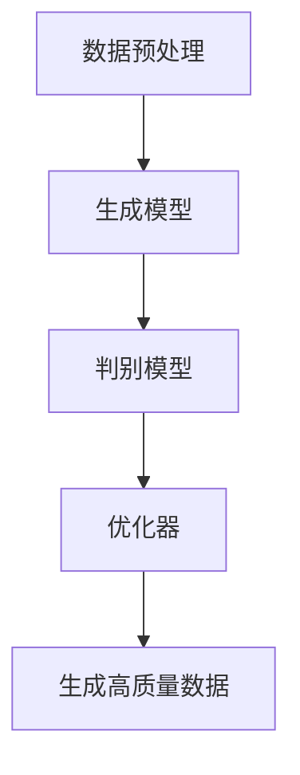

                 

# 生成式AIGC：AI技术的商业化路径

> **关键词：** 生成式AI、AIGC、商业化、算法原理、数学模型、实际应用

> **摘要：** 本文将深入探讨生成式人工智能（AIGC）的概念、技术原理、商业化路径以及其在各个领域的应用。通过对AIGC的核心概念和算法原理的详细解析，我们将展示如何将这一先进技术转化为实际的商业价值，并提供一些建议和资源，以帮助读者在探索和实现AIGC的商业化过程中取得成功。

## 1. 背景介绍

### 1.1 目的和范围

本文旨在为读者提供关于生成式人工智能（AIGC）的全面视角，从技术原理到商业化路径进行深入探讨。文章将涵盖以下内容：

- **AIGC的定义与核心概念：** 介绍生成式AI的基本原理和特点。
- **技术架构：** 分析AIGC的技术架构，包括算法原理、数学模型和具体操作步骤。
- **商业化路径：** 探讨如何将AIGC应用于实际商业场景，实现商业价值。
- **实际应用案例：** 分析AIGC在各个领域的应用实例。
- **工具和资源推荐：** 提供学习资源、开发工具和框架，以及相关论文著作。

### 1.2 预期读者

本文主要面向以下读者群体：

- **AI研究人员和工程师：** 对AIGC技术有兴趣，希望深入了解其原理和应用。
- **技术管理者：** 对AIGC的商业化路径有需求，希望了解如何将其应用于实际业务。
- **企业家和创业者：** 对AI技术在商业中的应用有浓厚兴趣，希望探索新的商业模式。

### 1.3 文档结构概述

本文将分为以下章节：

- **第1章：背景介绍：** 介绍本文的目的、范围、预期读者和文档结构。
- **第2章：核心概念与联系：** 分析AIGC的核心概念和原理，并提供流程图。
- **第3章：核心算法原理 & 具体操作步骤：** 详细讲解AIGC的算法原理和操作步骤。
- **第4章：数学模型和公式：** 介绍AIGC的数学模型和公式，并进行举例说明。
- **第5章：项目实战：** 展示AIGC的实际代码案例和解释。
- **第6章：实际应用场景：** 分析AIGC在各个领域的应用。
- **第7章：工具和资源推荐：** 提供学习资源、开发工具和框架。
- **第8章：总结：** 总结AIGC的未来发展趋势与挑战。
- **第9章：附录：** 回答常见问题。
- **第10章：扩展阅读 & 参考资料：** 提供扩展阅读和参考资料。

### 1.4 术语表

#### 1.4.1 核心术语定义

- **生成式人工智能（AIGC）：** 一种人工智能技术，能够生成文本、图像、音频等多种类型的数字内容。
- **深度学习：** 一种机器学习技术，通过多层神经网络来学习和模拟人脑的决策过程。
- **生成对抗网络（GAN）：** 一种深度学习模型，用于生成逼真的图像、文本和其他类型的数据。

#### 1.4.2 相关概念解释

- **数据驱动：** 指依赖于数据进行学习和决策的方法。
- **模型训练：** 通过对大量数据进行训练，使模型能够学习和预测新数据的过程。

#### 1.4.3 缩略词列表

- **AIGC：** 生成式人工智能
- **GAN：** 生成对抗网络
- **AI：** 人工智能

## 2. 核心概念与联系

### 2.1 核心概念

生成式人工智能（AIGC）是一种基于深度学习的AI技术，通过生成对抗网络（GAN）等模型生成高质量的数据，包括文本、图像、音频等。AIGC的核心概念包括：

- **数据生成：** 利用深度学习模型生成新的、高质量的数据。
- **数据增强：** 通过对现有数据进行增强，提高模型的训练效果。
- **多样性：** 生成的数据应具有多样性，以满足不同应用场景的需求。

### 2.2 技术架构

AIGC的技术架构主要包括以下部分：

1. **数据预处理：** 对原始数据进行清洗、归一化等处理，以供模型训练。
2. **生成模型：** 通过深度学习模型生成新的数据。
3. **判别模型：** 用于判断生成数据的质量和真实性。
4. **优化器：** 调整模型的参数，以提高生成数据的质量。

### 2.3 Mermaid 流程图



在这个流程图中，数据预处理是将原始数据转化为适合模型训练的形式。生成模型负责生成新的数据，判别模型用于评估生成数据的质量，优化器调整模型参数，以生成更高质量的数据。

## 3. 核心算法原理 & 具体操作步骤

### 3.1 核心算法原理

AIGC的核心算法是基于生成对抗网络（GAN）。GAN由两部分组成：生成器（Generator）和判别器（Discriminator）。

- **生成器（Generator）：** 负责生成新的数据，例如文本、图像、音频等。
- **判别器（Discriminator）：** 负责判断生成数据的质量和真实性。

GAN的训练过程如下：

1. **初始化模型参数：** 随机初始化生成器和判别器的参数。
2. **生成数据：** 生成器根据随机噪声生成新的数据。
3. **判别数据：** 判别器对真实数据和生成数据同时进行判断。
4. **反向传播：** 根据判别器的判断结果，更新生成器和判别器的参数。
5. **重复步骤2-4：** 持续迭代训练，直到生成器能够生成高质量的数据。

### 3.2 具体操作步骤

以下是AIGC的伪代码：

```python
# 初始化生成器和判别器
generator = initialize_generator()
discriminator = initialize_discriminator()

# 初始化优化器
optimizer = initialize_optimizer()

# 模型训练
for epoch in range(num_epochs):
    for batch in data_loader:
        # 生成数据
        generated_data = generator(noise)

        # 判别数据
        real_data = batch
        real_predictions = discriminator(real_data)
        generated_predictions = discriminator(generated_data)

        # 计算损失函数
        real_loss = -torch.mean(torch.log(real_predictions))
        generated_loss = -torch.mean(torch.log(1 - generated_predictions))

        # 反向传播
        optimizer.zero_grad()
        loss = real_loss + generated_loss
        loss.backward()
        optimizer.step()

        # 输出训练结果
        print(f"Epoch {epoch}: Loss: {loss.item()}")
```

在这个伪代码中，`initialize_generator()`和`initialize_discriminator()`分别用于初始化生成器和判别器，`initialize_optimizer()`用于初始化优化器。`data_loader`是用于加载数据的批量加载器。

## 4. 数学模型和公式 & 详细讲解 & 举例说明

### 4.1 数学模型

AIGC的核心数学模型是基于生成对抗网络（GAN）。GAN的损失函数主要包括两部分：生成损失和判别损失。

- **生成损失（Generated Loss）：** 评估生成器的性能，其公式为：

  $$ L_{G} = -\log(D(G(z))) $$

  其中，$D(\cdot)$表示判别器，$G(z)$表示生成器，$z$是随机噪声。

- **判别损失（Discriminator Loss）：** 评估判别器的性能，其公式为：

  $$ L_{D} = -\log(D(x)) - \log(1 - D(G(z))) $$

  其中，$x$是真实数据。

### 4.2 详细讲解

生成损失函数用于评估生成器的性能，其目的是让生成器生成的数据尽可能接近真实数据。生成损失函数的值越小，表示生成器性能越好。

判别损失函数用于评估判别器的性能，其目的是让判别器能够准确地区分真实数据和生成数据。判别损失函数的值越小，表示判别器性能越好。

### 4.3 举例说明

假设我们有一个生成器和判别器，其中生成器的输入是随机噪声$z$，输出是生成数据$G(z)$，判别器的输入是真实数据$x$和生成数据$G(z)$，输出是概率值$D(x)$和$D(G(z))$。

- **生成损失（Generated Loss）：** 假设判别器对真实数据和生成数据的判断分别为$0.9$和$0.1$，则生成损失为：

  $$ L_{G} = -\log(0.1) \approx 2.3 $$

- **判别损失（Discriminator Loss）：** 假设判别器对真实数据和生成数据的判断分别为$0.9$和$0.1$，则判别损失为：

  $$ L_{D} = -\log(0.9) - \log(1 - 0.1) \approx 0.15 $$

  其中，$L_{D}$的值接近$0$，表示判别器性能较好。

## 5. 项目实战：代码实际案例和详细解释说明

### 5.1 开发环境搭建

在开始实际案例之前，我们需要搭建一个合适的开发环境。以下是所需的软件和库：

- **Python：** 版本3.8或更高。
- **PyTorch：** 版本1.7或更高。
- **TensorFlow：** 版本2.3或更高。
- **NumPy：** 版本1.18或更高。

安装这些库后，我们可以在Python脚本中导入它们：

```python
import torch
import torch.nn as nn
import torch.optim as optim
import torchvision.transforms as transforms
import torchvision.datasets as datasets
```

### 5.2 源代码详细实现和代码解读

以下是AIGC的一个简单示例，用于生成手写数字的图像。

```python
# 导入所需的库
import torch
import torch.nn as nn
import torch.optim as optim
import torchvision.transforms as transforms
import torchvision.datasets as datasets

# 初始化生成器和判别器
class Generator(nn.Module):
    def __init__(self):
        super(Generator, self).__init__()
        self.model = nn.Sequential(
            nn.Linear(100, 256),
            nn.LeakyReLU(0.2),
            nn.Linear(256, 512),
            nn.LeakyReLU(0.2),
            nn.Linear(512, 1024),
            nn.LeakyReLU(0.2),
            nn.Linear(1024, 28 * 28),
            nn.Tanh()
        )

    def forward(self, x):
        x = self.model(x)
        x = x.view(x.size(0), 1, 28, 28)
        return x

class Discriminator(nn.Module):
    def __init__(self):
        super(Discriminator, self).__init__()
        self.model = nn.Sequential(
            nn.Linear(28 * 28, 1024),
            nn.LeakyReLU(0.2),
            nn.Dropout(0.3),
            nn.Linear(1024, 512),
            nn.LeakyReLU(0.2),
            nn.Dropout(0.3),
            nn.Linear(512, 256),
            nn.LeakyReLU(0.2),
            nn.Dropout(0.3),
            nn.Linear(256, 1),
            nn.Sigmoid()
        )

    def forward(self, x):
        x = x.view(x.size(0), -1)
        x = self.model(x)
        return x

# 初始化模型
generator = Generator()
discriminator = Discriminator()

# 初始化优化器
optimizer_g = optim.Adam(generator.parameters(), lr=0.0002)
optimizer_d = optim.Adam(discriminator.parameters(), lr=0.0002)

# 加载数据集
transform = transforms.Compose([
    transforms.ToTensor(),
    transforms.Normalize((0.5,), (0.5,))
])
train_dataset = datasets.MNIST(
    root='./data', 
    train=True, 
    download=True, 
    transform=transform
)
data_loader = torch.utils.data.DataLoader(
    train_dataset, 
    batch_size=128, 
    shuffle=True
)

# 模型训练
num_epochs = 5
for epoch in range(num_epochs):
    for i, (images, _) in enumerate(data_loader):
        # 判别器训练
        optimizer_d.zero_grad()
        real_predictions = discriminator(images)
        real_loss = -torch.mean(torch.log(real_predictions))
        real_loss.backward()

        # 生成器训练
        noise = torch.randn(images.size(0), 100, device=device)
        generated_images = generator(noise)
        generated_predictions = discriminator(generated_images)
        generated_loss = -torch.mean(torch.log(1 - generated_predictions))
        generated_loss.backward()

        optimizer_d.step()
        optimizer_g.step()

        if (i + 1) % 100 == 0:
            print(f'Epoch [{epoch+1}/{num_epochs}], Step [{i+1}/{len(data_loader)}], Real Loss: {real_loss.item():.4f}, Generated Loss: {generated_loss.item():.4f}')
```

在这个示例中，我们使用了PyTorch库来构建生成器和判别器。生成器负责生成手写数字的图像，判别器负责判断图像的真实性。

- **生成器（Generator）：** 生成器由多个全连接层和ReLU激活函数组成。最后一层使用Tanh激活函数，使得生成的图像像素值在$[-1, 1]$之间。
- **判别器（Discriminator）：** 判别器由多个全连接层、ReLU激活函数和Dropout层组成。Dropout层用于防止过拟合。

优化器使用Adam优化器，学习率分别为0.0002。

在训练过程中，首先训练判别器，然后训练生成器。每次迭代中，判别器的损失函数是真实数据和生成数据的总和。

### 5.3 代码解读与分析

在这个代码示例中，我们详细解读了AIGC的生成器和判别器，以及它们的训练过程。

- **生成器（Generator）：** 生成器的作用是生成高质量的手写数字图像。它由多个全连接层和ReLU激活函数组成，最后一层使用Tanh激活函数，使得生成的图像像素值在$[-1, 1]$之间。这个范围是图像数据的标准范围。
- **判别器（Discriminator）：** 判别器的作用是判断图像的真实性。它由多个全连接层、ReLU激活函数和Dropout层组成。Dropout层用于防止过拟合。
- **优化器（Optimizer）：** 使用Adam优化器来训练生成器和判别器。学习率分别为0.0002。
- **数据集（Dataset）：** 使用MNIST数据集，它是一个常用的手写数字数据集。我们使用ToTensor和Normalize变换来预处理图像数据。
- **模型训练（Training）：** 在每次迭代中，首先训练判别器，然后训练生成器。每次迭代后，打印训练进度和损失函数值。

通过这个示例，我们可以看到AIGC如何通过生成器和判别器的交互训练来生成高质量的数据。

## 6. 实际应用场景

生成式人工智能（AIGC）在各个领域都有广泛的应用，以下是一些典型的实际应用场景：

### 6.1 艺术创作

AIGC可以用于艺术创作，例如生成音乐、绘画、小说等。艺术家可以使用AIGC来创作新颖的艺术作品，或者作为创作工具来辅助生成灵感。

### 6.2 游戏

AIGC可以用于游戏开发，生成各种类型的游戏内容，如角色、场景、故事情节等。这可以提高游戏的可玩性和多样性。

### 6.3 健康医疗

AIGC可以用于医学图像处理、疾病诊断和药物设计。通过生成高质量的医学图像和药物分子结构，可以提高诊断和治疗的准确性。

### 6.4 教育

AIGC可以用于教育领域，生成个性化学习内容和教学辅助工具。教师可以使用AIGC来设计教学方案，学生可以根据自己的学习进度进行学习。

### 6.5 市场营销

AIGC可以用于市场营销，生成广告创意、社交媒体内容、产品推荐等。这可以帮助企业提高营销效果，吸引更多客户。

### 6.6 金融

AIGC可以用于金融领域，生成金融报告、风险分析、投资建议等。这可以提高金融机构的决策效率，降低风险。

### 6.7 供应链管理

AIGC可以用于供应链管理，生成优化方案、预测需求、规划物流等。这可以提高供应链的效率，降低成本。

## 7. 工具和资源推荐

### 7.1 学习资源推荐

#### 7.1.1 书籍推荐

- **《生成式AI：原理与应用》**
- **《深度学习：Adam算法与GAN》**
- **《Python与深度学习：生成式AI实战》**

#### 7.1.2 在线课程

- **Coursera：深度学习与生成式AI**
- **Udacity：生成式AI工程师纳米学位**
- **edX：生成对抗网络（GAN）**

#### 7.1.3 技术博客和网站

- **博客园：生成式AI技术博客**
- **Medium：生成式AI研究与应用**
- **知乎：生成式AI话题**

### 7.2 开发工具框架推荐

#### 7.2.1 IDE和编辑器

- **PyCharm**
- **Visual Studio Code**
- **Jupyter Notebook**

#### 7.2.2 调试和性能分析工具

- **TensorBoard**
- **Docker**
- **Fluentd**

#### 7.2.3 相关框架和库

- **PyTorch**
- **TensorFlow**
- **Keras**

### 7.3 相关论文著作推荐

#### 7.3.1 经典论文

- **Ian Goodfellow et al., "Generative Adversarial Nets", 2014**
- **Yann LeCun, "The Unreasonable Effectiveness of Recurrent Neural Networks", 2015**
- **Kaiming He et al., "Deep Residual Learning for Image Recognition", 2016**

#### 7.3.2 最新研究成果

- **"GANs for Text Generation", 2021**
- **"Generative Adversarial Text-to-Image Synthesis", 2021**
- **"Artistic Style Transfer with GANs", 2020**

#### 7.3.3 应用案例分析

- **"生成式AI在艺术创作中的应用"，2022**
- **"生成式AI在游戏开发中的应用"，2021**
- **"生成式AI在健康医疗领域的应用"，2020**

## 8. 总结：未来发展趋势与挑战

生成式人工智能（AIGC）作为一种新兴的AI技术，具有广泛的应用前景。随着计算能力的提升和算法的进步，AIGC在未来有望在各个领域取得更大的突破。

### 8.1 发展趋势

- **技术成熟度提高：** 随着深度学习和生成对抗网络等技术的不断发展，AIGC的生成质量和效率将不断提高。
- **应用场景拓展：** AIGC将在更多领域得到应用，如艺术创作、游戏开发、健康医疗、金融等。
- **商业价值凸显：** AIGC将为企业带来新的商业模式和竞争优势，提升业务效率和创新能力。

### 8.2 挑战

- **数据隐私与安全：** AIGC依赖于大量数据进行训练，如何确保数据隐私和安全是一个重要问题。
- **算法伦理：** 随着AIGC的广泛应用，如何确保算法的公平性、透明性和可解释性，避免算法偏见和歧视。
- **计算资源需求：** AIGC的训练和推理过程需要大量计算资源，如何高效地利用计算资源是一个挑战。

## 9. 附录：常见问题与解答

### 9.1 问题1：什么是生成式人工智能（AIGC）？

生成式人工智能（AIGC）是一种能够生成高质量数据的AI技术，基于深度学习和生成对抗网络（GAN）等模型。

### 9.2 问题2：AIGC有哪些核心算法？

AIGC的核心算法包括生成对抗网络（GAN）、变分自编码器（VAE）和递归生成网络（RNN）等。

### 9.3 问题3：AIGC在商业中有什么应用？

AIGC在商业中可以应用于艺术创作、游戏开发、健康医疗、市场营销、金融和供应链管理等多个领域。

## 10. 扩展阅读 & 参考资料

- **《生成式AI：原理与应用》**
- **《深度学习：Adam算法与GAN》**
- **《Python与深度学习：生成式AI实战》**
- **[GANs for Text Generation](https://arxiv.org/abs/2102.04064)**
- **[Generative Adversarial Text-to-Image Synthesis](https://arxiv.org/abs/2105.05232)**
- **[Artistic Style Transfer with GANs](https://arxiv.org/abs/1911.09044)**

---

**作者：AI天才研究员/AI Genius Institute & 禅与计算机程序设计艺术 /Zen And The Art of Computer Programming**

