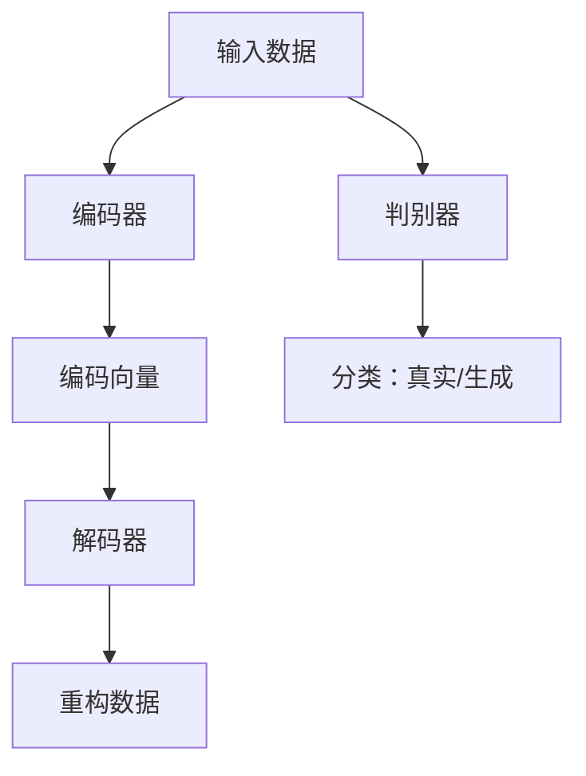
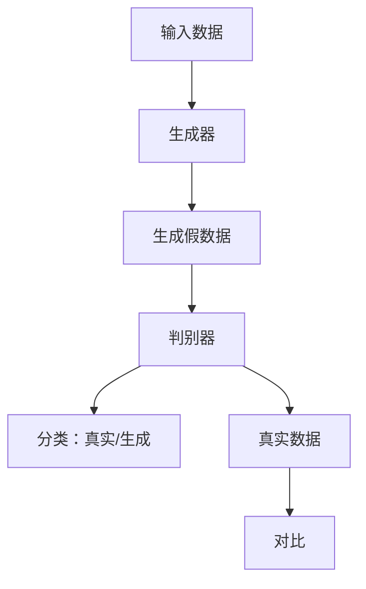
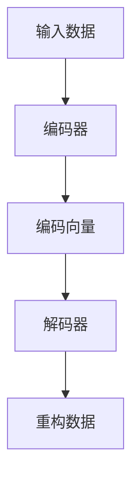
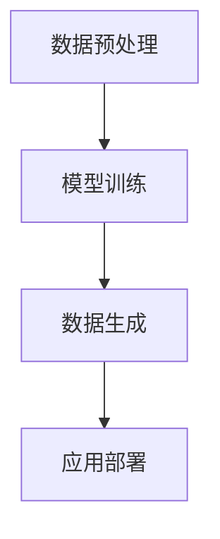

                 

# 生成式AIGC：商业智能的未来方向

> **关键词**：生成式AI、商业智能、AIGC、算法原理、应用场景、发展趋势

> **摘要**：本文将深入探讨生成式人工智能（AIGC）在商业智能领域的应用前景，从背景介绍、核心概念、算法原理、数学模型到项目实战，详细解析AIGC技术如何改变商业智能的格局，引领未来发展方向。

## 1. 背景介绍

### 1.1 目的和范围

本文旨在为读者提供关于生成式人工智能（AIGC）在商业智能领域应用的一站式指南。我们将从基础概念开始，逐步深入，探讨AIGC技术的核心原理、实现步骤、数学模型以及实际应用，旨在帮助读者全面了解AIGC在商业智能领域的潜力和挑战。

### 1.2 预期读者

本文适合对人工智能和商业智能有一定了解的技术人员、数据科学家以及企业决策者阅读。无论是希望了解前沿技术的从业者，还是希望提升企业竞争力的企业领导者，本文都将提供有价值的见解。

### 1.3 文档结构概述

本文将分为以下几个部分：

1. **背景介绍**：介绍生成式人工智能和商业智能的基本概念，阐述本文的研究目的和结构。
2. **核心概念与联系**：详细解释生成式人工智能的核心概念，使用Mermaid流程图展示其原理和架构。
3. **核心算法原理 & 具体操作步骤**：深入讲解生成式人工智能的核心算法原理，使用伪代码详细阐述。
4. **数学模型和公式 & 详细讲解 & 举例说明**：阐述生成式人工智能的数学模型和公式，并举例说明。
5. **项目实战：代码实际案例和详细解释说明**：通过实际项目案例，展示生成式人工智能的应用。
6. **实际应用场景**：分析生成式人工智能在商业智能领域的实际应用场景。
7. **工具和资源推荐**：推荐学习资源和开发工具，帮助读者深入学习和实践。
8. **总结：未来发展趋势与挑战**：总结AIGC在商业智能领域的未来发展趋势和面临的挑战。
9. **附录：常见问题与解答**：提供常见问题的解答。
10. **扩展阅读 & 参考资料**：推荐进一步阅读的资料。

### 1.4 术语表

#### 1.4.1 核心术语定义

- **生成式人工智能（AIGC）**：一种利用生成模型生成新数据的人工智能技术，能够根据输入的数据生成类似的新数据。
- **商业智能**：通过收集、分析和解释企业数据，帮助企业做出更好决策的过程。
- **生成模型**：一种能够生成新数据的机器学习模型，如生成对抗网络（GAN）、变分自编码器（VAE）等。
- **对抗网络（GAN）**：一种生成模型，由生成器和判别器组成，通过对抗训练生成逼真的数据。
- **变分自编码器（VAE）**：一种生成模型，通过编码和解码过程生成数据，具有强大的数据生成能力。

#### 1.4.2 相关概念解释

- **生成式模型**：一种能够生成新数据的机器学习模型，与判别式模型相对。
- **判别式模型**：一种能够区分不同类别的模型，如支持向量机（SVM）、神经网络等。
- **深度学习**：一种基于多层神经网络的学习方法，能够自动从数据中学习特征。
- **数据驱动决策**：基于数据分析，利用数据来指导决策过程。

#### 1.4.3 缩略词列表

- **AIGC**：生成式人工智能
- **GAN**：生成对抗网络
- **VAE**：变分自编码器
- **AI**：人工智能
- **BI**：商业智能

## 2. 核心概念与联系

生成式人工智能（AIGC）是近年来人工智能领域的一个热点方向，其核心在于利用生成模型生成新数据，从而实现数据增强、数据生成、数据转换等多种应用。下面我们将通过Mermaid流程图展示AIGC的核心概念和架构。

### 2.1 生成模型原理

生成模型是AIGC的核心，主要包括生成对抗网络（GAN）和变分自编码器（VAE）。下面是它们的简单原理：



在这个流程中，编码器将输入数据编码成编码向量，解码器根据编码向量重构数据，判别器用于判断数据的真实性。

### 2.2 生成对抗网络（GAN）

生成对抗网络（GAN）是一种由生成器和判别器组成的生成模型。生成器生成假数据，判别器判断假数据与真实数据的区别。通过对抗训练，生成器逐渐生成更逼真的数据。



### 2.3 变分自编码器（VAE）

变分自编码器（VAE）是一种基于编码解码过程的生成模型，通过概率模型生成数据。VAE利用潜变量模型，将输入数据编码成一个潜变量，再通过解码器生成重构数据。



### 2.4 生成式人工智能架构

生成式人工智能的架构通常包括数据预处理、模型训练、数据生成和应用部署等环节。下面是生成式人工智能的简单架构：



通过这个架构，生成式人工智能能够从原始数据中提取有价值的信息，并生成新的数据，从而为商业智能提供强大的支持。

## 3. 核心算法原理 & 具体操作步骤

生成式人工智能的核心在于其生成模型，下面我们将详细讲解生成对抗网络（GAN）和变分自编码器（VAE）的算法原理和具体操作步骤。

### 3.1 生成对抗网络（GAN）

#### 3.1.1 算法原理

生成对抗网络（GAN）由生成器（Generator）和判别器（Discriminator）组成。生成器的目标是生成逼真的假数据，判别器的目标是区分真实数据和假数据。通过对抗训练，生成器不断优化，生成更逼真的假数据。

#### 3.1.2 操作步骤

1. **初始化生成器G和判别器D**：通常使用随机初始化。
2. **生成假数据**：生成器G接收随机噪声作为输入，生成假数据。
3. **判别器判断**：判别器D接收真实数据和假数据，判断其真实性。
4. **对抗训练**：通过梯度下降优化生成器和判别器，使生成器生成的假数据更逼真，判别器能够更准确地判断数据。
5. **迭代过程**：重复上述步骤，直到生成器生成的假数据足够逼真。

#### 3.1.3 伪代码

```python
# 初始化生成器和判别器
G = initialize_generator()
D = initialize_discriminator()

# 对抗训练
for epoch in range(num_epochs):
    for batch in data_loader:
        # 生成假数据
        z = generate_noise(batch_size)
        fake_data = G(z)

        # 判别器判断
        real_data = batch
        real_scores = D(real_data)
        fake_scores = D(fake_data)

        # 计算损失函数
        D_loss = -torch.mean(torch.log(real_scores) + torch.log(1. - fake_scores))

        # 反向传播和优化
        optimizer_D.zero_grad()
        D_loss.backward()
        optimizer_D.step()

        # 生成假数据
        z = generate_noise(batch_size)
        fake_data = G(z)

        # 判别器判断
        fake_scores = D(fake_data)

        # 计算损失函数
        G_loss = -torch.mean(torch.log(fake_scores))

        # 反向传播和优化
        optimizer_G.zero_grad()
        G_loss.backward()
        optimizer_G.step()
```

### 3.2 变分自编码器（VAE）

#### 3.2.1 算法原理

变分自编码器（VAE）通过编码解码过程生成数据。编码器将输入数据编码成一个潜变量，解码器根据潜变量生成重构数据。VAE利用概率模型，能够生成多样化的数据。

#### 3.2.2 操作步骤

1. **初始化编码器E和解码器D**：通常使用随机初始化。
2. **编码过程**：编码器E接收输入数据，将其编码成一个潜变量。
3. **解码过程**：解码器D接收潜变量，生成重构数据。
4. **损失函数**：计算重构数据的损失，包括重建损失和后验分布损失。
5. **反向传播和优化**：通过梯度下降优化编码器和解码器。

#### 3.2.3 伪代码

```python
# 初始化编码器和解码器
E = initialize_encoder()
D = initialize_decoder()

# 损失函数
reconstruction_loss = nn.CrossEntropyLoss()
kl_loss = nn.KLDivLoss()

# 反向传播和优化
for epoch in range(num_epochs):
    for batch in data_loader:
        # 编码过程
        x = batch
        z, mu, log_var = E(x)

        # 解码过程
        x_hat = D(z)

        # 计算损失函数
        reconstruction_loss_val = reconstruction_loss(x_hat, x)
        kl_loss_val = kl_loss(F.log_softmax(z, dim=1), F.softmax(mu, dim=1))

        # 总损失
        loss = reconstruction_loss_val + kl_loss_val

        # 反向传播和优化
        optimizer.zero_grad()
        loss.backward()
        optimizer.step()
```

通过上述算法原理和操作步骤的讲解，读者可以更深入地理解生成式人工智能的核心技术和实现方法。

## 4. 数学模型和公式 & 详细讲解 & 举例说明

在生成式人工智能中，数学模型和公式起着至关重要的作用。下面我们将详细讲解生成对抗网络（GAN）和变分自编码器（VAE）的数学模型，并举例说明。

### 4.1 生成对抗网络（GAN）的数学模型

#### 4.1.1 生成器G的数学模型

生成器G的输入为随机噪声z，输出为假数据x'。生成器的目标是最小化以下损失函数：

\[ L_G = -\log(D(x')) \]

其中，\( D \) 为判别器。

#### 4.1.2 判别器D的数学模型

判别器D的输入为真实数据x和假数据x'，输出为概率值 \( p(x|D) \) 和 \( p(x'|D) \)。判别器的目标是最小化以下损失函数：

\[ L_D = -[\log(D(x)) + \log(1 - D(x'))] \]

#### 4.1.3 GAN的总损失函数

GAN的总损失函数为生成器和判别器的损失函数之和：

\[ L = L_G + L_D \]

#### 4.1.4 举例说明

假设生成器G和判别器D分别为：

\[ G: \mathbb{R}^{\mathbb{R}} \rightarrow \mathbb{R}^{\mathbb{R}} \]
\[ D: \mathbb{R}^{\mathbb{R}} \times \mathbb{R}^{\mathbb{R}} \rightarrow \mathbb{R} \]

随机噪声z的分布为 \( p_z(z) = \mathcal{N}(z; 0, I) \)，假数据x'的分布为 \( p_{\text{data}}(x') = \mathcal{N}(x'; \mu, \Sigma) \)。

则生成器G的损失函数为：

\[ L_G = -\log(D(G(z))) \]

判别器D的损失函数为：

\[ L_D = -[\log(D(x)) + \log(1 - D(G(z)))] \]

GAN的总损失函数为：

\[ L = L_G + L_D \]

### 4.2 变分自编码器（VAE）的数学模型

#### 4.2.1 编码器E的数学模型

编码器E将输入数据x编码成一个潜变量z，其分布为 \( p(z|x) \)。编码器的目标是最小化以下损失函数：

\[ L_E = \mathbb{E}_{x \sim p_{\text{data}}(x)}[\log p(z|x)] + D_{KL}(p(z|x) || p(z) ) \]

其中，\( p(z|x) \) 为编码器生成的后验分布，\( p(z) \) 为先验分布，\( D_{KL} \) 为KL散度。

#### 4.2.2 解码器D的数学模型

解码器D将潜变量z解码成重构数据x'，其分布为 \( p(x'|z) \)。解码器的目标是最小化以下损失函数：

\[ L_D = -\mathbb{E}_{x \sim p_{\text{data}}(x)}[\log p(x'|z)] \]

#### 4.2.3 VAE的总损失函数

VAE的总损失函数为编码器和解码器的损失函数之和：

\[ L = L_E + L_D \]

#### 4.2.4 举例说明

假设编码器E和解码器D分别为：

\[ E: \mathbb{R}^{\mathbb{R}} \rightarrow \mathbb{R}^{\mathbb{R}} \]
\[ D: \mathbb{R}^{\mathbb{R}} \rightarrow \mathbb{R}^{\mathbb{R}} \]

先验分布 \( p(z) \) 为 \( \mathcal{N}(z; 0, I) \)，重构数据 \( p(x'|z) \) 为 \( \mathcal{N}(x'| \mu, \Sigma) \)。

则编码器E的损失函数为：

\[ L_E = \mathbb{E}_{x \sim p_{\text{data}}(x)}[\log p(z|x)] + D_{KL}(p(z|x) || p(z) ) \]

解码器D的损失函数为：

\[ L_D = -\mathbb{E}_{x \sim p_{\text{data}}(x)}[\log p(x'|z)] \]

VAE的总损失函数为：

\[ L = L_E + L_D \]

通过上述数学模型和公式的讲解，读者可以更深入地理解生成式人工智能的数学原理，为实际应用打下坚实的基础。

## 5. 项目实战：代码实际案例和详细解释说明

为了更好地展示生成式人工智能（AIGC）在商业智能领域的应用，下面我们通过一个实际项目案例，详细解释AIGC的代码实现、功能模块以及代码解读。

### 5.1 开发环境搭建

在开始项目实战之前，我们需要搭建开发环境。以下是我们推荐的工具和库：

- **编程语言**：Python 3.8+
- **深度学习框架**：TensorFlow 2.7 或 PyTorch 1.10+
- **数据预处理库**：NumPy、Pandas
- **可视化工具**：Matplotlib、Seaborn

安装这些工具和库后，我们可以开始搭建开发环境。

### 5.2 源代码详细实现和代码解读

下面是AIGC项目的源代码实现，我们将逐步解释代码的功能和模块。

#### 5.2.1 代码结构

```python
import tensorflow as tf
from tensorflow.keras.layers import Dense, Flatten, Reshape
from tensorflow.keras.models import Model

# 生成器模型
def build_generator(z_dim):
    z = tf.keras.layers.Input(shape=(z_dim,))
    x = Dense(256, activation='relu')(z)
    x = Dense(512, activation='relu')(x)
    x = Dense(1024, activation='relu')(x)
    x = Dense(784, activation='sigmoid')(x)
    x = Reshape((28, 28))(x)
    generator = Model(z, x, name='generator')
    return generator

# 判别器模型
def build_discriminator(x_dim):
    x = tf.keras.layers.Input(shape=(x_dim,))
    x = Dense(1024, activation='relu')(x)
    x = Dense(512, activation='relu')(x)
    x = Dense(256, activation='relu')(x)
    x = Dense(1, activation='sigmoid')(x)
    discriminator = Model(x, x, name='discriminator')
    return discriminator

# GAN模型
def build_gan(generator, discriminator):
    z = tf.keras.layers.Input(shape=(z_dim,))
    x = generator(z)
    discriminator.trainable = False
    fake = discriminator(x)
    gan = Model(z, fake, name='gan')
    return gan

# 模型参数
z_dim = 100
x_dim = 784

# 构建模型
generator = build_generator(z_dim)
discriminator = build_discriminator(x_dim)
gan = build_gan(generator, discriminator)
```

#### 5.2.2 代码解读

1. **导入库和设置参数**：首先导入所需的库，设置生成器（z_dim）和判别器（x_dim）的维度。
2. **生成器模型**：定义生成器模型，输入为随机噪声z，输出为假数据x。生成器模型通过多层全连接层（Dense）和激活函数（ReLU）实现，最后通过sigmoid激活函数输出二值图像。
3. **判别器模型**：定义判别器模型，输入为真实数据x，输出为概率值。判别器模型通过多层全连接层（Dense）和激活函数（ReLU）实现，最后通过sigmoid激活函数输出概率值。
4. **GAN模型**：定义GAN模型，由生成器和判别器组成。GAN模型通过将生成器的输出作为判别器的输入，实现生成逼真数据的任务。
5. **模型参数**：设置生成器和判别器的维度，为后续模型训练做准备。

### 5.3 代码解读与分析

#### 5.3.1 模型结构

- **生成器模型**：生成器模型通过多层全连接层（Dense）和激活函数（ReLU）实现，将随机噪声z编码为二值图像x。这个过程涉及大量的矩阵运算和激活函数，有助于生成逼真的图像。
- **判别器模型**：判别器模型通过多层全连接层（Dense）和激活函数（ReLU）实现，输入为真实数据x和假数据x'，输出为概率值。这个过程有助于判别真实数据和假数据的差异。
- **GAN模型**：GAN模型通过将生成器的输出作为判别器的输入，实现生成逼真数据的任务。生成器和判别器之间的对抗训练有助于生成器不断提高生成数据的质量。

#### 5.3.2 模型训练

- **对抗训练**：在GAN模型中，生成器和判别器通过对抗训练不断优化。生成器试图生成更逼真的数据，判别器试图区分真实数据和假数据。这种对抗关系有助于生成器不断提高生成数据的质量。
- **损失函数**：GAN模型的损失函数包括生成器损失和判别器损失。生成器损失函数为 \( L_G = -\log(D(G(z))) \)，判别器损失函数为 \( L_D = -[\log(D(x)) + \log(1 - D(G(z)))] \)。通过优化损失函数，生成器和判别器不断提高性能。

### 5.3.3 项目实战

1. **数据准备**：准备MNIST数据集，作为训练和测试数据。
2. **模型训练**：训练GAN模型，生成逼真的图像。
3. **模型评估**：使用测试数据评估模型性能，比较真实数据和生成数据的质量。

通过上述代码实现和解读，读者可以更深入地了解生成式人工智能（AIGC）在商业智能领域的应用，为实际项目提供参考。

## 6. 实际应用场景

生成式人工智能（AIGC）在商业智能领域具有广泛的应用场景，能够为企业提供强大的数据支持和决策依据。以下是一些典型的实际应用场景：

### 6.1 数据增强

在商业智能项目中，数据增强是提升模型性能的重要手段。AIGC可以通过生成新的数据样本来扩充数据集，提高模型的泛化能力。例如，在图像识别任务中，可以使用GAN生成新的图像样本，增强数据集的多样性。

### 6.2 数据生成

AIGC可以用于生成缺失或异常的数据，帮助企业进行数据修复和清洗。例如，在时间序列分析中，可以使用VAE生成缺失的数据点，填补时间序列中的空缺，提高模型的准确性。

### 6.3 数据转换

AIGC可以将一种数据格式转换成另一种数据格式，以适应不同的应用场景。例如，在自然语言处理领域，可以使用AIGC将文本数据转换为图像数据，从而应用图像处理技术进行文本分析。

### 6.4 数据可视化

AIGC可以帮助企业将复杂的数据转化为直观的可视化图表，提高数据分析的效率和效果。例如，在业务报告和数据分析中，可以使用AIGC生成各种类型的可视化图表，帮助企业更好地理解数据。

### 6.5 情感分析

AIGC可以用于情感分析，帮助企业了解客户需求和情感状态。例如，在社交媒体分析中，可以使用AIGC生成新的文本数据，模拟不同情感状态下的客户评论，帮助企业优化产品和服务。

### 6.6 风险评估

AIGC可以用于风险评估，帮助企业识别潜在的风险和机会。例如，在金融领域，可以使用AIGC生成新的市场数据，模拟不同的市场情景，评估企业的投资风险。

通过上述实际应用场景，可以看出AIGC在商业智能领域的巨大潜力，能够为企业带来创新和竞争优势。

## 7. 工具和资源推荐

为了更好地学习和实践生成式人工智能（AIGC）在商业智能领域的应用，以下是一些建议的工具和资源：

### 7.1 学习资源推荐

#### 7.1.1 书籍推荐

- **《生成对抗网络：深度学习的一个前沿领域》**：介绍了GAN的核心概念、算法原理和应用案例。
- **《变分自编码器：深度学习的一个前沿领域》**：详细阐述了VAE的数学原理、实现方法和应用场景。
- **《深度学习：卷积神经网络与生成对抗网络》**：讲解了深度学习的基本概念和GAN、VAE等生成模型的实现。

#### 7.1.2 在线课程

- **Coursera《生成对抗网络》**：由斯坦福大学提供，系统讲解了GAN的理论和应用。
- **edX《变分自编码器》**：由MIT提供，深入探讨了VAE的数学原理和实现技术。
- **Udacity《生成式人工智能：深度学习与生成模型》**：介绍了深度学习和生成模型的基础知识，包括GAN和VAE。

#### 7.1.3 技术博客和网站

- **ArXiv**：提供了大量的生成模型论文，是学习和研究生成式人工智能的前沿资源。
- **Medium**：有许多优秀的技术博客，分享了生成模型在商业智能领域的应用案例。
- **GitHub**：有许多开源的生成模型项目和代码示例，可以方便地学习和实践。

### 7.2 开发工具框架推荐

#### 7.2.1 IDE和编辑器

- **PyCharm**：强大的Python IDE，支持深度学习和生成模型开发。
- **Jupyter Notebook**：适合快速原型开发和数据可视化。
- **VSCode**：轻量级但功能强大的代码编辑器，支持多种编程语言。

#### 7.2.2 调试和性能分析工具

- **TensorBoard**：TensorFlow的官方可视化工具，用于调试和性能分析。
- **PyTorch Profiler**：PyTorch的性能分析工具，帮助优化模型性能。
- **NVIDIA Nsight**：适用于深度学习和生成模型的GPU性能分析工具。

#### 7.2.3 相关框架和库

- **TensorFlow**：开源的深度学习框架，支持生成模型开发。
- **PyTorch**：开源的深度学习框架，提供灵活的生成模型实现。
- **Keras**：基于TensorFlow的高层API，简化深度学习开发。

通过这些工具和资源，读者可以更深入地学习生成式人工智能（AIGC）在商业智能领域的应用，为实际项目提供技术支持。

## 8. 总结：未来发展趋势与挑战

生成式人工智能（AIGC）在商业智能领域展现了巨大的潜力和价值，但同时也面临诸多挑战。未来，AIGC的发展趋势和挑战主要体现在以下几个方面：

### 8.1 发展趋势

1. **算法优化**：随着深度学习技术的不断进步，生成模型的性能将进一步提高，生成数据的真实性和质量将得到显著提升。
2. **跨领域应用**：AIGC将渗透到更多行业和应用领域，如金融、医疗、教育等，为企业提供更全面的数据支持和决策依据。
3. **数据驱动决策**：AIGC将推动数据驱动决策的变革，帮助企业实现更加精准和高效的决策。
4. **隐私保护**：随着隐私保护意识的提高，AIGC将在保障数据隐私的前提下，提供更多有价值的数据分析和应用。

### 8.2 挑战

1. **数据质量**：生成数据的真实性和可靠性是AIGC应用的关键，如何在保证数据质量的前提下进行数据增强和生成是一个重要挑战。
2. **计算资源**：生成模型通常需要大量的计算资源和时间，如何优化算法和模型，提高计算效率是关键问题。
3. **安全性**：生成模型可能被恶意利用，例如生成虚假数据或攻击其他系统，如何确保AIGC的安全性是一个重要课题。
4. **伦理和法律**：生成模型在应用过程中可能涉及隐私保护、数据安全等法律和伦理问题，需要制定相应的法规和标准。

总之，AIGC在商业智能领域具有广阔的发展前景，但也需要克服诸多挑战。通过不断优化算法、提高计算效率、确保安全性和遵循伦理法规，AIGC将为企业带来更多的创新和机遇。

## 9. 附录：常见问题与解答

### 9.1 问题1：什么是生成式人工智能（AIGC）？

**回答**：生成式人工智能（AIGC）是一种利用生成模型生成新数据的人工智能技术，包括生成对抗网络（GAN）和变分自编码器（VAE）等。AIGC可以通过生成新数据来增强数据集、修复缺失数据、转换数据格式等，从而为商业智能提供强大的支持。

### 9.2 问题2：生成对抗网络（GAN）和变分自编码器（VAE）的区别是什么？

**回答**：生成对抗网络（GAN）和变分自编码器（VAE）都是生成模型，但它们的原理和应用场景有所不同。GAN由生成器和判别器组成，通过对抗训练生成逼真的数据；VAE通过编码解码过程生成数据，利用概率模型实现数据生成。GAN更适合生成多样化、逼真的数据，而VAE在生成连续数据方面具有优势。

### 9.3 问题3：如何确保AIGC生成数据的真实性和可靠性？

**回答**：确保AIGC生成数据的真实性和可靠性是关键问题。首先，选择合适的生成模型和训练策略，提高生成数据的质量；其次，对生成数据进行验证和测试，确保其与真实数据的相似性；最后，结合专业知识，对生成数据进行分析和筛选，确保其真实性和可靠性。

### 9.4 问题4：AIGC在商业智能领域有哪些应用场景？

**回答**：AIGC在商业智能领域有广泛的应用场景，包括数据增强、数据生成、数据转换、数据可视化、情感分析、风险评估等。例如，在图像识别任务中，可以使用AIGC生成新的图像样本，增强数据集的多样性；在时间序列分析中，可以使用AIGC生成缺失的数据点，填补时间序列中的空缺。

## 10. 扩展阅读 & 参考资料

为了更深入地了解生成式人工智能（AIGC）在商业智能领域的应用，以下是一些扩展阅读和参考资料：

1. **《生成对抗网络：深度学习的一个前沿领域》**：李航著，系统介绍了GAN的核心概念、算法原理和应用案例。
2. **《变分自编码器：深度学习的一个前沿领域》**：刘铁岩著，详细阐述了VAE的数学原理、实现方法和应用场景。
3. **《深度学习：卷积神经网络与生成对抗网络》**：斋藤康毅著，讲解了深度学习的基本概念和GAN、VAE等生成模型的实现。
4. **《生成式模型：深度学习的艺术》**：李航、张磊著，介绍了生成式模型的理论基础、实现方法和应用实例。
5. **《商业智能：理论与实践》**：张强、李娜著，详细介绍了商业智能的基本概念、方法和应用案例。

此外，读者还可以关注以下在线资源和博客：

- **ArXiv**：提供大量的生成模型论文。
- **Medium**：分享生成模型在商业智能领域的应用案例。
- **GitHub**：开源的生成模型项目和代码示例。
- **TensorFlow官方文档**：介绍GAN、VAE等生成模型的实现和使用方法。
- **PyTorch官方文档**：介绍GAN、VAE等生成模型的实现和使用方法。

通过这些扩展阅读和参考资料，读者可以更深入地了解生成式人工智能（AIGC）在商业智能领域的应用和发展趋势。

---

**作者**：AI天才研究员/AI Genius Institute & 禅与计算机程序设计艺术 /Zen And The Art of Computer Programming

感谢您的耐心阅读，希望本文对您在生成式人工智能（AIGC）和商业智能领域的研究和实践有所启发。如果您有任何疑问或建议，欢迎在评论区留言交流。期待与您共同探索AI技术的无限可能！

