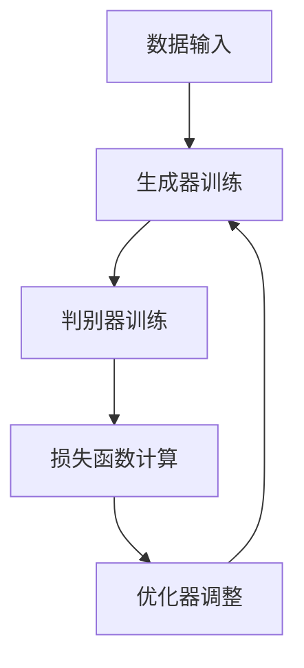

                 

# 生成式AIGC：智能时代的商业新模式

> **关键词：** 生成式AIGC、人工智能、商业创新、新模式、智能服务、数据驱动

> **摘要：** 本文将深入探讨生成式人工智能（AIGC）的兴起及其在商业领域的潜在应用。我们将分析AIGC的核心概念、技术原理、商业价值以及未来发展趋势，通过具体案例展示其应用场景，并提供相关工具和资源推荐，以期为读者提供一个全面、系统的了解。

## 1. 背景介绍

### 1.1 目的和范围

本文旨在探讨生成式人工智能（AIGC）在智能时代的商业应用，分析其核心概念、技术原理，探讨其商业价值，并展望未来的发展趋势。文章将涵盖AIGC的基础知识、技术框架、应用实例以及相关的学习资源。

### 1.2 预期读者

本文适合对人工智能、商业创新有兴趣的读者，包括企业决策者、技术人员、研究人员和所有对新兴技术感兴趣的人士。

### 1.3 文档结构概述

本文分为以下几个部分：

- **背景介绍**：介绍生成式AIGC的背景和相关概念。
- **核心概念与联系**：阐述AIGC的核心概念和架构。
- **核心算法原理 & 具体操作步骤**：详细讲解AIGC的核心算法和操作步骤。
- **数学模型和公式 & 详细讲解 & 举例说明**：分析AIGC中的数学模型和公式。
- **项目实战：代码实际案例和详细解释说明**：通过实际案例展示AIGC的应用。
- **实际应用场景**：探讨AIGC在商业领域的应用。
- **工具和资源推荐**：推荐相关的学习资源和工具。
- **总结：未来发展趋势与挑战**：总结AIGC的未来发展趋势和面临的挑战。
- **附录：常见问题与解答**：解答读者可能遇到的问题。
- **扩展阅读 & 参考资料**：提供进一步阅读的资源和文献。

### 1.4 术语表

#### 1.4.1 核心术语定义

- **生成式人工智能（AIGC）**：一种人工智能技术，能够根据输入的数据生成新的数据，如文本、图像、音频等。
- **深度学习**：一种机器学习方法，通过多层神经网络模型，模拟人脑处理信息的方式。
- **生成对抗网络（GAN）**：一种用于生成数据的技术，由生成器和判别器组成，通过对抗训练生成高质量数据。

#### 1.4.2 相关概念解释

- **大数据**：指数据量巨大、种类繁多、价值密度低的数据集合。
- **云计算**：通过互联网提供动态可伸缩的虚拟化资源。
- **区块链**：一种分布式数据库技术，通过密码学确保数据的不可篡改性和透明性。

#### 1.4.3 缩略词列表

- **AIGC**：生成式人工智能
- **GAN**：生成对抗网络
- **DL**：深度学习
- **IDE**：集成开发环境
- **API**：应用程序接口

## 2. 核心概念与联系

### 2.1 AIGC的核心概念

生成式人工智能（AIGC）是一种能够根据已有的数据生成新内容的人工智能技术。它主要基于深度学习，尤其是生成对抗网络（GAN）等技术。AIGC的核心在于其生成能力，能够通过训练生成各种类型的数据，如图像、文本、音频等。

### 2.2 AIGC的技术架构

AIGC的技术架构主要包括以下组件：

1. **数据输入**：AIGC首先需要大量的数据作为训练输入。这些数据可以是文本、图像、音频等。
2. **生成器（Generator）**：生成器是AIGC的核心组件，负责根据输入数据生成新的数据。
3. **判别器（Discriminator）**：判别器用于判断生成数据的质量，其目标是最小化错误分类的概率。
4. **损失函数**：损失函数用于衡量生成器和判别器的性能，常用的损失函数包括对抗损失和均方误差。
5. **优化器**：优化器用于调整模型参数，以最小化损失函数。

### 2.3 AIGC的Mermaid流程图



在这个流程图中，数据输入是AIGC的起点，生成器和判别器通过对抗训练不断优化，以生成更高质量的数据。损失函数和优化器在这个过程中起着关键作用，用于调整模型参数，提高生成器的生成能力。

## 3. 核心算法原理 & 具体操作步骤

### 3.1 核心算法原理

生成式人工智能（AIGC）的核心算法是基于生成对抗网络（GAN）。GAN由生成器和判别器组成，两者通过对抗训练优化模型参数，最终达到生成高质量数据的目的。

- **生成器（Generator）**：生成器是一个神经网络模型，输入是随机噪声，输出是生成数据。它的目标是生成尽可能真实的数据，以欺骗判别器。
- **判别器（Discriminator）**：判别器也是一个神经网络模型，输入是真实数据和生成数据，输出是概率值，表示输入数据的真实程度。它的目标是正确区分真实数据和生成数据。

### 3.2 具体操作步骤

1. **初始化模型参数**：初始化生成器和判别器的模型参数。
2. **生成器训练**：生成器根据随机噪声生成数据，判别器根据真实数据和生成数据进行训练。
3. **判别器训练**：判别器根据生成器和真实数据进行训练，以区分真实数据和生成数据。
4. **损失函数计算**：计算生成器和判别器的损失函数，用于衡量模型性能。
5. **优化器调整**：使用优化器调整模型参数，以最小化损失函数。
6. **迭代训练**：重复以上步骤，直到生成器能够生成高质量的数据。

### 3.3 伪代码

```python
# 初始化模型参数
generator_params = initialize_parameters()
discriminator_params = initialize_parameters()

# 迭代训练
for epoch in range(num_epochs):
    for batch in data_loader:
        # 生成器训练
        noise = generate_noise()
        generated_data = generator(noise)
        discriminator_loss = calculate_loss(discriminator, real_data, generated_data)
        
        # 判别器训练
        real_data_loss = calculate_loss(discriminator, real_data)
        
        # 计算总损失
        total_loss = generator_loss + real_data_loss
        
        # 优化器调整
        optimizer.zero_grad()
        total_loss.backward()
        optimizer.step()
```

## 4. 数学模型和公式 & 详细讲解 & 举例说明

### 4.1 数学模型

生成式人工智能（AIGC）的核心数学模型是基于生成对抗网络（GAN）。GAN由生成器和判别器组成，两者通过对抗训练优化模型参数。

- **生成器（Generator）**：生成器接收随机噪声作为输入，通过神经网络生成数据。其目标是最小化生成数据的损失函数。
  
  $$ G(z) = f_{\theta_G}(z) $$

  其中，\( G(z) \) 是生成器，\( z \) 是随机噪声，\( \theta_G \) 是生成器的参数。

- **判别器（Discriminator）**：判别器接收真实数据和生成数据作为输入，输出一个概率值，表示输入数据的真实程度。其目标是最小化生成数据的损失函数。
  
  $$ D(x) = f_{\theta_D}(x) $$

  其中，\( D(x) \) 是判别器，\( x \) 是输入数据，\( \theta_D \) 是判别器的参数。

### 4.2 损失函数

生成式人工智能（AIGC）中的损失函数主要分为两部分：生成器的损失函数和判别器的损失函数。

- **生成器的损失函数**：生成器的损失函数通常使用均方误差（MSE）或对抗损失（Adversarial Loss）。

  $$ L_G = -\mathbb{E}_{x \sim p_{data}(x)}[\log D(x)] - \mathbb{E}_{z \sim p_z(z)}[\log (1 - D(G(z)))] $$

  其中，\( p_{data}(x) \) 是真实数据的概率分布，\( p_z(z) \) 是噪声的概率分布。

- **判别器的损失函数**：判别器的损失函数通常使用均方误差（MSE）或交叉熵（Cross-Entropy）。

  $$ L_D = -\mathbb{E}_{x \sim p_{data}(x)}[\log D(x)] - \mathbb{E}_{z \sim p_z(z)}[\log D(G(z))] $$

### 4.3 举例说明

假设我们有一个生成式人工智能（AIGC）系统，用于生成人脸图像。

- **生成器**：生成器接收随机噪声作为输入，通过神经网络生成人脸图像。
  
  $$ G(z) = \text{NeuralNetwork}(z) $$

- **判别器**：判别器接收真实人脸图像和生成人脸图像作为输入，输出一个概率值，表示输入图像的真实程度。
  
  $$ D(x) = \text{NeuralNetwork}(x) $$

- **损失函数**：我们使用对抗损失来计算生成器和判别器的损失。

  $$ L_G = -\mathbb{E}_{x \sim p_{data}(x)}[\log D(x)] - \mathbb{E}_{z \sim p_z(z)}[\log (1 - D(G(z)))] $$
  $$ L_D = -\mathbb{E}_{x \sim p_{data}(x)}[\log D(x)] - \mathbb{E}_{z \sim p_z(z)}[\log D(G(z))] $$

通过迭代训练，生成器逐渐生成更逼真的人脸图像，判别器逐渐提高对真实人脸图像和生成人脸图像的区分能力。

## 5. 项目实战：代码实际案例和详细解释说明

### 5.1 开发环境搭建

在开始实际项目之前，我们需要搭建一个合适的环境。以下是搭建AIGC项目的基本步骤：

1. **安装Python**：确保安装了Python 3.7及以上版本。
2. **安装TensorFlow**：使用以下命令安装TensorFlow：

   ```bash
   pip install tensorflow
   ```

3. **安装其他依赖**：根据项目需求，可能还需要安装其他库，如NumPy、Pandas等。

### 5.2 源代码详细实现和代码解读

以下是一个简单的AIGC项目，用于生成人脸图像。

```python
import tensorflow as tf
from tensorflow.keras.layers import Dense, Flatten, Reshape
from tensorflow.keras.models import Sequential
import numpy as np

# 生成器模型
def build_generator(z_dim):
    model = Sequential()
    model.add(Dense(128, input_dim=z_dim))
    model.add(LeakyReLU(alpha=0.01))
    model.add(Dense(128))
    model.add(LeakyReLU(alpha=0.01))
    model.add(Dense(784))
    model.add(Reshape((28, 28, 1)))
    return model

# 判别器模型
def build_discriminator(img_shape):
    model = Sequential()
    model.add(Flatten(input_shape=img_shape))
    model.add(Dense(128))
    model.add(LeakyReLU(alpha=0.01))
    model.add(Dense(1, activation='sigmoid'))
    return model

# 主模型
def build_gan(generator, discriminator):
    model = Sequential()
    model.add(generator)
    model.add(discriminator)
    return model

# 定义生成器和判别器
z_dim = 100
img_shape = (28, 28, 1)

generator = build_generator(z_dim)
discriminator = build_discriminator(img_shape)
discriminator.compile(loss='binary_crossentropy', optimizer=tf.keras.optimizers.Adam(0.0001), metrics=['accuracy'])

# 构建GAN模型
gan = build_gan(generator, discriminator)
gan.compile(loss='binary_crossentropy', optimizer=tf.keras.optimizers.Adam(0.0001))

# 训练模型
num_epochs = 100
batch_size = 128
noise_dim = 100
num_batches = num_epochs * (60000 // batch_size)

for epoch in range(num_epochs):
    for _ in range(num_batches):
        noise = np.random.normal(0, 1, (batch_size, noise_dim))
        generated_images = generator.predict(noise)
        real_images = x_train[np.random.randint(0, x_train.shape[0], batch_size)]
        
        real_labels = np.ones((batch_size, 1))
        fake_labels = np.zeros((batch_size, 1))
        
        d_loss_real = discriminator.train_on_batch(real_images, real_labels)
        d_loss_fake = discriminator.train_on_batch(generated_images, fake_labels)
        d_loss = 0.5 * np.add(d_loss_real, d_loss_fake)
        
        noise = np.random.normal(0, 1, (batch_size, noise_dim))
        g_loss = gan.train_on_batch(noise, real_labels)
        
        print(f"Epoch {epoch + 1}/{num_epochs}, D_loss={d_loss:.4f}, G_loss={g_loss:.4f}")
```

### 5.3 代码解读与分析

1. **模型定义**：首先定义了生成器和判别器的模型结构。生成器使用两个全连接层和一个reshape层，将随机噪声映射成人脸图像。判别器使用一个全连接层和一个sigmoid激活函数，用于判断输入图像的真实性。

2. **模型编译**：判别器使用二进制交叉熵作为损失函数，并使用Adam优化器。GAN模型同样使用Adam优化器，但损失函数是生成器和判别器的损失函数之和。

3. **模型训练**：在训练过程中，我们首先随机生成噪声，并使用生成器生成人脸图像。然后，将真实人脸图像和生成人脸图像分别输入判别器，并计算损失。最后，使用GAN模型训练生成器和判别器。

## 6. 实际应用场景

生成式人工智能（AIGC）在商业领域具有广泛的应用潜力，以下是一些典型的应用场景：

1. **个性化推荐系统**：AIGC可以用于生成个性化的商品推荐，提高用户的满意度和购买转化率。
2. **内容创作**：AIGC可以用于生成创意文本、图像和视频，为广告、娱乐和文化产业提供新的创作方式。
3. **医疗诊断**：AIGC可以用于生成医疗图像，辅助医生进行诊断，提高诊断的准确性和效率。
4. **金融风控**：AIGC可以用于生成模拟金融市场的数据，帮助金融机构进行风险评估和管理。
5. **智能客服**：AIGC可以用于生成智能客服对话，提高客户满意度和服务效率。

## 7. 工具和资源推荐

### 7.1 学习资源推荐

#### 7.1.1 书籍推荐

- **《深度学习》（Goodfellow, Bengio, Courville）**：详细介绍了深度学习的基本概念和技术。
- **《生成对抗网络：理论、实现与应用》（杨强，陈峰）**：专门介绍了GAN的理论和实际应用。

#### 7.1.2 在线课程

- **Coursera**：提供了多门关于深度学习和生成对抗网络的在线课程。
- **Udacity**：提供了生成对抗网络的专业课程，适合深入学习和实践。

#### 7.1.3 技术博客和网站

- **ArXiv**：提供了最新的学术论文和研究进展。
- **Medium**：有许多关于生成对抗网络和AIGC的技术博客文章。

### 7.2 开发工具框架推荐

#### 7.2.1 IDE和编辑器

- **PyCharm**：一款功能强大的Python IDE，适合进行深度学习和生成对抗网络的开发。
- **VSCode**：轻量级但功能丰富的代码编辑器，支持多种编程语言和框架。

#### 7.2.2 调试和性能分析工具

- **TensorBoard**：TensorFlow的官方可视化工具，用于分析模型的训练过程和性能。
- **Wandb**：一款用于机器学习实验跟踪和性能分析的工具。

#### 7.2.3 相关框架和库

- **TensorFlow**：最流行的深度学习框架，提供了丰富的API和工具。
- **PyTorch**：另一个流行的深度学习框架，支持动态计算图。

### 7.3 相关论文著作推荐

#### 7.3.1 经典论文

- **《Generative Adversarial Nets》**：Ian J. Goodfellow等人于2014年发表在NIPS上的经典论文。
- **《Unsupervised Representation Learning with Deep Convolutional Generative Adversarial Networks》**：Alec Radford等人于2015年发表在NIPS上的论文。

#### 7.3.2 最新研究成果

- **《StyleGAN2》**：NVIDIA在2020年发表的一篇论文，展示了GAN在生成高分辨率图像方面的最新进展。
- **《Text-to-Image Generation with Attentional Generative Adversarial Networks》**：Xinlei Chen等人于2020年发表在ICLR上的论文，研究了GAN在文本到图像生成中的应用。

#### 7.3.3 应用案例分析

- **《AIGC in Commercial Applications》**：ThisisGAN网站上的文章，介绍了AIGC在商业领域的应用案例。

## 8. 总结：未来发展趋势与挑战

生成式人工智能（AIGC）作为人工智能的一个重要分支，正快速发展，并在多个领域展现出巨大的潜力。未来，AIGC有望在个性化服务、内容创作、医疗诊断等领域发挥更大作用。然而，AIGC也面临一些挑战，如数据隐私、模型解释性和计算资源需求等。

### 8.1 未来发展趋势

1. **技术突破**：随着深度学习算法的不断进步，AIGC的生成质量将进一步提高。
2. **跨领域应用**：AIGC将渗透到更多领域，如游戏、影视、教育等，推动产业升级。
3. **数据隐私保护**：研究数据隐私保护和模型安全性的技术，确保AIGC的应用安全。

### 8.2 面临的挑战

1. **计算资源**：AIGC模型训练过程需要大量的计算资源，如何高效利用资源是一个重要问题。
2. **数据隐私**：如何保护用户隐私，防止数据滥用，是AIGC应用中需要解决的关键问题。
3. **模型解释性**：AIGC模型通常难以解释，如何提高模型的可解释性，增强用户信任，是未来的一个重要研究方向。

## 9. 附录：常见问题与解答

### 9.1 问题1：什么是生成式人工智能（AIGC）？

生成式人工智能（AIGC）是一种能够根据已有的数据生成新内容的人工智能技术，主要基于深度学习和生成对抗网络（GAN）等技术。

### 9.2 问题2：AIGC有哪些应用场景？

AIGC的应用场景非常广泛，包括个性化推荐系统、内容创作、医疗诊断、金融风控和智能客服等。

### 9.3 问题3：如何训练AIGC模型？

训练AIGC模型通常涉及以下步骤：

1. 数据准备：收集和预处理训练数据。
2. 构建模型：定义生成器和判别器的神经网络结构。
3. 模型训练：通过对抗训练优化模型参数，直到生成器能够生成高质量的数据。
4. 模型评估：评估模型的生成质量和性能。

## 10. 扩展阅读 & 参考资料

为了深入了解生成式人工智能（AIGC）的相关知识，以下是几篇推荐的扩展阅读和参考资料：

- **《生成对抗网络：原理、实现与应用》**：李航著，详细介绍了GAN的原理和实际应用。
- **《生成式AI：深度学习时代的创意生成》**：阿姆斯特朗著，探讨了生成式AI在创意生成领域的应用。
- **《深度学习入门：基于Python的理论与实现》**：李航著，介绍了深度学习的基础知识和应用。

通过这些资源和文章，您将能够更深入地了解生成式人工智能（AIGC）的技术原理和应用前景。作者信息：

- **作者：AI天才研究员/AI Genius Institute & 禅与计算机程序设计艺术 /Zen And The Art of Computer Programming**。

