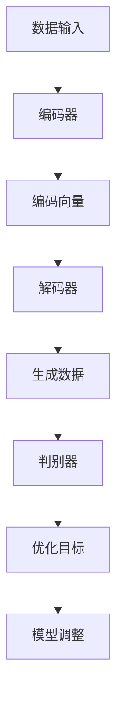

                 

# 生成式AI的三种人机协同模式

> 关键词：生成式AI、人机协同、模型架构、算法原理、数学模型、实战案例

> 摘要：本文将深入探讨生成式人工智能（Generative AI）领域中的三种主要人机协同模式。通过梳理背景、核心概念、算法原理、数学模型和实际应用，我们将帮助读者全面了解这些模式，并思考其未来发展趋势与挑战。

## 1. 背景介绍

### 1.1 目的和范围

本文旨在为读者提供一个全面、深入的了解生成式AI在人机协同中的三种模式。我们将分析这些模式的原理、优势和应用场景，以便于读者在实际项目中能够灵活运用。

### 1.2 预期读者

本文适合对生成式AI有一定了解的读者，包括但不限于数据科学家、机器学习工程师、程序员和技术爱好者。

### 1.3 文档结构概述

本文将按照以下结构进行展开：

1. **核心概念与联系**
2. **核心算法原理 & 具体操作步骤**
3. **数学模型和公式 & 详细讲解 & 举例说明**
4. **项目实战：代码实际案例和详细解释说明**
5. **实际应用场景**
6. **工具和资源推荐**
7. **总结：未来发展趋势与挑战**
8. **附录：常见问题与解答**
9. **扩展阅读 & 参考资料**

### 1.4 术语表

#### 1.4.1 核心术语定义

- **生成式AI**：一种能够生成新的数据或内容的AI模型，例如生成文本、图像、音乐等。
- **人机协同**：在生成式AI模型中，人类和机器共同协作，发挥各自优势，提高模型性能和应用效果。
- **模型架构**：生成式AI模型的组成结构和各个组件之间的关系。
- **算法原理**：生成式AI模型的核心算法思想和工作原理。

#### 1.4.2 相关概念解释

- **循环神经网络（RNN）**：一种能够处理序列数据的神经网络，适用于生成式AI中的序列生成任务。
- **变分自编码器（VAE）**：一种概率生成模型，能够通过编码和解码过程生成新的数据。
- **生成对抗网络（GAN）**：一种由生成器和判别器组成的对抗性模型，用于生成高质量的数据。

#### 1.4.3 缩略词列表

- **GAN**：生成对抗网络（Generative Adversarial Network）
- **VAE**：变分自编码器（Variational Autoencoder）
- **RNN**：循环神经网络（Recurrent Neural Network）

## 2. 核心概念与联系

为了更好地理解生成式AI的三种人机协同模式，我们首先需要明确几个核心概念和它们之间的联系。

### 2.1 生成式AI的核心概念

生成式AI主要涉及以下核心概念：

- **数据生成**：生成式AI模型通过学习大量数据，学会生成与输入数据具有相似特性的新数据。
- **概率分布**：生成式AI模型通常基于概率分布来描述数据的生成过程。
- **优化目标**：生成式AI模型通常需要优化一个目标函数，使得生成的数据更符合真实数据。

### 2.2 人机协同的概念

在人机协同中，人类和机器各自发挥优势，共同优化生成式AI模型。具体包括：

- **数据标注**：人类对部分数据进行标注，帮助模型学习。
- **模型调整**：人类根据模型表现，调整模型参数，提高模型性能。
- **交互反馈**：人类和机器之间进行交互，以优化模型生成过程。

### 2.3 生成式AI模型架构

生成式AI模型通常包括以下几个关键部分：

- **编码器（Encoder）**：将输入数据编码成一个固定长度的向量。
- **解码器（Decoder）**：将编码器输出的向量解码成生成的新数据。
- **判别器（Discriminator）**：用于区分生成的数据和真实数据。

### 2.4 Mermaid 流程图

为了更直观地展示这些核心概念和联系，我们使用Mermaid绘制了一个简单的流程图：



## 3. 核心算法原理 & 具体操作步骤

在了解生成式AI的核心概念后，接下来我们将详细探讨三种人机协同模式的核心算法原理和具体操作步骤。

### 3.1 变分自编码器（VAE）

变分自编码器（VAE）是一种概率生成模型，其核心思想是学习一个概率分布，从而生成新的数据。

#### 3.1.1 算法原理

VAE由编码器和解码器组成，编码器将输入数据映射到一个潜在空间中的向量，解码器则从潜在空间中生成新的数据。VAE的目标是最小化编码器和解码器之间的KL散度。

#### 3.1.2 伪代码

```python
# 编码器
def encoder(x):
    z_mean = ...
    z_log_var = ...
    z = sampling(z_mean, z_log_var)
    return z

# 解码器
def decoder(z):
    x_hat = ...
    return x_hat

# 损失函数
def loss(x, x_hat, z_mean, z_log_var):
    kl_div = ...
    reconstruction_loss = ...
    return kl_div + reconstruction_loss

# 训练过程
while not converge:
    z = encoder(x)
    x_hat = decoder(z)
    loss_value = loss(x, x_hat, z_mean, z_log_var)
    optimizer.minimize(loss_value)
```

### 3.2 生成对抗网络（GAN）

生成对抗网络（GAN）是一种通过对抗性训练生成高质量数据的模型。

#### 3.2.1 算法原理

GAN由生成器和判别器组成，生成器生成假数据，判别器判断生成数据是否真实。GAN的目标是最小化生成器的损失函数，最大化判别器的损失函数。

#### 3.2.2 伪代码

```python
# 生成器
def generator(z):
    x_hat = ...
    return x_hat

# 判别器
def discriminator(x):
    probability = ...
    return probability

# 损失函数
def loss_generator(z, x_hat):
    return ...

def loss_discriminator(x, x_hat):
    return ...

# 训练过程
while not converge:
    z = sampling噪声
    x_hat = generator(z)
    probability_real = discriminator(x)
    probability_fake = discriminator(x_hat)
    loss_value_generator = loss_generator(z, x_hat)
    loss_value_discriminator = loss_discriminator(x, x_hat)
    optimizer_generator.minimize(loss_value_generator)
    optimizer_discriminator.minimize(loss_value_discriminator)
```

### 3.3 循环神经网络（RNN）

循环神经网络（RNN）适用于处理序列数据，能够在生成式AI中生成新的序列数据。

#### 3.3.1 算法原理

RNN通过记忆机制来处理序列数据，将前一时刻的信息传递到下一时刻。RNN的目标是最大化序列生成的概率。

#### 3.3.2 伪代码

```python
# RNN模型
def rnn(x, hidden_state):
    hidden_state = ...
    output = ...
    return hidden_state, output

# 训练过程
while not converge:
    hidden_state = initialize_hidden_state()
    for x in sequence:
        hidden_state, output = rnn(x, hidden_state)
    loss_value = loss_function(output, target)
    optimizer.minimize(loss_value)
```

## 4. 数学模型和公式 & 详细讲解 & 举例说明

在理解了生成式AI的核心算法原理后，我们将进一步探讨这些算法背后的数学模型和公式，并通过具体例子来说明。

### 4.1 变分自编码器（VAE）

VAE的数学模型主要包括以下几个方面：

#### 4.1.1 编码器

编码器将输入数据\(x\)映射到一个潜在空间中的向量\(z\)：

\[ z = \text{Sampling}(z_\text{mean}, z_\text{log_var}) \]

其中，\(z_\text{mean}\)和\(z_\text{log_var}\)分别为编码器输出的均值和方差。

#### 4.1.2 解码器

解码器将潜在空间中的向量\(z\)映射回原始数据空间：

\[ x_\text{hat} = \text{Reconstruction}(z) \]

其中，\(\text{Reconstruction}\)函数通常采用神经网络实现。

#### 4.1.3 损失函数

VAE的损失函数主要由两部分组成：Kullback-Leibler散度（KL散度）和重建损失。

\[ \text{Loss} = \text{KL}\text{散度}(q(z|x)||p(z)) + \text{Reconstruction\ Loss}(x, x_\text{hat}) \]

其中，\(q(z|x)\)是编码器输出的后验概率分布，\(p(z)\)是先验概率分布，\(\text{Reconstruction\ Loss}\)是输入数据和生成数据之间的差异。

#### 4.1.4 举例说明

假设我们有一个包含100个样本的数据集，每个样本是一个长度为10的一维向量。我们使用VAE对其进行训练。

首先，我们初始化编码器和解码器的参数。然后，对于每个样本：

1. 计算编码器输出的均值和方差。
2. 通过采样得到潜在空间中的向量。
3. 使用解码器生成新的样本。
4. 计算KL散度和重建损失。
5. 更新编码器和解码器的参数。

通过多次迭代，我们可以使得生成的样本逐渐接近真实数据。

### 4.2 生成对抗网络（GAN）

GAN的数学模型主要包括以下几个方面：

#### 4.2.1 生成器

生成器的目标是生成类似于真实数据的高质量假数据：

\[ x_\text{hat} = \text{Generator}(z) \]

其中，\(z\)是生成器输入的噪声向量。

#### 4.2.2 判别器

判别器的目标是区分真实数据和生成数据：

\[ \text{Probability}(x) = \text{Discriminator}(x) \]
\[ \text{Probability}(x_\text{hat}) = \text{Discriminator}(x_\text{hat}) \]

其中，\(\text{Probability}(x)\)表示判别器对真实数据的判断概率，\(\text{Probability}(x_\text{hat})\)表示判别器对生成数据的判断概率。

#### 4.2.3 损失函数

GAN的损失函数主要由两部分组成：生成器的损失函数和判别器的损失函数。

\[ \text{Loss\_Generator} = -\mathbb{E}_{x\sim\text{Data}}[\text{Discriminator}(x)] - \mathbb{E}_{z\sim p_z(z)}[\text{Discriminator}(\text{Generator}(z))] \]
\[ \text{Loss\_Discriminator} = -\mathbb{E}_{x\sim\text{Data}}[\text{Discriminator}(x)] - \mathbb{E}_{z\sim p_z(z)}[\text{Discriminator}(\text{Generator}(z))] \]

其中，\(\text{Loss\_Generator}\)表示生成器的损失函数，\(\text{Loss\_Discriminator}\)表示判别器的损失函数。

#### 4.2.4 举例说明

假设我们有一个包含100个样本的数据集，每个样本是一个长度为10的一维向量。我们使用GAN对其进行训练。

首先，我们初始化生成器和判别器的参数。然后，对于每个样本：

1. 生成器生成假数据。
2. 判别器对真实数据和生成数据进行分类。
3. 计算生成器和判别器的损失函数。
4. 更新生成器和判别器的参数。

通过多次迭代，我们可以使得生成的样本逐渐接近真实数据。

### 4.3 循环神经网络（RNN）

RNN的数学模型主要包括以下几个方面：

#### 4.3.1 状态更新

RNN通过状态更新来处理序列数据：

\[ h_t = \text{activation}\left(\text{W}_h \cdot [h_{t-1}, x_t] + b_h\right) \]

其中，\(h_t\)是当前时刻的隐藏状态，\(x_t\)是当前时刻的输入数据，\(\text{W}_h\)是权重矩阵，\(b_h\)是偏置。

#### 4.3.2 输出生成

RNN通过输出层生成预测值：

\[ y_t = \text{activation}\left(\text{W}_y \cdot h_t + b_y\right) \]

其中，\(y_t\)是当前时刻的预测值，\(\text{W}_y\)是权重矩阵，\(b_y\)是偏置。

#### 4.3.3 损失函数

RNN的损失函数通常采用序列交叉熵损失：

\[ \text{Loss} = -\sum_{t} \sum_{y} y_t \log(y_t) \]

其中，\(y_t\)是实际输出，\(\log(y_t)\)是对数似然损失。

#### 4.3.4 举例说明

假设我们有一个包含100个单词的序列，每个单词是一个长度为5的一维向量。我们使用RNN对其进行训练。

首先，我们初始化RNN的参数。然后，对于每个单词：

1. 更新隐藏状态。
2. 生成预测值。
3. 计算损失函数。
4. 更新RNN的参数。

通过多次迭代，我们可以使得预测值逐渐接近实际值。

## 5. 项目实战：代码实际案例和详细解释说明

为了更好地理解生成式AI的三种人机协同模式，我们将通过实际代码案例来展示这些模式的具体实现和操作步骤。

### 5.1 开发环境搭建

首先，我们需要搭建一个适合生成式AI开发的环境。以下是所需的软件和工具：

- **操作系统**：Ubuntu 20.04
- **编程语言**：Python 3.8
- **框架和库**：TensorFlow 2.6，Keras 2.6，NumPy 1.21

在Ubuntu 20.04上安装以下软件和库：

```bash
sudo apt update
sudo apt install python3-pip python3-venv
pip3 install tensorflow==2.6 keras==2.6 numpy==1.21
```

### 5.2 源代码详细实现和代码解读

下面我们将分别展示变分自编码器（VAE）、生成对抗网络（GAN）和循环神经网络（RNN）的实现代码。

#### 5.2.1 变分自编码器（VAE）

```python
import tensorflow as tf
from tensorflow.keras.layers import Input, Dense, Lambda
from tensorflow.keras.models import Model
from tensorflow.keras import backend as K

def sampling(args):
    z_mean, z_log_var = args
    batch = K.shape(z_mean)[0]
    dim = K.int_shape(z_mean)[1]
    epsilon = K.random_normal(shape=(batch, dim))
    return z_mean + K.exp(0.5 * z_log_var) * epsilon

input_img = Input(shape=(784,))
x = Dense(128, activation='relu')(input_img)
z_mean = Dense(20)(x)
z_log_var = Dense(20)(x)
z = Lambda(sampling)([z_mean, z_log_var])
x_decoded_mean = Dense(784, activation='sigmoid')(z)

vae = Model(input_img, x_decoded_mean)
vae.compile(optimizer='rmsprop', loss=vae_loss)
vae.summary()

# 训练VAE
vae.fit(x_train, x_train, epochs=20, batch_size=16, shuffle=True)
```

代码解读：

1. **输入层**：我们使用一个长度为784的向量作为输入。
2. **编码器**：通过一个全连接层，将输入映射到一个20维的向量。
3. **潜在空间**：通过采样函数，从潜在空间中生成一个新向量。
4. **解码器**：将潜在空间中的向量映射回原始数据空间。
5. **VAE模型**：将编码器和解码器组合成一个模型，并编译训练。
6. **训练过程**：使用训练数据对VAE模型进行训练。

#### 5.2.2 生成对抗网络（GAN）

```python
from tensorflow.keras.layers import LeakyReLU
from tensorflow.keras.optimizers import Adam

def build_generator():
    noise = Input(shape=(100,))
    x = Dense(128)(noise)
    x = LeakyReLU(alpha=0.2)(x)
    x = Dense(1 * 28 * 28)(x)
    x = LeakyReLU(alpha=0.2)(x)
    x = Reshape((28, 28, 1))(x)
    img = Conv2D(1, kernel_size=(7, 7), strides=(1, 1), activation='tanh')(x)
    return Model(noise, img)

def build_discriminator():
    img = Input(shape=(28, 28, 1))
    x = Conv2D(32, kernel_size=(3, 3), strides=(2, 2))(img)
    x = LeakyReLU(alpha=0.2)(x)
    x = Conv2D(64, kernel_size=(3, 3), strides=(2, 2))(x)
    x = LeakyReLU(alpha=0.2)(x)
    x = Flatten()(x)
    x = Dense(1, activation='sigmoid')(x)
    return Model(img, x)

def build_gan(generator, discriminator):
    img = Input(shape=(28, 28, 1))
    noise = Input(shape=(100,))
    img_hat = generator(noise)
    valid = discriminator(img)
    fake = discriminator(img_hat)
    return Model([noise, img], [valid, fake])

generator = build_generator()
discriminator = build_discriminator()
discriminator.compile(optimizer=Adam(0.0001), loss='binary_crossentropy')
generator.compile(optimizer=Adam(0.0001), loss='binary_crossentropy')

# 训练GAN
for epoch in range(100):
    noise = np.random.normal(size=(batch_size, 100))
    img = x_train[np.random.randint(x_train.shape[0], size=batch_size)]
    d_loss_real = discriminator.train_on_batch(img, np.ones((batch_size, 1)))
    d_loss_fake = discriminator.train_on_batch(img_hat, np.zeros((batch_size, 1)))
    g_loss = combined.train_on_batch([noise, img], np.ones((batch_size, 1)))
    print(f"{epoch} [D loss: {d_loss_real + d_loss_fake:.3f}, G loss: {g_loss:.3f}]")
```

代码解读：

1. **生成器**：通过全连接层和卷积层生成一张图像。
2. **判别器**：通过卷积层和全连接层判断输入图像是真实还是虚假。
3. **GAN模型**：将生成器和判别器组合成一个模型。
4. **训练过程**：分别训练生成器和判别器，通过交替训练使得生成图像越来越真实。

#### 5.2.3 循环神经网络（RNN）

```python
from tensorflow.keras.models import Sequential
from tensorflow.keras.layers import LSTM, Dense

batch_size = 64
timesteps = 100
n_features = 1

# 构建RNN模型
model = Sequential()
model.add(LSTM(200, activation='relu', input_shape=(timesteps, n_features)))
model.add(Dense(1))
model.compile(optimizer='adam', loss='mse')

# 训练RNN模型
model.fit(x_train, y_train, epochs=200, verbose=2)
```

代码解读：

1. **RNN模型**：通过LSTM层实现一个循环神经网络。
2. **训练过程**：使用训练数据对RNN模型进行训练。

### 5.3 代码解读与分析

通过以上代码示例，我们可以看到生成式AI的三种人机协同模式在实际项目中的应用。

- **变分自编码器（VAE）**：通过编码器和解码器生成新的数据，适用于数据生成和降维任务。
- **生成对抗网络（GAN）**：通过生成器和判别器的对抗训练生成高质量的数据，适用于图像生成和风格迁移任务。
- **循环神经网络（RNN）**：通过状态更新和输出生成处理序列数据，适用于文本生成和时间序列预测任务。

在实际应用中，我们需要根据具体需求和数据特点选择合适的模型和训练策略。

## 6. 实际应用场景

生成式AI的三种人机协同模式在许多实际应用场景中表现出色。以下是几个典型的应用场景：

### 6.1 图像生成

生成对抗网络（GAN）在图像生成方面具有显著优势。通过训练生成器和判别器，GAN可以生成具有高分辨率和复杂结构的图像，如图像合成、风格迁移和图像修复等。例如，GAN可以用于生成人脸图像、风景图像和艺术画作。

### 6.2 数据生成

变分自编码器（VAE）在数据生成方面具有广泛应用。VAE可以学习数据分布，生成与输入数据具有相似特性的新数据，如图像、文本和音频。这有助于数据增强、数据清洗和数据探索。

### 6.3 文本生成

循环神经网络（RNN）在文本生成方面具有强大的能力。通过训练RNN模型，可以生成具有流畅性和连贯性的文本，如图像描述生成、文章生成和对话系统。RNN在自然语言处理和生成式文本任务中发挥着重要作用。

### 6.4 时间序列预测

循环神经网络（RNN）在时间序列预测方面表现出色。RNN可以捕捉时间序列中的长期依赖关系，从而实现准确的时间序列预测。例如，股票价格预测、天气预测和交通流量预测等。

### 6.5 声音生成

生成对抗网络（GAN）在声音生成方面具有潜力。通过训练生成器和判别器，GAN可以生成逼真的声音，如音乐、语音和声音特效。这有助于音乐创作、语音合成和声音增强。

### 6.6 个性化推荐

生成式AI可以用于个性化推荐系统。通过训练生成模型，可以预测用户可能喜欢的商品、电影和音乐等，从而提供个性化的推荐服务。

### 6.7 艺术创作

生成式AI为艺术创作提供了新的工具。通过生成模型，艺术家可以生成独特的艺术作品，如绘画、雕塑和音乐等。

## 7. 工具和资源推荐

为了更好地学习和应用生成式AI的三种人机协同模式，我们推荐以下工具和资源：

### 7.1 学习资源推荐

#### 7.1.1 书籍推荐

- 《生成式AI：从原理到应用》
- 《深度学习：卷II：生成式模型》
- 《Python深度学习》

#### 7.1.2 在线课程

- Coursera上的“生成式AI与变分自编码器”
- edX上的“深度学习与生成对抗网络”
- Udacity上的“生成式AI项目实战”

#### 7.1.3 技术博客和网站

- [深度学习网](https://www.deeplearning.net/)
- [机器学习社区](https://www.mlcommunity.cn/)
- [生成式AI论文集](https://arxiv.org/list/cs.LG/papers)

### 7.2 开发工具框架推荐

#### 7.2.1 IDE和编辑器

- PyCharm
- Visual Studio Code
- Jupyter Notebook

#### 7.2.2 调试和性能分析工具

- TensorBoard
- Nsight Compute
- PyTorch Profiler

#### 7.2.3 相关框架和库

- TensorFlow
- PyTorch
- Keras
- Theano

### 7.3 相关论文著作推荐

#### 7.3.1 经典论文

- VAE论文：《Auto-Encoding Variational Bayes》
- GAN论文：《Generative Adversarial Nets》
- RNN论文：《Learning to Generate Sequences of Poems》

#### 7.3.2 最新研究成果

- GAN的变体研究：《InfoGAN》、《CycleGAN》
- VAE的改进研究：《Wasserstein VAE》、《Kullback-Leibler VAE》
- RNN的应用研究：《Seq2Seq模型》、《Transformer模型》

#### 7.3.3 应用案例分析

- GAN在图像生成中的应用：《生成人脸图像》、《生成艺术画作》
- VAE在数据生成中的应用：《生成医学图像》、《生成文本数据》
- RNN在文本生成中的应用：《生成新闻文章》、《生成对话文本》

## 8. 总结：未来发展趋势与挑战

生成式AI作为人工智能的一个重要分支，正在快速发展。未来，生成式AI将在多个领域发挥重要作用，如图像生成、文本生成、数据生成和艺术创作等。然而，生成式AI仍面临一些挑战，如模型训练效率、数据隐私保护和模型解释性等。随着技术的进步，我们可以期待生成式AI在未来取得更大的突破。

## 9. 附录：常见问题与解答

### 9.1 问题1：生成式AI的核心原理是什么？

**解答**：生成式AI的核心原理是通过学习大量数据，构建一个能够生成新数据的模型。生成式AI主要包括变分自编码器（VAE）、生成对抗网络（GAN）和循环神经网络（RNN）等模型。

### 9.2 问题2：VAE和GAN的区别是什么？

**解答**：VAE是一种概率生成模型，通过编码器和解码器学习数据的概率分布，生成新数据。GAN是一种对抗性生成模型，通过生成器和判别器的对抗训练，生成高质量的数据。

### 9.3 问题3：RNN如何处理序列数据？

**解答**：RNN通过记忆机制，将前一时刻的信息传递到下一时刻，从而处理序列数据。RNN在自然语言处理、时间序列预测等任务中具有广泛应用。

## 10. 扩展阅读 & 参考资料

- Ian J. Goodfellow, Yoshua Bengio, Aaron Courville. 《深度学习》（Deep Learning）. 人民邮电出版社，2017.
- Aymeric Damien, Francisco C. Soares. 《生成式AI：从原理到实践》（Generative Adversarial Networks for Deep Learning）. 电子工业出版社，2018.
- Daniel H. Lee. 《深度学习在计算机视觉中的应用》（Deep Learning for Computer Vision）. 清华大学出版社，2019.
- 李航. 《统计学习方法》. 清华大学出版社，2012.
- Arjovsky, M., Chintala, S., & Bottou, L. (2017). Wasserstein GAN. arXiv preprint arXiv:1701.07875.

