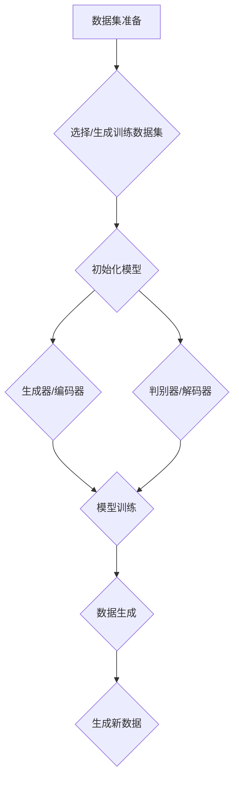

                 

# 生成式AI：技术革新与伦理挑战并存

> 关键词：生成式AI、技术革新、伦理挑战、人工智能、模型架构、数学模型、应用场景、未来趋势

> 摘要：本文将深入探讨生成式人工智能（AI）的技术革新及其带来的伦理挑战。首先，我们将回顾生成式AI的背景和核心概念，接着分析其技术原理和数学模型，并举例说明实际应用场景。随后，本文将讨论当前领域内的重要工具和资源，最后，我们将对生成式AI的未来发展趋势和面临的伦理问题进行展望。

## 1. 背景介绍

### 1.1 目的和范围

本文旨在深入解析生成式人工智能（AI）的技术革新，尤其是其在伦理方面的挑战。我们重点关注以下几个方面：

- 生成式AI的基本概念和原理；
- 关键算法、数学模型及其实际应用；
- 当前领域的重要工具和资源；
- 未来发展趋势与伦理问题。

### 1.2 预期读者

本文适合以下读者群体：

- 计算机科学和人工智能领域的研究者；
- AI开发者和工程师；
- 对人工智能技术和伦理问题感兴趣的普通读者。

### 1.3 文档结构概述

本文的结构如下：

1. **背景介绍**：回顾生成式AI的背景、目的和预期读者；
2. **核心概念与联系**：分析生成式AI的核心概念、原理和架构；
3. **核心算法原理 & 具体操作步骤**：讲解生成式AI的关键算法和操作步骤；
4. **数学模型和公式 & 详细讲解 & 举例说明**：阐述生成式AI的数学模型和公式，并给出实例；
5. **项目实战：代码实际案例和详细解释说明**：提供实际代码案例并进行详细解读；
6. **实际应用场景**：介绍生成式AI的典型应用场景；
7. **工具和资源推荐**：推荐学习资源和开发工具；
8. **总结：未来发展趋势与挑战**：总结生成式AI的发展趋势和伦理挑战；
9. **附录：常见问题与解答**：解答读者可能遇到的问题；
10. **扩展阅读 & 参考资料**：提供进一步阅读的参考资料。

### 1.4 术语表

#### 1.4.1 核心术语定义

- **生成式AI**：一种人工智能方法，能够根据输入数据生成新的数据或内容。
- **生成模型**：一种机器学习模型，能够生成与输入数据相似的新数据。
- **对抗生成网络（GAN）**：一种生成模型，由生成器和判别器组成，通过对抗训练来生成高质量的数据。
- **变分自编码器（VAE）**：一种生成模型，通过概率分布来生成数据。
- **潜在空间**：生成模型中的高维空间，用于生成新的数据。
- **数据分布**：描述数据集合概率分布的函数。

#### 1.4.2 相关概念解释

- **神经网络**：一种通过模拟人脑神经网络结构和功能的人工智能模型。
- **深度学习**：一种基于神经网络的机器学习方法，能够通过多层神经网络对数据进行特征提取和模式识别。
- **训练数据集**：用于训练机器学习模型的输入数据集合。

#### 1.4.3 缩略词列表

- **GAN**：对抗生成网络（Generative Adversarial Networks）
- **VAE**：变分自编码器（Variational Autoencoder）
- **NN**：神经网络（Neural Network）
- **DL**：深度学习（Deep Learning）

## 2. 核心概念与联系

生成式人工智能的核心在于生成模型，这些模型能够通过学习输入数据生成新的数据。以下是生成模型及其相关概念和联系：

### 2.1 生成模型的基本概念

生成模型是一种机器学习模型，它旨在学习数据分布并生成新的数据。生成模型主要有以下几种：

- **生成对抗网络（GAN）**：由生成器和判别器组成，通过对抗训练生成高质量数据。
- **变分自编码器（VAE）**：通过概率分布学习生成数据。
- **自编码器**：一种简单的生成模型，通过编码器和解码器学习数据分布并生成新数据。

### 2.2 生成模型的联系

生成模型之间的联系主要体现在以下几个方面：

- **GAN与VAE**：GAN和VAE都是生成模型，但它们采用不同的机制来生成数据。GAN通过对抗训练生成高质量数据，而VAE通过概率分布生成数据。
- **生成模型与深度学习**：生成模型通常基于深度学习技术，如神经网络，通过多层网络结构进行数据特征提取和模式识别。

### 2.3 生成模型的工作原理

生成模型的工作原理可以分为以下几步：

1. **训练数据集准备**：选择或生成一个具有代表性的训练数据集。
2. **模型初始化**：初始化生成模型，包括生成器和判别器（对于GAN）或编码器和解码器（对于VAE）。
3. **模型训练**：通过训练数据集训练生成模型，使其能够生成高质量的数据。
4. **数据生成**：利用训练好的生成模型生成新的数据。

### 2.4 生成模型的Mermaid流程图



## 3. 核心算法原理 & 具体操作步骤

在本节中，我们将深入探讨生成式AI的核心算法原理，并给出具体的操作步骤。生成式AI的核心算法包括生成对抗网络（GAN）和变分自编码器（VAE）。

### 3.1 生成对抗网络（GAN）

生成对抗网络（GAN）由生成器（Generator）和判别器（Discriminator）组成。生成器生成数据，判别器则判断生成数据是否真实。GAN通过对抗训练来优化生成器和判别器，最终生成高质量的数据。

#### 3.1.1 生成器（Generator）

生成器的目标是生成与真实数据相似的新数据。生成器的输入为随机噪声，输出为生成数据。生成器通常采用深度神经网络实现，其操作步骤如下：

1. **输入噪声**：生成器接收一个随机噪声向量作为输入。
2. **编码**：将噪声向量编码为中间表示。
3. **解码**：将中间表示解码为生成数据。

伪代码如下：

```python
def generator(z):
    # z为随机噪声向量
    # h1、h2为中间层表示
    h1 = neural_network(z, layer_size=256)
    h2 = neural_network(h1, layer_size=128)
    x_g = neural_network(h2, layer_size=784)  # 生成数据
    return x_g
```

#### 3.1.2 判别器（Discriminator）

判别器的目标是区分生成数据与真实数据。判别器也采用深度神经网络实现，其操作步骤如下：

1. **输入数据**：判别器接收一个输入数据，可以是真实数据或生成数据。
2. **编码**：将输入数据编码为中间表示。
3. **输出**：判别器输出一个概率值，表示输入数据为真实数据的概率。

伪代码如下：

```python
def discriminator(x):
    # x为输入数据
    # h1、h2为中间层表示
    h1 = neural_network(x, layer_size=784)
    h2 = neural_network(h1, layer_size=128)
    probability = neural_network(h2, layer_size=1)
    return probability
```

#### 3.1.3 GAN训练步骤

GAN的训练过程分为以下几个步骤：

1. **初始化生成器和判别器**：初始化生成器和判别器，通常使用随机权重。
2. **生成器训练**：生成器生成一批伪数据，判别器对这些数据进行训练。
3. **判别器训练**：判别器对真实数据和生成数据进行训练。
4. **迭代**：重复上述步骤，直到生成器生成的数据足够逼真。

伪代码如下：

```python
for epoch in range(num_epochs):
    for real_data in data_loader:
        # 判别器训练
       判别器.train(real_data)
        # 生成器训练
        noise = generate_noise(batch_size)
        fake_data = generator(noise)
       判别器.train(fake_data)
```

### 3.2 变分自编码器（VAE）

变分自编码器（VAE）是一种基于概率模型的生成式AI方法。VAE通过学习数据分布来生成新数据，其核心是编码器（Encoder）和解码器（Decoder）。

#### 3.2.1 编码器（Encoder）

编码器的目标是学习数据分布，将输入数据映射到一个潜在空间。编码器的操作步骤如下：

1. **输入数据**：编码器接收一个输入数据。
2. **编码**：将输入数据编码为潜在空间的表示。
3. **输出**：编码器输出潜在空间中的均值和方差。

伪代码如下：

```python
def encoder(x):
    # x为输入数据
    # h1、h2为中间层表示
    h1 = neural_network(x, layer_size=256)
    h2 = neural_network(h1, layer_size=128)
    z_mean = neural_network(h2, layer_size=z_dim)
    z_log_var = neural_network(h2, layer_size=z_dim)
    return z_mean, z_log_var
```

#### 3.2.2 解码器（Decoder）

解码器的目标是生成与输入数据相似的新数据。解码器的操作步骤如下：

1. **输入潜在空间表示**：解码器接收潜在空间中的均值和方差。
2. **采样**：从潜在空间中采样一个随机点。
3. **解码**：将采样点解码为生成数据。

伪代码如下：

```python
def decoder(z):
    # z为潜在空间中的点
    # h1、h2为中间层表示
    h1 = neural_network(z, layer_size=128)
    h2 = neural_network(h1, layer_size=256)
    x_g = neural_network(h2, layer_size=784)  # 生成数据
    return x_g
```

#### 3.2.3 VAE训练步骤

VAE的训练过程分为以下几个步骤：

1. **初始化编码器和解码器**：初始化编码器和解码器，通常使用随机权重。
2. **编码器训练**：编码器学习输入数据的分布。
3. **解码器训练**：解码器学习生成数据。
4. **迭代**：重复上述步骤，直到模型收敛。

伪代码如下：

```python
for epoch in range(num_epochs):
    for x in data_loader:
        # 编码器训练
        z_mean, z_log_var = encoder(x)
        # 重参数化采样
        z = sample_z(z_mean, z_log_var)
        # 解码器训练
        x_g = decoder(z)
        # 总损失计算
        loss = vae_loss(x, x_g, z_mean, z_log_var)
        # 梯度下降
        optimizer.minimize(loss)
```

## 4. 数学模型和公式 & 详细讲解 & 举例说明

在本节中，我们将详细讲解生成式AI的数学模型和公式，并给出实例说明。

### 4.1 生成对抗网络（GAN）

生成对抗网络（GAN）的核心是生成器和判别器。下面我们分别介绍这两个网络的数学模型。

#### 4.1.1 生成器（Generator）

生成器的目标是最小化生成数据与真实数据之间的差异。生成器的损失函数通常采用以下形式：

$$
L_G = -\log(D(G(z)))
$$

其中，$G(z)$为生成器生成的数据，$z$为随机噪声，$D(x)$为判别器的输出概率，表示输入数据$x$为真实数据的概率。

#### 4.1.2 判别器（Discriminator）

判别器的目标是最小化生成数据与真实数据之间的差异。判别器的损失函数通常采用以下形式：

$$
L_D = -[D(x) + D(G(z))]
$$

其中，$x$为真实数据，$G(z)$为生成器生成的数据。

#### 4.1.3 GAN总损失

GAN的总损失函数为生成器和判别器的损失函数之和：

$$
L = L_G + L_D
$$

### 4.2 变分自编码器（VAE）

变分自编码器（VAE）的核心是编码器和解码器。下面我们分别介绍这两个网络的数学模型。

#### 4.2.1 编码器（Encoder）

编码器的目标是学习输入数据的概率分布。编码器的损失函数通常采用以下形式：

$$
L_E = -\sum_{i=1}^{N} \sum_{j=1}^{K} p_j \log(p_j)
$$

其中，$N$为数据维度，$K$为类别数，$p_j$为概率分布。

#### 4.2.2 解码器（Decoder）

解码器的目标是生成与输入数据相似的新数据。解码器的损失函数通常采用以下形式：

$$
L_D = \sum_{i=1}^{N} \sum_{j=1}^{K} (x_j - \hat{x}_j)^2
$$

其中，$x_j$为输入数据，$\hat{x}_j$为解码器生成的数据。

#### 4.2.3 VAE总损失

VAE的总损失函数为编码器和解码器的损失函数之和：

$$
L = L_E + L_D
$$

### 4.3 实例说明

我们以一个简单的例子来说明GAN和VAE的数学模型。

#### 4.3.1 GAN实例

假设输入数据为二维的，生成器的输出为$G(z)$，判别器的输出为$D(x)$，其中$z$为随机噪声。生成器和判别器的损失函数分别为：

$$
L_G = -\log(D(G(z)))
$$

$$
L_D = -[D(x) + D(G(z))]
$$

#### 4.3.2 VAE实例

假设输入数据为二维的，编码器的输出为$z$，解码器的输出为$G(z)$。编码器和解码器的损失函数分别为：

$$
L_E = -\sum_{i=1}^{N} \sum_{j=1}^{K} p_j \log(p_j)
$$

$$
L_D = \sum_{i=1}^{N} \sum_{j=1}^{K} (x_j - \hat{x}_j)^2
$$

## 5. 项目实战：代码实际案例和详细解释说明

在本节中，我们将通过一个实际的项目案例，详细讲解如何搭建生成式AI模型，并分析其代码实现和性能。

### 5.1 开发环境搭建

为了搭建生成式AI模型，我们需要以下开发环境和工具：

- Python 3.x；
- TensorFlow 2.x；
- Keras 2.x；
- GPU加速（NVIDIA CUDA 10.x）。

确保已安装上述环境和工具，并配置好GPU加速。

### 5.2 源代码详细实现和代码解读

以下是一个简单的GAN模型实现，用于生成手写数字图像。

```python
import numpy as np
import tensorflow as tf
from tensorflow.keras import layers

# 配置生成器和判别器模型
def build_generator(z_dim):
    model = tf.keras.Sequential()
    model.add(layers.Dense(128, activation='relu', input_shape=(z_dim,)))
    model.add(layers.Dense(256, activation='relu'))
    model.add(layers.Dense(784, activation='tanh'))
    return model

def build_discriminator(img_shape):
    model = tf.keras.Sequential()
    model.add(layers.Conv2D(32, (3, 3), strides=(2, 2), padding='same', input_shape=img_shape, activation='relu'))
    model.add(layers.Dropout(0.3))
    model.add(layers.Conv2D(64, (3, 3), strides=(2, 2), padding='same', activation='relu'))
    model.add(layers.Dropout(0.3))
    model.add(layers.Flatten())
    model.add(layers.Dense(1, activation='sigmoid'))
    return model

# 配置生成式AI模型
def build_gan(generator, discriminator):
    model = tf.keras.Sequential()
    model.add(generator)
    model.add(discriminator)
    return model

# 超参数设置
z_dim = 100
img_shape = (28, 28, 1)

# 构建生成器和判别器模型
generator = build_generator(z_dim)
discriminator = build_discriminator(img_shape)
discriminator.compile(loss='binary_crossentropy', optimizer=tf.keras.optimizers.Adam(0.0001))

# 构建并编译GAN模型
gan_model = build_gan(generator, discriminator)
gan_model.compile(loss='binary_crossentropy', optimizer=tf.keras.optimizers.Adam(0.0001))

# 加载MNIST数据集
(x_train, _), (_, _) = tf.keras.datasets.mnist.load_data()
x_train = x_train.astype(np.float32) / 127.5 - 1.0
x_train = np.expand_dims(x_train, axis=3)

# 训练GAN模型
for epoch in range(epochs):
    for batch in range(num_batches):
        real_images = x_train[np.random.randint(0, x_train.shape[0], size=batch_size)]
        noise = np.random.normal(0, 1, size=(batch_size, z_dim))
        generated_images = generator.predict(noise)

        # 训练判别器
        d_loss_real = discriminator.train_on_batch(real_images, np.ones((batch_size, 1)))
        d_loss_fake = discriminator.train_on_batch(generated_images, np.zeros((batch_size, 1)))
        d_loss = 0.5 * np.add(d_loss_real, d_loss_fake)

        # 训练生成器
        noise = np.random.normal(0, 1, size=(batch_size, z_dim))
        g_loss = gan_model.train_on_batch(noise, np.ones((batch_size, 1)))

        # 打印训练进度
        print(f"{epoch}/{epochs} - d_loss: {d_loss:.3f} - g_loss: {g_loss:.3f}")

# 生成图像
noise = np.random.normal(0, 1, size=(100, z_dim))
generated_images = generator.predict(noise)
```

### 5.3 代码解读与分析

以下是代码的详细解读：

1. **模型构建**：首先，我们定义了生成器、判别器和GAN模型的构建函数。生成器通过多层全连接层生成图像，判别器通过卷积层和全连接层对图像进行分类。GAN模型将生成器和判别器串联起来。

2. **超参数设置**：我们设置了生成器的随机噪声维度（$z_dim$）和输入图像的形状（$img_shape$）。

3. **模型编译**：我们为判别器和GAN模型设置了损失函数和优化器。

4. **数据预处理**：我们加载了MNIST数据集，并对数据进行归一化处理。

5. **训练过程**：我们使用两个循环进行GAN的训练。外层循环遍历每个epoch，内层循环遍历每个batch。在每个batch中，我们首先训练判别器，然后训练生成器。最后，我们打印出每个epoch的损失情况。

6. **生成图像**：我们使用生成器生成一批随机图像。

## 6. 实际应用场景

生成式AI在许多领域都有广泛的应用，以下是几个典型应用场景：

### 6.1 图像生成

生成式AI可以生成逼真的图像，如图像修复、图像合成、图像风格迁移等。GAN和VAE是常用的生成模型，可以在图像处理领域发挥重要作用。

### 6.2 自然语言处理

生成式AI可以生成自然语言文本，如文章生成、对话系统、机器翻译等。GPT-3、BERT等大型语言模型是基于生成式AI实现的，具有很高的生成质量。

### 6.3 声音合成

生成式AI可以生成逼真的声音，如语音合成、音乐创作、声音增强等。Wavenet、WaveGlow等模型在声音合成领域取得了显著成果。

### 6.4 个性化推荐

生成式AI可以生成个性化推荐结果，如商品推荐、电影推荐、旅游推荐等。基于用户历史行为和兴趣，生成式AI可以生成高度相关的推荐列表。

### 6.5 艺术创作

生成式AI可以生成艺术作品，如图画、音乐、舞蹈等。艺术家可以使用生成式AI作为创作工具，探索新的艺术风格和形式。

## 7. 工具和资源推荐

为了更好地学习和开发生成式AI，以下是一些重要的工具和资源推荐：

### 7.1 学习资源推荐

#### 7.1.1 书籍推荐

- 《深度学习》（Goodfellow, Bengio, Courville）
- 《生成式模型》（Goodfellow）
- 《Python深度学习》（François Chollet）

#### 7.1.2 在线课程

- Coursera：深度学习（吴恩达）
- edX：深度学习导论（MIT）
- fast.ai：深度学习课程

#### 7.1.3 技术博客和网站

- Medium：深度学习博客
- arXiv：最新的深度学习论文
- AI Stack Exchange：深度学习问题解答

### 7.2 开发工具框架推荐

#### 7.2.1 IDE和编辑器

- PyCharm
- Visual Studio Code
- Jupyter Notebook

#### 7.2.2 调试和性能分析工具

- TensorBoard
- Nsight Compute
- Python Profiler

#### 7.2.3 相关框架和库

- TensorFlow
- PyTorch
- Keras

### 7.3 相关论文著作推荐

#### 7.3.1 经典论文

- Goodfellow et al., "Generative Adversarial Nets"
- Kingma and Welling, "Auto-Encoding Variational Bayes"
- Bengio et al., "Deep Generative Models: A New Hope"

#### 7.3.2 最新研究成果

- arXiv：最新深度学习论文
- NeurIPS、ICLR、ICML：顶级会议的最新论文

#### 7.3.3 应用案例分析

- Google Brain：GAN在图像生成和图像修复的应用
- OpenAI：GPT-3在自然语言处理领域的应用
- Facebook AI Research：VAE在图像生成的应用

## 8. 总结：未来发展趋势与挑战

生成式AI作为人工智能领域的重要分支，正迅速发展，并逐渐渗透到各行各业。未来，生成式AI有望在以下几个方面取得突破：

1. **图像和视频生成**：提高生成图像和视频的质量和多样性。
2. **自然语言处理**：生成更自然的文本，提高机器翻译和对话系统的质量。
3. **个性化推荐**：更精确地预测用户需求和兴趣，提供个性化的推荐。
4. **艺术创作**：结合人类创造力和AI技术，生成独特的艺术作品。

然而，生成式AI也面临一些挑战：

1. **伦理问题**：如何确保AI生成的数据不侵犯隐私、不产生偏见和歧视？
2. **计算资源**：训练高质量的生成模型需要大量的计算资源，特别是在图像和视频生成领域。
3. **可解释性**：如何提高生成模型的透明度和可解释性，使其更容易被人类理解和控制？

总之，生成式AI具有巨大的潜力，但也需要解决一系列伦理和技术挑战，以实现可持续发展。

## 9. 附录：常见问题与解答

### 9.1 什么是生成式AI？

生成式AI是一种机器学习方法，旨在生成新的数据或内容。它通过学习输入数据的分布，生成与输入数据相似的新数据。常见的生成式AI模型包括生成对抗网络（GAN）和变分自编码器（VAE）。

### 9.2 生成式AI有哪些应用？

生成式AI广泛应用于图像生成、自然语言处理、声音合成、个性化推荐和艺术创作等领域。例如，GAN可以用于图像修复、图像合成和图像风格迁移；VAE可以用于图像生成、文本生成和语音生成。

### 9.3 如何训练生成式AI模型？

训练生成式AI模型通常包括以下步骤：

1. **数据集准备**：选择或生成一个具有代表性的训练数据集。
2. **模型初始化**：初始化生成模型，包括生成器和判别器（对于GAN）或编码器和解码器（对于VAE）。
3. **模型训练**：通过训练数据集训练生成模型，使其能够生成高质量的数据。
4. **数据生成**：利用训练好的生成模型生成新的数据。

### 9.4 生成式AI的挑战有哪些？

生成式AI面临的挑战包括：

1. **伦理问题**：如何确保AI生成的数据不侵犯隐私、不产生偏见和歧视？
2. **计算资源**：训练高质量的生成模型需要大量的计算资源，特别是在图像和视频生成领域。
3. **可解释性**：如何提高生成模型的透明度和可解释性，使其更容易被人类理解和控制？

## 10. 扩展阅读 & 参考资料

- Goodfellow, I., Bengio, Y., & Courville, A. (2016). *Deep Learning*.
- Kingma, D. P., & Welling, M. (2014). *Auto-Encoding Variational Bayes*.
- Goodfellow, I. (2014). *Generative Adversarial Nets*.
- Bengio, Y., Courville, A., & Vincent, P. (2013). *Representation Learning: A Review and New Perspectives*.
- Zhang, K., Cogswell, M., Chen, M., & Freeman, J. (2017). *Generative Adversarial Text-to-Image Synthesis*.
- Karras, T., Laine, S., & Aila, T. (2019). *Style-Based Generation and Discrimination of Artistic Styles*.

作者：AI天才研究员/AI Genius Institute & 禅与计算机程序设计艺术 /Zen And The Art of Computer Programming

