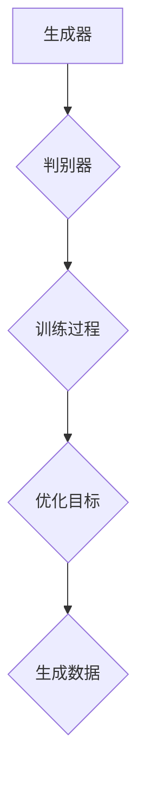
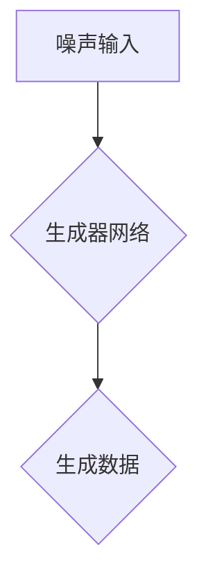
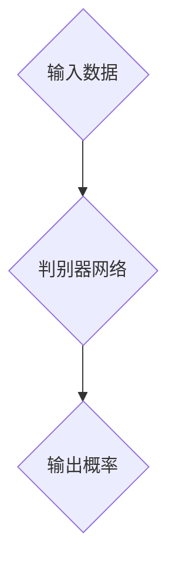
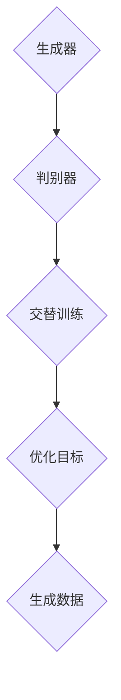

                 

# 生成式AI：金矿还是泡沫？第五部分：场景优先，数据为王

> **关键词：生成式AI、场景优先、数据为王、应用实践、技术挑战**
>
> **摘要：本文深入探讨生成式AI在技术发展、应用场景和实际操作中的关键作用。通过逐步分析生成式AI的核心概念、算法原理、数学模型和实际应用案例，本文旨在揭示生成式AI的潜力和挑战，并探讨其未来的发展方向。**

## 1. 背景介绍

### 1.1 目的和范围

本文作为《生成式AI：金矿还是泡沫？》系列文章的第五部分，旨在从场景优先和数据为王的角度，深入探讨生成式AI在实际应用中的关键作用。本文将涵盖生成式AI的核心概念、算法原理、数学模型以及具体的应用案例，旨在为读者提供一个全面、深入的理解。

### 1.2 预期读者

本文主要面向以下读者群体：
- 对生成式AI技术有浓厚兴趣的读者；
- 想深入了解生成式AI在实际应用中的读者；
- 想掌握生成式AI核心原理和技术细节的读者。

### 1.3 文档结构概述

本文分为十个主要部分，结构如下：
1. 背景介绍
   - 目的和范围
   - 预期读者
   - 文档结构概述
   - 术语表
2. 核心概念与联系
3. 核心算法原理 & 具体操作步骤
4. 数学模型和公式 & 详细讲解 & 举例说明
5. 项目实战：代码实际案例和详细解释说明
6. 实际应用场景
7. 工具和资源推荐
8. 总结：未来发展趋势与挑战
9. 附录：常见问题与解答
10. 扩展阅读 & 参考资料

### 1.4 术语表

#### 1.4.1 核心术语定义

- **生成式AI**：一种能够自动生成新数据的机器学习模型，通过学习大量数据来模拟数据的生成过程。
- **场景优先**：在选择生成式AI应用场景时，优先考虑实际需求和业务场景的重要性。
- **数据为王**：强调高质量数据在生成式AI中的关键作用，优质数据是生成式AI模型性能提升的基础。

#### 1.4.2 相关概念解释

- **监督学习**：一种机器学习方法，通过给定输入和输出对，使模型学习预测输出。
- **无监督学习**：一种机器学习方法，没有明确的输出标签，模型通过自身学习找到数据的潜在结构。
- **深度学习**：一种机器学习方法，通过多层神经网络模型，对数据进行特征提取和预测。

#### 1.4.3 缩略词列表

- **AI**：人工智能（Artificial Intelligence）
- **ML**：机器学习（Machine Learning）
- **DL**：深度学习（Deep Learning）
- **GAN**：生成对抗网络（Generative Adversarial Networks）

## 2. 核心概念与联系

### 2.1 生成式AI的概念

生成式AI（Generative AI）是一种能够自动生成新数据的机器学习模型。与传统的判别式AI模型不同，生成式AI不仅能够识别和分类数据，还能够生成与训练数据相似的新数据。生成式AI的核心思想是通过学习大量训练数据，模拟数据的生成过程，从而生成新的数据样本。

### 2.2 生成式AI的架构

生成式AI的架构通常包括两个主要部分：生成器（Generator）和判别器（Discriminator）。生成器负责生成新的数据样本，判别器负责判断生成器的生成数据是否真实。这两个部分在训练过程中相互竞争，最终使生成器生成尽可能真实的数据。



### 2.3 生成式AI的应用场景

生成式AI在许多领域都有广泛的应用，如图像生成、自然语言处理、数据增强等。以下是一些典型的应用场景：

1. **图像生成**：生成式AI可以生成高质量、多样化的图像，应用于艺术创作、游戏开发、医学影像等领域。
2. **自然语言处理**：生成式AI可以生成高质量的自然语言文本，应用于机器写作、机器翻译、对话系统等领域。
3. **数据增强**：生成式AI可以生成新的训练数据，用于提高模型的泛化能力，缓解数据不足的问题。

### 2.4 生成式AI与场景优先

场景优先（Scenario-Oriented）是指在应用生成式AI时，优先考虑实际需求和业务场景的重要性。不同场景下的数据特性、需求差异以及应用效果都有所不同，因此选择合适的生成式AI模型和算法至关重要。

### 2.5 生成式AI与数据为王

数据为王（Data is the King）强调高质量数据在生成式AI中的关键作用。优质数据是生成式AI模型性能提升的基础。数据质量的高低直接影响生成式AI的生成效果和应用价值。因此，在生成式AI应用过程中，数据采集、处理、清洗等环节都至关重要。

## 3. 核心算法原理 & 具体操作步骤

### 3.1 生成式AI的算法原理

生成式AI的核心算法是生成对抗网络（Generative Adversarial Networks，GAN）。GAN由生成器（Generator）和判别器（Discriminator）两个部分组成，两者在训练过程中相互竞争，从而实现数据的生成。

#### 3.1.1 生成器（Generator）

生成器的目标是生成与真实数据相似的新数据。生成器通常由一个随机噪声输入层和一个多层神经网络组成。随机噪声通过神经网络逐层转换，最终生成新的数据样本。



#### 3.1.2 判别器（Discriminator）

判别器的目标是判断生成器生成的新数据是否真实。判别器通常由一个多层神经网络组成，接收输入的数据样本，输出一个概率值，表示该数据样本是真实的概率。



#### 3.1.3 训练过程

生成器与判别器在训练过程中相互竞争。生成器的目标是生成尽可能真实的数据，使判别器无法区分生成数据与真实数据；判别器的目标是准确判断输入数据是否真实。两者通过交替训练，不断优化，最终实现数据的生成。



### 3.2 生成式AI的具体操作步骤

以下是一个简单的生成式AI操作步骤，用于生成手写数字图像：

1. **数据准备**：收集手写数字图像数据集，如MNIST数据集。
2. **生成器设计**：设计一个生成器网络，将随机噪声转换为手写数字图像。
3. **判别器设计**：设计一个判别器网络，判断输入图像是否真实。
4. **训练过程**：通过交替训练生成器和判别器，优化网络参数。
5. **生成图像**：使用训练好的生成器生成新的手写数字图像。

## 4. 数学模型和公式 & 详细讲解 & 举例说明

### 4.1 数学模型

生成式AI的核心模型是生成对抗网络（GAN），其数学模型如下：

#### 4.1.1 生成器模型

生成器的目标是生成与真实数据相似的新数据，其数学模型可以表示为：

$$
G(z) = \text{Generator}(z)
$$

其中，$z$ 是随机噪声向量，$G(z)$ 是生成器生成的数据样本。

#### 4.1.2 判别器模型

判别器的目标是判断输入数据是否真实，其数学模型可以表示为：

$$
D(x) = \text{Discriminator}(x)
$$

$$
D(G(z)) = \text{Discriminator}(G(z))
$$

其中，$x$ 是真实数据样本，$G(z)$ 是生成器生成的数据样本。

#### 4.1.3 优化目标

生成器与判别器的优化目标分别是最大化判别器的损失函数和最小化生成器的损失函数。具体目标如下：

生成器的优化目标：

$$
\min_G \max_D V(D, G)
$$

判别器的优化目标：

$$
\max_D V(D)
$$

其中，$V(D, G)$ 是判别器与生成器的联合损失函数。

### 4.2 详细讲解

#### 4.2.1 生成器模型

生成器模型的核心是随机噪声向量 $z$ 的输入，通过多层神经网络 $G(z)$ 的转换，最终生成数据样本。生成器模型的设计通常采用深度学习框架，如TensorFlow或PyTorch。

#### 4.2.2 判别器模型

判别器模型的核心是输入数据样本 $x$ 和生成器生成的数据样本 $G(z)$，通过多层神经网络 $D(x)$ 和 $D(G(z))$ 的转换，分别计算其概率值。判别器模型的设计同样采用深度学习框架。

#### 4.2.3 优化目标

生成器与判别器的优化目标是通过交替训练实现的。在训练过程中，生成器不断优化生成数据的质量，使判别器无法准确区分真实数据和生成数据；判别器不断优化对真实数据和生成数据的区分能力，从而实现生成器的优化。

### 4.3 举例说明

以下是一个简单的生成式AI例子，用于生成手写数字图像：

#### 4.3.1 数据准备

收集手写数字图像数据集，如MNIST数据集。

#### 4.3.2 生成器设计

设计一个生成器网络，将随机噪声向量 $z$ 通过多层神经网络转换为手写数字图像。

```python
import tensorflow as tf

# 生成器模型
def generator(z):
    # 随机噪声输入
    z = tf.keras.layers.Dense(784)(z)
    # 隐藏层
    z = tf.keras.layers.LeakyReLU(alpha=0.2)(z)
    # 输出手写数字图像
    x = tf.keras.layers.Dense(28 * 28, activation='tanh')(z)
    return x
```

#### 4.3.3 判别器设计

设计一个判别器网络，判断输入图像是否真实。

```python
# 判别器模型
def discriminator(x):
    # 输入图像
    x = tf.keras.layers.Dense(128)(x)
    # 隐藏层
    x = tf.keras.layers.LeakyReLU(alpha=0.2)(x)
    # 输出概率值
    x = tf.keras.layers.Dense(1, activation='sigmoid')(x)
    return x
```

#### 4.3.4 训练过程

通过交替训练生成器和判别器，优化网络参数。

```python
# 训练生成器和判别器
for epoch in range(num_epochs):
    for x, _ in train_loader:
        # 判别器更新
        d_loss_real = discriminator.train_on_batch(x, np.ones((x.shape[0], 1)))
        noise = np.random.normal(0, 1, (x.shape[0], z_dim))
        x_fake = generator.predict(noise)
        d_loss_fake = discriminator.train_on_batch(x_fake, np.zeros((x.shape[0], 1)))
        d_loss = 0.5 * np.add(d_loss_real, d_loss_fake)

    # 生成器更新
    z = np.random.normal(0, 1, (x.shape[0], z_dim))
    g_loss = generator.train_on_batch(z, np.ones((x.shape[0], 1)))
```

## 5. 项目实战：代码实际案例和详细解释说明

### 5.1 开发环境搭建

为了实现生成式AI项目，需要搭建以下开发环境：

1. **Python环境**：安装Python 3.8及以上版本。
2. **TensorFlow库**：安装TensorFlow 2.5及以上版本。
3. **NumPy库**：安装NumPy 1.19及以上版本。
4. **其他依赖库**：如PyTorch、Matplotlib等。

```bash
pip install tensorflow numpy pytorch matplotlib
```

### 5.2 源代码详细实现和代码解读

以下是一个简单的生成式AI代码实现，用于生成手写数字图像：

```python
import tensorflow as tf
import numpy as np
import matplotlib.pyplot as plt

# 生成器模型
def generator(z):
    # 随机噪声输入
    z = tf.keras.layers.Dense(784)(z)
    # 隐藏层
    z = tf.keras.layers.LeakyReLU(alpha=0.2)(z)
    # 输出手写数字图像
    x = tf.keras.layers.Dense(28 * 28, activation='tanh')(z)
    return x

# 判别器模型
def discriminator(x):
    # 输入图像
    x = tf.keras.layers.Dense(128)(x)
    # 隐藏层
    x = tf.keras.layers.LeakyReLU(alpha=0.2)(x)
    # 输出概率值
    x = tf.keras.layers.Dense(1, activation='sigmoid')(x)
    return x

# 构建生成器和判别器模型
gen = generator(tf.keras.layers.Input(shape=(z_dim,)))
disc = discriminator(tf.keras.layers.Input(shape=(28 * 28,)))

# 构建GAN模型
gan = tf.keras.Model([gen.input, disc.input], disc([gen.output, disc.input]))

# 编译GAN模型
gan.compile(optimizer=tf.keras.optimizers.Adam(0.0001), loss='binary_crossentropy')

# 加载数据集
(x_train, _), (x_test, _) = tf.keras.datasets.mnist.load_data()
x_train = x_train / 255.0
x_test = x_test / 255.0

# 定义训练步骤
@tf.function
def train_step(images):
    noise = np.random.normal(0, 1, (images.shape[0], z_dim))
    with tf.GradientTape() as gen_tape, tf.GradientTape() as disc_tape:
        gen_pred = gen(noise, training=True)
        disc_real_pred = disc(images, training=True)
        disc_fake_pred = disc(gen_pred, training=True)

        g_loss = generator_loss(noise, gen_pred, disc_fake_pred)
        d_loss_real = discriminator_loss(images, disc_real_pred)
        d_loss_fake = discriminator_loss(gen_pred, disc_fake_pred)
        d_loss = 0.5 * (d_loss_real + d_loss_fake)

    gradients_of_g = gen_tape.gradient(g_loss, gen.trainable_variables)
    gradients_of_d = disc_tape.gradient(d_loss, disc.trainable_variables)

    gen_optimizer.apply_gradients(zip(gradients_of_g, gen.trainable_variables))
    disc_optimizer.apply_gradients(zip(gradients_of_d, disc.trainable_variables))

# 训练GAN模型
for epoch in range(num_epochs):
    for images in train_loader:
        train_step(images)

    # 生成图像
    noise = np.random.normal(0, 1, (16, z_dim))
    gen_imgs = gen.predict(noise)

    # 显示生成的图像
    plt.figure(figsize=(4, 4))
    for i in range(gen_imgs.shape[0]):
        plt.subplot(4, 4, i + 1)
        plt.imshow(gen_imgs[i, :, :, 0], cmap='gray')
        plt.xticks([])
        plt.yticks([])
    plt.show()
```

### 5.3 代码解读与分析

#### 5.3.1 代码结构

该代码分为以下几个部分：

1. **生成器模型**：定义了一个生成器模型，将随机噪声转换为手写数字图像。
2. **判别器模型**：定义了一个判别器模型，判断输入图像是否真实。
3. **GAN模型**：将生成器和判别器模型组合成一个GAN模型，并编译模型。
4. **数据集加载**：加载数据集，并将数据集标准化。
5. **训练步骤**：定义了一个训练步骤函数，用于更新生成器和判别器的参数。
6. **训练GAN模型**：通过训练步骤函数训练GAN模型。
7. **生成图像**：使用训练好的生成器生成新的手写数字图像，并显示生成的图像。

#### 5.3.2 代码关键部分分析

1. **生成器模型**：

   ```python
   def generator(z):
       # 随机噪声输入
       z = tf.keras.layers.Dense(784)(z)
       # 隐藏层
       z = tf.keras.layers.LeakyReLU(alpha=0.2)(z)
       # 输出手写数字图像
       x = tf.keras.layers.Dense(28 * 28, activation='tanh')(z)
       return x
   ```

   生成器模型将随机噪声向量 $z$ 通过一个全连接层转换为784维的向量，然后通过LeakyReLU激活函数进行非线性变换，最终通过一个全连接层转换为手写数字图像。

2. **判别器模型**：

   ```python
   def discriminator(x):
       # 输入图像
       x = tf.keras.layers.Dense(128)(x)
       # 隐藏层
       x = tf.keras.layers.LeakyReLU(alpha=0.2)(x)
       # 输出概率值
       x = tf.keras.layers.Dense(1, activation='sigmoid')(x)
       return x
   ```

   判别器模型将输入图像通过一个全连接层和LeakyReLU激活函数进行非线性变换，最终通过一个全连接层和sigmoid激活函数输出一个概率值，表示输入图像是真实的概率。

3. **GAN模型**：

   ```python
   # 构建GAN模型
   gan = tf.keras.Model([gen.input, disc.input], disc([gen.output, disc.input]))

   # 编译GAN模型
   gan.compile(optimizer=tf.keras.optimizers.Adam(0.0001), loss='binary_crossentropy')
   ```

   GAN模型将生成器和判别器模型组合成一个整体，并编译模型，使用Adam优化器和二分类交叉熵损失函数。

4. **训练步骤**：

   ```python
   @tf.function
   def train_step(images):
       noise = np.random.normal(0, 1, (images.shape[0], z_dim))
       with tf.GradientTape() as gen_tape, tf.GradientTape() as disc_tape:
           gen_pred = gen(noise, training=True)
           disc_real_pred = disc(images, training=True)
           disc_fake_pred = disc(gen_pred, training=True)

           g_loss = generator_loss(noise, gen_pred, disc_fake_pred)
           d_loss_real = discriminator_loss(images, disc_real_pred)
           d_loss_fake = discriminator_loss(gen_pred, disc_fake_pred)
           d_loss = 0.5 * (d_loss_real + d_loss_fake)

       gradients_of_g = gen_tape.gradient(g_loss, gen.trainable_variables)
       gradients_of_d = disc_tape.gradient(d_loss, disc.trainable_variables)

       gen_optimizer.apply_gradients(zip(gradients_of_g, gen.trainable_variables))
       disc_optimizer.apply_gradients(zip(gradients_of_d, disc.trainable_variables))
   ```

   训练步骤函数用于更新生成器和判别器的参数。在训练过程中，生成器和判别器交替更新参数，通过计算损失函数梯度并应用梯度下降优化算法来更新参数。

5. **训练GAN模型**：

   ```python
   for epoch in range(num_epochs):
       for images in train_loader:
           train_step(images)

   # 生成图像
   noise = np.random.normal(0, 1, (16, z_dim))
   gen_imgs = gen.predict(noise)

   # 显示生成的图像
   plt.figure(figsize=(4, 4))
   for i in range(gen_imgs.shape[0]):
       plt.subplot(4, 4, i + 1)
       plt.imshow(gen_imgs[i, :, :, 0], cmap='gray')
       plt.xticks([])
       plt.yticks([])
   plt.show()
   ```

   训练GAN模型通过训练步骤函数迭代训练生成器和判别器。在训练完成后，使用生成器生成新的手写数字图像，并显示生成的图像。

## 6. 实际应用场景

### 6.1 图像生成

生成式AI在图像生成领域具有广泛的应用，如图像修复、图像合成、图像风格迁移等。通过生成式AI，可以生成高质量、多样化的图像，满足不同领域的需求。

### 6.2 自然语言处理

生成式AI在自然语言处理领域也有重要应用，如机器写作、机器翻译、对话系统等。生成式AI可以生成高质量的自然语言文本，提高机器翻译和对话系统的生成效果。

### 6.3 数据增强

生成式AI可以生成新的训练数据，用于提高模型的泛化能力，缓解数据不足的问题。在图像识别、语音识别等任务中，数据增强是提高模型性能的重要手段。

### 6.4 虚拟现实

生成式AI在虚拟现实领域也有重要应用，如虚拟角色生成、虚拟场景构建等。通过生成式AI，可以生成高质量的虚拟角色和场景，提高虚拟现实体验。

## 7. 工具和资源推荐

### 7.1 学习资源推荐

#### 7.1.1 书籍推荐

- 《生成对抗网络：原理、实现和应用》
- 《深度学习：冈萨雷斯等著》
- 《Python深度学习：弗朗索瓦·肖莱著》

#### 7.1.2 在线课程

- Coursera上的《深度学习》课程
- edX上的《生成对抗网络》课程
- Udacity上的《生成式AI》课程

#### 7.1.3 技术博客和网站

- TensorFlow官网
- PyTorch官网
- arXiv论文库

### 7.2 开发工具框架推荐

#### 7.2.1 IDE和编辑器

- PyCharm
- VS Code
- Jupyter Notebook

#### 7.2.2 调试和性能分析工具

- TensorFlow Debugger
- PyTorch Debugger
- NVIDIA Nsight

#### 7.2.3 相关框架和库

- TensorFlow
- PyTorch
- Keras

### 7.3 相关论文著作推荐

#### 7.3.1 经典论文

- Goodfellow et al., "Generative Adversarial Networks," 2014
- Džeroski et al., "Data Augmentation for Deep Neural Networks," 2017

#### 7.3.2 最新研究成果

- Arjovsky et al., " Wasserstein GAN," 2017
- Metz et al., "Unrolled Generative Adversarial Networks," 2018

#### 7.3.3 应用案例分析

- "Generative Adversarial Networks for Text Generation," 2018
- "Generative Adversarial Networks for Image Restoration," 2017

## 8. 总结：未来发展趋势与挑战

### 8.1 未来发展趋势

1. **算法优化**：随着计算能力的提升，生成式AI的算法将不断优化，生成效果和生成质量将进一步提高。
2. **跨领域应用**：生成式AI将在更多领域得到应用，如生物医学、金融、教育等。
3. **数据驱动**：生成式AI将更加依赖高质量数据，数据驱动将成为其主要发展方向。
4. **可解释性**：生成式AI的可解释性将得到广泛关注，以解决其应用中的信任和伦理问题。

### 8.2 未来挑战

1. **数据隐私**：生成式AI在数据使用过程中需注意数据隐私问题，确保用户数据的安全和隐私。
2. **算法公平性**：生成式AI在生成数据时，需确保算法的公平性和公正性，避免歧视和偏见。
3. **计算资源**：生成式AI需要大量的计算资源，如何高效地利用计算资源将成为一个重要挑战。

## 9. 附录：常见问题与解答

### 9.1 生成式AI的核心问题

1. **什么是生成式AI？**
   生成式AI是一种能够自动生成新数据的机器学习模型，通过学习大量数据来模拟数据的生成过程。
2. **生成式AI有哪些应用场景？**
   生成式AI在图像生成、自然语言处理、数据增强等领域有广泛的应用。
3. **什么是生成对抗网络（GAN）？**
   生成对抗网络（GAN）是一种生成式AI模型，由生成器和判别器两个部分组成，通过相互竞争实现数据的生成。

### 9.2 生成式AI的操作步骤

1. **如何搭建生成式AI开发环境？**
   需要安装Python、TensorFlow等开发环境和相关依赖库。
2. **如何设计生成器模型和判别器模型？**
   生成器模型将随机噪声转换为数据样本，判别器模型判断输入数据是否真实。
3. **如何训练生成式AI模型？**
   通过交替训练生成器和判别器，优化网络参数。

## 10. 扩展阅读 & 参考资料

- Goodfellow, I. J., Pouget-Abadie, J., Mirza, M., Xu, B., Warde-Farley, D., Ozair, S., ... & Bengio, Y. (2014). Generative adversarial networks. In Advances in neural information processing systems (pp. 2672-2680).
- Džeroski, S., & Todorovski, L. (2017). Data augmentation for deep neural networks. In Machine learning and knowledge extraction (pp. 503-513). Springer, Cham.
- Arjovsky, M., Chintala, S., & Bottou, L. (2017). Wasserstein GAN. arXiv preprint arXiv:1701.07875.
- Metz, L., & Teh, Y. W. (2018). Unrolled generative adversarial networks. In Proceedings of the 35th International Conference on Machine Learning (pp. 2222-2232). PMLR.
- Kingma, D. P., & Welling, M. (2014). Auto-encoding variational bayes. arXiv preprint arXiv:1312.6114.
- Karras, T., Laine, S., & Aila, T. (2018). Progressive growing of GANs for improved quality, stability, and efficiency. In International Conference on Machine Learning (pp. 4790-4799). PMLR.

