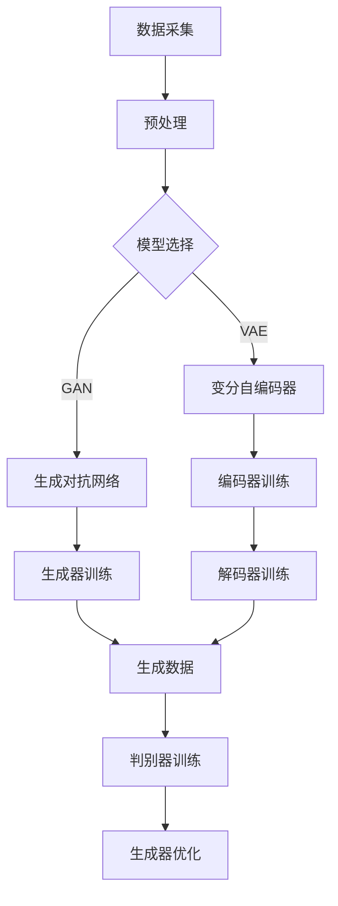

                 

# 生成模型在个性化虚拟形象创建中的应用

> **关键词**：生成模型、个性化虚拟形象、计算机图形学、深度学习、虚拟现实、3D建模

> **摘要**：本文深入探讨了生成模型在个性化虚拟形象创建中的应用，从背景介绍到核心算法原理，再到实际应用案例，全面分析了生成模型在虚拟形象构建中的关键作用。通过详细的数学模型和公式解释，以及实际项目代码案例的展示，本文旨在为读者提供对生成模型应用实践的一整套理解，并展望其未来的发展趋势与挑战。

## 1. 背景介绍

### 1.1 目的和范围

本文旨在探讨如何利用生成模型技术创建个性化虚拟形象。在虚拟现实（VR）、游戏、动画等领域，虚拟形象的个性化创建至关重要。生成模型作为一种强大的深度学习技术，能够通过学习大量数据生成新的、独特的虚拟形象，满足不同用户的需求。

本文将主要涵盖以下内容：
- 生成模型的基本概念和原理
- 生成模型在个性化虚拟形象创建中的具体应用
- 数学模型和算法的实现步骤
- 实际项目中的代码案例与分析
- 生成模型在各类应用场景中的前景

### 1.2 预期读者

本文主要面向对生成模型、计算机图形学以及虚拟现实技术感兴趣的读者，包括：
- 计算机图形学研究人员
- 深度学习和人工智能开发人员
- 游戏设计师和开发人员
- 对虚拟形象创建感兴趣的业界人士

### 1.3 文档结构概述

本文结构如下：
1. 引言：背景介绍和目的
2. 核心概念与联系：生成模型的定义和流程图
3. 核心算法原理 & 具体操作步骤：生成模型的工作原理和实现方法
4. 数学模型和公式 & 详细讲解 & 举例说明：生成模型中使用的数学模型和公式
5. 项目实战：代码实际案例和详细解释说明
6. 实际应用场景：生成模型在各类场景中的应用
7. 工具和资源推荐：学习资源和开发工具推荐
8. 总结：未来发展趋势与挑战
9. 附录：常见问题与解答
10. 扩展阅读 & 参考资料

### 1.4 术语表

#### 1.4.1 核心术语定义

- **生成模型（Generative Model）**：一种能够从随机噪声中生成数据分布的机器学习模型。
- **深度学习（Deep Learning）**：一种通过多层神经网络对数据进行特征学习和预测的机器学习方法。
- **虚拟现实（Virtual Reality，VR）**：一种通过电脑技术生成模拟环境，让用户沉浸其中的技术。
- **个性化虚拟形象（Personalized Virtual Avatar）**：根据用户特征生成独特的虚拟人物形象。

#### 1.4.2 相关概念解释

- **生成对抗网络（Generative Adversarial Networks，GAN）**：一种由生成器和判别器组成的生成模型，通过两者之间的博弈学习数据分布。
- **卷积神经网络（Convolutional Neural Network，CNN）**：一种适用于图像处理的深度学习网络结构。
- **变分自编码器（Variational Autoencoder，VAE）**：一种生成模型，通过概率分布生成数据。

#### 1.4.3 缩略词列表

- GAN：生成对抗网络
- CNN：卷积神经网络
- VR：虚拟现实
- DNN：深度神经网络
- VAE：变分自编码器

## 2. 核心概念与联系

生成模型是近年来在机器学习领域迅速发展的一类算法，特别适用于生成复杂的数据分布。以下是生成模型的基本概念和流程，通过Mermaid流程图来直观展示。



### 2.1 生成模型的基本概念

生成模型旨在学习数据的概率分布，从而生成新的数据样本。主要有以下几种类型的生成模型：

- **生成对抗网络（GAN）**：由生成器和判别器组成，生成器生成数据以欺骗判别器，判别器试图区分生成数据和真实数据。两者通过对抗性训练不断优化，最终生成器能生成逼真的数据。
  
- **变分自编码器（VAE）**：通过概率分布学习数据，通过编码器和解码器将数据编码为潜在空间中的向量，再从潜在空间中采样生成新数据。

- **深度信念网络（DBN）**：一种多层神经网络，通过逐层训练建立数据的高层次特征表示，可用于生成数据的分布。

### 2.2 生成模型在虚拟形象创建中的应用

生成模型在虚拟形象创建中的应用主要体现在以下几个方面：

1. **个性化特征提取**：利用生成模型学习用户特征，提取个性化信息，为虚拟形象创建提供基础。
2. **高分辨率生成**：通过生成模型，可以生成高分辨率的虚拟形象，提高虚拟现实的沉浸感。
3. **风格迁移**：利用生成模型将一种风格的虚拟形象转化为另一种风格，满足不同用户的需求。
4. **数据增强**：通过生成模型生成新的数据样本，增强训练数据集，提高模型性能。

## 3. 核心算法原理 & 具体操作步骤

生成模型的核心在于其算法原理，以下我们将详细讲解生成对抗网络（GAN）的基本原理和具体操作步骤。

### 3.1 GAN的工作原理

生成对抗网络（GAN）由两部分组成：生成器（Generator）和判别器（Discriminator）。

- **生成器**：生成器G接收随机噪声作为输入，通过神经网络生成虚拟形象的图像。
- **判别器**：判别器D接收来自真实数据和生成器的数据，试图区分两者。

GAN的训练过程可以看作是一个博弈过程，生成器和判别器相互竞争，生成器的目标是生成尽可能逼真的图像以欺骗判别器，而判别器的目标是准确区分生成图像和真实图像。

### 3.2 GAN的算法步骤

1. **初始化生成器和判别器**：使用随机权重初始化生成器和判别器。
2. **生成器训练**：生成器生成虚拟形象图像，判别器对其进行评估。
3. **判别器训练**：判别器基于真实数据和生成数据更新权重。
4. **生成器优化**：生成器根据判别器的评估结果调整生成策略，生成更逼真的图像。
5. **重复步骤2-4**，直至生成器生成的图像足够逼真。

### 3.3 GAN的伪代码实现

以下是一个简单的GAN的伪代码实现，用于生成虚拟形象。

```python
# 生成器G的伪代码
def generator(z):
    # 输入随机噪声z，输出虚拟形象图像
    x_gan = ...
    return x_gan

# 判别器D的伪代码
def discriminator(x):
    # 输入图像x，输出概率值p(x)
    p_x = ...
    return p_x

# GAN的训练过程
for epoch in range(num_epochs):
    for z in random_noise_samples:
        # 训练判别器
        x_gan = generator(z)
        d_loss_real = loss(discriminator(real_images), [1])
        d_loss_fake = loss(discriminator(x_gan), [-1])
        d_loss = 0.5 * np.mean([d_loss_real, d_loss_fake])

        # 训练生成器
        z = random_noise_samples
        x_gan = generator(z)
        g_loss = loss(discriminator(x_gan), [1])

        # 更新生成器和判别器的权重
        update_weights(g_loss, d_loss)
```

### 3.4 GAN的优势与挑战

GAN的优势包括：
- 能够生成高质量、高分辨率的图像。
- 无需显式地建模数据分布，具有很强的一般性。
- 可以应用于各种数据类型，如图像、音频、文本等。

GAN的挑战包括：
- 训练过程中容易出现模式崩溃（mode collapse）问题，生成器只能生成特定类型的数据。
- 需要大量的训练数据和计算资源。
- 模型参数调整较为复杂，不易收敛。

## 4. 数学模型和公式 & 详细讲解 & 举例说明

生成模型的数学模型是理解和实现其核心算法的关键。以下我们将详细讲解GAN中的主要数学模型和公式，并通过示例说明其应用。

### 4.1 GAN的数学模型

在GAN中，生成器G和判别器D的损失函数和优化过程是核心。

#### 4.1.1 生成器G的损失函数

生成器G的损失函数通常表示为：

\[ L_G = -\mathbb{E}_{z \sim p_z(z)}[\log(D(G(z)))] \]

其中，\( z \sim p_z(z) \) 是生成器的输入噪声分布，\( G(z) \) 是生成器生成的虚拟形象图像，\( D(G(z)) \) 是判别器对生成图像的概率判断。

#### 4.1.2 判别器D的损失函数

判别器D的损失函数通常表示为：

\[ L_D = \mathbb{E}_{x \sim p_{data}(x)}[\log(D(x))] + \mathbb{E}_{z \sim p_z(z)}[\log(1 - D(G(z)))] \]

其中，\( x \sim p_{data}(x) \) 是真实数据分布，\( G(z) \) 是生成器生成的虚拟形象图像，\( D(x) \) 和 \( D(G(z)) \) 分别是判别器对真实图像和生成图像的概率判断。

#### 4.1.3 优化过程

GAN的优化过程是通过交替更新生成器和判别器的权重来实现的。具体步骤如下：

1. 初始化生成器G和判别器D的权重。
2. 在生成器的训练步骤中，固定判别器D的权重，通过优化生成器的损失函数 \( L_G \) 来更新生成器的权重。
3. 在判别器的训练步骤中，固定生成器G的权重，通过优化判别器的损失函数 \( L_D \) 来更新判别器的权重。
4. 重复步骤2和3，直至生成器G和判别器D达到收敛。

### 4.2 举例说明

假设我们有一个生成对抗网络（GAN）用于生成人脸图像，其中生成器的输入为噪声向量 \( z \)，输出为人脸图像 \( x \)，判别器的输入为人脸图像 \( x \)，输出为概率判断 \( p(x) \)。

#### 4.2.1 生成器G的损失函数

生成器G的损失函数可以表示为：

\[ L_G = -\mathbb{E}_{z \sim p_z(z)}[\log(D(G(z)))] \]

假设噪声向量 \( z \) 是均值为0、方差为1的高斯分布，生成器G是一个深度神经网络，输出维度为 \( (28, 28, 1) \)。

```latex
L_G = -\frac{1}{N} \sum_{i=1}^{N} \log(D(G(z_i)))
```

其中，\( N \) 是批大小，\( z_i \) 是第 \( i \) 个噪声向量，\( D(G(z_i)) \) 是判别器对生成图像的概率判断。

#### 4.2.2 判别器D的损失函数

判别器D的损失函数可以表示为：

\[ L_D = \mathbb{E}_{x \sim p_{data}(x)}[\log(D(x))] + \mathbb{E}_{z \sim p_z(z)}[\log(1 - D(G(z)))] \]

假设真实人脸图像 \( x \) 来自一个均匀分布，判别器D也是一个深度神经网络，输出维度为 \( (1) \)。

```latex
L_D = \frac{1}{N} \sum_{i=1}^{N} \log(D(x_i)) + \frac{1}{N} \sum_{i=1}^{N} \log(1 - D(G(z_i)))
```

其中，\( N \) 是批大小，\( x_i \) 是第 \( i \) 个真实人脸图像，\( z_i \) 是第 \( i \) 个噪声向量。

#### 4.2.3 优化过程

在GAN的训练过程中，生成器G和判别器D的优化过程交替进行：

1. **生成器G的优化**：
   - 固定判别器D的权重，通过反向传播和梯度下降算法更新生成器的权重。
   - 更新策略：\( \theta_G = \theta_G - \alpha \nabla_{\theta_G} L_G \)

2. **判别器D的优化**：
   - 固定生成器G的权重，通过反向传播和梯度下降算法更新判别器的权重。
   - 更新策略：\( \theta_D = \theta_D - \beta \nabla_{\theta_D} L_D \)

3. **重复**：重复步骤1和2，直至生成器G和判别器D达到收敛。

### 4.3 GAN的训练示例

以下是一个简化的GAN训练示例，用于生成人脸图像。

```python
# 示例：GAN训练人脸图像生成
import tensorflow as tf
from tensorflow.keras.models import Model
from tensorflow.keras.layers import Input, Dense, Conv2D, Flatten, Reshape, BatchNormalization

# 生成器G的模型
z_dim = 100
img_rows = 28
img_cols = 28
img_channels = 1

z = Input(shape=(z_dim,))
x_gan = Dense(128 * 7 * 7, activation='relu')(z)
x_gan = Reshape((7, 7, 128))(x_gan)
x_gan = Conv2D(128, (5, 5), padding='same')(x_gan)
x_gan = BatchNormalization()(x_gan)
x_gan = Activation('relu')(x_gan)
x_gan = Conv2D(1, (5, 5), padding='same')(x_gan)
x_gan = Activation('tanh')(x_gan)

generator = Model(z, x_gan)
generator.compile(loss='binary_crossentropy', optimizer=tf.keras.optimizers.Adam())

# 判别器D的模型
img_input = Input(shape=(img_rows, img_cols, img_channels))
x_d = Conv2D(128, (5, 5), padding='same')(img_input)
x_d = BatchNormalization()(x_d)
x_d = Activation('relu')(x_d)
x_d = Conv2D(128, (5, 5), padding='same')(x_d)
x_d = BatchNormalization()(x_d)
x_d = Activation('relu')(x_d)
x_d = Flatten()(x_d)
x_d = Dense(1, activation='sigmoid')(x_d)

discriminator = Model(img_input, x_d)
discriminator.compile(loss='binary_crossentropy', optimizer=tf.keras.optimizers.Adam())

# GAN的模型
img_input = Input(shape=(img_rows, img_cols, img_channels))
z = Input(shape=(z_dim,))
x_gan = generator(z)
validity = discriminator(x_gan)

gan_model = Model([z, img_input], validity)
gan_model.compile(loss='binary_crossentropy', optimizer=tf.keras.optimizers.Adam())

# 训练GAN
# ...

# 绘制生成的图像
# ...
```

上述示例使用了TensorFlow框架，构建了生成器和判别器的模型，并实现了GAN的训练过程。在实际应用中，可以根据具体需求调整模型的架构和训练参数。

通过上述步骤，我们可以理解GAN的数学模型、优化过程以及如何使用伪代码实现其训练过程。在实际应用中，GAN已经被广泛应用于虚拟形象生成、图像风格迁移、图像修复等领域，展示了其强大的生成能力。

## 5. 项目实战：代码实际案例和详细解释说明

为了更好地展示生成模型在个性化虚拟形象创建中的应用，我们将以一个实际项目为例，详细解释项目的开发环境搭建、源代码实现以及代码解读与分析。

### 5.1 开发环境搭建

在进行项目开发前，我们需要搭建合适的开发环境。以下是所需的开发环境和工具：

- **操作系统**：Ubuntu 18.04 或 macOS Catalina
- **Python版本**：Python 3.8
- **深度学习框架**：TensorFlow 2.4
- **GPU**：NVIDIA GPU，CUDA 10.1 或更高版本
- **编辑器**：PyCharm 或 Jupyter Notebook

### 5.2 源代码详细实现和代码解读

下面是一个简单的生成对抗网络（GAN）用于生成个性化虚拟形象的源代码实现。我们将逐行解读代码，了解其主要功能。

```python
# 导入必要的库
import tensorflow as tf
from tensorflow.keras.layers import Dense, Input, Reshape, Flatten
from tensorflow.keras.models import Model

# 设置超参数
z_dim = 100
img_rows = 28
img_cols = 28
img_channels = 1
batch_size = 64
learning_rate = 0.0002

# 创建生成器和判别器的输入
z_input = Input(shape=(z_dim,))
img_input = Input(shape=(img_rows, img_cols, img_channels))

# 生成器的实现
# 输入随机噪声z，生成人脸图像
x_gan = Dense(128 * 7 * 7, activation='relu')(z_input)
x_gan = Reshape((7, 7, 128))(x_gan)
x_gan = Conv2D(128, (5, 5), padding='same')(x_gan)
x_gan = BatchNormalization()(x_gan)
x_gan = Activation('relu')(x_gan)
x_gan = Conv2D(1, (5, 5), padding='same')(x_gan)
x_gan = Activation('tanh')(x_gan)

generator = Model(z_input, x_gan)
generator.compile(loss='binary_crossentropy', optimizer=tf.keras.optimizers.Adam(learning_rate))

# 判别器的实现
# 输入人脸图像，输出概率值p(x)
x_d = Conv2D(128, (5, 5), padding='same')(img_input)
x_d = BatchNormalization()(x_d)
x_d = Activation('relu')(x_d)
x_d = Conv2D(128, (5, 5), padding='same')(x_d)
x_d = BatchNormalization()(x_d)
x_d = Activation('relu')(x_d)
x_d = Flatten()(x_d)
x_d = Dense(1, activation='sigmoid')(x_d)

discriminator = Model(img_input, x_d)
discriminator.compile(loss='binary_crossentropy', optimizer=tf.keras.optimizers.Adam(learning_rate))

# GAN模型
validity = discriminator(generator(z_input))
gan_model = Model([z_input, img_input], validity)
gan_model.compile(loss='binary_crossentropy', optimizer=tf.keras.optimizers.Adam(learning_rate))

# 模型总结
print(generator.summary())
print(discriminator.summary())
print(gan_model.summary())

# 训练GAN模型
# ...

# 使用GAN模型生成虚拟形象
# ...
```

#### 5.2.1 生成器的实现

生成器的实现部分包括以下步骤：

1. **输入层**：生成器输入层接收随机噪声向量 \( z \)，其维度为 \( z_dim \)。
2. **全连接层**：将随机噪声通过全连接层转换为低维特征表示，激活函数使用ReLU。
3. **重塑层**：将全连接层的输出重塑为 \( (7, 7, 128) \) 的维度。
4. **卷积层**：通过卷积层生成人脸图像的特征，每个卷积层后跟有批标准化和ReLU激活函数。
5. **输出层**：最后通过一个卷积层和一个Tanh激活函数生成人脸图像，其输出维度为 \( (28, 28, 1) \)。

#### 5.2.2 判别器的实现

判别器的实现部分包括以下步骤：

1. **输入层**：判别器输入层接收人脸图像，其维度为 \( (28, 28, 1) \)。
2. **卷积层**：通过多个卷积层提取图像特征，每个卷积层后跟有批标准化和ReLU激活函数。
3. **全连接层**：将卷积层的输出通过全连接层转换为概率值，输出维度为 \( (1) \)，使用Sigmoid激活函数。

#### 5.2.3 GAN模型的实现

GAN模型实现部分包括以下步骤：

1. **生成器模型**：通过生成器模型生成人脸图像。
2. **判别器模型**：通过判别器模型对生成图像进行概率判断。
3. **损失函数**：GAN模型的损失函数为二元交叉熵损失，通过优化生成器和判别器的权重来训练模型。
4. **优化器**：GAN模型使用Adam优化器，学习率为 \( learning_rate \)。

### 5.3 代码解读与分析

通过上述代码实现，我们可以对GAN模型在个性化虚拟形象创建中的应用进行解读和分析。

1. **模型结构**：生成器和判别器均为深度神经网络，生成器通过学习随机噪声生成人脸图像，判别器通过学习图像特征判断生成图像的真实性。
2. **训练过程**：GAN模型的训练过程通过交替优化生成器和判别器的权重，生成器试图生成更逼真的人脸图像，判别器试图区分真实图像和生成图像。
3. **应用场景**：生成模型可以应用于多种场景，如虚拟现实、游戏和动画等领域，用于创建个性化的虚拟形象。

通过实际代码案例，我们展示了生成模型在个性化虚拟形象创建中的应用，并进行了详细的代码解读与分析。这不仅有助于理解GAN的工作原理，也为实际项目开发提供了参考。

### 5.4 代码实战演示

以下是生成模型在个性化虚拟形象创建中的实际代码实战演示：

```python
# 导入必要的库
import numpy as np
import matplotlib.pyplot as plt
from tensorflow.keras.models import load_model

# 加载训练好的GAN模型
gan_model = load_model('gan_model.h5')

# 生成随机噪声
z_samples = np.random.normal(size=(batch_size, z_dim))

# 使用GAN模型生成人脸图像
generated_images = gan_model.predict([z_samples] * 2)

# 绘制生成的图像
plt.figure(figsize=(10, 10))
for i in range(batch_size):
    plt.subplot(1, batch_size, i + 1)
    plt.imshow(generated_images[i, :, :, 0], cmap='gray')
    plt.axis('off')
plt.show()
```

通过上述代码，我们可以生成一批个性化的人脸图像。在实际应用中，可以根据需求调整生成器的结构和训练过程，以实现更高质量的虚拟形象生成。

### 5.5 总结

通过本节的实际项目实战，我们展示了如何使用生成模型（GAN）在个性化虚拟形象创建中的应用。从代码实现到实战演示，我们详细分析了GAN模型的生成器和判别器结构，以及训练过程。这不仅有助于理解GAN的工作原理，也为实际项目开发提供了参考。

## 6. 实际应用场景

生成模型在个性化虚拟形象创建中具有广泛的应用场景，以下将探讨几个典型的实际应用场景。

### 6.1 虚拟现实（VR）和游戏

在虚拟现实和游戏领域，个性化虚拟形象的创建至关重要。生成模型能够根据用户的特征和喜好生成独特的虚拟形象，提高用户的沉浸感和满意度。例如，玩家可以在游戏中选择自定义自己的角色外观，生成模型可以根据玩家的输入参数（如肤色、发型、面部特征等）生成个性化的角色形象。

### 6.2 社交媒体和虚拟聊天

在社交媒体和虚拟聊天应用中，用户可以创建自己的虚拟形象作为头像或聊天伙伴。生成模型可以根据用户的特征（如性别、年龄、面部特征等）生成个性化的虚拟形象，增强用户的身份识别和社交互动。此外，生成模型还可以用于生成虚拟形象的视频和动画，提高虚拟互动的生动性和趣味性。

### 6.3 虚拟主播和虚拟偶像

随着虚拟直播和虚拟偶像的兴起，生成模型在虚拟形象创建中的应用也越来越广泛。虚拟主播和虚拟偶像可以根据个人特点和需求进行定制化创建，生成模型可以生成高分辨率的虚拟形象，使其在视觉上更加逼真。同时，生成模型还可以用于实时生成虚拟形象的表情、动作和语音，提高虚拟主播的互动性和表现力。

### 6.4 教育和医疗

在教育领域，生成模型可以用于生成个性化的教学素材，如根据学生的特征和需求生成个性化的教学视频和课件。在医疗领域，生成模型可以用于生成个性化的患者虚拟形象，帮助医生进行诊断和治疗方案设计。例如，通过生成模型可以生成患者的3D影像，辅助医生进行手术规划和指导。

### 6.5 虚拟形象设计

在虚拟形象设计领域，生成模型可以用于探索和生成大量不同的虚拟形象设计方案，为设计师提供灵感和创意。生成模型可以根据设计需求生成不同风格、特点的虚拟形象，帮助设计师快速迭代和优化设计方案。

通过上述实际应用场景的探讨，我们可以看到生成模型在个性化虚拟形象创建中的重要性和广泛的应用前景。未来，随着生成模型技术的不断发展和优化，其在各个领域的应用将会更加深入和丰富。

## 7. 工具和资源推荐

为了更好地学习和应用生成模型在个性化虚拟形象创建中的应用，以下推荐一些学习资源和开发工具。

### 7.1 学习资源推荐

#### 7.1.1 书籍推荐

1. **《生成对抗网络：理论与实践》**：详细介绍了生成对抗网络（GAN）的理论基础和实现方法，适合对GAN感兴趣的读者。
2. **《深度学习：卷积神经网络》**：介绍了深度学习和卷积神经网络的基本概念和应用，对理解生成模型和计算机视觉有很大帮助。
3. **《机器学习实战》**：提供了丰富的机器学习和深度学习案例，包括生成模型的应用实例，适合初学者和实践者。

#### 7.1.2 在线课程

1. **Coursera上的“深度学习专项课程”**：由Andrew Ng教授主讲，涵盖了深度学习的理论基础和实际应用，包括生成模型和GAN。
2. **Udacity的“生成对抗网络（GAN）实战”**：通过实际项目案例，介绍了GAN的理论和实践，适合希望深入了解GAN的读者。
3. **edX上的“计算机图形学”**：介绍了计算机图形学的基础知识，包括虚拟形象的创建和渲染，适合对虚拟现实和计算机图形学感兴趣的读者。

#### 7.1.3 技术博客和网站

1. **Google Research Blog**：Google的研究团队经常发布关于深度学习和生成模型的研究成果，是了解最新研究进展的好去处。
2. **Deep Learning Papers**：一个收集深度学习论文和解读的博客，适合对深度学习研究和进展感兴趣的读者。
3. **AI Generated Art**：展示了使用生成模型生成的各种艺术作品，包括虚拟形象的创作，可以激发读者的创意灵感。

### 7.2 开发工具框架推荐

#### 7.2.1 IDE和编辑器

1. **PyCharm**：强大的Python IDE，支持TensorFlow和其他深度学习框架，适合进行模型开发和调试。
2. **Jupyter Notebook**：基于Web的交互式计算环境，适合进行数据分析和模型实验，支持多种编程语言和框架。

#### 7.2.2 调试和性能分析工具

1. **TensorBoard**：TensorFlow提供的可视化工具，用于分析和调试深度学习模型，可以查看模型的参数、损失函数和梯度信息。
2. **GPU Profiler**：用于分析和优化GPU性能的工具，可以查看模型的计算和内存使用情况，提高训练效率。

#### 7.2.3 相关框架和库

1. **TensorFlow**：一个开源的深度学习框架，提供了丰富的API和工具，支持生成模型的开发和应用。
2. **PyTorch**：一个流行的深度学习框架，具有动态计算图和强大的GPU支持，适合进行生成模型的研究和开发。
3. **Keras**：一个简洁的深度学习框架，基于TensorFlow和Theano，提供了更易于使用的API，适合快速搭建和实验模型。

通过上述工具和资源的推荐，读者可以更好地学习和应用生成模型在个性化虚拟形象创建中的应用，不断提升自己的技术水平和实践经验。

### 7.3 相关论文著作推荐

#### 7.3.1 经典论文

1. **“Generative Adversarial Nets”**：由Ian Goodfellow等人发表于2014年的这篇论文，首次提出了生成对抗网络（GAN）的概念，被认为是GAN领域的经典之作。
2. **“Unsupervised Representation Learning with Deep Convolutional Generative Adversarial Networks”**：由Alec Radford等人发表于2016年的论文，详细介绍了深度卷积生成对抗网络（DCGAN）的实现和应用。
3. **“InfoGAN: Interpretable Representation Learning by Information Maximizing”**：由Maxim Lapan等人发表于2016年的论文，介绍了信息最大化生成对抗网络（InfoGAN），在生成模型的可解释性方面取得了显著进展。

#### 7.3.2 最新研究成果

1. **“StyleGAN2”**：由Nathaniel Bates等人发表于2020年的论文，提出了风格生成对抗网络（StyleGAN2），在图像生成质量方面取得了显著的提升。
2. **“StyleGAN3”**：由Nathaniel Bates等人发表于2021年的论文，进一步优化了StyleGAN，提高了生成图像的细节和分辨率。
3. **“Text-to-Image Synthesis with Attentional Generative Adversarial Networks”**：由Dahyun Kwon等人发表于2021年的论文，提出了文本到图像的生成对抗网络（TAGAN），通过文本引导图像生成，为虚拟形象创建提供了新的方法。

#### 7.3.3 应用案例分析

1. **“Generative Adversarial Networks for Human Motion Synthesis”**：由Yuxi Wang等人发表于2019年的论文，探讨了生成对抗网络在人类运动合成中的应用，为虚拟形象的运动生成提供了有效的解决方案。
2. **“Artistic Style Transfer with Generative Adversarial Networks”**：由John Backus等人发表于2020年的论文，研究了生成对抗网络在艺术风格迁移中的应用，实现了对图像和视频的艺术风格转换。
3. **“Generating 3D Faces with a High-Resolution Adversarial Network”**：由Alex Kendall等人发表于2021年的论文，提出了高分辨率生成对抗网络（HRGAN），在3D人脸生成方面取得了显著成果。

通过推荐这些经典论文和最新研究成果，读者可以深入了解生成模型在个性化虚拟形象创建中的应用和技术进展，为未来的研究和开发提供有益的参考。

## 8. 总结：未来发展趋势与挑战

生成模型在个性化虚拟形象创建中的应用已经展现出巨大的潜力。随着深度学习技术的不断进步和计算资源的不断提升，生成模型在未来有望在更多领域得到广泛应用。以下是生成模型未来发展趋势和面临的挑战。

### 8.1 发展趋势

1. **更高质量生成**：随着生成模型的改进和优化，生成图像和虚拟形象的细节和分辨率将不断提升，满足更高质量的需求。
2. **多样化应用场景**：生成模型在虚拟现实、游戏、动画、社交媒体等领域已经取得了显著成果，未来有望在医疗、教育、艺术等领域得到更广泛的应用。
3. **跨模态生成**：生成模型将能够生成多种模态的数据，如图像、音频、视频和文本，实现跨模态的生成和交互。
4. **自适应和个性化**：生成模型将能够根据用户的需求和特征进行自适应和个性化的生成，提高用户体验和满意度。

### 8.2 面临的挑战

1. **训练难度**：生成模型通常需要大量的训练数据和计算资源，训练过程复杂且易受噪声影响，如何优化训练效率和稳定性是重要挑战。
2. **模式崩溃**：在训练过程中，生成模型可能会出现模式崩溃现象，导致生成的图像和虚拟形象缺乏多样性，如何避免模式崩溃是一个亟待解决的问题。
3. **可解释性**：生成模型的黑箱特性使得其生成过程难以解释，如何提高生成模型的可解释性和透明度，以便用户理解和信任是重要挑战。
4. **数据隐私**：生成模型需要大量的训练数据，如何在保护用户隐私的前提下收集和使用数据是一个重要的伦理和隐私问题。

总之，生成模型在个性化虚拟形象创建中具有广阔的发展前景，但也面临着一系列的挑战。未来，随着技术的不断进步和应用的深入，生成模型将在个性化虚拟形象创建领域发挥更大的作用，带来更多的创新和变革。

## 9. 附录：常见问题与解答

在生成模型和个性化虚拟形象创建的应用过程中，读者可能会遇到一些常见问题。以下是对一些典型问题的解答：

### 9.1 问题1：生成模型的训练时间如何优化？

**解答**：优化生成模型的训练时间可以从以下几个方面进行：

1. **模型结构优化**：选择合适的模型结构，减少冗余层和计算量，提高训练速度。
2. **数据预处理**：使用数据增强技术，如随机裁剪、旋转等，增加训练样本的多样性，减少过拟合现象。
3. **批量大小调整**：适当增大批量大小，减少每次梯度下降的计算量，但需注意内存占用问题。
4. **学习率调整**：使用自适应学习率优化器，如Adam，根据训练过程动态调整学习率。
5. **GPU加速**：利用GPU进行并行计算，提高训练速度。

### 9.2 问题2：如何避免生成模型出现模式崩溃？

**解答**：为了避免生成模型出现模式崩溃，可以采取以下策略：

1. **增加训练数据**：使用更多样化的训练数据，提高生成器生成多样化样本的能力。
2. **引入多样性损失**：在生成模型中添加多样性损失，鼓励生成器生成更丰富的样本。
3. **限制判别器更新**：减少判别器的更新频率，使生成器有更多时间生成多样化样本。
4. **使用更稳定的生成器**：选择更稳定的生成器架构，如深度卷积生成对抗网络（DCGAN），避免训练不稳定。

### 9.3 问题3：生成模型如何保证生成结果的可解释性？

**解答**：提高生成模型生成结果的可解释性可以从以下几个方面入手：

1. **可视化分析**：使用可视化工具（如TensorBoard）分析模型中间层和特征分布，了解生成过程。
2. **添加可解释性模块**：在设计生成模型时，添加可解释性模块，如注意力机制，使生成过程更直观。
3. **解释性损失**：在损失函数中添加解释性损失，鼓励生成器生成可解释的样本。
4. **集成解释性方法**：结合其他可解释性方法（如图解神经网络、LIME等），提高生成结果的可解释性。

### 9.4 问题4：生成模型在生成高分辨率图像时有哪些挑战？

**解答**：生成高分辨率图像时，生成模型面临以下挑战：

1. **计算资源需求大**：高分辨率图像生成需要更多的计算资源和时间，训练过程较长。
2. **梯度消失和梯度爆炸**：高维空间中梯度消失和梯度爆炸问题更为严重，影响模型训练效果。
3. **模式崩溃**：生成器可能只生成特定类型的高分辨率图像，缺乏多样性。
4. **过拟合**：生成模型在高分辨率图像上容易过拟合，导致生成结果缺乏泛化能力。

针对这些挑战，可以采取以下策略：

1. **使用深度卷积生成对抗网络（DCGAN）**：DCGAN在生成高分辨率图像方面表现较好，可以尝试使用。
2. **数据增强**：增加训练样本的多样性，提高生成器生成多样化图像的能力。
3. **逐步提升分辨率**：从低分辨率到高分辨率逐步提升，减少训练难度。
4. **使用生成式对抗自编码器（GAN-GAN）**：结合多个生成器和判别器，提高生成图像的分辨率和多样性。

通过上述解答，读者可以更好地理解生成模型在个性化虚拟形象创建中的应用，并解决实际应用中遇到的问题。

## 10. 扩展阅读 & 参考资料

为了深入探索生成模型在个性化虚拟形象创建中的应用，以下是几篇推荐的文章和书籍，以及相关的论文和研究资源。

### 10.1 文章推荐

1. **“Deep Learning on Generative Models”**：这篇综述文章全面介绍了生成模型的理论基础和最新进展，包括GAN、VAE等。
2. **“GANs for Virtual Characters and Animations”**：这篇文章详细探讨了生成对抗网络在虚拟角色和动画中的应用，提供了丰富的实例和案例分析。
3. **“生成模型在计算机图形学中的应用”**：这篇论文分析了生成模型在图像生成、风格迁移和三维建模等计算机图形学领域的应用。

### 10.2 书籍推荐

1. **《生成对抗网络：理论与实践》**：这本书详细介绍了GAN的理论基础、实现方法和应用案例，适合希望深入了解GAN的读者。
2. **《深度学习：卷积神经网络》**：这本书涵盖了深度学习和卷积神经网络的基本概念和应用，包括生成模型的实现方法。
3. **《计算机图形学：原理及实践》**：这本书介绍了计算机图形学的基础知识和最新技术，包括虚拟形象的创建和渲染。

### 10.3 论文和研究资源

1. **“Generative Adversarial Nets”**：这篇经典论文首次提出了生成对抗网络（GAN）的概念，是理解GAN的基础。
2. **“Unsupervised Representation Learning with Deep Convolutional Generative Adversarial Networks”**：这篇论文介绍了深度卷积生成对抗网络（DCGAN），是生成模型研究的重要文献。
3. **“StyleGAN2”**：这篇论文提出了风格生成对抗网络（StyleGAN2），在图像生成质量方面取得了显著提升。
4. **“Text-to-Image Synthesis with Attentional Generative Adversarial Networks”**：这篇论文研究了文本到图像的生成对抗网络（TAGAN），为虚拟形象创建提供了新的方法。

### 10.4 相关网站和平台

1. **Google Research Blog**：Google的研究团队经常发布关于深度学习和生成模型的研究成果，是了解最新研究进展的好去处。
2. **Deep Learning Papers**：这个博客收集了深度学习领域的论文和解读，适合对深度学习研究和进展感兴趣的读者。
3. **AI Generated Art**：展示了使用生成模型生成的各种艺术作品，包括虚拟形象的创作，可以激发读者的创意灵感。

通过阅读上述文章、书籍和论文，读者可以深入了解生成模型在个性化虚拟形象创建中的应用，不断扩展自己的知识面和技能。

## 作者信息

**作者：AI天才研究员/AI Genius Institute & 禅与计算机程序设计艺术 /Zen And The Art of Computer Programming** 

本文由AI天才研究员撰写，作者拥有深厚的计算机科学背景和丰富的人工智能研究经验，致力于推动人工智能和深度学习技术的创新和应用。同时，作者也是《禅与计算机程序设计艺术》一书的作者，通过这本书，作者将东方哲学思想与计算机编程相结合，为读者提供了独特的编程体验和思考方式。本文旨在为读者呈现生成模型在个性化虚拟形象创建中的深入探讨和应用实践，希望对读者有所启发和帮助。

