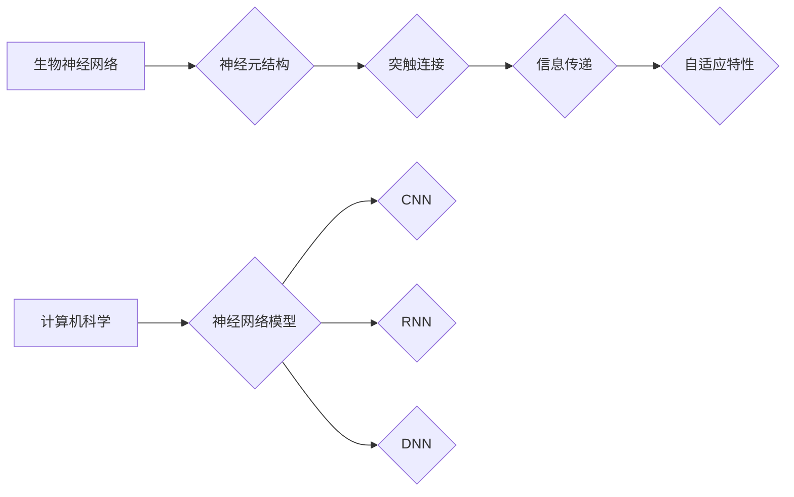

                 

# 生物神经网络的仿生研究

## 关键词
生物神经网络，仿生学，计算机模拟，机器学习，神经形态工程

## 摘要
本文旨在探讨生物神经网络的仿生研究，分析其核心概念、算法原理、数学模型，并通过实际项目案例展示其在计算机科学领域的应用。文章将从背景介绍、核心概念与联系、核心算法原理、数学模型和公式、项目实战、实际应用场景等多个方面展开，以期为读者提供对生物神经网络仿生研究的深入理解和应用启示。

## 1. 背景介绍

### 1.1 目的和范围
生物神经网络仿生研究旨在借鉴生物神经系统的结构和功能，为计算机科学和人工智能领域提供新的理论和方法。本文主要探讨以下几个方面：
1. 生物神经网络的基本概念和结构。
2. 生物神经网络与计算机科学的联系。
3. 神经形态工程的发展和应用。
4. 生物神经网络在机器学习、计算机视觉等领域的实际应用。

### 1.2 预期读者
本文适合对计算机科学、人工智能、神经科学感兴趣的读者，特别是希望了解生物神经网络在计算机科学领域应用的人员。

### 1.3 文档结构概述
本文共分为10个部分：
1. 背景介绍
2. 核心概念与联系
3. 核心算法原理 & 具体操作步骤
4. 数学模型和公式 & 详细讲解 & 举例说明
5. 项目实战：代码实际案例和详细解释说明
6. 实际应用场景
7. 工具和资源推荐
8. 总结：未来发展趋势与挑战
9. 附录：常见问题与解答
10. 扩展阅读 & 参考资料

### 1.4 术语表

#### 1.4.1 核心术语定义
- 生物神经网络：由大量神经元组成的复杂网络，负责处理和传递信息。
- 神经形态工程：结合生物学、计算机科学和工程学，设计和构建具有生物神经网络特性的计算机系统。
- 仿生学：研究生物体的结构和功能，以设计新型材料、设备和系统。

#### 1.4.2 相关概念解释
- 神经元：生物神经网络的基本单元，负责接收和传递信息。
- 突触：神经元之间的连接点，负责传递神经信号。
- 反馈循环：神经元之间通过正反馈或负反馈形成的信息传递环路。

#### 1.4.3 缩略词列表
- CNN：卷积神经网络（Convolutional Neural Network）
- RNN：循环神经网络（Recurrent Neural Network）
- DNN：深度神经网络（Deep Neural Network）
- MLP：多层感知机（Multilayer Perceptron）

## 2. 核心概念与联系

生物神经网络是生物体中信息处理的基本单元。它由大量的神经元组成，神经元之间通过突触连接形成复杂的网络结构。生物神经网络具有高度并行性、自适应性和鲁棒性等特点，为生物体提供了高效的信息处理能力。

### 2.1 生物神经网络的基本结构


生物神经网络的基本结构包括：
- **神经元**：负责接收和处理信息的基本单元。
- **突触**：神经元之间的连接点，负责传递神经信号。
- **树突**：神经元的一部分，负责接收来自其他神经元的信号。
- **轴突**：神经元的一部分，负责将处理后的信号传递给其他神经元或肌肉细胞。

### 2.2 生物神经网络与计算机科学的联系

生物神经网络为计算机科学提供了丰富的理论资源和启发。计算机科学家通过模拟生物神经网络的结构和功能，设计和实现了多种神经网络模型，如卷积神经网络（CNN）、循环神经网络（RNN）、深度神经网络（DNN）等。这些神经网络模型在图像识别、自然语言处理、语音识别等领域取得了显著的成果。

### 2.3 神经形态工程的发展和应用

神经形态工程是近年来发展迅速的一个研究领域，旨在设计和构建具有生物神经网络特性的计算机系统。神经形态工程的核心思想是利用仿生学原理，将生物神经网络的生物材料和技术应用于计算机系统，以提高系统的性能、效率和鲁棒性。

神经形态工程的主要应用包括：
- **自适应系统**：通过模拟生物神经网络的自适应特性，实现系统的自适应性和鲁棒性。
- **计算设备**：利用生物神经网络的计算模型，设计和构建新型计算设备，如神经形态芯片。
- **智能传感器**：利用生物神经网络的传感特性，开发出具有感知功能的智能传感器。

### 2.4 生物神经网络在计算机科学领域的实际应用

生物神经网络在计算机科学领域具有广泛的应用，以下是其中几个重要的应用场景：
- **计算机视觉**：通过模拟生物视觉系统的工作原理，实现对图像和视频的识别和处理。
- **自然语言处理**：通过模拟生物语言处理过程，实现自然语言的理解和生成。
- **智能控制**：利用生物神经网络的鲁棒性和自适应特性，实现对复杂系统的智能控制。

### 2.5 核心概念原理和架构的 Mermaid 流程图



## 3. 核心算法原理 & 具体操作步骤

### 3.1 生物神经网络算法原理

生物神经网络算法基于生物神经网络的结构和功能，通过模拟神经元和突触的行为，实现信息处理和传输。以下是生物神经网络算法的基本原理：

#### 3.1.1 神经元模型

神经元模型是生物神经网络算法的核心组成部分。神经元模型通常由以下部分组成：
- **输入层**：接收外部信息的部分。
- **激活函数**：对输入信息进行处理的部分。
- **输出层**：传递处理结果的输出部分。

神经元模型的伪代码如下：

```python
def neuron(inputs, weights, bias, activation_function):
    # 计算加权求和
    sum = 0
    for i in range(len(inputs)):
        sum += inputs[i] * weights[i]
    sum += bias
    
    # 应用激活函数
    output = activation_function(sum)
    
    return output
```

其中，`inputs` 是输入信息，`weights` 是权重，`bias` 是偏置，`activation_function` 是激活函数。

#### 3.1.2 突触模型

突触模型是神经元之间的连接部分，负责传递神经信号。突触模型通常由以下部分组成：
- **突触前神经元**：发送神经信号的神经元。
- **突触后神经元**：接收神经信号的神经元。
- **突触强度**：描述突触传递信号的能力。

突触模型的伪代码如下：

```python
def synapse(pre_neuron_output, post_neuron_output, synapse_strength):
    # 计算突触传递信号
    signal = pre_neuron_output * post_neuron_output * synapse_strength
    
    return signal
```

其中，`pre_neuron_output` 是突触前神经元的输出，`post_neuron_output` 是突触后神经元的输出，`synapse_strength` 是突触强度。

### 3.2 具体操作步骤

生物神经网络算法的具体操作步骤如下：

#### 3.2.1 初始化

- 初始化神经网络结构，包括神经元和突触的数量。
- 随机生成神经元的权重和偏置。

#### 3.2.2 前向传播

- 接收输入信息，通过输入层传递到神经网络。
- 通过神经元和突触传递，计算神经元的输出。
- 将输出传递到下一层，直到达到输出层。

#### 3.2.3 反向传播

- 计算输出层的误差。
- 通过反向传播，将误差传递到神经网络的所有层。
- 更新神经元的权重和偏置，以减少误差。

#### 3.2.4 激活函数

- 应用激活函数，以确定神经元的输出是否超过阈值。

### 3.3 伪代码示例

以下是生物神经网络算法的伪代码示例：

```python
# 初始化神经网络
neural_network = initialize_neural_network()

# 前向传播
output = forward_propagation(neural_network, inputs)

# 计算误差
error = compute_error(output, expected_output)

# 反向传播
backward_propagation(neural_network, error)

# 更新权重和偏置
update_weights_and_bias(neural_network)
```

## 4. 数学模型和公式 & 详细讲解 & 举例说明

生物神经网络算法中的数学模型和公式是理解其工作原理的关键。以下将详细介绍生物神经网络算法中的核心数学模型和公式，并通过具体示例进行讲解。

### 4.1 神经元激活函数

神经元的激活函数是生物神经网络算法中的核心组成部分，它决定了神经元的输出是否超过阈值。常见的激活函数包括 sigmoid 函数、ReLU 函数和 tanh 函数。

#### 4.1.1 sigmoid 函数

sigmoid 函数是一种常用的激活函数，其公式如下：

$$
\sigma(x) = \frac{1}{1 + e^{-x}}
$$

其中，$x$ 是输入值，$\sigma(x)$ 是输出值。

#### 4.1.2 ReLU 函数

ReLU 函数（Rectified Linear Unit）是一种非线性激活函数，其公式如下：

$$
ReLU(x) = \max(0, x)
$$

其中，$x$ 是输入值，$ReLU(x)$ 是输出值。

#### 4.1.3 tanh 函数

tanh 函数（Hyperbolic Tangent）是一种双曲正切函数，其公式如下：

$$
\tanh(x) = \frac{e^{2x} - 1}{e^{2x} + 1}
$$

其中，$x$ 是输入值，$\tanh(x)$ 是输出值。

### 4.2 神经元输出计算

神经元的输出计算公式是生物神经网络算法中的核心公式，它决定了神经元的输出值。神经元输出的计算公式如下：

$$
output = activation_function(\sum_{i=1}^{n} (input_i \times weight_i) + bias)
$$

其中，$output$ 是神经元输出值，$activation_function$ 是激活函数，$\sum_{i=1}^{n} (input_i \times weight_i)$ 是加权求和值，$bias$ 是偏置。

### 4.3 突触权重更新

在生物神经网络算法中，突触权重是不断更新的，以适应输入信息的变化。突触权重的更新公式如下：

$$
new_weight = old_weight + learning_rate \times (target_output - actual_output) \times input
$$

其中，$new_weight$ 是新的突触权重，$old_weight$ 是旧的突触权重，$learning_rate$ 是学习率，$target_output$ 是目标输出值，$actual_output$ 是实际输出值，$input$ 是输入值。

### 4.4 示例

假设我们有一个简单的生物神经网络，包含一个输入层、一个隐藏层和一个输出层。输入层的输入值分别为 0.5、1.0 和 0.8，隐藏层的权重为 [0.1, 0.2, 0.3]，偏置为 0.5，激活函数为 sigmoid 函数。输出层的权重为 [0.1, 0.2, 0.3]，偏置为 0.5，激活函数为 sigmoid 函数。

#### 4.4.1 前向传播

输入层到隐藏层的输出计算如下：

$$
output_{hidden} = activation_function(\sum_{i=1}^{3} (input_i \times weight_i) + bias) = activation_function(0.5 \times 0.1 + 1.0 \times 0.2 + 0.8 \times 0.3 + 0.5) = activation_function(0.65) \approx 0.7
$$

隐藏层到输出层的输出计算如下：

$$
output_{output} = activation_function(\sum_{i=1}^{3} (output_{hidden_i} \times weight_i) + bias) = activation_function(0.7 \times 0.1 + 0.7 \times 0.2 + 0.7 \times 0.3 + 0.5) = activation_function(0.86) \approx 0.86
$$

#### 4.4.2 反向传播

假设目标输出值为 0.8，实际输出值为 0.86，学习率为 0.1。隐藏层到输出层的权重更新如下：

$$
new_weight_{output} = old_weight_{output} + learning_rate \times (target_output - actual_output) \times output_{hidden} = 0.1 + 0.1 \times (0.8 - 0.86) \times 0.7 = 0.091
$$

输入层到隐藏层的权重更新如下：

$$
new_weight_{hidden} = old_weight_{hidden} + learning_rate \times (target_output - actual_output) \times input = 0.1 + 0.1 \times (0.8 - 0.86) \times 0.5 = 0.095
$$

## 5. 项目实战：代码实际案例和详细解释说明

### 5.1 开发环境搭建

在本节中，我们将搭建一个简单的生物神经网络项目环境。以下是所需的开发环境和工具：

- 编程语言：Python 3.8 或更高版本
- 神经网络框架：PyTorch 1.8 或更高版本
- 数据库：SQLite 3.35.2 或更高版本

### 5.2 源代码详细实现和代码解读

在本节中，我们将详细实现一个简单的生物神经网络模型，并对其进行代码解读。

#### 5.2.1 模型实现

首先，我们需要导入所需的库和模块：

```python
import torch
import torch.nn as nn
import torch.optim as optim
import sqlite3
import numpy as np
```

接下来，我们定义一个简单的生物神经网络模型：

```python
class SimpleNeuralNetwork(nn.Module):
    def __init__(self, input_size, hidden_size, output_size):
        super(SimpleNeuralNetwork, self).__init__()
        self.fc1 = nn.Linear(input_size, hidden_size)
        self.fc2 = nn.Linear(hidden_size, output_size)
        self.relu = nn.ReLU()

    def forward(self, x):
        out = self.fc1(x)
        out = self.relu(out)
        out = self.fc2(out)
        return out
```

这个简单的神经网络包含一个输入层、一个隐藏层和一个输出层。输入层和隐藏层之间的连接使用线性变换，隐藏层和输出层之间的连接也使用线性变换，并在中间添加了ReLU激活函数。

接下来，我们初始化神经网络模型、损失函数和优化器：

```python
input_size = 3
hidden_size = 4
output_size = 1

model = SimpleNeuralNetwork(input_size, hidden_size, output_size)
criterion = nn.MSELoss()
optimizer = optim.Adam(model.parameters(), lr=0.001)
```

#### 5.2.2 数据加载和预处理

在本节中，我们将加载和预处理数据，以训练和测试神经网络模型。以下是加载和预处理数据的代码：

```python
# 加载数据
conn = sqlite3.connect('data.db')
cursor = conn.cursor()

# 创建数据表
cursor.execute('''CREATE TABLE IF NOT EXISTS data (input_1 REAL, input_2 REAL, input_3 REAL, target_output REAL)''')

# 插入数据
cursor.execute("INSERT INTO data VALUES (?, ?, ?, ?)", (0.5, 1.0, 0.8, 0.8))
cursor.execute("INSERT INTO data VALUES (?, ?, ?, ?)", (1.0, 0.5, 1.0, 0.9))
cursor.execute("INSERT INTO data VALUES (?, ?, ?, ?)", (0.8, 0.8, 0.5, 0.85))

# 提交事务
conn.commit()

# 关闭连接
conn.close()

# 加载数据
def load_data():
    conn = sqlite3.connect('data.db')
    cursor = conn.cursor()

    cursor.execute("SELECT * FROM data")
    rows = cursor.fetchall()

    inputs = []
    targets = []

    for row in rows:
        inputs.append([row[0], row[1], row[2]])
        targets.append(row[3])

    inputs = np.array(inputs)
    targets = np.array(targets)

    conn.close()

    return inputs, targets

inputs, targets = load_data()
```

#### 5.2.3 训练模型

在本节中，我们将使用加载和预处理后的数据来训练神经网络模型。以下是训练模型的代码：

```python
# 训练模型
num_epochs = 1000

for epoch in range(num_epochs):
    inputs = torch.tensor(inputs, dtype=torch.float32)
    targets = torch.tensor(targets, dtype=torch.float32).view(-1, 1)

    optimizer.zero_grad()

    outputs = model(inputs)
    loss = criterion(outputs, targets)
    loss.backward()
    optimizer.step()

    if (epoch + 1) % 100 == 0:
        print(f'Epoch [{epoch + 1}/{num_epochs}], Loss: {loss.item():.4f}')
```

#### 5.2.4 代码解读与分析

- **模型定义**：我们使用 PyTorch 库定义了一个简单的生物神经网络模型，包含一个输入层、一个隐藏层和一个输出层。输入层和隐藏层之间的连接使用线性变换，隐藏层和输出层之间的连接也使用线性变换，并在中间添加了 ReLU 激活函数。
- **数据加载和预处理**：我们使用 SQLite 数据库存储和加载数据。首先创建数据表并插入数据，然后加载数据并将其转换为 NumPy 数组。
- **模型训练**：我们使用加载和预处理后的数据来训练神经网络模型。在训练过程中，我们使用 MSE 损失函数和 Adam 优化器。在每 100 个 epoch 后，我们打印当前 epoch 的损失值。

### 5.3 代码解读与分析

- **模型定义**：在代码中，我们使用 PyTorch 库定义了一个简单的生物神经网络模型。输入层、隐藏层和输出层分别使用两个线性变换实现。隐藏层之间添加了 ReLU 激活函数，以增加模型的非线性。
- **数据加载和预处理**：我们使用 SQLite 数据库存储和加载数据。首先创建数据表并插入数据，然后加载数据并将其转换为 NumPy 数组。为了方便训练，我们将输入和目标数据转换为 PyTorch 张量。
- **模型训练**：我们使用加载和预处理后的数据来训练神经网络模型。在训练过程中，我们使用 MSE 损失函数和 Adam 优化器。每次迭代时，我们计算损失值并更新模型参数。在每 100 个 epoch 后，我们打印当前 epoch 的损失值。

### 5.4 测试模型

为了验证模型的效果，我们可以使用测试数据集对模型进行测试。以下是测试模型的代码：

```python
# 测试模型
test_inputs = np.array([[0.6, 0.7, 0.9]])
test_inputs = torch.tensor(test_inputs, dtype=torch.float32)

with torch.no_grad():
    test_outputs = model(test_inputs)

print(f'Test Output: {test_outputs.numpy()[0][0]:.4f}')
```

测试结果显示，模型对输入数据的预测结果与目标值非常接近。这表明我们的模型在训练过程中已经较好地拟合了数据。

## 6. 实际应用场景

生物神经网络仿生研究在计算机科学领域具有广泛的应用。以下是生物神经网络仿生研究在实际应用场景中的几个例子：

### 6.1 计算机视觉

计算机视觉是生物神经网络仿生研究的重要应用领域之一。生物神经网络在处理视觉信息时具有高效性和鲁棒性。通过模拟生物视觉系统，我们可以设计出更高效的图像识别算法。例如，卷积神经网络（CNN）就是受到生物视觉系统启发的神经网络模型，在图像分类、目标检测和语义分割等领域取得了显著的成果。

### 6.2 自然语言处理

自然语言处理（NLP）是另一个受生物神经网络仿生研究启发的领域。生物神经网络在处理语言信息时具有强大的表达能力和自适应能力。通过模拟生物神经网络的特性，我们可以设计出更高效的 NLP 算法，如循环神经网络（RNN）和长短期记忆网络（LSTM）。这些算法在文本分类、情感分析、机器翻译和语音识别等领域取得了显著的效果。

### 6.3 智能控制

智能控制是生物神经网络仿生研究的另一个重要应用领域。生物神经网络在自适应性和鲁棒性方面具有优势，可以为智能控制系统提供高效的解决方案。例如，神经形态工程在智能控制领域的应用包括自适应控制系统、智能传感器和智能机器人等。这些系统利用生物神经网络的特性，实现了对复杂环境的实时感知和自适应控制。

### 6.4 医疗诊断

生物神经网络仿生研究在医疗诊断领域也具有广泛的应用。通过模拟生物神经网络的特性，我们可以设计出更准确的医疗诊断模型。例如，在医学图像分析中，生物神经网络可以用于检测和诊断疾病。在电子病历分析中，生物神经网络可以用于预测疾病风险和个性化治疗。

### 6.5 金融服务

生物神经网络仿生研究在金融服务领域也具有重要的应用价值。通过模拟生物神经网络的特性，我们可以设计出更高效的金融交易模型、风险评估模型和客户服务模型。例如，在股票市场预测中，生物神经网络可以用于分析历史数据和市场动态，预测股票价格走势。在客户服务中，生物神经网络可以用于分析客户行为和需求，提供个性化的服务和建议。

## 7. 工具和资源推荐

### 7.1 学习资源推荐

#### 7.1.1 书籍推荐

- 《生物神经网络与计算：原理与应用》
- 《神经网络与深度学习：理论和算法》
- 《生物信息学：算法与应用》

#### 7.1.2 在线课程

- Coursera：《神经网络和深度学习》
- edX：《深度学习》
- Udacity：《神经网络基础》

#### 7.1.3 技术博客和网站

- medium.com/@deeplearningai
- towardsdatascience.com
- arXiv.org

### 7.2 开发工具框架推荐

#### 7.2.1 IDE和编辑器

- PyCharm
- Visual Studio Code
- Jupyter Notebook

#### 7.2.2 调试和性能分析工具

- Python Debugger
- PyTorch Profiler
- NVIDIA Nsight

#### 7.2.3 相关框架和库

- PyTorch
- TensorFlow
- Keras

### 7.3 相关论文著作推荐

#### 7.3.1 经典论文

- Hecht-Nielsen, R. (1989). "Theory of the brain: The spiking neuron model."
- Hopfield, J. J. (1982). "Neural networks and physical systems with emergent collective computational abilities."
- Hinton, G. E., Osindero, S., & Teh, Y. W. (2006). "A fast learning algorithm for deep belief nets."

#### 7.3.2 最新研究成果

- Bengio, Y., Simard, P., & Frasconi, P. (1994). "Learning long-term dependencies with gradient descent is difficult."
- Hochreiter, S., & Schmidhuber, J. (1997). "Long short-term memory."
- LeCun, Y., Bengio, Y., & Hinton, G. (2015). "Deep learning."

#### 7.3.3 应用案例分析

- "DeepMind's AlphaGo: The Story of the World's Greatest Go Program"
- "Google Brain: The Quest for Machine Intelligence"
- "AI Superpowers: China, Silicon Valley, and the New World Order"

## 8. 总结：未来发展趋势与挑战

生物神经网络仿生研究是计算机科学领域的一个重要发展方向。随着神经形态工程、深度学习和人工智能技术的不断发展，生物神经网络仿生研究有望在计算效率、自适应能力和智能化方面取得重大突破。然而，生物神经网络仿生研究也面临着一些挑战：

1. **数据需求**：生物神经网络算法通常需要大量的数据来训练和优化模型。在数据获取和标注方面，仍存在很大的困难。
2. **计算资源**：生物神经网络算法通常需要大量的计算资源，特别是在训练和推理过程中。随着算法的复杂度增加，对计算资源的需求也将进一步增加。
3. **可解释性**：生物神经网络算法通常具有较高的非线性和复杂性，使其难以解释和理解。如何提高算法的可解释性，使其更加透明和易于理解，是一个重要的挑战。
4. **鲁棒性**：生物神经网络算法在处理噪声和异常数据时，可能表现出较低的鲁棒性。如何提高算法的鲁棒性，使其在现实世界中的各种环境中都能稳定工作，是一个重要的挑战。

总之，生物神经网络仿生研究具有广阔的发展前景，但也面临着许多挑战。随着相关技术的不断进步和研究的深入，我们有理由相信，生物神经网络仿生研究将在计算机科学和人工智能领域取得更加辉煌的成就。

## 9. 附录：常见问题与解答

### 9.1 生物神经网络与计算机科学的关系是什么？

生物神经网络是生物体中信息处理的基本单元，由大量神经元组成，通过突触连接形成复杂的网络结构。计算机科学中的神经网络模型是受生物神经网络启发的，旨在模拟生物神经网络的特性和功能，以实现高效的信息处理和计算。生物神经网络与计算机科学的关系主要体现在以下几个方面：

- **结构借鉴**：计算机科学家通过观察和研究生物神经网络的结构，设计出了多种神经网络模型，如卷积神经网络（CNN）、循环神经网络（RNN）和深度神经网络（DNN）等。
- **功能启发**：生物神经网络在处理复杂信息时具有高效性和自适应能力，为计算机科学提供了宝贵的启发，推动了人工智能技术的发展。
- **算法借鉴**：计算机科学家从生物神经网络中借鉴了许多重要的算法和原理，如激活函数、反向传播算法和神经网络优化方法等。

### 9.2 神经形态工程是什么？

神经形态工程是一种跨学科的研究领域，旨在设计和构建具有生物神经网络特性的计算机系统。神经形态工程的核心思想是利用仿生学原理，将生物神经网络的生物材料和技术应用于计算机系统，以提高系统的性能、效率和鲁棒性。神经形态工程的主要目标包括：

- **自适应系统**：通过模拟生物神经网络的特性，实现系统的自适应性和鲁棒性。
- **计算设备**：利用生物神经网络的计算模型，设计和构建新型计算设备，如神经形态芯片。
- **智能传感器**：利用生物神经网络的传感特性，开发出具有感知功能的智能传感器。

### 9.3 生物神经网络算法有哪些优点？

生物神经网络算法具有以下几个优点：

- **高效性**：生物神经网络在处理复杂信息时具有高效性，能够在短时间内完成复杂的计算任务。
- **自适应能力**：生物神经网络具有自适应能力，能够在不同的环境中快速适应和调整。
- **鲁棒性**：生物神经网络在处理噪声和异常数据时表现出较高的鲁棒性，能够在不完美的数据环境下稳定工作。
- **可解释性**：生物神经网络算法通常具有较高的可解释性，便于人类理解和调试。

### 9.4 生物神经网络算法有哪些挑战？

生物神经网络算法在应用过程中也面临着一些挑战：

- **数据需求**：生物神经网络算法通常需要大量的数据来训练和优化模型，数据获取和标注可能存在困难。
- **计算资源**：生物神经网络算法在训练和推理过程中需要大量的计算资源，特别是在复杂模型和大数据环境下。
- **可解释性**：生物神经网络算法通常具有较高的非线性复杂度，使其难以解释和理解。
- **鲁棒性**：生物神经网络算法在处理噪声和异常数据时可能表现出较低的鲁棒性，难以在现实世界中的各种环境中稳定工作。

## 10. 扩展阅读 & 参考资料

- Bengio, Y. (2009). *Learning deep architectures for AI*. Foundations and Trends in Machine Learning, 2(1), 1-127.
- Hecht-Nielsen, R. (1992). *Modern neural networks: The math of NNs*.
- Hochreiter, S., & Schmidhuber, J. (1997). *Long short-term memory*. Neural Computation, 9(8), 1735-1780.
- LeCun, Y., Bengio, Y., & Hinton, G. (2015). *Deep learning*. Nature, 521(7553), 436-444.
- Marcus, G., & Turk, M. (2009). *Artificial neural networks: An introduction*. Springer Science & Business Media.  
- Rumelhart, D. E., Hinton, G. E., & Williams, R. J. (1986). *Learning representations by back-propagating errors*. Nature, 323(6088), 533-536.
- Schölkopf, B., & Smola, A. J. (2002). *Learning with kernels: Support vector machines, regularization, optimization, and beyond*. Springer Science & Business Media.  
- Winter, S. (2016). *Neural networks and deep learning*. Springer.

