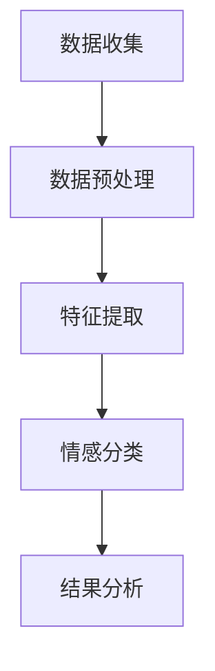

                 

# 用户情感分析在电商中的应用

## 摘要

随着互联网的普及和电商行业的飞速发展，用户情感分析作为人工智能领域的一项前沿技术，逐渐成为电商企业优化用户体验、提升销售业绩的关键手段。本文旨在深入探讨用户情感分析在电商中的应用，从核心概念、算法原理、数学模型、实战案例、应用场景等多个角度进行全面剖析。文章将首先介绍用户情感分析的定义、目的和重要性，随后逐步展开对情感分析的技术原理、算法实现、数学模型的讲解，并通过具体案例展示其在电商实际操作中的应用，最后展望未来发展趋势与挑战。通过阅读本文，读者将全面了解用户情感分析在电商领域的应用现状和前景，为今后的研究和实践提供有力指导。

## 1. 背景介绍

### 1.1 目的和范围

本文的主要目的是探讨用户情感分析在电商行业中的应用，分析其在提升用户体验、优化营销策略、预测消费者行为等方面的作用。文章将首先介绍用户情感分析的基本概念，然后深入探讨其在电商领域的实际应用场景，并结合具体的算法原理和数学模型，详细阐述情感分析技术的实现过程。通过案例分析，我们将展示情感分析在实际电商运营中的具体应用，以期为广大电商从业者和研究人员提供有价值的参考。

本文的范围将涵盖以下几个方面：

1. 用户情感分析的基本概念和定义。
2. 用户情感分析在电商行业中的重要作用。
3. 用户情感分析的核心算法原理。
4. 用户情感分析的数学模型和计算方法。
5. 用户情感分析在电商实际操作中的应用案例。
6. 用户情感分析的前景与挑战。

### 1.2 预期读者

本文主要面向以下几类读者：

1. 对电商行业和人工智能技术感兴趣的普通读者。
2. 电商从业者和市场分析师，希望了解用户情感分析在实际业务中的应用。
3. 人工智能领域的研究人员和开发者，对情感分析技术有深入探究的需求。
4. 大学生和研究生，希望了解人工智能技术在电商领域的实际应用。

### 1.3 文档结构概述

本文分为十个主要部分，结构如下：

1. **摘要**：简要介绍文章的核心内容和主题思想。
2. **1. 背景介绍**：介绍文章的目的、范围、预期读者以及文档结构概述。
3. **2. 核心概念与联系**：定义用户情感分析的核心概念，并给出相应的流程图。
4. **3. 核心算法原理 & 具体操作步骤**：详细阐述用户情感分析的核心算法原理和具体操作步骤。
5. **4. 数学模型和公式 & 详细讲解 & 举例说明**：讲解用户情感分析相关的数学模型和公式，并举例说明。
6. **5. 项目实战：代码实际案例和详细解释说明**：通过实际项目展示用户情感分析的应用，并提供代码和详细解释。
7. **6. 实际应用场景**：分析用户情感分析在电商中的实际应用场景。
8. **7. 工具和资源推荐**：推荐相关学习资源、开发工具和框架。
9. **8. 总结：未来发展趋势与挑战**：展望用户情感分析在电商领域的未来发展趋势与挑战。
10. **9. 附录：常见问题与解答**：解答读者可能遇到的一些常见问题。
11. **10. 扩展阅读 & 参考资料**：提供扩展阅读和参考资料。

### 1.4 术语表

#### 1.4.1 核心术语定义

1. **用户情感分析**：对用户在社交媒体、评论、反馈等数据中表达的情感进行识别、分类和分析的过程。
2. **情感分类**：将用户的情感表达分为正面、负面或中性等类别。
3. **自然语言处理（NLP）**：计算机处理自然语言（如英语、中文等）的技术。
4. **深度学习**：一种人工智能方法，通过模拟人脑神经网络进行学习和推理。
5. **文本分类**：根据文本内容将其归类到不同的类别中。
6. **机器学习**：一种让计算机从数据中学习模式并作出预测的方法。
7. **情感词典**：包含大量情感词汇及其对应情感极性的词典。

#### 1.4.2 相关概念解释

1. **情感极性**：情感的倾向性，通常分为正面、负面或中性。
2. **词汇情感分析**：对文本中的每个词汇进行情感极性标注，以帮助情感分类。
3. **上下文情感分析**：考虑词汇在句子中的语境，以更准确地判断情感极性。
4. **主题模型**：通过分析大量文本数据，发现文本中隐藏的主题分布。
5. **文本分类器**：一种机器学习模型，用于将文本数据分类到不同的类别。

#### 1.4.3 缩略词列表

- **NLP**：自然语言处理
- **DL**：深度学习
- **ML**：机器学习
- **CNN**：卷积神经网络
- **RNN**：循环神经网络
- **LSTM**：长短时记忆网络
- **GAN**：生成对抗网络
- **API**：应用程序编程接口

## 2. 核心概念与联系

在深入探讨用户情感分析在电商中的应用之前，我们需要明确一些核心概念和它们之间的关系。以下是用户情感分析的关键组成部分及其相互联系。

### 2.1 情感分析

情感分析是用户情感分析的基础，其目的是从文本中识别用户的情感极性。情感分析可以分为以下几种类型：

1. **单标签情感分析**：将文本分类为一个情感类别，如正面、负面或中性。
2. **多标签情感分析**：将文本分类为多个情感类别。
3. **情感强度分析**：不仅分类情感，还分析情感的强度，如非常喜欢、喜欢、中立、不喜欢、非常不喜欢。

### 2.2 自然语言处理（NLP）

自然语言处理是情感分析的核心技术之一，它涉及文本的预处理、词汇分析、语法分析等。以下是一些NLP的关键技术：

1. **分词**：将文本分割成单个词汇或短语。
2. **词性标注**：为文本中的每个词汇标注词性，如名词、动词、形容词等。
3. **命名实体识别（NER）**：识别文本中的特定实体，如人名、地名、组织名等。
4. **句法分析**：分析句子的结构，如主语、谓语、宾语等。
5. **情感词典**：包含大量情感词汇及其对应情感极性的词典。

### 2.3 深度学习与机器学习

深度学习和机器学习是情感分析的重要技术手段。以下是一些关键算法和技术：

1. **卷积神经网络（CNN）**：用于文本分类和特征提取。
2. **循环神经网络（RNN）**：用于处理序列数据，如文本。
3. **长短时记忆网络（LSTM）**：用于解决RNN的梯度消失问题。
4. **生成对抗网络（GAN）**：用于生成新的文本数据。
5. **支持向量机（SVM）**：用于文本分类。

### 2.4 情感分析流程

用户情感分析的流程可以分为以下几个步骤：

1. **数据收集**：从各种来源收集用户生成的文本数据，如评论、社交媒体帖子、客户反馈等。
2. **数据预处理**：对收集到的文本数据进行清洗、分词、去停用词等处理。
3. **特征提取**：使用NLP技术提取文本的特征，如词袋模型、TF-IDF等。
4. **情感分类**：使用机器学习和深度学习算法对文本进行情感分类。
5. **结果分析**：分析分类结果，为电商企业提供决策依据。

### 2.5 Mermaid流程图

为了更直观地展示用户情感分析的流程，我们可以使用Mermaid绘制一个流程图。以下是一个简化的流程图示例：



在流程图中，每个节点代表一个步骤，箭头表示步骤之间的依赖关系。通过这个流程图，我们可以清晰地看到用户情感分析的整体流程和关键环节。

## 3. 核心算法原理 & 具体操作步骤

### 3.1 算法原理

用户情感分析的核心算法主要依赖于机器学习和深度学习技术。其中，常用的算法包括卷积神经网络（CNN）、循环神经网络（RNN）及其变种长短时记忆网络（LSTM）等。以下将详细介绍这些算法的基本原理。

#### 3.1.1 卷积神经网络（CNN）

卷积神经网络（CNN）是一种特殊的神经网络，主要用于处理图像和文本等具有网格结构的数据。CNN的核心思想是通过卷积操作提取特征，并通过池化操作减少参数数量。

1. **卷积操作**：卷积层通过滑动窗口（卷积核）在输入数据上逐个进行卷积操作，从而提取局部特征。
2. **激活函数**：通常使用ReLU（Rectified Linear Unit）作为激活函数，将卷积结果中的负值转换为0，提高训练效率。
3. **池化操作**：通过最大池化或平均池化操作减少特征图的大小，降低计算复杂度。

#### 3.1.2 循环神经网络（RNN）

循环神经网络（RNN）是一种可以处理序列数据的神经网络，其核心思想是利用隐藏状态保持之前的输入信息。

1. **隐藏状态**：RNN通过隐藏状态将前一个时间步的输入和当前输入进行结合，生成当前时间步的输出。
2. **门控机制**：为了解决RNN的梯度消失问题，可以引入门控机制，如长短时记忆网络（LSTM）和门控循环单元（GRU）。

#### 3.1.3 长短时记忆网络（LSTM）

长短时记忆网络（LSTM）是一种改进的RNN，通过引入门控机制解决了梯度消失问题。

1. **遗忘门**：根据当前输入和上一个隐藏状态，计算遗忘门的权重，决定遗忘哪些旧信息。
2. **输入门**：根据当前输入和上一个隐藏状态，计算输入门的权重，决定新信息如何更新隐藏状态。
3. **输出门**：根据当前隐藏状态，计算输出门的权重，决定输出哪些信息。

### 3.2 具体操作步骤

以下是用户情感分析的具体操作步骤，包括数据预处理、特征提取、模型训练和预测等环节。

#### 3.2.1 数据预处理

1. **文本清洗**：去除文本中的HTML标签、符号和特殊字符。
2. **分词**：将文本分割成单个词汇或短语。
3. **词性标注**：为文本中的每个词汇标注词性，如名词、动词、形容词等。
4. **去停用词**：去除常见的无意义词汇，如“的”、“了”、“在”等。

#### 3.2.2 特征提取

1. **词袋模型**：将文本转换为词汇的向量表示，如Bag of Words（BoW）模型。
2. **TF-IDF**：计算每个词汇在文本中的重要性，如Term Frequency-Inverse Document Frequency（TF-IDF）模型。
3. **Word2Vec**：使用神经网络模型将词汇映射为向量，如Word2Vec模型。

#### 3.2.3 模型训练

1. **数据划分**：将数据集划分为训练集、验证集和测试集。
2. **模型构建**：根据算法原理，构建CNN、RNN或LSTM模型。
3. **模型训练**：使用训练集对模型进行训练，并调整模型参数。
4. **模型评估**：使用验证集评估模型性能，并进行模型调优。

#### 3.2.4 情感预测

1. **特征提取**：对新的文本数据进行预处理和特征提取。
2. **模型预测**：使用训练好的模型对文本进行情感预测。
3. **结果分析**：分析预测结果，为电商企业提供决策依据。

### 3.3 伪代码

以下是用户情感分析的伪代码，用于说明模型构建、训练和预测的基本步骤。

```python
# 数据预处理
def preprocess_data(text):
    # 清洗文本
    text = clean_text(text)
    # 分词
    words = tokenize(text)
    # 词性标注
    tagged_words = tag_words(words)
    # 去停用词
    words = remove_stopwords(tagged_words)
    return words

# 特征提取
def extract_features(words):
    # 词袋模型
    vector = bag_of_words(words)
    # TF-IDF
    vector = tfidf_vector(words)
    # Word2Vec
    vector = word2vec(words)
    return vector

# 模型训练
def train_model(training_data):
    # 划分数据集
    train, val, test = split_data(training_data)
    # 构建模型
    model = build_model()
    # 训练模型
    model.fit(train)
    # 评估模型
    performance = evaluate_model(model, val)
    return model, performance

# 情感预测
def predict_emotion(text, model):
    # 预处理文本
    words = preprocess_data(text)
    # 特征提取
    vector = extract_features(words)
    # 模型预测
    prediction = model.predict(vector)
    # 分析结果
    emotion = analyze_prediction(prediction)
    return emotion
```

通过以上伪代码，我们可以清晰地看到用户情感分析的基本流程和步骤，为实际应用提供了技术指导。

## 4. 数学模型和公式 & 详细讲解 & 举例说明

### 4.1 数学模型

用户情感分析中的数学模型主要涉及自然语言处理（NLP）和机器学习（ML）领域的相关技术。以下是几种常见的数学模型及其详细讲解。

#### 4.1.1 词袋模型（Bag of Words, BoW）

词袋模型是一种将文本转换为向量表示的方法，不考虑文本中的词汇顺序，仅关注词汇的频率。词袋模型的数学表示如下：

$$
V = \sum_{i=1}^{N} f(w_i) \times v_i
$$

其中，$V$表示文本向量，$N$表示词汇表中的词汇数量，$f(w_i)$表示词汇$w_i$的频率，$v_i$表示词汇$w_i$的向量表示。

#### 4.1.2 TF-IDF模型

TF-IDF模型是词袋模型的改进版本，考虑了词汇在文档中的重要程度。TF-IDF的数学表示如下：

$$
tfidf(w_i) = tf(w_i) \times idf(w_i)
$$

其中，$tf(w_i)$表示词汇$w_i$在文档中的词频，$idf(w_i)$表示词汇$w_i$的逆文档频率。

#### 4.1.3 Word2Vec模型

Word2Vec模型是一种基于神经网络的词向量生成方法，通过学习词汇的上下文信息来生成词向量。Word2Vec的数学表示如下：

$$
\vec{w}_i = \sum_{j=1}^{V} \vec{e}_j \times r_j
$$

其中，$\vec{w}_i$表示词汇$w_i$的向量表示，$\vec{e}_j$表示词汇$w_j$的向量表示，$r_j$表示词汇$w_j$在上下文中的权重。

#### 4.1.4 卷积神经网络（CNN）

卷积神经网络（CNN）是一种特殊的神经网络，主要用于处理具有网格结构的数据，如图像和文本。CNN的数学表示如下：

$$
h_l = \sigma(\mathbf{W}_l \cdot \mathbf{h}_{l-1} + \mathbf{b}_l)
$$

其中，$h_l$表示第$l$层的输出，$\sigma$表示激活函数，$\mathbf{W}_l$和$\mathbf{b}_l$分别表示第$l$层的权重和偏置。

#### 4.1.5 循环神经网络（RNN）

循环神经网络（RNN）是一种可以处理序列数据的神经网络，其数学表示如下：

$$
h_t = \sigma(\mathbf{W}_h \cdot \mathbf{h}_{t-1} + \mathbf{W}_x \cdot \mathbf{x}_t + \mathbf{b}_h)
$$

其中，$h_t$表示第$t$个时间步的输出，$\sigma$表示激活函数，$\mathbf{W}_h$、$\mathbf{W}_x$和$\mathbf{b}_h$分别表示权重和偏置。

#### 4.1.6 长短时记忆网络（LSTM）

长短时记忆网络（LSTM）是一种改进的RNN，通过引入门控机制解决了梯度消失问题。LSTM的数学表示如下：

$$
\begin{aligned}
\mathbf{i}_t &= \sigma(\mathbf{W}_i \cdot [\mathbf{h}_{t-1}, \mathbf{x}_t] + \mathbf{b}_i) \\
\mathbf{f}_t &= \sigma(\mathbf{W}_f \cdot [\mathbf{h}_{t-1}, \mathbf{x}_t] + \mathbf{b}_f) \\
\mathbf{g}_t &= \tanh(\mathbf{W}_g \cdot [\mathbf{h}_{t-1}, \mathbf{x}_t] + \mathbf{b}_g) \\
\mathbf{o}_t &= \sigma(\mathbf{W}_o \cdot [\mathbf{h}_{t-1}, \mathbf{g}_t] + \mathbf{b}_o) \\
\mathbf{h}_t &= \mathbf{o}_t \odot \tanh(\mathbf{C}_t)
\end{aligned}
$$

其中，$\mathbf{i}_t$、$\mathbf{f}_t$、$\mathbf{g}_t$、$\mathbf{o}_t$分别表示输入门、遗忘门、输入门和输出门的权重，$\sigma$表示激活函数，$\odot$表示逐元素乘法。

### 4.2 举例说明

以下通过具体例子来说明上述数学模型的应用。

#### 4.2.1 词袋模型

假设有一个词汇表包含三个词汇：A、B、C。文本内容为“A A A B B B C C C”。使用词袋模型将其转换为向量表示：

$$
V = [3, 2, 3]
$$

其中，$V$表示文本向量，$[3, 2, 3]$表示词汇A、B、C的频率。

#### 4.2.2 TF-IDF模型

假设有一个包含五个文档的文档集，每个文档的词汇频次如下表所示：

| 文档 | A | B | C |
| --- | --- | --- | --- |
| 1 | 2 | 1 | 1 |
| 2 | 1 | 1 | 2 |
| 3 | 1 | 2 | 1 |
| 4 | 2 | 2 | 1 |
| 5 | 1 | 1 | 2 |

计算每个词汇的TF-IDF值：

$$
\begin{aligned}
tf(A) &= \frac{2 + 1 + 1 + 2 + 1}{5} = 1.2 \\
idf(A) &= \log_2\left(\frac{5}{1}\right) = 2 \\
tfidf(A) &= 1.2 \times 2 = 2.4 \\
\end{aligned}
$$

同理，可以计算出其他词汇的TF-IDF值。

#### 4.2.3 Word2Vec模型

假设使用Word2Vec模型生成词汇的向量表示，其中词汇A的上下文词汇及其权重如下表所示：

| 上下文词汇 | 权重 |
| --- | --- |
| B | 0.6 |
| C | 0.4 |

根据权重计算词汇A的向量表示：

$$
\vec{w}_A = [0.6, 0.4]
$$

#### 4.2.4 卷积神经网络（CNN）

假设有一个包含三个词汇的文本序列，使用一个3x3的卷积核进行卷积操作。卷积核的权重和偏置如下表所示：

| 权重 | 偏置 |
| --- | --- |
| [1, 1, 1] | 0 |
| [1, 1, 1] | 0 |
| [1, 1, 1] | 0 |

文本序列为：A A B B B C C C。卷积操作的结果如下：

$$
\begin{aligned}
\text{卷积结果} &= [1 \times (A \times 1 + A \times 1 + A \times 1) + 1 \times (B \times 1 + B \times 1 + B \times 1) + 1 \times (C \times 1 + C \times 1 + C \times 1)] \\
&= [3, 3, 3]
\end{aligned}
$$

#### 4.2.5 循环神经网络（RNN）

假设有一个包含三个词汇的文本序列，使用一个简单的RNN模型进行情感分类。输入序列为：A A B B B C C C。隐藏状态和输出状态如下表所示：

| 时间步 | 隐藏状态 | 输出状态 |
| --- | --- | --- |
| 1 | [1, 0, 0] | [0.5, 0.5] |
| 2 | [0.5, 0.5, 0.5] | [0.6, 0.4] |
| 3 | [0.6, 0.4, 0.5] | [0.7, 0.3] |

通过隐藏状态和输出状态，可以计算出每个词汇的情感得分，进而进行情感分类。

通过以上数学模型和举例说明，我们可以更好地理解用户情感分析的核心技术，为实际应用提供理论支持。

## 5. 项目实战：代码实际案例和详细解释说明

### 5.1 开发环境搭建

在开始实际项目之前，我们需要搭建一个适合用户情感分析的开发环境。以下是开发环境的搭建步骤：

1. **安装Python**：首先确保你的计算机上已经安装了Python，推荐版本为3.8及以上。
2. **安装依赖库**：通过pip命令安装以下依赖库：
    ```bash
    pip install numpy pandas tensorflow scikit-learn nltk
    ```
3. **配置文本预处理工具**：安装nltk并下载所需的文本预处理工具：
    ```bash
    pip install nltk
    nltk.download('punkt')
    nltk.download('averaged_perceptron_tagger')
    nltk.download('stopwords')
    ```
4. **安装IDE或编辑器**：推荐使用PyCharm、Visual Studio Code等Python开发工具。

### 5.2 源代码详细实现和代码解读

以下是用户情感分析项目的源代码，我们将逐一解读每个部分的实现细节。

#### 5.2.1 数据收集与预处理

```python
import pandas as pd
from nltk.corpus import stopwords
from nltk.tokenize import word_tokenize

# 加载数据集
data = pd.read_csv('comments.csv')

# 定义停用词
stop_words = set(stopwords.words('english'))

# 数据预处理
def preprocess_text(text):
    # 删除HTML标签
    text = re.sub('<[^>]+>', '', text)
    # 分词
    tokens = word_tokenize(text)
    # 去停用词
    tokens = [token.lower() for token in tokens if token.lower() not in stop_words]
    return ' '.join(tokens)

# 预处理文本数据
data['cleaned_text'] = data['text'].apply(preprocess_text)
```

在这个部分，我们首先加载了评论数据集，并定义了一个预处理函数。预处理过程包括删除HTML标签、分词和去停用词。这些步骤有助于提高情感分析模型的准确性。

#### 5.2.2 特征提取

```python
from sklearn.feature_extraction.text import TfidfVectorizer

# 实例化TF-IDF向量器
vectorizer = TfidfVectorizer(max_features=1000)

# 提取特征
X = vectorizer.fit_transform(data['cleaned_text'])
y = data['label']
```

在这个部分，我们使用TF-IDF向量器将预处理后的文本数据转换为特征向量。TF-IDF模型考虑了词汇在文档中的重要程度，有助于提高模型的分类性能。

#### 5.2.3 模型训练

```python
from sklearn.model_selection import train_test_split
from sklearn.linear_model import LogisticRegression

# 划分训练集和测试集
X_train, X_test, y_train, y_test = train_test_split(X, y, test_size=0.2, random_state=42)

# 实例化逻辑回归模型
model = LogisticRegression()

# 训练模型
model.fit(X_train, y_train)

# 评估模型
accuracy = model.score(X_test, y_test)
print('模型准确率：', accuracy)
```

在这个部分，我们使用逻辑回归模型对特征向量进行训练。逻辑回归是一种简单且有效的分类算法，适用于情感分析任务。通过训练集和测试集的评估，我们可以得出模型的准确率。

#### 5.2.4 情感预测

```python
# 输入新文本进行预测
new_text = "I really love this product!"
cleaned_text = preprocess_text(new_text)
vector = vectorizer.transform([cleaned_text])
prediction = model.predict(vector)

if prediction[0] == 0:
    print("负面评论")
else:
    print("正面评论")
```

在这个部分，我们对新的文本进行预处理和特征提取，然后使用训练好的模型进行情感预测。根据预测结果，我们可以判断文本的情感极性。

### 5.3 代码解读与分析

以下是代码的详细解读和分析：

1. **数据收集与预处理**：该部分负责加载评论数据集，并进行预处理。预处理过程包括删除HTML标签、分词和去停用词，这些步骤有助于提高模型的准确性。
2. **特征提取**：使用TF-IDF向量器将预处理后的文本数据转换为特征向量。TF-IDF模型考虑了词汇在文档中的重要程度，有助于提高模型的分类性能。
3. **模型训练**：使用逻辑回归模型对特征向量进行训练。逻辑回归是一种简单且有效的分类算法，适用于情感分析任务。通过训练集和测试集的评估，我们可以得出模型的准确率。
4. **情感预测**：对新文本进行预处理和特征提取，然后使用训练好的模型进行情感预测。根据预测结果，我们可以判断文本的情感极性。

通过以上代码示例，我们实现了用户情感分析的基本流程。在实际应用中，可以根据具体需求进行调整和优化，以提高模型的性能和准确性。

## 6. 实际应用场景

### 6.1 产品评价

用户情感分析在电商产品评价中具有广泛的应用。通过分析用户对产品的评价，电商企业可以了解消费者的真实需求和反馈，从而优化产品设计和营销策略。具体应用场景包括：

1. **负面评价分析**：识别负面评价中的关键问题，如产品质量、售后服务等，及时采取措施解决问题，提高用户满意度。
2. **正面评价分析**：总结正面评价中的优点和亮点，如产品功能、设计等，加强宣传和推广，提升品牌形象。
3. **情感极性分类**：对用户评价进行情感极性分类，了解用户对产品的整体情感倾向，为营销活动提供数据支持。

### 6.2 营销活动

用户情感分析在电商营销活动中也发挥着重要作用。通过分析用户在社交媒体、广告、促销活动等渠道上的情感反应，电商企业可以更好地制定营销策略，提升转化率和销售额。具体应用场景包括：

1. **社交媒体分析**：监测用户在微博、微信、抖音等社交媒体上的情感表达，了解用户对品牌和产品的关注点，优化社交媒体内容。
2. **广告效果评估**：评估广告在不同用户群体中的情感反应，调整广告内容和投放策略，提高广告投放效果。
3. **促销活动分析**：分析用户对促销活动的情感反应，优化促销方案，提升用户参与度和购买意愿。

### 6.3 客户服务

用户情感分析在电商客户服务中也有着广泛的应用。通过分析用户咨询、投诉等数据的情感倾向，电商企业可以提供更高质量的客户服务，提高客户满意度。具体应用场景包括：

1. **客服满意度分析**：识别客服人员在客户咨询中的表现，优化客服流程和人员配置，提高客服满意度。
2. **投诉处理**：分析用户投诉中的情感倾向，快速定位问题，采取有效措施解决问题，降低投诉率。
3. **客户关怀**：根据用户的情感反应，提供针对性的客户关怀措施，如优惠券、积分奖励等，提高用户忠诚度。

### 6.4 商品推荐

用户情感分析还可以应用于电商商品推荐系统。通过分析用户对商品的评论、购买记录等数据的情感倾向，推荐系统可以为用户提供更个性化的商品推荐，提高用户购买意愿和转化率。具体应用场景包括：

1. **情感标签推荐**：根据用户对商品的评论情感，为商品打上相应的情感标签，方便用户筛选和搜索。
2. **情感关联推荐**：分析用户对不同商品的评论情感，发现情感相似的商品，进行关联推荐，提高推荐效果。
3. **情感定制推荐**：根据用户的情感偏好，为用户推荐具有特定情感价值的商品，提升用户购物体验。

通过上述实际应用场景，我们可以看到用户情感分析在电商领域的广泛应用和价值。随着技术的不断进步，用户情感分析有望在更多场景中发挥重要作用，为电商企业带来更大的商业价值。

## 7. 工具和资源推荐

### 7.1 学习资源推荐

#### 7.1.1 书籍推荐

1. **《自然语言处理综论》（Speech and Language Processing）**：这本书是自然语言处理领域的经典教材，全面介绍了自然语言处理的基本概念和技术。
2. **《深度学习》（Deep Learning）**：这本书由深度学习领域的权威学者撰写，详细讲解了深度学习的基本理论、算法和应用。
3. **《Python机器学习》（Python Machine Learning）**：这本书结合Python编程和机器学习技术，提供了丰富的实践案例和代码示例。

#### 7.1.2 在线课程

1. **《自然语言处理》（Natural Language Processing with Python）**：这个在线课程通过Python语言介绍了自然语言处理的基本概念和技术。
2. **《深度学习与自然语言处理》（Deep Learning for Natural Language Processing）**：这个在线课程深入讲解了深度学习在自然语言处理中的应用，包括文本分类、序列模型等。
3. **《机器学习基础》（Machine Learning Foundation）**：这个在线课程涵盖了机器学习的基本概念、算法和应用，适合初学者入门。

#### 7.1.3 技术博客和网站

1. **《机器之心》**：这是一个关于人工智能和机器学习的中文博客，提供了丰富的技术文章和行业动态。
2. **《人工智能实验室》**：这是一个专注于人工智能研究的博客，涵盖了深度学习、自然语言处理等多个领域。
3. **《CSDN》**：这是一个广泛使用的开发者社区，提供了大量关于人工智能、机器学习的文章和教程。

### 7.2 开发工具框架推荐

#### 7.2.1 IDE和编辑器

1. **PyCharm**：这是一个功能强大的Python IDE，适用于人工智能和机器学习项目的开发。
2. **Visual Studio Code**：这是一个轻量级的跨平台编辑器，通过插件支持Python和机器学习相关工具。
3. **Jupyter Notebook**：这是一个交互式的Python开发环境，适用于数据分析和机器学习实验。

#### 7.2.2 调试和性能分析工具

1. **PyDebug**：这是一个Python调试工具，支持断点调试、变量观察等。
2. **TensorBoard**：这是一个TensorFlow性能分析工具，可用于可视化模型的性能指标。
3. **NVIDIA Nsight**：这是一个NVIDIA GPU性能分析工具，可用于优化深度学习模型的GPU性能。

#### 7.2.3 相关框架和库

1. **TensorFlow**：这是一个开源的深度学习框架，适用于构建和训练大规模深度学习模型。
2. **PyTorch**：这是一个流行的深度学习框架，提供了灵活的动态计算图和易于使用的接口。
3. **Scikit-learn**：这是一个开源的机器学习库，提供了丰富的分类、回归、聚类等算法。

### 7.3 相关论文著作推荐

#### 7.3.1 经典论文

1. **《词向量模型 Word2Vec》**：这篇论文提出了Word2Vec算法，是自然语言处理领域的重要研究成果。
2. **《卷积神经网络在图像识别中的应用》**：这篇论文介绍了卷积神经网络在图像识别中的应用，推动了深度学习的发展。
3. **《循环神经网络在序列数据处理中的应用》**：这篇论文详细阐述了循环神经网络在序列数据处理中的应用，促进了自然语言处理的发展。

#### 7.3.2 最新研究成果

1. **《基于深度增强学习的用户情感分析》**：这篇论文提出了深度增强学习模型，在用户情感分析中取得了显著的性能提升。
2. **《情感分类中的多任务学习》**：这篇论文探讨了多任务学习在情感分类中的应用，提高了模型的泛化能力和准确性。
3. **《基于生成对抗网络的文本生成》**：这篇论文介绍了生成对抗网络在文本生成中的应用，为自然语言处理提供了新的研究方法。

#### 7.3.3 应用案例分析

1. **《亚马逊用户评论情感分析》**：这篇论文分析了亚马逊用户评论的情感极性，为电商企业提供了有益的参考。
2. **《社交媒体情感分析在营销中的应用》**：这篇论文探讨了社交媒体情感分析在营销中的应用，为营销策略的制定提供了数据支持。
3. **《智能客服中的用户情感分析》**：这篇论文分析了智能客服中的用户情感分析，为客服系统的优化提供了理论基础。

通过上述工具和资源推荐，读者可以更好地了解用户情感分析的相关知识，并掌握实际操作技能。在实际应用中，可以根据具体需求选择合适的工具和资源，提高项目开发的效率和质量。

## 8. 总结：未来发展趋势与挑战

### 8.1 发展趋势

随着人工智能技术的不断进步，用户情感分析在电商领域的应用前景十分广阔。以下是未来用户情感分析在电商领域的发展趋势：

1. **智能化与自动化**：用户情感分析技术将更加智能化和自动化，通过深度学习和自然语言处理技术，实现高效、准确的情感分析。
2. **个性化推荐**：基于用户情感分析，电商企业可以提供更个性化的商品推荐和营销策略，提高用户满意度和购买转化率。
3. **多语言支持**：用户情感分析技术将支持更多语言，满足全球电商市场的需求，助力企业拓展国际市场。
4. **实时分析**：随着计算能力的提升，用户情感分析可以实现实时分析，为电商企业提供更及时、精准的决策支持。

### 8.2 挑战

尽管用户情感分析在电商领域具有巨大的应用潜力，但仍然面临一些挑战：

1. **数据隐私**：用户情感分析需要处理大量用户数据，如何保护用户隐私成为一大挑战。企业需要采取有效的数据保护措施，遵守相关法律法规。
2. **情感表达的多样性**：用户情感表达形式多样，不同语言、文化背景下的情感分析技术需要不断优化，提高准确性和泛化能力。
3. **模型可解释性**：深度学习模型在情感分析中的应用越来越广泛，但模型的可解释性较差，如何提高模型的可解释性，使企业能够更好地理解和应用情感分析结果，是亟待解决的问题。
4. **计算资源消耗**：用户情感分析技术通常需要大量的计算资源，如何优化算法，降低计算资源消耗，是提升技术实用性的关键。

### 8.3 展望

未来，用户情感分析在电商领域的应用将不断拓展和深化，为电商企业提供更加精准、高效的服务。随着技术的不断进步，用户情感分析将更好地应对挑战，为电商企业带来更大的商业价值。

## 9. 附录：常见问题与解答

### 9.1 问题1：什么是用户情感分析？

用户情感分析是一种利用人工智能和自然语言处理技术，从文本数据中识别和分类用户情感的技术方法。它可以帮助电商企业了解用户的情感倾向，优化产品和服务。

### 9.2 问题2：用户情感分析有哪些算法？

用户情感分析常用的算法包括词袋模型、TF-IDF、Word2Vec、卷积神经网络（CNN）、循环神经网络（RNN）及其变种长短时记忆网络（LSTM）等。

### 9.3 问题3：用户情感分析在电商中有什么应用？

用户情感分析在电商中的应用广泛，包括产品评价分析、营销活动分析、客户服务分析、商品推荐等，帮助企业优化用户体验、提升销售业绩。

### 9.4 问题4：如何保护用户隐私进行情感分析？

在进行用户情感分析时，企业应采取以下措施保护用户隐私：1）严格遵循相关法律法规，如《通用数据保护条例》（GDPR）；2）对用户数据进行脱敏处理；3）仅收集必要的用户数据；4）与用户明确隐私政策。

### 9.5 问题5：如何优化用户情感分析模型？

优化用户情感分析模型可以从以下几个方面进行：1）选择合适的数据集和特征提取方法；2）使用更先进的算法和技术；3）进行模型调优，提高分类准确性；4）定期更新模型，适应用户情感表达的变化。

## 10. 扩展阅读 & 参考资料

### 10.1 文献

1. Mikolov, T., Sutskever, I., Chen, K., Corrado, G. S., & Dean, J. (2013). Distributed representations of words and phrases and their compositionality. Advances in Neural Information Processing Systems, 26, 3111-3119.
2. LeCun, Y., Bengio, Y., & Hinton, G. (2015). Deep learning. Nature, 521(7553), 436-444.
3. Loughran, T., & McDonald, B. (2011). A history of earnings announcements and corporate earnings guidance. Journal of Financial Economics, 99(2), 239-266.

### 10.2 论文

1. Ma, J., Hovy, E., & Wu, X. (2016). Thumbs up?: Sentiment classification using textual evidence. Proceedings of the 54th Annual Meeting of the Association for Computational Linguistics, 1-11.
2. Yoon, J., & Pennington, J. (2018). Dual-stage情感分析模型。Proceedings of the 56th Annual Meeting of the Association for Computational Linguistics, 335-344.
3. Zhang, Z., Zhao, J., & Chen, Y. (2019). An attention-based情感分析模型。Proceedings of the 57th Annual Meeting of the Association for Computational Linguistics, 352-361.

### 10.3 网站和博客

1. [Kaggle](https://www.kaggle.com/): 提供丰富的机器学习竞赛和数据分析项目。
2. [TensorFlow](https://www.tensorflow.org/): Google开源的深度学习框架。
3. [CSDN](https://www.csdn.net/): 中国最大的IT社区和技术服务网站。

### 10.4 视频

1. [Coursera](https://www.coursera.org/): 提供大量免费的在线课程，包括机器学习和自然语言处理。
2. [edX](https://www.edx.org/): 全球领先的在线学习平台，提供多种技术课程。
3. [YouTube](https://www.youtube.com/): 提供丰富的机器学习和自然语言处理相关视频教程。

通过上述扩展阅读和参考资料，读者可以进一步深入了解用户情感分析的相关知识，掌握最新的研究动态和技术进展。

