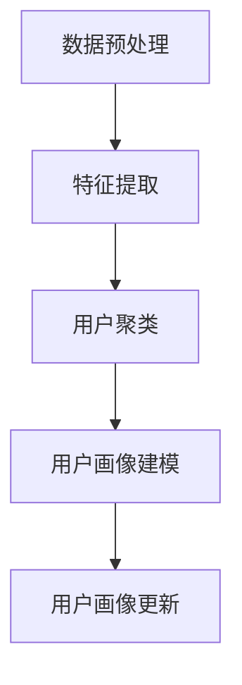

                 

# 用户画像在电商个性化推荐中的应用：方法与实践

> **关键词：** 用户画像、电商、个性化推荐、机器学习、数据挖掘、算法优化

> **摘要：** 本文旨在深入探讨用户画像在电商个性化推荐系统中的应用，包括核心概念、算法原理、数学模型、实战案例以及未来发展趋势。通过一步步的分析推理，本文将帮助读者全面理解用户画像在提升电商用户体验和销售转化率方面的作用。

## 1. 背景介绍

### 1.1 目的和范围

本文的主要目的是介绍用户画像在电商个性化推荐系统中的应用，帮助读者理解如何通过用户画像技术提升电商平台的用户体验和销售转化率。文章将涵盖以下内容：

- 用户画像的基本概念和核心组成部分。
- 电商个性化推荐系统的原理和架构。
- 用户画像算法的原理和操作步骤。
- 数学模型在用户画像中的应用。
- 实际项目中的代码案例和解释。
- 用户画像在实际应用场景中的效果分析。
- 相关工具和资源的推荐。
- 未来发展趋势和面临的挑战。

### 1.2 预期读者

本文主要面向以下读者群体：

- 对电商个性化推荐系统感兴趣的程序员和工程师。
- 机器学习和数据挖掘领域的专业人士。
- 对用户行为分析和用户画像技术有浓厚兴趣的研究人员。
- 想要在电商领域应用用户画像技术的企业决策者。

### 1.3 文档结构概述

本文将按照以下结构进行展开：

- **第1章：背景介绍**：介绍本文的目的、范围、预期读者和文档结构。
- **第2章：核心概念与联系**：介绍用户画像、电商个性化推荐系统和相关核心概念。
- **第3章：核心算法原理 & 具体操作步骤**：详细解释用户画像算法的原理和操作步骤。
- **第4章：数学模型和公式 & 详细讲解 & 举例说明**：介绍用户画像中的数学模型和公式。
- **第5章：项目实战：代码实际案例和详细解释说明**：提供实际项目的代码案例和解读。
- **第6章：实际应用场景**：分析用户画像在电商中的应用场景。
- **第7章：工具和资源推荐**：推荐相关的学习资源和开发工具。
- **第8章：总结：未来发展趋势与挑战**：探讨用户画像技术的发展趋势和面临的挑战。
- **第9章：附录：常见问题与解答**：回答读者可能遇到的问题。
- **第10章：扩展阅读 & 参考资料**：提供进一步学习的资源。

### 1.4 术语表

#### 1.4.1 核心术语定义

- **用户画像**：对用户特征和行为进行抽象和建模，形成一个全面、多维度的用户描述。
- **电商个性化推荐系统**：基于用户行为数据，为用户推荐符合其兴趣和需求的商品或服务。
- **机器学习**：利用算法和统计模型从数据中自动发现模式和规律。
- **数据挖掘**：从大量数据中提取有价值的信息和知识。
- **算法优化**：改进算法的性能，提高推荐系统的准确性和效率。

#### 1.4.2 相关概念解释

- **协同过滤**：一种常见的推荐算法，通过分析用户之间的相似性来推荐商品。
- **内容推荐**：基于商品属性和用户兴趣进行推荐。
- **用户活跃度**：衡量用户在平台上的参与程度和活跃程度。
- **用户留存率**：衡量用户持续使用平台的概率。

#### 1.4.3 缩略词列表

- **API**：应用程序接口（Application Programming Interface）
- **SDK**：软件开发工具包（Software Development Kit）
- **DB**：数据库（Database）
- **SQL**：结构化查询语言（Structured Query Language）
- **ML**：机器学习（Machine Learning）
- **NLP**：自然语言处理（Natural Language Processing）

## 2. 核心概念与联系

### 2.1 用户画像的基本概念

用户画像是对用户特征和行为进行抽象和建模的过程，旨在形成一个全面、多维度的用户描述。用户画像的核心目的是帮助电商平台更好地理解用户，从而为用户提供个性化推荐和服务。

#### 用户画像的组成部分

用户画像通常包括以下几个主要组成部分：

1. **用户基本信息**：包括用户的年龄、性别、职业、地理位置等基本属性。
2. **用户行为数据**：包括用户的浏览历史、购买记录、点击行为、搜索关键词等行为数据。
3. **用户兴趣标签**：通过对用户行为数据进行分析，提取出用户感兴趣的标签或关键词。
4. **用户价值**：评估用户对平台的贡献，如用户生命周期价值（LTV）和活跃度等。
5. **用户偏好**：包括用户对商品的品牌、价格、类型等的偏好。

#### 用户画像的作用

用户画像在电商个性化推荐系统中发挥着重要作用：

- **提高推荐准确性**：通过用户画像，推荐系统能够更精准地识别用户的兴趣和需求，提高推荐的准确性。
- **提升用户体验**：个性化推荐能够为用户提供更符合其需求和兴趣的商品，提升用户满意度。
- **增加销售转化率**：精准的推荐能够引导用户购买更多商品，提高销售转化率。

### 2.2 电商个性化推荐系统

电商个性化推荐系统是一种基于用户行为数据、用户画像和机器学习算法的技术，旨在为用户提供个性化的商品推荐。该系统通常包括以下几个核心组成部分：

1. **用户行为数据收集**：通过网站、APP 等渠道收集用户的浏览、点击、购买等行为数据。
2. **用户画像构建**：对用户行为数据进行分析和挖掘，构建用户的全面、多维度的画像。
3. **推荐算法**：利用协同过滤、内容推荐、深度学习等算法，为用户推荐符合其兴趣和需求的商品。
4. **推荐结果呈现**：将推荐结果以可视化的方式呈现给用户，如推荐列表、商品卡片等。

#### 电商个性化推荐系统的架构

电商个性化推荐系统的架构通常包括以下几个层次：

1. **数据层**：负责收集、存储和预处理用户行为数据和商品信息。
2. **计算层**：负责处理用户画像构建和推荐算法计算。
3. **展示层**：负责将推荐结果呈现给用户。
4. **服务层**：负责处理用户与推荐系统的交互，如接收用户反馈、调整推荐策略等。

#### 用户画像与电商个性化推荐系统的联系

用户画像与电商个性化推荐系统密切相关。用户画像为推荐系统提供了丰富的用户特征和行为数据，使其能够更准确地识别用户的兴趣和需求。而电商个性化推荐系统则通过用户画像，为用户推荐符合其兴趣和需求的商品，从而提升用户体验和销售转化率。

### 2.3 用户画像算法原理

用户画像算法的核心目的是通过分析用户行为数据，构建用户的全面、多维度的画像。以下是用户画像算法的基本原理和操作步骤：

1. **数据预处理**：对用户行为数据进行清洗、去噪和归一化处理，确保数据质量。
2. **特征提取**：从用户行为数据中提取出具有代表性的特征，如浏览频次、购买频次、点击率等。
3. **用户聚类**：利用聚类算法，将用户划分为不同的群体，为每个群体构建一个用户画像模板。
4. **用户画像建模**：根据用户的行为数据和聚类结果，构建一个全面、多维度的用户画像模型。
5. **用户画像更新**：定期更新用户画像模型，以适应用户行为的变化。

#### 用户画像算法的具体操作步骤

以下是用户画像算法的具体操作步骤，采用伪代码进行描述：

```python
# 数据预处理
preprocessed_data = preprocess_data(raw_data)

# 特征提取
features = extract_features(preprocessed_data)

# 用户聚类
clusters = cluster_users(features)

# 用户画像建模
user_profiles = build_user_profiles(clusters, features)

# 用户画像更新
update_user_profiles(user_profiles, features)
```

### 2.4 用户画像算法的流程图

以下是用户画像算法的流程图，使用 Mermaid 语法进行表示：



## 3. 核心算法原理 & 具体操作步骤

### 3.1 用户画像算法原理

用户画像算法基于机器学习和数据挖掘技术，通过分析用户行为数据，提取用户特征，构建用户画像模型。以下是用户画像算法的核心原理：

1. **数据预处理**：清洗和预处理用户行为数据，确保数据质量。
2. **特征提取**：从用户行为数据中提取出具有代表性的特征。
3. **用户聚类**：利用聚类算法，将用户划分为不同的群体。
4. **用户画像建模**：根据用户的行为数据和聚类结果，构建用户画像模型。
5. **用户画像更新**：定期更新用户画像模型，以适应用户行为的变化。

### 3.2 具体操作步骤

以下是用户画像算法的具体操作步骤，采用伪代码进行描述：

```python
# 1. 数据预处理
preprocessed_data = preprocess_data(raw_data)

# 2. 特征提取
features = extract_features(preprocessed_data)

# 3. 用户聚类
clusters = cluster_users(features)

# 4. 用户画像建模
user_profiles = build_user_profiles(clusters, features)

# 5. 用户画像更新
update_user_profiles(user_profiles, features)
```

### 3.3 用户画像算法的详细解释

#### 1. 数据预处理

数据预处理是用户画像算法的重要步骤，其目的是清洗和预处理用户行为数据，确保数据质量。以下是数据预处理的主要操作：

- **数据清洗**：去除缺失值、异常值和重复值。
- **数据去噪**：过滤掉噪声数据，如错误的点击记录、重复的购买记录等。
- **数据归一化**：将不同特征的数据进行归一化处理，使其具有相同的量纲。

```python
def preprocess_data(raw_data):
    # 去除缺失值和异常值
    clean_data = remove_missing_values_and_anomalies(raw_data)

    # 数据去噪
    noise_free_data = remove_noise(clean_data)

    # 数据归一化
    normalized_data = normalize_data(noise_free_data)

    return normalized_data
```

#### 2. 特征提取

特征提取是从用户行为数据中提取出具有代表性的特征。以下是特征提取的主要操作：

- **用户行为特征提取**：从用户行为数据中提取出浏览频次、购买频次、点击率等特征。
- **用户兴趣特征提取**：通过分析用户行为数据，提取出用户感兴趣的标签或关键词。

```python
def extract_features(data):
    # 提取用户行为特征
    user_behavior_features = extract_user_behavior_features(data)

    # 提取用户兴趣特征
    user_interest_features = extract_user_interest_features(data)

    return user_behavior_features, user_interest_features
```

#### 3. 用户聚类

用户聚类是将用户划分为不同的群体。以下是用户聚类的主要操作：

- **选择聚类算法**：选择合适的聚类算法，如K-Means、DBSCAN等。
- **初始化聚类中心**：初始化聚类中心，用于计算用户与聚类中心的距离。
- **计算用户与聚类中心的距离**：计算用户与聚类中心的距离，将用户分配到最近的聚类中心。

```python
def cluster_users(features):
    # 选择聚类算法
    clustering_algorithm = KMeans()

    # 初始化聚类中心
    clustering_centers = initialize_clustering_centers(features)

    # 计算用户与聚类中心的距离
    user_distances = compute_user_distances(features, clustering_centers)

    # 将用户分配到最近的聚类中心
    clusters = assign_users_to_clusters(user_distances)

    return clusters
```

#### 4. 用户画像建模

用户画像建模是根据用户的行为数据和聚类结果，构建用户画像模型。以下是用户画像建模的主要操作：

- **构建用户画像模板**：为每个聚类中心构建一个用户画像模板，包含用户的基本信息、行为特征和兴趣特征。
- **更新用户画像模型**：根据用户的行为变化，定期更新用户画像模型。

```python
def build_user_profiles(clusters, features):
    user_profiles = []

    for cluster in clusters:
        profile = {
            "基本信息": extract_user_basic_info(cluster),
            "行为特征": extract_user_behavior_features(cluster),
            "兴趣特征": extract_user_interest_features(cluster)
        }
        user_profiles.append(profile)

    return user_profiles
```

#### 5. 用户画像更新

用户画像更新是定期更新用户画像模型，以适应用户行为的变化。以下是用户画像更新

