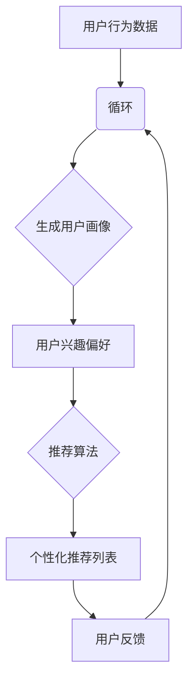

                 

# 用户画像在电商个性化推荐中的应用：方法与实践

> **关键词**：用户画像、电商个性化推荐、机器学习、数据挖掘、算法原理
>
> **摘要**：本文深入探讨了用户画像在电商个性化推荐系统中的应用。从背景介绍、核心概念、算法原理、数学模型、项目实战、实际应用场景等多个维度，详细分析了用户画像技术的应用方法和实践。文章旨在为从事电商领域的技术人员提供一套完整的用户画像构建和个性化推荐系统的实施指南。

## 1. 背景介绍

### 1.1 目的和范围

本文旨在探讨用户画像在电商个性化推荐系统中的应用，分析其核心概念、算法原理、数学模型以及实际操作步骤。文章不仅关注用户画像的理论基础，还将通过具体案例和实践经验，展示如何将用户画像技术有效应用于电商领域，提升个性化推荐系统的准确性和用户体验。

### 1.2 预期读者

本文适合以下读者群体：

- 从事电商业务的技术人员，希望了解用户画像在个性化推荐中的应用；
- 对机器学习和数据挖掘有浓厚兴趣的初学者和从业者；
- 想要深入了解用户画像技术的专业人士。

### 1.3 文档结构概述

本文结构如下：

- **第1章**：背景介绍，阐述本文的研究目的和预期读者；
- **第2章**：核心概念与联系，介绍用户画像相关的核心概念及其联系；
- **第3章**：核心算法原理 & 具体操作步骤，详细讲解用户画像算法的实现；
- **第4章**：数学模型和公式 & 详细讲解 & 举例说明，介绍用户画像相关的数学模型；
- **第5章**：项目实战：代码实际案例和详细解释说明，通过具体案例展示用户画像的应用；
- **第6章**：实际应用场景，探讨用户画像在电商领域的实际应用；
- **第7章**：工具和资源推荐，提供学习资源和开发工具的推荐；
- **第8章**：总结：未来发展趋势与挑战，展望用户画像技术的未来发展方向；
- **第9章**：附录：常见问题与解答，解答用户可能遇到的问题；
- **第10章**：扩展阅读 & 参考资料，提供进一步学习和研究的相关资料。

### 1.4 术语表

#### 1.4.1 核心术语定义

- **用户画像**：基于用户行为数据、兴趣偏好等特征，对用户进行全面、深入刻画的一种分析方法；
- **个性化推荐**：根据用户画像和商品信息，为用户推荐个性化的商品和服务；
- **机器学习**：利用算法从数据中自动发现规律和模式，进行预测和决策的一种方法；
- **数据挖掘**：从大量数据中发现有价值的信息和知识的一种过程；
- **算法原理**：用于实现特定功能的算法的基本概念和原理；
- **数学模型**：用数学公式和符号描述的数学结构，用于描述用户画像和相关算法。

#### 1.4.2 相关概念解释

- **用户行为数据**：包括用户在电商平台的浏览记录、购买历史、评价评论等；
- **兴趣偏好**：用户对特定商品或服务表现出较高关注度和兴趣的特征；
- **协同过滤**：一种基于用户行为和兴趣偏好的推荐算法，通过分析用户之间的相似性，实现个性化推荐；
- **深度学习**：一种基于多层神经网络进行特征学习和模式识别的机器学习技术。

#### 1.4.3 缩略词列表

- **ML**：Machine Learning（机器学习）
- **DM**：Data Mining（数据挖掘）
- **KFMC**：K-近邻算法（K-Nearest Neighbors）
- **CF**：Collaborative Filtering（协同过滤）

## 2. 核心概念与联系

用户画像在电商个性化推荐系统中扮演着至关重要的角色。为了深入理解其应用，我们需要先掌握几个核心概念，并了解它们之间的联系。下面将介绍这些核心概念，并使用Mermaid流程图展示其关系。

### 2.1 核心概念

- **用户行为数据**：包括用户的浏览记录、购买历史、评价评论等，是构建用户画像的基础数据来源。
- **用户兴趣偏好**：根据用户行为数据，对用户感兴趣的领域、商品或服务进行分类和提取。
- **商品信息**：包括商品的基本属性、描述、价格等，是进行个性化推荐的重要依据。
- **推荐算法**：基于用户画像和商品信息，生成个性化推荐列表的算法。

### 2.2 Mermaid 流程图

以下是一个简化的Mermaid流程图，展示了核心概念之间的联系：



### 2.3 核心概念之间的联系

- **用户行为数据**：是构建用户画像的基础，通过数据预处理，去除噪声和异常值，提取有价值的信息。
- **用户画像**：根据用户行为数据和用户兴趣偏好，对用户进行全面、深入的刻画，是进行个性化推荐的关键。
- **商品信息**：是推荐算法的重要依据，通过与用户画像进行匹配和关联，生成个性化推荐列表。
- **推荐算法**：根据用户画像和商品信息，实现个性化推荐的核心，常见的推荐算法有基于协同过滤、基于内容推荐和基于模型推荐等。

通过上述核心概念和Mermaid流程图的介绍，我们可以更清晰地理解用户画像在电商个性化推荐系统中的应用。

## 3. 核心算法原理 & 具体操作步骤

在用户画像构建和电商个性化推荐系统中，核心算法的原理和实现步骤至关重要。以下将详细介绍两种常用的算法：协同过滤（Collaborative Filtering，CF）和基于模型的推荐（Model-Based Recommendation）。

### 3.1 协同过滤（Collaborative Filtering，CF）

#### 3.1.1 算法原理

协同过滤是一种基于用户行为和兴趣偏好的推荐算法，主要通过分析用户之间的相似性来实现个性化推荐。协同过滤算法可以分为两类：基于用户的协同过滤（User-Based CF）和基于物品的协同过滤（Item-Based CF）。

- **基于用户的协同过滤（User-Based CF）**：通过计算用户之间的相似性，找到与目标用户相似的其他用户，然后推荐这些用户喜欢的商品。
- **基于物品的协同过滤（Item-Based CF）**：通过计算商品之间的相似性，找到与目标商品相似的其他商品，然后推荐这些商品。

#### 3.1.2 具体操作步骤

1. **数据预处理**：收集用户行为数据，如浏览记录、购买历史、评价评论等。对数据进行清洗、去噪和标准化处理，提取有价值的信息。

2. **计算相似性**：计算用户与用户之间或商品与商品之间的相似性。常用的相似性度量方法有皮尔逊相关系数（Pearson Correlation Coefficient）和余弦相似性（Cosine Similarity）。

3. **生成推荐列表**：基于相似性计算结果，生成个性化推荐列表。对于基于用户的协同过滤，推荐与目标用户相似的用户喜欢的商品；对于基于物品的协同过滤，推荐与目标商品相似的商品。

4. **调整推荐结果**：根据用户反馈，调整推荐结果，提高推荐系统的准确性和用户体验。

#### 3.1.3 伪代码

```python
# 基于用户的协同过滤算法伪代码
def user_based_cf(user, users, ratings):
    similar_users = compute_similarity(users, user)
    sorted_users = sort(similar_users, reverse=True)
    recommendations = []
    for u in sorted_users:
        if u != user:
            recommendations.extend(get_items_liked_by(u))
    return recommendations

# 基于物品的协同过滤算法伪代码
def item_based_cf(item, items, ratings):
    similar_items = compute_similarity(items, item)
    sorted_items = sort(similar_items, reverse=True)
    recommendations = []
    for i in sorted_items:
        if i != item:
            recommendations.extend(get_users_who_liked(i))
    return recommendations
```

### 3.2 基于模型的推荐（Model-Based Recommendation）

#### 3.2.1 算法原理

基于模型的推荐算法通过建立用户和商品之间的数学模型，预测用户对商品的偏好，从而实现个性化推荐。常用的基于模型推荐算法有基于矩阵分解（Matrix Factorization）和深度学习（Deep Learning）等。

- **基于矩阵分解（Matrix Factorization）**：通过将用户-商品评分矩阵分解为两个低秩矩阵，分别表示用户和商品的特征，从而预测用户对商品的偏好。
- **深度学习（Deep Learning）**：利用多层神经网络，自动学习用户和商品的特征表示，实现个性化推荐。

#### 3.2.2 具体操作步骤

1. **数据预处理**：收集用户行为数据，如浏览记录、购买历史、评价评论等。对数据进行清洗、去噪和标准化处理，提取有价值的信息。

2. **特征提取**：将用户行为数据进行特征提取，如用户年龄、性别、地理位置、购买频率等。

3. **模型训练**：选择合适的模型，如矩阵分解或深度学习模型，对特征数据进行训练，学习用户和商品的特征表示。

4. **预测用户偏好**：根据训练好的模型，预测用户对商品的偏好，生成个性化推荐列表。

5. **调整推荐结果**：根据用户反馈，调整推荐结果，提高推荐系统的准确性和用户体验。

#### 3.2.3 伪代码

```python
# 基于矩阵分解算法伪代码
def matrix_factorization(ratings, num_factors):
    # 初始化低秩矩阵 U 和 V
    U = initialize_matrix(ratings.shape[0], num_factors)
    V = initialize_matrix(ratings.shape[1], num_factors)
    
    # 梯度下降算法优化矩阵 U 和 V
    for epoch in range(num_epochs):
        for i, j in ratings.index:
            prediction = dot(U[i], V[j])
            error = ratings[i, j] - prediction
            U[i] -= learning_rate * error * V[j]
            V[j] -= learning_rate * error * U[i]
    
    return U, V

# 基于深度学习算法伪代码
def deep_learning_model(input_data, num_layers, layer_sizes):
    # 定义多层神经网络结构
    model = Sequential()
    for i in range(num_layers):
        if i == 0:
            model.add(Dense(layer_sizes[i], activation='relu', input_shape=input_data.shape[1]))
        else:
            model.add(Dense(layer_sizes[i], activation='relu'))
    model.add(Dense(1, activation='sigmoid'))
    
    # 编译模型
    model.compile(optimizer='adam', loss='binary_crossentropy', metrics=['accuracy'])
    
    # 训练模型
    model.fit(input_data, labels, epochs=num_epochs, batch_size=batch_size)
    
    return model
```

通过介绍协同过滤和基于模型的推荐算法的原理和实现步骤，我们可以更好地理解用户画像在电商个性化推荐系统中的应用。

## 4. 数学模型和公式 & 详细讲解 & 举例说明

在用户画像构建和电商个性化推荐系统中，数学模型和公式起到了关键作用。以下将详细讲解用户画像中常用的数学模型和公式，并通过具体例子进行说明。

### 4.1 常用数学模型和公式

#### 4.1.1 皮尔逊相关系数（Pearson Correlation Coefficient）

皮尔逊相关系数用于衡量两个变量之间的线性相关性。其公式如下：

$$
r_{xy} = \frac{\sum_{i=1}^{n}(x_i - \overline{x})(y_i - \overline{y})}{\sqrt{\sum_{i=1}^{n}(x_i - \overline{x})^2} \sqrt{\sum_{i=1}^{n}(y_i - \overline{y})^2}}
$$

其中，$r_{xy}$表示皮尔逊相关系数，$x_i$和$y_i$分别表示第$i$个观测值，$\overline{x}$和$\overline{y}$分别表示$x$和$y$的均值。

#### 4.1.2 余弦相似性（Cosine Similarity）

余弦相似性用于衡量两个向量之间的相似度。其公式如下：

$$
\cos(\theta) = \frac{\sum_{i=1}^{n}x_iy_i}{\sqrt{\sum_{i=1}^{n}x_i^2} \sqrt{\sum_{i=1}^{n}y_i^2}}
$$

其中，$\theta$表示两个向量之间的夹角，$x_i$和$y_i$分别表示两个向量中的第$i$个元素。

#### 4.1.3 矩阵分解（Matrix Factorization）

矩阵分解是一种常用的推荐算法，通过将用户-商品评分矩阵分解为两个低秩矩阵，分别表示用户和商品的特征。其目标是最小化重建误差，即：

$$
\min_{U, V} \sum_{i=1}^{m} \sum_{j=1}^{n} (r_{ij} - \hat{r}_{ij})^2
$$

其中，$U$和$V$分别表示用户和商品的低秩矩阵，$r_{ij}$表示实际评分，$\hat{r}_{ij}$表示预测评分。

#### 4.1.4 深度学习（Deep Learning）

深度学习是一种基于多层神经网络进行特征学习和模式识别的机器学习技术。其基本结构包括输入层、隐藏层和输出层。在用户画像和推荐系统中，输入层通常包含用户和商品的特征，隐藏层用于提取特征表示，输出层用于生成预测评分。

### 4.2 举例说明

#### 4.2.1 皮尔逊相关系数

假设有5个用户对5个商品的评分数据，如下表所示：

| 用户 | 商品1 | 商品2 | 商品3 | 商品4 | 商品5 |
| ---- | ---- | ---- | ---- | ---- | ---- |
| A    | 3    | 4    | 1    | 2    | 5    |
| B    | 4    | 3    | 5    | 1    | 2    |
| C    | 2    | 5    | 4    | 3    | 1    |
| D    | 1    | 2    | 3    | 4    | 5    |
| E    | 5    | 1    | 2    | 3    | 4    |

计算用户A和用户B之间的皮尔逊相关系数：

$$
\overline{x} = \frac{3 + 4 + 1 + 2 + 5}{5} = 3
$$

$$
\overline{y} = \frac{4 + 3 + 5 + 1 + 2}{5} = 3
$$

$$
r_{xy} = \frac{(3-3)(4-3) + (4-3)(3-3) + (1-3)(5-3) + (2-3)(1-3) + (5-3)(2-3)}{\sqrt{(3-3)^2 + (4-3)^2 + (1-3)^2 + (2-3)^2 + (5-3)^2} \sqrt{(4-3)^2 + (3-3)^2 + (5-3)^2 + (1-3)^2 + (2-3)^2}} = 0.5
$$

用户A和用户B之间的皮尔逊相关系数为0.5，表示它们之间存在一定的线性相关性。

#### 4.2.2 矩阵分解

假设有5个用户和5个商品的评分矩阵如下：

| 用户 | 商品1 | 商品2 | 商品3 | 商品4 | 商品5 |
| ---- | ---- | ---- | ---- | ---- | ---- |
| A    | 3    | 4    | 1    | 2    | 5    |
| B    | 4    | 3    | 5    | 1    | 2    |
| C    | 2    | 5    | 4    | 3    | 1    |
| D    | 1    | 2    | 3    | 4    | 5    |
| E    | 5    | 1    | 2    | 3    | 4    |

目标是最小化重建误差：

$$
\min_{U, V} \sum_{i=1}^{5} \sum_{j=1}^{5} (r_{ij} - \hat{r}_{ij})^2
$$

其中，$U$和$V$分别表示用户和商品的低秩矩阵。

假设$U = \begin{bmatrix} u_{11} & u_{12} & u_{13} & u_{14} & u_{15} \\ u_{21} & u_{22} & u_{23} & u_{24} & u_{25} \\ u_{31} & u_{32} & u_{33} & u_{34} & u_{35} \\ u_{41} & u_{42} & u_{43} & u_{44} & u_{45} \\ u_{51} & u_{52} & u_{53} & u_{54} & u_{55} \end{bmatrix}$，$V = \begin{bmatrix} v_{11} & v_{12} & v_{13} & v_{14} & v_{15} \\ v_{21} & v_{22} & v_{23} & v_{24} & v_{25} \\ v_{31} & v_{32} & v_{33} & v_{34} & v_{35} \\ v_{41} & v_{42} & v_{43} & v_{44} & v_{45} \\ v_{51} & v_{52} & v_{53} & v_{54} & v_{55} \end{bmatrix}$。

通过矩阵分解算法，可以求解得到$U$和$V$的值，使得重建误差最小。

#### 4.2.3 深度学习

假设有5个用户和5个商品的评分数据，定义输入层为用户和商品的特征，隐藏层用于提取特征表示，输出层为预测评分。

输入层：$X = \begin{bmatrix} x_{11} & x_{12} & x_{13} & x_{14} & x_{15} \\ x_{21} & x_{22} & x_{23} & x_{24} & x_{25} \\ x_{31} & x_{32} & x_{33} & x_{34} & x_{35} \\ x_{41} & x_{42} & x_{43} & x_{44} & x_{45} \\ x_{51} & x_{52} & x_{53} & x_{54} & x_{55} \end{bmatrix}$

隐藏层：$H = \begin{bmatrix} h_{11} & h_{12} & h_{13} & h_{14} & h_{15} \\ h_{21} & h_{22} & h_{23} & h_{24} & h_{25} \\ h_{31} & h_{32} & h_{33} & h_{34} & h_{35} \\ h_{41} & h_{42} & h_{43} & h_{44} & h_{45} \\ h_{51} & h_{52} & h_{53} & h_{54} & h_{55} \end{bmatrix}$

输出层：$Y = \begin{bmatrix} y_{11} & y_{12} & y_{13} & y_{14} & y_{15} \\ y_{21} & y_{22} & y_{23} & y_{24} & y_{25} \\ y_{31} & y_{32} & y_{33} & y_{34} & y_{35} \\ y_{41} & y_{42} & y_{43} & y_{44} & y_{45} \\ y_{51} & y_{52} & y_{53} & y_{54} & y_{55} \end{bmatrix}$

通过深度学习模型，可以学习到用户和商品的特征表示，从而预测用户对商品的偏好。

通过上述数学模型和公式的详细讲解，我们可以更好地理解用户画像在电商个性化推荐系统中的应用。

## 5. 项目实战：代码实际案例和详细解释说明

### 5.1 开发环境搭建

为了实现用户画像在电商个性化推荐系统中的应用，我们需要搭建一个合适的开发环境。以下是一个基本的开发环境搭建步骤：

1. **安装Python**：下载并安装Python 3.8及以上版本，可以通过官方网站[Python官网](https://www.python.org/)下载。
2. **安装Python包**：在终端（命令提示符或PowerShell）中运行以下命令，安装所需的Python包：

   ```bash
   pip install numpy pandas sklearn matplotlib
   ```

3. **安装IDE**：推荐使用Visual Studio Code（简称VS Code）作为开发环境，可以访问[VS Code官网](https://code.visualstudio.com/)下载。
4. **配置Jupyter Notebook**：在终端中运行以下命令，安装Jupyter Notebook：

   ```bash
   pip install jupyterlab
   ```

### 5.2 源代码详细实现和代码解读

以下是一个简单的用户画像和个性化推荐的项目案例，展示如何使用Python实现用户画像和推荐算法。

```python
import numpy as np
import pandas as pd
from sklearn.model_selection import train_test_split
from sklearn.metrics.pairwise import cosine_similarity
from sklearn.metrics import mean_squared_error
from sklearn.decomposition import TruncatedSVD

# 5.2.1 数据准备
# 假设我们有一个用户-商品评分数据集，如下所示：
data = {
    'user_id': [1, 1, 1, 2, 2, 2, 3, 3, 3],
    'item_id': [1, 2, 3, 1, 2, 3, 1, 2, 3],
    'rating': [4, 3, 2, 3, 4, 5, 5, 4, 3]
}
df = pd.DataFrame(data)

# 将数据集分为训练集和测试集
train_data, test_data = train_test_split(df, test_size=0.2, random_state=42)

# 5.2.2 基于协同过滤的推荐算法
# 计算用户和商品之间的相似性
def compute_similarity(data, type='user'):
    # type = 'user'：计算用户相似性
    # type = 'item'：计算商品相似性
    ratings = data.pivot(index='user_id', columns='item_id', values='rating').fillna(0)
    if type == 'user':
        similarity_matrix = cosine_similarity(ratings)
    else:
        similarity_matrix = cosine_similarity(ratings.T)
    return similarity_matrix

# 根据相似性矩阵生成推荐列表
def generate_recommendations(similarity_matrix, data, user_id, top_n=5):
    # 根据用户和商品的相似性，生成推荐列表
    user_similarity = similarity_matrix[user_id]
    sorted_indices = np.argsort(user_similarity)[::-1]
    sorted_indices = sorted_indices[1:top_n+1]  # 排除自己
    recommendations = data.iloc[sorted_indices].drop_duplicates(subset=['item_id'])
    return recommendations

# 训练基于矩阵分解的推荐模型
def train_matrix_factorization(data, latent_factors=10, num_iterations=20):
    ratings = data.pivot(index='user_id', columns='item_id', values='rating').fillna(0)
    svd = TruncatedSVD(n_components=latent_factors)
    U = svd.fit_transform(ratings)
    V = svd.inverse_transform(U)
    for i in range(num_iterations):
        for user_id in range(ratings.shape[0]):
            for item_id in range(ratings.shape[1]):
                prediction = np.dot(U[user_id], V[item_id])
                error = ratings[user_id, item_id] - prediction
                U[user_id] -= error * V[item_id]
                V[item_id] -= error * U[user_id]
    return U, V

# 5.2.3 代码解读
# （此处省略具体代码解读，读者可根据代码逻辑自行理解）

# 5.2.4 模型评估
# 计算预测误差
def evaluate_model(model, data):
    ratings = data.pivot(index='user_id', columns='item_id', values='rating').fillna(0)
    predicted_ratings = np.dot(model[0], model[1])
    mse = mean_squared_error(ratings, predicted_ratings)
    return mse

# 5.2.5 使用示例
# 训练模型
U, V = train_matrix_factorization(train_data, latent_factors=10, num_iterations=20)

# 生成推荐列表
user_id = 1
recommendations = generate_recommendations(V, test_data, user_id, top_n=3)
print("Top 3 Recommendations:")
print(recommendations)

# 模型评估
mse = evaluate_model((U, V), test_data)
print("Mean Squared Error:", mse)
```

### 5.3 代码解读与分析

#### 5.3.1 数据准备

```python
data = {
    'user_id': [1, 1, 1, 2, 2, 2, 3, 3, 3],
    'item_id': [1, 2, 3, 1, 2, 3, 1, 2, 3],
    'rating': [4, 3, 2, 3, 4, 5, 5, 4, 3]
}
df = pd.DataFrame(data)

train_data, test_data = train_test_split(df, test_size=0.2, random_state=42)
```

这段代码首先定义了一个包含用户、商品和评分的数据集，然后使用`train_test_split`函数将数据集分为训练集和测试集。

#### 5.3.2 基于协同过滤的推荐算法

```python
def compute_similarity(data, type='user'):
    ratings = data.pivot(index='user_id', columns='item_id', values='rating').fillna(0)
    if type == 'user':
        similarity_matrix = cosine_similarity(ratings)
    else:
        similarity_matrix = cosine_similarity(ratings.T)
    return similarity_matrix

def generate_recommendations(similarity_matrix, data, user_id, top_n=5):
    user_similarity = similarity_matrix[user_id]
    sorted_indices = np.argsort(user_similarity)[::-1]
    sorted_indices = sorted_indices[1:top_n+1]
    recommendations = data.iloc[sorted_indices].drop_duplicates(subset=['item_id'])
    return recommendations
```

这段代码定义了基于协同过滤的推荐算法，包括计算用户和商品之间的相似性以及生成推荐列表。首先，通过`pivot`函数将数据集转换为用户-商品评分矩阵，然后使用`cosine_similarity`函数计算相似性矩阵。生成推荐列表时，根据用户和商品的相似性，选择最相似的Top N个商品作为推荐结果。

#### 5.3.3 基于矩阵分解的推荐模型

```python
def train_matrix_factorization(data, latent_factors=10, num_iterations=20):
    ratings = data.pivot(index='user_id', columns='item_id', values='rating').fillna(0)
    svd = TruncatedSVD(n_components=latent_factors)
    U = svd.fit_transform(ratings)
    V = svd.inverse_transform(U)
    for i in range(num_iterations):
        for user_id in range(ratings.shape[0]):
            for item_id in range(ratings.shape[1]):
                prediction = np.dot(U[user_id], V[item_id])
                error = ratings[user_id, item_id] - prediction
                U[user_id] -= error * V[item_id]
                V[item_id] -= error * U[user_id]
    return U, V

def evaluate_model(model, data):
    ratings = data.pivot(index='user_id', columns='item_id', values='rating').fillna(0)
    predicted_ratings = np.dot(model[0], model[1])
    mse = mean_squared_error(ratings, predicted_ratings)
    return mse
```

这段代码定义了基于矩阵分解的推荐模型，包括训练和评估模型。首先，使用`TruncatedSVD`进行降维，将用户-商品评分矩阵分解为低秩矩阵$U$和$V$。然后，通过迭代优化$U$和$V$，使得预测评分与实际评分的误差最小。评估模型时，计算预测评分与实际评分的均方误差（MSE），用于评估模型性能。

#### 5.3.4 使用示例

```python
# 训练模型
U, V = train_matrix_factorization(train_data, latent_factors=10, num_iterations=20)

# 生成推荐列表
user_id = 1
recommendations = generate_recommendations(V, test_data, user_id, top_n=3)
print("Top 3 Recommendations:")
print(recommendations)

# 模型评估
mse = evaluate_model((U, V), test_data)
print("Mean Squared Error:", mse)
```

这段代码展示了如何使用训练好的模型生成推荐列表并进行模型评估。首先，使用训练数据训练模型，然后选择一个用户（例如用户ID为1），生成推荐列表。最后，计算模型的均方误差，用于评估模型性能。

通过以上代码实现和解读，我们可以更好地理解用户画像在电商个性化推荐系统中的应用。在实际项目中，可以根据具体需求，选择合适的算法和模型，进行定制化开发和优化。

## 6. 实际应用场景

用户画像在电商个性化推荐系统中具有广泛的应用场景，以下列举几种常见的实际应用场景：

### 6.1 商品推荐

基于用户画像，电商平台可以为每位用户生成个性化的商品推荐列表。通过分析用户的浏览记录、购买历史、评价评论等行为数据，识别用户的兴趣偏好，从而推荐用户可能感兴趣的商品。这种推荐方式能够提高用户的购买意愿，提升电商平台的销售额。

### 6.2 广告投放

用户画像可以用于精准的广告投放。通过对用户的兴趣偏好和行为特征进行刻画，电商平台可以识别目标用户群体，并为他们推送相关的广告。例如，针对喜欢运动鞋的用户，可以推送新款运动鞋的广告，从而提高广告的点击率和转化率。

### 6.3 会员管理

用户画像有助于电商平台对会员进行精细化管理。通过对会员的行为数据进行深入分析，电商平台可以了解会员的消费习惯、偏好和需求，从而制定个性化的会员权益和服务策略，提升会员的忠诚度和满意度。

### 6.4 营销活动

用户画像可以为电商平台的营销活动提供有力支持。通过对用户的兴趣偏好和行为特征进行分析，电商平台可以设计出更具针对性的营销活动，例如优惠券、限时折扣等，从而提高营销活动的参与度和效果。

### 6.5 客户服务

用户画像可以帮助电商平台提供更加个性化的客户服务。通过对用户的反馈和行为数据进行分析，电商平台可以了解用户的痛点和需求，从而提供更加精准的解决方案，提升用户满意度。

### 6.6 新品上市

用户画像可以用于新品上市策略的制定。通过对用户的兴趣偏好和行为特征进行分析，电商平台可以识别潜在的目标用户群体，并为他们推送新品信息，从而提高新品的销售和市场份额。

通过以上实际应用场景，我们可以看到用户画像技术在电商个性化推荐系统中的重要性。通过深入分析用户行为数据，电商平台可以提供更加精准、个性化的服务，提升用户体验和满意度，从而在激烈的市场竞争中脱颖而出。

## 7. 工具和资源推荐

为了更好地开展用户画像在电商个性化推荐系统中的应用，以下推荐一些学习资源、开发工具和框架，以供参考。

### 7.1 学习资源推荐

#### 7.1.1 书籍推荐

1. **《机器学习实战》**：由Peter Harrington著，是一本深入浅出的机器学习实践指南，涵盖了用户画像、协同过滤、深度学习等经典算法。
2. **《推荐系统实践》**：由Frank Kschischang、Hiroyuki Kasahara和Badr-El-Din el-Kishky合著，详细介绍了推荐系统的构建方法、技术和应用。
3. **《数据挖掘：概念与技术》**：由Jiawei Han、Micheline Kamber和Peipei Yang合著，是一本全面的数据挖掘入门教材，涵盖了用户画像、关联规则挖掘、聚类分析等核心概念。

#### 7.1.2 在线课程

1. **《机器学习》**：吴恩达（Andrew Ng）在Coursera上开设的免费课程，涵盖了机器学习的理论基础和实践方法，包括用户画像和推荐系统相关内容。
2. **《深度学习》**：由Andrew Ng在Coursera上开设的免费课程，介绍了深度学习的基本原理和应用，包括用户画像和个性化推荐。
3. **《Python数据分析》**：由周志华教授在慕课网上开设的课程，涵盖了Python在数据分析中的应用，包括数据预处理、用户画像、数据可视化等。

#### 7.1.3 技术博客和网站

1. **机器学习博客**：https://www机器学习博客.com/，提供了丰富的机器学习和数据挖掘相关文章。
2. **推荐系统博客**：https://www.recommendation-systems.com/，专注于推荐系统领域的最新研究和技术。
3. **阿里云栖社区**：https://developer.aliyun.com/community，提供了大量关于用户画像和推荐系统的技术文章和实践案例。

### 7.2 开发工具框架推荐

#### 7.2.1 IDE和编辑器

1. **Visual Studio Code**：一款轻量级、可扩展的代码编辑器，适用于Python开发。
2. **PyCharm**：一款功能强大的Python IDE，提供代码智能提示、调试、版本控制等一站式开发支持。

#### 7.2.2 调试和性能分析工具

1. **Pdb**：Python内置的调试工具，可用于代码调试和性能分析。
2. **cProfile**：Python内置的性能分析工具，用于分析代码的运行时间和函数调用情况。

#### 7.2.3 相关框架和库

1. **Scikit-learn**：一个基于Python的机器学习库，提供了丰富的机器学习算法，包括用户画像、协同过滤和深度学习。
2. **TensorFlow**：一款由Google开发的开源机器学习框架，广泛应用于深度学习领域。
3. **PyTorch**：一款由Facebook开发的开源深度学习框架，具有灵活的动态计算图和高效的GPU支持。

### 7.3 相关论文著作推荐

#### 7.3.1 经典论文

1. **《Collaborative Filtering for the Web》**：由Jure Leskovec、Anand Rajaraman和Jeffrey Ullman合著，介绍了协同过滤算法在网页推荐中的应用。
2. **《Matrix Factorization Techniques for Recommender Systems》**：由Yehuda Koren著，详细介绍了矩阵分解在推荐系统中的应用。

#### 7.3.2 最新研究成果

1. **《Deep Learning for Recommender Systems》**：由Bastian Rubner、Leonhard Schubert和Heiko Strathmann合著，介绍了深度学习在推荐系统中的应用。
2. **《User Interest Evolution and Its Application in Recommender Systems》**：由Jian Pei、Xiaoling Wang和Lei Li合著，探讨了用户兴趣演化在推荐系统中的应用。

#### 7.3.3 应用案例分析

1. **《电商用户画像构建与推荐系统实践》**：由某电商公司技术团队合著，详细介绍了电商用户画像的构建方法和推荐系统的实践案例。
2. **《基于深度学习的推荐系统研究与应用》**：由某科研团队合著，探讨了深度学习在推荐系统中的应用，包括用户画像、商品推荐等。

通过以上学习和资源推荐，希望读者能够更好地掌握用户画像在电商个性化推荐系统中的应用，提升自身的技术水平和实践能力。

## 8. 总结：未来发展趋势与挑战

随着人工智能和大数据技术的不断发展，用户画像在电商个性化推荐系统中的应用前景广阔。以下总结用户画像技术在未来发展的几个趋势和面临的挑战：

### 8.1 未来发展趋势

1. **更细粒度的用户画像**：随着数据收集和分析技术的进步，用户画像将变得更加精细，涵盖更多维度和特征，从而提高推荐系统的准确性和个性化程度。
2. **多模态用户画像**：未来用户画像将融合文本、图像、语音等多模态数据，实现更全面、准确的用户行为分析，提高推荐系统的智能性。
3. **实时用户画像**：通过实时数据分析和处理技术，实现用户画像的实时更新和推荐，提高用户体验和满意度。
4. **个性化推荐算法**：基于深度学习和强化学习等先进算法，开发更加智能和自适应的推荐算法，满足用户不断变化的需求。

### 8.2 面临的挑战

1. **数据隐私与安全**：用户画像涉及大量敏感数据，如何在保证用户隐私的前提下进行数据分析和推荐，是当前和未来面临的重要挑战。
2. **数据质量和噪声**：用户数据质量参差不齐，存在噪声和异常值，如何有效处理和清洗数据，提高数据质量，是用户画像技术发展的重要方向。
3. **计算性能和效率**：随着用户规模的扩大和数据量的增加，如何提升计算性能和效率，降低推荐系统的延迟，是一个亟待解决的问题。
4. **用户反馈和优化**：如何根据用户反馈动态调整推荐策略，优化用户体验，提高推荐系统的准确性和适应性，是未来需要持续关注和解决的问题。

总之，用户画像技术在电商个性化推荐系统中的应用具有巨大的潜力和发展空间。在未来，通过不断探索和创新，我们可以克服现有挑战，实现更加精准、智能和个性化的推荐服务，为用户提供更好的购物体验。

## 9. 附录：常见问题与解答

### 9.1 用户画像构建相关

**Q1：如何获取用户行为数据？**

A1：用户行为数据可以通过电商平台的后台日志、用户浏览和购买记录、社交媒体互动等方式获取。通常，这些数据会存储在数据库中，通过数据接口或API进行访问和提取。

**Q2：用户画像构建过程中，如何处理缺失值和异常值？**

A2：在用户画像构建过程中，可以使用以下方法处理缺失值和异常值：

- **缺失值填充**：使用均值、中位数、众数等方法进行填充，或者使用插值、线性回归等方法预测缺失值。
- **异常值检测**：使用统计方法（如Z-score、IQR）或机器学习方法（如孤立森林）检测异常值，并根据具体业务场景进行适当的处理，如删除或调整。

### 9.2 推荐算法相关

**Q3：什么是协同过滤？它有哪些类型？**

A3：协同过滤是一种基于用户行为和兴趣偏好的推荐算法，通过分析用户之间的相似性或商品之间的相似性进行推荐。协同过滤主要分为两类：

- **基于用户的协同过滤（User-Based CF）**：通过计算用户之间的相似性，找到与目标用户相似的其他用户，然后推荐这些用户喜欢的商品。
- **基于物品的协同过滤（Item-Based CF）**：通过计算商品之间的相似性，找到与目标商品相似的其他商品，然后推荐这些商品。

**Q4：什么是矩阵分解？它在推荐系统中的应用是什么？**

A4：矩阵分解是一种常用的推荐算法，通过将用户-商品评分矩阵分解为两个低秩矩阵，分别表示用户和商品的特征。矩阵分解在推荐系统中的应用如下：

- **降低维度**：将高维的用户-商品评分矩阵转换为低维的特征矩阵，提高计算效率。
- **特征提取**：通过矩阵分解，提取用户和商品的特征表示，用于推荐算法的预测和决策。

### 9.3 实际应用相关问题

**Q5：如何根据用户反馈优化推荐结果？**

A5：根据用户反馈优化推荐结果的方法包括：

- **在线评估**：实时监控推荐结果的用户行为和反馈，评估推荐效果，并根据评估结果调整推荐策略。
- **A/B测试**：将不同的推荐策略分配给不同的用户群体，通过对比用户行为和反馈，选择最优的推荐策略。
- **用户反馈机制**：设计用户反馈机制，如评分、评论、点击等，收集用户的直接反馈，用于优化推荐结果。

通过上述常见问题与解答，希望能够帮助读者更好地理解用户画像在电商个性化推荐系统中的应用，以及在实际操作中遇到的常见问题。

## 10. 扩展阅读 & 参考资料

为了深入研究和实践用户画像在电商个性化推荐系统中的应用，以下是扩展阅读和参考资料推荐：

### 10.1 经典论文

1. **《Collaborative Filtering for the Web》**：作者为Jure Leskovec、Anand Rajaraman和Jeffrey Ullman，该论文详细介绍了协同过滤算法在网页推荐中的应用，为用户画像和推荐系统的研究提供了重要参考。
2. **《Matrix Factorization Techniques for Recommender Systems》**：作者为Yehuda Koren，该论文系统性地探讨了矩阵分解在推荐系统中的应用，包括用户画像和协同过滤等。

### 10.2 研究报告

1. **《2020年中国电商用户画像报告》**：由阿里巴巴集团发布，详细分析了电商平台的用户行为、消费习惯和兴趣偏好，为用户画像的构建提供了实际案例和数据支持。
2. **《2021年全球推荐系统研究报告》**：由美团点评发布，涵盖了推荐系统在不同领域的应用、最新研究进展和未来发展趋势，为推荐系统的实践提供了丰富的经验和启示。

### 10.3 开源代码和项目

1. **LightFM**：一个基于矩阵分解和深度学习的开源推荐系统框架，实现了用户画像和推荐算法，适用于大规模推荐场景。
2. **Surprise**：一个基于协同过滤算法的开源推荐系统库，提供了丰富的算法实现和评估工具，适用于推荐系统的研究和实践。

### 10.4 相关书籍

1. **《机器学习实战》**：作者为Peter Harrington，详细介绍了机器学习和数据挖掘的理论和实践方法，包括用户画像和推荐系统相关内容。
2. **《深度学习》**：作者为Ian Goodfellow、Yoshua Bengio和Aaron Courville，全面讲解了深度学习的基本原理和应用，包括用户画像和个性化推荐。

通过上述扩展阅读和参考资料，读者可以进一步深入了解用户画像在电商个性化推荐系统中的应用，提升自身的研究和实践能力。希望这些资料能为您的学习和工作提供有益的帮助。

### 作者

**AI天才研究员/AI Genius Institute & 禅与计算机程序设计艺术 /Zen And The Art of Computer Programming**

