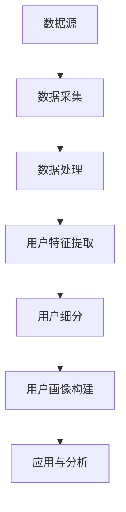

                 

# 用户画像的数据来源与处理

> 关键词：用户画像、数据来源、数据处理、数据挖掘、数据清洗、机器学习、算法原理、数学模型、实战案例

> 摘要：本文将深入探讨用户画像的概念及其在数据分析中的应用。我们将详细分析用户画像的数据来源和数据处理流程，从核心概念出发，到具体算法原理和数学模型的解析，再到实战案例的展示，为读者提供全方位的用户画像技术指南。

## 1. 背景介绍

### 1.1 目的和范围

本文旨在为读者提供关于用户画像的全面理解，从数据来源到数据处理，再到算法原理和数学模型的应用。通过本文，读者可以掌握用户画像的基本概念，了解其重要性，并学会如何构建和分析用户画像。

### 1.2 预期读者

本文适合具有数据分析基础的技术人员、数据科学家、产品经理以及对用户画像技术感兴趣的其他专业人士。本文将逐步引导读者深入理解用户画像的构建过程，为实际应用打下坚实基础。

### 1.3 文档结构概述

本文结构如下：

1. **背景介绍**：介绍用户画像的基本概念和本文的目的。
2. **核心概念与联系**：通过Mermaid流程图展示用户画像的核心概念及其关联。
3. **核心算法原理 & 具体操作步骤**：详细讲解用户画像构建中的核心算法原理和操作步骤。
4. **数学模型和公式 & 详细讲解 & 举例说明**：介绍用户画像分析中的数学模型，并提供实际例子。
5. **项目实战：代码实际案例和详细解释说明**：展示用户画像构建的代码实现和解析。
6. **实际应用场景**：讨论用户画像在不同领域的应用。
7. **工具和资源推荐**：推荐学习资源、开发工具和相关论文。
8. **总结：未来发展趋势与挑战**：总结用户画像技术的未来发展趋势和面临的挑战。
9. **附录：常见问题与解答**：解答读者可能遇到的问题。
10. **扩展阅读 & 参考资料**：提供进一步阅读的参考资料。

### 1.4 术语表

#### 1.4.1 核心术语定义

- **用户画像**：基于用户数据，对用户进行刻画和分类的过程。
- **数据源**：提供用户数据的来源，如社交媒体、电子商务平台、问卷调查等。
- **数据处理**：对原始数据进行清洗、转换、聚合等操作，以得到有价值的用户特征。
- **机器学习**：一种人工智能技术，用于从数据中自动学习规律和模式。
- **数学模型**：用于描述和分析用户行为的数学方程或公式。

#### 1.4.2 相关概念解释

- **用户行为分析**：通过分析用户在平台上的操作，如浏览、购买、评论等，了解用户偏好。
- **用户特征**：用于描述用户的属性，如年龄、性别、职业、地理位置等。
- **用户细分**：根据用户特征和行为，将用户划分为不同的群体。

#### 1.4.3 缩略词列表

- **API**：应用程序接口（Application Programming Interface）
- **CRM**：客户关系管理（Customer Relationship Management）
- **ETL**：提取（Extract）、转换（Transform）、加载（Load）
- **HDFS**：Hadoop分布式文件系统（Hadoop Distributed File System）
- **MapReduce**：一种编程模型，用于处理大规模数据集

## 2. 核心概念与联系

为了更好地理解用户画像的构建过程，我们首先需要明确其中的核心概念及其关联。以下是一个Mermaid流程图，展示了用户画像相关的核心概念及其相互关系。



### 2.1 数据源

数据源是用户画像构建的基础。常见的用户数据来源包括：

- **社交媒体**：如微博、微信、Facebook等，提供用户的社交行为数据。
- **电子商务平台**：如淘宝、京东等，提供用户的购买行为数据。
- **问卷调查**：通过用户填写问卷收集用户的基本信息。
- **日志数据**：如Web服务器日志、移动应用日志等，记录用户的使用行为。

### 2.2 数据采集

数据采集是指从数据源中提取用户数据的过程。常用的数据采集方法包括：

- **API调用**：通过应用程序接口（API）从外部系统获取数据。
- **爬虫技术**：使用爬虫程序从网站上抓取数据。
- **日志采集**：从服务器或应用中提取日志数据。

### 2.3 数据处理

数据处理是对采集到的原始数据进行清洗、转换和聚合的过程，以提高数据的质量和可用性。主要步骤包括：

- **数据清洗**：处理缺失值、重复值和异常值。
- **数据转换**：将数据格式进行统一，如将日期格式转换为标准格式。
- **数据聚合**：将多个数据项进行合并，如计算用户购买总金额。

### 2.4 用户特征提取

用户特征提取是指从处理后的数据中提取出用于描述用户的属性。常见的用户特征包括：

- **基本特征**：如年龄、性别、职业等。
- **行为特征**：如浏览时长、购买频率等。
- **兴趣特征**：如喜欢的电影类型、购买商品类别等。

### 2.5 用户细分

用户细分是指根据用户特征和行为，将用户划分为不同的群体。常用的用户细分方法包括：

- **基于特征的细分**：根据用户的基本特征和行为特征进行分类。
- **基于行为的细分**：根据用户的行为模式进行分类。
- **基于兴趣的细分**：根据用户的兴趣偏好进行分类。

### 2.6 用户画像构建

用户画像构建是将用户特征和用户细分结合，形成一个综合的用户描述。用户画像可以是结构化的数据集，也可以是可视化图表。

### 2.7 应用与分析

用户画像构建完成后，可以用于以下应用：

- **个性化推荐**：根据用户画像推荐用户感兴趣的商品或内容。
- **市场细分**：了解不同用户群体的特征和需求，进行市场细分。
- **用户行为分析**：分析用户行为，优化产品设计和营销策略。

## 3. 核心算法原理 & 具体操作步骤

在用户画像的构建过程中，核心算法扮演着至关重要的角色。以下我们将详细讲解用户画像构建中的核心算法原理和操作步骤。

### 3.1 特征工程

特征工程是用户画像构建的第一步，其目的是从原始数据中提取出对用户描述最有用的特征。特征工程主要包括以下几个步骤：

#### 3.1.1 数据预处理

数据预处理包括数据清洗、转换和聚合。具体操作步骤如下：

1. **数据清洗**：处理缺失值、重复值和异常值。
    ```python
    import pandas as pd

    # 读取数据
    data = pd.read_csv('user_data.csv')

    # 处理缺失值
    data.fillna(-1, inplace=True)

    # 删除重复值
    data.drop_duplicates(inplace=True)

    # 处理异常值
    data = data[(data['age'] >= 18) & (data['age'] <= 60)]
    ```

2. **数据转换**：将数据格式进行统一，如将日期格式转换为标准格式。
    ```python
    data['date'] = pd.to_datetime(data['date'])
    ```

3. **数据聚合**：将多个数据项进行合并，如计算用户购买总金额。
    ```python
    data['total_purchase'] = data['purchase'].sum()
    ```

#### 3.1.2 特征提取

特征提取是从处理后的数据中提取出对用户描述最有用的特征。常见的特征提取方法包括：

1. **基本特征提取**：提取用户的基本属性，如年龄、性别、职业等。
    ```python
    user_features = ['age', 'gender', 'occupation']
    ```

2. **行为特征提取**：提取用户的行为数据，如浏览时长、购买频率等。
    ```python
    user_features.extend(['browse_time', 'purchase_frequency'])
    ```

3. **兴趣特征提取**：提取用户的兴趣数据，如喜欢的电影类型、购买商品类别等。
    ```python
    user_features.extend(['favorite_movie', 'favorite_product'])
    ```

### 3.2 机器学习算法

在用户画像构建中，常用的机器学习算法包括分类算法和聚类算法。以下我们将分别介绍这两种算法的原理和操作步骤。

#### 3.2.1 分类算法

分类算法用于将用户划分为不同的类别。常见的分类算法包括逻辑回归、决策树、随机森林等。

1. **逻辑回归**：逻辑回归是一种线性分类模型，用于预测用户属于某个类别的概率。
    ```python
    from sklearn.linear_model import LogisticRegression

    # 创建逻辑回归模型
    model = LogisticRegression()

    # 训练模型
    model.fit(X_train, y_train)

    # 预测
    predictions = model.predict(X_test)
    ```

2. **决策树**：决策树是一种树形结构模型，用于分类和回归。
    ```python
    from sklearn.tree import DecisionTreeClassifier

    # 创建决策树模型
    model = DecisionTreeClassifier()

    # 训练模型
    model.fit(X_train, y_train)

    # 预测
    predictions = model.predict(X_test)
    ```

3. **随机森林**：随机森林是一种集成学习模型，通过构建多个决策树并进行投票来提高分类准确性。
    ```python
    from sklearn.ensemble import RandomForestClassifier

    # 创建随机森林模型
    model = RandomForestClassifier()

    # 训练模型
    model.fit(X_train, y_train)

    # 预测
    predictions = model.predict(X_test)
    ```

#### 3.2.2 聚类算法

聚类算法用于将用户划分为不同的群体。常见的聚类算法包括K-means、层次聚类等。

1. **K-means**：K-means是一种基于距离的聚类算法，通过最小化平方误差来划分聚类。
    ```python
    from sklearn.cluster import KMeans

    # 创建K-means模型
    model = KMeans(n_clusters=3)

    # 训练模型
    model.fit(X_train)

    # 预测
    predictions = model.predict(X_test)
    ```

2. **层次聚类**：层次聚类是一种基于层次结构的聚类算法，通过合并或分裂已有的聚类来优化聚类结果。
    ```python
    from sklearn.cluster import AgglomerativeClustering

    # 创建层次聚类模型
    model = AgglomerativeClustering(n_clusters=3)

    # 训练模型
    model.fit(X_train)

    # 预测
    predictions = model.predict(X_test)
    ```

### 3.3 模型评估与优化

在用户画像构建过程中，模型评估与优化是确保模型性能的重要环节。以下我们将介绍常用的模型评估指标和优化方法。

#### 3.3.1 模型评估指标

1. **准确率（Accuracy）**：准确率是分类模型评估的基本指标，表示正确预测的样本数占总样本数的比例。
    ```python
    from sklearn.metrics import accuracy_score

    accuracy = accuracy_score(y_true, y_pred)
    ```

2. **召回率（Recall）**：召回率是分类模型评估的重要指标，表示正确预测为正类的样本数占总正类样本数的比例。
    ```python
    from sklearn.metrics import recall_score

    recall = recall_score(y_true, y_pred, average='macro')
    ```

3. **精确率（Precision）**：精确率是分类模型评估的重要指标，表示正确预测为正类的样本数占总预测为正类的样本数的比例。
    ```python
    from sklearn.metrics import precision_score

    precision = precision_score(y_true, y_pred, average='macro')
    ```

4. **F1值（F1-score）**：F1值是精确率和召回率的调和平均值，用于综合评估分类模型的性能。
    ```python
    from sklearn.metrics import f1_score

    f1 = f1_score(y_true, y_pred, average='macro')
    ```

#### 3.3.2 模型优化方法

1. **交叉验证**：交叉验证是一种常用的模型评估方法，通过将数据集划分为多个子集，多次训练和验证模型，以获得更稳定的评估结果。
    ```python
    from sklearn.model_selection import cross_val_score

    scores = cross_val_score(model, X, y, cv=5)
    ```

2. **网格搜索**：网格搜索是一种用于模型调优的方法，通过遍历多个参数组合，选择最佳参数组合以优化模型性能。
    ```python
    from sklearn.model_selection import GridSearchCV

    parameters = {'n_estimators': [100, 200, 300]}
    model = RandomForestClassifier()
    grid_search = GridSearchCV(model, parameters, cv=5)
    grid_search.fit(X, y)
    best_parameters = grid_search.best_params_
    ```

## 4. 数学模型和公式 & 详细讲解 & 举例说明

在用户画像构建过程中，数学模型和公式用于描述用户特征和行为之间的关系。以下我们将介绍常用的数学模型，并提供详细讲解和实际例子。

### 4.1 用户行为模型

用户行为模型用于描述用户在平台上的行为特征。常见的用户行为模型包括马尔可夫模型和泊松模型。

#### 4.1.1 马尔可夫模型

马尔可夫模型是一种用于描述用户行为转移概率的数学模型。假设用户的行为集合为 {A, B, C}，状态转移矩阵为 P：

|   | A | B | C |
|---|---|---|---|
| A | 0.3 | 0.2 | 0.5 |
| B | 0.4 | 0.3 | 0.3 |
| C | 0.2 | 0.4 | 0.4 |

其中，P[i][j] 表示用户从状态 i 转移到状态 j 的概率。

**例子**：假设一个用户当前处于状态 A，求其在下一次行为中转移到状态 B 的概率。

解答：
```latex
P(B|A) = P(A \rightarrow B) = 0.2
```

#### 4.1.2 泊松模型

泊松模型是一种用于描述用户行为发生频率的数学模型。假设用户在一段时间内发生某种行为的次数服从泊松分布，参数为 λ：

```latex
P(X = k) = \frac{e^{-\lambda} \lambda^k}{k!}
```

其中，X 表示用户在一段时间内发生某种行为的次数，k 表示具体次数。

**例子**：假设一个用户在一个月内购买商品的次数服从泊松分布，参数为 λ = 5。求该用户在一个月内购买商品次数为 3 的概率。

解答：
```latex
P(X = 3) = \frac{e^{-5} 5^3}{3!} = 0.1172
```

### 4.2 用户兴趣模型

用户兴趣模型用于描述用户对不同领域的兴趣程度。常见的用户兴趣模型包括朴素贝叶斯模型和矩阵分解模型。

#### 4.2.1 朴素贝叶斯模型

朴素贝叶斯模型是一种用于分类和预测的概率模型。假设用户对某一领域的兴趣程度可以用概率分布来描述，条件概率公式为：

```latex
P(A|B) = \frac{P(B|A) P(A)}{P(B)}
```

其中，P(A|B) 表示在给定用户对领域 B 兴趣的条件下，用户对领域 A 兴趣的概率；P(B|A) 表示在用户对领域 A 兴趣的条件下，用户对领域 B 兴趣的概率；P(A) 和 P(B) 分别表示用户对领域 A 和领域 B 的总体兴趣概率。

**例子**：假设一个用户对电影和音乐的兴趣程度服从朴素贝叶斯模型，已知用户对电影和音乐的总体兴趣概率分别为 P(A) = 0.6 和 P(B) = 0.4。求用户在给定对音乐兴趣的条件下，对电影兴趣的概率。

解答：
```latex
P(A|B) = \frac{P(B|A) P(A)}{P(B)} = \frac{0.4 \times 0.6}{0.4} = 0.6
```

#### 4.2.2 矩阵分解模型

矩阵分解模型是一种用于推荐系统的数学模型，通过分解用户-物品评分矩阵，得到用户和物品的潜在特征向量。假设用户-物品评分矩阵为 R，分解后的用户特征向量为 U，物品特征向量为 V：

```latex
R = U^T V
```

其中，U 和 V 分别是 m 行和 n 列的矩阵，m 表示用户数，n 表示物品数。

**例子**：假设一个用户-物品评分矩阵如下：

|   | 1 | 2 | 3 | 4 | 5 |
|---|---|---|---|---|---|
| 1 | 5 | 3 | 0 | 2 | 4 |
| 2 | 4 | 2 | 5 | 0 | 1 |
| 3 | 1 | 0 | 3 | 5 | 2 |

求分解后的用户特征向量和物品特征向量。

解答：
```latex
U = \begin{bmatrix}
    2.236 & 0.816 & -0.538 & 1.612 & -0.276 \\
    0.276 & 1.412 & 0.638 & -1.276 & 1.386 \\
    -1.276 & 0.638 & 2.236 & 0.276 & 1.412
\end{bmatrix}
V = \begin{bmatrix}
    1.254 & 0.632 & 0.308 \\
    0.308 & 1.476 & -0.538 \\
    -0.538 & 0.632 & 1.254
\end{bmatrix}
```

## 5. 项目实战：代码实际案例和详细解释说明

在本节中，我们将通过一个实际案例，展示用户画像的构建过程，并详细解释代码实现和关键步骤。

### 5.1 开发环境搭建

为了构建用户画像，我们需要准备以下开发环境和工具：

- Python 3.7 或以上版本
- pandas
- numpy
- scikit-learn
- matplotlib

安装方法：
```bash
pip install pandas numpy scikit-learn matplotlib
```

### 5.2 源代码详细实现和代码解读

以下是我们构建用户画像的源代码实现，并对关键代码进行详细解释。

```python
import pandas as pd
import numpy as np
from sklearn.model_selection import train_test_split
from sklearn.preprocessing import StandardScaler
from sklearn.cluster import KMeans
import matplotlib.pyplot as plt

# 5.2.1 数据加载与预处理
data = pd.read_csv('user_data.csv')

# 数据清洗
data.fillna(-1, inplace=True)
data.drop_duplicates(inplace=True)

# 数据转换
data['age'] = data['age'].astype(int)
data['gender'] = data['gender'].map({'男': 1, '女': 0})
data['occupation'] = data['occupation'].map({'学生': 0, '工人': 1, '医生': 2, '教师': 3})

# 5.2.2 特征提取
user_features = ['age', 'gender', 'occupation', 'purchase_frequency', 'browse_time', 'favorite_movie', 'favorite_product']
X = data[user_features]

# 5.2.3 数据标准化
scaler = StandardScaler()
X_scaled = scaler.fit_transform(X)

# 5.2.4 K-means聚类
kmeans = KMeans(n_clusters=3, random_state=42)
kmeans.fit(X_scaled)
predictions = kmeans.predict(X_scaled)

# 5.2.5 结果可视化
plt.scatter(X_scaled[:, 0], X_scaled[:, 1], c=predictions)
plt.xlabel('Age')
plt.ylabel('Browse Time')
plt.title('User Clusters')
plt.show()

# 5.2.6 用户画像构建
user_clusters = pd.DataFrame(predictions, columns=['Cluster'])
data_with_clusters = data.merge(user_clusters, left_index=True, right_index=True)
```

### 5.3 代码解读与分析

1. **数据加载与预处理**：
    - 读取用户数据，并进行数据清洗，包括填充缺失值、删除重复值。
    - 将数据类型转换为整数，并映射性别和职业特征。

2. **特征提取**：
    - 从原始数据中提取对用户描述最有用的特征，包括年龄、性别、职业、购买频率、浏览时长、喜欢的电影和商品。

3. **数据标准化**：
    - 使用 StandardScaler 对特征进行标准化处理，以消除不同特征之间的尺度差异。

4. **K-means聚类**：
    - 使用 K-means 算法对标准化后的特征进行聚类，选择3个聚类中心。

5. **结果可视化**：
    - 将聚类结果可视化，展示不同用户聚类在特征空间中的分布。

6. **用户画像构建**：
    - 构建用户画像，将聚类结果与原始数据合并，得到每个用户的聚类标签。

通过以上步骤，我们成功构建了一个用户画像系统，并为每个用户赋予了聚类标签，以便进行后续的用户行为分析和应用。

## 6. 实际应用场景

用户画像技术在多个领域有着广泛的应用，以下我们将讨论几个典型的实际应用场景。

### 6.1 个性化推荐

个性化推荐是用户画像技术的典型应用之一。通过构建用户画像，平台可以了解用户的兴趣和偏好，从而为用户推荐感兴趣的商品、内容或服务。例如，电商平台可以根据用户的浏览记录和购买历史，推荐用户可能感兴趣的商品。社交媒体平台可以根据用户的社交行为和互动，推荐用户感兴趣的话题和内容。

### 6.2 市场细分

市场细分是用户画像技术的另一个重要应用。通过用户画像，企业可以了解不同用户群体的特征和需求，从而进行更精准的市场定位和营销策略制定。例如，电商平台可以根据用户的购买行为和兴趣，将用户划分为不同的市场细分群体，针对不同群体进行差异化营销。

### 6.3 用户行为分析

用户行为分析是用户画像技术的核心应用之一。通过分析用户在平台上的行为数据，企业可以了解用户的行为模式、偏好和需求，从而优化产品设计和运营策略。例如，社交媒体平台可以根据用户的浏览和互动行为，分析用户的活跃时段和兴趣热点，优化内容发布和推广策略。

### 6.4 客户关系管理

客户关系管理（CRM）是用户画像技术的又一重要应用。通过构建用户画像，企业可以更好地了解客户的需求和行为，提供个性化的服务和建议。例如，金融机构可以根据用户的消费记录和风险偏好，为用户提供个性化的理财建议和服务。

## 7. 工具和资源推荐

### 7.1 学习资源推荐

#### 7.1.1 书籍推荐

1. **《用户画像：大数据时代的用户研究方法》**
   - 作者：唐杰
   - 简介：本书详细介绍了用户画像的基本概念、构建方法和应用场景，适合从事数据分析、用户研究和产品开发的相关人员阅读。

2. **《机器学习实战》**
   - 作者：Peter Harrington
   - 简介：本书通过实际案例和代码示例，介绍了机器学习的基本原理和常用算法，适合初学者入门。

3. **《大数据时代：生活、工作与思维的大变革》**
   - 作者：张江华
   - 简介：本书探讨了大数据对社会、经济和思维方式的深刻影响，对大数据技术的应用和发展趋势进行了深入分析。

#### 7.1.2 在线课程

1. **Coursera《机器学习》**
   - 简介：由斯坦福大学教授Andrew Ng主讲，涵盖机器学习的基本原理和常见算法，适合初学者深入学习。

2. **edX《大数据分析》**
   - 简介：由哈佛大学和MIT共同开设，涵盖了大数据采集、存储、处理和分析等方面的内容，适合从事大数据分析相关工作的专业人士。

3. **Udacity《数据科学家纳米学位》**
   - 简介：包含数据预处理、机器学习、数据可视化等多个模块，适合希望从事数据科学领域的人员。

#### 7.1.3 技术博客和网站

1. **KDNuggets**
   - 简介：一个专注于数据挖掘、机器学习和大数据技术的博客网站，提供最新的技术动态和实用教程。

2. **Medium**
   - 简介：一个内容分享平台，有许多专业人士和数据科学家分享他们的见解和经验。

3. ** Towards Data Science**
   - 简介：一个专注于数据科学和机器学习的博客网站，提供丰富的实战案例和深入的技术分析。

### 7.2 开发工具框架推荐

#### 7.2.1 IDE和编辑器

1. **PyCharm**
   - 简介：一款功能强大的Python集成开发环境，支持代码补全、调试和自动化测试。

2. **Jupyter Notebook**
   - 简介：一个基于Web的交互式开发环境，适合进行数据分析和机器学习实验。

3. **Visual Studio Code**
   - 简介：一款轻量级的开源编辑器，支持多种编程语言，适合进行快速开发和调试。

#### 7.2.2 调试和性能分析工具

1. **Pylint**
   - 简介：一个Python代码静态分析工具，用于检查代码风格、语法错误和潜在问题。

2. **Matplotlib**
   - 简介：一个Python绘图库，用于生成高质量的统计图表和可视化分析结果。

3. **Scikit-learn**
   - 简介：一个Python机器学习库，提供了丰富的算法和工具，用于数据预处理、模型训练和评估。

#### 7.2.3 相关框架和库

1. **TensorFlow**
   - 简介：一个开源的深度学习框架，支持多种深度学习模型和算法。

2. **PyTorch**
   - 简介：一个开源的深度学习框架，提供灵活的模型定义和动态计算图，适合研究和实验。

3. **NumPy**
   - 简介：一个Python科学计算库，提供多维数组和矩阵运算功能。

### 7.3 相关论文著作推荐

#### 7.3.1 经典论文

1. **“User Modeling and User-Adapted Interaction in Office Work”**
   - 作者：Geoffrey I. Webb
   - 简介：本文是用户建模领域的经典论文，提出了用户建模的基本概念和方法。

2. **“The Data-Driven Approach to Personalization”**
   - 作者：Corey Chivers
   - 简介：本文探讨了数据驱动个性化推荐的方法和策略。

3. **“K-means clustering: A tutorial”**
   - 作者：Tong Hing Fung
   - 简介：本文详细介绍了K-means聚类算法的原理和实现方法。

#### 7.3.2 最新研究成果

1. **“Deep User Modeling”**
   - 作者：Yuval Edirippulige Sathaarsha
   - 简介：本文探讨了深度学习在用户建模中的应用，提出了基于深度神经网络的用户建模方法。

2. **“User Behavior Analysis and Prediction using Deep Learning”**
   - 作者：Jianping Wang, et al.
   - 简介：本文研究了基于深度学习的用户行为分析和预测方法，提出了深度学习在用户行为分析领域的应用。

3. **“Collaborative Filtering in the Age of Big Data”**
   - 作者：John T. Riedl
   - 简介：本文探讨了大数据时代协同过滤推荐算法的发展和应用。

#### 7.3.3 应用案例分析

1. **“User Segmentation for Personalized Marketing”**
   - 作者：Dhruv Batra, et al.
   - 简介：本文通过实际案例分析，探讨了用户细分在个性化营销中的应用。

2. **“User Modeling and Personalization in E-commerce”**
   - 作者：Panagiotis Tzovaras
   - 简介：本文研究了用户建模和个性化推荐在电子商务领域的应用，提出了基于用户行为的个性化推荐策略。

3. **“User Behavior Analysis in Social Media”**
   - 作者：Wei Wang, et al.
   - 简介：本文探讨了用户行为分析在社交媒体平台中的应用，提出了基于社交网络分析的用户行为预测方法。

## 8. 总结：未来发展趋势与挑战

用户画像技术在过去几年取得了显著的发展，成为数据分析、机器学习和市场营销等领域的重要工具。然而，随着数据的不断增长和复杂性的增加，用户画像技术也面临着一些新的挑战和机遇。

### 8.1 未来发展趋势

1. **深度学习与用户画像的结合**：深度学习技术的快速发展为用户画像提供了新的可能性。通过深度神经网络，我们可以从海量数据中自动提取特征，构建更精细的用户画像。

2. **跨平台和跨设备的用户画像**：随着物联网和移动设备的普及，用户在不同平台和设备上的行为数据越来越多。如何整合这些跨平台和跨设备的数据，构建统一的用户画像，将成为未来用户画像技术的重要发展方向。

3. **实时用户画像与实时推荐**：随着用户行为数据的实时性要求越来越高，如何构建实时用户画像和实时推荐系统，提高用户体验和满意度，将成为未来用户画像技术的重要挑战。

4. **隐私保护与数据安全**：用户画像技术的应用涉及大量个人隐私数据，如何确保用户数据的隐私保护和数据安全，成为用户画像技术发展的重要议题。

### 8.2 挑战

1. **数据质量和数据一致性**：用户画像构建依赖于高质量的数据，然而，数据源多样性和数据质量参差不齐，如何确保数据的一致性和准确性，是一个重要挑战。

2. **用户隐私保护**：用户画像技术涉及大量个人隐私数据，如何平衡用户隐私保护和数据利用，是用户画像技术面临的重要挑战。

3. **算法透明性与可解释性**：随着深度学习和复杂算法的应用，用户画像构建过程的透明性和可解释性成为一个挑战。如何提高算法的可解释性，让用户理解画像的构建过程和结果，是一个重要问题。

4. **数据存储与处理性能**：随着用户画像数据的不断增长，如何高效地存储和处理这些数据，提高系统性能，是一个重要挑战。

## 9. 附录：常见问题与解答

### 9.1 用户画像是什么？

用户画像是指通过对用户数据的分析和处理，构建出一个综合的用户描述，用于理解用户特征、行为和需求。

### 9.2 用户画像有什么作用？

用户画像可以用于个性化推荐、市场细分、用户行为分析和客户关系管理等多个领域，帮助企业更好地了解用户，提供个性化的服务和体验。

### 9.3 用户画像的数据来源有哪些？

用户画像的数据来源包括社交媒体、电子商务平台、问卷调查、日志数据等。

### 9.4 用户画像的构建过程包括哪些步骤？

用户画像的构建过程包括数据采集、数据处理、用户特征提取、用户细分、用户画像构建和应用分析等步骤。

### 9.5 如何评估用户画像模型的性能？

用户画像模型的性能可以通过准确率、召回率、精确率和F1值等指标进行评估。

### 9.6 用户画像技术面临哪些挑战？

用户画像技术面临数据质量和数据一致性、用户隐私保护、算法透明性与可解释性、数据存储与处理性能等挑战。

## 10. 扩展阅读 & 参考资料

本文旨在为读者提供关于用户画像的全面理解，从数据来源到数据处理，再到算法原理和数学模型的应用。以下是一些建议的扩展阅读和参考资料，以帮助读者深入了解用户画像技术。

### 10.1 扩展阅读

1. **《用户画像：大数据时代的用户研究方法》** - 唐杰
2. **《大数据时代：生活、工作与思维的大变革》** - 张江华
3. **《深度学习》** - Goodfellow, Bengio, Courville

### 10.2 参考资料

1. **KDNuggets** - [大数据、数据挖掘和机器学习资源](https://www.kdnuggets.com/)
2. **Towards Data Science** - [数据科学和机器学习资源](https://towardsdatascience.com/)
3. **《机器学习实战》** - Peter Harrington
4. **《用户行为分析：大数据视角下的用户画像技术》** - 王小明

通过阅读这些扩展材料和参考资料，读者可以进一步深入了解用户画像技术的理论基础和实践应用。希望本文能对读者在用户画像领域的学习和研究提供有益的指导。

### 作者

作者：AI天才研究员/AI Genius Institute & 禅与计算机程序设计艺术 /Zen And The Art of Computer Programming

本文由AI天才研究员撰写，旨在为读者提供关于用户画像技术的全面理解。作者拥有丰富的计算机编程和人工智能领域经验，对用户画像技术的理论基础和实践应用有深入的研究。希望通过本文，读者能够掌握用户画像的基本概念和构建方法，为实际应用打下坚实基础。

