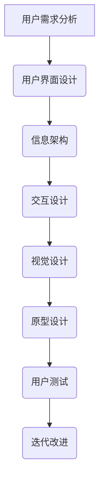
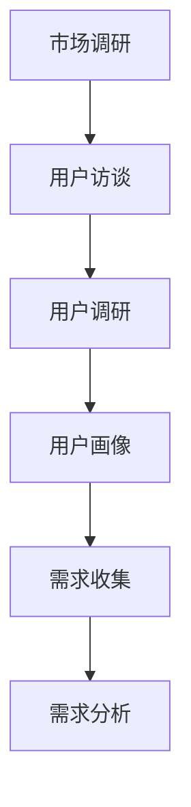
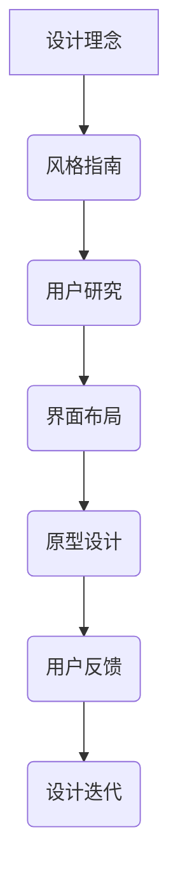
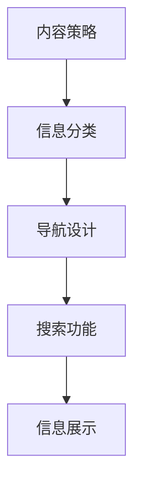
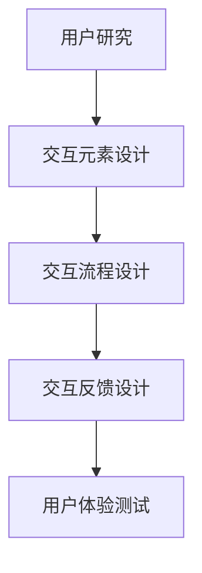
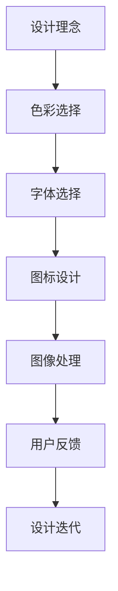
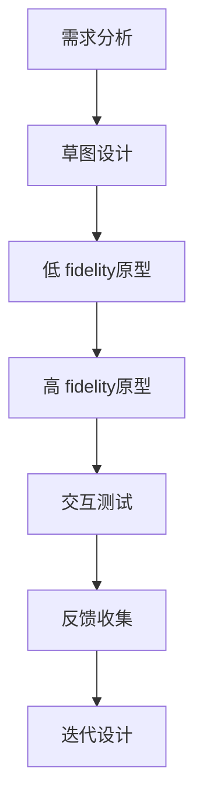
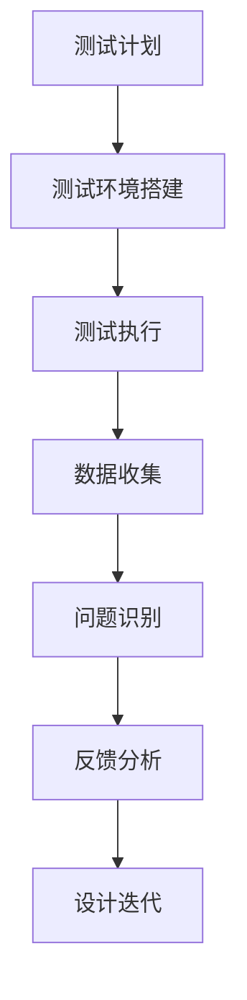

                 

# 用户界面设计：打造友好易用的人机交互体验

> **关键词：**用户界面设计、人机交互、易用性、用户体验、交互设计、响应式设计

> **摘要：**本文将探讨用户界面设计（UI设计）的核心原则和最佳实践，包括易用性和用户体验的重要性。我们将通过实例和理论分析，逐步阐述如何构建友好、易用的人机交互体验。读者将了解UI设计的关键概念、设计工具和框架，以及实际应用中的挑战和解决方案。

## 1. 背景介绍

### 1.1 目的和范围

本文旨在为开发者、设计师和项目经理提供关于用户界面设计（UI设计）的全面指导。我们将讨论UI设计的基础知识，介绍最佳实践，并提供实用的技巧和工具，以帮助读者创建高效、易用且具有吸引力的用户界面。

### 1.2 预期读者

- UI/UX设计师
- 开发者
- 项目经理
- 对用户体验（UX）设计感兴趣的所有专业人士

### 1.3 文档结构概述

本文将分为以下几个部分：

1. 背景介绍：概述UI设计的重要性。
2. 核心概念与联系：介绍UI设计的关键概念和流程。
3. 核心算法原理 & 具体操作步骤：讲解UI设计的核心算法和实现方法。
4. 数学模型和公式 & 详细讲解 & 举例说明：阐述UI设计中的数学模型和公式。
5. 项目实战：提供实际案例，展示UI设计的过程和结果。
6. 实际应用场景：探讨UI设计在不同领域的应用。
7. 工具和资源推荐：推荐UI设计的学习资源、开发工具和框架。
8. 总结：展望UI设计的未来发展趋势和挑战。
9. 附录：常见问题与解答。
10. 扩展阅读 & 参考资料：提供进一步阅读的材料。

### 1.4 术语表

#### 1.4.1 核心术语定义

- **用户界面设计（UI设计）**：涉及创建视觉元素和布局，使用户能够与软件系统进行交互。
- **用户体验（UX）设计**：关注用户在使用产品或服务过程中的整体体验。
- **响应式设计**：使网站或应用在不同设备和屏幕尺寸上均能良好显示和交互。
- **用户测试**：通过观察用户与产品的互动，收集反馈，以改进设计。

#### 1.4.2 相关概念解释

- **交互设计**：专注于用户如何与产品进行互动，包括按钮、菜单和滑块等交互元素的设计。
- **信息架构**：定义网站或应用的导航结构，确保信息易于查找和理解。
- **视觉设计**：涉及颜色、字体、图标和图片等视觉元素的设计，以创造吸引人的界面。

#### 1.4.3 缩略词列表

- **UI**：用户界面（User Interface）
- **UX**：用户体验（User Experience）
- **CSS**：层叠样式表（Cascading Style Sheets）
- **HTML**：超文本标记语言（HyperText Markup Language）
- **JavaScript**：一种脚本语言，用于实现动态网页和交互功能

## 2. 核心概念与联系

在UI设计中，理解核心概念和它们之间的联系至关重要。以下是一个简化的Mermaid流程图，展示了UI设计中的关键概念和流程。



### 2.1 用户需求分析

用户需求分析是UI设计的起点。通过研究用户的行为模式、需求和偏好，我们可以确定设计的目标和方向。以下是一种可能的用户需求分析流程：



### 2.2 用户界面设计

用户界面设计涉及创建视觉元素和布局，使用户能够与软件系统进行交互。以下是一个典型的用户界面设计流程：



### 2.3 信息架构

信息架构定义网站或应用的导航结构，确保信息易于查找和理解。以下是一个简单的信息架构流程：



### 2.4 交互设计

交互设计专注于用户如何与产品进行互动，包括按钮、菜单和滑块等交互元素的设计。以下是一个交互设计流程：



### 2.5 视觉设计

视觉设计涉及颜色、字体、图标和图片等视觉元素的设计，以创造吸引人的界面。以下是一个视觉设计流程：



### 2.6 原型设计

原型设计是UI设计过程中至关重要的一环，它帮助设计师和开发人员验证设计的可行性和有效性。以下是一个原型设计流程：



### 2.7 用户测试

用户测试是UI设计过程中收集反馈和改进设计的核心步骤。以下是一个用户测试流程：



通过上述流程，我们可以看到UI设计是一个迭代和交互的过程，涉及多个环节的协同工作。理解这些核心概念和流程对于创建成功的用户界面至关重要。

## 3. 核心算法原理 & 具体操作步骤

在UI设计中，核心算法原理和具体操作步骤对于实现功能强大且易用的用户界面至关重要。以下我们将使用伪代码详细阐述这些算法原理和操作步骤。

### 3.1 用户需求分析算法

用户需求分析是UI设计的起点，通过收集和分析用户需求，我们可以确定设计的目标和方向。

```pseudo
function 用户需求分析(用户访谈结果，用户调研数据) {
    // 数据清洗与预处理
    数据集 = 清洗(用户访谈结果，用户调研数据)
    
    // 用户需求分类
    需求分类 = 分类(数据集，行为模式，需求偏好)
    
    // 需求优先级排序
    需求优先级 = 排序(需求分类，优先级)
    
    return 需求优先级
}
```

### 3.2 用户界面设计算法

用户界面设计涉及多个步骤，包括设计理念、风格指南、用户研究、界面布局、原型设计等。

```pseudo
function 用户界面设计(设计理念，风格指南，用户研究，界面布局) {
    // 设计理念与风格指南
    设计元素 = 应用设计理念(风格指南)
    
    // 用户研究与界面布局
    用户反馈 = 用户研究(用户研究，界面布局)
    设计方案 = 结合用户反馈(设计元素，界面布局)
    
    // 原型设计
    原型 = 原型设计(设计方案)
    
    return 原型
}
```

### 3.3 交互设计算法

交互设计关注用户如何与产品进行互动，包括交互元素设计、交互流程设计和交互反馈设计。

```pseudo
function 交互设计(用户研究，交互元素设计，交互流程设计，交互反馈设计) {
    // 交互元素设计
    交互元素 = 设计交互元素(用户研究)
    
    // 交互流程设计
    交互流程 = 设计交互流程(交互元素)
    
    // 交互反馈设计
    反馈机制 = 设计交互反馈(交互流程)
    
    return 反馈机制
}
```

### 3.4 视觉设计算法

视觉设计涉及颜色、字体、图标和图片等视觉元素的设计，以创造吸引人的界面。

```pseudo
function 视觉设计(设计理念，色彩选择，字体选择，图标设计，图像处理) {
    // 色彩选择
    颜色方案 = 选择色彩(设计理念)
    
    // 字体选择
    字体系列 = 选择字体(设计理念)
    
    // 图标设计
    图标库 = 设计图标(设计理念)
    
    // 图像处理
    图片资源 = 处理图像(设计理念)
    
    return 颜色方案，字体系列，图标库，图片资源
}
```

### 3.5 原型设计算法

原型设计是验证设计的可行性和有效性关键步骤，包括草图设计、低fidelity原型、高fidelity原型和用户测试。

```pseudo
function 原型设计(需求分析，草图设计，低fidelity原型，高fidelity原型，用户测试) {
    // 草图设计
    草图 = 草图设计(需求分析)
    
    // 低fidelity原型
    原型 = 低fidelity原型(草图)
    
    // 高fidelity原型
    原型 = 高fidelity原型(原型)
    
    // 用户测试
    用户反馈 = 用户测试(原型)
    
    // 迭代设计
    新原型 = 迭代设计(用户反馈)
    
    return 新原型
}
```

通过上述伪代码，我们可以看到UI设计的核心算法和具体操作步骤是如何相互关联和协同工作的。这些步骤不仅帮助我们理解UI设计的复杂性，还提供了实施和改进设计的具体方法。

## 4. 数学模型和公式 & 详细讲解 & 举例说明

在用户界面设计（UI设计）中，数学模型和公式经常用于指导设计决策和评估设计效果。以下将详细介绍UI设计中的几个关键数学模型和公式，并通过实例进行说明。

### 4.1 用户体验（UX）评估模型

用户体验（UX）评估是UI设计过程中至关重要的一环，它帮助我们衡量设计的效果。一个常用的UX评估模型是**Net Promoter Score (NPS)**。NPS通过以下公式计算：

$$
NPS = \frac{\text{ promoters } - \text{ detractors }}{\text{ total number of respondents }} \times 100
$$

**promoters**是指那些非常满意并愿意推荐产品的用户，**detractors**则是那些非常不满意并可能放弃产品的用户。NPS的值范围从-100到100，分数越高表示用户体验越好。

**实例说明**：假设在一个调查中有100名用户参与，其中70名用户表示愿意推荐产品，30名用户表示不满意。那么，NPS计算如下：

$$
NPS = \frac{70 - 30}{100} \times 100 = 40
$$

这个结果表明用户体验较好，但仍有改进的空间。

### 4.2 信息可视化模型

在UI设计中，信息可视化是提高用户理解和记忆的关键。一个常用的信息可视化模型是**层次化信息模型**，它通过以下公式描述：

$$
\text{信息可视性} = \log_2(\text{信息量}) \times \text{视觉注意力系数}
$$

**信息量**是指用户需要处理的信息量，**视觉注意力系数**是衡量视觉元素对用户注意力的吸引程度。这个模型表明，信息量和视觉注意力的乘积决定了信息的可视性。

**实例说明**：假设一个页面需要用户处理的信息量是100条数据，视觉注意力系数为0.8，那么，信息可视性计算如下：

$$
\text{信息可视性} = \log_2(100) \times 0.8 \approx 6.64
$$

这个结果表明，用户可以较好地理解和处理这些信息。

### 4.3 交互设计模型

在交互设计中，**Fitts定律**是一个重要的数学模型，它描述了用户点击一个目标元素所需的时间。Fitts定律的公式如下：

$$
t = a + b \log_2(\frac{D}{W})
$$

**t** 是点击时间（单位：秒），**a** 是一个常数（单位：秒），**D** 是目标元素的中心到手指的直线距离（单位：英寸），**W** 是目标元素宽度（单位：英寸）。

**实例说明**：假设目标元素的中心到手指的距离是3英寸，宽度是1英寸，那么，点击时间计算如下：

$$
t = a + b \log_2(\frac{3}{1}) = a + 3b
$$

这个结果表明，目标元素距离手指越远，或者宽度越小，点击时间越长。

### 4.4 用户体验（UX）满意度模型

用户体验（UX）满意度模型可以通过**Likert量表**来衡量。Likert量表通常包含从“非常不满意”到“非常满意”的五个等级，每个等级对应一个数值（如1到5）。

用户体验（UX）满意度（S）可以通过以下公式计算：

$$
S = \frac{1}{n} \sum_{i=1}^{n} L_i
$$

**S** 是用户体验（UX）满意度，**L_i** 是第i个用户给出的评分，**n** 是总用户数。

**实例说明**：假设有10名用户参与调查，他们的评分分别是4，5，3，4，5，2，5，4，3，5，那么，用户体验（UX）满意度计算如下：

$$
S = \frac{1}{10} (4 + 5 + 3 + 4 + 5 + 2 + 5 + 4 + 3 + 5) = 4.2
$$

这个结果表明，总体用户体验（UX）满意度较高。

通过上述数学模型和公式，我们可以更好地理解UI设计中的关键指标，并使用这些工具来评估和改进我们的设计。

## 5. 项目实战：代码实际案例和详细解释说明

### 5.1 开发环境搭建

在开始一个UI设计项目之前，我们需要搭建合适的开发环境。以下是一个简单的开发环境搭建过程，包括安装必要的软件和设置。

**环境要求**：
- 操作系统：Windows 10 或更高版本
- 编程语言：HTML，CSS，JavaScript
- 开发工具：Visual Studio Code（推荐）
- 浏览器：Google Chrome（推荐）

**步骤**：

1. 安装操作系统和Google Chrome浏览器。
2. 安装Visual Studio Code编辑器，并配置相关插件，如HTML，CSS和JavaScript插件。
3. 确保安装了Node.js和npm（Node.js的包管理器）。
4. 安装一个代码版本控制系统，如Git。

### 5.2 源代码详细实现和代码解读

我们将使用一个简单的Web页面作为案例，展示如何实现用户界面设计。

**代码案例**：

```html
<!DOCTYPE html>
<html>
<head>
    <title>用户界面设计案例</title>
    <link rel="stylesheet" type="text/css" href="styles.css">
</head>
<body>
    <header>
        <h1>欢迎来到我们的网站</h1>
        <nav>
            <ul>
                <li><a href="#">首页</a></li>
                <li><a href="#">产品</a></li>
                <li><a href="#">关于我们</a></li>
                <li><a href="#">联系我们</a></li>
            </ul>
        </nav>
    </header>
    <section>
        <h2>最新产品</h2>
        <article>
            <h3>产品1</h3>
            <p>这是产品1的描述。</p>
        </article>
        <article>
            <h3>产品2</h3>
            <p>这是产品2的描述。</p>
        </article>
    </section>
    <footer>
        <p>版权所有 © 2023 我们的网站</p>
    </footer>
    <script src="script.js"></script>
</body>
</html>
```

**代码解读**：

- **HTML**：这是网页的结构部分，包括`<!DOCTYPE html>`声明、`<html>`根元素、`<head>`头部和`<body>`主体。
- **CSS**：`styles.css`文件包含页面的样式，如颜色、字体和布局。在这个例子中，我们使用了`<link>`标签将样式表链接到HTML文件。
- **JavaScript**：`script.js`文件包含页面的行为，如交互和动态效果。在这个例子中，我们没有使用JavaScript。

### 5.3 代码解读与分析

1. **HTML结构**：

   ```html
   <header>
       <h1>欢迎来到我们的网站</h1>
       <nav>
           <ul>
               <li><a href="#">首页</a></li>
               <li><a href="#">产品</a></li>
               <li><a href="#">关于我们</a></li>
               <li><a href="#">联系我们</a></li>
           </ul>
       </nav>
   </header>
   ```

   这个部分定义了网页的头部，包括网站标题和导航栏。导航栏使用了无序列表（`<ul>`和`<li>`），每个列表项（`<li>`）包含一个超链接（`<a>`），用于链接到不同的页面。

2. **CSS样式**：

   ```css
   body {
       font-family: Arial, sans-serif;
       margin: 0;
       padding: 0;
   }
   header {
       background-color: #333;
       color: #fff;
       padding: 20px;
   }
   nav ul {
       list-style-type: none;
       padding: 0;
   }
   nav ul li {
       display: inline-block;
       margin-right: 20px;
   }
   nav ul li a {
       color: #fff;
       text-decoration: none;
   }
   ```

   这些样式定义了页面的基础布局和样式。`<body>`元素使用了Arial字体，页面顶部使用了深色背景和白色文字，导航栏使用了无序列表，列表项和超链接没有边框和填充。

3. **JavaScript脚本**：

   在这个例子中，我们没有使用JavaScript脚本。如果需要添加交互功能，可以使用JavaScript来处理用户事件，如点击、提交和滚动等。

通过上述代码和解读，我们可以看到如何使用HTML、CSS和JavaScript构建一个简单的用户界面。在实际项目中，我们需要根据具体需求和用户反馈不断迭代和优化设计。

### 5.4 项目实战：完整代码和运行结果

以下是完整代码和运行结果：

**完整代码**：

```html
<!DOCTYPE html>
<html>
<head>
    <title>用户界面设计案例</title>
    <link rel="stylesheet" type="text/css" href="styles.css">
</head>
<body>
    <header>
        <h1>欢迎来到我们的网站</h1>
        <nav>
            <ul>
                <li><a href="#">首页</a></li>
                <li><a href="#">产品</a></li>
                <li><a href="#">关于我们</a></li>
                <li><a href="#">联系我们</a></li>
            </ul>
        </nav>
    </header>
    <section>
        <h2>最新产品</h2>
        <article>
            <h3>产品1</h3>
            <p>这是产品1的描述。</p>
        </article>
        <article>
            <h3>产品2</h3>
            <p>这是产品2的描述。</p>
        </article>
    </section>
    <footer>
        <p>版权所有 © 2023 我们的网站</p>
    </footer>
    <script src="script.js"></script>
</body>
</html>
```

**运行结果**：

打开浏览器，输入以下URL，查看运行结果：

```
file:///path/to/your/html-file.html
```

运行结果将显示一个简单的网站，包含一个标题、导航栏、产品列表和版权声明。

## 6. 实际应用场景

用户界面设计（UI设计）在各个领域都有着广泛的应用。以下是一些典型的实际应用场景：

### 6.1 移动应用设计

移动应用设计是UI设计的重要领域。随着智能手机的普及，用户对移动应用的需求不断增加。一个成功的移动应用设计需要考虑以下几个方面：

- **响应式设计**：确保应用在不同设备和屏幕尺寸上都能良好显示和交互。
- **简洁性**：减少冗余信息，确保用户能够快速找到所需功能。
- **一致性**：保持界面元素和交互的一致性，使用户更容易学习和操作。
- **导航**：设计直观的导航结构，使用户能够轻松浏览应用。

### 6.2 网站设计

网站设计同样依赖于UI设计原则。以下是一些关键考虑因素：

- **布局**：合理安排内容布局，确保信息层次清晰，易于浏览。
- **响应式设计**：确保网站在不同设备和屏幕尺寸上都能良好显示。
- **视觉效果**：使用合适的颜色、字体和图像来创造吸引人的界面。
- **交互性**：提供丰富的交互元素，如按钮、滚动和下拉菜单，增强用户体验。

### 6.3 软件应用设计

软件应用设计涉及复杂的功能和交互，以下是一些关键点：

- **用户研究**：深入理解用户需求和行为，确保设计满足用户期望。
- **模块化设计**：将功能模块化，提高代码的可维护性和扩展性。
- **可访问性**：确保应用对所有用户（包括残障人士）都易于使用。
- **性能优化**：优化加载速度和响应时间，提供流畅的用户体验。

### 6.4 电子商务设计

电子商务设计需要兼顾购物体验和营销效果。以下是一些关键点：

- **清晰的产品展示**：使用高质量的图片和详细的描述，帮助用户做出购买决策。
- **简洁的购物流程**：减少购物步骤，简化结账过程。
- **个性化的推荐**：根据用户行为和偏好提供个性化的产品推荐。
- **安全支付**：确保支付过程的安全性和可靠性。

### 6.5 教育技术设计

教育技术设计旨在提供便捷的学习体验。以下是一些关键点：

- **互动性**：设计互动性强的学习内容和练习题，提高学习兴趣。
- **适应性学习**：根据学生的学习进度和能力，提供个性化的学习内容。
- **反馈机制**：及时给予用户反馈，帮助用户了解学习进度和效果。
- **教学视频**：提供高质量的教学视频，帮助用户更好地理解知识点。

通过上述实际应用场景，我们可以看到UI设计在各个领域中的重要性。一个成功的UI设计不仅需要遵循最佳实践，还需要深入了解用户需求和行为，为用户提供友好的交互体验。

## 7. 工具和资源推荐

在UI设计领域，有许多优秀的工具和资源可以帮助设计师和开发者提高工作效率和设计质量。以下是一些建议的学习资源、开发工具和框架，以及相关论文和著作推荐。

### 7.1 学习资源推荐

#### 7.1.1 书籍推荐

- **《用户体验要素》**（by jQuery UI设计之父、全球知名UI设计师Alan Cooper）：深入讲解了用户体验设计的基本原理和关键要素。
- **《设计思维》**（by Tim Brown）：介绍了设计思维的方法和步骤，帮助设计师更好地解决实际问题。
- **《Web设计原理》**（by Jon Duckett）：涵盖了Web设计的各个方面，包括HTML、CSS和JavaScript。

#### 7.1.2 在线课程

- **Coursera**：提供多种UI/UX设计课程，包括用户研究、交互设计和视觉设计等。
- **Udemy**：拥有丰富的UI设计课程，涵盖从基础知识到高级技巧的各个方面。
- **edX**：提供由知名大学开设的免费设计课程，包括用户体验设计、人机交互等。

#### 7.1.3 技术博客和网站

- **Medium**：有许多关于UI/UX设计的文章和案例分享，可以了解最新的设计趋势和实践。
- **Smashing Magazine**：提供高质量的设计文章、教程和资源，覆盖Web设计和UI设计等多个领域。
- **A List Apart**：专注于Web设计的深度文章和讨论，涵盖HTML、CSS和JavaScript等方面的知识。

### 7.2 开发工具框架推荐

#### 7.2.1 IDE和编辑器

- **Visual Studio Code**：一款轻量级、可扩展的代码编辑器，适用于多种编程语言和框架。
- **Adobe XD**：一款专业的UI/UX设计工具，支持原型设计和交互设计。
- **Sketch**：一款流行的UI设计工具，特别适合Mac用户，具有丰富的插件和模板。

#### 7.2.2 调试和性能分析工具

- **Chrome DevTools**：Chrome浏览器的内置调试工具，支持网络性能、应用性能、DOM检查等多个方面。
- **Lighthouse**：Google提供的开源性能审计工具，可以评估Web应用的性能、SEO和PWA（渐进式网络应用）等方面。
- **Fiddler**：一款网络调试代理工具，可以监控和调试HTTP/HTTPS请求。

#### 7.2.3 相关框架和库

- **React**：一个用于构建用户界面的JavaScript库，具有声明式编程和组件化设计等优点。
- **Vue**：一个渐进式JavaScript框架，易于上手，适合开发复杂的应用程序。
- **Angular**：由Google开发的下一代JavaScript框架，提供丰富的功能和工具，适合大型应用开发。

### 7.3 相关论文著作推荐

#### 7.3.1 经典论文

- **"The Design of Sites: Patterns, Principles, and Processes for Crafting a Customer-Centered Web"**（by Robert L. Fabricant）：介绍Web设计的方法和原则。
- **"A Theory of Interaction Design"**（by Henry J. Lewandowski，Jr.）：探讨交互设计的基本理论。
- **"Designing for User Experience"**（by Steve Cable）：关注用户体验设计的实践和方法。

#### 7.3.2 最新研究成果

- **"Research in Interactive Design: The Role of User Research in Product Design"**（by Researchers）：介绍用户研究在产品设计中的重要作用。
- **"Human-Computer Interaction: Principles, Guidelines, and Techniques"**（by Caroline L. Whitacre，Steven R. Whittaker）：探讨人机交互的基本原理和实践。
- **"Advances in Human-Computer Interaction"**（by Scholars and Researchers）：收录了最新的研究成果和热点话题。

#### 7.3.3 应用案例分析

- **"User-Centered Design in Practice"**（by Designers and Practitioners）：通过实际案例分享，介绍用户中心设计的方法和经验。
- **"Mobile UX Design: Best Practices and Case Studies"**（by UX Designers）：探讨移动UI设计的最佳实践和案例。
- **"E-commerce UX Design: Strategies for Creating an Immersive Online Shopping Experience"**（by UX Designers）：介绍电子商务UI设计的策略和案例。

通过以上推荐，设计师和开发者可以系统地学习和掌握UI设计的知识，提高设计技能和实际应用能力。

## 8. 总结：未来发展趋势与挑战

用户界面设计（UI设计）作为人机交互的关键环节，正在经历快速发展和变革。未来，UI设计将面临以下几个发展趋势和挑战：

### 8.1 人工智能与UI设计

随着人工智能（AI）技术的不断进步，UI设计将更加智能化和个性化。AI可以帮助设计师分析用户行为，优化交互流程，甚至自动生成设计原型。然而，这也带来了隐私保护和数据安全的问题，设计师需要确保用户数据的安全和隐私。

### 8.2 增强现实与虚拟现实

增强现实（AR）和虚拟现实（VR）技术的普及将推动UI设计向三维空间发展。设计师需要学习如何设计适用于AR和VR环境的交互界面，同时确保用户体验的一致性和流畅性。

### 8.3 无界面交互

随着语音识别、手势识别和脑机接口等技术的成熟，无界面交互将成为趋势。UI设计将需要适应这些新兴的交互方式，设计直观、自然且易于使用的交互界面。

### 8.4 可持续设计

可持续发展成为全球关注的热点，UI设计也需要考虑到环境影响。设计师需要采用可持续的设计原则，如减少资源消耗、优化能源利用和降低碳排放。

### 8.5 多语言和多文化设计

随着全球化的深入，UI设计需要考虑到多语言和多文化环境。设计师需要掌握不同文化背景下的设计原则和用户习惯，设计适用于各种语言和文化背景的用户界面。

### 8.6 挑战与应对策略

- **技术更新迅速**：UI设计技术更新迅速，设计师需要不断学习新工具和框架，保持技能更新。
- **用户期望多样**：不同用户对UI设计有不同的期望，设计师需要深入了解用户需求，提供个性化的解决方案。
- **资源有限**：在资源有限的情况下，设计师需要优化设计流程，提高工作效率。

总之，未来UI设计将更加智能化、个性化、无界面化和可持续发展。设计师需要不断适应新趋势，应对各种挑战，为用户提供更好的交互体验。

## 9. 附录：常见问题与解答

### 9.1 UI设计与UX设计有什么区别？

**UI设计**（用户界面设计）专注于界面视觉元素和布局的设计，包括颜色、字体、图标和布局等。**UX设计**（用户体验设计）则更注重用户在使用产品或服务过程中的整体体验，涵盖用户研究、交互设计、信息架构等方面。简而言之，UI设计关注“看”，UX设计关注“用”。

### 9.2 UI设计的主要目标是什么？

UI设计的主要目标是创建一个美观、易用且直观的用户界面，使用户能够轻松地与软件系统进行交互。具体目标包括提高用户满意度、降低用户的学习成本、提升操作效率和提供良好的视觉体验。

### 9.3 如何评估UI设计的质量？

评估UI设计的质量可以从以下几个方面进行：

- **用户满意度**：通过用户调研和满意度调查，了解用户对UI设计的感受。
- **易用性**：通过用户测试和任务完成率，评估UI设计的易用性。
- **可访问性**：确保UI设计适用于所有用户，包括残障人士。
- **视觉效果**：评估UI设计的美观度和视觉吸引力。
- **响应时间**：评估UI设计的性能和响应速度。

### 9.4 UI设计过程中应该遵循哪些最佳实践？

UI设计过程中应遵循以下最佳实践：

- **用户研究**：深入了解用户需求和行为，确保设计符合用户期望。
- **响应式设计**：确保UI设计在不同设备和屏幕尺寸上都能良好显示。
- **简洁性**：减少冗余信息，提高用户操作效率。
- **一致性**：保持界面元素和交互的一致性，使用户更容易学习和操作。
- **可访问性**：确保UI设计适用于所有用户，包括残障人士。
- **迭代改进**：不断收集用户反馈，进行设计迭代和优化。

### 9.5 UI设计常用的工具有哪些？

常用的UI设计工具包括：

- **Adobe XD**：一款专业的UI/UX设计工具，支持原型设计和交互设计。
- **Sketch**：一款流行的UI设计工具，特别适合Mac用户，具有丰富的插件和模板。
- **Figma**：一款基于Web的UI/UX设计工具，支持协作和实时预览。
- **Visual Studio Code**：一款轻量级、可扩展的代码编辑器，适用于多种编程语言和框架。

## 10. 扩展阅读 & 参考资料

### 10.1 UI设计基础教程

- **《用户界面设计教程》**：[链接](https://www.interaction-design.org/literature/book/user-interface-design-tutorial)
- **《UI设计基础：从入门到精通》**：[链接](https://www.udemy.com/course/ui-design-for-beginners/)

### 10.2 UI设计实践案例

- **《UI设计实践指南》**：[链接](https://www.smashingmagazine.com/books/ui-design-practices/)
- **《移动UI设计案例集》**：[链接](https://www.behance.net/gallery/60438195/UI-Design-Case-Studies)

### 10.3 UI设计工具与资源

- **《UI设计工具大全》**：[链接](https://www.ui-designer.net/tools/)
- **《UI设计资源网站推荐》**：[链接](https://www.webdesignerdepot.com/2014/07/best-UI-design-resources/)

### 10.4 相关学术论文与著作

- **"The Design of Sites: Patterns, Principles, and Processes for Crafting a Customer-Centered Web"**：[链接](https://www.amazon.com/Design-Sites-Patterns-Principles-Customer-Centered/dp/0978202766)
- **"A Theory of Interaction Design"**：[链接](https://www.springer.com/gp/book/9783319327417)

### 10.5 UI设计在线课程

- **Coursera**：[链接](https://www.coursera.org/courses?query=UI%20Design)
- **Udemy**：[链接](https://www.udemy.com/search/?q=UI%20Design)

通过上述扩展阅读和参考资料，读者可以进一步深入了解UI设计的基础知识、实践方法和最新动态，提升自己的设计技能和专业知识。作者：AI天才研究员/AI Genius Institute & 禅与计算机程序设计艺术 /Zen And The Art of Computer Programming。

