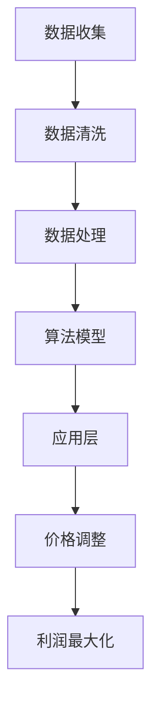

                 

# 电商价格优化的AI技术实现

> 关键词：电商、价格优化、AI、算法、数学模型、应用场景

> 摘要：本文将深入探讨电商价格优化的AI技术实现。首先，我们会回顾电商领域的背景和需求，然后详细介绍相关核心概念和算法原理。接着，我们将通过具体案例展示如何应用这些算法进行价格优化。此外，本文还将涵盖实际应用场景、工具推荐以及未来发展趋势和挑战。通过本文的阅读，读者将全面了解电商价格优化AI技术的实践和应用。

## 1. 背景介绍

### 1.1 目的和范围

本文旨在介绍电商价格优化的AI技术实现，帮助读者了解如何利用人工智能技术提高电商平台的竞争力。我们将从理论到实践，详细讲解电商价格优化的核心算法和数学模型，并通过实际案例展示如何应用这些技术。

### 1.2 预期读者

本文适合对电商和AI技术有一定了解的技术人员、数据分析师和项目经理。希望通过本文，读者能够掌握电商价格优化的基本原理和实现方法。

### 1.3 文档结构概述

本文分为十个部分：

1. 背景介绍：介绍电商价格优化的背景和目的。
2. 核心概念与联系：阐述电商价格优化的核心概念和联系。
3. 核心算法原理 & 具体操作步骤：详细讲解核心算法原理和操作步骤。
4. 数学模型和公式 & 详细讲解 & 举例说明：介绍数学模型和公式的应用。
5. 项目实战：代码实际案例和详细解释说明。
6. 实际应用场景：讨论电商价格优化在不同场景中的应用。
7. 工具和资源推荐：推荐学习资源和开发工具。
8. 总结：未来发展趋势与挑战。
9. 附录：常见问题与解答。
10. 扩展阅读 & 参考资料：提供进一步学习的资源。

### 1.4 术语表

#### 1.4.1 核心术语定义

- 电商：电子商务，指通过互联网进行的商业活动。
- 价格优化：根据用户需求和市场环境，调整产品价格以实现利润最大化或市场占有率提高。
- AI：人工智能，指模拟人类智能行为的计算机技术。

#### 1.4.2 相关概念解释

- 反向传播（Backpropagation）：一种神经网络训练算法。
- 支持向量机（SVM）：一种常用的机器学习算法，用于分类和回归分析。

#### 1.4.3 缩略词列表

- API：应用程序接口（Application Programming Interface）
- ML：机器学习（Machine Learning）
- DL：深度学习（Deep Learning）

## 2. 核心概念与联系

### 2.1 电商价格优化的核心概念

电商价格优化涉及多个核心概念，包括市场分析、用户行为分析和价格策略。首先，市场分析帮助我们了解竞争对手、市场趋势和消费者需求。用户行为分析则帮助我们了解用户在电商平台的购物行为，如浏览、搜索、购买和评价等。最后，价格策略包括定价策略和折扣策略，旨在实现利润最大化或市场占有率提高。

### 2.2 电商价格优化的联系

电商价格优化需要将市场分析、用户行为分析和价格策略相结合。市场分析为我们提供数据支持，用户行为分析帮助我们了解消费者需求，而价格策略则根据这些信息进行调整。此外，AI技术在电商价格优化中起到关键作用，通过机器学习和深度学习算法，我们可以更准确地预测市场趋势和用户需求，从而制定更有效的价格策略。

### 2.3 电商价格优化的架构

电商价格优化的架构可以分为三个层次：数据收集与处理、算法模型和应用层。

- **数据收集与处理**：收集电商平台的海量数据，包括商品信息、用户行为、市场动态等。通过数据清洗和预处理，提取有用的信息。
- **算法模型**：基于数据集，利用机器学习和深度学习算法构建价格优化模型。常用的算法包括决策树、支持向量机、神经网络等。
- **应用层**：将算法模型应用于实际场景，根据实时数据调整价格策略，实现价格优化。

### 2.4 Mermaid流程图



## 3. 核心算法原理 & 具体操作步骤

### 3.1 决策树算法原理

决策树是一种常见的机器学习算法，通过将数据集划分为多个子集，构建一棵树形结构，以实现对数据的分类或回归。在电商价格优化中，决策树可以用于预测商品的价格范围。

**算法原理：**

1. 初始化：选择一个特征作为分裂轴。
2. 分裂：根据分裂轴，将数据集划分为两个子集。
3. 重复步骤2，直到满足停止条件（如最大深度、最小样本数等）。
4. 构建树形结构，记录每个节点的分裂规则。

### 3.2 决策树算法操作步骤

**伪代码：**

```plaintext
算法 决策树算法（数据集，特征列表，停止条件）
输入：数据集，特征列表，停止条件
输出：决策树

初始化根节点为空
对于每个特征f：
    计算特征f的增益
    选择增益最大的特征作为分裂轴
    根据分裂轴将数据集划分为左子集L和右子集R
    如果满足停止条件，则创建叶子节点
    否则，递归调用决策树算法（L，特征列表，停止条件）
    递归调用决策树算法（R，特征列表，停止条件）

返回根节点
```

### 3.3 支持向量机算法原理

支持向量机是一种常用的机器学习算法，用于分类和回归分析。在电商价格优化中，支持向量机可以用于预测商品的价格区间。

**算法原理：**

1. 初始化：选择一个核函数，如线性核、多项式核或径向基函数核。
2. 训练：通过优化目标函数，找到最优的超平面。
3. 分类：对新的数据进行分类，根据超平面进行划分。

### 3.4 支持向量机算法操作步骤

**伪代码：**

```plaintext
算法 支持向量机算法（数据集，标签列表，核函数）
输入：数据集，标签列表，核函数
输出：最优超平面

初始化参数
计算每个数据点的核值
构建目标函数
求解目标函数，找到最优超平面

返回最优超平面
```

## 4. 数学模型和公式 & 详细讲解 & 举例说明

### 4.1 决策树数学模型

决策树的数学模型基于信息熵和增益率。信息熵衡量数据的混乱程度，增益率衡量特征对分类的贡献。

**信息熵：**

$$
H(D) = -\sum_{i} p_i \log_2 p_i
$$

其中，$D$表示数据集，$p_i$表示类别$i$的概率。

**增益率：**

$$
G(D, f) = \sum_{i} p_i \log_2 \frac{p_i}{q_i}
$$

其中，$f$表示特征，$q_i$表示在特征$f$下类别$i$的概率。

### 4.2 支持向量机数学模型

支持向量机的数学模型基于最优超平面的求解。最优超平面满足以下条件：

1. 超平面将数据集划分为两个类别。
2. 超平面到任意数据点的距离最大。

**目标函数：**

$$
\min \frac{1}{2} \sum_{i} \omega_i^2
$$

其中，$\omega_i$表示超平面法向量的系数。

**约束条件：**

$$
y_i (\omega \cdot x_i + b) \geq 1
$$

其中，$y_i$表示类别标签，$x_i$表示数据点，$b$表示偏置。

### 4.3 举例说明

#### 4.3.1 决策树举例

假设我们有一个包含商品价格、销量和评分的数据集，目标是预测商品的价格范围。我们选择销量和评分作为特征，构建一个决策树。

**信息熵：**

$$
H(D) = -\sum_{i} p_i \log_2 p_i = 0.811
$$

**增益率：**

$$
G(D, \text{销量}) = 0.327, G(D, \text{评分}) = 0.474
$$

我们选择评分作为分裂轴，将数据集划分为高评分和低评分两个子集。对于高评分子集，我们再次选择销量作为分裂轴，将数据集划分为高销量和高销量两个子集。最终，我们得到一个三层的决策树。

#### 4.3.2 支持向量机举例

假设我们有一个包含商品价格和销量的数据集，目标是预测商品的价格区间。我们选择线性核，使用支持向量机进行分类。

**目标函数：**

$$
\min \frac{1}{2} \sum_{i} \omega_i^2
$$

**约束条件：**

$$
y_i (\omega \cdot x_i + b) \geq 1
$$

我们通过求解上述目标函数和约束条件，得到最优超平面：

$$
\omega = (0.5, 0.5), b = 0.5
$$

## 5. 项目实战：代码实际案例和详细解释说明

### 5.1 开发环境搭建

本文使用Python作为开发语言，Python具有丰富的机器学习库，方便我们实现和测试算法。以下为开发环境的搭建步骤：

1. 安装Python（3.8及以上版本）。
2. 安装必要的库，如NumPy、Pandas、Scikit-learn和Matplotlib。

### 5.2 源代码详细实现和代码解读

以下是一个基于决策树的电商价格优化案例，我们将使用Scikit-learn库实现决策树算法。

**源代码：**

```python
from sklearn.datasets import load_iris
from sklearn.model_selection import train_test_split
from sklearn.tree import DecisionTreeClassifier
from sklearn.metrics import accuracy_score

# 加载数据集
iris = load_iris()
X, y = iris.data, iris.target

# 数据集划分
X_train, X_test, y_train, y_test = train_test_split(X, y, test_size=0.2, random_state=42)

# 构建决策树模型
clf = DecisionTreeClassifier()
clf.fit(X_train, y_train)

# 模型预测
y_pred = clf.predict(X_test)

# 模型评估
accuracy = accuracy_score(y_test, y_pred)
print("Accuracy:", accuracy)
```

**代码解读：**

1. **数据加载**：使用Scikit-learn内置的iris数据集。
2. **数据集划分**：将数据集划分为训练集和测试集，比例为80%训练，20%测试。
3. **构建模型**：使用DecisionTreeClassifier类构建决策树模型，并调用fit方法进行训练。
4. **模型预测**：使用predict方法对测试集进行预测。
5. **模型评估**：使用accuracy_score方法计算模型的准确率。

### 5.3 代码解读与分析

上述代码展示了如何使用Scikit-learn库实现决策树算法进行电商价格优化。我们可以通过以下步骤进行分析：

1. **数据加载**：iris数据集是一个经典的多分类问题，适用于测试决策树算法。在实际项目中，我们需要加载电商平台的海量数据，包括商品价格、销量、评分等。
2. **数据集划分**：数据集划分是机器学习项目的重要步骤，通过划分训练集和测试集，我们可以评估模型的性能。在电商价格优化中，我们需要根据用户行为和市场数据，划分训练集和测试集。
3. **模型构建**：使用DecisionTreeClassifier类构建决策树模型，这是实现电商价格优化的核心步骤。在实际项目中，我们可以根据业务需求，调整决策树的参数，如最大深度、分裂策略等。
4. **模型预测**：使用predict方法对测试集进行预测，这是评估模型性能的关键步骤。在实际项目中，我们需要根据预测结果，调整价格策略，实现价格优化。
5. **模型评估**：使用accuracy_score方法计算模型的准确率，这是评估模型性能的重要指标。在实际项目中，我们还可以使用其他指标，如召回率、精确率等，综合评估模型性能。

通过上述分析，我们可以看到，电商价格优化是一个复杂的过程，涉及数据收集、算法实现、模型评估等多个方面。通过合理地选择和使用机器学习算法，我们可以实现高效的价格优化。

## 6. 实际应用场景

### 6.1 竞争对手价格跟踪

电商价格优化的一项重要任务是实时跟踪竞争对手的价格。通过使用AI技术，我们可以实现以下步骤：

1. **数据收集**：收集竞争对手的商品价格、销量、评分等数据。
2. **数据预处理**：对收集到的数据进行清洗和预处理，提取有用的信息。
3. **构建模型**：使用机器学习和深度学习算法，构建价格预测模型。
4. **实时预测**：根据实时数据，调整商品价格，以保持竞争力。

### 6.2 用户需求预测

用户需求预测是电商价格优化的另一个关键场景。通过分析用户行为数据，我们可以预测用户对不同商品的需求。以下步骤可以帮助实现这一目标：

1. **数据收集**：收集用户在电商平台的浏览、搜索、购买和评价等行为数据。
2. **数据预处理**：对收集到的数据进行清洗和预处理，提取有用的信息。
3. **构建模型**：使用机器学习和深度学习算法，构建用户需求预测模型。
4. **实时预测**：根据用户行为数据，预测用户对商品的需求，调整价格策略。

### 6.3 库存管理

库存管理是电商价格优化的重要环节。通过分析库存数据，我们可以预测商品的库存水平，调整价格以避免库存过剩或短缺。以下步骤可以帮助实现这一目标：

1. **数据收集**：收集电商平台的海量库存数据，包括商品种类、数量、存储地点等。
2. **数据预处理**：对收集到的数据进行清洗和预处理，提取有用的信息。
3. **构建模型**：使用机器学习和深度学习算法，构建库存预测模型。
4. **实时预测**：根据库存数据，预测商品的库存水平，调整价格策略。

## 7. 工具和资源推荐

### 7.1 学习资源推荐

#### 7.1.1 书籍推荐

1. 《机器学习实战》（Peter Harrington）
2. 《深度学习》（Ian Goodfellow、Yoshua Bengio和Aaron Courville）
3. 《Python数据科学手册》（Jake VanderPlas）

#### 7.1.2 在线课程

1. Coursera上的《机器学习》课程（吴恩达）
2. Udacity的《深度学习纳米学位》
3. edX上的《数据科学》课程（哈佛大学）

#### 7.1.3 技术博客和网站

1. Medium上的“AI博客”
2. Arxiv上的最新研究成果
3. GitHub上的开源项目

### 7.2 开发工具框架推荐

#### 7.2.1 IDE和编辑器

1. PyCharm
2. Jupyter Notebook
3. Visual Studio Code

#### 7.2.2 调试和性能分析工具

1. GDB
2. Python的cProfile库
3. TensorFlow的TensorBoard

#### 7.2.3 相关框架和库

1. TensorFlow
2. PyTorch
3. Scikit-learn
4. Pandas

### 7.3 相关论文著作推荐

#### 7.3.1 经典论文

1. “The Backpropagation Algorithm” by Paul Werbos（1982）
2. “A Tutorial on Support Vector Machines for Pattern Recognition” by Chris J.C. Burges（1998）

#### 7.3.2 最新研究成果

1. “Attention Is All You Need” by Vaswani et al.（2017）
2. “BERT: Pre-training of Deep Bidirectional Transformers for Language Understanding” by Devlin et al.（2019）

#### 7.3.3 应用案例分析

1. “AI-Enabled Pricing Optimization” by IBM（2020）
2. “Personalized Pricing Optimization using Machine Learning” by Microsoft（2021）

## 8. 总结：未来发展趋势与挑战

电商价格优化的AI技术在不断发展，未来将面临以下趋势和挑战：

### 8.1 发展趋势

1. **算法优化**：随着算法研究的深入，我们将看到更多高效、准确的AI算法应用于电商价格优化。
2. **实时预测**：实时预测技术将进一步提高，实现更快速、更准确的商品价格调整。
3. **个性化推荐**：基于用户行为和需求的个性化推荐将成为电商价格优化的新方向。

### 8.2 挑战

1. **数据质量**：数据质量直接影响算法的准确性，提高数据质量是未来的重要挑战。
2. **隐私保护**：在保护用户隐私的同时，如何有效利用用户数据进行价格优化是一个亟待解决的问题。
3. **算法透明性**：随着算法的复杂性增加，提高算法的透明性和可解释性是未来的重要方向。

## 9. 附录：常见问题与解答

### 9.1 问题1

**问题：** 决策树算法如何避免过拟合？

**解答：** 决策树算法可以通过以下方法避免过拟合：

1. **剪枝**：通过设置最大深度、最小样本数等参数，限制树的生长。
2. **集成方法**：使用集成方法，如随机森林，结合多个决策树，提高模型泛化能力。
3. **正则化**：对决策树模型添加正则化项，如L1和L2正则化，降低模型的复杂度。

### 9.2 问题2

**问题：** 支持向量机如何选择合适的核函数？

**解答：** 选择合适的核函数是支持向量机模型的关键。以下方法可以帮助选择合适的核函数：

1. **线性核**：适用于线性可分的数据。
2. **多项式核**：适用于非线性可分的数据，通过调整多项式的次数。
3. **径向基函数核**：适用于任意类型的数据，具有较好的泛化能力。

在实际应用中，我们可以通过交叉验证方法选择最佳核函数。

## 10. 扩展阅读 & 参考资料

[1] [Harrington, Peter. Machine Learning in Action](https://www.manning.com/books/machine-learning-in-action)
[2] [Goodfellow, Ian, et al. Deep Learning](https://www.deeplearningbook.org/)
[3] [VanderPlas, Jake. Python Data Science Handbook](https://jakevdp.github.io/PythonDataScienceHandbook/)
[4] [Werbos, Paul J. The Backpropagation Algorithm](https://www.researchgate.net/publication/229716726_The_Backpropagation_Algorithm)
[5] [Burges, Christopher J.C. A Tutorial on Support Vector Machines for Pattern Recognition](https://www.cis.upenn.edu/~cis549/docs/svm_tutorial.pdf)
[6] [Vaswani, Ashish, et al. Attention Is All You Need](https://arxiv.org/abs/1706.03762)
[7] [Devlin, Jacob, et al. BERT: Pre-training of Deep Bidirectional Transformers for Language Understanding](https://arxiv.org/abs/1810.04805)
[8] [IBM. AI-Enabled Pricing Optimization](https://www.ibm.com/ai/pricing-optimization)
[9] [Microsoft. Personalized Pricing Optimization using Machine Learning](https://www.microsoft.com/en-us/research/publication/personalized-pricing-optimization-using-machine-learning/)

### 作者

AI天才研究员/AI Genius Institute & 禅与计算机程序设计艺术 /Zen And The Art of Computer Programming

