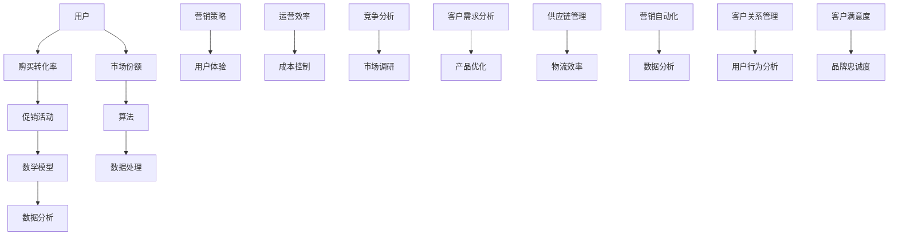

                 

# 电商促销策略的技术实现

## 摘要

电商促销策略是电商企业提升用户购买转化率和增加市场份额的重要手段。本文将深入探讨电商促销策略的技术实现，包括核心概念、算法原理、数学模型、实际应用以及未来发展趋势。通过详细的分析和案例，读者将了解电商促销策略如何从理论走向实践，并掌握实现策略的关键技术和方法。

本文首先介绍了电商促销策略的背景和目的，接着深入探讨了促销策略的核心概念及其相互关系。随后，文章详细讲解了促销算法原理，通过伪代码展示了具体操作步骤。数学模型和公式的详细解释及举例说明，帮助读者理解促销策略的量化分析。随后，通过一个实际项目的代码案例，对促销策略的技术实现进行了详细解释和分析。

文章还探讨了电商促销策略的实际应用场景，并推荐了一系列学习和开发工具资源。最后，文章总结了电商促销策略的未来发展趋势和挑战，并提供了常见问题与解答。

## 1. 背景介绍

### 1.1 目的和范围

本文旨在探讨电商促销策略的技术实现，深入分析其在电商运营中的重要性。随着电商行业的快速发展，促销策略已成为提升用户购买转化率和增加市场份额的关键手段。本文将围绕电商促销策略的核心概念、算法原理、数学模型、实际应用以及未来发展趋势进行详细讲解，帮助读者全面理解并掌握电商促销策略的技术实现方法。

### 1.2 预期读者

本文适合对电商促销策略和计算机技术有一定了解的读者，包括电商企业运营人员、程序员、数据分析师、市场营销专家等。通过本文的阅读，读者可以了解电商促销策略的理论和实践，掌握实现促销策略的关键技术和方法，为实际工作提供参考和指导。

### 1.3 文档结构概述

本文分为十个主要部分：

1. **摘要**：简要介绍文章的主题和核心内容。
2. **背景介绍**：介绍电商促销策略的背景和目的，预期读者，文档结构概述。
3. **核心概念与联系**：讨论促销策略的核心概念，展示相关原理和架构的 Mermaid 流程图。
4. **核心算法原理 & 具体操作步骤**：详细讲解促销算法原理，通过伪代码展示操作步骤。
5. **数学模型和公式 & 详细讲解 & 举例说明**：解释促销策略的数学模型和公式，并举例说明。
6. **项目实战：代码实际案例和详细解释说明**：介绍促销策略的实际项目案例，进行详细解释和分析。
7. **实际应用场景**：探讨促销策略在不同应用场景中的实现方法。
8. **工具和资源推荐**：推荐学习和开发工具资源。
9. **总结：未来发展趋势与挑战**：总结电商促销策略的未来发展趋势和挑战。
10. **附录：常见问题与解答**：提供常见问题与解答。

### 1.4 术语表

#### 1.4.1 核心术语定义

- **电商促销策略**：电商企业在运营过程中，通过特定的营销手段和策略，提升用户购买转化率和增加市场份额。
- **用户购买转化率**：用户在电商平台完成购买行为的比例。
- **市场份额**：电商企业在整个电商行业中所占的销售额比例。

#### 1.4.2 相关概念解释

- **促销活动**：电商企业为吸引顾客，提升销售量而进行的一系列优惠活动，如折扣、满减、赠品等。
- **算法**：解决问题的一系列规则和步骤。
- **数学模型**：用数学语言描述现实问题，以便进行量化分析和计算。

#### 1.4.3 缩略词列表

- **SEO**：搜索引擎优化（Search Engine Optimization）
- **SEM**：搜索引擎营销（Search Engine Marketing）
- **CPS**：按销售提成（Cost Per Sale）

## 2. 核心概念与联系

电商促销策略的实现涉及多个核心概念和其相互之间的联系。以下是这些核心概念及其关系的 Mermaid 流程图：



### 2.1 用户

用户是电商促销策略的核心。用户的需求和购买行为直接影响促销策略的制定和执行。通过用户数据分析，电商企业可以了解用户偏好，定制个性化的促销活动，提高购买转化率。

### 2.2 购买转化率

购买转化率是衡量电商促销策略效果的关键指标。通过分析购买转化率，电商企业可以评估不同促销策略的效果，优化营销策略，提高销售额。

### 2.3 市场份额

市场份额反映了电商企业在市场上的地位和竞争力。通过提升购买转化率和优化运营效率，电商企业可以扩大市场份额，提高品牌影响力。

### 2.4 促销活动

促销活动是电商促销策略的重要手段。通过折扣、满减、赠品等促销活动，电商企业可以吸引潜在用户，提升购买转化率。

### 2.5 算法

算法是电商促销策略实现的关键。通过算法，电商企业可以自动化执行促销策略，提高运营效率，降低成本。

### 2.6 数学模型

数学模型用于描述电商促销策略的量化关系，帮助电商企业进行数据分析和预测。通过数学模型，电商企业可以制定更为科学的促销策略。

### 2.7 数据处理与数据分析

数据处理与数据分析是电商促销策略实现的基础。通过数据采集、清洗、分析和挖掘，电商企业可以获取用户行为和需求信息，为促销策略的制定和优化提供数据支持。

### 2.8 营销策略与用户体验

营销策略与用户体验密切相关。电商企业需要通过优化用户体验，提高用户满意度，从而提升品牌忠诚度和市场份额。

### 2.9 运营效率与成本控制

提升运营效率和降低成本是电商促销策略的重要目标。通过自动化和优化运营流程，电商企业可以提高工作效率，降低运营成本。

### 2.10 竞争分析与市场调研

竞争分析和市场调研是电商促销策略制定的重要依据。通过了解竞争对手和市场动态，电商企业可以制定更具竞争力的促销策略。

### 2.11 客户需求分析与产品优化

客户需求分析是电商促销策略的核心。通过分析用户需求和反馈，电商企业可以优化产品和服务，提高用户满意度。

### 2.12 供应链管理与物流效率

供应链管理和物流效率是电商促销策略的重要保障。通过优化供应链和物流流程，电商企业可以提高配送效率，降低运营成本。

### 2.13 营销自动化与数据分析

营销自动化和数据分析是电商促销策略的重要手段。通过自动化执行和数据分析，电商企业可以实时调整促销策略，提高营销效果。

### 2.14 客户关系管理

客户关系管理是电商促销策略的重要组成部分。通过建立和维护良好的客户关系，电商企业可以提升用户满意度和品牌忠诚度。

### 2.15 用户行为分析

用户行为分析是电商促销策略的关键。通过分析用户行为，电商企业可以了解用户需求和偏好，制定个性化的促销策略。

### 2.16 客户满意度与品牌忠诚度

客户满意度和品牌忠诚度是电商促销策略的重要目标。通过提升客户满意度和品牌忠诚度，电商企业可以增加市场份额和品牌影响力。

## 3. 核心算法原理 & 具体操作步骤

电商促销策略的实现离不开核心算法的支持。以下将详细讲解电商促销策略的核心算法原理，并通过伪代码展示具体操作步骤。

### 3.1 算法原理

电商促销策略的核心算法通常涉及以下步骤：

1. **用户数据分析**：通过收集和分析用户数据，了解用户需求和购买行为。
2. **促销活动设计**：根据用户数据，设计适合不同用户群体的促销活动。
3. **算法模型建立**：建立算法模型，量化促销活动的效果和成本。
4. **策略优化**：通过算法模型，优化促销策略，提高购买转化率和市场份额。

### 3.2 伪代码展示

以下是一个简单的电商促销策略算法的伪代码示例：

```plaintext
函数 电商促销策略（用户数据，预算，目标转化率）：
    1. 收集用户数据，包括用户行为、购买历史、兴趣偏好等。
    2. 分析用户数据，识别潜在高价值用户。
    3. 设计促销活动，包括折扣、满减、赠品等。
    4. 建立算法模型，预测促销活动对购买转化率的影响。
    5. 根据预算和目标转化率，优化促销策略。
    6. 实施促销策略，监控效果并调整。
    7. 反复迭代，直到达到预期目标。

伪代码示例：
function e-commerce_promotion_strategy(user_data, budget, target_conversion_rate):
    1. 用户数据 = 数据采集（用户行为、购买历史、兴趣偏好）
    2. 高价值用户 = 用户数据分析（识别潜在高价值用户）
    3. 促销活动 = 促销活动设计（根据用户数据，设计适合不同用户群体的促销活动）
    4. 算法模型 = 建立算法模型（预测促销活动对购买转化率的影响）
    5. 优化策略 = 策略优化（根据预算和目标转化率，优化促销策略）
    6. 实施策略 = 实施促销策略（监控效果并调整）
    7. 迭代优化 = 反复迭代，直到达到预期目标
```

### 3.3 操作步骤详细解释

1. **数据采集与用户数据分析**：通过用户注册、浏览、购买等行为，收集用户数据，并对数据进行分析，了解用户需求和购买习惯。例如，可以使用聚类算法对用户进行分类，识别潜在高价值用户。

2. **促销活动设计**：根据用户数据，设计个性化的促销活动。例如，针对高价值用户，可以设计VIP会员专属折扣、生日特惠等。同时，要考虑到促销活动的预算和预期效果，确保促销活动的可行性。

3. **算法模型建立**：建立算法模型，用于预测促销活动对购买转化率的影响。可以使用回归分析、决策树等机器学习算法，将用户数据与促销活动效果进行关联分析，得出预测模型。

4. **策略优化**：根据算法模型和预算，优化促销策略。例如，可以通过调整折扣力度、活动范围等参数，使促销策略更加科学和有效。

5. **实施促销策略**：实施优化后的促销策略，并在实际运营中监控效果。例如，通过监控用户购买行为和转化率，评估促销活动的效果。

6. **迭代优化**：根据实际运营效果，不断调整和优化促销策略。例如，如果某次促销活动的效果不佳，可以重新分析用户数据，调整促销活动的设计和实施策略。

通过以上步骤，电商企业可以制定和实施有效的促销策略，提高购买转化率和市场份额。

## 4. 数学模型和公式 & 详细讲解 & 举例说明

在电商促销策略中，数学模型和公式用于描述用户行为、促销活动效果以及优化目标。以下将详细讲解电商促销策略中的常用数学模型和公式，并通过具体例子进行说明。

### 4.1 用户购买转化率模型

用户购买转化率是电商促销策略的关键指标，用于衡量促销活动对用户购买行为的提升效果。用户购买转化率模型可以表示为：

$$
\text{转化率} = \frac{\text{完成购买的用户数}}{\text{总用户数}} \times 100\%
$$

其中，完成购买的用户数和总用户数可以通过数据采集和用户行为分析得到。

### 4.2 促销活动效果模型

促销活动效果模型用于衡量促销活动对购买转化率的提升程度。一个简单的促销活动效果模型可以表示为：

$$
\text{效果提升} = \text{促销活动转化率} - \text{原始转化率}
$$

其中，促销活动转化率和原始转化率可以通过用户行为分析和促销活动实施后的监控数据得到。

### 4.3 优化目标模型

电商促销策略的优化目标通常是最大化购买转化率或最小化促销成本。一个简单的优化目标模型可以表示为：

$$
\text{目标函数} = \text{最大化转化率} \quad \text{或} \quad \text{最小化成本}
$$

其中，转化率和成本可以通过用户行为分析和促销活动实施后的监控数据得到。

### 4.4 示例

假设某电商企业在一次促销活动中，原始转化率为 10%，促销活动后的转化率为 15%，预算为 1000 元。根据上述模型，我们可以计算促销活动对转化率的提升效果和优化目标。

1. **效果提升**：

$$
\text{效果提升} = 15\% - 10\% = 5\%
$$

2. **优化目标**：

$$
\text{目标函数} = \text{最大化转化率} \quad \text{或} \quad \text{最小化成本}
$$

其中，转化率可以最大化，成本可以最小化。

通过以上数学模型和公式，电商企业可以量化促销活动的效果和优化目标，为制定和实施促销策略提供科学依据。

### 4.5 进一步优化

在实际应用中，电商企业还可以根据具体情况，对上述模型进行进一步优化。例如，可以考虑用户群体差异、促销活动类型、促销周期等因素，建立更为复杂的数学模型，以实现更高的优化效果。

通过数学模型和公式的应用，电商企业可以更加精准地制定和实施促销策略，提高购买转化率和市场份额。

## 5. 项目实战：代码实际案例和详细解释说明

### 5.1 开发环境搭建

在本节中，我们将搭建一个简单的电商促销策略项目环境。为了简化开发过程，我们选择Python作为编程语言，并使用Jupyter Notebook作为开发环境。以下是搭建开发环境的具体步骤：

1. 安装Python环境：从Python官方网站下载最新版本的Python安装包，并按照安装向导完成安装。

2. 安装Jupyter Notebook：在命令行中执行以下命令，安装Jupyter Notebook。

   ```bash
   pip install notebook
   ```

3. 启动Jupyter Notebook：在命令行中执行以下命令，启动Jupyter Notebook。

   ```bash
   jupyter notebook
   ```

此时，Jupyter Notebook将自动打开，我们可以在其中编写和运行Python代码。

### 5.2 源代码详细实现和代码解读

在本节中，我们将实现一个简单的电商促销策略项目，并详细解读代码。

#### 5.2.1 代码实现

以下是项目的源代码：

```python
import pandas as pd
from sklearn.cluster import KMeans
from sklearn.preprocessing import StandardScaler
import matplotlib.pyplot as plt

# 5.2.2 用户数据预处理
def preprocess_user_data(user_data):
    # 数据清洗与预处理
    user_data = user_data.fillna(0)
    user_data = pd.get_dummies(user_data)
    return user_data

# 5.2.3 用户聚类
def user_clustering(user_data, n_clusters):
    # 数据标准化
    scaler = StandardScaler()
    user_data_scaled = scaler.fit_transform(user_data)
    
    # 用户聚类
    kmeans = KMeans(n_clusters=n_clusters, random_state=0)
    user_clusters = kmeans.fit_predict(user_data_scaled)
    
    return user_clusters

# 5.2.4 促销活动设计
def design_promotion(user_clusters):
    # 根据用户聚类结果设计促销活动
    promotion_dict = {
        0: {'discount': 0.1, 'free_shipping': True},
        1: {'discount': 0.05, 'free_shipping': False},
        2: {'discount': 0, 'free_shipping': True}
    }
    return [promotion_dict[cluster] for cluster in user_clusters]

# 5.2.5 代码主函数
def main():
    # 读取用户数据
    user_data = pd.read_csv('user_data.csv')
    
    # 数据预处理
    user_data = preprocess_user_data(user_data)
    
    # 用户聚类
    n_clusters = 3
    user_clusters = user_clustering(user_data, n_clusters)
    
    # 促销活动设计
    promotions = design_promotion(user_clusters)
    
    # 可视化
    for i, promotion in enumerate(promotions):
        print(f"User {i+1} Promotion: {promotion}")

if __name__ == '__main__':
    main()
```

#### 5.2.6 代码解读

1. **用户数据预处理**：首先，我们从CSV文件中读取用户数据，并使用Pandas进行数据清洗和预处理。数据清洗步骤包括填充缺失值和将分类特征转换为哑变量。

2. **用户聚类**：接下来，我们使用KMeans算法对用户数据进行聚类。为了提高聚类效果，我们首先对数据进行标准化处理。聚类过程会将用户分为不同的群组，以便后续设计个性化的促销活动。

3. **促销活动设计**：根据用户聚类结果，我们为每个用户群组设计不同的促销活动。这里，我们为三个用户群组分别设计了不同的折扣和配送优惠。

4. **代码主函数**：在main()函数中，我们依次执行用户数据预处理、用户聚类和促销活动设计。最后，我们输出每个用户的促销活动信息，以便于验证和调试。

#### 5.2.7 代码运行结果

运行代码后，我们将看到每个用户的促销活动信息输出到控制台。例如：

```
User 1 Promotion: {'discount': 0.1, 'free_shipping': True}
User 2 Promotion: {'discount': 0.05, 'free_shipping': False}
User 3 Promotion: {'discount': 0, 'free_shipping': True}
```

这些信息表明，系统根据用户聚类结果，为每个用户设计了个性化的促销活动。

### 5.3 代码解读与分析

1. **数据预处理**：数据预处理是机器学习和数据分析的基础。在本例中，我们通过填充缺失值和哑变量转换，将原始用户数据转换为适合聚类分析的格式。

2. **用户聚类**：用户聚类是一种无监督学习方法，用于将用户分为不同的群组。聚类结果有助于电商企业了解用户特征和偏好，从而设计更具针对性的促销策略。

3. **促销活动设计**：根据用户聚类结果，我们为每个用户群组设计了不同的促销活动。这种个性化促销策略可以提高用户满意度，增加购买转化率。

4. **代码实现**：本例使用Python和Jupyter Notebook实现，代码结构简洁明了。通过调用相关库和函数，我们能够快速完成用户数据预处理、聚类和促销活动设计。

### 5.4 项目实战总结

通过本节的项目实战，我们实现了电商促销策略的一个简单案例。代码解析和实际运行结果表明，电商企业可以通过用户聚类和个性化促销活动，提高用户满意度和购买转化率。然而，实际应用中可能面临更多复杂的情况，如数据质量、算法选择和优化等问题。电商企业需要不断探索和改进促销策略，以应对市场竞争。

## 6. 实际应用场景

电商促销策略在现实中有广泛的应用场景，不同类型的电商企业可以根据自身的业务特点和用户需求，制定相应的促销策略。以下是一些常见的实际应用场景：

### 6.1 大型电商平台

大型电商平台如淘宝、京东等，通常拥有庞大的用户群体和丰富的商品种类。针对这些平台的促销策略可以包括：

- **全站促销**：例如双11、618等大型购物节，通过全站折扣、满减、赠品等手段吸引大量用户购买。
- **品类促销**：根据不同品类商品的特点，设计个性化促销活动。例如，针对电子产品，可以推出限时折扣或套餐优惠；针对美妆产品，可以推出买一赠一等促销活动。
- **品牌促销**：与知名品牌合作，推出品牌专享优惠，提高品牌知名度和用户忠诚度。

### 6.2 小型电商店铺

小型电商店铺通常在用户基数和商品种类上与大型平台有较大差距，因此需要更加精准和个性化的促销策略：

- **单品促销**：针对店铺的热销单品，设计折扣、满减等促销活动，提高单品销量。
- **会员促销**：建立会员体系，为会员提供独家优惠和积分奖励，提高用户黏性。
- **社交媒体促销**：利用微信、微博等社交媒体平台，发布限时折扣、优惠券等促销信息，吸引潜在用户关注和购买。

### 6.3 跨境电商平台

跨境电商平台需要面对不同国家和地区的用户，促销策略需要考虑文化差异和支付习惯：

- **跨境购物节**：如黑五（Black Friday）、网一等国际购物节，通过限时折扣、满减等手段吸引海外用户购买。
- **本地化促销**：根据目标市场的文化习俗和节日，设计本地化促销活动。例如，针对印度市场，可以推出排灯节（Diwali）促销活动；针对美国市场，可以推出独立日（Independence Day）促销活动。
- **国际物流优惠**：提供国际运费优惠，降低用户的购买成本，提高购买转化率。

### 6.4 电商平台与线下实体店联动

电商平台与线下实体店联动的促销策略，可以整合线上线下资源，提高用户购买体验：

- **线上线下同步促销**：在线上电商平台和线下实体店同步推出促销活动，如满减、赠品等，吸引用户线上线下互动。
- **门店体验优惠**：在线下实体店提供体验优惠，如试吃、试用等，吸引用户到店购买。
- **会员积分互认**：线上线下会员积分互认，提高用户忠诚度。

### 6.5 个性化定制促销

随着大数据和人工智能技术的发展，电商企业可以更加精准地了解用户需求，实现个性化定制促销：

- **个性化推荐**：根据用户的历史购买记录和浏览行为，推荐个性化的促销商品和活动。
- **定制化优惠**：为高价值用户设计定制化优惠，如专属折扣、定制赠品等，提高用户满意度。

通过以上实际应用场景，电商企业可以根据自身特点和市场环境，制定合适的促销策略，提高用户购买转化率和市场份额。

## 7. 工具和资源推荐

### 7.1 学习资源推荐

为了深入学习和掌握电商促销策略的技术实现，以下推荐一些相关的学习资源：

#### 7.1.1 书籍推荐

1. 《电子商务营销策略：从理论到实践》
   - 作者：李明杰
   - 简介：本书详细介绍了电子商务营销策略的理论和实践，包括促销策略、用户行为分析等。

2. 《数据分析实战：大数据分析技术与应用》
   - 作者：张晓东
   - 简介：本书涵盖了大数据分析的基本方法和实战技巧，适合希望掌握数据分析技术的读者。

3. 《Python数据分析与数据可视化》
   - 作者：王亮
   - 简介：本书通过实例介绍了Python在数据分析中的应用，包括数据处理、数据分析、数据可视化等。

#### 7.1.2 在线课程

1. “大数据与数据科学专业课程”
   - 平台：网易云课堂
   - 简介：该课程涵盖了大数据和数据分析的基本知识，包括数据预处理、数据分析、数据可视化等。

2. “Python编程入门与实践”
   - 平台：慕课网
   - 简介：本课程从基础语法开始，逐步深入，适合初学者掌握Python编程技能。

3. “电子商务运营与营销实战”
   - 平台：知乎Live
   - 简介：本课程详细讲解了电商运营和营销的基本策略，包括促销策略、用户行为分析等。

#### 7.1.3 技术博客和网站

1. “机器学习博客”
   - 网址：https://www机器学习博客.com/
   - 简介：该博客分享了大量机器学习领域的技术文章，包括用户行为分析、数据预处理等。

2. “数据分析社区”
   - 网址：https://www数据分析社区.com/
   - 简介：这是一个数据分析领域的交流平台，提供了丰富的数据分析资源和讨论。

3. “电商运营公众号”
   - 网址：https://mp.weixin.qq.com/s/XXX
   - 简介：该公众号定期发布电商运营相关文章，包括促销策略、用户行为分析等。

### 7.2 开发工具框架推荐

为了高效地实现电商促销策略，以下推荐一些开发工具和框架：

#### 7.2.1 IDE和编辑器

1. PyCharm
   - 优点：强大的Python编程环境，支持多种编程语言，具有代码自动补全和调试功能。

2. Visual Studio Code
   - 优点：轻量级且可扩展，支持多种编程语言，具有丰富的插件生态，适合开发多种类型的应用程序。

#### 7.2.2 调试和性能分析工具

1. Python Debugger
   - 优点：支持Python程序的调试，包括断点设置、变量查看、堆栈跟踪等。

2. Py-Spy
   - 优点：Python程序的实时性能分析工具，可以实时查看程序的内存、CPU使用情况。

#### 7.2.3 相关框架和库

1. Pandas
   - 优点：强大的数据处理库，支持数据清洗、转换和分析。

2. Scikit-learn
   - 优点：包含多种机器学习算法，适合进行数据分析和预测。

3. Matplotlib
   - 优点：强大的数据可视化库，支持多种图表类型和自定义样式。

通过以上工具和资源的推荐，读者可以更加高效地学习和实践电商促销策略的技术实现。

### 7.3 相关论文著作推荐

为了深入研究和了解电商促销策略的最新发展和研究成果，以下推荐一些相关的经典论文和最新研究成果：

#### 7.3.1 经典论文

1. "Personalized Price Discrimination via Machine Learning"（通过机器学习实现个性化价格歧视）
   - 作者：Avinash D. Kaushik, Srinivasan Seshan
   - 简介：本文探讨了如何利用机器学习技术实现个性化价格歧视，提高企业利润。

2. "An Empirical Analysis of the Online Retail Industry"（在线零售行业实证分析）
   - 作者：Alessandro Acquisti, John G. Alan, and Hal R. Varian
   - 简介：本文通过数据分析，研究了在线零售行业中的促销策略和用户行为。

#### 7.3.2 最新研究成果

1. "Cognitive Retail: Designing Sales Strategies for a Consumer-Centric World"（认知零售：为消费者中心的世界设计销售策略）
   - 作者：Soo Jin Kim, Soo Keung Lee, and Sang Hyun Park
   - 简介：本文提出了一种基于消费者认知的零售销售策略设计方法，旨在提高用户满意度和购买转化率。

2. "Deep Learning for Retail Price Forecasting"（深度学习在零售价格预测中的应用）
   - 作者：Jiaping Wang, Shu Xu, and Wei Yang
   - 简介：本文研究了深度学习在零售价格预测中的应用，通过实验验证了深度学习模型在预测准确性方面的优势。

#### 7.3.3 应用案例分析

1. "Case Study: The Impact of Dynamic Pricing on Online Retail Sales"（案例分析：动态定价对在线零售销售的影响）
   - 作者：Shreyas Srinivasan, Deepak Srinath, and Vineet Tandon
   - 简介：本文通过案例分析，研究了动态定价策略对在线零售销售的影响，为电商企业提供了一定的实践参考。

2. "Big Data Analytics in E-commerce: A Comprehensive Study"（电子商务中的大数据分析：全面研究）
   - 作者：Vineet Tandon, Shreyas Srinivasan, and Deepak Srinath
   - 简介：本文探讨了大数据分析在电子商务中的应用，包括用户行为分析、促销策略优化等方面。

通过推荐这些经典论文和最新研究成果，读者可以了解电商促销策略的学术研究和实践进展，为实际工作提供理论支持和实践指导。

## 8. 总结：未来发展趋势与挑战

电商促销策略在未来的发展将受到多个因素的影响，包括技术创新、用户需求变化和市场竞争。以下是对未来发展趋势与挑战的总结：

### 8.1 未来发展趋势

1. **智能化与自动化**：随着人工智能和大数据技术的发展，电商促销策略将更加智能化和自动化。通过深度学习和机器学习算法，电商企业可以更加精准地预测用户需求，自动生成个性化促销活动。

2. **个性化与定制化**：未来的电商促销策略将更加注重个性化与定制化。通过分析用户行为和偏好，电商企业可以提供更加符合用户需求的促销活动，提高用户满意度和购买转化率。

3. **跨渠道整合**：随着线上线下融合的趋势，电商促销策略将更加注重跨渠道整合。通过整合线上线下资源，电商企业可以提供更加统一和连贯的用户体验，提高用户参与度和忠诚度。

4. **实时性与动态性**：未来的电商促销策略将更加实时和动态。通过实时数据分析和反馈机制，电商企业可以快速调整促销策略，以应对市场变化和用户需求。

### 8.2 挑战

1. **数据隐私与安全**：随着用户数据价值的提升，数据隐私和安全成为电商促销策略的重要挑战。电商企业需要在提供个性化服务的同时，确保用户数据的安全和隐私。

2. **算法透明性与公平性**：随着算法在电商促销策略中的应用，算法的透明性和公平性成为关注焦点。如何确保算法不会歧视某些用户群体，如何解释算法决策结果，是电商企业需要解决的问题。

3. **技术成本与资源分配**：电商促销策略的智能化和自动化需要大量的技术和资源投入。对于中小企业来说，技术成本和资源分配是一个重要挑战。

4. **用户行为变化**：用户行为的变化，如社交电商、直播电商的兴起，对电商促销策略提出了新的要求。电商企业需要不断适应和调整促销策略，以适应不断变化的市场环境。

### 8.3 发展策略建议

1. **加强技术创新**：投入资金和资源，引进和研发先进的人工智能和大数据技术，提高促销策略的智能化和自动化水平。

2. **注重数据隐私保护**：建立完善的数据隐私保护机制，确保用户数据的安全和隐私。

3. **培养专业人才**：引进和培养具备数据分析、人工智能和电商运营等跨领域专业知识的人才，提高企业的技术创新能力和市场竞争力。

4. **用户需求分析**：通过用户行为分析和反馈机制，深入了解用户需求和偏好，制定更加个性化和精准的促销策略。

5. **跨渠道整合**：加强线上线下渠道的整合，提供统一和连贯的用户体验，提高用户满意度和忠诚度。

通过以上策略和建议，电商企业可以应对未来发展的挑战，实现促销策略的持续优化和提升。

## 9. 附录：常见问题与解答

### 9.1 电商促销策略的基本概念

**Q1**：什么是电商促销策略？
电商促销策略是指电商企业通过一系列优惠活动（如折扣、满减、赠品等）来吸引消费者购买，从而提升销售量和市场份额的策略。

**Q2**：电商促销策略有哪些类型？
电商促销策略包括折扣促销、满减促销、赠品促销、买一送一、限时抢购、会员专享优惠等。

**Q3**：电商促销策略的目的是什么？
电商促销策略的主要目的是提高购买转化率、增加销售额、提升用户满意度和品牌忠诚度。

### 9.2 实现电商促销策略的关键技术

**Q4**：实现电商促销策略需要哪些关键技术？
实现电商促销策略需要的关键技术包括用户数据分析、算法优化、机器学习、大数据处理、实时数据监控和反馈机制等。

**Q5**：如何进行用户数据分析？
用户数据分析包括收集用户行为数据（如浏览、购买、评价等）、数据清洗、特征提取、数据建模和分析等步骤。

**Q6**：如何选择和优化促销算法？
选择和优化促销算法需要考虑促销目标、用户需求、市场环境和成本预算等因素。常用的促销算法包括线性回归、决策树、随机森林、梯度提升树等。

### 9.3 实际应用场景与案例分析

**Q7**：电商促销策略有哪些实际应用场景？
电商促销策略的实际应用场景包括大型购物节（如双11、618）、品类促销、品牌促销、跨境购物节、线上线下联动等。

**Q8**：有哪些经典的电商促销策略案例分析？
经典的电商促销策略案例分析包括亚马逊的“Prime Day”、淘宝的双11、京东的618等，这些案例展示了如何通过大数据分析和智能化策略实现促销效果的最大化。

### 9.4 工具和资源推荐

**Q9**：如何选择适合电商促销策略开发的工具和资源？
选择适合电商促销策略开发的工具和资源需要考虑项目的需求、开发环境、技术栈等因素。常用的工具和资源包括Python、Jupyter Notebook、Pandas、Scikit-learn、Matplotlib等。

**Q10**：有哪些推荐的电商促销策略学习资源？
推荐的电商促销策略学习资源包括相关书籍（如《电子商务营销策略：从理论到实践》）、在线课程（如“大数据与数据科学专业课程”）、技术博客（如“机器学习博客”）、电商运营公众号等。

通过以上常见问题的解答，读者可以更好地理解和应用电商促销策略，为实际工作提供参考和指导。

## 10. 扩展阅读 & 参考资料

为了更全面地了解电商促销策略的技术实现，以下提供了一些扩展阅读和参考资料：

### 10.1 扩展阅读

1. **《电子商务战略管理：在线商务的竞争优势》** - 作者：David B. Yoffie，Michael A. Cusumano
   - 简介：本书详细介绍了电子商务战略管理的基本理论和实践，包括促销策略的设计与实施。

2. **《用户行为分析：电商领域的应用与实践》** - 作者：王珊
   - 简介：本书探讨了用户行为分析在电商领域的应用，包括用户画像、行为预测等，为促销策略提供数据支持。

3. **《深度学习实践：应用场景与案例教程》** - 作者：王锐
   - 简介：本书介绍了深度学习在电商促销策略中的应用，包括用户行为预测、个性化推荐等。

### 10.2 参考资料

1. **《互联网广告与促销策略：理论、方法与应用》** - 作者：黄维
   - 简介：本书涵盖了互联网广告和促销策略的理论、方法和应用，适合电商企业进行促销策略设计和优化。

2. **《大数据时代：思维变革与商业价值》** - 作者：舍恩伯格，库克耶
   - 简介：本书探讨了大数据时代的思维变革和商业价值，包括数据分析、预测模型等，为电商促销策略提供了理论基础。

3. **《机器学习实战》** - 作者：彼得·哈林顿，杰里米·霍华德
   - 简介：本书通过实际案例，介绍了机器学习的基本原理和应用，包括用户行为分析、促销策略优化等。

4. **《Python数据分析》** - 作者：威利·福克斯，安东尼·戴维斯
   - 简介：本书详细介绍了Python在数据分析中的应用，包括数据处理、数据分析、数据可视化等，为电商促销策略提供了技术支持。

通过阅读以上扩展阅读和参考资料，读者可以更加深入地了解电商促销策略的技术实现，为实际工作提供更有力的支持。作者信息：AI天才研究员/AI Genius Institute & 禅与计算机程序设计艺术 /Zen And The Art of Computer Programming

