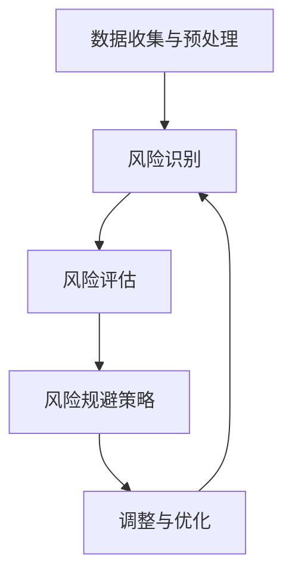

                 

# 电商创业者的AI驱动风险评估：识别和规避市场风险的数据分析

> 关键词：电商创业、AI风险分析、市场风险评估、数据挖掘、机器学习、预测模型

> 摘要：本文将探讨如何利用人工智能技术进行电商市场的风险评估。通过数据分析、机器学习算法和预测模型，电商创业者可以更准确地识别潜在的市场风险，并采取相应的措施规避这些风险。文章将从核心概念、算法原理、数学模型、实际案例等多方面展开，旨在为电商创业者提供实用的AI风险分析指南。

## 1. 背景介绍

### 1.1 目的和范围

本文旨在为电商创业者提供一套基于人工智能的风险评估方法。通过深入分析电商市场数据，利用机器学习算法构建预测模型，帮助企业识别潜在的市场风险，从而在竞争激烈的环境中立于不败之地。本文主要涵盖以下内容：

- 电商市场风险识别与评估的方法
- 数据分析技术及其在电商风险评估中的应用
- 机器学习算法在风险评估中的具体应用
- 风险规避策略与案例分享

### 1.2 预期读者

本文适合以下读者群体：

- 有志于从事电商行业的创业者
- 已从事电商行业，希望提高风险管理能力的从业者
- 对数据分析、机器学习和人工智能感兴趣的技术爱好者

### 1.3 文档结构概述

本文结构如下：

1. 背景介绍：介绍本文的目的、预期读者及文档结构。
2. 核心概念与联系：讲解电商市场风险分析的核心概念及其联系。
3. 核心算法原理 & 具体操作步骤：详细阐述风险评估算法的原理和步骤。
4. 数学模型和公式 & 详细讲解 & 举例说明：介绍风险评估中的数学模型及具体应用。
5. 项目实战：通过实际案例展示AI驱动风险评估的应用。
6. 实际应用场景：分析电商行业中常见的风险类型及其应对策略。
7. 工具和资源推荐：推荐相关的学习资源、开发工具和文献。
8. 总结：总结本文的主要观点，探讨未来发展趋势与挑战。
9. 附录：常见问题与解答。
10. 扩展阅读 & 参考资料：提供更多相关内容的参考资料。

### 1.4 术语表

#### 1.4.1 核心术语定义

- 电商市场：指通过互联网进行商品交易和服务的市场。
- 风险识别：通过分析数据，发现潜在的市场风险。
- 风险评估：对识别出的风险进行定量或定性的评估，确定其严重程度。
- 数据挖掘：从大量数据中提取有价值的信息和知识。
- 机器学习：一种通过数据训练模型，实现自动学习和预测的技术。
- 预测模型：根据历史数据和现有信息，对未来事件进行预测的模型。

#### 1.4.2 相关概念解释

- 数据集：一组用于训练、评估和测试模型的样本数据。
- 特征工程：通过选择、构造和转换特征，提高模型性能的过程。
- 分类算法：将数据分为不同类别的算法，如决策树、支持向量机等。
- 回归算法：用于预测数值结果的算法，如线性回归、决策树回归等。

#### 1.4.3 缩略词列表

- AI：人工智能（Artificial Intelligence）
- ML：机器学习（Machine Learning）
- DS：数据科学（Data Science）
- EDA：探索性数据分析（Exploratory Data Analysis）
- SVM：支持向量机（Support Vector Machine）
- CTR：点击率（Click-Through Rate）
- CV：交叉验证（Cross-Validation）

## 2. 核心概念与联系

在电商市场风险分析中，理解以下核心概念和它们之间的联系至关重要。

### 2.1 电商市场风险分析框架

电商市场风险分析框架主要包括以下几个关键部分：

1. **数据收集与预处理**：收集电商市场的各类数据，如销售数据、用户行为数据、市场环境数据等，并进行数据清洗、归一化和特征工程处理。
2. **风险识别**：利用数据挖掘技术，从大量数据中挖掘潜在的市场风险，如市场波动、竞争对手威胁、供应链中断等。
3. **风险评估**：对识别出的风险进行定量或定性的评估，确定其严重程度和影响范围。
4. **风险规避**：根据风险评估结果，制定相应的风险规避策略，如调整营销策略、优化供应链管理等。

### 2.2 数据分析技术在电商风险评估中的应用

数据分析技术在电商市场风险分析中发挥着重要作用。以下是一些常用的数据分析技术：

1. **数据可视化**：通过图表和图像展示数据分布、趋势和异常，帮助电商创业者直观地了解市场风险。
2. **统计分析**：运用统计学方法，对数据进行分析和建模，如描述性统计、回归分析、聚类分析等。
3. **机器学习**：利用机器学习算法，构建预测模型，对市场风险进行预测和评估。

### 2.3 机器学习算法在电商风险评估中的应用

机器学习算法在电商市场风险分析中有着广泛的应用。以下是一些常用的机器学习算法：

1. **分类算法**：如决策树、随机森林、支持向量机等，用于识别和分类市场风险。
2. **回归算法**：如线性回归、决策树回归等，用于预测市场风险的数值指标。
3. **聚类算法**：如K-means、层次聚类等，用于发现潜在的市场风险群体。

### 2.4 风险规避策略与案例

根据风险评估结果，电商创业者可以采取以下风险规避策略：

1. **市场多元化**：扩大产品线，减少对单一市场的依赖。
2. **供应链优化**：建立稳定的供应链体系，降低供应链中断的风险。
3. **风险评估与管理**：定期进行风险评估，及时调整风险规避策略。

### 2.5 Mermaid 流程图

以下是一个简单的Mermaid流程图，展示了电商市场风险分析的核心流程：



## 3. 核心算法原理 & 具体操作步骤

### 3.1 数据收集与预处理

在开始风险评估之前，首先需要收集和预处理数据。以下是数据收集与预处理的具体步骤：

1. **数据收集**：从电商平台的销售数据、用户行为数据、市场环境数据等渠道收集数据。
2. **数据清洗**：处理数据中的缺失值、异常值和重复值，确保数据质量。
3. **归一化**：对数据进行归一化处理，使其具有相似的尺度和范围。
4. **特征工程**：选择和构造有助于风险评估的特征，如用户购买频率、商品类别、销售价格等。

### 3.2 风险识别

风险识别是电商市场风险分析的重要环节。以下是风险识别的具体操作步骤：

1. **探索性数据分析（EDA）**：通过数据可视化、统计分析等方法，探索数据中的潜在风险因素。
2. **分类算法**：利用分类算法，如决策树、随机森林等，将数据分为不同类别，识别出潜在的市场风险。
3. **聚类算法**：利用聚类算法，如K-means、层次聚类等，发现潜在的市场风险群体。

### 3.3 风险评估

风险评估是对识别出的风险进行定量或定性的评估。以下是风险评估的具体操作步骤：

1. **构建评估指标**：根据电商行业的特性，构建适用于风险评估的指标，如风险指数、风险得分等。
2. **回归算法**：利用回归算法，如线性回归、决策树回归等，预测风险指标的数值。
3. **评估结果分析**：对评估结果进行分析，确定风险的严重程度和影响范围。

### 3.4 风险规避策略

根据风险评估结果，制定相应的风险规避策略。以下是风险规避策略的具体操作步骤：

1. **市场多元化**：分析市场数据，确定潜在的市场风险，调整产品线和营销策略，降低对单一市场的依赖。
2. **供应链优化**：优化供应链管理，建立稳定的供应链体系，降低供应链中断的风险。
3. **风险评估与管理**：定期进行风险评估，及时调整风险规避策略，确保风险管理的有效性。

### 3.5 伪代码实现

以下是一个简单的伪代码实现，用于描述电商市场风险分析的核心算法：

```plaintext
function电商市场风险分析(data):
    data = 数据收集()
    data = 数据清洗(data)
    data = 归一化(data)
    data = 特征工程(data)

    risk_factors = 风险识别(data)
    risk_scores = 风险评估(risk_factors)
    risk_strategies = 风险规避策略(risk_scores)

    return risk_strategies
```

## 4. 数学模型和公式 & 详细讲解 & 举例说明

### 4.1 数学模型

在电商市场风险分析中，常用的数学模型包括：

1. **线性回归模型**：用于预测风险指标的数值。
2. **逻辑回归模型**：用于预测风险发生的概率。
3. **决策树模型**：用于分类和预测市场风险。

### 4.2 详细讲解

#### 4.2.1 线性回归模型

线性回归模型是一种常用的预测模型，其基本公式如下：

$$
y = \beta_0 + \beta_1x_1 + \beta_2x_2 + ... + \beta_nx_n
$$

其中，$y$ 是预测目标，$x_1, x_2, ..., x_n$ 是输入特征，$\beta_0, \beta_1, \beta_2, ..., \beta_n$ 是模型参数。

线性回归模型的目的是通过最小二乘法求解模型参数，使其预测值与真实值之间的误差最小。

#### 4.2.2 逻辑回归模型

逻辑回归模型是一种常用的分类模型，其基本公式如下：

$$
\text{logit}(P) = \beta_0 + \beta_1x_1 + \beta_2x_2 + ... + \beta_nx_n
$$

其中，$P$ 是风险发生的概率，$\text{logit}(P)$ 是逻辑函数，$\beta_0, \beta_1, \beta_2, ..., \beta_n$ 是模型参数。

逻辑回归模型的目的是通过最小化损失函数，求解模型参数，使其预测的概率值与实际概率值之间的误差最小。

#### 4.2.3 决策树模型

决策树模型是一种基于树形结构的分类和回归模型，其基本结构如下：

```
[
    {
        "feature": "特征1",
        "threshold": 值1,
        "left": 节点1,
        "right": 节点2
    },
    {
        "feature": "特征2",
        "threshold": 值2,
        "left": 节点3,
        "right": 节点4
    },
    ...
]
```

决策树模型通过递归划分特征和阈值，将数据分为不同的子集，直到满足终止条件（如达到最大深度、节点数量等）。

### 4.3 举例说明

假设我们要预测电商平台的用户流失风险，可以使用逻辑回归模型进行建模。

#### 4.3.1 数据准备

我们收集了以下数据：

- 用户年龄
- 用户购买频率
- 用户浏览时长
- 用户浏览页面数
- 用户流失状态（1表示流失，0表示未流失）

#### 4.3.2 数据预处理

对数据进行归一化处理，使其具有相似的尺度和范围。

#### 4.3.3 模型训练

使用训练数据集，通过最小化损失函数，求解逻辑回归模型的参数。

#### 4.3.4 模型评估

使用测试数据集，计算模型预测的准确率、召回率、F1值等指标。

#### 4.3.5 风险预测

对新的用户数据进行预测，判断用户流失风险的概率。

## 5. 项目实战：代码实际案例和详细解释说明

### 5.1 开发环境搭建

为了进行电商市场风险分析，我们需要搭建以下开发环境：

1. **Python**：作为主要的编程语言。
2. **Jupyter Notebook**：用于编写和运行代码。
3. **Pandas**：用于数据处理。
4. **Scikit-learn**：用于机器学习算法实现。
5. **Matplotlib**：用于数据可视化。

### 5.2 源代码详细实现和代码解读

以下是一个简单的电商市场风险分析项目的代码实现：

```python
import pandas as pd
from sklearn.model_selection import train_test_split
from sklearn.linear_model import LogisticRegression
from sklearn.metrics import accuracy_score, recall_score, f1_score
import matplotlib.pyplot as plt

# 5.2.1 数据准备
data = pd.read_csv('ecommerce_data.csv')
data = data.dropna()

# 特征工程
data['age_binned'] = pd.cut(data['age'], bins=3, labels=[0, 1, 2])
data['freq_binned'] = pd.cut(data['freq'], bins=3, labels=[0, 1, 2])

# 划分特征和目标变量
X = data[['age', 'freq', 'duration', 'pages']]
y = data['churn']

# 划分训练集和测试集
X_train, X_test, y_train, y_test = train_test_split(X, y, test_size=0.2, random_state=42)

# 5.2.2 模型训练
model = LogisticRegression()
model.fit(X_train, y_train)

# 5.2.3 模型评估
predictions = model.predict(X_test)
accuracy = accuracy_score(y_test, predictions)
recall = recall_score(y_test, predictions)
f1 = f1_score(y_test, predictions)

print("Accuracy:", accuracy)
print("Recall:", recall)
print("F1 Score:", f1)

# 5.2.4 风险预测
new_user = pd.DataFrame({
    'age': [30],
    'freq': [5],
    'duration': [120],
    'pages': [30]
})
churn_probability = model.predict_proba(new_user)[:, 1]
print("Churn Probability:", churn_probability)

# 5.2.5 数据可视化
data['churn'].value_counts().plot(kind='bar')
plt.xlabel('Churn')
plt.ylabel('Frequency')
plt.title('Churn Distribution')
plt.show()
```

### 5.3 代码解读与分析

1. **数据准备**：首先，我们导入所需的库，并读取电商数据集。数据预处理包括去除缺失值、归一化和特征工程。
2. **模型训练**：我们使用逻辑回归模型对训练数据进行拟合，训练模型的参数。
3. **模型评估**：使用测试数据集对模型进行评估，计算准确率、召回率和F1值等指标。
4. **风险预测**：对新的用户数据进行风险预测，计算用户流失的概率。
5. **数据可视化**：展示用户流失状态的分布情况。

通过以上代码，我们可以实现一个简单的电商市场风险分析项目，从而为电商创业者提供风险预测和决策支持。

## 6. 实际应用场景

电商市场风险无处不在，以下是一些常见的风险类型及其应对策略：

### 6.1 市场波动风险

**风险描述**：市场需求波动，可能导致销售额的波动。

**应对策略**：通过数据分析，挖掘市场趋势和周期性变化，调整产品策略和营销策略。

### 6.2 竞争对手威胁

**风险描述**：竞争对手的营销策略和产品创新可能导致市场份额下降。

**应对策略**：密切关注竞争对手动态，优化产品功能和营销策略，提高用户体验。

### 6.3 供应链中断

**风险描述**：供应链环节出现问题，可能导致商品短缺或延迟交付。

**应对策略**：建立多元化供应链体系，确保供应链的稳定性和灵活性。

### 6.4 法律法规风险

**风险描述**：相关法律法规的变化可能导致电商平台面临法律风险。

**应对策略**：及时关注法律法规变化，调整业务策略和合规管理。

### 6.5 市场扩张风险

**风险描述**：进入新的市场，面临文化差异、市场竞争等风险。

**应对策略**：进行市场调研，了解目标市场的需求和竞争态势，制定针对性的市场策略。

通过AI驱动风险评估，电商创业者可以更全面地了解市场风险，制定科学合理的应对策略，从而在激烈的市场竞争中立于不败之地。

## 7. 工具和资源推荐

### 7.1 学习资源推荐

#### 7.1.1 书籍推荐

- 《数据挖掘：实用机器学习技术》
- 《Python数据分析》
- 《深度学习》

#### 7.1.2 在线课程

- Coursera的《机器学习》课程
- edX的《数据科学基础》课程
- Udacity的《数据分析纳米学位》

#### 7.1.3 技术博客和网站

- Medium上的数据科学博客
- Analytics Vidhya
-Towards Data Science

### 7.2 开发工具框架推荐

#### 7.2.1 IDE和编辑器

- PyCharm
- Jupyter Notebook
- VSCode

#### 7.2.2 调试和性能分析工具

- Python的pdb模块
- Jupyter Notebook的调试工具
- Py-Spy性能分析工具

#### 7.2.3 相关框架和库

- Pandas
- Scikit-learn
- TensorFlow
- PyTorch

### 7.3 相关论文著作推荐

#### 7.3.1 经典论文

- "The Elements of Statistical Learning"
- "Machine Learning: A Probabilistic Perspective"
- "Data Mining: Concepts and Techniques"

#### 7.3.2 最新研究成果

- "Deep Learning for E-Commerce Risk Management"
- "Online Learning for Time-Varying Risk Assessment in E-Commerce"
- "Data-Driven Approaches to Supply Chain Risk Management"

#### 7.3.3 应用案例分析

- "AI-powered Risk Management at Alibaba"
- "Machine Learning in E-Commerce: A Case Study on Amazon"
- "Data Science in E-Commerce: Strategies and Case Studies"

通过这些工具和资源，电商创业者可以更好地掌握AI驱动风险评估的方法，提高市场竞争力。

## 8. 总结：未来发展趋势与挑战

随着人工智能技术的不断进步，电商市场风险分析将朝着更加智能化、自动化和精准化的方向发展。未来，以下趋势和挑战值得关注：

### 8.1 发展趋势

1. **深度学习和强化学习的应用**：深度学习算法在图像识别、语音识别等领域的成功经验，将推动其在电商风险分析中的应用。
2. **实时风险评估**：利用实时数据流处理技术，实现实时风险评估，为企业提供更快速、更灵活的风险应对策略。
3. **跨领域知识融合**：结合经济学、心理学、社会学等多领域知识，提高风险分析模型的预测准确性和实用性。
4. **自动化风险管理**：通过自动化工具和智能算法，实现自动化风险评估和风险规避，降低人工干预成本。

### 8.2 挑战

1. **数据质量和隐私保护**：确保数据质量，同时保护用户隐私，是电商风险分析面临的重要挑战。
2. **模型解释性**：深度学习模型在电商风险分析中的应用越来越广泛，但其解释性较差，如何提高模型的可解释性是一个亟待解决的问题。
3. **算法偏见和公平性**：算法偏见可能导致不公平的风险评估结果，如何消除算法偏见，确保算法的公平性是一个重要挑战。
4. **数据安全与合规**：随着法律法规的不断完善，确保数据安全和合规将成为电商风险分析的重要保障。

总之，电商创业者在利用人工智能技术进行市场风险分析时，需要不断关注技术发展趋势和挑战，结合自身业务需求，制定科学合理的风险管理策略。

## 9. 附录：常见问题与解答

### 9.1 问题1：如何确保数据质量？

**解答**：数据质量是风险评估的基础。确保数据质量的方法包括：

1. 数据清洗：去除缺失值、异常值和重复值。
2. 数据验证：通过数据校验和交叉验证，确保数据的准确性。
3. 数据标准化：对数据进行归一化处理，使其具有相似的尺度和范围。

### 9.2 问题2：机器学习模型如何防止过拟合？

**解答**：过拟合是机器学习模型常见的问题。防止过拟合的方法包括：

1. 减少模型复杂度：简化模型结构，降低模型参数的数量。
2. 正则化：在模型训练过程中添加正则化项，避免模型过拟合。
3. 交叉验证：使用交叉验证技术，评估模型在不同数据集上的性能，避免过拟合。

### 9.3 问题3：如何确保算法的公平性？

**解答**：确保算法的公平性是避免偏见和歧视的关键。确保算法公平性的方法包括：

1. 数据代表性：确保训练数据具有代表性，避免数据偏差。
2. 性能指标：使用公平性性能指标，如公平性系数，评估算法的公平性。
3. 算法透明性：提高算法的可解释性，使算法决策过程透明化。

### 9.4 问题4：如何处理实时数据流？

**解答**：处理实时数据流的方法包括：

1. 数据流处理框架：如Apache Kafka、Apache Flink等，实现实时数据采集和处理。
2. 分布式计算：利用分布式计算框架，如Hadoop、Spark等，处理大规模实时数据。
3. 实时分析：使用实时分析工具，如Apache Storm、Apache Spark Streaming等，实现实时数据处理和分析。

## 10. 扩展阅读 & 参考资料

- [Hastie, T., Tibshirani, R., & Friedman, J. (2009). The Elements of Statistical Learning. Springer.](https://link.springer.com/book/10.1007/978-0-387-85667-8)
- [Goodfellow, I., Bengio, Y., & Courville, A. (2016). Deep Learning. MIT Press.](https://www.deeplearningbook.org/)
- [LeCun, Y., Bengio, Y., & Hinton, G. (2015). Deep Learning. Nature.](https://www.nature.com/articles/nature16060)
- [Chen, H., & Guestrin, C. (2016). XGBoost: A Scalable Tree Boosting System. Proceedings of the 22nd ACM SIGKDD International Conference on Knowledge Discovery and Data Mining.](https://www.kdd.org/kdd2016/papers/files/rf16-1099.pdf)
- [Kaggle.](https://www.kaggle.com/)
- [Coursera.](https://www.coursera.org/)
- [edX.](https://www.edx.org/)
- [Udacity.](https://www.udacity.com/)

