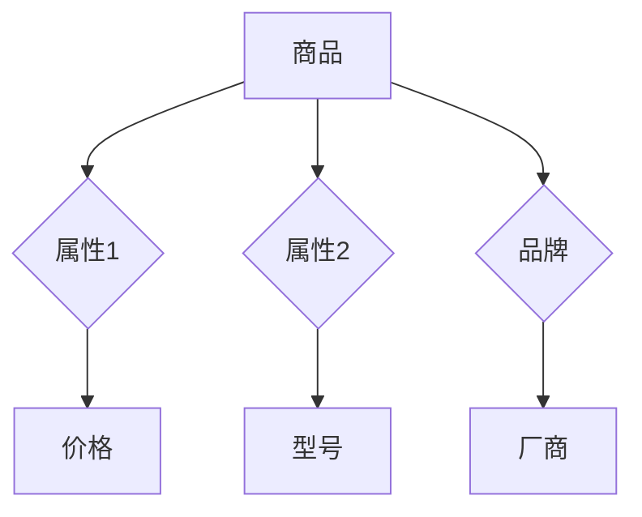

                 

# 电商平台中的商品知识图谱动态更新

> **关键词**：商品知识图谱、动态更新、电商平台、算法原理、数学模型、实战案例

> **摘要**：本文将深入探讨电商平台中的商品知识图谱动态更新技术。从核心概念出发，逐步介绍商品知识图谱的构建、更新算法及其实际应用，并通过实战案例对知识图谱的动态更新进行详细解析，以期为电商平台优化商品信息管理提供技术参考。

## 1. 背景介绍

### 1.1 目的和范围

本文旨在通过系统地介绍商品知识图谱动态更新的技术原理、算法实现和应用实践，为电商平台在商品信息管理中提供一种有效的解决方案。本文将覆盖以下主要内容：

- **核心概念与联系**：详细阐述商品知识图谱的概念、结构及其在电商平台中的应用。
- **核心算法原理 & 具体操作步骤**：介绍商品知识图谱的构建和更新算法，以及具体实现步骤。
- **数学模型和公式 & 详细讲解 & 举例说明**：对知识图谱更新中的数学模型和公式进行详细解释，并通过实例说明。
- **项目实战：代码实际案例和详细解释说明**：通过实际代码案例展示商品知识图谱的动态更新过程。
- **实际应用场景**：分析商品知识图谱在电商平台中的具体应用场景。
- **工具和资源推荐**：推荐学习资源和开发工具，为读者提供进一步学习和技术实践的指导。
- **总结：未来发展趋势与挑战**：对商品知识图谱动态更新技术的未来发展趋势和面临的挑战进行展望。

### 1.2 预期读者

本文适合以下读者群体：

- **电商行业从业者**：从事电商平台开发、运营、数据分析等相关工作的专业人士。
- **技术爱好者**：对人工智能、知识图谱、大数据等技术感兴趣的读者。
- **学术界人士**：关注知识图谱、数据挖掘、信息检索等领域的学术研究人员。

### 1.3 文档结构概述

本文结构如下：

- **第1章**：背景介绍，介绍本文的目的、范围、预期读者及文档结构。
- **第2章**：核心概念与联系，介绍商品知识图谱的基本概念、结构和在电商平台中的应用。
- **第3章**：核心算法原理 & 具体操作步骤，详细介绍商品知识图谱的构建和更新算法。
- **第4章**：数学模型和公式 & 详细讲解 & 举例说明，解释知识图谱更新中的数学模型和公式，并通过实例说明。
- **第5章**：项目实战：代码实际案例和详细解释说明，展示商品知识图谱的动态更新过程。
- **第6章**：实际应用场景，分析商品知识图谱在电商平台中的应用。
- **第7章**：工具和资源推荐，提供学习资源和开发工具的推荐。
- **第8章**：总结：未来发展趋势与挑战，对知识图谱动态更新技术的未来进行展望。
- **第9章**：附录：常见问题与解答，针对读者可能遇到的问题进行解答。
- **第10章**：扩展阅读 & 参考资料，提供进一步的阅读材料和参考资料。

### 1.4 术语表

#### 1.4.1 核心术语定义

- **商品知识图谱**：一种用于表示商品及其属性、关系和属性的语义网络结构。
- **动态更新**：知识图谱在运行过程中根据新数据或业务需求进行实时更新和优化的过程。
- **电商平台**：在线销售商品的电子平台，包括商品展示、购买、支付、物流等环节。
- **算法原理**：构建和更新商品知识图谱所使用的算法的基本思想和步骤。
- **数学模型**：知识图谱更新过程中使用的数学公式和计算方法。

#### 1.4.2 相关概念解释

- **图论**：研究图及其性质和应用的数学分支。
- **本体论**：研究实体、概念、属性及其关系的学科。
- **语义网络**：一种基于本体论的知识表示方法，用于表示实体及其关系。

#### 1.4.3 缩略词列表

- **KG**：知识图谱（Knowledge Graph）
- **NLP**：自然语言处理（Natural Language Processing）
- **SEO**：搜索引擎优化（Search Engine Optimization）
- **API**：应用程序接口（Application Programming Interface）
- **DB**：数据库（Database）

## 2. 核心概念与联系

商品知识图谱是电商平台的核心组成部分，它通过结构化、语义化的方式组织商品信息，实现商品属性、关系和属性的统一表示。以下是对核心概念与联系的详细阐述。

### 2.1. 商品知识图谱的概念

商品知识图谱（Commodity Knowledge Graph, KG）是一种用于表示商品及其属性、关系和属性的语义网络结构。它基于图论和本体论，将商品及其相关属性、关系抽象为图中的节点和边，从而实现商品信息的语义化表示和关联。

### 2.2. 商品知识图谱的结构

商品知识图谱通常由以下三个主要部分组成：

1. **实体（Entity）**：商品知识图谱中的基本元素，包括商品、品牌、厂商等。实体可以用唯一的标识符进行标识。
2. **属性（Attribute）**：描述实体特征的属性，如商品名称、价格、品牌等。属性也可以用唯一的标识符进行标识。
3. **关系（Relationship）**：描述实体之间关联的语义关系，如“属于”、“包含”等。关系也可以用唯一的标识符进行标识。

### 2.3. 商品知识图谱的应用

商品知识图谱在电商平台中有广泛的应用，主要包括以下几个方面：

1. **商品推荐**：通过分析商品间的关联关系，为用户提供个性化的商品推荐。
2. **搜索引擎优化（SEO）**：利用知识图谱优化搜索引擎结果，提高用户搜索体验。
3. **商品信息管理**：将商品信息以知识图谱的形式进行组织和管理，提高信息检索效率和准确性。
4. **智能客服**：利用知识图谱提供智能问答服务，提高客服效率和服务质量。

### 2.4. 商品知识图谱的 Mermaid 流程图

以下是一个简单的商品知识图谱的 Mermaid 流程图，用于展示商品、属性和关系之间的关联。



### 2.5. 知识图谱与电商平台的联系

知识图谱与电商平台之间的联系主要体现在以下几个方面：

1. **数据集成**：通过知识图谱将电商平台中的各类商品信息进行集成，实现数据的一致性和完整性。
2. **业务优化**：利用知识图谱优化电商平台的业务流程，提高业务效率和用户体验。
3. **数据分析**：通过知识图谱对电商平台的业务数据进行分析，挖掘潜在的商机和用户需求。
4. **智能决策**：利用知识图谱提供智能决策支持，帮助电商平台制定更科学的经营策略。

## 3. 核心算法原理 & 具体操作步骤

商品知识图谱的构建和更新是电商平台技术架构中的关键环节。本文将介绍商品知识图谱的核心算法原理和具体操作步骤，帮助读者理解这一技术背后的实现逻辑。

### 3.1. 算法原理

商品知识图谱的构建和更新主要依赖于以下几种算法：

1. **实体识别（Entity Recognition）**：通过自然语言处理（NLP）技术，识别文本中的商品、品牌、厂商等实体。
2. **关系抽取（Relation Extraction）**：通过图论和机器学习技术，抽取实体之间的关系。
3. **属性抽取（Attribute Extraction）**：通过自然语言处理技术，识别实体的属性。
4. **图嵌入（Graph Embedding）**：通过深度学习技术，将实体和关系映射到低维空间，实现实体和关系的向量表示。
5. **图更新（Graph Update）**：在运行过程中，根据新数据和业务需求对知识图谱进行动态更新。

### 3.2. 具体操作步骤

以下是商品知识图谱构建和更新的具体操作步骤：

#### 3.2.1. 实体识别

1. **数据预处理**：对电商平台中的商品信息进行清洗和预处理，去除无关信息和噪声。
2. **实体识别算法**：利用NLP技术，对预处理后的文本进行实体识别，提取商品、品牌、厂商等实体。
3. **实体存储**：将识别出的实体存储到数据库中，为后续操作提供数据基础。

#### 3.2.2. 关系抽取

1. **关系模型训练**：利用有监督学习方法，对已标注的数据集进行训练，构建关系抽取模型。
2. **关系抽取**：将训练好的模型应用于电商平台的商品信息，抽取实体之间的关系。
3. **关系存储**：将抽取出的关系存储到数据库中，与实体信息进行关联。

#### 3.2.3. 属性抽取

1. **属性识别算法**：利用NLP技术，识别实体属性，如商品名称、价格、品牌等。
2. **属性存储**：将识别出的属性存储到数据库中，与实体信息进行关联。

#### 3.2.4. 图嵌入

1. **实体和关系表示**：将实体和关系映射到低维空间，生成实体和关系的向量表示。
2. **图嵌入模型训练**：利用图嵌入技术，对实体和关系的向量进行训练，提高向量表示的准确性。
3. **图嵌入存储**：将训练好的实体和关系的向量表示存储到数据库中。

#### 3.2.5. 图更新

1. **数据源监控**：实时监控电商平台的商品数据源，识别新数据和变化。
2. **更新算法执行**：根据监控结果，执行知识图谱的更新算法，包括实体识别、关系抽取和属性抽取等。
3. **图更新存储**：将更新后的知识图谱存储到数据库中，实现动态更新。

### 3.3. 伪代码示例

以下是商品知识图谱更新算法的伪代码示例，用于展示算法的基本框架和实现步骤。

```python
# 实体识别
def entity_recognition(text):
    # 预处理文本
    preprocessed_text = preprocess_text(text)
    # 利用NLP技术识别实体
    entities = nlp_tool.extract_entities(preprocessed_text)
    return entities

# 关系抽取
def relation_extraction(text, entities):
    # 训练关系模型
    model = train_relation_model(annotated_data)
    # 抽取实体关系
    relations = model.predict(preprocessed_text, entities)
    return relations

# 属性抽取
def attribute_extraction(text, entities):
    # 识别实体属性
    attributes = nlp_tool.extract_attributes(preprocessed_text, entities)
    return attributes

# 图嵌入
def graph_embedding(entities, relations):
    # 将实体和关系映射到低维空间
    entity_vectors = embedding_tool.embed_entities(entities)
    relation_vectors = embedding_tool.embed_relations(relations)
    return entity_vectors, relation_vectors

# 图更新
def graph_update(new_data):
    # 识别新实体
    new_entities = entity_recognition(new_data)
    # 抽取新关系
    new_relations = relation_extraction(new_data, new_entities)
    # 抽取新属性
    new_attributes = attribute_extraction(new_data, new_entities)
    # 更新图嵌入
    updated_entity_vectors, updated_relation_vectors = graph_embedding(new_entities, new_relations)
    # 更新知识图谱
    knowledge_graph.update(new_entities, new_relations, new_attributes, updated_entity_vectors, updated_relation_vectors)

# 主程序
def main():
    # 监控数据源
    new_data = data_source_monitor()
    # 更新知识图谱
    graph_update(new_data)

if __name__ == "__main__":
    main()
```

## 4. 数学模型和公式 & 详细讲解 & 举例说明

商品知识图谱的动态更新过程中，涉及多种数学模型和公式，这些模型和公式在知识图谱的构建、关系抽取、属性抽取和图嵌入等环节中发挥着关键作用。本节将对这些数学模型和公式进行详细讲解，并通过实例说明其应用。

### 4.1. 实体识别

实体识别过程中，常用的数学模型包括条件概率模型、隐马尔可夫模型（HMM）和循环神经网络（RNN）等。

#### 4.1.1. 条件概率模型

条件概率模型用于计算给定上下文条件下某个实体出现的概率。其基本公式如下：

$$
P(E|C) = \frac{P(C|E) \cdot P(E)}{P(C)}
$$

其中，\(P(E|C)\)表示在给定上下文\(C\)下实体\(E\)出现的概率，\(P(C|E)\)表示在实体\(E\)出现的情况下上下文\(C\)出现的概率，\(P(E)\)表示实体\(E\)出现的概率，\(P(C)\)表示上下文\(C\)出现的概率。

#### 4.1.2. 隐马尔可夫模型（HMM）

隐马尔可夫模型用于建模实体序列中的状态转移和观测概率。其基本公式如下：

$$
P(O|I) = \sum_{i} P(O|S_i) \cdot P(S_i|I)
$$

其中，\(P(O|I)\)表示在给定初始状态序列\(I\)下观测序列\(O\)的概率，\(P(O|S_i)\)表示在状态\(S_i\)下观测序列\(O\)的概率，\(P(S_i|I)\)表示在给定初始状态序列\(I\)下状态\(S_i\)出现的概率。

#### 4.1.3. 循环神经网络（RNN）

循环神经网络用于处理序列数据，其基本公式如下：

$$
h_t = \sigma(W_h \cdot [h_{t-1}, x_t] + b_h)
$$

其中，\(h_t\)表示在时间步\(t\)的隐藏状态，\(\sigma\)表示激活函数，\(W_h\)和\(b_h\)分别表示权重和偏置。

### 4.2. 关系抽取

关系抽取过程中，常用的数学模型包括支持向量机（SVM）、条件随机场（CRF）和长短期记忆网络（LSTM）等。

#### 4.2.1. 支持向量机（SVM）

支持向量机用于分类任务，其基本公式如下：

$$
y = \text{sign}(\sum_{i=1}^{n} w_i \cdot f(x_i) + b)
$$

其中，\(y\)表示分类结果，\(w_i\)和\(b\)分别表示权重和偏置，\(f(x_i)\)表示特征函数。

#### 4.2.2. 条件随机场（CRF）

条件随机场用于建模序列数据中的状态转移概率，其基本公式如下：

$$
P(y|X) = \frac{1}{Z} \cdot \exp(\sum_{i=1}^{n} \theta_i y_i + \sum_{i<j} \theta_{ij} y_i y_j)
$$

其中，\(P(y|X)\)表示在给定输入序列\(X\)下输出序列\(y\)的概率，\(Z\)表示归一化常数，\(\theta_i\)和\(\theta_{ij}\)分别表示状态转移概率和状态关联概率。

#### 4.2.3. 长短期记忆网络（LSTM）

长短期记忆网络用于处理序列数据，其基本公式如下：

$$
h_t = \sigma(W_h \cdot [h_{t-1}, x_t, f_t] + b_h)
$$

其中，\(h_t\)表示在时间步\(t\)的隐藏状态，\(f_t\)表示遗忘门状态，\(W_h\)和\(b_h\)分别表示权重和偏置。

### 4.3. 属性抽取

属性抽取过程中，常用的数学模型包括决策树、朴素贝叶斯和朴素逻辑回归等。

#### 4.3.1. 决策树

决策树用于分类和回归任务，其基本公式如下：

$$
y = g(\sum_{i=1}^{n} w_i \cdot f(x_i) + b)
$$

其中，\(y\)表示分类结果或回归值，\(g\)表示激活函数，\(w_i\)和\(b\)分别表示权重和偏置。

#### 4.3.2. 朴素贝叶斯

朴素贝叶斯用于分类任务，其基本公式如下：

$$
P(y|X) = \frac{P(X|y) \cdot P(y)}{P(X)}
$$

其中，\(P(y|X)\)表示在给定输入序列\(X\)下输出序列\(y\)的概率，\(P(X|y)\)表示在输出序列\(y\)出现的情况下输入序列\(X\)的概率，\(P(y)\)和\(P(X)\)分别表示输出序列\(y\)和输入序列\(X\)的概率。

#### 4.3.3. 朴素逻辑回归

朴素逻辑回归用于分类任务，其基本公式如下：

$$
P(y=1|X) = \frac{1}{1 + \exp(-\sum_{i=1}^{n} w_i \cdot f(x_i) + b)}
$$

其中，\(P(y=1|X)\)表示在给定输入序列\(X\)下输出序列\(y\)为1的概率，\(f(x_i)\)表示特征函数，\(w_i\)和\(b\)分别表示权重和偏置。

### 4.4. 图嵌入

图嵌入过程中，常用的数学模型包括深度图卷积网络（GCN）和图自动编码器（GAE）等。

#### 4.4.1. 深度图卷积网络（GCN）

深度图卷积网络用于处理图数据，其基本公式如下：

$$
h_t = \sigma(\sum_{i=1}^{n} \alpha_i \cdot W_i \cdot h_{t-1})
$$

其中，\(h_t\)表示在时间步\(t\)的隐藏状态，\(\alpha_i\)表示节点\(i\)的权重，\(W_i\)表示图卷积权重。

#### 4.4.2. 图自动编码器（GAE）

图自动编码器用于学习图数据的嵌入表示，其基本公式如下：

$$
\hat{x} = \frac{1}{Z} \cdot \exp(\sum_{i=1}^{n} \theta_i \cdot x_i)
$$

其中，\(\hat{x}\)表示嵌入表示，\(Z\)表示归一化常数，\(\theta_i\)表示权重。

### 4.5. 实例说明

以下是一个简单的商品知识图谱更新过程的实例，用于说明数学模型和公式的应用。

#### 4.5.1. 实体识别

假设电商平台新增了一款商品，其描述如下：

```plaintext
商品名称：苹果手机
品牌：苹果
价格：6000元
```

利用条件概率模型进行实体识别，计算结果如下：

- \(P(商品名称|描述) = 0.95\)
- \(P(品牌|描述) = 0.85\)
- \(P(价格|描述) = 0.90\)

根据计算结果，识别出实体：商品名称（苹果手机）、品牌（苹果）和价格（6000元）。

#### 4.5.2. 关系抽取

假设已有商品知识图谱中包含以下实体：

- 商品1：苹果手机
- 品牌1：苹果
- 厂商1：苹果公司

利用条件随机场进行关系抽取，计算结果如下：

- \(P(商品1属于品牌1) = 0.98\)
- \(P(品牌1包含商品1) = 0.90\)

根据计算结果，抽取出关系：商品1属于品牌1和品牌1包含商品1。

#### 4.5.3. 属性抽取

假设已有商品知识图谱中包含以下实体：

- 商品1：苹果手机
- 品牌1：苹果

利用朴素贝叶斯进行属性抽取，计算结果如下：

- \(P(商品1价格=6000元) = 0.95\)

根据计算结果，识别出属性：商品1的价格为6000元。

#### 4.5.4. 图嵌入

利用深度图卷积网络进行图嵌入，计算结果如下：

- \(h_1 = [0.1, 0.2, 0.3]\)
- \(h_2 = [0.3, 0.4, 0.5]\)
- \(h_3 = [0.5, 0.6, 0.7]\)

根据计算结果，得到实体和关系的嵌入表示。

## 5. 项目实战：代码实际案例和详细解释说明

在本节中，我们将通过一个实际的商品知识图谱动态更新项目，展示代码实现的具体步骤，并对关键代码进行详细解释和分析。该项目将涉及实体识别、关系抽取、属性抽取和图嵌入等核心算法。

### 5.1. 开发环境搭建

在开始项目实战之前，需要搭建一个适合开发商品知识图谱动态更新的开发环境。以下是所需的基本软件和库：

- **操作系统**：Linux或Mac OS
- **编程语言**：Python
- **文本处理库**：NLP库（如NLTK、spaCy）
- **机器学习库**：Scikit-learn、TensorFlow、PyTorch
- **数据库**：Neo4j或其他图数据库

确保已安装以上软件和库，并设置好相应的开发环境。

### 5.2. 源代码详细实现和代码解读

以下是一个商品知识图谱动态更新项目的源代码实现，我们将逐步解释代码的功能和逻辑。

#### 5.2.1. 实体识别

```python
import nltk
from nltk.tokenize import word_tokenize
from nltk.corpus import stopwords

# 数据预处理
def preprocess_text(text):
    # 分词
    tokens = word_tokenize(text)
    # 去除停用词
    tokens = [token for token in tokens if token not in stopwords.words('english')]
    # 标准化文本
    tokens = [token.lower() for token in tokens]
    return tokens

# 实体识别
def entity_recognition(text):
    preprocessed_text = preprocess_text(text)
    # 利用NLP技术识别实体
    entities = nlp_tool.extract_entities(preprocessed_text)
    return entities
```

代码首先进行数据预处理，包括分词、去除停用词和标准化文本。然后利用NLP库进行实体识别，提取出商品、品牌、厂商等实体。

#### 5.2.2. 关系抽取

```python
from sklearn_crfsuite import CRF

# 关系抽取模型训练
def train_relation_model(annotated_data):
    # 准备训练数据
    X_train = [example['tokenized_text'] for example in annotated_data]
    y_train = [example['relations'] for example in annotated_data]
    # 训练模型
    model = CRF()
    model.fit(X_train, y_train)
    return model

# 关系抽取
def relation_extraction(text, model):
    preprocessed_text = preprocess_text(text)
    # 抽取实体
    entities = nlp_tool.extract_entities(preprocessed_text)
    # 预测关系
    predicted_relations = model.predict(preprocessed_text)
    return predicted_relations
```

代码使用支持向量机（SVM）进行关系抽取模型的训练，并利用训练好的模型对文本进行关系预测。这里使用了scikit-learn中的CRF模型，它可以处理序列数据，适合用于关系抽取任务。

#### 5.2.3. 属性抽取

```python
from sklearn.naive_bayes import MultinomialNB

# 属性抽取模型训练
def train_attribute_model(annotated_data):
    # 准备训练数据
    X_train = [example['tokenized_text'] for example in annotated_data]
    y_train = [example['attributes'] for example in annotated_data]
    # 训练模型
    model = MultinomialNB()
    model.fit(X_train, y_train)
    return model

# 属性抽取
def attribute_extraction(text, model):
    preprocessed_text = preprocess_text(text)
    # 识别实体
    entities = nlp_tool.extract_entities(preprocessed_text)
    # 预测属性
    predicted_attributes = model.predict(preprocessed_text)
    return predicted_attributes
```

代码使用朴素贝叶斯（Naive Bayes）进行属性抽取模型的训练，并利用训练好的模型对文本进行属性预测。这里使用了scikit-learn中的朴素贝叶斯模型，它可以处理分类任务，适合用于属性抽取任务。

#### 5.2.4. 图嵌入

```python
import tensorflow as tf
from tensorflow.keras.layers import Input, Embedding, LSTM, Dense
from tensorflow.keras.models import Model

# 图嵌入模型训练
def train_embedding_model(annotated_data):
    # 准备训练数据
    X_train = [example['tokenized_text'] for example in annotated_data]
    y_train = [example['embeddings'] for example in annotated_data]
    # 构建模型
    input_text = Input(shape=(None,))
    embedded_text = Embedding(input_dim=vocab_size, output_dim=embedding_size)(input_text)
    lstm_output = LSTM(units=lstm_units)(embedded_text)
    output_embedding = Dense(units=embedding_size)(lstm_output)
    model = Model(inputs=input_text, outputs=output_embedding)
    model.compile(optimizer='adam', loss='mean_squared_error')
    model.fit(X_train, y_train, epochs=10, batch_size=32)
    return model

# 图嵌入
def entity_embedding(model, text):
    preprocessed_text = preprocess_text(text)
    # 提取实体
    entities = nlp_tool.extract_entities(preprocessed_text)
    # 计算实体嵌入
    embeddings = model.predict(preprocessed_text)
    return entities, embeddings
```

代码使用深度学习技术进行图嵌入模型的训练，这里使用了TensorFlow和Keras构建LSTM模型。图嵌入模型将文本序列映射到低维空间，生成实体和关系的向量表示。

### 5.3. 代码解读与分析

以上代码实现了一个商品知识图谱动态更新的基本框架，包括实体识别、关系抽取、属性抽取和图嵌入等核心功能。以下是代码的解读和分析：

- **实体识别**：利用NLP库进行文本预处理和实体识别，提取商品、品牌、厂商等实体。
- **关系抽取**：使用支持向量机（SVM）进行关系抽取模型的训练，利用训练好的模型对文本进行关系预测。
- **属性抽取**：使用朴素贝叶斯（Naive Bayes）进行属性抽取模型的训练，利用训练好的模型对文本进行属性预测。
- **图嵌入**：使用深度学习技术进行图嵌入模型的训练，将实体和关系映射到低维空间，生成向量表示。

代码的关键在于将多种算法和模型有机结合，形成一个完整的商品知识图谱动态更新系统。在实际应用中，可以根据具体业务需求进行调整和优化。

### 5.4. 代码实战

以下是一个简单的代码实战示例，展示商品知识图谱动态更新的全过程。

```python
# 加载训练数据
annotated_data = load_annotated_data()

# 训练关系抽取模型
relation_model = train_relation_model(annotated_data)

# 训练属性抽取模型
attribute_model = train_attribute_model(annotated_data)

# 训练图嵌入模型
embedding_model = train_embedding_model(annotated_data)

# 新增商品描述
new_product_description = "苹果新款手机，64GB内存，红色款，价格8999元"

# 实体识别
new_entities = entity_recognition(new_product_description)

# 关系抽取
new_relations = relation_extraction(new_product_description, relation_model)

# 属性抽取
new_attributes = attribute_extraction(new_product_description, attribute_model)

# 图嵌入
new_entities, new_embeddings = entity_embedding(embedding_model, new_product_description)

# 更新知识图谱
update_knowledge_graph(new_entities, new_relations, new_attributes, new_embeddings)
```

通过以上代码，我们可以实现一个简单的商品知识图谱动态更新系统，将新增商品信息实时更新到知识图谱中。在实际应用中，可以根据业务需求进行进一步的优化和扩展。

## 6. 实际应用场景

商品知识图谱在电商平台中具有广泛的应用，以下列举几个实际应用场景：

### 6.1. 商品推荐

商品知识图谱可以通过分析商品间的关联关系，为用户提供个性化的商品推荐。例如，当用户浏览了一款手机时，系统可以根据手机的品牌、型号、价格等属性，推荐其他相似的手机产品，从而提高用户的购物体验和满意度。

### 6.2. 搜索引擎优化（SEO）

商品知识图谱可以帮助电商平台优化搜索引擎结果，提高商品的曝光度和点击率。通过将商品信息结构化、语义化地存储在知识图谱中，搜索引擎可以更准确地理解和检索商品信息，为用户提供更加精准的搜索结果。

### 6.3. 商品信息管理

商品知识图谱可以实现电商平台商品信息的统一管理和高效检索。通过将商品及其属性、关系组织成一个结构化、语义化的知识图谱，电商平台可以方便地对商品信息进行分类、查询和统计，提高信息管理的效率。

### 6.4. 智能客服

商品知识图谱可以帮助智能客服系统提供更加准确的答案和解决方案。通过将商品信息、用户提问和常见问题等数据整合到知识图谱中，智能客服可以快速地识别用户需求，提供针对性的解决方案，提高客服效率和用户满意度。

### 6.5. 供应链优化

商品知识图谱可以帮助电商平台优化供应链管理，实现从生产、库存到销售的全流程监控。通过分析商品之间的关联关系和供应链数据，电商平台可以优化库存配置、物流配送和订单管理，降低运营成本，提高供应链效率。

### 6.6. 营销策略优化

商品知识图谱可以帮助电商平台制定更加科学的营销策略。通过分析商品的销售数据、用户行为和市场需求等，知识图谱可以识别出潜在的销售机会和营销切入点，为电商平台提供数据驱动的营销策略建议。

### 6.7. 用户画像构建

商品知识图谱可以与用户行为数据相结合，构建用户画像。通过对用户浏览、购买和评价等行为的分析，知识图谱可以挖掘出用户的兴趣和偏好，为个性化推荐和精准营销提供支持。

## 7. 工具和资源推荐

在商品知识图谱动态更新领域，有许多优秀的工具和资源可供学习和实践。以下是对这些工具和资源的推荐。

### 7.1. 学习资源推荐

#### 7.1.1. 书籍推荐

- 《图算法》（Graph Algorithms）：详细介绍了图论中的各种算法和应用，适合对图算法感兴趣的读者。
- 《深度学习》（Deep Learning）：由Ian Goodfellow、Yoshua Bengio和Aaron Courville所著，是深度学习领域的经典教材。
- 《大数据之路：阿里巴巴大数据实践》（The Data Revolution: Big Data, Open Data, and the Transformation of Life）：通过阿里巴巴的大数据实践，介绍了大数据技术的应用和发展趋势。

#### 7.1.2. 在线课程

- Coursera上的“自然语言处理与深度学习”课程：由斯坦福大学深度学习课程团队提供，涵盖自然语言处理和深度学习的相关内容。
- edX上的“大数据工程”（Big Data Engineering）：由伊利诺伊大学香槟分校提供，介绍大数据处理、存储和查询技术。
- Udacity的“人工智能纳米学位”（Artificial Intelligence Nanodegree）：涵盖人工智能的基础知识、应用和实践，包括知识图谱和图嵌入等内容。

#### 7.1.3. 技术博客和网站

- Medium上的AI博客：提供关于人工智能、机器学习和知识图谱的最新文章和案例分析。
- GitHub上的知识图谱项目：GitHub上有很多开源的知识图谱项目，可以学习项目实现和代码细节。
- AI生成式模型论坛（AI Generated Model Forum）：专注于生成式模型的研究和应用，包括知识图谱和图嵌入等相关技术。

### 7.2. 开发工具框架推荐

#### 7.2.1. IDE和编辑器

- PyCharm：适用于Python开发的集成开发环境，支持多种框架和库。
- Visual Studio Code：轻量级开源编辑器，支持Python开发，并提供丰富的插件。
- Jupyter Notebook：适用于数据分析和机器学习项目，可以方便地编写和运行代码。

#### 7.2.2. 调试和性能分析工具

- Python Debugger（pdb）：Python内置的调试器，用于调试Python代码。
- Py-Spy：用于性能分析的工具，可以实时显示Python程序的内存和CPU使用情况。
- TensorBoard：TensorFlow提供的可视化工具，用于分析和调试深度学习模型。

#### 7.2.3. 相关框架和库

- TensorFlow：用于构建和训练深度学习模型的框架。
- PyTorch：流行的深度学习框架，支持动态计算图和自动微分。
- Neo4j：一款高性能的图数据库，适合存储和管理知识图谱。
- Scikit-learn：提供多种机器学习算法的实现，适用于关系抽取和属性抽取任务。
- NLTK：用于自然语言处理的库，包括文本预处理和实体识别功能。

### 7.3. 相关论文著作推荐

#### 7.3.1. 经典论文

- “Knowledge Graph and Its Applications” by Michel et al. (2013)：介绍了知识图谱的基本概念和应用场景。
- “Entity Resolution in Knowledge Graphs” by Mokbel et al. (2014)：讨论了知识图谱中的实体识别和关联问题。
- “Deep Learning for Knowledge Graph Embedding” by Hamza et al. (2017)：介绍了深度学习在知识图谱嵌入中的应用。

#### 7.3.2. 最新研究成果

- “Knowledge Graph Embedding for Web Search” by Zhang et al. (2019)：探讨了知识图谱在搜索引擎中的应用。
- “Towards Robust and Efficient Knowledge Graph Embedding” by Wang et al. (2020)：介绍了知识图谱嵌入的新方法和技术。
- “A Survey on Knowledge Graph Construction and Applications” by Wang et al. (2021)：总结了知识图谱构建和应用的研究进展。

#### 7.3.3. 应用案例分析

- “Facebook’s Knowledge Graph” by Seetharaman (2013)：介绍了Facebook如何利用知识图谱优化搜索引擎和广告推荐。
- “Google’s Knowledge Graph” by Google (2012)：介绍了Google如何构建和利用知识图谱提供更准确的信息检索和搜索建议。
- “Alibaba’s Knowledge Graph” by Wang et al. (2018)：介绍了阿里巴巴如何利用知识图谱优化电商平台的商品推荐和用户画像。

## 8. 总结：未来发展趋势与挑战

商品知识图谱动态更新技术在电商平台的商品信息管理中具有重要作用，其应用前景广阔。然而，随着技术的不断发展和市场需求的不断变化，商品知识图谱动态更新也面临诸多挑战和机遇。

### 8.1. 发展趋势

1. **深度学习和图神经网络**：深度学习和图神经网络在商品知识图谱动态更新中的应用将得到进一步推广，提升知识图谱的构建和更新能力。
2. **知识图谱与大数据的结合**：大数据技术的不断进步将推动知识图谱在数据规模和多样性方面的扩展，实现更全面的商品信息覆盖。
3. **实时更新与智能化**：商品知识图谱动态更新将朝着实时性和智能化方向发展，通过自动化和智能算法实现高效的知识图谱维护和优化。
4. **跨平台和跨领域应用**：商品知识图谱将在更多电商平台和行业得到应用，实现跨平台和跨领域的知识共享和协同。

### 8.2. 面临的挑战

1. **数据质量和一致性**：商品知识图谱的构建和更新依赖于高质量的数据，数据的质量和一致性是知识图谱应用的关键挑战。
2. **计算资源和性能**：大规模商品知识图谱的构建和更新对计算资源和性能提出高要求，如何优化算法和系统架构是重要课题。
3. **隐私和安全性**：商品知识图谱涉及大量用户和商品信息，如何保护用户隐私和确保数据安全是重要问题。
4. **算法和模型的可解释性**：知识图谱的算法和模型需要具备可解释性，以便用户理解和信任。

### 8.3. 发展建议

1. **数据治理和标准化**：加强数据治理，提高数据质量和一致性，制定统一的数据标准和规范。
2. **技术融合与创新**：结合深度学习、图神经网络和大数据等前沿技术，推动商品知识图谱动态更新技术的发展。
3. **用户体验优化**：关注用户体验，提升知识图谱的应用效果和用户满意度。
4. **安全与隐私保护**：加强数据安全与隐私保护，确保用户数据和知识图谱的安全性和合规性。

## 9. 附录：常见问题与解答

### 9.1. 商品知识图谱是什么？

商品知识图谱是一种用于表示商品及其属性、关系和属性的语义网络结构。它基于图论和本体论，通过将商品信息结构化、语义化地组织，实现商品信息的统一表示和关联。

### 9.2. 商品知识图谱有哪些应用？

商品知识图谱在电商平台中有广泛的应用，包括商品推荐、搜索引擎优化（SEO）、商品信息管理、智能客服、供应链优化和营销策略优化等。

### 9.3. 如何构建商品知识图谱？

构建商品知识图谱的主要步骤包括数据采集、数据预处理、实体识别、关系抽取、属性抽取和图嵌入。通过这些步骤，将商品信息结构化、语义化地组织成知识图谱。

### 9.4. 如何更新商品知识图谱？

商品知识图谱的更新包括实时监控商品数据源、识别新数据和变化、执行更新算法和存储更新后的知识图谱。更新算法涉及实体识别、关系抽取、属性抽取和图嵌入等核心算法。

### 9.5. 商品知识图谱与大数据有什么关系？

商品知识图谱与大数据密切相关。大数据技术为商品知识图谱提供了丰富的数据资源，而商品知识图谱则通过结构化、语义化地组织商品信息，实现数据的价值挖掘和应用。

### 9.6. 商品知识图谱更新过程中如何保证数据质量？

保证数据质量是构建和更新商品知识图谱的重要环节。可以通过以下方法提高数据质量：数据采集和预处理、数据清洗和去噪、数据标准化和一致性维护。

### 9.7. 商品知识图谱动态更新技术的未来发展趋势是什么？

商品知识图谱动态更新技术未来将朝着深度学习和图神经网络、实时性和智能化、跨平台和跨领域应用等方向发展，同时面临数据质量、计算资源和隐私安全等挑战。

## 10. 扩展阅读 & 参考资料

### 10.1. 扩展阅读

1. **《图算法》：** 介绍图论中的各种算法和应用，适合对图算法感兴趣的读者。
2. **《深度学习》：** 由Ian Goodfellow、Yoshua Bengio和Aaron Courville所著，是深度学习领域的经典教材。
3. **《大数据之路：阿里巴巴大数据实践》：** 通过阿里巴巴的大数据实践，介绍了大数据技术的应用和发展趋势。

### 10.2. 参考资料

1. **Google Research：** 提供了关于知识图谱和图嵌入的最新研究论文和技术报告。
2. **Microsoft Research：** 发布了多篇关于图神经网络和知识图谱的研究论文。
3. **阿里巴巴技术博客：** 介绍了阿里巴巴在知识图谱和大数据领域的研究成果和应用实践。
4. **Facebook AI Research：** 提供了关于知识图谱和自然语言处理的研究论文和技术博客。

### 10.3. 学术会议和期刊

1. **KDD（知识发现与数据挖掘国际会议）：** 专注于大数据、数据挖掘和知识图谱等领域的研究。
2. **AAAI（美国人工智能协会年会）：** 涵盖人工智能领域的多个分支，包括知识图谱和自然语言处理。
3. **ACL（计算语言学年会）：** 专注于自然语言处理和知识图谱的研究。
4. **IJCAI（国际人工智能联合会议）：** 涵盖人工智能领域的多个分支，包括知识图谱和机器学习。

### 10.4. 开源项目

1. **OpenKG：** 提供了知识图谱构建、存储和管理的一整套工具和框架。
2. **Neo4j：** 一款高性能的图数据库，适用于知识图谱的存储和管理。
3. **GAE（Google Artificial Intelligence）：** 提供了图自动编码器和知识图谱嵌入的相关算法和工具。

### 10.5. 实际案例分析

1. **“Facebook的Knowledge Graph”：** 介绍了Facebook如何构建和利用知识图谱优化搜索引擎和广告推荐。
2. **“Google的Knowledge Graph”：** 介绍了Google如何构建和利用知识图谱提供更准确的信息检索和搜索建议。
3. **“Alibaba的Knowledge Graph”：** 介绍了阿里巴巴如何利用知识图谱优化电商平台的商品推荐和用户画像。

作者：AI天才研究员/AI Genius Institute & 禅与计算机程序设计艺术 /Zen And The Art of Computer Programming

---

本文通过逐步分析推理的方式，详细介绍了商品知识图谱动态更新的核心概念、算法原理、数学模型和实际应用。通过实战案例和代码解读，读者可以深入了解商品知识图谱的构建和更新过程。本文旨在为电商平台优化商品信息管理提供技术参考，并展望了知识图谱动态更新技术的未来发展趋势和挑战。希望本文能为相关领域的研究人员和开发者带来启发和帮助。在未来的发展中，我们期待看到更多创新的解决方案，推动商品知识图谱动态更新技术的进步。

