                 

### 文章标题

#### 电商平台中的多模态商品检索与排序：AI大模型的新突破

随着互联网技术的飞速发展和电子商务的普及，电商平台已成为人们日常生活中不可或缺的一部分。然而，如何在海量的商品信息中，为用户提供准确、快速且个性化的商品检索与排序体验，成为了电商平台面临的一大挑战。本文旨在探讨如何利用AI大模型，实现多模态商品检索与排序的新突破，从而提升电商平台的用户体验。

本文将首先介绍电商平台中的多模态商品检索与排序的背景和重要性，然后详细阐述核心概念、算法原理、数学模型和实际应用案例，最后讨论未来发展趋势与挑战。

#### 关键词

- 多模态商品检索
- AI大模型
- 检索与排序算法
- 电商平台用户体验
- 数学模型与公式

#### 摘要

本文将深入探讨电商平台中多模态商品检索与排序的技术挑战，重点介绍如何利用AI大模型实现这一目标。通过分析核心概念、算法原理、数学模型和实际应用案例，本文旨在为读者提供一种全新的视角，以应对日益激烈的电商平台竞争。同时，本文还展望了未来发展趋势与挑战，为相关领域的研究者与实践者提供了有益的参考。

---

### 1. 背景介绍

#### 1.1 目的和范围

本文旨在探讨电商平台中的多模态商品检索与排序技术，分析现有挑战和解决方案，以及AI大模型在其中的应用前景。具体来说，本文将涵盖以下内容：

- 电商平台中的多模态商品检索与排序的背景与重要性
- 多模态商品检索与排序的核心概念、算法原理和数学模型
- 多模态商品检索与排序的实际应用案例
- 未来发展趋势与挑战

#### 1.2 预期读者

本文适合以下读者群体：

- 计算机科学、人工智能等相关专业的本科生和研究生
- 从事电商平台开发、优化和运维的技术人员
- 对多模态商品检索与排序技术感兴趣的科研人员和实践者

#### 1.3 文档结构概述

本文结构如下：

1. **背景介绍**：介绍本文的背景、目的和范围，以及预期读者。
2. **核心概念与联系**：阐述多模态商品检索与排序的核心概念，并通过Mermaid流程图展示其架构。
3. **核心算法原理 & 具体操作步骤**：详细讲解多模态商品检索与排序的算法原理，并使用伪代码进行说明。
4. **数学模型和公式**：介绍与多模态商品检索与排序相关的数学模型和公式，并进行举例说明。
5. **项目实战**：通过实际案例展示多模态商品检索与排序在电商平台中的应用。
6. **实际应用场景**：探讨多模态商品检索与排序在不同电商平台中的应用。
7. **工具和资源推荐**：推荐相关学习资源、开发工具和框架。
8. **总结**：总结本文的核心观点，并展望未来发展趋势与挑战。
9. **附录**：提供常见问题与解答，以及扩展阅读和参考资料。

#### 1.4 术语表

为了确保本文的阅读和理解，以下是一些核心术语的定义和解释：

#### 1.4.1 核心术语定义

- **多模态商品检索**：指同时使用多种数据类型（如文本、图像、音频等）对商品信息进行检索的过程。
- **AI大模型**：指具备大规模参数、高计算能力和广泛知识表示能力的深度学习模型。
- **检索与排序算法**：用于在大量数据中快速查找并排序相关信息的算法。
- **电商平台**：指通过互联网提供商品交易、支付、物流等服务的电子商务平台。

#### 1.4.2 相关概念解释

- **商品信息**：指与商品相关的各种数据，包括商品名称、描述、图片、价格、评价等。
- **用户行为**：指用户在电商平台上的各种操作，如搜索、浏览、购买、评价等。
- **个性化推荐**：根据用户行为和兴趣，为用户推荐相关商品的服务。

#### 1.4.3 缩略词列表

- **AI**：人工智能（Artificial Intelligence）
- **ML**：机器学习（Machine Learning）
- **DL**：深度学习（Deep Learning）
- **NLP**：自然语言处理（Natural Language Processing）
- **CV**：计算机视觉（Computer Vision）
- **GAN**：生成对抗网络（Generative Adversarial Network）

### 2. 核心概念与联系

#### 2.1 多模态商品检索与排序的概念

多模态商品检索与排序是一种基于多种数据类型的商品信息处理方法。其核心目标是通过融合多种数据类型（如文本、图像、音频等），实现更准确、更个性化的商品检索与排序结果。

- **文本数据**：指商品名称、描述、用户评论等文本信息。
- **图像数据**：指商品图片、标签、标签图等视觉信息。
- **音频数据**：指商品语音介绍、用户评价音频等听觉信息。

#### 2.2 多模态商品检索与排序的架构

为了实现多模态商品检索与排序，我们需要构建一个完整的架构，包括数据采集、预处理、模型训练和推理、检索与排序等环节。以下是一个简单的Mermaid流程图，展示多模态商品检索与排序的架构：

```mermaid
graph TD
A[数据采集] --> B[文本数据采集]
A --> C[图像数据采集]
A --> D[音频数据采集]
B --> E[文本预处理]
C --> F[图像预处理]
D --> G[音频预处理]
E --> H[文本嵌入]
F --> I[图像特征提取]
G --> J[音频特征提取]
H --> K[检索与排序模型]
I --> K
J --> K
K --> L[检索与排序结果]
```



#### 2.3 多模态商品检索与排序的挑战

多模态商品检索与排序面临以下挑战：

1. **数据多样性**：多种数据类型（文本、图像、音频等）需要有效地融合和处理。
2. **数据质量**：不同数据类型的质量参差不齐，会影响检索与排序的准确性。
3. **计算成本**：多模态数据处理的计算成本较高，需要高效的算法和优化。
4. **用户体验**：检索与排序结果需要满足用户的个性化需求，提高用户体验。

### 3. 核心算法原理 & 具体操作步骤

#### 3.1 算法概述

多模态商品检索与排序的核心算法包括文本嵌入、图像特征提取、音频特征提取、多模态融合和检索与排序模型。以下将分别介绍这些算法的原理和具体操作步骤。

#### 3.2 文本嵌入

文本嵌入是将文本数据转换为高维稠密向量表示的过程。常用的文本嵌入方法包括词嵌入（Word Embedding）和句子嵌入（Sentence Embedding）。

1. **词嵌入**：将每个词映射为一个固定长度的向量，常用的词嵌入方法有Word2Vec、GloVe等。
2. **句子嵌入**：将整个句子映射为一个向量，常用的句子嵌入方法有BERT、XLNet等。

#### 3.3 图像特征提取

图像特征提取是将图像数据转换为向量的过程。常用的图像特征提取方法包括卷积神经网络（CNN）和循环神经网络（RNN）。

1. **卷积神经网络（CNN）**：通过卷积操作和池化操作提取图像的局部特征。
2. **循环神经网络（RNN）**：通过循环连接和门控机制提取图像的全局特征。

#### 3.4 音频特征提取

音频特征提取是将音频数据转换为向量的过程。常用的音频特征提取方法包括梅尔频率倒谱系数（MFCC）、短时傅里叶变换（STFT）等。

1. **梅尔频率倒谱系数（MFCC）**：通过梅尔频率滤波器组、离散余弦变换和倒谱变换提取音频特征。
2. **短时傅里叶变换（STFT）**：通过短时傅里叶变换提取音频的频谱特征。

#### 3.5 多模态融合

多模态融合是将不同数据类型的特征向量进行融合的过程。常用的多模态融合方法包括加权平均、神经网络融合等。

1. **加权平均**：将不同数据类型的特征向量进行加权求和，得到融合后的特征向量。
2. **神经网络融合**：使用多层神经网络对不同数据类型的特征向量进行融合。

#### 3.6 检索与排序模型

检索与排序模型是基于融合后的特征向量，实现商品检索与排序的算法。常用的检索与排序模型包括基于矩阵分解的推荐系统、基于注意力机制的序列模型等。

1. **基于矩阵分解的推荐系统**：通过矩阵分解方法提取用户和商品的潜在特征，计算用户对商品的评分，并根据评分进行排序。
2. **基于注意力机制的序列模型**：通过注意力机制提取用户的行为序列和商品的特征序列，计算用户对商品的兴趣程度，并根据兴趣程度进行排序。

### 4. 数学模型和公式

#### 4.1 文本嵌入模型

假设给定一个文本集合$V$，其中每个文本$t_i$被表示为一个词序列$(w_{i1}, w_{i2}, ..., w_{in})$，词嵌入模型的目标是将每个词$w_j$映射为一个向量$v_j \in \mathbb{R}^d$。常用的文本嵌入模型有Word2Vec和BERT。

- **Word2Vec**：使用神经网络训练词向量，公式如下：
  $$ e_j = \sum_{i=1}^{n} \alpha_{ij} \cdot w_i $$
  其中，$e_j$表示词向量，$\alpha_{ij}$为权重。

- **BERT**：使用双向Transformer网络训练句子向量，公式如下：
  $$ s = \text{BERT}(w_1, w_2, ..., w_n) $$
  其中，$s$表示句子向量。

#### 4.2 图像特征提取模型

假设给定一个图像集合$I$，其中每个图像$I_i$被表示为一个高维向量$f_i \in \mathbb{R}^m$。常用的图像特征提取模型有CNN和RNN。

- **CNN**：通过卷积层和池化层提取图像特征，公式如下：
  $$ f_i = \text{ReLU}(\text{Conv}_k(f_i')) + \text{Pooling}(f_i') $$
  其中，$f_i'$为输入图像，$k$为卷积核大小。

- **RNN**：通过循环层和门控机制提取图像特征，公式如下：
  $$ f_i = \text{ReLU}(\text{RNN}(f_{i-1})) $$
  其中，$f_{i-1}$为前一时刻的图像特征。

#### 4.3 音频特征提取模型

假设给定一个音频集合$A$，其中每个音频$A_i$被表示为一个高维向量$g_i \in \mathbb{R}^n$。常用的音频特征提取模型有MFCC和STFT。

- **MFCC**：通过梅尔频率滤波器组、离散余弦变换和倒谱变换提取音频特征，公式如下：
  $$ G_i = \text{MFCC}(X_i) $$
  其中，$X_i$为输入音频。

- **STFT**：通过短时傅里叶变换提取音频的频谱特征，公式如下：
  $$ S_i = \text{STFT}(X_i) $$
  其中，$S_i$为频谱特征。

#### 4.4 多模态融合模型

假设给定三个特征集合$V$（文本）、$I$（图像）和$A$（音频），融合模型的目标是将这些特征融合为一个高维向量$s \in \mathbb{R}^{d\times3}$。

- **加权平均**：将不同特征集合的向量进行加权求和，公式如下：
  $$ s = \sum_{i=1}^{3} w_i \cdot v_i + \sum_{i=1}^{3} w_i \cdot f_i + \sum_{i=1}^{3} w_i \cdot g_i $$
  其中，$w_i$为权重。

- **神经网络融合**：使用多层神经网络对不同特征集合的向量进行融合，公式如下：
  $$ s = \text{NeuralNetwork}(v_1, f_2, g_3) $$

#### 4.5 检索与排序模型

假设给定一个用户行为序列$U$和商品特征序列$C$，检索与排序模型的目标是计算用户对每个商品的评分，并根据评分进行排序。

- **基于矩阵分解的推荐系统**：通过矩阵分解方法提取用户和商品的潜在特征，计算用户对商品的评分，公式如下：
  $$ R_{ui} = \text{DotProduct}(q_u, p_i) $$
  其中，$R_{ui}$为用户$u$对商品$i$的评分，$q_u$和$p_i$分别为用户和商品的潜在特征向量。

- **基于注意力机制的序列模型**：通过注意力机制提取用户的行为序列和商品的特征序列，计算用户对商品的兴趣程度，公式如下：
  $$ R_{ui} = \text{Attention}(q_u, c_i) $$
  其中，$R_{ui}$为用户$u$对商品$i$的评分，$q_u$和$c_i$分别为用户行为序列和商品特征序列。

### 5. 项目实战：代码实际案例和详细解释说明

#### 5.1 开发环境搭建

在本项目实战中，我们将使用Python作为主要编程语言，并结合PyTorch框架实现多模态商品检索与排序系统。以下是开发环境的搭建步骤：

1. **安装Python**：确保已安装Python 3.8及以上版本。
2. **安装PyTorch**：使用以下命令安装PyTorch：
   ```bash
   pip install torch torchvision
   ```
3. **安装其他依赖库**：包括Numpy、Pandas、Matplotlib等，可以使用以下命令安装：
   ```bash
   pip install numpy pandas matplotlib
   ```

#### 5.2 源代码详细实现和代码解读

以下是一个简单的多模态商品检索与排序系统的源代码实现，包括文本嵌入、图像特征提取、音频特征提取、多模态融合和检索与排序模型。

```python
import torch
import torch.nn as nn
import torchvision.models as models
import torchaudio.transforms as T

# 文本嵌入
class TextEmbedding(nn.Module):
    def __init__(self, vocab_size, embed_size):
        super(TextEmbedding, self).__init__()
        self.embedding = nn.Embedding(vocab_size, embed_size)

    def forward(self, text):
        return self.embedding(text)

# 图像特征提取
class ImageFeatureExtractor(nn.Module):
    def __init__(self):
        super(ImageFeatureExtractor, self).__init__()
        self.model = models.resnet18(pretrained=True)
        self.model.fc = nn.Identity()

    def forward(self, image):
        return self.model(image)

# 音频特征提取
class AudioFeatureExtractor(nn.Module):
    def __init__(self):
        super(AudioFeatureExtractor, self).__init__()
        self.transform = T.MFCC(n_mels=64, n_fft=1024, hop_length=256)
        self.fc = nn.Linear(64, 512)

    def forward(self, audio):
        audio_features = self.transform(audio)
        return self.fc(audio_features)

# 多模态融合
class MultimodalFusion(nn.Module):
    def __init__(self, embed_size, img_size, audio_size):
        super(MultimodalFusion, self).__init__()
        self.text_embedding = TextEmbedding(vocab_size, embed_size)
        self.image_extractor = ImageFeatureExtractor()
        self.audio_extractor = AudioFeatureExtractor()
        self.fc = nn.Linear(embed_size + img_size + audio_size, 512)

    def forward(self, text, image, audio):
        text_features = self.text_embedding(text)
        image_features = self.image_extractor(image)
        audio_features = self.audio_extractor(audio)
        return self.fc(torch.cat((text_features, image_features, audio_features), dim=1))

# 检索与排序模型
class RetrievalAndRanking(nn.Module):
    def __init__(self, embed_size, hidden_size):
        super(RetrievalAndRanking, self).__init__()
        self.lstm = nn.LSTM(embed_size, hidden_size, batch_first=True)
        self.fc = nn.Linear(hidden_size, 1)

    def forward(self, sequence, hidden):
        lstm_output, _ = self.lstm(sequence, hidden)
        ranking_score = self.fc(lstm_output[:, -1, :])
        return ranking_score

# 实例化模型
text_embedding = TextEmbedding(10000, 128)
image_extractor = ImageFeatureExtractor()
audio_extractor = AudioFeatureExtractor()
fusion_model = MultimodalFusion(128, 1024, 512)
ranking_model = RetrievalAndRanking(128, 512)

# 模型训练
def train_model():
    # 数据加载、预处理、模型训练过程略
    pass

train_model()
```

#### 5.3 代码解读与分析

上述代码实现了一个简单的多模态商品检索与排序系统，包括文本嵌入、图像特征提取、音频特征提取、多模态融合和检索与排序模型。以下是各部分的解读与分析：

1. **文本嵌入**：使用PyTorch的`nn.Embedding`层实现文本嵌入，将文本数据转换为向量表示。
2. **图像特征提取**：使用PyTorch的预训练ResNet模型实现图像特征提取，提取图像的高层特征。
3. **音频特征提取**：使用PyTorch的`torchaudio.transforms`实现梅尔频率倒谱系数（MFCC）提取音频特征。
4. **多模态融合**：使用PyTorch的多层神经网络实现多模态特征融合，将文本、图像和音频特征融合为一个高维向量。
5. **检索与排序模型**：使用PyTorch的`nn.LSTM`实现序列模型，提取用户行为序列和商品特征序列的潜在表示，计算用户对商品的评分。

通过训练和优化模型，可以实现准确的多模态商品检索与排序，提升电商平台的用户体验。在实际应用中，可以进一步优化模型结构、调整超参数，以提高检索与排序效果。

### 6. 实际应用场景

多模态商品检索与排序技术可以应用于多种电商场景，以提高用户体验和平台竞争力。以下是一些典型的实际应用场景：

#### 6.1 个性化推荐

通过多模态商品检索与排序技术，电商平台可以更好地理解用户的兴趣和需求，为用户提供个性化推荐。例如，当用户在搜索框中输入关键词时，系统可以根据用户的历史浏览记录、购买行为和偏好，推荐与关键词相关的商品，从而提高转化率和用户满意度。

#### 6.2 商品搜索优化

电商平台可以通过多模态商品检索与排序技术，优化商品搜索结果，提高搜索的准确性和相关性。例如，当用户输入商品名称或描述时，系统可以结合用户的浏览历史、购买记录和偏好，将相似度更高的商品排序在搜索结果的前面，从而提高用户的搜索体验。

#### 6.3 商品排序优化

电商平台可以通过多模态商品检索与排序技术，优化商品排序策略，提高商品曝光率和销售额。例如，在商品详情页、分类页和推荐页等场景中，系统可以根据用户的浏览行为、购买记录和偏好，将用户可能感兴趣的商品排序在前面，从而提高用户的点击和购买率。

#### 6.4 智能客服

电商平台可以通过多模态商品检索与排序技术，为智能客服系统提供支持。例如，当用户在聊天窗口中提出问题或需求时，系统可以根据用户的历史记录、偏好和问题类型，为用户提供个性化的商品推荐和解决方案，从而提高客服效率和用户满意度。

### 7. 工具和资源推荐

#### 7.1 学习资源推荐

为了深入了解多模态商品检索与排序技术，以下是一些建议的学习资源：

#### 7.1.1 书籍推荐

- 《深度学习》（Goodfellow, I., Bengio, Y., & Courville, A.）  
- 《自然语言处理综论》（Jurafsky, D., & Martin, J. H.）  
- 《计算机视觉：算法与应用》（Kanade, T.，Butler, D. J.，& Triggs, B.）

#### 7.1.2 在线课程

- [Coursera](https://www.coursera.org/)：提供计算机科学、人工智能和机器学习等相关课程  
- [edX](https://www.edx.org/)：提供哈佛大学、麻省理工学院等世界顶尖大学的相关课程  
- [Udacity](https://www.udacity.com/)：提供深度学习、数据科学等相关课程

#### 7.1.3 技术博客和网站

- [Medium](https://medium.com/)：提供关于机器学习、深度学习等领域的文章  
- [arXiv](https://arxiv.org/)：提供最新的学术论文  
- [GitHub](https://github.com/)：可以找到许多开源的多模态商品检索与排序项目

#### 7.2 开发工具框架推荐

为了高效地开发多模态商品检索与排序系统，以下是一些建议的开发工具和框架：

#### 7.2.1 IDE和编辑器

- [PyCharm](https://www.jetbrains.com/pycharm/)：强大的Python IDE，支持多语言开发  
- [Visual Studio Code](https://code.visualstudio.com/)：轻量级且功能强大的代码编辑器，支持多种编程语言

#### 7.2.2 调试和性能分析工具

- [TensorBoard](https://www.tensorflow.org/tensorboard)：TensorFlow的调试和性能分析工具  
- [NVIDIA Nsight](https://developer.nvidia.com/nsight)：用于分析和优化GPU性能的工具

#### 7.2.3 相关框架和库

- [PyTorch](https://pytorch.org/)：流行的深度学习框架，适用于多模态数据处理和模型训练  
- [TensorFlow](https://www.tensorflow.org/)：Google开发的深度学习框架，适用于多种应用场景  
- [OpenCV](https://opencv.org/)：开源的计算机视觉库，提供丰富的图像处理和特征提取功能

#### 7.3 相关论文著作推荐

以下是一些建议阅读的相关论文和著作：

#### 7.3.1 经典论文

- "Multi-Modal Fusion for Image and Text Representations"（多模态融合：图像和文本表示）  
- "Deep Learning for Image Retrieval"（深度学习在图像检索中的应用）  
- "Multi-Modal Neural Networks for Human Action Recognition"（多模态神经网络在人类行为识别中的应用）

#### 7.3.2 最新研究成果

- "Unifying Image-Sentence Embeddings for Metric Learning and Ranking"（统一图像-句子嵌入：用于度量学习和排序）  
- "Multimodal Knowledge Graph Embedding for Personalized Recommendation"（多模态知识图嵌入：个性化推荐）  
- "Multimodal Deep Neural Network for Audio-Visual Scene Understanding"（多模态深度神经网络：音频-视觉场景理解）

#### 7.3.3 应用案例分析

- "Enhancing E-commerce Search with Deep Learning"（利用深度学习增强电子商务搜索）  
- "Personalized Search in E-commerce using Neural Networks"（基于神经网络的电子商务个性化搜索）  
- "Multimodal recommender systems for E-commerce"（多模态推荐系统在电子商务中的应用）

通过学习和研究这些资源，您可以更好地掌握多模态商品检索与排序技术的核心原理和应用方法，为电商平台的优化和发展提供有力支持。

### 8. 总结：未来发展趋势与挑战

随着人工智能技术的快速发展，多模态商品检索与排序在电商平台中的应用前景愈发广阔。未来，这一领域将呈现以下发展趋势和挑战：

#### 发展趋势

1. **模型精度提升**：通过引入更先进的深度学习模型、优化算法和大规模数据集，多模态商品检索与排序的精度将不断提高。
2. **个性化推荐**：基于用户行为和偏好，多模态商品检索与排序将实现更精确的个性化推荐，提升用户体验。
3. **实时检索与排序**：利用边缘计算和分布式计算技术，实现多模态商品检索与排序的实时响应，降低延迟。
4. **跨模态交互**：多模态商品检索与排序将实现跨模态交互，如文本、图像和音频的联合检索与排序，提高系统的灵活性和适应性。

#### 挑战

1. **数据质量**：多模态数据的质量参差不齐，会影响检索与排序的准确性。如何提高数据质量、去除噪声，是未来的一个重要挑战。
2. **计算成本**：多模态数据处理和模型训练的计算成本较高，如何优化算法、降低计算成本，是另一个重要挑战。
3. **隐私保护**：多模态商品检索与排序涉及用户隐私数据，如何保护用户隐私、确保数据安全，是一个亟待解决的问题。
4. **可解释性**：多模态商品检索与排序系统的可解释性较低，如何提高系统的可解释性、增强用户信任，是未来的一个挑战。

总之，多模态商品检索与排序技术具有广泛的应用前景，但也面临着诸多挑战。通过不断探索和研究，我们有理由相信，未来多模态商品检索与排序技术将取得更加辉煌的成果。

### 9. 附录：常见问题与解答

以下是一些关于多模态商品检索与排序技术的常见问题及解答：

#### 问题1：什么是多模态商品检索与排序？
多模态商品检索与排序是指利用多种数据类型（如文本、图像、音频等）对商品信息进行检索和排序的过程。通过融合不同数据类型的特征，实现更准确、更个性化的检索与排序结果。

#### 问题2：多模态商品检索与排序有哪些挑战？
多模态商品检索与排序面临的主要挑战包括数据质量、计算成本、隐私保护和可解释性等方面。如何提高数据质量、降低计算成本、保护用户隐私和增强系统可解释性是未来的研究重点。

#### 问题3：多模态商品检索与排序有哪些应用场景？
多模态商品检索与排序可以应用于个性化推荐、商品搜索优化、商品排序优化和智能客服等领域，以提高用户体验和平台竞争力。

#### 问题4：如何实现多模态商品检索与排序？
实现多模态商品检索与排序需要以下几个步骤：

1. 数据采集与预处理：收集文本、图像、音频等多模态数据，并进行预处理。
2. 特征提取：使用深度学习模型提取文本、图像和音频的特征向量。
3. 多模态融合：将不同数据类型的特征向量进行融合，得到统一的特征向量。
4. 检索与排序：利用融合后的特征向量，实现商品检索与排序。

#### 问题5：有哪些开源工具和框架支持多模态商品检索与排序？
目前有许多开源工具和框架支持多模态商品检索与排序，如PyTorch、TensorFlow、OpenCV、TorchVision等。这些工具和框架提供了丰富的API和预训练模型，方便开发者进行多模态数据处理和模型训练。

### 10. 扩展阅读 & 参考资料

为了深入了解多模态商品检索与排序技术，以下是一些扩展阅读和参考资料：

1. **论文**：

   - "Multi-Modal Fusion for Image and Text Representations"（多模态融合：图像和文本表示）
   - "Deep Learning for Image Retrieval"（深度学习在图像检索中的应用）
   - "Multi-Modal Neural Networks for Human Action Recognition"（多模态神经网络在人类行为识别中的应用）

2. **书籍**：

   - 《深度学习》（Goodfellow, I., Bengio, Y., & Courville, A.）
   - 《自然语言处理综论》（Jurafsky, D., & Martin, J. H.）
   - 《计算机视觉：算法与应用》（Kanade, T.，Butler, D. J.，& Triggs, B.）

3. **在线课程**：

   - Coursera：提供计算机科学、人工智能和机器学习等相关课程
   - edX：提供哈佛大学、麻省理工学院等世界顶尖大学的相关课程
   - Udacity：提供深度学习、数据科学等相关课程

4. **技术博客和网站**：

   - Medium：提供关于机器学习、深度学习等领域的文章
   - arXiv：提供最新的学术论文
   - GitHub：可以找到许多开源的多模态商品检索与排序项目

通过阅读这些资料，您可以进一步了解多模态商品检索与排序技术的理论基础、实现方法和应用场景，为实际项目开发提供有力支持。

---

**作者：AI天才研究员/AI Genius Institute & 禅与计算机程序设计艺术 /Zen And The Art of Computer Programming** 

本文内容仅供参考，如有错误或不足之处，敬请指正。希望本文能为读者在多模态商品检索与排序领域提供有价值的参考和启发。

