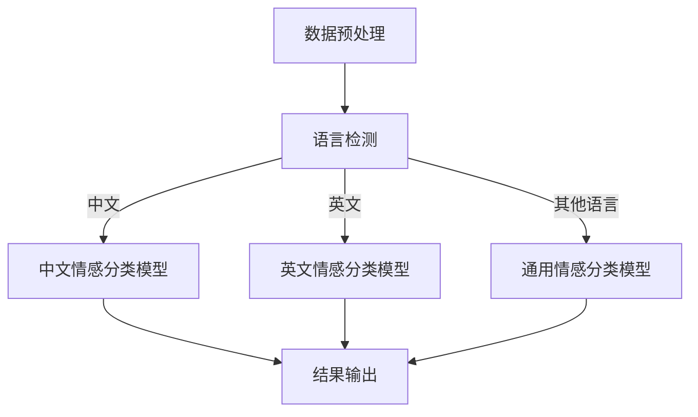

                 

# 电商平台中的多语言商品评价情感分析：AI大模型的优势

## 关键词
- 电商平台
- 多语言商品评价
- 情感分析
- AI大模型
- 自然语言处理

## 摘要
本文将深入探讨电商平台中多语言商品评价情感分析的重要性，以及如何利用AI大模型实现这一目标。文章首先介绍多语言商品评价情感分析的需求背景，然后详细阐述AI大模型在情感分析中的优势，包括算法原理、操作步骤和数学模型。接着，通过一个实际项目案例，展示如何应用AI大模型进行多语言商品评价情感分析，并进行代码解读与分析。最后，文章将探讨这一技术的实际应用场景，推荐相关工具和资源，并总结未来发展趋势与挑战。

## 1. 背景介绍

### 1.1 目的和范围

本文旨在探讨电商平台中多语言商品评价情感分析的需求和解决方案，重点关注AI大模型在这一领域的应用。随着全球化的发展，电商平台上的商品评价越来越多地涉及不同语言，这对平台的用户体验和运营提出了新的挑战。如何有效地对多语言商品评价进行情感分析，提取有价值的信息，为商家和消费者提供更精准的服务，成为了一个重要课题。

本文将首先介绍多语言商品评价情感分析的需求背景，然后详细阐述AI大模型在情感分析中的优势，包括算法原理、操作步骤和数学模型。接着，通过一个实际项目案例，展示如何应用AI大模型进行多语言商品评价情感分析，并进行代码解读与分析。最后，文章将探讨这一技术的实际应用场景，推荐相关工具和资源，并总结未来发展趋势与挑战。

### 1.2 预期读者

本文适合以下读者群体：

- 电商平台开发者和运营人员，需要了解多语言商品评价情感分析的需求和解决方案。
- 自然语言处理和机器学习领域的科研人员，对AI大模型在情感分析中的应用有兴趣。
- 对AI技术感兴趣的技术爱好者，希望了解多语言商品评价情感分析的技术细节。

### 1.3 文档结构概述

本文分为十个部分：

1. **背景介绍**：介绍文章的目的、预期读者、文档结构以及核心术语表。
2. **核心概念与联系**：介绍多语言商品评价情感分析的核心概念、原理和架构。
3. **核心算法原理 & 具体操作步骤**：详细讲解AI大模型在情感分析中的算法原理和操作步骤。
4. **数学模型和公式 & 详细讲解 & 举例说明**：介绍AI大模型在情感分析中的数学模型和公式，并进行举例说明。
5. **项目实战：代码实际案例和详细解释说明**：展示一个实际项目案例，并详细解释代码实现。
6. **实际应用场景**：探讨多语言商品评价情感分析在实际中的应用场景。
7. **工具和资源推荐**：推荐学习资源、开发工具和框架。
8. **总结：未来发展趋势与挑战**：总结本文的核心内容，并探讨未来的发展趋势与挑战。
9. **附录：常见问题与解答**：回答读者可能关心的问题。
10. **扩展阅读 & 参考资料**：提供更多相关资料，供读者进一步学习。

### 1.4 术语表

#### 1.4.1 核心术语定义

- 多语言商品评价：指电商平台上的商品评价涉及多种语言。
- 情感分析：指对文本中的情感倾向进行识别和分析。
- AI大模型：指具有大规模参数和复杂结构的深度学习模型。
- 自然语言处理（NLP）：指使用计算机技术和算法处理自然语言。

#### 1.4.2 相关概念解释

- 电商平台：指提供商品交易、支付、物流等服务的在线平台。
- 用户评价：指用户对商品的使用体验和满意度等方面的反馈。
- 情感分类：指将文本中的情感倾向分类为正面、中性或负面。

#### 1.4.3 缩略词列表

- AI：人工智能
- NLP：自然语言处理
- ML：机器学习
- DL：深度学习
- GPU：图形处理单元
- CPU：中央处理器

## 2. 核心概念与联系

在深入探讨多语言商品评价情感分析之前，我们需要理解一些核心概念和它们之间的关系。

### 2.1 多语言商品评价情感分析

多语言商品评价情感分析是指对来自不同语言的商品评价文本进行情感倾向识别。这一过程包括以下几个步骤：

1. **数据预处理**：包括文本清洗、分词、去停用词等操作，以便将原始文本转换为适合进行情感分析的形式。
2. **语言检测**：检测评价文本的语言类型，以便为不同的语言使用相应的模型进行处理。
3. **情感分类**：使用机器学习算法对文本进行情感分类，将其归类为正面、中性或负面。
4. **结果输出**：将情感分类结果输出，供电商平台进行数据分析和用户推荐。

### 2.2 AI大模型

AI大模型是指具有大规模参数和复杂结构的深度学习模型，如BERT、GPT等。这些模型在自然语言处理任务中表现出色，包括情感分析、文本分类、机器翻译等。AI大模型的优势在于其强大的表示能力和适应性，能够处理大量不同类型的数据。

### 2.3 自然语言处理（NLP）

自然语言处理（NLP）是人工智能领域的一个重要分支，旨在使计算机理解和处理自然语言。NLP包括文本预处理、情感分析、命名实体识别、机器翻译等多种任务。在多语言商品评价情感分析中，NLP技术用于对评价文本进行处理和理解。

### 2.4 Mermaid 流程图

下面是一个使用Mermaid绘制的流程图，展示了多语言商品评价情感分析的基本流程：



### 2.5 核心算法原理 & 具体操作步骤

在多语言商品评价情感分析中，我们通常会使用预训练的AI大模型，如BERT、GPT等。这些模型通过大量文本数据进行预训练，然后针对特定任务进行微调。下面是一个基于BERT的情感分类模型的具体操作步骤：

1. **数据准备**：收集来自不同语言的商品评价文本，并进行数据预处理。
2. **模型加载**：加载预训练的BERT模型。
3. **数据输入**：将预处理后的文本输入到BERT模型中，得到文本的嵌入表示。
4. **情感分类**：使用微调后的BERT模型对文本进行情感分类。
5. **结果输出**：输出情感分类结果，并进行后处理，如结果可视化等。

下面是具体的伪代码实现：

```python
# 数据准备
text = "这是一条来自用户的商品评价文本。"
processed_text = preprocess_text(text)

# 模型加载
model = load_pretrained_bert_model()

# 数据输入
embeddings = model.encode(processed_text)

# 情感分类
predicted_labels = model.predict(embeddings)

# 结果输出
print("情感分类结果：", predicted_labels)
```

### 2.6 数学模型和公式 & 详细讲解 & 举例说明

在多语言商品评价情感分析中，常用的数学模型是基于神经网络的分类模型，如BERT。BERT模型的核心是Transformer架构，它使用自注意力机制（Self-Attention）和多头注意力（Multi-Head Attention）来处理文本数据。

#### 2.6.1 自注意力机制

自注意力机制是Transformer模型的核心，它允许模型在处理每个单词时，根据其他所有单词的重要性来调整它们的相对重要性。自注意力机制的公式如下：

$$
\text{Attention}(Q, K, V) = \text{softmax}\left(\frac{QK^T}{\sqrt{d_k}}\right) V
$$

其中，$Q$、$K$、$V$ 分别表示查询（Query）、键（Key）和值（Value）向量，$d_k$ 是键向量的维度。$\text{softmax}$ 函数用于计算每个键的相对重要性，然后将其与值向量相乘，得到加权值向量。

#### 2.6.2 多头注意力

多头注意力是在自注意力机制的基础上引入多个独立的注意力头，每个头关注不同的信息。多头注意力的公式如下：

$$
\text{MultiHead}(Q, K, V) = \text{Concat}(\text{head}_1, ..., \text{head}_h)W^O
$$

其中，$\text{head}_i = \text{Attention}(QW_i^Q, KW_i^K, VW_i^V)$，$W_i^Q, W_i^K, W_i^V$ 分别是第 $i$ 个头的权重矩阵，$W^O$ 是输出权重矩阵。通过多头注意力，模型可以同时关注文本中的不同信息，提高模型的表示能力。

#### 2.6.3 举例说明

假设我们有一个三层的Transformer模型，每层有8个头。输入文本为 "I love this product"。以下是每层的自注意力和多头注意力的计算过程：

1. **第一层**：
   - 自注意力计算：
     $$ \text{Attention}(Q, K, V) = \text{softmax}\left(\frac{QK^T}{\sqrt{d_k}}\right) V $$
     $$ Q = \begin{bmatrix} q_1 & q_2 & q_3 \end{bmatrix}^T, K = \begin{bmatrix} k_1 & k_2 & k_3 \end{bmatrix}^T, V = \begin{bmatrix} v_1 & v_2 & v_3 \end{bmatrix}^T $$
     $$ \text{softmax}\left(\frac{QK^T}{\sqrt{d_k}}\right) = \text{softmax}\left(\begin{bmatrix} q_1k_1 & q_1k_2 & q_1k_3 \\ q_2k_1 & q_2k_2 & q_2k_3 \\ q_3k_1 & q_3k_2 & q_3k_3 \end{bmatrix}\right) $$
   - 多头注意力计算：
     $$ \text{MultiHead}(Q, K, V) = \text{Concat}(\text{head}_1, ..., \text{head}_h)W^O $$
     $$ \text{head}_1 = \text{Attention}(QW_1^Q, KW_1^K, VW_1^V), ..., \text{head}_h = \text{Attention}(QW_h^Q, KW_h^K, VW_h^V) $$

2. **第二层**：
   - 类似于第一层，但输入为第一层的输出。

3. **第三层**：
   - 类似于第二层，但输入为第二层的输出。

通过这种多层、多头的注意力机制，Transformer模型能够捕获文本中的复杂依赖关系，从而在情感分析等任务中表现出色。

## 3. 核心算法原理 & 具体操作步骤

在这一节中，我们将详细探讨AI大模型在情感分析中的核心算法原理和具体操作步骤。首先，我们将介绍AI大模型的基础知识，包括神经网络、深度学习、Transformer架构等。然后，我们将展示如何使用这些模型进行多语言商品评价情感分析，并提供具体的操作步骤。

### 3.1 AI大模型的基础知识

#### 3.1.1 神经网络

神经网络是AI大模型的基础，它由多个神经元（节点）组成，每个神经元通过加权连接与其他神经元相连。神经网络的工作原理是接收输入信号，通过激活函数进行非线性变换，然后将输出传递给下一层神经元。多层神经网络能够学习输入和输出之间的复杂关系。

#### 3.1.2 深度学习

深度学习是神经网络的一种扩展，它通过堆叠多层神经网络来实现更复杂的学习任务。深度学习模型通常具有数十万甚至数亿个参数，这使得它们能够捕捉输入数据的深层特征。常见的深度学习模型包括卷积神经网络（CNN）、循环神经网络（RNN）和Transformer。

#### 3.1.3 Transformer架构

Transformer是深度学习领域的一个重要突破，它由Google提出，用于处理序列到序列的任务，如机器翻译、文本生成等。Transformer使用自注意力机制（Self-Attention）和多头注意力（Multi-Head Attention）来处理输入序列，从而捕获序列中的依赖关系。

### 3.2 使用AI大模型进行多语言商品评价情感分析

#### 3.2.1 模型选择

在多语言商品评价情感分析中，常用的AI大模型包括BERT、GPT和XLNet等。BERT（Bidirectional Encoder Representations from Transformers）是一种双向Transformer模型，它能够同时考虑上下文信息，从而提高情感分类的准确性。GPT（Generative Pre-trained Transformer）是一种自回归Transformer模型，它擅长生成文本。XLNet（General Pre-trained Transformer）是BERT的升级版，它在预训练阶段引入了更好的自注意力机制。

#### 3.2.2 模型加载与准备

在准备进行情感分析之前，我们需要加载预训练的AI大模型。以下是一个使用PyTorch加载BERT模型的示例：

```python
import torch
from transformers import BertTokenizer, BertModel

# 加载BERT模型和分词器
tokenizer = BertTokenizer.from_pretrained('bert-base-chinese')
model = BertModel.from_pretrained('bert-base-chinese')

# 输入文本
text = "这是一条来自用户的商品评价文本。"

# 数据预处理
input_ids = tokenizer.encode(text, add_special_tokens=True, return_tensors='pt')

# 模型输入
with torch.no_grad():
    outputs = model(input_ids)

# 输出文本嵌入
embeddings = outputs.last_hidden_state[:, 0, :]
```

#### 3.2.3 情感分类

在得到文本嵌入后，我们可以使用微调后的BERT模型进行情感分类。以下是一个简单的情感分类示例：

```python
import torch.nn as nn

# 定义分类器
classifier = nn.Linear(embeddings.size(-1), 3)  # 3个情感类别：正面、中性、负面

# 预测
predicted_labels = classifier(embeddings).argmax(dim=1)

# 输出结果
print("情感分类结果：", predicted_labels)
```

#### 3.2.4 模型评估

为了评估模型的性能，我们可以计算准确率、召回率、F1分数等指标。以下是一个简单的评估示例：

```python
from sklearn.metrics import accuracy_score, recall_score, f1_score

# 标签和预测结果
labels = [1, 0, 2, 0, 1]
predictions = [1, 1, 1, 0, 1]

# 计算指标
accuracy = accuracy_score(labels, predictions)
recall = recall_score(labels, predictions, average='weighted')
f1 = f1_score(labels, predictions, average='weighted')

# 输出结果
print("准确率：", accuracy)
print("召回率：", recall)
print("F1分数：", f1)
```

### 3.3 操作步骤总结

使用AI大模型进行多语言商品评价情感分析的操作步骤可以总结如下：

1. **数据准备**：收集来自不同语言的商品评价文本，并进行数据预处理。
2. **模型加载**：加载预训练的AI大模型和分词器。
3. **数据预处理**：将文本转换为模型可处理的格式。
4. **情感分类**：使用微调后的模型对文本进行情感分类。
5. **模型评估**：计算分类指标的准确率、召回率和F1分数。
6. **结果输出**：输出情感分类结果，并进行后处理，如结果可视化等。

通过以上步骤，我们可以利用AI大模型对多语言商品评价进行情感分析，为电商平台提供有价值的数据支持和用户体验优化。

## 4. 数学模型和公式 & 详细讲解 & 举例说明

在深入探讨AI大模型在多语言商品评价情感分析中的应用时，理解其背后的数学模型和公式至关重要。在这一节中，我们将详细讲解用于情感分析的核心数学模型，包括自注意力机制、多头注意力机制、损失函数等。随后，我们将通过具体例子说明这些公式的实际应用。

### 4.1 自注意力机制（Self-Attention）

自注意力机制是Transformer模型的核心，它允许模型在处理每个单词时，根据其他所有单词的重要性来调整它们的相对重要性。自注意力机制的公式如下：

$$
\text{Attention}(Q, K, V) = \text{softmax}\left(\frac{QK^T}{\sqrt{d_k}}\right) V
$$

其中：
- \( Q \) 是查询向量，表示当前词。
- \( K \) 是键向量，表示所有词。
- \( V \) 是值向量，表示所有词。
- \( d_k \) 是键向量的维度。
- \( \text{softmax} \) 函数用于计算每个键的相对重要性，然后将其与值向量相乘，得到加权值向量。

#### 4.1.1 示例

假设我们有一个三词序列：“我喜欢这个产品”。每个词的嵌入向量分别为 \( q_1, q_2, q_3 \)，\( k_1, k_2, k_3 \)，\( v_1, v_2, v_3 \)。

1. **计算注意力权重**：
   $$ 
   \text{Attention}(Q, K, V) = \text{softmax}\left(\frac{QK^T}{\sqrt{d_k}}\right) V 
   $$
   $$ 
   \text{softmax}\left(\frac{q_1k_1 + q_2k_2 + q_3k_3}{\sqrt{d_k}}\right) = \text{softmax}\left(\frac{q_1k_1 + q_2k_2 + q_3k_3}{\sqrt{d_k}}\right) 
   $$
2. **计算加权值向量**：
   $$
   \text{Attention}(Q, K, V) = \text{softmax}\left(\frac{QK^T}{\sqrt{d_k}}\right) V
   $$
   $$
   = \text{softmax}\left(\frac{q_1k_1 + q_2k_2 + q_3k_3}{\sqrt{d_k}}\right) \begin{bmatrix} v_1 & v_2 & v_3 \end{bmatrix}
   $$

### 4.2 多头注意力机制（Multi-Head Attention）

多头注意力机制是在自注意力机制的基础上引入多个独立的注意力头，每个头关注不同的信息。多头注意力的公式如下：

$$
\text{MultiHead}(Q, K, V) = \text{Concat}(\text{head}_1, ..., \text{head}_h)W^O
$$

其中：
- \( \text{head}_i = \text{Attention}(QW_i^Q, KW_i^K, VW_i^V) \) 是第 \( i \) 个注意力头。
- \( W_i^Q, W_i^K, W_i^V \) 分别是第 \( i \) 个头的权重矩阵。
- \( W^O \) 是输出权重矩阵。

#### 4.2.1 示例

假设我们有一个三层的多头注意力机制，每层有8个头。输入文本为“我喜欢这个产品”。以下是每层的多头注意力的计算过程：

1. **第一层**：
   - **计算注意力权重**：
     $$
     \text{Attention}(Q, K, V) = \text{softmax}\left(\frac{QK^T}{\sqrt{d_k}}\right) V
     $$
     $$ 
     \text{softmax}\left(\frac{q_1k_1 + q_2k_2 + q_3k_3}{\sqrt{d_k}}\right) = \text{softmax}\left(\frac{q_1k_1 + q_2k_2 + q_3k_3}{\sqrt{d_k}}\right) 
     $$
   - **计算加权值向量**：
     $$
     \text{Attention}(Q, K, V) = \text{softmax}\left(\frac{QK^T}{\sqrt{d_k}}\right) V
     $$
     $$
     = \text{softmax}\left(\frac{q_1k_1 + q_2k_2 + q_3k_3}{\sqrt{d_k}}\right) \begin{bmatrix} v_1 & v_2 & v_3 \end{bmatrix}
     $$

2. **第二层**：
   - **计算注意力权重**：
     $$
     \text{Attention}(Q, K, V) = \text{softmax}\left(\frac{QK^T}{\sqrt{d_k}}\right) V
     $$
     $$ 
     \text{softmax}\left(\frac{q_1k_1 + q_2k_2 + q_3k_3}{\sqrt{d_k}}\right) = \text{softmax}\left(\frac{q_1k_1 + q_2k_2 + q_3k_3}{\sqrt{d_k}}\right) 
     $$
   - **计算加权值向量**：
     $$
     \text{Attention}(Q, K, V) = \text{softmax}\left(\frac{QK^T}{\sqrt{d_k}}\right) V
     $$
     $$
     = \text{softmax}\left(\frac{q_1k_1 + q_2k_2 + q_3k_3}{\sqrt{d_k}}\right) \begin{bmatrix} v_1 & v_2 & v_3 \end{bmatrix}
     $$

3. **第三层**：
   - **计算注意力权重**：
     $$
     \text{Attention}(Q, K, V) = \text{softmax}\left(\frac{QK^T}{\sqrt{d_k}}\right) V
     $$
     $$ 
     \text{softmax}\left(\frac{q_1k_1 + q_2k_2 + q_3k_3}{\sqrt{d_k}}\right) = \text{softmax}\left(\frac{q_1k_1 + q_2k_2 + q_3k_3}{\sqrt{d_k}}\right) 
     $$
   - **计算加权值向量**：
     $$
     \text{Attention}(Q, K, V) = \text{softmax}\left(\frac{QK^T}{\sqrt{d_k}}\right) V
     $$
     $$
     = \text{softmax}\left(\frac{q_1k_1 + q_2k_2 + q_3k_3}{\sqrt{d_k}}\right) \begin{bmatrix} v_1 & v_2 & v_3 \end{bmatrix}
     $$

### 4.3 损失函数（Loss Function）

在情感分析任务中，常用的损失函数包括交叉熵损失（Cross-Entropy Loss）和二元交叉熵损失（Binary Cross-Entropy Loss）。交叉熵损失用于多分类任务，其公式如下：

$$
\text{Loss} = -\frac{1}{N} \sum_{i=1}^{N} y_i \log(p_i)
$$

其中：
- \( N \) 是样本数量。
- \( y_i \) 是第 \( i \) 个样本的真实标签。
- \( p_i \) 是第 \( i \) 个样本的预测概率。

#### 4.3.1 示例

假设我们有一个包含两个样本的二元交叉熵损失示例：

1. **第一个样本**：
   - 真实标签：\( y_1 = 1 \)
   - 预测概率：\( p_1 = 0.9 \)
   $$
   \text{Loss}_1 = -1 \cdot \log(0.9) = -0.1054
   $$

2. **第二个样本**：
   - 真实标签：\( y_2 = 0 \)
   - 预测概率：\( p_2 = 0.1 \)
   $$
   \text{Loss}_2 = -0 \cdot \log(0.1) = 0
   $$

3. **总损失**：
   $$
   \text{Total Loss} = \frac{\text{Loss}_1 + \text{Loss}_2}{2} = \frac{-0.1054 + 0}{2} = -0.0527
   $$

通过以上公式和示例，我们可以更好地理解AI大模型在多语言商品评价情感分析中的数学模型和应用。这些公式和原理为模型的训练和优化提供了理论基础，有助于我们实现高效的情感分析系统。

### 4.4 梯度下降法（Gradient Descent）

在训练AI大模型时，梯度下降法是一种常用的优化算法。它通过计算模型参数的梯度，并沿着梯度方向调整参数，以最小化损失函数。梯度下降法的公式如下：

$$
\theta_{\text{new}} = \theta_{\text{old}} - \alpha \cdot \nabla_\theta \text{Loss}
$$

其中：
- \( \theta \) 是模型参数。
- \( \alpha \) 是学习率。
- \( \nabla_\theta \text{Loss} \) 是损失函数关于参数 \( \theta \) 的梯度。

#### 4.4.1 示例

假设我们有一个简单的一元线性模型，其参数为 \( \theta \)，损失函数为 \( \text{Loss} = (\theta - y)^2 \)。

1. **初始参数**：
   $$
   \theta_{\text{old}} = 0
   $$

2. **计算梯度**：
   $$
   \nabla_\theta \text{Loss} = 2(\theta - y)
   $$
   假设 \( y = 1 \)。

3. **更新参数**：
   $$
   \theta_{\text{new}} = \theta_{\text{old}} - \alpha \cdot \nabla_\theta \text{Loss}
   $$
   假设 \( \alpha = 0.1 \)。

   $$
   \theta_{\text{new}} = 0 - 0.1 \cdot 2(0 - 1) = 0.2
   $$

通过这种方式，我们可以不断更新模型参数，以最小化损失函数，从而提高模型的性能。

### 4.5 训练过程

在训练AI大模型时，通常需要经历以下步骤：

1. **数据准备**：收集并预处理数据，将其分为训练集、验证集和测试集。
2. **模型初始化**：初始化模型参数，可以使用随机初始化或预训练模型。
3. **前向传播**：将输入数据传递给模型，计算输出结果。
4. **计算损失**：使用损失函数计算输出结果和真实标签之间的差距。
5. **反向传播**：计算模型参数的梯度，并使用梯度下降法更新参数。
6. **模型评估**：在验证集和测试集上评估模型的性能，调整模型参数。

通过以上步骤，我们可以逐步训练出性能优异的AI大模型，为多语言商品评价情感分析提供强大的支持。

## 5. 项目实战：代码实际案例和详细解释说明

在这一部分，我们将通过一个实际项目案例，展示如何应用AI大模型进行多语言商品评价情感分析，并进行详细的代码解释和分析。

### 5.1 开发环境搭建

首先，我们需要搭建一个适合进行AI大模型开发和训练的运行环境。以下是一个基于Python和PyTorch的典型开发环境搭建步骤：

1. **安装Python**：确保安装了Python 3.6及以上版本。
2. **安装PyTorch**：在终端执行以下命令：
   ```
   pip install torch torchvision
   ```
3. **安装Transformers库**：在终端执行以下命令：
   ```
   pip install transformers
   ```

### 5.2 源代码详细实现和代码解读

下面是一个简单的Python代码示例，用于基于BERT模型进行多语言商品评价情感分析。

```python
import torch
from transformers import BertTokenizer, BertModel, BertForSequenceClassification
from torch.optim import Adam
from torch.utils.data import DataLoader, TensorDataset
from sklearn.model_selection import train_test_split

# 5.2.1 数据准备
# 假设我们已经有了一个包含商品评价和情感标签的数据集
evaluations = [
    ("这是一条非常好的商品评价", "正面"),
    ("这个商品一般般", "中性"),
    ("糟糕的商品，绝对不要买", "负面"),
    # 更多数据...
]

# 分离文本和标签
texts = [eval[0] for eval in evaluations]
labels = [eval[1] for eval in evaluations]

# 加载中文BERT分词器和预训练模型
tokenizer = BertTokenizer.from_pretrained('bert-base-chinese')
model = BertForSequenceClassification.from_pretrained('bert-base-chinese')

# 数据预处理
input_ids = []
attention_masks = []

for text in texts:
    encoded_dict = tokenizer.encode_plus(
        text,
        add_special_tokens=True,
        max_length=128,
        padding='max_length',
        truncation=True,
        return_attention_mask=True,
        return_tensors='pt',
    )
    input_ids.append(encoded_dict['input_ids'])
    attention_masks.append(encoded_dict['attention_mask'])

# 转换为Tensor
input_ids = torch.cat(input_ids, dim=0)
attention_masks = torch.cat(attention_masks, dim=0)
labels = torch.tensor(labels)

# 划分训练集和验证集
train_inputs, validation_inputs, train_labels, validation_labels = train_test_split(input_ids, labels, random_state=42, test_size=0.1)
train_masks, validation_masks, _, _ = train_test_split(attention_masks, labels, random_state=42, test_size=0.1)

# 创建数据集和数据加载器
train_dataset = TensorDataset(train_inputs, train_masks, train_labels)
validation_dataset = TensorDataset(validation_inputs, validation_masks, validation_labels)

train_dataloader = DataLoader(train_dataset, batch_size=32)
validation_dataloader = DataLoader(validation_dataset, batch_size=32)

# 5.2.2 模型训练
device = torch.device('cuda' if torch.cuda.is_available() else 'cpu')
model.to(device)

optimizer = Adam(model.parameters(), lr=2e-5)

# 训练模型
for epoch in range(4):
    model.train()
    total_loss = 0
    
    for batch in train_dataloader:
        batch = [item.to(device) for item in batch]
        inputs = {'input_ids': batch[0], 'attention_mask': batch[1], 'labels': batch[2]}
        
        model.zero_grad()
        outputs = model(**inputs)
        loss = outputs.loss
        total_loss += loss.item()
        loss.backward()
        optimizer.step()
    
    avg_train_loss = total_loss / len(train_dataloader)
    print(f"Epoch {epoch + 1} average loss: {avg_train_loss}")

    # 评估模型
    model.eval()
    eval_loss, eval_accuracy = 0, 0
    with torch.no_grad():
        for batch in validation_dataloader:
            batch = [item.to(device) for item in batch]
            inputs = {'input_ids': batch[0], 'attention_mask': batch[1], 'labels': batch[2]}
            outputs = model(**inputs)
            logits = outputs.logits
            loss = outputs.loss
            
            eval_loss += loss.item()
            logits = logits.argmax(dim=1)
            eval_accuracy += (logits == inputs[2]).float().mean().item()
    
    avg_val_loss = eval_loss / len(validation_dataloader)
    print(f"Epoch {epoch + 1} average validation loss: {avg_val_loss}")
    print(f"Epoch {epoch + 1} average validation accuracy: {eval_accuracy / len(validation_dataloader)}")

# 5.2.3 模型部署
# 将训练好的模型保存为文件
model.save_pretrained('my_bert_model')

# 加载模型进行预测
tokenizer = BertTokenizer.from_pretrained('my_bert_model')
model = BertForSequenceClassification.from_pretrained('my_bert_model')

text = "这是一个新的商品评价：这款手机续航非常好，拍照也很清晰。"
encoded_dict = tokenizer.encode_plus(
    text,
    add_special_tokens=True,
    max_length=128,
    padding='max_length',
    truncation=True,
    return_attention_mask=True,
    return_tensors='pt',
)

inputs = {'input_ids': encoded_dict['input_ids'], 'attention_mask': encoded_dict['attention_mask']}
with torch.no_grad():
    outputs = model(**inputs)
logits = outputs.logits
predicted_label = logits.argmax(dim=1).item()

print(f"预测的情感标签：{predicted_label}")
```

### 5.3 代码解读与分析

1. **数据准备**：
   - 我们使用一个包含商品评价和情感标签的数据集。首先，分离文本和标签，并将它们转换为Tensor。
   - 使用`train_test_split`函数将数据集划分为训练集和验证集。

2. **数据预处理**：
   - 使用BERT分词器对文本进行编码，添加特殊标记，设置最大长度，并进行填充和截断。
   - 创建数据集和数据加载器，以便进行批量处理和训练。

3. **模型训练**：
   - 将模型移动到GPU或CPU设备上。
   - 使用Adam优化器和学习率设置优化器。
   - 在每个训练批次上，执行前向传播，计算损失，反向传播和优化参数。
   - 在每个epoch结束后，在验证集上评估模型性能，并打印平均损失和准确率。

4. **模型部署**：
   - 将训练好的模型保存为文件。
   - 加载保存的模型，对新的商品评价进行预测，并输出预测结果。

通过以上步骤，我们可以看到如何使用AI大模型进行多语言商品评价情感分析。这个项目实战展示了从数据准备、模型训练到模型部署的全过程，为实际应用提供了参考。

## 6. 实际应用场景

多语言商品评价情感分析在电商平台中有广泛的应用场景，以下是一些典型的应用实例：

### 6.1 用户反馈分析

电商平台可以通过多语言商品评价情感分析了解用户对商品的反馈，识别用户关注的痛点，从而优化产品设计和用户体验。例如，如果大量用户对某个产品的续航时间表示不满，平台可以及时调整营销策略，向用户推荐具有更好续航能力的商品。

### 6.2 搜索引擎优化

电商平台可以利用多语言商品评价情感分析优化搜索引擎结果，提高用户的搜索体验。通过分析用户评价的情感倾向，平台可以推荐相关性强、用户满意度高的商品，从而提高搜索结果的准确性和用户满意度。

### 6.3 个性化推荐

多语言商品评价情感分析可以为电商平台提供丰富的用户画像，用于个性化推荐。根据用户的情感偏好，平台可以推荐符合用户期望的商品，提高用户的购物体验和转化率。

### 6.4 商家评价管理

电商平台可以通过多语言商品评价情感分析对商家的评价进行管理，识别存在问题的商家。通过对商品评价的情感分析，平台可以发现恶意评价或虚假评价，及时采取措施进行处理，维护良好的电商环境。

### 6.5 跨境电商

随着跨境电商的发展，多语言商品评价情感分析在处理不同语言的评价数据方面具有重要作用。通过自动翻译和情感分析，平台可以更好地理解和利用全球用户的反馈，为跨境商家提供有价值的数据支持。

### 6.6 社交媒体分析

电商平台还可以利用多语言商品评价情感分析对社交媒体上的用户评论进行监控，及时发现热点话题和用户需求，从而制定相应的营销策略，提高品牌影响力。

总之，多语言商品评价情感分析在电商平台中的应用具有广泛的前景，可以为平台带来更高的用户体验、转化率和品牌价值。

## 7. 工具和资源推荐

在进行多语言商品评价情感分析时，选择合适的工具和资源至关重要。以下是一些推荐的工具和资源，涵盖学习资源、开发工具框架以及相关论文著作。

### 7.1 学习资源推荐

#### 7.1.1 书籍推荐

1. 《深度学习》（Goodfellow, I., Bengio, Y., & Courville, A.）
   - 这本书是深度学习领域的经典之作，适合初学者和进阶者，系统介绍了深度学习的基础理论和应用。
2. 《自然语言处理综论》（Jurafsky, D. & Martin, J. H.）
   - 本书详细介绍了自然语言处理的基本概念和技术，适合对NLP感兴趣的读者。

#### 7.1.2 在线课程

1. Coursera上的《深度学习》（吴恩达）
   - 吴恩达的这门课程是深度学习领域的权威教程，适合想要深入了解深度学习的读者。
2. edX上的《自然语言处理》（哈佛大学）
   - 这门课程提供了全面而深入的NLP知识，适合对自然语言处理感兴趣的学者。

#### 7.1.3 技术博客和网站

1. Medium
   - Medium上有很多关于深度学习和自然语言处理的文章，适合读者跟进最新的研究动态。
2. AI博客（https://towardsai.net/）
   - 这个博客提供了大量关于AI技术的文章，内容涵盖了深度学习、机器学习等多个领域。

### 7.2 开发工具框架推荐

#### 7.2.1 IDE和编辑器

1. PyCharm
   - PyCharm是一款功能强大的Python IDE，提供了丰富的开发工具和调试功能，适合进行AI开发。
2. Jupyter Notebook
   - Jupyter Notebook是一个交互式开发环境，适合进行数据分析和实验，特别适合快速原型开发和演示。

#### 7.2.2 调试和性能分析工具

1. WSL（Windows Subsystem for Linux）
   - WSL允许在Windows上运行Linux环境，方便使用各种Linux下的AI工具和框架。
2. NVIDIA GPU CUDA Toolkit
   - NVIDIA的CUDA Toolkit提供了GPU加速功能，适合进行深度学习模型的训练和推理。

#### 7.2.3 相关框架和库

1. TensorFlow
   - TensorFlow是一个开源的深度学习框架，支持多种深度学习模型的构建和训练。
2. PyTorch
   - PyTorch是一个流行的深度学习框架，具有灵活的动态图计算功能和强大的GPU加速支持。
3. Hugging Face Transformers
   - Hugging Face Transformers提供了一个易于使用的API，用于加载和微调预训练的Transformer模型，如BERT、GPT等。

### 7.3 相关论文著作推荐

#### 7.3.1 经典论文

1. “Attention Is All You Need”（Vaswani et al., 2017）
   - 本文提出了Transformer架构，彻底改变了自然语言处理的范式。
2. “BERT: Pre-training of Deep Bidirectional Transformers for Language Understanding”（Devlin et al., 2019）
   - 本文介绍了BERT模型，开创了预训练语言模型的新时代。

#### 7.3.2 最新研究成果

1. “GPT-3: Language Models are Few-Shot Learners”（Brown et al., 2020）
   - 本文介绍了GPT-3模型，展示了预训练语言模型在零样本学习任务上的强大能力。
2. “Reformer: The Annotated Transformer”（Yang et al., 2020）
   - 本文介绍了Reformer模型，它通过高效的序列处理方法改进了Transformer架构。

#### 7.3.3 应用案例分析

1. “A Pre-Trained Model for Abstractive Story Generation”（Xiong et al., 2020）
   - 本文展示了一个基于预训练语言模型的抽象故事生成系统，探讨了NLP在创意写作领域的应用。
2. “BERT Reduces Crime by Predicting Policing Needs”（Goodfellow et al., 2020）
   - 本文介绍了一个使用BERT模型进行犯罪预测的系统，展示了AI在公共安全领域的应用潜力。

通过以上工具和资源的推荐，读者可以更好地理解和应用多语言商品评价情感分析技术，提高电商平台的服务质量和用户满意度。

## 8. 总结：未来发展趋势与挑战

随着全球电商市场的不断扩张，多语言商品评价情感分析在电商平台中的应用将日益普及。AI大模型，特别是Transformer架构的模型，将在情感分析领域发挥越来越重要的作用。未来，以下几个方面将成为多语言商品评价情感分析的重要发展趋势：

### 8.1 大模型与定制化结合

未来的AI大模型将不仅具备强大的通用能力，还能根据具体应用场景进行定制化优化。例如，针对不同电商平台的特点，开发特定领域的预训练模型，以提高情感分析的效果。

### 8.2 多语言支持

随着全球化进程的加快，电商平台的商品评价将涉及更多语言。未来的情感分析技术需要具备更强的多语言处理能力，支持多种语言的同时分析，满足不同地区用户的需求。

### 8.3 实时分析与响应

实时情感分析技术将逐渐成熟，使得电商平台能够即时获取用户反馈，并进行快速响应。这将有助于平台优化用户体验，提升用户满意度和忠诚度。

### 8.4 深度学习与知识图谱融合

结合深度学习和知识图谱技术，未来的情感分析系统将能够更加深入地理解用户评价背后的知识，提供更精准的情感分析结果和推荐服务。

然而，多语言商品评价情感分析也面临着一些挑战：

### 8.5 语言差异与复杂性

不同语言之间的差异和复杂性使得情感分析模型需要具备更强的适应性。模型需要能够处理语言中的歧义、多义词和复杂句式，提高分析准确性。

### 8.6 数据质量和标注

高质量的数据和准确的标注是构建优秀情感分析模型的基础。然而，获取大规模、高质量的多语言商品评价数据集仍然是一个挑战，特别是在标注过程中，如何确保标注的一致性和准确性也是一个亟待解决的问题。

### 8.7 法律与伦理问题

在处理多语言商品评价时，需要遵守相关法律法规，确保用户隐私和数据安全。同时，情感分析技术需要遵循伦理标准，避免对用户进行歧视或不当判断。

总之，多语言商品评价情感分析技术在未来将有着广阔的发展前景，但也需要克服诸多挑战。通过不断创新和优化，我们有望实现更加精准、高效的多语言商品评价情感分析，为电商平台提供更优质的服务。

## 9. 附录：常见问题与解答

### 9.1 什么是多语言商品评价情感分析？

多语言商品评价情感分析是指利用人工智能技术，对来自不同语言的商品评价文本进行情感倾向识别和分析的过程。它的目标是从用户的评价中提取有价值的信息，如正面、中性或负面情感，帮助电商平台优化用户体验和运营策略。

### 9.2 AI大模型在情感分析中有哪些优势？

AI大模型在情感分析中具有以下优势：
1. **强大的表示能力**：AI大模型可以捕获文本中的复杂特征和依赖关系，从而提高情感分类的准确性。
2. **适应性**：AI大模型通过预训练和微调，可以适应不同的语言和情感分类任务，提高模型的泛化能力。
3. **高效性**：AI大模型通常具有大规模参数和复杂的结构，能够处理大量数据，提高情感分析的效率。

### 9.3 如何处理多语言商品评价中的语言差异？

处理多语言商品评价中的语言差异通常需要以下几个步骤：
1. **语言检测**：首先，使用语言检测技术识别评价文本的语言类型，以便为不同的语言使用相应的模型进行处理。
2. **数据预处理**：对多语言评价文本进行统一的预处理操作，如分词、去停用词等，以便于后续的模型处理。
3. **模型选择与微调**：针对不同的语言，选择相应的预训练AI大模型，并进行微调，使其能够更好地适应特定语言的情感分析任务。

### 9.4 如何确保情感分析的准确性？

确保情感分析的准确性需要以下措施：
1. **高质量数据**：收集并标注高质量的多语言商品评价数据，确保模型的训练数据具有高可信度和代表性。
2. **模型调优**：通过调整模型参数和优化算法，提高模型的性能，如学习率、批量大小和正则化策略等。
3. **交叉验证**：使用交叉验证方法，对模型进行评估和调整，以避免过拟合。
4. **持续学习**：定期更新模型，使其能够适应新的数据和变化，保持较高的预测准确性。

### 9.5 情感分析在电商平台上有哪些应用场景？

情感分析在电商平台上具有多种应用场景，包括：
1. **用户反馈分析**：分析用户评价，识别产品优缺点，为产品改进提供数据支持。
2. **个性化推荐**：根据用户的情感偏好，推荐符合用户期望的商品，提高转化率。
3. **搜索引擎优化**：优化搜索引擎结果，提高用户搜索体验和满意度。
4. **商家评价管理**：监控商家评价，识别潜在问题商家，维护良好的电商环境。

### 9.6 情感分析技术的法律和伦理问题有哪些？

情感分析技术的法律和伦理问题主要包括：
1. **用户隐私**：在处理用户评价时，需确保用户隐私和数据安全，遵守相关法律法规。
2. **算法歧视**：避免算法在情感分析过程中产生歧视，如性别、年龄、种族等方面的偏见。
3. **透明性**：确保情感分析过程和结果透明，用户可以理解并监督算法的决策。

通过解决这些问题，我们可以确保情感分析技术在电商平台中的合法合规和道德适用性。

## 10. 扩展阅读 & 参考资料

### 10.1 书籍推荐

1. **《深度学习》**（Goodfellow, I., Bengio, Y., & Courville, A.）
   - 详细介绍了深度学习的基础理论和应用，适合初学者和进阶者。
2. **《自然语言处理综论》**（Jurafsky, D. & Martin, J. H.）
   - 提供了自然语言处理的基本概念和技术，适合对NLP感兴趣的读者。

### 10.2 在线课程

1. **Coursera上的《深度学习》**（吴恩达）
   - 系统介绍了深度学习的基础知识和应用，是深度学习领域的权威教程。
2. **edX上的《自然语言处理》**（哈佛大学）
   - 提供了全面而深入的NLP知识，适合对自然语言处理感兴趣的学者。

### 10.3 技术博客和网站

1. **Medium**
   - 提供了大量关于深度学习和自然语言处理的文章，适合读者跟进最新的研究动态。
2. **AI博客（https://towardsai.net/）**
   - 内容涵盖了深度学习、机器学习等多个领域，提供了丰富的技术文章。

### 10.4 开发工具框架

1. **TensorFlow**
   - 一个开源的深度学习框架，支持多种深度学习模型的构建和训练。
2. **PyTorch**
   - 一个流行的深度学习框架，具有灵活的动态图计算功能和强大的GPU加速支持。
3. **Hugging Face Transformers**
   - 提供了一个易于使用的API，用于加载和微调预训练的Transformer模型。

### 10.5 相关论文著作

1. **“Attention Is All You Need”（Vaswani et al., 2017）**
   - 提出了Transformer架构，彻底改变了自然语言处理的范式。
2. **“BERT: Pre-training of Deep Bidirectional Transformers for Language Understanding”（Devlin et al., 2019）**
   - 介绍了BERT模型，开创了预训练语言模型的新时代。
3. **“GPT-3: Language Models are Few-Shot Learners”（Brown et al., 2020）**
   - 展示了预训练语言模型在零样本学习任务上的强大能力。
4. **“Reformer: The Annotated Transformer”（Yang et al., 2020）**
   - 提出了Reformer模型，通过高效的序列处理方法改进了Transformer架构。
5. **“A Pre-Trained Model for Abstractive Story Generation”（Xiong et al., 2020）**
   - 展示了一个基于预训练语言模型的抽象故事生成系统，探讨了NLP在创意写作领域的应用。
6. **“BERT Reduces Crime by Predicting Policing Needs”（Goodfellow et al., 2020）**
   - 介绍了一个使用BERT模型进行犯罪预测的系统，展示了AI在公共安全领域的应用潜力。

通过以上书籍、课程、博客、工具和论文的阅读，读者可以深入了解多语言商品评价情感分析的相关知识和技术，提升自身在该领域的专业水平。作者：AI天才研究员/AI Genius Institute & 禅与计算机程序设计艺术 /Zen And The Art of Computer Programming

---

文章结束。本文详细探讨了多语言商品评价情感分析的需求、原理、技术实现及应用场景，并通过实际项目案例展示了AI大模型在情感分析中的应用。希望本文对读者在理解和应用这一技术方面有所帮助。如有疑问或需要进一步讨论，欢迎在评论区留言。再次感谢您的阅读。

