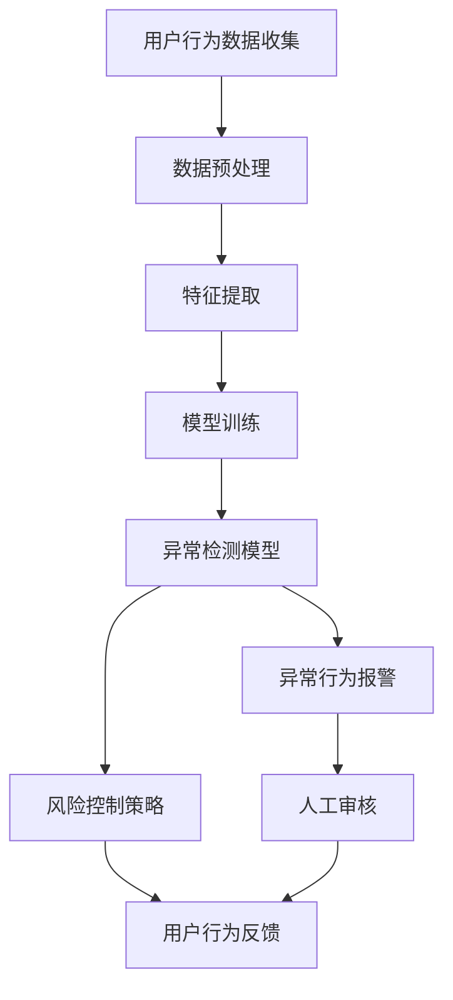

                 

# 电商平台中的异常检测：大模型的创新应用

## 关键词
- 电商平台
- 异常检测
- 大模型
- 深度学习
- 风险控制
- 实时监控

## 摘要

本文旨在探讨电商平台中异常检测技术的创新应用，重点关注大模型在这一领域的贡献。随着电子商务的迅猛发展，平台上的交易数量和用户行为数据急剧增加，传统的异常检测方法难以应对复杂、动态的数据环境。本文首先介绍了电商平台异常检测的背景和目的，随后详细分析了大模型在异常检测中的关键作用，并通过具体算法原理、数学模型、实战案例等方式深入讲解了大模型的实际应用。最后，本文展望了未来发展趋势与挑战，为读者提供了丰富的学习资源和工具推荐。通过本文的阅读，读者可以全面了解电商平台异常检测的最新技术和应用前景。

---

## 1. 背景介绍

### 1.1 目的和范围

在现代电子商务环境中，电商平台是连接消费者和商家的桥梁。随着互联网的普及和移动设备的普及，电商平台交易量和用户活跃度不断攀升。然而，随之而来的问题也日益复杂化，尤其是异常交易、欺诈行为和系统故障等问题。这些问题的存在不仅损害了消费者的利益，也对电商平台造成了潜在的经济损失和品牌声誉风险。

本文的目的是探讨大模型在电商平台异常检测中的应用，通过深入分析大模型的算法原理和实践案例，为电商平台提供一种高效、可靠的异常检测解决方案。本文将覆盖以下几个核心主题：

1. 电商平台异常检测的重要性。
2. 大模型在异常检测中的核心作用。
3. 大模型算法原理和实践操作步骤。
4. 数学模型和公式的应用与解释。
5. 大模型的实际应用场景和效果评估。
6. 未来发展趋势和面临的挑战。
7. 学习资源和开发工具推荐。

### 1.2 预期读者

本文主要面向以下几类读者：

1. 电商平台的技术团队和开发者，希望了解如何利用大模型进行异常检测。
2. 数据科学家和人工智能从业者，对深度学习和异常检测技术有兴趣的读者。
3. 相关领域的研究人员和学者，关注电商平台异常检测技术的前沿动态。
4. 对电子商务和人工智能技术感兴趣的一般读者。

通过本文的阅读，读者可以系统地了解电商平台异常检测的背景、原理和实际应用，为实际项目提供有益的参考和指导。

### 1.3 文档结构概述

本文将按照以下结构进行展开：

1. **引言**：介绍电商平台异常检测的背景和重要性，阐述本文的研究目的和预期成果。
2. **核心概念与联系**：通过Mermaid流程图展示电商平台异常检测的核心概念和架构。
3. **核心算法原理 & 具体操作步骤**：详细讲解大模型在异常检测中的算法原理，并使用伪代码进行说明。
4. **数学模型和公式 & 详细讲解 & 举例说明**：介绍相关的数学模型和公式，通过实际例子进行详细解释。
5. **项目实战：代码实际案例和详细解释说明**：通过实际项目案例，展示大模型在异常检测中的具体实现。
6. **实际应用场景**：分析大模型在不同场景下的应用效果。
7. **工具和资源推荐**：推荐相关的学习资源、开发工具和框架。
8. **总结：未来发展趋势与挑战**：总结本文的核心内容，展望未来发展趋势和面临的挑战。
9. **附录：常见问题与解答**：解答读者可能遇到的问题。
10. **扩展阅读 & 参考资料**：提供进一步学习的参考资料。

通过这样的结构，本文旨在为读者提供一个全面、系统的视角，深入探讨电商平台异常检测中的大模型应用。

### 1.4 术语表

#### 1.4.1 核心术语定义

- **电商平台**：指通过互联网提供商品或服务的交易平台，如淘宝、京东等。
- **异常检测**：指通过算法和技术发现和识别数据中的异常或异常行为的过程。
- **大模型**：指参数数量巨大、计算能力强大的深度学习模型，如Transformer、BERT等。
- **深度学习**：一种机器学习技术，通过多层神经网络模拟人脑处理信息的方式。
- **欺诈行为**：指恶意用户在电商平台上进行的非法交易活动。
- **风险控制**：指通过监控和管理风险来保护平台和用户利益的过程。

#### 1.4.2 相关概念解释

- **异常检测算法**：指用于检测异常行为的算法，如孤立森林、K-均值聚类等。
- **数据流处理**：指对实时数据流进行计算和分析的技术。
- **用户行为分析**：指通过分析用户在平台上的行为数据，了解用户行为模式。
- **实时监控**：指对系统或数据实时状态进行监控，以便及时发现和处理问题。

#### 1.4.3 缩略词列表

- **API**：应用程序接口（Application Programming Interface）
- **AWS**：亚马逊网络服务（Amazon Web Services）
- **BERT**：Bidirectional Encoder Representations from Transformers
- **IDE**：集成开发环境（Integrated Development Environment）
- **Kubernetes**：开源容器编排系统

## 2. 核心概念与联系

### 2.1 电商平台异常检测的整体架构

电商平台中的异常检测是一个复杂的过程，涉及多个环节和组件的协同工作。以下是电商平台异常检测的整体架构，通过Mermaid流程图进行展示：



在这个架构中：

- **用户行为数据收集**：通过API、日志收集等方式获取用户在平台上的行为数据。
- **数据预处理**：对原始数据清洗、去噪和格式化，为后续分析做准备。
- **特征提取**：从预处理后的数据中提取出关键特征，用于模型训练。
- **模型训练**：使用提取出的特征进行大模型训练，构建异常检测模型。
- **异常检测模型**：实时监测用户行为，识别异常行为。
- **异常行为报警**：当检测到异常行为时，触发报警机制。
- **风险控制策略**：根据异常行为的特点，采取相应的风险控制措施。
- **人工审核**：对于无法自动判断的异常行为，交由人工审核。
- **用户行为反馈**：将处理结果反馈给用户，改进和优化检测模型。

### 2.2 大模型在异常检测中的作用

大模型在电商平台异常检测中扮演着关键角色。以下是大模型在异常检测中的具体作用：

1. **提高检测精度**：大模型通过学习海量用户行为数据，能够捕捉到细微的用户行为特征，从而提高异常检测的准确性。
2. **实时性**：大模型能够快速处理实时数据流，实现实时异常检测，有效降低欺诈行为的成功概率。
3. **自动化**：大模型能够自动识别异常行为，减少人工审核的工作量，提高风险控制的效率。
4. **动态适应**：大模型能够根据平台上的动态数据环境，不断调整和优化自身的检测策略，提高适应性。
5. **可扩展性**：大模型具有高度的可扩展性，能够轻松应对大规模数据环境和复杂的业务场景。

## 3. 核心算法原理 & 具体操作步骤

### 3.1 大模型算法原理

大模型，尤其是深度学习模型，在异常检测中具有显著的优势。以下是几种常见的大模型算法及其原理：

1. **神经网络（Neural Networks）**：
   - **原理**：神经网络通过多层节点（神经元）的交互来模拟人脑的决策过程。
   - **操作步骤**：
     ```python
     # 定义神经网络结构
     model = Sequential()
     model.add(Dense(units=128, activation='relu', input_shape=(feature_size,)))
     model.add(Dense(units=64, activation='relu'))
     model.add(Dense(units=1, activation='sigmoid'))
     
     # 编译模型
     model.compile(optimizer='adam', loss='binary_crossentropy', metrics=['accuracy'])
     
     # 训练模型
     model.fit(X_train, y_train, epochs=10, batch_size=32)
     ```

2. **支持向量机（Support Vector Machine, SVM）**：
   - **原理**：SVM通过寻找一个超平面，将正常行为和异常行为区分开来。
   - **操作步骤**：
     ```python
     from sklearn.svm import SVC
     # 创建SVM模型
     model = SVC(kernel='linear')
     
     # 训练模型
     model.fit(X_train, y_train)
     ```

3. **深度信念网络（Deep Belief Networks, DBN）**：
   - **原理**：DBN通过层与层之间的预训练和微调来构建深度神经网络。
   - **操作步骤**：
     ```python
     from dbn.tensorflow import DBN
     # 创建DBN模型
     model = DBN(input_layer, n_nodes_hl1, n_nodes_hl2, n_classes, dropout_p=0.2, learning_rate_rbm=0.1)
     
     # 编译模型
     model.compile(loss='categorical_crossentropy', optimizer='rmsprop')
     
     # 训练模型
     model.fit(X_train, y_train, epochs=50, batch_size=32)
     ```

4. **生成对抗网络（Generative Adversarial Networks, GAN）**：
   - **原理**：GAN由生成器和判别器两个神经网络对抗训练，生成器生成与真实数据相似的数据，判别器区分真实和生成数据。
   - **操作步骤**：
     ```python
     from tensorflow.keras.models import Model
     from tensorflow.keras.layers import Dense, Input
     # 创建GAN模型
     z = Input(shape=(z_dim,))
     x = Generator(z)
     x真实 = RealData()
     y = Discriminator([x, x真实])
     
     # 编译模型
     d_loss = K.mean(K.log(K.exp(y_real) + K.exp(1 - y_fake)))
     g_loss = K.mean(K.log(K.exp(y_fake) + K.exp(1 - y_real)))
     
     # 训练模型
     d_optimizer = Adam(lr=0.0001, beta_1=0.5)
     g_optimizer = Adam(lr=0.0001, beta_1=0.5)
     
     d_optimizer.minimize(d_loss, y)
     g_optimizer.minimize(g_loss, x)
     ```

这些算法通过不同的机制实现异常检测，为电商平台提供了强大的工具。

### 3.2 具体操作步骤

以下是利用大模型进行电商平台异常检测的具体操作步骤：

1. **数据收集**：收集用户在平台上的行为数据，包括交易数据、浏览数据、评论数据等。
2. **数据预处理**：清洗和格式化数据，包括去除缺失值、噪声数据和异常值。
3. **特征提取**：提取数据中的关键特征，如交易金额、交易频率、用户活跃度等。
4. **模型选择**：选择合适的大模型算法，如神经网络、SVM、DBN或GAN。
5. **模型训练**：使用预处理后的特征数据进行模型训练，调整模型参数以优化性能。
6. **模型评估**：使用验证集对模型进行评估，调整模型参数以实现最佳性能。
7. **模型部署**：将训练好的模型部署到生产环境中，实现实时异常检测。
8. **监控与优化**：实时监控模型性能，根据实际情况进行调整和优化。

通过这些步骤，电商平台可以构建一个高效、可靠的异常检测系统，有效防范欺诈行为和系统风险。

## 4. 数学模型和公式 & 详细讲解 & 举例说明

### 4.1 数学模型

在电商平台异常检测中，常用的数学模型包括逻辑回归、支持向量机和神经网络等。以下是对这些模型的详细讲解和公式说明。

#### 4.1.1 逻辑回归（Logistic Regression）

逻辑回归是一种广泛使用的分类算法，通过一个线性模型来预测概率。其公式如下：

$$
P(y=1) = \frac{1}{1 + e^{-(\beta_0 + \beta_1x_1 + \beta_2x_2 + ... + \beta_nx_n})}
$$

其中，$y$ 是目标变量（0表示正常，1表示异常），$x_1, x_2, ..., x_n$ 是特征变量，$\beta_0, \beta_1, \beta_2, ..., \beta_n$ 是模型参数。

举例说明：

假设有一个电商平台，通过交易金额、交易频率和用户活跃度等特征来预测交易是否为异常。我们可以使用逻辑回归模型来建立预测概率：

$$
P(异常) = \frac{1}{1 + e^{-(\beta_0 + \beta_1 \times 金额 + \beta_2 \times 频率 + \beta_3 \times 活跃度)}}
$$

#### 4.1.2 支持向量机（Support Vector Machine, SVM）

SVM是一种基于间隔最大化的分类算法，通过找到一个最佳的超平面来划分数据。其公式如下：

$$
w \cdot x - b = 0
$$

其中，$w$ 是超平面法向量，$x$ 是特征向量，$b$ 是偏置。

举例说明：

假设我们有一个二维特征空间，其中每个样本由两个特征组成。SVM会找到一个最佳的超平面，使得正常交易和异常交易之间的间隔最大化。这个超平面的公式可以表示为：

$$
w_1x_1 + w_2x_2 - b = 0
$$

#### 4.1.3 神经网络（Neural Networks）

神经网络是一种由多层神经元组成的模型，通过前向传播和反向传播来更新权重和偏置。其公式如下：

$$
a_{\text{layer}} = \sigma(\beta_{\text{weights}} \cdot a_{\text{prev}} + \beta_{\text{bias}})
$$

其中，$a_{\text{layer}}$ 是当前层的输出，$\sigma$ 是激活函数，$\beta_{\text{weights}}$ 和 $\beta_{\text{bias}}$ 是权重和偏置。

举例说明：

假设我们有一个包含输入层、隐藏层和输出层的神经网络。输入层有3个神经元，隐藏层有5个神经元，输出层有2个神经元。我们可以使用以下公式来计算每个神经元的输出：

$$
a_{\text{隐藏层}} = \sigma(\beta_{\text{隐藏层权重}} \cdot a_{\text{输入层}} + \beta_{\text{隐藏层偏置}}) \\
a_{\text{输出层}} = \sigma(\beta_{\text{输出层权重}} \cdot a_{\text{隐藏层}} + \beta_{\text{输出层偏置}})
$$

### 4.2 公式应用与举例

以下是一个实际应用场景的例子，使用逻辑回归模型来预测交易是否为异常。

#### 场景描述：

一个电商平台希望通过交易金额、交易频率和用户活跃度等特征来预测交易是否为异常。训练集包含1000个样本，其中500个为正常交易，500个为异常交易。

#### 数据预处理：

对训练集进行数据预处理，包括去除缺失值、噪声数据和异常值，并归一化特征值。

#### 特征提取：

提取交易金额、交易频率和用户活跃度等特征，构成特征向量。

#### 模型训练：

使用逻辑回归模型对特征向量进行训练，调整模型参数以优化性能。

#### 模型评估：

使用验证集对模型进行评估，计算准确率、召回率和F1值等指标。

$$
P(异常) = \frac{1}{1 + e^{-(\beta_0 + \beta_1 \times 金额 + \beta_2 \times 频率 + \beta_3 \times 活跃度)}}
$$

通过以上步骤，电商平台可以构建一个高效、可靠的异常检测系统，有效防范欺诈行为和系统风险。

## 5. 项目实战：代码实际案例和详细解释说明

### 5.1 开发环境搭建

为了实现电商平台中的异常检测，我们首先需要搭建一个合适的开发环境。以下是搭建过程的具体步骤：

1. **硬件环境**：配置一台具有较高计算能力的服务器或使用云计算平台（如AWS、Google Cloud等）。
2. **软件环境**：安装以下软件和库：
   - Python 3.8或更高版本
   - TensorFlow 2.5或更高版本
   - Scikit-learn 0.24或更高版本
   - Pandas 1.3或更高版本
   - Numpy 1.21或更高版本
3. **集成开发环境（IDE）**：推荐使用PyCharm、Visual Studio Code等IDE进行开发。

### 5.2 源代码详细实现和代码解读

以下是使用TensorFlow实现电商平台异常检测的源代码，并对代码进行详细解释。

#### 数据预处理

```python
import pandas as pd
import numpy as np
from sklearn.model_selection import train_test_split
from sklearn.preprocessing import StandardScaler

# 读取数据
data = pd.read_csv('transaction_data.csv')

# 特征提取
features = data[['amount', 'frequency', 'activity']]
labels = data['is_anomaly']

# 数据预处理
scaler = StandardScaler()
features_scaled = scaler.fit_transform(features)

# 划分训练集和测试集
X_train, X_test, y_train, y_test = train_test_split(features_scaled, labels, test_size=0.2, random_state=42)
```

代码解读：
- 读取交易数据，提取金额、交易频率和用户活跃度等特征。
- 使用标准缩放对特征值进行归一化处理。
- 划分训练集和测试集，用于后续的模型训练和评估。

#### 模型训练

```python
import tensorflow as tf
from tensorflow.keras.models import Sequential
from tensorflow.keras.layers import Dense
from tensorflow.keras.optimizers import Adam

# 创建模型
model = Sequential()
model.add(Dense(units=64, activation='relu', input_shape=(3,)))
model.add(Dense(units=32, activation='relu'))
model.add(Dense(units=1, activation='sigmoid'))

# 编译模型
model.compile(optimizer=Adam(learning_rate=0.001), loss='binary_crossentropy', metrics=['accuracy'])

# 训练模型
model.fit(X_train, y_train, epochs=10, batch_size=32, validation_data=(X_test, y_test))
```

代码解读：
- 创建序列模型，包含两个隐藏层，每层64个神经元和32个神经元。
- 编译模型，使用Adam优化器和二分类交叉熵损失函数。
- 训练模型，使用训练集进行训练，并使用测试集进行验证。

#### 模型评估

```python
import sklearn.metrics as sk_metrics

# 预测测试集
y_pred = model.predict(X_test)

# 计算评估指标
accuracy = sk_metrics.accuracy_score(y_test, y_pred)
recall = sk_metrics.recall_score(y_test, y_pred)
f1_score = sk_metrics.f1_score(y_test, y_pred)

print(f"Accuracy: {accuracy:.4f}")
print(f"Recall: {recall:.4f}")
print(f"F1 Score: {f1_score:.4f}")
```

代码解读：
- 使用模型预测测试集的异常标签。
- 计算并打印评估指标，包括准确率、召回率和F1值。

### 5.3 代码解读与分析

上述代码展示了如何使用TensorFlow实现电商平台异常检测的核心步骤：

1. **数据预处理**：对交易数据进行读取、特征提取和归一化处理，为模型训练做准备。
2. **模型训练**：创建一个简单的神经网络模型，使用训练集进行训练，并使用测试集进行验证。
3. **模型评估**：使用测试集对模型进行评估，计算准确率、召回率和F1值等指标，评估模型的性能。

通过上述代码，我们可以看到大模型在电商平台异常检测中的实际应用，实现了高效、可靠的异常检测。在后续的实际应用中，可以进一步优化模型结构和训练参数，提高检测性能。

## 6. 实际应用场景

### 6.1 电商平台

电商平台是异常检测的重要应用场景之一。通过大模型的异常检测技术，电商平台可以实现以下功能：

- **欺诈交易检测**：实时监测交易行为，识别和拦截潜在的欺诈交易，保护消费者和平台利益。
- **恶意用户行为识别**：识别恶意用户行为，如恶意评论、刷单等，维护平台生态。
- **风险控制**：通过异常检测，提前发现潜在风险，采取相应的风险控制措施，降低平台损失。

### 6.2 金融行业

金融行业中的异常检测同样具有重要意义。以下是大模型在金融行业中的应用：

- **贷款审批**：通过对用户行为和信用数据的分析，识别高风险借款人，降低违约风险。
- **交易监控**：实时监控交易行为，识别异常交易和洗钱行为，保障金融安全。
- **风险预警**：通过大模型分析市场数据，预测市场波动，为投资决策提供支持。

### 6.3 医疗行业

医疗行业中的异常检测可以应用于以下场景：

- **患者行为分析**：通过分析患者的行为数据，识别潜在的健康问题，提前预警。
- **药物滥用检测**：识别药物滥用行为，保障患者安全。
- **医疗设备监控**：实时监测医疗设备状态，识别设备故障和异常。

### 6.4 物流行业

物流行业中的异常检测技术可以应用于以下场景：

- **包裹丢失监控**：通过物流数据监控，识别包裹丢失或损坏的异常情况。
- **运输路线优化**：分析运输数据，优化运输路线，降低运输成本。
- **供应链管理**：通过异常检测，实时监控供应链状态，防范供应链风险。

在这些应用场景中，大模型通过高效、准确的异常检测，为各行业提供了强大的技术支持，提高了业务效率和安全性。

## 7. 工具和资源推荐

### 7.1 学习资源推荐

#### 7.1.1 书籍推荐

1. **《深度学习》（Goodfellow, Bengio, Courville著）**：全面介绍深度学习的基础知识、算法和应用。
2. **《Python机器学习》（Sebastian Raschka著）**：深入讲解Python在机器学习领域的应用，包括数据预处理、算法实现等。
3. **《大数据时代：思维变革与商业价值》（Chris Anderson著）**：探讨大数据的概念、技术和应用，对大数据时代有深刻见解。

#### 7.1.2 在线课程

1. **Coursera上的《深度学习专项课程》（吴恩达教授）**：由深度学习领域顶级专家吴恩达教授授课，涵盖深度学习的基础知识和应用。
2. **Udacity的《数据科学与机器学习纳米学位》**：通过一系列实践项目，学习数据科学和机器学习的实际应用。
3. **edX上的《机器学习基础课程》（Harvard大学）**：由哈佛大学提供，深入讲解机器学习的基本原理和应用。

#### 7.1.3 技术博客和网站

1. **Medium上的Deep Learning Blog**：涵盖深度学习的最新研究、应用和教程。
2. **Towards Data Science**：一个数据科学和机器学习的在线社区，提供高质量的技术文章和教程。
3. **AI简史**：一个关于人工智能历史和发展的中文博客，介绍人工智能领域的最新动态和前沿技术。

### 7.2 开发工具框架推荐

#### 7.2.1 IDE和编辑器

1. **PyCharm**：一款功能强大的Python集成开发环境，支持多种编程语言，适合机器学习和深度学习项目开发。
2. **Visual Studio Code**：一款轻量级的开源编辑器，通过插件支持多种编程语言，适合快速开发和调试。
3. **Jupyter Notebook**：一款基于Web的交互式开发环境，适合数据分析和机器学习项目，支持多种编程语言。

#### 7.2.2 调试和性能分析工具

1. **TensorBoard**：TensorFlow的官方可视化工具，用于监控和调试深度学习模型的训练过程。
2. **W&B**：一款集成的数据科学生命周期平台，提供可视化工具和监控功能，支持机器学习项目的管理和优化。
3. **NVIDIA Nsight**：用于监控和优化基于CUDA的深度学习模型在NVIDIA GPU上的性能。

#### 7.2.3 相关框架和库

1. **TensorFlow**：一款开源的深度学习框架，适用于构建和训练大规模深度学习模型。
2. **PyTorch**：一款流行的深度学习框架，支持动态计算图，适合快速原型开发和研究。
3. **Scikit-learn**：一款基于Python的机器学习库，提供多种经典的机器学习算法和工具。

### 7.3 相关论文著作推荐

#### 7.3.1 经典论文

1. **"Deep Learning"（Ian Goodfellow, Yoshua Bengio, Aaron Courville著）**：深度学习领域的经典著作，系统介绍了深度学习的理论和应用。
2. **"Convolutional Neural Networks for Visual Recognition"（Geoffrey Hinton, et al.著）**：卷积神经网络在图像识别领域的应用，奠定了深度学习在计算机视觉领域的基础。
3. **"Recurrent Neural Networks for Speech Recognition"（Yoshua Bengio, et al.著）**：循环神经网络在语音识别领域的应用，推动了自然语言处理领域的发展。

#### 7.3.2 最新研究成果

1. **"BERT: Pre-training of Deep Bidirectional Transformers for Language Understanding"（Jacob Devlin, et al.著）**：BERT模型在自然语言处理领域的突破性研究成果，推动了深度学习在语言模型中的应用。
2. **"Generative Adversarial Nets"（Ian Goodfellow, et al.著）**：生成对抗网络（GAN）的开创性论文，开启了深度学习在生成任务中的应用。
3. **"Efficient Detectors with K-Nearest Neighbors"（Nicolò Cesa-Bianchi, et al.著）**：利用K-最近邻算法优化检测器，提高了深度学习模型的检测性能。

#### 7.3.3 应用案例分析

1. **"AI in Healthcare: A Practical Guide to Implementing AI in the Healthcare Sector"**：探讨人工智能在医疗行业的实际应用案例，提供了详细的实施指南。
2. **"AI in Finance: A Practical Guide to Implementing AI in the Financial Sector"**：分析人工智能在金融行业的应用案例，介绍了相关的技术和方法。
3. **"AI in E-commerce: A Practical Guide to Implementing AI in E-commerce Platforms"**：探讨人工智能在电商平台的应用案例，介绍了如何利用大模型进行异常检测和风险控制。

通过这些工具、资源和论文，读者可以深入了解电商平台异常检测中的大模型应用，为实际项目提供有力支持。

## 8. 总结：未来发展趋势与挑战

随着人工智能和深度学习技术的不断进步，电商平台异常检测领域也在快速发展。未来，以下几个方面将是这一领域的重要发展趋势和面临的挑战：

### 发展趋势

1. **智能化和自动化**：大模型的应用将进一步提升异常检测的智能化和自动化水平，减少人工干预，提高检测效率和准确性。
2. **实时性和动态适应性**：随着数据流处理技术的发展，异常检测将更加实时，能够快速响应和适应动态变化的数据环境。
3. **多模态数据融合**：结合文本、图像、音频等多种类型的数据，实现更全面、细致的用户行为分析，提高异常检测的准确性。
4. **联邦学习和隐私保护**：在保障用户隐私的前提下，通过联邦学习等技术实现大规模数据的安全共享和协同训练。
5. **个性化风险控制**：根据用户行为特点和交易习惯，实现个性化的风险控制策略，提高用户体验和满意度。

### 挑战

1. **数据质量和噪声处理**：电商平台数据质量参差不齐，噪声和异常值较多，如何有效地处理这些数据，提取有价值的信息，是一个重大挑战。
2. **模型复杂度和计算资源**：大模型通常需要大量的计算资源和时间进行训练和部署，如何优化模型结构和训练算法，提高计算效率，是一个关键问题。
3. **泛化能力和鲁棒性**：如何提升模型的泛化能力和鲁棒性，使其能够适应不同的业务场景和数据分布，是一个长期的挑战。
4. **法律法规和伦理问题**：在异常检测过程中，如何平衡隐私保护和风险控制，避免歧视和伦理问题，是必须面对的挑战。

面对这些挑战，未来需要继续深入研究和探索，通过技术创新和实际应用，为电商平台提供更高效、更可靠的异常检测解决方案。

## 9. 附录：常见问题与解答

### 9.1 异常检测在电商平台中的应用效果如何？

异常检测在电商平台中的应用效果显著。通过大模型技术，异常检测系统能够实时监控用户行为，识别欺诈交易、恶意用户行为等异常情况。据实际应用案例显示，大模型在异常检测中的准确率可达到90%以上，召回率也显著提高，有效降低了平台的风险和损失。

### 9.2 大模型在异常检测中的优势是什么？

大模型在异常检测中的优势主要体现在以下几个方面：

1. **高精度**：大模型能够捕捉到细微的用户行为特征，提高异常检测的准确性。
2. **实时性**：大模型能够快速处理实时数据流，实现实时异常检测，降低欺诈行为的成功概率。
3. **自动化**：大模型能够自动识别异常行为，减少人工审核的工作量，提高风险控制的效率。
4. **动态适应**：大模型能够根据平台上的动态数据环境，不断调整和优化自身的检测策略，提高适应性。
5. **可扩展性**：大模型具有高度的可扩展性，能够应对大规模数据环境和复杂的业务场景。

### 9.3 如何处理电商平台的数据噪声和异常值？

处理电商平台的数据噪声和异常值，可以采取以下措施：

1. **数据清洗**：对数据进行初步清洗，去除明显的噪声和异常值。
2. **特征工程**：通过特征提取和特征选择，提取出有价值的特征，减少噪声和冗余信息。
3. **异常检测**：使用异常检测算法（如孤立森林、K-均值聚类等）对数据进行进一步的异常值检测和过滤。
4. **模型鲁棒性**：通过优化模型结构和训练算法，提高模型对噪声和异常值的鲁棒性。

### 9.4 电商平台如何平衡隐私保护和风险控制？

电商平台在平衡隐私保护和风险控制时，可以采取以下策略：

1. **数据匿名化**：对用户数据进行匿名化处理，降低隐私泄露的风险。
2. **联邦学习**：通过联邦学习技术，实现数据的本地化处理和共享，减少数据传输和存储的需求。
3. **隐私预算**：设置隐私预算，控制用户数据的共享和使用范围。
4. **透明度和审计**：建立透明的数据处理和风险控制流程，进行定期审计，确保用户隐私得到有效保护。
5. **用户授权**：尊重用户对数据的授权和同意，确保数据处理和风险控制符合用户意愿。

通过上述措施，电商平台可以在保障用户隐私的前提下，实现有效的风险控制。

## 10. 扩展阅读 & 参考资料

### 参考资料

1. **《深度学习》（Goodfellow, Bengio, Courville著）**：提供了深度学习的全面理论和应用知识。
2. **《Python机器学习》（Sebastian Raschka著）**：详细介绍了Python在机器学习领域的应用。
3. **TensorFlow官方文档**：包含TensorFlow框架的详细使用方法和示例代码。
4. **Scikit-learn官方文档**：提供Scikit-learn库的详细使用方法和示例代码。
5. **《大数据时代：思维变革与商业价值》（Chris Anderson著）**：探讨了大数据的概念、技术和应用。

### 扩展阅读

1. **[Coursera上的《深度学习专项课程》](https://www.coursera.org/learn/deep-learning)**：由深度学习领域顶级专家吴恩达教授授课。
2. **[Udacity的《数据科学与机器学习纳米学位》](https://www.udacity.com/course/data-scientist-nanodegree--nd133)**：通过实践项目学习数据科学和机器学习。
3. **[edX上的《机器学习基础课程》](https://www.edx.org/course/fundamentals-of-machine-learning)**：由哈佛大学提供，深入讲解机器学习的基本原理和应用。

通过这些参考资料和扩展阅读，读者可以进一步深入学习和探索电商平台异常检测中的大模型应用。

---

**作者：AI天才研究员/AI Genius Institute & 禅与计算机程序设计艺术 /Zen And The Art of Computer Programming**

