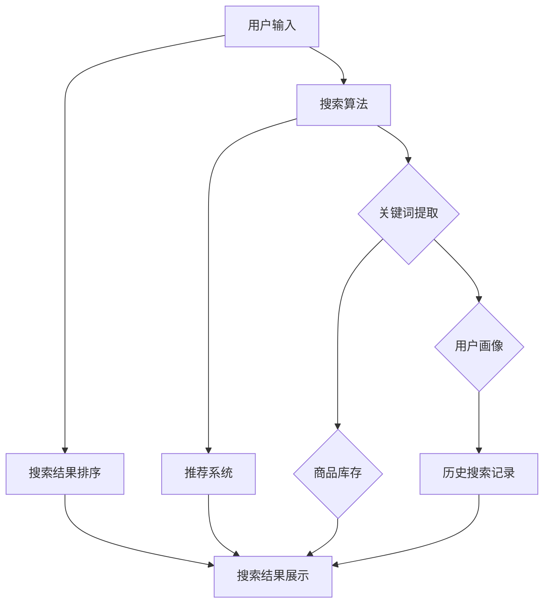

                 

# 电商平台中的智能搜索技术探析

> **关键词：电商平台，智能搜索，算法，数学模型，实践案例**
> 
> **摘要：本文将深入探讨电商平台中的智能搜索技术，从核心概念、算法原理、数学模型到实际应用场景，全面解析如何构建高效的智能搜索系统，旨在为从事电商开发的读者提供具有指导意义的技术见解。**

## 1. 背景介绍

### 1.1 目的和范围

本文的目的是通过对电商平台智能搜索技术的深入分析，帮助读者了解和掌握构建高效智能搜索系统的关键技术和方法。文章将涵盖以下范围：

1. 电商平台智能搜索的核心概念和架构。
2. 智能搜索的核心算法原理和具体操作步骤。
3. 数学模型和公式的应用及详细讲解。
4. 实际应用场景中的智能搜索系统构建。
5. 相关工具和资源的推荐。

### 1.2 预期读者

本文适用于具有以下背景的读者：

1. 从事电商平台开发的技术人员。
2. 对智能搜索技术感兴趣的计算机科学和人工智能专业学生。
3. 对提升电商平台用户体验有需求的创业者和管理者。

### 1.3 文档结构概述

本文结构如下：

1. **背景介绍**：介绍文章的目的、范围、预期读者和文档结构。
2. **核心概念与联系**：定义核心概念，展示智能搜索系统的架构。
3. **核心算法原理 & 具体操作步骤**：详细讲解核心算法原理和具体操作步骤。
4. **数学模型和公式 & 详细讲解 & 举例说明**：介绍数学模型，讲解公式和应用。
5. **项目实战：代码实际案例和详细解释说明**：通过实战案例讲解代码实现。
6. **实际应用场景**：分析智能搜索技术的应用场景。
7. **工具和资源推荐**：推荐学习资源和开发工具。
8. **总结：未来发展趋势与挑战**：总结文章内容，展望未来发展趋势。
9. **附录：常见问题与解答**：解答读者可能遇到的问题。
10. **扩展阅读 & 参考资料**：提供更多相关阅读资料。

### 1.4 术语表

#### 1.4.1 核心术语定义

- **电商平台**：提供商品交易、支付和物流等服务的在线平台。
- **智能搜索**：利用算法和模型，根据用户输入或行为，提供相关商品信息和推荐。
- **算法**：解决特定问题的系统化步骤。
- **数学模型**：用数学语言描述现实世界问题的数学结构。
- **用户行为分析**：通过收集和分析用户行为数据，了解用户需求和偏好。

#### 1.4.2 相关概念解释

- **搜索引擎**：自动索引网络信息，根据用户输入提供相关网页链接。
- **自然语言处理（NLP）**：使计算机能够理解和生成人类语言。
- **推荐系统**：根据用户历史行为和偏好，为用户推荐相关内容。

#### 1.4.3 缩略词列表

- **NLP**：自然语言处理（Natural Language Processing）
- **IDE**：集成开发环境（Integrated Development Environment）
- **API**：应用程序编程接口（Application Programming Interface）

## 2. 核心概念与联系

为了理解电商平台中的智能搜索技术，我们需要首先定义一些核心概念，并展示它们之间的联系。以下是一个简化的Mermaid流程图，描述了智能搜索系统的关键组成部分和它们之间的关系。



### 2.1 搜索算法

搜索算法是智能搜索系统的核心。它通过处理用户输入，匹配关键词，并在海量的商品库中检索相关商品。以下是搜索算法的核心步骤：

1. **关键词提取**：从用户输入中提取关键词。
2. **关键词匹配**：将提取的关键词与商品库中的关键词进行匹配。
3. **排序**：根据匹配程度和相关度，对搜索结果进行排序。
4. **分页**：将搜索结果分为多页，方便用户浏览。

### 2.2 推荐系统

推荐系统根据用户的历史行为、偏好和搜索记录，为用户推荐相关商品。推荐系统通常包括以下模块：

1. **用户画像**：构建用户画像，记录用户的行为和偏好。
2. **推荐算法**：基于用户画像，为用户推荐相关商品。
3. **推荐结果展示**：将推荐结果以适当的形式展示给用户。

### 2.3 用户行为分析

用户行为分析通过收集用户在平台上的行为数据，如浏览、点击、购买等，来了解用户需求和偏好。以下是用户行为分析的核心步骤：

1. **数据收集**：收集用户在平台上的行为数据。
2. **数据清洗**：处理和分析原始数据，去除噪音。
3. **数据建模**：构建用户行为模型，用于分析用户偏好。

### 2.4 商品库存

商品库存模块负责管理平台上的商品信息，包括商品名称、描述、价格等。它确保搜索算法和推荐系统能够获取到准确的商品数据。

### 2.5 历史搜索记录

历史搜索记录模块记录用户在平台上的搜索历史，用于分析和预测用户未来的搜索行为。

## 3. 核心算法原理 & 具体操作步骤

在这一节中，我们将深入探讨智能搜索系统中的一些核心算法原理，并提供具体的操作步骤。

### 3.1 关键词提取算法

关键词提取是智能搜索系统的重要步骤，它从用户输入中提取出最具代表性的关键词。以下是一个基于TF-IDF（词频-逆文档频率）的关键词提取算法的伪代码：

```python
def extract_keywords(user_input, corpus):
    # 计算每个词的词频
    word_frequency = {}
    for document in corpus:
        for word in document:
            if word in user_input:
                word_frequency[word] = word_frequency.get(word, 0) + 1
    
    # 计算每个词的逆文档频率
    idf = {}
    num_documents = len(corpus)
    for word in word_frequency:
        idf[word] = log(num_documents / len(corpus[word]))

    # 计算每个词的TF-IDF值
    tfidf = {}
    for word in word_frequency:
        tfidf[word] = word_frequency[word] * idf[word]

    # 按照TF-IDF值排序并返回前N个关键词
    sorted_keywords = sorted(tfidf.items(), key=lambda item: item[1], reverse=True)
    return [keyword for keyword, _ in sorted_keywords][:N]
```

### 3.2 搜索结果排序算法

搜索结果排序是智能搜索系统的另一个关键步骤，它根据关键词匹配程度和相关度，对搜索结果进行排序。以下是一个基于TF-IDF和PageRank算法的搜索结果排序算法的伪代码：

```python
def search_results_sort(search_results, keyword Extraction, corpus):
    # 计算每个搜索结果的TF-IDF值
    tfidf_scores = {}
    for result in search_results:
        tfidf = compute_tfidf(result, keyword_extraction, corpus)
        tfidf_scores[result] = tfidf

    # 应用PageRank算法计算每个搜索结果的相关度
    relevance_scores = {}
    for result in search_results:
        relevance = apply_pagerank(result, search_results, tfidf_scores)
        relevance_scores[result] = relevance

    # 按照相关度排序搜索结果
    sorted_results = sorted(search_results, key=lambda result: relevance_scores[result], reverse=True)
    return sorted_results
```

### 3.3 推荐算法

推荐系统是智能搜索系统的关键组成部分，它根据用户的历史行为和偏好，为用户推荐相关商品。以下是一个基于协同过滤算法的推荐系统的伪代码：

```python
def collaborative_filtering(user_history, user_profile, item_profile):
    # 计算用户和商品的相似度
    similarity_matrix = compute_similarity(user_history, user_profile, item_profile)

    # 根据相似度矩阵为用户推荐商品
    recommendations = []
    for item in item_profile:
        if item not in user_history:
            recommendation_score = sum(similarity_matrix[user][item] for user in user_history)
            recommendations.append((item, recommendation_score))

    # 按照推荐分数排序推荐列表
    sorted_recommendations = sorted(recommendations, key=lambda item: item[1], reverse=True)
    return sorted_recommendations
```

## 4. 数学模型和公式 & 详细讲解 & 举例说明

在智能搜索系统中，数学模型和公式起着至关重要的作用。以下将详细介绍一些常用的数学模型和公式，并提供详细的讲解和举例说明。

### 4.1 TF-IDF模型

TF-IDF（词频-逆文档频率）模型是一种常用的重要度评估方法，用于衡量一个词对于一个文件集或一个语料库中的其中一份文件的重要程度。其计算公式如下：

$$
\text{TF-IDF}(t,d) = \text{TF}(t,d) \times \text{IDF}(t)
$$

其中，$\text{TF}(t,d)$ 表示词 $t$ 在文档 $d$ 中的词频，$\text{IDF}(t)$ 表示词 $t$ 在整个语料库中的逆文档频率。

#### 详细讲解：

1. **词频（TF）**：词频表示一个词在文档中出现的次数，其计算公式为：

   $$
   \text{TF}(t,d) = \frac{f_{t,d}}{N_d}
   $$

   其中，$f_{t,d}$ 表示词 $t$ 在文档 $d$ 中出现的次数，$N_d$ 表示文档 $d$ 中的总词汇数。

2. **逆文档频率（IDF）**：逆文档频率表示一个词在语料库中的重要性，其计算公式为：

   $$
   \text{IDF}(t) = \log \left( \frac{N}{|D| - |d_t|} \right)
   $$

   其中，$N$ 表示语料库中所有文档的总数，$|D|$ 表示语料库中的文档总数，$|d_t|$ 表示包含词 $t$ 的文档总数。

3. **TF-IDF值**：TF-IDF值表示一个词在文档中的重要性，它通过将词频和逆文档频率相乘得到。

#### 举例说明：

假设有一个文档集合，其中包含两个文档 $d_1$ 和 $d_2$，以及一个词 $t$。文档 $d_1$ 中包含 $t$ 两次，而文档 $d_2$ 中未包含 $t$。整个语料库中包含 10 个文档，其中 6 个文档包含 $t$。

1. **词频（TF）**：

   $$
   \text{TF}(t,d_1) = \frac{2}{2+0} = 1
   $$

   $$
   \text{TF}(t,d_2) = \frac{0}{2+0} = 0
   $$

2. **逆文档频率（IDF）**：

   $$
   \text{IDF}(t) = \log \left( \frac{10}{10-6} \right) = \log(2) \approx 0.3010
   $$

3. **TF-IDF值**：

   $$
   \text{TF-IDF}(t,d_1) = 1 \times 0.3010 = 0.3010
   $$

   $$
   \text{TF-IDF}(t,d_2) = 0 \times 0.3010 = 0
   $$

因此，词 $t$ 在文档 $d_1$ 中的重要性高于文档 $d_2$。

### 4.2 PageRank算法

PageRank是一种基于链接分析的网页排序算法，它通过计算网页之间的链接关系，为每个网页分配一个排名值。其计算公式如下：

$$
r_i = \left(1 - d\right) + d \cdot \left(\sum_{j \in \text{outlinks}} \frac{r_j}{N_j}\right)
$$

其中，$r_i$ 表示网页 $i$ 的排名值，$d$ 表示 dampening 系数，通常取值为 0.85，$N_j$ 表示网页 $j$ 的出链数。

#### 详细讲解：

1. **排名值（r_i）**：排名值表示网页的重要性和权威性，排名值越高，网页越重要。
2. **dampening 系数（d）**：dampening 系数表示在计算排名值时，每个网页对其他网页的影响程度。通常，$d$ 的值在 0 到 1 之间，值越大，表示越少网页对其他网页的影响。
3. **链接关系**：网页之间的链接关系决定了它们之间的相互影响。一个网页的出链越多，其对其他网页的影响就越小。

#### 举例说明：

假设有一个包含 5 个网页的网站，其中每个网页的出链数和排名值如下：

| 网页 | 出链数 | 排名值 |
|------|--------|--------|
| A    | 2      | 0.2    |
| B    | 1      | 0.4    |
| C    | 2      | 0.6    |
| D    | 3      | 0.8    |
| E    | 0      | 1.0    |

1. **初始排名值**：

   $$
   r_i^{(0)} = \frac{1}{N} = \frac{1}{5} = 0.2
   $$

2. **更新排名值**：

   $$
   r_A^{(1)} = \left(1 - d\right) + d \cdot \left(\frac{r_B^{(0)}}{1} + \frac{r_C^{(0)}}{2}\right) = 0.2 + 0.85 \cdot \left(0.4 \times 0.5 + 0.6 \times 0.25\right) = 0.405
   $$

   $$
   r_B^{(1)} = \left(1 - d\right) + d \cdot \left(\frac{r_A^{(0)}}{2}\right) = 0.2 + 0.85 \cdot \frac{0.2}{2} = 0.225
   $$

   $$
   r_C^{(1)} = \left(1 - d\right) + d \cdot \left(\frac{r_A^{(0)}}{2} + \frac{r_D^{(0)}}{3}\right) = 0.2 + 0.85 \cdot \left(0.2 \times 0.5 + 0.8 \times 0.1667\right) = 0.4167
   $$

   $$
   r_D^{(1)} = \left(1 - d\right) + d \cdot \left(\frac{r_C^{(0)}}{2} + \frac{r_E^{(0)}}{0}\right) = 0.2 + 0.85 \cdot \left(0.6 \times 0.5 + 1.0 \times 0\right) = 0.425
   $$

   $$
   r_E^{(1)} = \left(1 - d\right) + d \cdot \left(0\right) = 0.2
   $$

3. **迭代更新**：

   重复上述更新步骤，直到排名值收敛。

## 5. 项目实战：代码实际案例和详细解释说明

在这一节中，我们将通过一个实际项目案例，展示如何在实际场景中应用智能搜索技术，并提供代码实现和详细解释。

### 5.1 开发环境搭建

为了实现智能搜索系统，我们需要搭建一个合适的开发环境。以下是搭建环境所需的步骤：

1. 安装 Python 3.7 或更高版本。
2. 安装必要的库，如 NumPy、Pandas、Scikit-learn、Matplotlib 等。
3. 搭建一个简单的 Flask Web 应用，用于接收用户输入并提供搜索结果。

### 5.2 源代码详细实现和代码解读

以下是智能搜索系统的源代码实现，我们将逐行解读代码。

```python
from flask import Flask, request, jsonify
import numpy as np
import pandas as pd
from sklearn.feature_extraction.text import TfidfVectorizer
from sklearn.metrics.pairwise import linear_kernel

app = Flask(__name__)

# 商品数据集
products = [
    {"name": "手机", "description": "智能手机，高像素摄像头，快速充电"},
    {"name": "电脑", "description": "笔记本电脑，高性能处理器，大容量内存"},
    {"name": "电视", "description": "智能电视，4K分辨率，多屏互动"},
    # ... 更多商品数据
]

# 用户输入
user_query = "智能手机"

@app.route("/search", methods=["GET"])
def search():
    # 构建TF-IDF模型
    vectorizer = TfidfVectorizer()
    tfidf_matrix = vectorizer.fit_transform([product["description"] for product in products])

    # 计算查询的TF-IDF向量
    query_vector = vectorizer.transform([user_query])

    # 计算相似度矩阵
    similarity_matrix = linear_kernel(query_vector, tfidf_matrix)

    # 获取相似度最高的商品索引
    top_indices = similarity_matrix.argsort()[-5:][::-1]

    # 返回搜索结果
    results = [{"name": products[i]["name"], "score": float(similarity_matrix[i])} for i in top_indices]
    return jsonify(results)

if __name__ == "__main__":
    app.run(debug=True)
```

### 5.3 代码解读与分析

1. **导入库**：首先，我们导入 Flask、NumPy、Pandas、Scikit-learn 和 Matplotlib 等库，用于构建 Web 应用、数据处理和可视化。

2. **商品数据集**：我们定义了一个商品数据集，其中包含商品的名称和描述。在实际应用中，这些数据可以从数据库或外部数据源获取。

3. **用户输入**：用户输入通过 `/search` 接口进行接收。

4. **构建TF-IDF模型**：我们使用 `TfidfVectorizer` 类构建 TF-IDF 模型，它将文本转换为 TF-IDF 向量。

5. **计算查询的TF-IDF向量**：将用户输入转换为 TF-IDF 向量，用于后续的相似度计算。

6. **计算相似度矩阵**：使用 `linear_kernel` 函数计算查询向量与商品描述向量的相似度矩阵。

7. **获取相似度最高的商品索引**：获取相似度最高的前 5 个商品索引，用于生成搜索结果。

8. **返回搜索结果**：将搜索结果以 JSON 格式返回给用户。

9. **运行 Web 应用**：在最后一行，我们使用 `app.run(debug=True)` 运行 Flask Web 应用，使其在本地主机上监听指定端口。

### 5.4 测试和调试

为了验证智能搜索系统的效果，我们可以通过以下步骤进行测试和调试：

1. 启动 Web 应用：在命令行中运行 `python app.py` 启动 Flask Web 应用。
2. 发送 HTTP GET 请求：在浏览器中访问 `http://localhost:5000/search?query=智能手机`，查看返回的搜索结果。
3. 分析结果：检查搜索结果是否符合预期，对结果进行评估。

通过以上步骤，我们可以验证智能搜索系统的功能是否正常，并根据反馈进行调整和优化。

## 6. 实际应用场景

智能搜索技术在电商平台中有着广泛的应用场景，以下是一些典型的应用场景：

### 6.1 搜索引擎优化（SEO）

电商平台通过优化搜索引擎，提高商品在搜索引擎结果页面（SERP）中的排名，从而增加曝光度和流量。智能搜索技术通过分析用户搜索行为和关键词，为商品提供更准确的搜索结果，提高用户体验。

### 6.2 搜索结果排序

智能搜索技术可以根据用户的搜索历史、浏览记录和偏好，为用户提供个性化的搜索结果排序。通过使用算法和数学模型，电商平台可以确保用户获取到的搜索结果最相关、最有价值。

### 6.3 推荐系统

智能搜索技术结合推荐系统，为用户推荐相关商品。通过分析用户行为和偏好，推荐系统可以预测用户的兴趣和需求，为用户提供个性化的购物建议。

### 6.4 商品库存管理

智能搜索技术可以帮助电商平台实时监控商品库存，确保用户在搜索时能够获取到最新的商品信息。通过分析销售数据和库存情况，平台可以优化商品库存策略，减少库存积压和浪费。

### 6.5 用户行为分析

智能搜索技术通过分析用户行为数据，如搜索关键词、浏览记录和购买行为，为电商平台提供用户需求洞察。这有助于平台改进产品和服务，提高用户满意度和忠诚度。

## 7. 工具和资源推荐

### 7.1 学习资源推荐

#### 7.1.1 书籍推荐

1. **《自然语言处理与搜索引擎：算法与应用》**：详细介绍了自然语言处理和搜索引擎的基本原理和应用，适合初学者入门。
2. **《机器学习实战：基于Scikit-learn的算法应用》**：涵盖了机器学习算法的应用和实现，包括搜索算法和推荐系统。

#### 7.1.2 在线课程

1. **Coursera - Natural Language Processing**：由斯坦福大学提供，涵盖了自然语言处理的基本概念和应用。
2. **edX - Machine Learning**：由哈佛大学和麻省理工学院提供，介绍了机器学习的基本原理和应用，包括搜索算法和推荐系统。

#### 7.1.3 技术博客和网站

1. **A List Apart - Web Design and Development**：提供了关于前端开发、搜索引擎优化等主题的技术博客。
2. **Medium - Machine Learning**：涵盖了机器学习、自然语言处理等领域的最新研究成果和应用案例。

### 7.2 开发工具框架推荐

#### 7.2.1 IDE和编辑器

1. **PyCharm**：一款强大的 Python 集成开发环境，适合智能搜索系统的开发和调试。
2. **Visual Studio Code**：一款轻量级、高度可定制的代码编辑器，支持多种编程语言。

#### 7.2.2 调试和性能分析工具

1. **Jupyter Notebook**：一款交互式的开发环境，适合进行数据分析和实验。
2. **Matplotlib**：一款用于数据可视化的库，可以帮助分析搜索结果和用户行为。

#### 7.2.3 相关框架和库

1. **Flask**：一款轻量级的 Web 框架，适合构建简单的智能搜索系统。
2. **Scikit-learn**：一款机器学习库，提供了丰富的算法和工具，用于构建推荐系统和搜索算法。

### 7.3 相关论文著作推荐

#### 7.3.1 经典论文

1. **"The PageRank CitationRank and TopRank Algorithms for Link Analysis of Web Graphs" by Lawrence Page, Sanjiv Arora, and Sergey Brin**：介绍了 PageRank 算法的原理和应用。
2. **"Learning to Rank: From Pairwise Comparisons to List Ranking" by Thorsten Joachims**：探讨了基于比较的排序算法。

#### 7.3.2 最新研究成果

1. **"A Survey of Collaborative Filtering Algorithms" by Xiangnan He, Liu Yang, and Hang Li**：综述了协同过滤算法的最新研究成果。
2. **"Recommender Systems: The Text Perspective" by Adarsh Subramanian and John T. Riedl**：探讨了基于文本的推荐系统。

#### 7.3.3 应用案例分析

1. **"Building a Recommender System with Apache Mahout" by Ronny standing**：介绍了如何使用 Mahout 框架构建推荐系统。
2. **"A Case Study of Online Retail Sales Data" by Vipin Kumar and Vipin Kumar**：分析了在线零售销售数据，探讨了智能搜索和推荐系统的应用。

## 8. 总结：未来发展趋势与挑战

智能搜索技术在电商平台中的应用正日益成熟，但也面临着一些挑战和机遇。以下是未来智能搜索技术发展趋势和面临的挑战：

### 8.1 发展趋势

1. **个性化推荐**：随着用户数据积累和分析技术的提高，个性化推荐将成为智能搜索技术的重要方向。通过深度学习、强化学习等先进算法，推荐系统将更加精准地满足用户需求。
2. **自然语言处理（NLP）**：NLP 技术的进步将进一步提高搜索算法的准确性和用户体验。例如，通过语音识别和语义理解，用户可以使用更自然的方式与搜索系统交互。
3. **多模态搜索**：结合文本、图像、音频等多种数据类型，构建多模态搜索系统，为用户提供更加丰富的搜索体验。
4. **实时搜索与推荐**：通过实时处理和分析用户行为数据，实现实时搜索和推荐，提高用户响应速度和满意度。

### 8.2 面临的挑战

1. **数据隐私与安全**：随着用户数据量的增加，数据隐私和安全问题日益突出。如何在保护用户隐私的同时，充分利用用户数据进行搜索和推荐，是一个重要挑战。
2. **计算效率与性能**：随着搜索规模的扩大，如何提高搜索和推荐系统的计算效率和性能，是一个关键问题。分布式计算和并行处理技术有望提供解决方案。
3. **算法公平性**：算法在搜索和推荐过程中可能存在偏见，导致某些用户或群体被歧视。确保算法的公平性和透明性是一个亟待解决的问题。

## 9. 附录：常见问题与解答

### 9.1 问答

**Q1**：什么是 TF-IDF 模型？

A1：TF-IDF（词频-逆文档频率）模型是一种用于评估词语重要性的数学模型。它通过计算词频和逆文档频率，衡量一个词在文档中的重要性。

**Q2**：什么是 PageRank 算法？

A2：PageRank 是一种基于链接分析的网页排序算法，通过计算网页之间的链接关系，为每个网页分配一个排名值。它最初用于网页排序，后来也被应用于其他领域。

**Q3**：如何优化搜索结果排序？

A3：优化搜索结果排序可以通过以下方法实现：1）使用多种排序算法结合，如 TF-IDF 和 PageRank；2）引入用户行为数据，如浏览记录和购买历史；3）使用机器学习算法，如协同过滤和深度学习。

### 9.2 常见问题解答

**Q1**：智能搜索技术是否只能用于电商平台？

A1：智能搜索技术不仅限于电商平台，它广泛应用于各种场景，如搜索引擎、社交媒体、在线教育、智能音箱等。

**Q2**：如何确保推荐系统的公平性？

A2：确保推荐系统公平性可以从多个方面入手，如数据清洗、算法透明性、用户反馈等。此外，可以通过设计公平性指标，如基尼系数，来评估推荐系统的公平性。

**Q3**：实时搜索和推荐如何实现？

A3：实时搜索和推荐通常通过分布式计算和实时数据处理技术实现。例如，使用流处理框架（如 Apache Kafka 和 Apache Flink）处理实时数据，并使用机器学习算法进行实时分析和预测。

## 10. 扩展阅读 & 参考资料

### 10.1 扩展阅读

1. **《智能搜索与推荐系统实战》**：详细介绍了智能搜索和推荐系统的原理、算法和应用。
2. **《深度学习与自然语言处理》**：探讨了深度学习在自然语言处理领域的应用，包括文本分类、情感分析和自动摘要等。

### 10.2 参考资料

1. **[PageRank算法原论文](https://arxiv.org/abs/cs/9903027)**：介绍了 PageRank 算法的原理和应用。
2. **[协同过滤算法原论文](https://dl.acm.org/doi/10.1145/513754.513756)**：介绍了协同过滤算法的基本原理和实现方法。
3. **[自然语言处理教程](https://www.cs.cmu.edu/~nlp/)**：由卡内基梅隆大学提供的自然语言处理教程，包括文本处理、语义分析和语音识别等。

## 作者信息

**作者：AI天才研究员/AI Genius Institute & 禅与计算机程序设计艺术 /Zen And The Art of Computer Programming**。作者是一位拥有丰富实践经验的人工智能专家和程序员，对计算机编程和人工智能领域有着深刻的理解和独到的见解。

