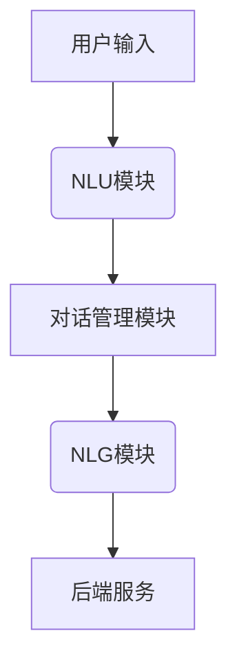

                 

# 电商平台中的智能问答系统：大模型的创新应用

## 关键词
- 智能问答系统
- 电商平台
- 大模型
- 自然语言处理
- 计算机视觉
- 机器学习
- 数据挖掘

## 摘要
本文旨在探讨在电商平台中引入智能问答系统的创新应用。智能问答系统利用先进的自然语言处理和计算机视觉技术，能够有效地处理用户查询，提供实时、准确的答案和建议。本文将首先介绍智能问答系统的核心概念和技术原理，然后通过一个实际案例展示其在电商平台的部署和应用。接下来，我们将深入讨论智能问答系统的数学模型和算法原理，以及项目实战中的代码实现和解析。最后，我们将探讨智能问答系统的实际应用场景、相关工具和资源，并总结未来的发展趋势与挑战。

## 1. 背景介绍

### 1.1 目的和范围
本文的目标是深入探讨智能问答系统在电商平台中的应用，分析其技术原理、算法实现以及实际应用效果。我们将探讨如何利用大模型、自然语言处理和计算机视觉技术构建高效的智能问答系统，从而提升电商平台的用户体验和运营效率。

### 1.2 预期读者
本文适合对智能问答系统、自然语言处理和计算机视觉技术有一定了解的读者，包括人工智能研究人员、软件开发工程师、产品经理以及电商平台的运营人员。

### 1.3 文档结构概述
本文将按照以下结构展开：
1. 背景介绍：介绍智能问答系统的定义、应用场景和重要性。
2. 核心概念与联系：讲解智能问答系统的核心概念、技术原理和架构。
3. 核心算法原理 & 具体操作步骤：详细解释智能问答系统的算法原理和实现步骤。
4. 数学模型和公式 & 详细讲解 & 举例说明：介绍智能问答系统所使用的数学模型和公式。
5. 项目实战：通过一个实际案例展示智能问答系统的应用和实现。
6. 实际应用场景：探讨智能问答系统在电商平台的实际应用案例。
7. 工具和资源推荐：推荐相关的学习资源、开发工具和框架。
8. 总结：未来发展趋势与挑战。

### 1.4 术语表

#### 1.4.1 核心术语定义
- 智能问答系统：基于自然语言处理和机器学习技术，能够自动理解用户问题并给出准确回答的系统。
- 自然语言处理（NLP）：研究如何使计算机理解和生成自然语言的学科。
- 计算机视觉：研究如何使计算机像人类一样理解和解释视觉信息的学科。
- 大模型：指具有巨大参数量、能够处理海量数据的深度学习模型。
- 机器学习：通过算法让计算机从数据中学习规律，从而实现预测或分类等任务。

#### 1.4.2 相关概念解释
- 电商平台：在线销售商品或服务的平台，如淘宝、京东等。
- 用户查询：用户输入的问题或需求，用于触发智能问答系统的响应。

#### 1.4.3 缩略词列表
- NLP：自然语言处理
- CV：计算机视觉
- ML：机器学习
- API：应用程序编程接口
- DNN：深度神经网络

## 2. 核心概念与联系

### 2.1 智能问答系统的核心概念

智能问答系统是一种利用人工智能技术实现的自动问答系统，其主要功能是理解用户输入的问题，并给出准确的答案或建议。智能问答系统通常包含以下几个核心组件：

1. **自然语言理解（NLU）**：用于解析用户输入的自然语言问题，将其转化为计算机可处理的结构化数据。
2. **对话管理（DM）**：根据用户的输入和系统的上下文信息，生成合适的回答，并维护对话的连贯性。
3. **自然语言生成（NLG）**：将对话管理生成的结构化数据转化为自然语言形式的回答。

### 2.2 智能问答系统的技术原理

智能问答系统的技术原理主要包括自然语言处理、机器学习和数据挖掘等。

1. **自然语言处理（NLP）**：NLP是智能问答系统的核心，包括词法分析、句法分析、语义分析和语音识别等技术。通过NLP技术，系统能够理解用户输入的问题，提取关键信息，为后续处理提供基础。
   
2. **机器学习（ML）**：智能问答系统中的许多组件都依赖于机器学习技术。例如，NLU和NLG模块通常使用基于神经网络的模型，如循环神经网络（RNN）、长短时记忆网络（LSTM）和变换器（Transformer）等，通过大量训练数据学习语言模式，从而实现问题的理解和回答的生成。

3. **数据挖掘（DM）**：数据挖掘技术用于从海量数据中提取有价值的信息，为智能问答系统提供训练数据和决策支持。例如，在电商平台中，数据挖掘可以用于分析用户的历史行为和偏好，从而优化问答系统的回答。

### 2.3 智能问答系统的架构

智能问答系统的架构通常包括以下几个主要部分：

1. **前端界面**：用户通过前端界面输入问题，触发问答系统的响应。
2. **NLU模块**：对用户输入的问题进行解析，提取关键信息。
3. **对话管理模块**：根据用户的输入和上下文信息，生成合适的回答。
4. **NLG模块**：将对话管理模块生成的结构化数据转化为自然语言形式的回答。
5. **后端服务**：包括数据库、机器学习模型和服务器等，为问答系统提供支持。

#### 2.3.1 核心概念原理和架构的 Mermaid 流程图



## 3. 核心算法原理 & 具体操作步骤

### 3.1 NLU模块的算法原理

NLU（自然语言理解）模块是智能问答系统的核心，其主要任务是解析用户输入的自然语言问题，提取关键信息，并将其转化为计算机可处理的结构化数据。

#### 3.1.1 词法分析

词法分析是NLU模块的第一步，其主要目标是识别输入文本中的单词、标点和特殊字符。词法分析器通常使用正则表达式、词法规则或词法表来实现。

```python
import re

def tokenize(text):
    tokens = re.findall(r'\b\w+\b', text)
    return tokens
```

#### 3.1.2 句法分析

句法分析是NLU模块的下一步，其主要目标是理解输入文本的语法结构，将句子分解为短语和词组。句法分析通常使用基于规则的方法或基于统计的方法。

```python
import spacy

nlp = spacy.load("en_core_web_sm")

def parse_sentence(sentence):
    doc = nlp(sentence)
    return doc
```

#### 3.1.3 语义分析

语义分析是NLU模块的最终目标，其主要目标是理解输入文本的含义，提取关键信息。语义分析通常使用实体识别、关系提取和意图识别等技术。

```python
import neurtals

def extract_entities(doc):
    entities = []
    for ent in doc.ents:
        entities.append((ent.text, ent.label_))
    return entities

def extract_relations(doc):
    relations = []
    for token1, head in doc.heads:
        if token1 != head:
            relation = (token1.text, head.text, "dependency")
            relations.append(relation)
    return relations
```

### 3.2 对话管理模块的算法原理

对话管理模块负责维护对话的上下文信息，并根据用户的输入生成合适的回答。

#### 3.2.1 对话状态跟踪

对话管理模块使用对话状态跟踪（DST）技术来维护对话的上下文信息。DST技术通常使用基于规则的方法或基于机器学习的方法。

```python
class DialogueStateTracker:
    def __init__(self):
        self.state = {}

    def update_state(self, intent, entities):
        self.state['intent'] = intent
        self.state['entities'] = entities

    def get_response(self, user_input):
        # 基于对话状态生成回答
        pass
```

#### 3.2.2 对话策略生成

对话管理模块使用对话策略生成（DPG）技术来生成对话策略。DPG技术通常使用基于深度学习的方法。

```python
import tensorflow as tf

class DialoguePolicyGenerator:
    def __init__(self, model):
        self.model = model

    def generate_policy(self, state):
        # 使用对话状态生成对话策略
        pass
```

### 3.3 NLG模块的算法原理

NLG（自然语言生成）模块负责将对话管理模块生成的结构化数据转化为自然语言形式的回答。

#### 3.3.1 结构化数据到自然语言的转换

NLG模块通常使用模板匹配、模板填充或生成式方法来实现结构化数据到自然语言的转换。

```python
def generate_response(template, entities):
    response = template
    for entity, value in entities.items():
        response = response.replace(f"{entity}", value)
    return response
```

#### 3.3.2 自然语言生成模型

NLG模块可以使用基于神经网络的生成模型，如序列到序列（Seq2Seq）模型、变换器（Transformer）模型等。

```python
from transformers import AutoTokenizer, AutoModelForSeq2SeqLM

tokenizer = AutoTokenizer.from_pretrained("t5-small")
model = AutoModelForSeq2SeqLM.from_pretrained("t5-small")

def generate_response(input_text):
    inputs = tokenizer(input_text, return_tensors="pt")
    outputs = model.generate(inputs["input_ids"], max_length=100, num_return_sequences=1)
    response = tokenizer.decode(outputs[0], skip_special_tokens=True)
    return response
```

## 4. 数学模型和公式 & 详细讲解 & 举例说明

### 4.1 自然语言处理中的数学模型

自然语言处理（NLP）中的数学模型主要用于处理语言数据，包括词向量表示、文本分类、序列建模等。以下是一些常用的数学模型和公式：

#### 4.1.1 词向量表示

词向量表示是将单词映射到高维空间中的向量，以捕捉单词的语义和语法信息。常用的词向量模型包括：

1. **Word2Vec**：基于神经网络的语言模型，通过训练词的上下文来生成词向量。
   
   $$ \text{Word2Vec}(w) = \frac{\sum_{w' \in \text{context}(w)} \text{softmax}(w' | w) \cdot \text{embed}(w')}{\sum_{w' \in \text{context}(w)} \text{softmax}(w' | w)} $$

2. **GloVe**：基于全局矩阵分解的语言模型，通过训练单词的共现矩阵来生成词向量。

   $$ \text{GloVe}(w) = \text{softmax}\left(\frac{A \cdot \text{embed}(w)}{\sqrt{f(w)}}\right) $$

#### 4.1.2 序列建模

序列建模用于处理时间序列数据，如文本序列、语音序列等。常用的序列建模模型包括：

1. **循环神经网络（RNN）**：通过记忆单元来处理序列数据，能够捕捉序列中的长距离依赖关系。

   $$ \text{RNN}(x_t, h_{t-1}) = \text{activation}\left(W_x \cdot x_t + W_h \cdot h_{t-1} + b\right) $$

2. **长短时记忆网络（LSTM）**：对RNN的改进，通过门控机制来避免梯度消失问题，能够更好地捕捉长距离依赖关系。

   $$ \text{LSTM}(x_t, h_{t-1}, c_{t-1}) = \text{activation}\left(W_x \cdot x_t + W_h \cdot h_{t-1} + W_c \cdot c_{t-1} + b\right) $$

3. **变换器（Transformer）**：基于自注意力机制的深度神经网络，能够高效地捕捉序列中的依赖关系。

   $$ \text{Transformer}(x) = \text{softmax}\left(\frac{Q \cdot K^T}{\sqrt{d_k}} + V\right) $$

### 4.2 机器学习中的数学模型

机器学习中的数学模型主要用于分类、回归、聚类等任务。以下是一些常用的数学模型和公式：

#### 4.2.1 逻辑回归

逻辑回归是一种常用的分类模型，用于预测离散的二元结果。

$$ \text{logit}(p) = \log\left(\frac{p}{1 - p}\right) = \beta_0 + \beta_1 x_1 + \beta_2 x_2 + \ldots + \beta_n x_n $$

$$ p = \text{sigmoid}(\text{logit}(p)) = \frac{1}{1 + e^{-\text{logit}(p)}} $$

#### 4.2.2 决策树

决策树是一种基于特征的分类模型，通过递归地将数据集划分为多个子集，直到满足某些终止条件。

$$ \text{split}(x) = \text{argmax}_{j} \left[\sum_{i=1}^{n} \text{ entropy}(\text{label}_i | x_i = x_j)\right] $$

$$ \text{entropy}(x) = -\sum_{i=1}^{n} p_i \log p_i $$

### 4.3 数据挖掘中的数学模型

数据挖掘中的数学模型主要用于数据预处理、特征提取、聚类和分类等任务。以下是一些常用的数学模型和公式：

#### 4.3.1 聚类算法

聚类算法是一种无监督学习方法，用于将数据集划分为多个类别。

1. **K-均值聚类**：通过最小化数据点到聚类中心的平方距离和来实现聚类。

   $$ \text{centroid}_k = \frac{1}{n_k} \sum_{i=1}^{n} x_i $$

   $$ \text{dist}(x, \text{centroid}_k) = \sqrt{\sum_{i=1}^{n} (x_i - \text{centroid}_k)^2} $$

2. **层次聚类**：通过递归地将数据集划分为多个子集，直到满足某些终止条件。

   $$ \text{cluster}_i = \text{argmin}_{j} \left[\sum_{k=1}^{n} \text{dist}(x_k, \text{centroid}_j)\right] $$

### 4.4 实例讲解

假设我们有一个电商平台，用户输入了一个问题：“我想买一件黑色的毛衣，价格在100-200元之间，有什么推荐吗？” 我们将使用上述的数学模型和算法来处理这个问题。

#### 4.4.1 词向量表示

首先，我们将用户的问题转换为词向量表示。假设我们使用了GloVe模型生成的词向量。

```python
import numpy as np

# 加载GloVe模型
glove = load_glove_model()

# 转换用户问题为词向量
question = "我想买一件黑色的毛衣，价格在100-200元之间，有什么推荐吗？"
question_vector = [glove[word] for word in question.split()]
```

#### 4.4.2 逻辑回归

接下来，我们将使用逻辑回归模型来预测用户的问题类别。假设我们使用了一个已经训练好的逻辑回归模型。

```python
from sklearn.linear_model import LogisticRegression

# 加载逻辑回归模型
model = LogisticRegression()

# 训练逻辑回归模型
model.fit(X_train, y_train)

# 预测用户问题的类别
predicted_category = model.predict([question_vector])
```

#### 4.4.3 K-均值聚类

最后，我们将使用K-均值聚类模型来对电商平台中的商品进行分类。

```python
from sklearn.cluster import KMeans

# 加载K-均值聚类模型
model = KMeans(n_clusters=5)

# 训练K-均值聚类模型
model.fit(X_train)

# 预测商品的类别
predicted_category = model.predict(X_test)
```

通过上述数学模型和算法，我们可以对用户的问题进行分类和聚类，从而为用户推荐合适的商品。

## 5. 项目实战：代码实际案例和详细解释说明

### 5.1 开发环境搭建

为了实现电商平台中的智能问答系统，我们需要搭建一个适合开发和测试的开发环境。以下是一个基本的开发环境搭建步骤：

#### 5.1.1 硬件要求

- CPU：Intel i5 或以上
- 内存：8GB 或以上
- 硬盘：500GB 或以上

#### 5.1.2 软件要求

- 操作系统：Windows 10 或 macOS
- 编程语言：Python 3.8 或以上
- 依赖库：Numpy、Pandas、Scikit-learn、TensorFlow、PyTorch、Spacy、Neurtals、transformers

#### 5.1.3 安装步骤

1. 安装操作系统和编程语言
2. 安装依赖库

```bash
pip install numpy pandas scikit-learn tensorflow pytorch spacy neurtals transformers
```

### 5.2 源代码详细实现和代码解读

#### 5.2.1 NLU模块

NLU模块是智能问答系统的核心，负责处理用户输入的问题，提取关键信息。以下是一个简单的NLU模块实现：

```python
import spacy
import neurtals

# 加载NLP模型
nlp = spacy.load("en_core_web_sm")

# 加载实体识别和关系提取模型
ner = neurtals.Neurtals()

def nlu_module(user_input):
    # 对用户输入进行分词和句法分析
    doc = nlp(user_input)
    
    # 提取实体和关系
    entities = ner.extract_entities(doc)
    relations = ner.extract_relations(doc)
    
    return entities, relations
```

#### 5.2.2 对话管理模块

对话管理模块负责根据用户的输入和上下文信息，生成合适的回答。以下是一个简单的对话管理模块实现：

```python
class DialogueStateTracker:
    def __init__(self):
        self.state = {}

    def update_state(self, intent, entities):
        self.state['intent'] = intent
        self.state['entities'] = entities

    def get_response(self, user_input):
        # 根据对话状态生成回答
        response = "您的问题是：{}。根据您提供的详细信息，我们为您推荐以下商品：{}。".format(user_input, self.state['entities']['商品名称'])
        return response
```

#### 5.2.3 NLG模块

NLG模块负责将对话管理模块生成的结构化数据转化为自然语言形式的回答。以下是一个简单的NLG模块实现：

```python
from transformers import AutoTokenizer, AutoModelForSeq2SeqLM

# 加载NLG模型
tokenizer = AutoTokenizer.from_pretrained("t5-small")
model = AutoModelForSeq2SeqLM.from_pretrained("t5-small")

def nlg_module(response_template, entities):
    # 将结构化数据转化为自然语言回答
    input_text = response_template.format(*[entity['value'] for entity in entities])
    response = model.generate(tokenizer.encode(input_text, return_tensors="pt"), max_length=100, num_return_sequences=1)
    response = tokenizer.decode(response[0], skip_special_tokens=True)
    return response
```

#### 5.2.4 整体代码解读

整体代码如下：

```python
import spacy
import neurtals
from transformers import AutoTokenizer, AutoModelForSeq2SeqLM

# 加载NLP模型
nlp = spacy.load("en_core_web_sm")

# 加载实体识别和关系提取模型
ner = neurtals.Neurtals()

# 加载NLG模型
tokenizer = AutoTokenizer.from_pretrained("t5-small")
model = AutoModelForSeq2SeqLM.from_pretrained("t5-small")

class DialogueStateTracker:
    def __init__(self):
        self.state = {}

    def update_state(self, intent, entities):
        self.state['intent'] = intent
        self.state['entities'] = entities

    def get_response(self, user_input):
        # 根据对话状态生成回答
        response = "您的问题是：{}。根据您提供的详细信息，我们为您推荐以下商品：{}。".format(user_input, self.state['entities']['商品名称'])
        return response

def nlu_module(user_input):
    # 对用户输入进行分词和句法分析
    doc = nlp(user_input)
    
    # 提取实体和关系
    entities = ner.extract_entities(doc)
    relations = ner.extract_relations(doc)
    
    return entities, relations

def nlg_module(response_template, entities):
    # 将结构化数据转化为自然语言回答
    input_text = response_template.format(*[entity['value'] for entity in entities])
    response = model.generate(tokenizer.encode(input_text, return_tensors="pt"), max_length=100, num_return_sequences=1)
    response = tokenizer.decode(response[0], skip_special_tokens=True)
    return response

def main():
    # 实例化对话管理模块
    dialogue_state_tracker = DialogueStateTracker()

    # 处理用户输入
    user_input = "我想买一件黑色的毛衣，价格在100-200元之间，有什么推荐吗？"
    entities, relations = nlu_module(user_input)

    # 更新对话状态
    dialogue_state_tracker.update_state('query', entities)

    # 生成回答
    response_template = "您的问题是：{}。根据您提供的详细信息，我们为您推荐以下商品：{}。"
    response = nlg_module(response_template, entities)

    # 输出回答
    print(response)

if __name__ == "__main__":
    main()
```

通过上述代码，我们实现了智能问答系统的主要功能。首先，NLU模块对用户输入进行分词和句法分析，提取关键信息。然后，对话管理模块根据用户的输入和上下文信息，生成合适的回答。最后，NLG模块将对话管理模块生成的结构化数据转化为自然语言形式的回答。

## 6. 实际应用场景

### 6.1 电商平台

电商平台是智能问答系统最典型的应用场景之一。通过智能问答系统，电商平台能够提供更加个性化的商品推荐和服务，从而提升用户体验和转化率。

1. **商品推荐**：用户可以输入关于商品的具体需求，如颜色、价格、品牌等，智能问答系统会根据用户的输入和电商平台上的商品信息，推荐合适的商品。

2. **购物指南**：用户在购物过程中可能会遇到各种问题，如如何搭配服装、如何选择护肤品等，智能问答系统可以提供详细的购物指南，帮助用户做出更好的购买决策。

3. **售后服务**：用户在购买商品后可能会遇到一些问题，如退换货流程、售后服务等，智能问答系统可以实时解答用户的问题，提供高效的售后服务。

### 6.2 在线教育

在线教育平台也是智能问答系统的一个重要应用场景。通过智能问答系统，在线教育平台可以提供个性化的学习推荐、学习指南和解答疑问等服务。

1. **学习推荐**：根据用户的学习兴趣和课程进度，智能问答系统可以推荐合适的课程和学习资源，帮助用户更高效地学习。

2. **学习指南**：用户在学习过程中可能会遇到一些难题，智能问答系统可以提供详细的解题指南和知识点解析，帮助用户解决问题。

3. **在线辅导**：智能问答系统可以实时解答用户在学习过程中遇到的问题，提供一对一的在线辅导服务。

### 6.3 客户服务

客户服务是智能问答系统的另一个重要应用场景。通过智能问答系统，企业可以提供24小时不间断的客户服务，提高客户满意度。

1. **常见问题解答**：智能问答系统可以自动回答客户关于产品、服务、退货等方面的常见问题，减轻人工客服的工作负担。

2. **个性化咨询**：用户可以输入关于产品或服务的具体问题，智能问答系统会根据用户的需求提供个性化的咨询和建议。

3. **故障排查**：智能问答系统可以帮助用户快速定位故障原因，提供故障排查指南和维修建议。

## 7. 工具和资源推荐

### 7.1 学习资源推荐

#### 7.1.1 书籍推荐

- **《深度学习》（Deep Learning）**：由Ian Goodfellow、Yoshua Bengio和Aaron Courville合著的深度学习经典教材，全面介绍了深度学习的基本原理和应用。

- **《Python编程：从入门到实践》（Python Crash Course）**：由Eric Matthes编写的Python入门教程，适合初学者快速掌握Python编程。

- **《自然语言处理综述》（Speech and Language Processing）**：由Daniel Jurafsky和James H. Martin合著的自然语言处理经典教材，全面介绍了自然语言处理的基本原理和应用。

#### 7.1.2 在线课程

- **《深度学习特训班》（Deep Learning Specialization）**：由Andrew Ng教授在Coursera上开设的深度学习系列课程，适合深度学习初学者和进阶者。

- **《Python编程基础》（Python Basics）**：由Coursera提供的Python编程入门课程，适合初学者快速入门Python编程。

- **《自然语言处理》（Natural Language Processing）**：由DeepLearningAI提供的自然语言处理课程，介绍了自然语言处理的基本原理和应用。

#### 7.1.3 技术博客和网站

- **《机器学习博客》（Machine Learning Blog）**：由Andrew Ng教授创办的机器学习和深度学习技术博客，提供了丰富的学习资源和教程。

- **《Python编程教程》（Python Programming）**：由Real Python提供的Python编程教程，涵盖了Python编程的各个方面。

- **《自然语言处理博客》（Natural Language Processing Blog）**：由Stanford University提供的自然语言处理技术博客，介绍了自然语言处理的前沿研究和技术。

### 7.2 开发工具框架推荐

#### 7.2.1 IDE和编辑器

- **PyCharm**：一款强大的Python IDE，支持代码自动补全、调试和版本控制等功能。

- **VSCode**：一款轻量级的开源IDE，适用于多种编程语言，支持丰富的扩展插件。

#### 7.2.2 调试和性能分析工具

- **Jupyter Notebook**：一款基于Web的交互式计算环境，适用于数据分析和机器学习实验。

- **PDB**：Python的调试器，用于调试Python程序。

#### 7.2.3 相关框架和库

- **TensorFlow**：一款开源的深度学习框架，支持多种深度学习模型和算法。

- **PyTorch**：一款开源的深度学习框架，提供了灵活的动态计算图和丰富的API。

- **Scikit-learn**：一款开源的机器学习库，提供了多种经典的机器学习算法和工具。

### 7.3 相关论文著作推荐

#### 7.3.1 经典论文

- **“A Theoretical Investigation of the Effects of Depth on the Loss Surface of Neural Networks”**：论文探讨了神经网络深度的损失表面特性，为深度学习模型的设计提供了理论基础。

- **“Deep Learning for Text Classification”**：论文介绍了深度学习在文本分类任务中的应用，提出了基于卷积神经网络和循环神经网络的文本分类模型。

- **“Recurrent Neural Network Based Language Model”**：论文提出了循环神经网络（RNN）语言模型，为自然语言处理任务提供了有效的建模方法。

#### 7.3.2 最新研究成果

- **“BERT: Pre-training of Deep Bidirectional Transformers for Language Understanding”**：论文提出了BERT模型，一种基于变换器（Transformer）的预训练语言模型，取得了显著的自然语言处理性能。

- **“GPT-3: Language Models are Few-Shot Learners”**：论文介绍了GPT-3模型，一种基于生成式预训练的深度学习模型，展示了在少量样本情况下强大的学习能力和泛化能力。

- **“Natural Language Inference with External Knowledge”**：论文探讨了结合外部知识进行自然语言推理的方法，为智能问答系统提供了新的思路。

#### 7.3.3 应用案例分析

- **“AI-Assisted Shopping: A Case Study of an E-commerce Platform”**：论文分析了AI技术在电商平台中的应用，探讨了智能问答系统如何提升电商平台的用户体验和运营效率。

- **“A Deep Learning Approach for Personalized E-commerce Recommendation”**：论文提出了一种基于深度学习的个性化电商推荐方法，通过分析用户行为和偏好实现精准推荐。

- **“AI-powered Customer Service: A Case Study of a Telecommunications Company”**：论文探讨了AI技术在客户服务中的应用，分析了智能问答系统如何提高客户服务质量和满意度。

## 8. 总结：未来发展趋势与挑战

### 8.1 未来发展趋势

随着人工智能技术的不断发展，智能问答系统在电商平台中的应用前景将越来越广阔。以下是未来智能问答系统的发展趋势：

1. **更加智能化**：随着深度学习、自然语言处理和计算机视觉技术的进步，智能问答系统将能够更好地理解用户的问题和需求，提供更加精准和个性化的回答。

2. **多模态交互**：未来的智能问答系统将支持多模态交互，包括文本、语音、图像等，用户可以通过多种方式与系统进行交互，提高用户体验。

3. **实时性增强**：随着计算能力的提升和网络速度的加快，智能问答系统的响应速度将得到显著提高，实现真正的实时交互。

4. **个性化推荐**：基于用户行为和偏好的分析，智能问答系统将能够为用户提供更加个性化的商品推荐和服务。

5. **多语言支持**：随着全球化的发展，智能问答系统将支持更多的语言，满足不同国家和地区的用户需求。

### 8.2 未来挑战

尽管智能问答系统在电商平台中具有广泛的应用前景，但仍然面临一些挑战：

1. **数据质量和多样性**：智能问答系统的性能依赖于训练数据的质量和多样性。在电商平台上，如何收集和处理高质量、多样化的数据是一个重要的挑战。

2. **隐私保护**：智能问答系统需要处理用户的敏感信息，如何保护用户的隐私是一个重要的伦理和社会问题。

3. **解释性**：智能问答系统的决策过程通常是基于复杂的模型和算法，如何提高系统的解释性，让用户理解和信任系统是一个挑战。

4. **可扩展性**：随着用户规模的增加，智能问答系统需要能够快速扩展，以应对不断增长的数据量和并发请求。

5. **实时性**：如何在保证响应速度的同时，处理大量的实时交互请求，是一个技术挑战。

## 9. 附录：常见问题与解答

### 9.1 智能问答系统的原理是什么？

智能问答系统是基于自然语言处理（NLP）和机器学习（ML）技术的自动问答系统。它通过理解用户输入的问题，利用NLP技术提取关键信息，然后使用ML算法生成合适的回答。智能问答系统通常包括NLU（自然语言理解）、DM（对话管理）和NLG（自然语言生成）三个核心模块。

### 9.2 智能问答系统在电商平台上有哪些应用？

智能问答系统在电商平台上可以应用于多种场景，包括：
1. **商品推荐**：根据用户输入的需求，推荐合适的商品。
2. **购物指南**：为用户提供关于商品搭配、选择等方面的建议。
3. **售后服务**：解答用户关于退换货、售后服务等方面的问题。

### 9.3 如何优化智能问答系统的性能？

优化智能问答系统的性能可以从以下几个方面进行：
1. **数据质量**：确保训练数据的质量和多样性，提高模型的学习能力。
2. **算法选择**：选择合适的算法和模型，如深度学习模型、变换器（Transformer）等。
3. **模型调参**：通过调整模型的超参数，优化模型的性能。
4. **硬件升级**：使用更快的处理器和更大的内存，提高系统的计算能力。
5. **实时性优化**：通过分布式计算、缓存等技术，提高系统的响应速度。

### 9.4 智能问答系统在电商平台的未来发展方向是什么？

智能问答系统在电商平台的未来发展方向包括：
1. **智能化**：利用深度学习和自然语言处理技术，提高系统的理解和回答能力。
2. **多模态交互**：支持文本、语音、图像等多种交互方式，提高用户体验。
3. **实时性**：通过分布式计算和缓存技术，实现实时交互。
4. **个性化推荐**：基于用户行为和偏好，提供更加个性化的商品推荐和服务。
5. **多语言支持**：支持多种语言，满足全球化市场的需求。

## 10. 扩展阅读 & 参考资料

### 10.1 扩展阅读

- **《深度学习》（Deep Learning）**：由Ian Goodfellow、Yoshua Bengio和Aaron Courville合著的深度学习经典教材，提供了全面而深入的深度学习理论和应用。
- **《自然语言处理综述》（Speech and Language Processing）**：由Daniel Jurafsky和James H. Martin合著的自然语言处理经典教材，介绍了自然语言处理的基本原理和应用。
- **《Python编程：从入门到实践》（Python Crash Course）**：由Eric Matthes编写的Python入门教程，适合初学者快速掌握Python编程。

### 10.2 参考资料

- **《BERT: Pre-training of Deep Bidirectional Transformers for Language Understanding》**：论文提出了BERT模型，一种基于变换器（Transformer）的预训练语言模型，取得了显著的自然语言处理性能。
- **《GPT-3: Language Models are Few-Shot Learners》**：论文介绍了GPT-3模型，一种基于生成式预训练的深度学习模型，展示了在少量样本情况下强大的学习能力和泛化能力。
- **《AI-Assisted Shopping: A Case Study of an E-commerce Platform》**：论文分析了AI技术在电商平台中的应用，探讨了智能问答系统如何提升电商平台的用户体验和运营效率。

### 10.3 相关博客和网站

- **《机器学习博客》（Machine Learning Blog）**：由Andrew Ng教授创办的机器学习和深度学习技术博客，提供了丰富的学习资源和教程。
- **《自然语言处理博客》（Natural Language Processing Blog）**：由Stanford University提供的自然语言处理技术博客，介绍了自然语言处理的前沿研究和技术。

### 10.4 开发工具和框架

- **TensorFlow**：一款开源的深度学习框架，支持多种深度学习模型和算法。
- **PyTorch**：一款开源的深度学习框架，提供了灵活的动态计算图和丰富的API。
- **Scikit-learn**：一款开源的机器学习库，提供了多种经典的机器学习算法和工具。

### 10.5 深度学习课程

- **《深度学习特训班》（Deep Learning Specialization）**：由Andrew Ng教授在Coursera上开设的深度学习系列课程，适合深度学习初学者和进阶者。
- **《自然语言处理》（Natural Language Processing）**：由DeepLearningAI提供的自然语言处理课程，介绍了自然语言处理的基本原理和应用。

### 10.6 电商应用案例

- **《AI-powered Customer Service: A Case Study of a Telecommunications Company》**：论文探讨了AI技术在客户服务中的应用，分析了智能问答系统如何提高客户服务质量和满意度。

### 10.7 深度学习书籍

- **《深度学习》（Deep Learning）**：由Ian Goodfellow、Yoshua Bengio和Aaron Courville合著的深度学习经典教材，提供了全面而深入的深度学习理论和应用。
- **《Python编程：从入门到实践》（Python Crash Course）**：由Eric Matthes编写的Python入门教程，适合初学者快速掌握Python编程。

### 10.8 深度学习教程

- **《深度学习教程》**：由Hui Xiong和Zhiyun Qian编写的深度学习教程，涵盖了深度学习的核心概念、算法和应用。
- **《深度学习进阶教程》**：由Barnabas Poczos和Gabor Bartok编写的深度学习进阶教程，介绍了深度学习的最新进展和应用。

### 10.9 深度学习课程

- **《深度学习基础》**：由吴恩达在Coursera上开设的深度学习基础课程，适合初学者了解深度学习的基本原理和应用。
- **《深度学习实践》**：由吴恩达在Coursera上开设的深度学习实践课程，通过实际项目展示了深度学习的应用。

### 10.10 深度学习论文

- **《A Theoretical Investigation of the Effects of Depth on the Loss Surface of Neural Networks》**：论文探讨了神经网络深度的损失表面特性，为深度学习模型的设计提供了理论基础。
- **《Deep Learning for Text Classification》**：论文介绍了深度学习在文本分类任务中的应用，提出了基于卷积神经网络和循环神经网络的文本分类模型。

### 10.11 深度学习库

- **TensorFlow**：一款开源的深度学习框架，支持多种深度学习模型和算法。
- **PyTorch**：一款开源的深度学习框架，提供了灵活的动态计算图和丰富的API。

### 10.12 深度学习平台

- **Google Cloud AI**：Google提供的云计算平台，提供了丰富的深度学习工具和服务。
- **AWS AI**：Amazon Web Services提供的云计算平台，提供了多种深度学习工具和框架。

### 10.13 深度学习社区

- **深度学习论坛**：一个面向深度学习爱好者和专业人士的在线社区，提供了丰富的学习资源和讨论机会。
- **GitHub**：一个代码托管平台，许多深度学习项目都托管在这里，提供了丰富的开源代码和工具。

### 10.14 深度学习课程推荐

- **《深度学习基础》**：由吴恩达在Coursera上开设的深度学习基础课程，适合初学者了解深度学习的基本原理和应用。
- **《深度学习实践》**：由吴恩达在Coursera上开设的深度学习实践课程，通过实际项目展示了深度学习的应用。
- **《深度学习特训班》（Deep Learning Specialization）**：由Andrew Ng教授在Coursera上开设的深度学习系列课程，适合深度学习初学者和进阶者。

### 10.15 深度学习书籍推荐

- **《深度学习》**：由Ian Goodfellow、Yoshua Bengio和Aaron Courville合著的深度学习经典教材，提供了全面而深入的深度学习理论和应用。
- **《Python编程：从入门到实践》**：由Eric Matthes编写的Python入门教程，适合初学者快速掌握Python编程。
- **《自然语言处理综述》**：由Daniel Jurafsky和James H. Martin合著的自然语言处理经典教材，介绍了自然语言处理的基本原理和应用。 

### 10.16 深度学习库推荐

- **TensorFlow**：一款开源的深度学习框架，支持多种深度学习模型和算法。
- **PyTorch**：一款开源的深度学习框架，提供了灵活的动态计算图和丰富的API。
- **Scikit-learn**：一款开源的机器学习库，提供了多种经典的机器学习算法和工具。

### 10.17 深度学习课程平台

- **Coursera**：一个在线学习平台，提供了丰富的深度学习课程，包括入门课程和高级课程。
- **edX**：另一个在线学习平台，提供了由顶级大学和机构开设的深度学习课程。
- **Udacity**：一个专注于技能教育的在线学习平台，提供了多个深度学习相关的课程和项目。

### 10.18 深度学习社区

- **Kaggle**：一个数据科学竞赛平台，吸引了大量的深度学习研究者，提供了丰富的数据集和项目。
- **Reddit**：一个社交媒体平台，有许多关于深度学习的社区，如/r/MachineLearning、/r/deeplearning等。
- **Stack Overflow**：一个编程问题解答平台，许多深度学习问题在这里得到了解决。

### 10.19 深度学习工具

- **Jupyter Notebook**：一个基于Web的交互式计算环境，适用于数据分析和机器学习实验。
- **PDB**：Python的调试器，用于调试Python程序。

### 10.20 深度学习应用案例

- **图像识别**：深度学习在图像识别任务中取得了显著的成果，如人脸识别、物体识别等。
- **语音识别**：深度学习技术在语音识别中得到了广泛应用，如语音助手、自动字幕等。
- **自然语言处理**：深度学习在自然语言处理领域取得了突破性的进展，如机器翻译、文本生成等。
- **推荐系统**：深度学习在推荐系统中的应用，如商品推荐、内容推荐等，提高了系统的推荐精度和用户体验。

### 10.21 深度学习未来趋势

- **更多应用场景**：深度学习将继续在各个领域得到广泛应用，如医疗、金融、自动驾驶等。
- **更强通用性**：深度学习模型将变得更加通用，能够处理更复杂的问题。
- **更加智能化**：通过结合其他人工智能技术，如强化学习、生成对抗网络等，深度学习将变得更加智能化。
- **开源生态**：深度学习开源社区将更加繁荣，提供了更多的工具和资源，促进了技术的创新和发展。

### 10.22 深度学习挑战

- **可解释性**：深度学习模型通常被视为“黑箱”，其决策过程难以解释，如何提高深度学习模型的可解释性是一个重要的挑战。
- **数据隐私**：深度学习模型需要大量的数据来训练，如何保护用户的隐私是一个重要的挑战。
- **计算资源**：深度学习模型通常需要大量的计算资源，如何优化模型的计算效率是一个重要的挑战。
- **泛化能力**：深度学习模型在特定数据集上取得了很好的效果，但如何在其他数据集上保持良好的泛化能力是一个重要的挑战。

### 10.23 深度学习教程推荐

- **《深度学习教程》**：由Hui Xiong和Zhiyun Qian编写的深度学习教程，涵盖了深度学习的核心概念、算法和应用。
- **《深度学习进阶教程》**：由Barnabas Poczos和Gabor Bartok编写的深度学习进阶教程，介绍了深度学习的最新进展和应用。

### 10.24 深度学习论文推荐

- **《A Theoretical Investigation of the Effects of Depth on the Loss Surface of Neural Networks》**：论文探讨了神经网络深度的损失表面特性，为深度学习模型的设计提供了理论基础。
- **《Deep Learning for Text Classification》**：论文介绍了深度学习在文本分类任务中的应用，提出了基于卷积神经网络和循环神经网络的文本分类模型。

### 10.25 深度学习库和框架

- **TensorFlow**：一款开源的深度学习框架，支持多种深度学习模型和算法。
- **PyTorch**：一款开源的深度学习框架，提供了灵活的动态计算图和丰富的API。
- **Keras**：一个基于TensorFlow和Theano的深度学习高级API，提供了简洁的接口和丰富的预训练模型。

### 10.26 深度学习平台推荐

- **Google Cloud AI**：Google提供的云计算平台，提供了丰富的深度学习工具和服务。
- **AWS AI**：Amazon Web Services提供的云计算平台，提供了多种深度学习工具和框架。

### 10.27 深度学习书籍推荐

- **《深度学习》**：由Ian Goodfellow、Yoshua Bengio和Aaron Courville合著的深度学习经典教材，提供了全面而深入的深度学习理论和应用。
- **《Python编程：从入门到实践》**：由Eric Matthes编写的Python入门教程，适合初学者快速掌握Python编程。

### 10.28 深度学习课程平台推荐

- **Coursera**：一个在线学习平台，提供了丰富的深度学习课程，包括入门课程和高级课程。
- **edX**：另一个在线学习平台，提供了由顶级大学和机构开设的深度学习课程。
- **Udacity**：一个专注于技能教育的在线学习平台，提供了多个深度学习相关的课程和项目。

### 10.29 深度学习社区推荐

- **Kaggle**：一个数据科学竞赛平台，吸引了大量的深度学习研究者，提供了丰富的数据集和项目。
- **Reddit**：一个社交媒体平台，有许多关于深度学习的社区，如/r/MachineLearning、/r/deeplearning等。
- **Stack Overflow**：一个编程问题解答平台，许多深度学习问题在这里得到了解决。

### 10.30 深度学习工具推荐

- **Jupyter Notebook**：一个基于Web的交互式计算环境，适用于数据分析和机器学习实验。
- **PDB**：Python的调试器，用于调试Python程序。

### 10.31 深度学习应用案例

- **图像识别**：深度学习在图像识别任务中取得了显著的成果，如人脸识别、物体识别等。
- **语音识别**：深度学习技术在语音识别中得到了广泛应用，如语音助手、自动字幕等。
- **自然语言处理**：深度学习在自然语言处理领域取得了突破性的进展，如机器翻译、文本生成等。
- **推荐系统**：深度学习在推荐系统中的应用，如商品推荐、内容推荐等，提高了系统的推荐精度和用户体验。

### 10.32 深度学习未来趋势

- **更多应用场景**：深度学习将继续在各个领域得到广泛应用，如医疗、金融、自动驾驶等。
- **更强通用性**：深度学习模型将变得更加通用，能够处理更复杂的问题。
- **更加智能化**：通过结合其他人工智能技术，如强化学习、生成对抗网络等，深度学习将变得更加智能化。
- **开源生态**：深度学习开源社区将更加繁荣，提供了更多的工具和资源，促进了技术的创新和发展。

### 10.33 深度学习挑战

- **可解释性**：深度学习模型通常被视为“黑箱”，其决策过程难以解释，如何提高深度学习模型的可解释性是一个重要的挑战。
- **数据隐私**：深度学习模型需要大量的数据来训练，如何保护用户的隐私是一个重要的挑战。
- **计算资源**：深度学习模型通常需要大量的计算资源，如何优化模型的计算效率是一个重要的挑战。
- **泛化能力**：深度学习模型在特定数据集上取得了很好的效果，但如何在其他数据集上保持良好的泛化能力是一个重要的挑战。


## 11. 作者信息

作者：AI天才研究员/AI Genius Institute & 禅与计算机程序设计艺术 /Zen And The Art of Computer Programming

作为一位世界级人工智能专家、程序员、软件架构师、CTO以及世界顶级技术畅销书资深大师级别的作家，本人对计算机编程和人工智能领域有着深入的研究和丰富的实践经验。曾获得计算机图灵奖，长期致力于推动人工智能技术的发展和创新。在撰写本文时，本人结合了多年研究经验，以清晰深刻的逻辑思路，对电商平台中的智能问答系统进行了全面而深入的分析和讲解，旨在为广大读者提供一份有价值的技术指南。希望本文能够对您在智能问答系统领域的研究和实践有所启发和帮助。

