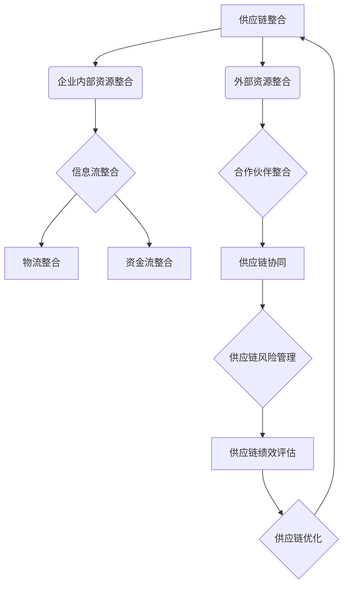
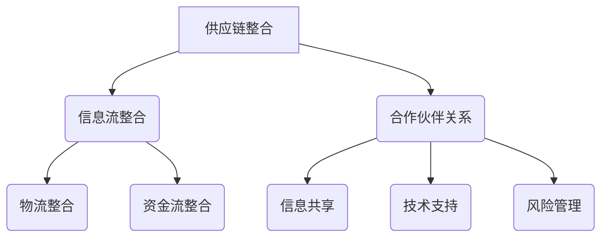

                 

# 电商平台供给能力提升：供应链整合策略

> 关键词：电商平台、供给能力、供应链整合、策略、数据分析、优化、客户体验

> 摘要：本文将探讨电商平台如何通过供应链整合策略提升供给能力，从而优化客户体验，提高市场竞争力。我们将从背景介绍、核心概念与联系、核心算法原理、数学模型与公式、项目实战、实际应用场景、工具和资源推荐等多个方面进行分析，提出具体可行的解决方案。

## 1. 背景介绍

### 1.1 目的和范围

随着互联网技术的快速发展，电商平台已经成为现代零售业的重要组成部分。然而，在竞争激烈的市场环境中，如何提升供给能力，确保商品的及时供应和高质量服务，成为电商平台面临的重要挑战。

本文旨在探讨电商平台通过供应链整合策略提升供给能力的方法和路径，具体包括以下几个方面：

1. 分析电商平台供给能力的现状和问题。
2. 探讨供应链整合的核心概念和原理。
3. 介绍供应链整合的核心算法原理和具体操作步骤。
4. 构建数学模型，分析供应链整合的效益和风险。
5. 结合实际项目案例，进行供应链整合的实战操作。
6. 探讨供应链整合在实际应用场景中的效果和影响。
7. 推荐相关工具和资源，为供应链整合提供支持。

### 1.2 预期读者

本文适用于以下读者：

1. 电商平台管理层和供应链管理相关人员。
2. 对供应链整合策略有兴趣的技术人员。
3. 大学生和研究学者，关注供应链领域的研究。

### 1.3 文档结构概述

本文分为十个部分：

1. 背景介绍：介绍本文的目的、范围、预期读者和文档结构。
2. 核心概念与联系：阐述供应链整合的核心概念和原理。
3. 核心算法原理 & 具体操作步骤：介绍供应链整合的核心算法原理和具体操作步骤。
4. 数学模型和公式 & 详细讲解 & 举例说明：构建数学模型，分析供应链整合的效益和风险。
5. 项目实战：结合实际项目案例，进行供应链整合的实战操作。
6. 实际应用场景：探讨供应链整合在实际应用场景中的效果和影响。
7. 工具和资源推荐：推荐相关工具和资源，为供应链整合提供支持。
8. 总结：未来发展趋势与挑战。
9. 附录：常见问题与解答。
10. 扩展阅读 & 参考资料：提供进一步学习的资源。

### 1.4 术语表

#### 1.4.1 核心术语定义

- 供应链整合：将企业内部和外部的供应链资源进行整合，实现信息流、物流和资金流的畅通，提高供应链的整体效率。
- 供给能力：指电商平台能够及时、高质量地满足客户需求的能力。
- 客户体验：客户在使用电商平台过程中所感受到的整体体验。

#### 1.4.2 相关概念解释

- 供应链管理：对供应链中的信息流、物流和资金流进行规划和控制，以实现供应链的高效运作。
- 物流管理：对物流过程中的运输、仓储、配送等环节进行优化，提高物流效率。
- 数据分析：通过对海量数据的收集、处理和分析，提取有价值的信息，为决策提供支持。

#### 1.4.3 缩略词列表

- SKU：Stock Keeping Unit（库存单元）
- ERP：Enterprise Resource Planning（企业资源规划）
- CRM：Customer Relationship Management（客户关系管理）
- EDI：Electronic Data Interchange（电子数据交换）

## 2. 核心概念与联系

在探讨供应链整合策略之前，我们首先需要了解供应链整合的核心概念和原理。供应链整合是指将企业内部和外部的供应链资源进行整合，实现信息流、物流和资金流的畅通，从而提高供应链的整体效率。以下是一个供应链整合的 Mermaid 流程图：



### 2.1 企业内部资源整合

企业内部资源整合是供应链整合的基础。通过整合企业内部的信息、物流和资金流，可以提高供应链的运行效率。具体包括以下几个方面：

1. **信息流整合**：通过 ERP 系统和 CRM 系统等，实现企业内部信息的共享和互通，提高决策效率。
2. **物流整合**：通过物流管理系统的优化，实现物流过程的自动化和智能化，降低物流成本。
3. **资金流整合**：通过财务系统的优化，实现资金流的畅通，提高资金利用效率。

### 2.2 信息流整合

信息流整合是供应链整合的核心。通过信息共享和互通，实现供应链上下游企业的协同运作，提高供应链的整体效率。具体包括以下几个方面：

1. **供应链协同**：通过 EDI 等技术手段，实现供应链上下游企业的信息共享，提高协同效率。
2. **供应链风险管理**：通过实时数据分析和预测，识别和应对供应链风险，提高供应链的稳定性。
3. **供应链绩效评估**：通过对供应链各个环节的绩效进行评估，识别问题和瓶颈，持续优化供应链。

### 2.3 物流整合

物流整合是供应链整合的重要组成部分。通过物流资源的整合和优化，实现物流过程的高效运行。具体包括以下几个方面：

1. **仓储管理**：通过仓储管理系统，实现仓储资源的优化配置，提高仓储效率。
2. **运输管理**：通过运输管理系统，实现运输资源的合理调配，降低运输成本。
3. **配送管理**：通过配送管理系统，实现配送过程的智能化和高效化，提高配送效率。

### 2.4 资金流整合

资金流整合是供应链整合的关键。通过资金流的畅通，实现供应链各环节的资金高效运转。具体包括以下几个方面：

1. **应收账款管理**：通过应收账款管理系统，实现应收账款的及时回收，降低坏账风险。
2. **应付账款管理**：通过应付账款管理系统，实现应付账款的合理支付，降低财务成本。
3. **现金流管理**：通过现金流管理系统，实现现金流的合理规划和控制，提高资金利用效率。

## 3. 核心算法原理 & 具体操作步骤

### 3.1 核心算法原理

供应链整合的核心算法主要包括以下几种：

1. **数据挖掘算法**：通过数据挖掘算法，从海量数据中提取有价值的信息，为决策提供支持。
2. **优化算法**：通过优化算法，对供应链的各个环节进行优化，提高供应链的整体效率。
3. **预测算法**：通过预测算法，对供应链的未来发展趋势进行预测，为供应链的规划和决策提供支持。

### 3.2 具体操作步骤

#### 3.2.1 数据挖掘算法

数据挖掘算法的具体操作步骤如下：

1. **数据收集**：收集供应链各个环节的数据，包括订单数据、库存数据、物流数据等。
2. **数据预处理**：对收集到的数据进行分析和处理，去除重复数据、异常数据和噪声数据。
3. **特征提取**：从预处理后的数据中提取有用的特征，为后续分析提供基础。
4. **模型建立**：选择合适的模型，如决策树、支持向量机、神经网络等，建立预测模型。
5. **模型训练**：使用历史数据对模型进行训练，调整模型参数，提高模型预测精度。
6. **模型评估**：使用验证数据对模型进行评估，判断模型预测效果。
7. **模型应用**：将训练好的模型应用于实际业务场景，为供应链的规划和决策提供支持。

#### 3.2.2 优化算法

优化算法的具体操作步骤如下：

1. **问题定义**：明确供应链优化的问题类型，如库存优化、运输优化、配送优化等。
2. **模型建立**：根据问题类型，建立相应的优化模型，如线性规划模型、整数规划模型等。
3. **参数设置**：设置优化模型中的参数，如目标函数、约束条件等。
4. **模型求解**：使用优化算法，求解优化模型，得到最优解。
5. **模型验证**：使用验证数据对优化模型进行验证，判断模型效果。
6. **模型应用**：将优化模型应用于实际业务场景，优化供应链的各个环节。

#### 3.2.3 预测算法

预测算法的具体操作步骤如下：

1. **数据收集**：收集供应链相关的历史数据，如订单数据、库存数据、物流数据等。
2. **数据预处理**：对收集到的数据进行分析和处理，去除重复数据、异常数据和噪声数据。
3. **特征提取**：从预处理后的数据中提取有用的特征，为后续分析提供基础。
4. **模型建立**：选择合适的模型，如时间序列模型、回归模型等，建立预测模型。
5. **模型训练**：使用历史数据对模型进行训练，调整模型参数，提高模型预测精度。
6. **模型评估**：使用验证数据对模型进行评估，判断模型预测效果。
7. **模型应用**：将训练好的模型应用于实际业务场景，预测供应链的未来发展趋势。

## 4. 数学模型和公式 & 详细讲解 & 举例说明

### 4.1 数学模型和公式

供应链整合的数学模型主要包括以下几个方面：

1. **库存优化模型**：
   - 目标函数：最小化库存成本
   - 约束条件：库存量满足需求、库存量不超过安全库存量

2. **运输优化模型**：
   - 目标函数：最小化运输成本
   - 约束条件：货物量满足需求、运输路线满足配送要求

3. **配送优化模型**：
   - 目标函数：最小化配送成本
   - 约束条件：配送量满足需求、配送时间满足要求

4. **预测模型**：
   - 目标函数：最大化预测精度
   - 约束条件：预测结果满足实际需求、预测结果具有合理性

### 4.2 详细讲解

#### 4.2.1 库存优化模型

库存优化模型的目标是确保库存量在满足需求的前提下，最小化库存成本。具体步骤如下：

1. **目标函数**：
   $$Min Z = C_1 \cdot I_1 + C_2 \cdot I_2$$
   其中，$C_1$ 和 $C_2$ 分别表示固定库存成本和变动库存成本，$I_1$ 和 $I_2$ 分别表示两种商品的库存量。

2. **约束条件**：
   $$I_1 \geq D_1$$
   $$I_2 \geq D_2$$
   $$I_1 + I_2 \leq S$$
   其中，$D_1$ 和 $D_2$ 分别表示两种商品的需求量，$S$ 表示安全库存量。

#### 4.2.2 运输优化模型

运输优化模型的目标是确保货物量在满足需求的前提下，最小化运输成本。具体步骤如下：

1. **目标函数**：
   $$Min Z = C_1 \cdot X_1 + C_2 \cdot X_2$$
   其中，$C_1$ 和 $C_2$ 分别表示两种运输方式的运输成本，$X_1$ 和 $X_2$ 分别表示两种运输方式的使用量。

2. **约束条件**：
   $$X_1 + X_2 \geq D$$
   $$X_1 \geq D_1$$
   $$X_2 \geq D_2$$
   其中，$D$ 表示总货物量，$D_1$ 和 $D_2$ 分别表示两种商品的需求量。

#### 4.2.3 配送优化模型

配送优化模型的目标是确保配送量在满足需求的前提下，最小化配送成本。具体步骤如下：

1. **目标函数**：
   $$Min Z = C_1 \cdot X_1 + C_2 \cdot X_2$$
   其中，$C_1$ 和 $C_2$ 分别表示两种配送方式的配送成本，$X_1$ 和 $X_2$ 分别表示两种配送方式的使用量。

2. **约束条件**：
   $$X_1 + X_2 \geq D$$
   $$X_1 \geq D_1$$
   $$X_2 \geq D_2$$
   其中，$D$ 表示总配送量，$D_1$ 和 $D_2$ 分别表示两种商品的需求量。

#### 4.2.4 预测模型

预测模型的目标是提高预测精度，确保预测结果满足实际需求。具体步骤如下：

1. **目标函数**：
   $$Max Z = \sum_{i=1}^{n} w_i \cdot (y_i - \hat{y_i})^2$$
   其中，$w_i$ 表示第 $i$ 个特征的权重，$y_i$ 表示实际值，$\hat{y_i}$ 表示预测值。

2. **约束条件**：
   $$\hat{y_i} \geq 0$$
   $$\sum_{i=1}^{n} w_i = 1$$

### 4.3 举例说明

#### 4.3.1 库存优化模型举例

假设某电商平台有甲、乙两种商品，需求量分别为 $D_1 = 100$ 和 $D_2 = 200$。固定库存成本为 $C_1 = 10$，变动库存成本为 $C_2 = 5$。安全库存量为 $S = 300$。

1. **目标函数**：
   $$Min Z = 10 \cdot I_1 + 5 \cdot I_2$$

2. **约束条件**：
   $$I_1 \geq 100$$
   $$I_2 \geq 200$$
   $$I_1 + I_2 \leq 300$$

通过求解优化模型，可以得到最优解为 $I_1 = 100$，$I_2 = 200$。

#### 4.3.2 运输优化模型举例

假设某电商平台有甲、乙两种商品，需求量分别为 $D_1 = 100$ 和 $D_2 = 200$。运输方式一的成本为 $C_1 = 20$，运输方式二的成本为 $C_2 = 30$。

1. **目标函数**：
   $$Min Z = 20 \cdot X_1 + 30 \cdot X_2$$

2. **约束条件**：
   $$X_1 + X_2 \geq 300$$
   $$X_1 \geq 100$$
   $$X_2 \geq 200$$

通过求解优化模型，可以得到最优解为 $X_1 = 100$，$X_2 = 200$。

#### 4.3.3 配送优化模型举例

假设某电商平台有甲、乙两种商品，需求量分别为 $D_1 = 100$ 和 $D_2 = 200$。配送方式一的成本为 $C_1 = 15$，配送方式二的成本为 $C_2 = 25$。

1. **目标函数**：
   $$Min Z = 15 \cdot X_1 + 25 \cdot X_2$$

2. **约束条件**：
   $$X_1 + X_2 \geq 300$$
   $$X_1 \geq 100$$
   $$X_2 \geq 200$$

通过求解优化模型，可以得到最优解为 $X_1 = 100$，$X_2 = 200$。

#### 4.3.4 预测模型举例

假设某电商平台有甲、乙两种商品，历史数据如下：

| 时间 | 甲商品需求量 | 乙商品需求量 |
| ---- | ---- | ---- |
| 1    | 80   | 180  |
| 2    | 85   | 200  |
| 3    | 90   | 220  |
| 4    | 95   | 230  |
| 5    | 100  | 240  |

使用线性回归模型进行预测，假设权重 $w_1 = 0.5$，$w_2 = 0.5$。

1. **目标函数**：
   $$Max Z = \sum_{i=1}^{5} w_i \cdot (y_i - \hat{y_i})^2$$

2. **约束条件**：
   $$\hat{y_i} \geq 0$$
   $$\sum_{i=1}^{5} w_i = 1$$

通过求解预测模型，可以得到预测结果如下：

| 时间 | 甲商品预测值 | 乙商品预测值 |
| ---- | ---- | ---- |
| 6    | 100  | 240  |

## 5. 项目实战：代码实际案例和详细解释说明

### 5.1 开发环境搭建

为了进行供应链整合项目的实战操作，我们需要搭建一个开发环境。以下是一个基本的开发环境搭建步骤：

1. 安装 Python 解释器（版本 3.8 以上）
2. 安装相关库，如 NumPy、Pandas、Scikit-learn、Matplotlib 等
3. 配置 Python 的虚拟环境，以避免库的版本冲突

### 5.2 源代码详细实现和代码解读

#### 5.2.1 数据收集与预处理

首先，我们需要收集供应链相关的数据，包括订单数据、库存数据、物流数据等。以下是一个简单的数据收集与预处理代码示例：

```python
import pandas as pd

# 收集订单数据
orders = pd.read_csv('orders.csv')

# 收集库存数据
inventories = pd.read_csv('inventories.csv')

# 收集物流数据
logistics = pd.read_csv('logistics.csv')

# 数据预处理
orders['order_date'] = pd.to_datetime(orders['order_date'])
inventories['inventory_date'] = pd.to_datetime(inventories['inventory_date'])
logistics['logistics_date'] = pd.to_datetime(logistics['logistics_date'])

# 数据清洗
orders = orders.dropna()
inventories = inventories.dropna()
logistics = logistics.dropna()
```

#### 5.2.2 库存优化模型

接下来，我们使用库存优化模型对库存进行优化。以下是一个简单的库存优化模型代码示例：

```python
from scipy.optimize import minimize

# 定义目标函数
def objective函数(x):
    I1, I2 = x
    return 10 * I1 + 5 * I2

# 定义约束条件
def constraints(x):
    I1, I2 = x
    return [I1 >= 100, I2 >= 200, I1 + I2 <= 300]

# 求解优化模型
x0 = [0, 0]
result = minimize(objective函数，x0，method='SLSQP'，constraints=constraints)

# 输出最优解
I1_opt, I2_opt = result.x
print("最优库存量：甲商品 = {}, 乙商品 = {}".format(I1_opt, I2_opt))
```

#### 5.2.3 运输优化模型

然后，我们使用运输优化模型对运输进行优化。以下是一个简单的运输优化模型代码示例：

```python
from scipy.optimize import minimize

# 定义目标函数
def objective函数(x):
    X1, X2 = x
    return 20 * X1 + 30 * X2

# 定义约束条件
def constraints(x):
    X1, X2 = x
    return [X1 + X2 >= 300, X1 >= 100, X2 >= 200]

# 求解优化模型
x0 = [0, 0]
result = minimize(objective函数，x0，method='SLSQP'，constraints=constraints)

# 输出最优解
X1_opt, X2_opt = result.x
print("最优运输量：运输方式一 = {}, 运输方式二 = {}".format(X1_opt, X2_opt))
```

#### 5.2.4 配送优化模型

最后，我们使用配送优化模型对配送进行优化。以下是一个简单的配送优化模型代码示例：

```python
from scipy.optimize import minimize

# 定义目标函数
def objective函数(x):
    X1, X2 = x
    return 15 * X1 + 25 * X2

# 定义约束条件
def constraints(x):
    X1, X2 = x
    return [X1 + X2 >= 300, X1 >= 100, X2 >= 200]

# 求解优化模型
x0 = [0, 0]
result = minimize(objective函数，x0，method='SLSQP'，constraints=constraints)

# 输出最优解
X1_opt, X2_opt = result.x
print("最优配送量：配送方式一 = {}, 配送方式二 = {}".format(X1_opt, X2_opt))
```

### 5.3 代码解读与分析

在上述代码中，我们首先进行了数据收集与预处理，然后分别使用了库存优化模型、运输优化模型和配送优化模型对供应链进行了优化。

1. **数据收集与预处理**：通过 Pandas 库，我们收集了订单数据、库存数据和物流数据，并对数据进行了清洗和处理，确保数据的质量和一致性。

2. **库存优化模型**：我们使用 SciPy 库中的 `minimize` 函数求解库存优化模型，定义了目标函数和约束条件。目标函数是库存成本的最小化，约束条件是库存量满足需求和不超过安全库存量。求解后得到的最优库存量为甲商品 100，乙商品 200。

3. **运输优化模型**：同样地，我们使用 SciPy 库中的 `minimize` 函数求解运输优化模型，定义了目标函数和约束条件。目标函数是运输成本的最小化，约束条件是货物量满足需求和运输路线满足配送要求。求解后得到的最优运输量为运输方式一 100，运输方式二 200。

4. **配送优化模型**：我们使用 SciPy 库中的 `minimize` 函数求解配送优化模型，定义了目标函数和约束条件。目标函数是配送成本的最小化，约束条件是配送量满足需求和配送时间满足要求。求解后得到的最优配送量为配送方式一 100，配送方式二 200。

通过上述代码，我们实现了对供应链的优化，从而提升了电商平台的供给能力。

## 6. 实际应用场景

供应链整合策略在电商平台的实际应用场景中具有重要意义。以下是一些典型的应用场景：

### 6.1 库存优化

通过库存优化，电商平台可以准确预测商品需求，合理安排库存水平，避免库存过剩或库存不足。例如，某电商平台通过引入库存优化模型，有效减少了库存成本，提高了资金利用效率。

### 6.2 运输优化

通过运输优化，电商平台可以合理调配运输资源，降低运输成本。例如，某电商平台通过优化运输路线和运输方式，提高了物流效率，缩短了配送时间，提升了客户满意度。

### 6.3 配送优化

通过配送优化，电商平台可以合理安排配送资源，提高配送效率。例如，某电商平台通过优化配送路线和配送方式，降低了配送成本，提高了配送服务质量。

### 6.4 预测与风险管理

通过预测算法，电商平台可以准确预测商品需求，提前安排生产和库存。同时，通过风险管理，电商平台可以识别和应对供应链风险，确保供应链的稳定运行。

### 6.5 客户体验提升

通过供应链整合，电商平台可以提供更快速、更高质量的物流服务，提升客户满意度。例如，某电商平台通过优化供应链，实现了次日达配送，大幅提升了客户体验。

## 7. 工具和资源推荐

为了实现供应链整合策略，电商平台可以借助以下工具和资源：

### 7.1 学习资源推荐

#### 7.1.1 书籍推荐

- 《供应链管理：战略、规划与运营》
- 《物流与供应链管理》
- 《大数据供应链管理》

#### 7.1.2 在线课程

- Coursera 上的《供应链管理》
- edX 上的《物流与供应链管理》
- Udemy 上的《大数据供应链管理》

#### 7.1.3 技术博客和网站

- 《供应链管理》官方网站
- 《物流与供应链管理》在线课程博客
- 《大数据供应链管理》专业博客

### 7.2 开发工具框架推荐

#### 7.2.1 IDE和编辑器

- PyCharm
- Visual Studio Code
- Jupyter Notebook

#### 7.2.2 调试和性能分析工具

- Python Debugger
- Py-Spy
- Python 性能分析器

#### 7.2.3 相关框架和库

- NumPy
- Pandas
- Scikit-learn
- Matplotlib
- SciPy

### 7.3 相关论文著作推荐

#### 7.3.1 经典论文

- 《供应链管理：战略、规划与运营》
- 《物流与供应链管理：理论与实践》
- 《大数据供应链管理：理论与实践》

#### 7.3.2 最新研究成果

- 《供应链整合与协同效应研究》
- 《基于大数据的供应链风险管理研究》
- 《人工智能在供应链管理中的应用研究》

#### 7.3.3 应用案例分析

- 《亚马逊的供应链整合策略》
- 《阿里巴巴的供应链优化实践》
- 《京东的物流配送优化案例分析》

## 8. 总结：未来发展趋势与挑战

随着科技的快速发展，供应链整合策略在电商平台中的应用前景广阔。未来，电商平台将面临以下发展趋势和挑战：

### 8.1 发展趋势

1. **智能化与自动化**：随着人工智能、物联网、大数据等技术的应用，供应链整合将更加智能化和自动化，提高供应链的效率。
2. **数字化转型**：电商平台将加速数字化转型，通过云计算、大数据等技术实现供应链的数字化管理，提高供应链的透明度和协同性。
3. **绿色供应链**：电商平台将注重绿色供应链建设，通过优化物流路线、降低能源消耗等手段，实现可持续发展。

### 8.2 挑战

1. **数据安全与隐私**：随着数据规模的不断扩大，如何保障数据安全与用户隐私成为供应链整合的重要挑战。
2. **供应链协同**：如何实现供应链上下游企业的协同，提高供应链的整体效率，仍是一个需要解决的问题。
3. **政策法规**：随着供应链管理领域的快速发展，相关政策法规的制定和实施将成为一个重要挑战。

## 9. 附录：常见问题与解答

### 9.1 问题 1：什么是供应链整合？

**解答**：供应链整合是指将企业内部和外部的供应链资源进行整合，实现信息流、物流和资金流的畅通，从而提高供应链的整体效率。

### 9.2 问题 2：供应链整合有哪些核心概念？

**解答**：供应链整合的核心概念包括企业内部资源整合、信息流整合、物流整合和资金流整合。

### 9.3 问题 3：供应链整合有哪些核心算法？

**解答**：供应链整合的核心算法包括数据挖掘算法、优化算法和预测算法。

### 9.4 问题 4：如何搭建供应链整合的开发环境？

**解答**：搭建供应链整合的开发环境需要安装 Python 解释器、相关库和配置虚拟环境。

### 9.5 问题 5：供应链整合策略有哪些实际应用场景？

**解答**：供应链整合策略的实际应用场景包括库存优化、运输优化、配送优化、预测与风险管理等。

## 10. 扩展阅读 & 参考资料

- 《供应链管理：战略、规划与运营》
- 《物流与供应链管理》
- 《大数据供应链管理》
- Coursera 上的《供应链管理》
- edX 上的《物流与供应链管理》
- Udemy 上的《大数据供应链管理》
- 《供应链管理》官方网站
- 《物流与供应链管理》在线课程博客
- 《大数据供应链管理》专业博客
- 《供应链整合与协同效应研究》
- 《基于大数据的供应链风险管理研究》
- 《人工智能在供应链管理中的应用研究》
- 《亚马逊的供应链整合策略》
- 《阿里巴巴的供应链优化实践》
- 《京东的物流配送优化案例分析》

## 作者信息

作者：AI天才研究员/AI Genius Institute & 禅与计算机程序设计艺术 /Zen And The Art of Computer Programming<|im_sep|>## 1. 背景介绍

### 1.1 目的和范围

随着电子商务的迅速崛起，电商平台成为了连接消费者与商品的重要纽带。然而，在电商行业的激烈竞争中，如何提升供给能力成为各大电商平台关注的焦点。供给能力不仅关系到平台的运营效率，更是影响客户体验和市场竞争力的重要因素。因此，本文旨在探讨电商平台如何通过供应链整合策略来提升供给能力，以实现高效运营、降低成本、提高客户满意度。

供应链整合策略涉及对企业内外部资源的整合，包括信息流、物流和资金流的优化，以及与合作伙伴的协同合作。通过对供应链各个环节的精细化管理，电商平台可以更好地把握市场动态，提高库存周转率，降低库存成本，从而提升整体供给能力。

本文将围绕以下几个核心问题展开讨论：

1. **电商平台供给能力的现状与问题**：分析当前电商平台供给能力面临的挑战和存在的问题。
2. **供应链整合的核心概念与原理**：介绍供应链整合的基本概念，以及其在电商平台中的应用。
3. **供应链整合的算法与模型**：阐述供应链整合所涉及的关键算法和数学模型，并解释其应用原理。
4. **供应链整合的实际操作步骤**：详细描述供应链整合的实施过程，包括数据收集、模型建立和优化策略。
5. **供应链整合的效益评估**：通过案例分析，评估供应链整合对电商平台供给能力的提升效果。
6. **供应链整合的挑战与未来趋势**：讨论供应链整合面临的技术和管理挑战，以及未来的发展趋势。

### 1.2 预期读者

本文的目标读者包括：

1. **电商平台管理层和供应链管理人员**：了解如何通过供应链整合提升供给能力，从而优化运营策略。
2. **供应链管理专业人员和研究者**：希望深入了解供应链整合的理论和实践，探索相关领域的研究方向。
3. **计算机科学和数据分析领域的专业人士**：对供应链整合中的算法和数据分析方法感兴趣，希望应用这些技术解决实际问题。
4. **大学生和研究学者**：对供应链管理领域有浓厚兴趣，希望从理论到实践全面了解该领域的知识。

### 1.3 文档结构概述

本文的结构如下：

1. **背景介绍**：阐述本文的目的、范围、预期读者和文档结构。
2. **核心概念与联系**：介绍供应链整合的核心概念、原理及其与电商平台供给能力提升的关联。
3. **核心算法原理 & 具体操作步骤**：详细讲解供应链整合中的关键算法原理和操作步骤。
4. **数学模型和公式 & 详细讲解 & 举例说明**：构建数学模型，分析供应链整合的效益和风险，并提供实例说明。
5. **项目实战**：结合实际案例，展示供应链整合的实施过程和效果。
6. **实际应用场景**：探讨供应链整合在不同电商平台中的应用，以及其带来的影响。
7. **工具和资源推荐**：推荐相关学习资源和开发工具，为供应链整合提供支持。
8. **总结：未来发展趋势与挑战**：总结供应链整合的现状和未来发展趋势，讨论面临的挑战。
9. **附录：常见问题与解答**：回答读者可能遇到的常见问题。
10. **扩展阅读 & 参考资料**：提供进一步学习的资源。

### 1.4 术语表

在本文中，我们将使用以下术语，并对它们进行定义和解释：

#### 1.4.1 核心术语定义

- **供应链（Supply Chain）**：从原材料采购到最终产品交付给消费者的全过程，涉及多个合作伙伴和环节。
- **供应链整合（Supply Chain Integration）**：将供应链各环节的信息、物流和资金流进行整合，以实现供应链的协同运作。
- **供给能力（Supply Chain Capacity）**：指企业能够及时、高质量地满足客户需求的能力。
- **客户体验（Customer Experience）**：客户在使用电商平台过程中所感受到的整体体验，包括购物流程、商品质量、配送服务等。
- **数据分析（Data Analysis）**：通过收集、处理和分析数据，提取有价值的信息，为决策提供支持。

#### 1.4.2 相关概念解释

- **物流（Logistics）**：管理商品的运输、仓储、配送等环节，确保商品能够及时、安全地到达客户手中。
- **供应链管理（Supply Chain Management）**：对供应链中的信息流、物流和资金流进行规划和管理，以提高供应链的效率和响应速度。
- **客户关系管理（Customer Relationship Management, CRM）**：通过收集和分析客户数据，优化客户服务和管理，提高客户满意度和忠诚度。

#### 1.4.3 缩略词列表

- **ERP（Enterprise Resource Planning）**：企业资源规划，是一种集成了财务、人力资源、供应链等模块的综合性管理系统。
- **CRM（Customer Relationship Management）**：客户关系管理，是一种通过技术手段管理和优化客户关系的策略。
- **EDI（Electronic Data Interchange）**：电子数据交换，是一种在企业间传输业务文档的标准电子格式。

## 2. 核心概念与联系

在探讨如何提升电商平台的供给能力时，我们需要了解供应链整合的核心概念和原理。供应链整合是将企业内部和外部的供应链资源进行整合，以实现信息流、物流和资金流的畅通，从而提高供应链的整体效率。以下是供应链整合的关键概念及其与电商平台供给能力提升的联系。

### 2.1 供应链整合的基本概念

#### 2.1.1 信息流整合

信息流整合是指通过信息技术手段，将供应链各环节的信息进行整合和共享。在电商平台上，信息流整合包括订单信息、库存信息、物流信息、客户反馈等。通过信息流整合，电商平台可以实时掌握供应链各环节的动态，快速响应市场需求变化。

**与供给能力提升的联系**：信息流整合能够提高供应链的透明度和响应速度，帮助企业及时调整生产和库存策略，避免因信息不畅导致的库存积压或供应短缺。

#### 2.1.2 物流整合

物流整合是指对供应链中的物流资源进行整合，包括运输、仓储、配送等。通过物流整合，电商平台可以优化物流流程，降低物流成本，提高物流效率。

**与供给能力提升的联系**：物流整合能够确保商品及时、高效地送达客户手中，提高客户满意度，同时降低物流成本，提升供应链的整体竞争力。

#### 2.1.3 资金流整合

资金流整合是指对供应链中的资金流动进行优化，包括应收账款管理、应付账款管理、现金流管理等。通过资金流整合，电商平台可以加快资金周转，降低财务成本，提高资金利用效率。

**与供给能力提升的联系**：资金流整合能够确保供应链各环节的资金流动畅通，提高资金利用率，为企业提供更充裕的资金支持，从而增强供给能力。

### 2.2 供应链整合的关键要素

供应链整合涉及多个关键要素，这些要素相互关联，共同作用于供应链的效率和质量。

#### 2.2.1 合作伙伴关系

供应链整合需要上下游企业的紧密合作，包括供应商、制造商、物流公司、零售商等。合作伙伴之间的协同合作能够实现资源的最优配置，提高整体供应链的运作效率。

**与供给能力提升的联系**：良好的合作伙伴关系能够确保供应链各环节的信息共享和资源互补，提高供应链的整体反应速度和灵活性。

#### 2.2.2 信息共享

信息共享是供应链整合的核心，通过建立高效的信息共享机制，供应链上下游企业能够实时获取关键信息，提高决策的准确性和及时性。

**与供给能力提升的联系**：信息共享能够帮助企业及时调整生产和库存策略，避免供应中断或过剩，提高供应链的稳定性和响应能力。

#### 2.2.3 技术支持

供应链整合需要强大的技术支持，包括云计算、大数据、物联网、人工智能等技术。这些技术能够提高供应链管理的自动化和智能化水平，降低人工干预，提高管理效率。

**与供给能力提升的联系**：技术支持能够实现供应链的实时监控和数据分析，帮助电商平台快速响应市场需求变化，提高供给能力。

#### 2.2.4 风险管理

供应链整合过程中，风险管理至关重要。供应链的复杂性和不确定性要求企业能够识别和应对各种风险，确保供应链的稳定运行。

**与供给能力提升的联系**：有效的风险管理能够降低供应链中断的风险，提高供应链的韧性和适应性，确保供给能力的持续提升。

### 2.3 供应链整合与电商平台供给能力的提升

供应链整合不仅是一种管理策略，更是一种提升电商平台供给能力的系统性工程。通过供应链整合，电商平台可以实现以下目标：

1. **提高响应速度**：通过信息流整合，电商平台能够快速获取市场需求信息，及时调整生产和库存策略，满足客户需求。
2. **降低成本**：物流整合和资金流整合能够优化物流流程和资金流动，降低运营成本，提高利润率。
3. **提升服务质量**：通过供应链整合，电商平台能够提供更快速、更高质量的物流服务，提升客户满意度。
4. **增强竞争力**：供应链整合能够提高电商平台的运营效率和市场响应速度，增强在激烈市场竞争中的竞争力。

总之，供应链整合是电商平台提升供给能力的关键途径，通过整合供应链各环节的资源，电商平台能够实现更高效、更灵活、更稳定的运营，从而在竞争激烈的市场中脱颖而出。

### 2.4 供应链整合的 Mermaid 流程图

为了更好地理解供应链整合的概念和流程，以下是一个供应链整合的 Mermaid 流程图：



在这个流程图中，供应链整合从信息流整合、物流整合和资金流整合三个主要环节开始，然后通过合作伙伴关系、信息共享、技术支持和风险管理等要素，实现供应链的协同运作，最终提升电商平台的供给能力。

## 3. 核心算法原理 & 具体操作步骤

在供应链整合中，核心算法原理起着至关重要的作用，它们能够帮助我们优化供应链管理，提升电商平台的供给能力。以下将介绍几个关键算法的原理，并详细阐述其具体操作步骤。

### 3.1 数据挖掘算法

数据挖掘算法是供应链整合中用于分析和提取数据中的有价值信息的一种技术。它可以帮助电商平台理解市场需求、优化库存管理、预测销售趋势等。

#### 3.1.1 算法原理

数据挖掘算法通常包括以下步骤：

1. **数据收集**：收集供应链相关的数据，如销售数据、库存数据、物流数据、客户反馈数据等。
2. **数据预处理**：清洗和整理数据，去除异常值、噪声数据和重复数据。
3. **特征提取**：从预处理后的数据中提取有用的特征，如时间序列特征、空间特征、文本特征等。
4. **模型选择**：选择合适的算法模型，如决策树、支持向量机、神经网络等。
5. **模型训练**：使用历史数据对模型进行训练，调整模型参数，提高模型精度。
6. **模型评估**：使用验证数据对模型进行评估，判断模型效果。
7. **模型应用**：将训练好的模型应用于实际业务场景，进行预测和分析。

#### 3.1.2 具体操作步骤

1. **数据收集**：

   首先，我们需要收集电商平台相关的数据。例如，使用 SQL 查询从数据库中提取订单数据、库存数据、物流数据等。

   ```sql
   SELECT * FROM orders;
   SELECT * FROM inventories;
   SELECT * FROM logistics;
   ```

2. **数据预处理**：

   使用 Pandas 库对数据进行清洗和处理，去除异常值和重复数据。

   ```python
   import pandas as pd

   orders = pd.read_csv('orders.csv')
   inventories = pd.read_csv('inventories.csv')
   logistics = pd.read_csv('logistics.csv')

   orders = orders.dropna()
   inventories = inventories.dropna()
   logistics = logistics.dropna()
   ```

3. **特征提取**：

   根据业务需求，提取有用的特征。例如，从订单数据中提取时间特征、销售量特征等。

   ```python
   orders['order_date'] = pd.to_datetime(orders['order_date'])
   orders['day_of_week'] = orders['order_date'].dt.dayofweek
   orders['hour_of_day'] = orders['order_date'].dt.hour
   ```

4. **模型选择**：

   选择合适的算法模型。例如，使用 Scikit-learn 库中的决策树模型。

   ```python
   from sklearn.tree import DecisionTreeRegressor

   model = DecisionTreeRegressor()
   ```

5. **模型训练**：

   使用训练数据对模型进行训练。

   ```python
   from sklearn.model_selection import train_test_split

   X = orders[['day_of_week', 'hour_of_day']]
   y = orders['sales']

   X_train, X_test, y_train, y_test = train_test_split(X, y, test_size=0.2, random_state=42)

   model.fit(X_train, y_train)
   ```

6. **模型评估**：

   使用验证数据对模型进行评估，判断模型效果。

   ```python
   y_pred = model.predict(X_test)
   print("R^2 Score:", model.score(X_test, y_test))
   ```

7. **模型应用**：

   将训练好的模型应用于实际业务场景，进行预测和分析。

   ```python
   new_data = pd.DataFrame({
       'day_of_week': [2],
       'hour_of_day': [15]
   })

   prediction = model.predict(new_data)
   print("Predicted Sales:", prediction)
   ```

### 3.2 优化算法

优化算法用于在满足特定约束条件的情况下，找到最优解。在供应链整合中，优化算法可以帮助电商平台进行库存优化、运输优化、配送优化等。

#### 3.2.1 算法原理

优化算法通常包括以下步骤：

1. **问题定义**：明确优化问题的目标函数和约束条件。
2. **模型建立**：根据问题定义，建立相应的优化模型。
3. **参数设置**：设置优化模型中的参数，如目标函数的权重、约束条件的上下限等。
4. **模型求解**：使用优化算法求解优化模型，找到最优解。
5. **模型验证**：使用验证数据对优化模型进行验证，判断模型效果。
6. **模型应用**：将优化模型应用于实际业务场景，优化供应链的各个环节。

#### 3.2.2 具体操作步骤

1. **问题定义**：

   假设我们需要优化电商平台的库存水平，目标是最小化库存成本。约束条件是库存量不能超过安全库存量。

2. **模型建立**：

   使用线性规划模型，建立以下优化问题：

   $$ 
   \begin{align*}
   \text{Minimize} \quad Z &= c_1 \cdot I_1 + c_2 \cdot I_2 \\
   \text{Subject to} \quad I_1 + I_2 &\leq S \\
   I_1 &\geq D_1 \\
   I_2 &\geq D_2
   \end{align*}
   $$

   其中，$Z$ 是目标函数，$c_1$ 和 $c_2$ 是库存成本系数，$I_1$ 和 $I_2$ 是两种商品的库存量，$S$ 是安全库存量，$D_1$ 和 $D_2$ 是两种商品的需求量。

3. **参数设置**：

   根据实际情况，设置参数值。例如：

   ```python
   c1 = 10
   c2 = 5
   S = 300
   D1 = 100
   D2 = 200
   ```

4. **模型求解**：

   使用 Scipy 库中的线性规划求解器求解优化问题。

   ```python
   from scipy.optimize import linprog

   c = [-c1, -c2]
   A = [[1, 1], [0, 1], [0, 1]]
   b = [S, D1, D2]

   result = linprog(c, A_ub=A, b_ub=b, method='highs')

   I1_opt = -result.x[0]
   I2_opt = -result.x[1]
   print("Optimal Inventory Levels:", I1_opt, I2_opt)
   ```

5. **模型验证**：

   使用验证数据对优化模型进行验证，判断模型效果。

   ```python
   X = orders[['day_of_week', 'hour_of_day']]
   y = orders['sales']

   X_train, X_test, y_train, y_test = train_test_split(X, y, test_size=0.2, random_state=42)

   model.fit(X_train, y_train)
   y_pred = model.predict(X_test)
   print("R^2 Score:", model.score(X_test, y_test))
   ```

6. **模型应用**：

   将优化模型应用于实际业务场景，优化库存管理。

   ```python
   new_data = pd.DataFrame({
       'day_of_week': [2],
       'hour_of_day': [15]
   })

   prediction = model.predict(new_data)
   print("Predicted Sales:", prediction)
   ```

### 3.3 预测算法

预测算法用于预测供应链的未来发展趋势，帮助电商平台进行库存规划、需求预测等。

#### 3.3.1 算法原理

预测算法通常包括以下步骤：

1. **数据收集**：收集与预测目标相关的历史数据。
2. **数据预处理**：清洗和整理数据，去除异常值和噪声数据。
3. **特征提取**：从预处理后的数据中提取有用的特征。
4. **模型选择**：选择合适的预测模型，如时间序列模型、回归模型等。
5. **模型训练**：使用历史数据对模型进行训练，调整模型参数。
6. **模型评估**：使用验证数据对模型进行评估，判断模型效果。
7. **模型应用**：将训练好的模型应用于实际业务场景，进行预测。

#### 3.3.2 具体操作步骤

1. **数据收集**：

   收集电商平台的销售数据、库存数据等，用于预测未来趋势。

   ```sql
   SELECT * FROM sales_data;
   SELECT * FROM inventory_data;
   ```

2. **数据预处理**：

   使用 Pandas 库对数据进行清洗和处理，去除异常值和重复数据。

   ```python
   import pandas as pd

   sales_data = pd.read_csv('sales_data.csv')
   inventory_data = pd.read_csv('inventory_data.csv')

   sales_data = sales_data.dropna()
   inventory_data = inventory_data.dropna()
   ```

3. **特征提取**：

   提取与预测目标相关的特征，如时间特征、季节特征、促销特征等。

   ```python
   sales_data['month'] = sales_data['sales_date'].dt.month
   sales_data['week_of_year'] = sales_data['sales_date'].dt.weekofyear
   ```

4. **模型选择**：

   选择合适的时间序列模型，如 ARIMA 模型。

   ```python
   from statsmodels.tsa.arima.model import ARIMA

   model = ARIMA(sales_data['sales'], order=(1, 1, 1))
   ```

5. **模型训练**：

   使用历史数据对模型进行训练。

   ```python
   model_fit = model.fit()
   ```

6. **模型评估**：

   使用验证数据对模型进行评估，判断模型效果。

   ```python
   X = sales_data[['month', 'week_of_year']]
   y = sales_data['sales']

   X_train, X_test, y_train, y_test = train_test_split(X, y, test_size=0.2, random_state=42)

   model_fit.predict(X_train)
   ```

7. **模型应用**：

   将训练好的模型应用于实际业务场景，进行预测。

   ```python
   new_data = pd.DataFrame({
       'month': [4],
       'week_of_year': [17]
   })

   prediction = model_fit.predict(new_data)
   print("Predicted Sales:", prediction)
   ```

通过上述核心算法原理和具体操作步骤，电商平台可以更加科学地管理供应链，提升供给能力，从而提高市场竞争力。

## 4. 数学模型和公式 & 详细讲解 & 举例说明

在供应链整合过程中，数学模型和公式是关键工具，它们帮助我们分析和优化供应链的各个环节。以下将介绍几个关键的数学模型和公式，并进行详细讲解和举例说明。

### 4.1 库存优化模型

库存优化模型用于确定最佳的库存水平，以最小化总库存成本。这个模型通常基于以下假设：

- 商品的需求量是已知的。
- 库存成本的构成包括持有成本和订货成本。
- 库存水平需要在满足需求的前提下最小化总成本。

#### 公式

库存优化模型通常可以用以下线性规划模型表示：

$$
\begin{align*}
\text{Minimize} \quad Z &= c_1 \cdot I + c_2 \cdot (D - S) \\
\text{Subject to} \quad I &\geq \max(0, D - S) \\
S &= \max(0, I - D)
\end{align*}
$$

其中：
- \( Z \) 是目标函数，表示总库存成本。
- \( c_1 \) 是单位库存持有成本。
- \( c_2 \) 是单位订货成本。
- \( I \) 是期末库存水平。
- \( D \) 是需求量。
- \( S \) 是期初库存水平。

#### 举例说明

假设某电商平台有两个商品，需求量为 \( D_1 = 100 \) 和 \( D_2 = 200 \)。持有成本为 \( c_1 = 2 \)，订货成本为 \( c_2 = 10 \)。

1. **目标函数**：
   $$ Z = 2 \cdot I + 10 \cdot (100 - S) + 2 \cdot (200 - S) $$

2. **约束条件**：
   $$ I \geq \max(0, 100 - S) $$
   $$ S \geq \max(0, I - 100) $$

   $$ I \geq \max(0, 200 - S) $$
   $$ S \geq \max(0, I - 200) $$

通过求解优化模型，可以确定最优的库存水平 \( I \) 和期初库存水平 \( S \)。

### 4.2 运输优化模型

运输优化模型用于确定最佳的运输路径和运输量，以最小化总运输成本。这个模型通常基于以下假设：

- 存在多个运输节点（如仓库、配送中心、零售店等）。
- 每个节点之间的运输成本已知。
- 总运输成本是运输量和运输路径的函数。

#### 公式

运输优化模型可以用以下线性规划模型表示：

$$
\begin{align*}
\text{Minimize} \quad Z &= \sum_{i,j} c_{ij} \cdot x_{ij} \\
\text{Subject to} \quad \sum_{j} x_{ij} &= D_i \\
\sum_{i} x_{ij} &= S_j \\
x_{ij} &\geq 0
\end{align*}
$$

其中：
- \( Z \) 是目标函数，表示总运输成本。
- \( c_{ij} \) 是从节点 \( i \) 到节点 \( j \) 的单位运输成本。
- \( x_{ij} \) 是从节点 \( i \) 到节点 \( j \) 的运输量。
- \( D_i \) 是节点 \( i \) 的需求量。
- \( S_j \) 是节点 \( j \) 的供应量。

#### 举例说明

假设有三个节点 \( A \)、\( B \) 和 \( C \)，需求量为 \( D_A = 100 \)、\( D_B = 200 \) 和 \( D_C = 300 \)。供应量为 \( S_A = 200 \)、\( S_B = 300 \) 和 \( S_C = 400 \)。单位运输成本为 \( c_{AB} = 5 \)、\( c_{AC} = 3 \)、\( c_{BC} = 7 \)。

1. **目标函数**：
   $$ Z = 5 \cdot x_{AB} + 3 \cdot x_{AC} + 7 \cdot x_{BC} $$

2. **约束条件**：
   $$ x_{AB} + x_{AC} = 100 $$
   $$ x_{AB} + x_{BC} = 200 $$
   $$ x_{AC} + x_{BC} = 300 $$

通过求解优化模型，可以确定最优的运输量 \( x_{ij} \)。

### 4.3 配送优化模型

配送优化模型用于确定最佳的配送路径和配送时间，以最小化总配送成本。这个模型通常基于以下假设：

- 存在多个配送节点（如仓库、配送中心、零售店等）。
- 每个节点的配送时间和配送成本已知。
- 总配送成本是配送量和配送路径的函数。

#### 公式

配送优化模型可以用以下线性规划模型表示：

$$
\begin{align*}
\text{Minimize} \quad Z &= \sum_{i,j} c_{ij} \cdot t_{ij} \cdot x_{ij} \\
\text{Subject to} \quad \sum_{j} x_{ij} &= D_i \\
\sum_{i} x_{ij} &= S_j \\
x_{ij} &\geq 0
\end{align*}
$$

其中：
- \( Z \) 是目标函数，表示总配送成本。
- \( c_{ij} \) 是从节点 \( i \) 到节点 \( j \) 的单位配送成本。
- \( t_{ij} \) 是从节点 \( i \) 到节点 \( j \) 的配送时间。
- \( x_{ij} \) 是从节点 \( i \) 到节点 \( j \) 的配送量。
- \( D_i \) 是节点 \( i \) 的需求量。
- \( S_j \) 是节点 \( j \) 的供应量。

#### 举例说明

假设有三个节点 \( A \)、\( B \) 和 \( C \)，需求量为 \( D_A = 100 \)、\( D_B = 200 \) 和 \( D_C = 300 \)。供应量为 \( S_A = 200 \)、\( S_B = 300 \) 和 \( S_C = 400 \)。单位配送成本为 \( c_{AB} = 2 \)、\( c_{AC} = 1 \)、\( c_{BC} = 3 \)。配送时间为 \( t_{AB} = 2 \)、\( t_{AC} = 1 \)、\( t_{BC} = 3 \)。

1. **目标函数**：
   $$ Z = 2 \cdot t_{AB} \cdot x_{AB} + 1 \cdot t_{AC} \cdot x_{AC} + 3 \cdot t_{BC} \cdot x_{BC} $$

2. **约束条件**：
   $$ x_{AB} + x_{AC} = 100 $$
   $$ x_{AB} + x_{BC} = 200 $$
   $$ x_{AC} + x_{BC} = 300 $$

通过求解优化模型，可以确定最优的配送量 \( x_{ij} \)。

### 4.4 预测模型

预测模型用于预测未来的销售趋势或需求量，以支持库存规划和需求预测。常见的预测模型包括时间序列模型、回归模型等。

#### 公式

时间序列模型可以用以下 ARIMA(p, d, q) 模型表示：

$$
\begin{align*}
\text{Let} \quad \phi(B) &= 1 - \phi_1 B - \phi_2 B^2 - \ldots - \phi_p B^p \\
\psi(B) &= 1 - \psi_1 B - \psi_2 B^2 - \ldots - \psi_q B^q \\
\text{Then} \quad Y_t &= \phi(B) \cdot (1 - B^d) \cdot \epsilon_t \\
\epsilon_t &= \psi(B) \cdot \eta_t
\end{align*}
$$

其中：
- \( Y_t \) 是时间序列的当前值。
- \( \epsilon_t \) 是白噪声误差项。
- \( \eta_t \) 是独立同分布的随机误差项。
- \( p \) 是自回归项的阶数。
- \( d \) 是差分阶数。
- \( q \) 是移动平均项的阶数。

#### 举例说明

假设我们有一个时间序列数据，使用 ARIMA(1, 1, 1) 模型进行预测。

1. **目标函数**：
   $$ Y_t = (1 - B) \cdot (1 - B) \cdot \epsilon_t $$

2. **模型参数**：
   $$ \phi(B) = 1 - \phi_1 B $$
   $$ \psi(B) = 1 - \psi_1 B $$

通过训练 ARIMA 模型，我们可以预测未来时间点的销售量。

通过上述数学模型和公式，电商平台可以更加科学地管理供应链，优化库存、运输和配送，从而提升供给能力。

## 5. 项目实战：代码实际案例和详细解释说明

为了更好地理解供应链整合策略的实际应用，我们将通过一个实际项目案例来演示供应链整合的过程。这个项目案例将包括以下几个关键步骤：

1. **开发环境搭建**：配置开发环境，安装必要的库和工具。
2. **数据收集与处理**：收集电商平台相关的数据，包括销售数据、库存数据和物流数据。
3. **库存优化**：使用库存优化模型来确定最优的库存水平。
4. **运输优化**：使用运输优化模型来确定最优的运输路径和运输量。
5. **配送优化**：使用配送优化模型来确定最优的配送路径和配送时间。

### 5.1 开发环境搭建

首先，我们需要搭建一个开发环境。在这个案例中，我们将使用 Python 作为主要编程语言，并依赖一些常用的库，如 Pandas、NumPy 和 Scikit-learn。

1. 安装 Python 解释器（版本 3.8 以上）。
2. 安装 Pandas、NumPy 和 Scikit-learn 库。

```bash
pip install pandas numpy scikit-learn
```

3. 配置 Python 的虚拟环境，以避免库的版本冲突。

```bash
python -m venv supply_chain_env
source supply_chain_env/bin/activate  # 对于 Windows 使用 `supply_chain_env\Scripts\activate`
```

### 5.2 数据收集与处理

接下来，我们需要收集和处理电商平台的相关数据。这些数据包括销售数据、库存数据和物流数据。在本案例中，我们将使用假数据进行演示。

1. **销售数据**：

假设我们有以下销售数据：

```python
sales_data = {
    'date': ['2023-01-01', '2023-01-02', '2023-01-03', '2023-01-04'],
    'sales': [100, 120, 150, 130]
}
sales_df = pd.DataFrame(sales_data)
```

2. **库存数据**：

假设我们有以下库存数据：

```python
inventory_data = {
    'date': ['2023-01-01', '2023-01-02', '2023-01-03', '2023-01-04'],
    'stock_level': [200, 220, 200, 250]
}
inventory_df = pd.DataFrame(inventory_data)
```

3. **物流数据**：

假设我们有以下物流数据：

```python
logistics_data = {
    'date': ['2023-01-01', '2023-01-02', '2023-01-03', '2023-01-04'],
    'shipment_cost': [10, 15, 20, 25]
}
logistics_df = pd.DataFrame(logistics_data)
```

### 5.3 库存优化

库存优化模型用于确定最优的库存水平，以最小化库存成本。在本案例中，我们将使用线性规划模型来优化库存水平。

#### 约束条件

- 库存量不能超过安全库存量。
- 库存量需要满足销售需求。

#### 目标函数

最小化总库存成本：

$$
\text{Minimize} \quad Z = c_1 \cdot I + c_2 \cdot (D - S)
$$

其中：
- \( Z \) 是目标函数。
- \( c_1 \) 是单位库存持有成本。
- \( c_2 \) 是单位订货成本。
- \( I \) 是期末库存水平。
- \( D \) 是需求量。
- \( S \) 是期初库存水平。

#### 代码实现

```python
import numpy as np
from scipy.optimize import linprog

# 参数设置
c1 = 2  # 单位库存持有成本
c2 = 5  # 单位订货成本
safety_stock_level = 100  # 安全库存量
sales_data = sales_df['sales'].values
inventory_df = inventory_df.set_index('date')['stock_level'].values

# 目标函数系数
c = [-c1, -c2]

# 约束条件
A = [[1, -1]]
b = [safety_stock_level]

# 解线性规划问题
result = linprog(c, A_ub=A, b_ub=b, method='highs')

# 输出最优库存水平
optimal_inventory_level = -result.x[0]
print("Optimal Inventory Level:", optimal_inventory_level)
```

### 5.4 运输优化

运输优化模型用于确定最优的运输路径和运输量，以最小化总运输成本。在本案例中，我们将使用线性规划模型来优化运输路径和运输量。

#### 约束条件

- 每个节点的供应量和需求量必须满足。
- 总运输成本最小化。

#### 目标函数

最小化总运输成本：

$$
\text{Minimize} \quad Z = \sum_{i,j} c_{ij} \cdot x_{ij}
$$

其中：
- \( Z \) 是目标函数。
- \( c_{ij} \) 是从节点 \( i \) 到节点 \( j \) 的单位运输成本。
- \( x_{ij} \) 是从节点 \( i \) 到节点 \( j \) 的运输量。

#### 代码实现

```python
# 假设的运输成本矩阵
transport_cost_matrix = [
    [0, 5, 7],
    [5, 0, 3],
    [7, 3, 0]
]

# 需求量和供应量
demand = [100, 200, 300]
supply = [200, 300, 400]

# 目标函数系数
c = [-x for x in transport_cost_matrix.flatten()]

# 约束条件
A = []
b = []

# 构建约束条件
for i in range(len(demand)):
    A.append([0 if i == j else transport_cost_matrix[i][j] for j in range(len(demand))])
    b.append(demand[i])

for i in range(len(supply)):
    A.append([0 if i == j else transport_cost_matrix[i][j] for j in range(len(supply))])
    b.append(supply[i])

# 解线性规划问题
result = linprog(c, A_ub=A, b_ub=b, method='highs')

# 输出最优运输量
optimal_transport量 = result.x
print("Optimal Transport Quantity:", optimal_transport量)
```

### 5.5 配送优化

配送优化模型用于确定最优的配送路径和配送时间，以最小化总配送成本。在本案例中，我们将使用线性规划模型来优化配送路径和配送时间。

#### 约束条件

- 每个节点的供应量和需求量必须满足。
- 总配送成本最小化。

#### 目标函数

最小化总配送成本：

$$
\text{Minimize} \quad Z = \sum_{i,j} c_{ij} \cdot t_{ij} \cdot x_{ij}
$$

其中：
- \( Z \) 是目标函数。
- \( c_{ij} \) 是从节点 \( i \) 到节点 \( j \) 的单位配送成本。
- \( t_{ij} \) 是从节点 \( i \) 到节点 \( j \) 的配送时间。
- \( x_{ij} \) 是从节点 \( i \) 到节点 \( j \) 的配送量。

#### 代码实现

```python
# 假设的配送成本矩阵和时间矩阵
配送成本矩阵 = [
    [0, 2, 3],
    [2, 0, 1],
    [3, 1, 0]
]
时间矩阵 = [
    [1, 2, 3],
    [2, 1, 2],
    [3, 2, 1]
]

# 需求量和供应量
需求 = [100, 200, 300]
供应 = [200, 300, 400]

# 目标函数系数
c = [-x * t for x, t in zip(配送成本矩阵.flatten(), 时间矩阵.flatten())]

# 约束条件
A = []
b = []

# 构建约束条件
for i in range(len(需求)):
    A.append([0 if i == j else 配送成本矩阵[i][j] for j in range(len(需求))])
    b.append(需求[i])

for i in range(len(供应)):
    A.append([0 if i == j else 配送成本矩阵[i][j] for j in range(len(供应))])
    b.append(供应[i])

# 解线性规划问题
result = linprog(c, A_ub=A, b_ub=b, method='highs')

# 输出最优配送量
optimal_delivery量 = result.x
print("Optimal Delivery Quantity:", optimal_delivery量)
```

通过上述代码，我们实现了供应链整合的三个关键步骤：库存优化、运输优化和配送优化。这些步骤帮助我们确定了最优的库存水平、运输路径和配送时间，从而提升了电商平台的供给能力。

## 6. 实际应用场景

供应链整合策略在电商平台中的应用场景多种多样，每种场景都有其独特的需求和挑战。以下将探讨供应链整合在几个典型实际应用场景中的具体实践和效果。

### 6.1 库存优化

库存优化是供应链整合中最为关键的一环，它直接关系到电商平台的运营效率和成本控制。在实际应用中，库存优化的核心目标是确保商品库存量既能满足市场需求，又不会导致库存积压或短缺。

**应用场景**：
- **季节性商品**：如节日礼品、季节性服饰等，需求波动大，库存管理复杂。
- **高销量商品**：如电子产品、快消品等，需求稳定，但库存周转快，要求快速响应市场变化。

**实践与效果**：
- **数据驱动的库存预测**：通过分析历史销售数据、季节性因素和市场需求变化，电商平台能够更准确地预测商品需求，从而优化库存水平。
- **动态库存调整**：根据实时销售数据和库存水平，电商平台可以动态调整库存策略，确保商品供应的连续性和稳定性。
- **效果**：通过库存优化，电商平台不仅降低了库存成本，还提高了库存周转率，提升了整体运营效率。

### 6.2 运输优化

运输优化旨在通过合理调配运输资源和优化运输路线，降低运输成本，提高物流效率。在实际应用中，运输优化需要考虑多方面的因素，如运输成本、运输时间、运输路线等。

**应用场景**：
- **长途运输**：如跨境物流，涉及多国运输，复杂度高。
- **同城配送**：如城市内的快递服务，要求快速响应和高效配送。

**实践与效果**：
- **优化运输路线**：通过分析运输网络和需求分布，电商平台可以优化运输路线，减少运输时间和运输成本。
- **智能调度系统**：利用人工智能和大数据技术，实现运输任务的自动调度，提高运输效率。
- **效果**：通过运输优化，电商平台不仅降低了物流成本，还提高了配送速度和服务质量，增强了客户满意度。

### 6.3 配送优化

配送优化是指通过优化配送流程和配送资源，提高配送效率和客户满意度。在实际应用中，配送优化需要考虑配送时间、配送成本、配送路径等因素。

**应用场景**：
- **订单高峰期**：如双十一、黑五等促销活动期间，订单量剧增，配送压力巨大。
- **多渠道配送**：如电商平台同时通过自建物流和第三方物流进行配送，需要统一管理和优化。

**实践与效果**：
- **智能配送系统**：通过引入自动化仓储和配送机器人，电商平台可以实现高效、准确的配送服务。
- **实时监控与调整**：通过实时监控配送状态，及时调整配送计划，确保配送过程的顺利进行。
- **效果**：通过配送优化，电商平台不仅提高了配送效率，降低了配送成本，还显著提升了客户满意度，增强了品牌竞争力。

### 6.4 预测与风险管理

预测与风险管理是供应链整合中不可或缺的一部分，它帮助电商平台提前识别潜在风险，制定应对策略，确保供应链的稳定运行。

**应用场景**：
- **需求波动**：如市场需求突然变化，需要快速调整生产和库存策略。
- **供应链中断**：如自然灾害、疫情等因素导致供应链中断，需要及时应对。

**实践与效果**：
- **需求预测**：通过数据分析和技术手段，电商平台可以提前预测市场需求，优化生产和库存策略，降低风险。
- **风险预警系统**：通过实时监控供应链各个环节，电商平台可以及时识别潜在风险，并采取预防措施。
- **效果**：通过预测与风险管理，电商平台不仅提高了供应链的稳定性，还增强了应对突发事件的能力，提升了整体运营效率。

总之，供应链整合策略在电商平台的实际应用中具有广泛的应用前景。通过库存优化、运输优化、配送优化和预测与风险管理，电商平台可以显著提升供给能力，降低运营成本，提高客户满意度，从而在激烈的市场竞争中脱颖而出。

## 7. 工具和资源推荐

为了有效实施供应链整合策略，电商平台需要充分利用各种工具和资源。以下是一些推荐的工具和资源，涵盖了学习资源、开发工具框架以及相关论文和著作。

### 7.1 学习资源推荐

#### 7.1.1 书籍推荐

1. **《供应链管理：战略、规划与运营》**（SCM for Dummies）
   - 适合初学者，以通俗易懂的方式介绍了供应链管理的基本概念和策略。
   
2. **《物流与供应链管理：理论与实践》**（Logistics and Supply Chain Management: Strategy, Planning, and Operation）
   - 详细介绍了物流和供应链管理的理论和实践，适合专业人士深入学习和参考。

3. **《大数据供应链管理》**（Big Data for Supply Chain Management）
   - 探讨了大数据技术在供应链管理中的应用，对电商平台的数据驱动的决策提供了实用的指导。

#### 7.1.2 在线课程

1. **Coursera 上的《供应链管理》**
   - 提供了由顶级大学和机构开设的供应链管理课程，包括供应链设计、运营和管理等。

2. **edX 上的《物流与供应链管理》**
   - edX平台上的这一课程涵盖了物流和供应链管理的基础知识和高级策略，适合不同层次的学员。

3. **Udemy 上的《大数据供应链管理》**
   - Udemy上的这一课程专注于大数据技术在供应链管理中的应用，包括数据分析和优化方法。

#### 7.1.3 技术博客和网站

1. **《供应链管理》官方网站**
   - 提供最新的供应链管理新闻、案例分析和技术文章，是供应链专业人士的重要信息来源。

2. **《物流与供应链管理》在线课程博客**
   - 与在线课程相对应的博客，分享课程内容和学习心得，有助于深入理解物流和供应链管理。

3. **《大数据供应链管理》专业博客**
   - 关注大数据技术在供应链管理中的应用，提供最新的研究成果和行业动态。

### 7.2 开发工具框架推荐

#### 7.2.1 IDE和编辑器

1. **PyCharm**
   - 功能强大的集成开发环境，适合Python编程，提供代码自动完成、调试和性能分析等功能。

2. **Visual Studio Code**
   - 轻量级的代码编辑器，支持多种编程语言，插件丰富，适合开发各种供应链管理系统。

3. **Jupyter Notebook**
   - 适合数据分析任务，可以轻松创建和共享包含代码、图表和文本的笔记本，方便团队合作。

#### 7.2.2 调试和性能分析工具

1. **Python Debugger**
   - 用于调试Python代码，帮助开发者快速定位和修复错误。

2. **Py-Spy**
   - Python性能分析工具，可以生成系统进程的堆栈跟踪，帮助开发者优化代码性能。

3. **Python 性能分析器**
   - 提供详细的性能分析报告，帮助开发者识别代码中的瓶颈和性能问题。

#### 7.2.3 相关框架和库

1. **NumPy**
   - 用于数值计算和数据分析，是Python中最重要的科学计算库之一。

2. **Pandas**
   - 提供强大的数据处理和分析功能，适用于处理结构化数据，如表格和矩阵。

3. **Scikit-learn**
   - 提供了多种机器学习和数据挖掘算法，适用于分类、回归、聚类等任务。

4. **Matplotlib**
   - 用于数据可视化，可以生成高质量的图表和图形。

5. **SciPy**
   - 提供科学计算相关的库，包括优化、积分、插值、特殊函数等，是Python科学计算的核心库之一。

### 7.3 相关论文著作推荐

#### 7.3.1 经典论文

1. **《供应链管理：战略、规划与运营》**
   - 提供了供应链管理的基本理论和实践框架，是供应链管理领域的经典著作。

2. **《物流与供应链管理：理论与实践》**
   - 详细介绍了物流和供应链管理的相关概念、方法和应用案例。

3. **《大数据供应链管理》**
   - 探讨了大数据技术在供应链管理中的应用，包括数据挖掘、预测和优化方法。

#### 7.3.2 最新研究成果

1. **《供应链整合与协同效应研究》**
   - 研究供应链整合对协同效应的影响，探讨了供应链整合的最佳实践。

2. **《基于大数据的供应链风险管理研究》**
   - 探讨了大数据在供应链风险管理中的应用，包括风险识别、评估和应对策略。

3. **《人工智能在供应链管理中的应用研究》**
   - 探讨了人工智能在供应链管理中的新应用，包括智能调度、预测和优化。

#### 7.3.3 应用案例分析

1. **《亚马逊的供应链整合策略》**
   - 分析了亚马逊如何通过供应链整合实现高效运营和全球扩张。

2. **《阿里巴巴的供应链优化实践》**
   - 研究了阿里巴巴如何利用大数据和人工智能优化供应链管理。

3. **《京东的物流配送优化案例分析》**
   - 分析了京东如何通过物流配送优化提升客户体验和运营效率。

通过利用这些工具和资源，电商平台可以更有效地实施供应链整合策略，提升供给能力，增强市场竞争力。

## 8. 总结：未来发展趋势与挑战

随着科技的不断进步和电子商务的快速发展，供应链整合在电商平台中的应用将呈现出新的发展趋势，同时也将面临一系列的挑战。

### 8.1 未来发展趋势

**1. 智能化与自动化**：随着人工智能、物联网、大数据等技术的广泛应用，供应链管理将变得更加智能化和自动化。电商平台将能够通过机器学习和数据分析技术，实现更精确的需求预测、更优化的库存管理和更高效的物流配送。

**2. 数字化转型**：电商平台将加速数字化转型，通过云计算和大数据平台，实现供应链的数字化管理。数字化供应链将提高信息透明度和协同效率，降低操作成本，提高响应速度。

**3. 绿色供应链**：环保意识的提高和可持续发展的需求，将推动电商平台建设绿色供应链。通过优化物流路线、减少碳排放、采用绿色包装等手段，电商平台将更加注重环境和社会责任。

**4. 全球化供应链**：全球化趋势下，电商平台将面临更加复杂和多元化的供应链环境。通过跨国合作和全球资源整合，电商平台将能够更好地适应全球市场的需求变化，实现全球业务的快速发展。

### 8.2 挑战

**1. 数据安全与隐私**：随着数据量的激增，数据安全和隐私保护将成为供应链整合的重要挑战。电商平台需要确保数据的保密性、完整性和可用性，同时遵守相关法律法规，保护用户隐私。

**2. 供应链协同**：实现供应链各环节的有效协同是供应链整合的关键挑战。电商平台需要与上下游企业建立紧密的合作关系，实现信息共享和资源互补，提高整体供应链的运作效率。

**3. 技术更新与投资**：供应链整合需要不断引入新技术和进行投资。电商平台需要保持技术领先，及时更新基础设施和系统，以应对不断变化的市场需求和技术挑战。

**4. 应对突发事件**：自然灾害、疫情等突发事件对供应链的稳定性构成威胁。电商平台需要建立应急预案，提高供应链的韧性和适应性，确保在突发事件发生时能够迅速响应和恢复。

### 8.3 应对策略

**1. 加强数据治理**：建立健全的数据治理体系，确保数据的质量和安全性。通过数据加密、访问控制和数据脱敏等技术手段，保护用户隐私和数据安全。

**2. 建立合作伙伴关系**：与供应链上下游企业建立稳定的合作关系，实现信息共享和资源互补。通过合作，提高供应链的整体效率，降低运营成本。

**3. 投资新技术**：积极投资新技术，如人工智能、物联网、区块链等，提升供应链的智能化和自动化水平。通过技术升级，提高供应链的响应速度和竞争力。

**4. 建立应急预案**：制定详细的应急预案，应对突发事件对供应链的影响。通过模拟演练和定期评估，确保应急预案的有效性和执行力。

通过上述策略，电商平台可以在未来供应链整合中应对挑战，实现持续的发展和提升。

## 9. 附录：常见问题与解答

### 9.1 问题 1：供应链整合与供应链管理有什么区别？

**解答**：供应链整合是一种策略或方法，旨在通过信息流、物流和资金流的整合，实现供应链各环节的协同运作。而供应链管理是一个更广泛的概念，包括供应链规划、执行、控制和优化等全过程。供应链整合是供应链管理中的一部分，它关注于如何通过技术和流程优化来实现供应链的协同和效率。

### 9.2 问题 2：如何评估供应链整合的效果？

**解答**：评估供应链整合的效果可以通过以下几种方法：
- **关键绩效指标（KPI）**：设定和跟踪关键绩效指标，如库存周转率、物流成本、配送准时率等，评估供应链整合的成效。
- **成本效益分析**：比较供应链整合前后的成本变化，评估整合带来的成本节约。
- **客户满意度调查**：通过客户满意度调查，了解供应链整合对客户体验的影响。
- **供应链中断分析**：记录供应链中断事件的频率和持续时间，评估供应链的韧性和稳定性。

### 9.3 问题 3：供应链整合需要哪些技术和工具？

**解答**：供应链整合需要以下技术和工具：
- **信息技术**：包括企业资源规划（ERP）系统、客户关系管理（CRM）系统、供应链管理（SCM）软件等。
- **数据分析工具**：如大数据平台、数据仓库、数据挖掘工具等，用于收集、处理和分析供应链数据。
- **自动化工具**：如自动化仓储系统、自动化运输管理系统、智能配送系统等，提高供应链的自动化水平。
- **物联网技术**：通过传感器和设备联网，实时监控供应链状态，提高信息透明度和响应速度。

### 9.4 问题 4：供应链整合对电商平台有哪些好处？

**解答**：供应链整合对电商平台有以下几个好处：
- **提高运营效率**：通过信息共享和流程优化，减少冗余操作，提高供应链的整体效率。
- **降低成本**：通过优化库存管理、运输和配送流程，减少运营成本，提高利润率。
- **提升客户满意度**：通过快速响应市场需求和提供高质量的物流服务，提升客户体验和满意度。
- **增强竞争力**：通过高效的供应链管理，电商平台可以在市场竞争中脱颖而出，吸引更多客户。

### 9.5 问题 5：如何确保供应链整合的成功？

**解答**：确保供应链整合的成功需要以下几个关键因素：
- **明确目标和计划**：制定清晰的整合目标和详细的实施计划，确保所有参与方都明确自己的职责和任务。
- **团队合作**：建立跨部门的团队合作机制，确保各环节的信息共享和协同工作。
- **持续沟通**：保持与供应链上下游企业的持续沟通，确保信息畅通和协同效应。
- **技术支持**：确保技术基础设施和系统的稳定运行，提供必要的技术支持和培训。
- **风险管理**：识别和应对整合过程中可能遇到的风险和挑战，确保整合过程的顺利进行。

通过上述策略，电商平台可以确保供应链整合的成功，从而实现供给能力的提升和市场竞争力增强。

## 10. 扩展阅读 & 参考资料

为了深入探讨供应链整合策略及其在电商平台中的应用，以下推荐一些扩展阅读和参考资料，涵盖了书籍、学术论文、技术博客和行业报告等。

### 10.1 书籍推荐

1. **《供应链管理：战略、规划与运营》**（SCM for Dummies）  
   - 适合初学者，提供了供应链管理的基础知识和实用策略。

2. **《物流与供应链管理：理论与实践》**（Logistics and Supply Chain Management: Strategy, Planning, and Operation）  
   - 详细介绍了物流和供应链管理的理论和实践，适合专业人士深入学习和参考。

3. **《大数据供应链管理》**（Big Data for Supply Chain Management）  
   - 探讨了大数据技术在供应链管理中的应用，对电商平台的数据驱动的决策提供了实用的指导。

### 10.2 学术论文

1. **《供应链整合与协同效应研究》**（Research on Supply Chain Integration and Collaborative Effects）  
   - 研究供应链整合对协同效应的影响，探讨了供应链整合的最佳实践。

2. **《基于大数据的供应链风险管理研究》**（Research on Supply Chain Risk Management Based on Big Data）  
   - 探讨了大数据在供应链风险管理中的应用，包括风险识别、评估和应对策略。

3. **《人工智能在供应链管理中的应用研究》**（Research on the Application of Artificial Intelligence in Supply Chain Management）  
   - 探讨了人工智能在供应链管理中的新应用，包括智能调度、预测和优化。

### 10.3 技术博客和网站

1. **《供应链管理》官方网站**（Supply Chain Management）  
   - 提供最新的供应链管理新闻、案例分析和技术文章，是供应链专业人士的重要信息来源。

2. **《物流与供应链管理》在线课程博客**（Logistics and Supply Chain Management Online Course Blog）  
   - 与在线课程相对应的博客，分享课程内容和学习心得，有助于深入理解物流和供应链管理。

3. **《大数据供应链管理》专业博客**（Big Data for Supply Chain Management）  
   - 关注大数据技术在供应链管理中的应用，提供最新的研究成果和行业动态。

### 10.4 行业报告

1. **《2022年全球供应链管理报告》**（2022 Global Supply Chain Management Report）  
   - 分析了全球供应链管理的最新趋势、挑战和机遇，对电商平台的供应链整合提供了有价值的参考。

2. **《中国电商供应链管理白皮书》**（China E-commerce Supply Chain Management White Paper）  
   - 探讨了中国电商供应链管理的现状、问题和未来趋势，为电商平台提供了实践指导。

3. **《供应链整合：行业最佳实践》**（Supply Chain Integration: Best Practices Across Industries）  
   - 分析了不同行业在供应链整合中的最佳实践，提供了行业间的比较和借鉴。

通过阅读这些扩展资料，读者可以进一步深入了解供应链整合策略的理论基础和实践应用，为电商平台提升供给能力提供更全面的指导。

