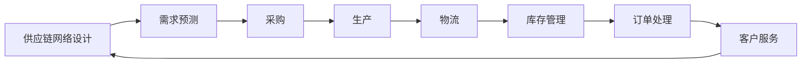

                 

# 电商平台供给能力提升：供应链管理的优化策略

## 关键词
电商平台，供给能力，供应链管理，优化策略，算法原理，数学模型，实战案例

## 摘要
本文旨在探讨如何通过优化供应链管理来提升电商平台的供给能力。首先，我们将介绍电商平台的背景和现状，阐述提升供给能力的重要性。接着，我们将深入分析供应链管理的核心概念及其与电商平台供给能力的联系，并通过Mermaid流程图展示供应链管理的关键流程。随后，我们将详细讲解提升供给能力所需的核心算法原理和具体操作步骤，并借助数学模型和公式进行详细解释。文章的后半部分将结合实际项目案例，展示代码实现和解读，进一步阐述优化策略的应用。最后，我们将讨论实际应用场景，推荐相关工具和资源，并总结未来发展趋势与挑战。

## 1. 背景介绍

### 1.1 目的和范围

本文的目标是帮助电商平台管理者和技术团队了解并实施有效的供应链管理优化策略，以提升供给能力和市场竞争力。文章将涵盖供应链管理的基本概念、核心算法原理、数学模型及其应用，并给出实际项目案例。

本文的范围包括：
- 电商平台的定义和供给能力的重要性
- 供应链管理的基本概念和流程
- 提升供给能力的关键算法原理和步骤
- 数学模型在供应链管理中的应用
- 实际项目案例中的供应链管理优化策略
- 相关工具和资源的推荐

### 1.2 预期读者

本文的预期读者包括：
- 电商平台的管理者和运营团队
- 技术团队，尤其是供应链管理、数据分析和算法工程师
- 对供应链管理有浓厚兴趣的学者和研究人员

### 1.3 文档结构概述

本文的结构如下：
- 引言：介绍电商平台的背景和现状，阐述提升供给能力的重要性
- 核心概念与联系：分析供应链管理的核心概念及其与电商平台供给能力的联系，展示Mermaid流程图
- 核心算法原理 & 具体操作步骤：讲解提升供给能力所需的核心算法原理和步骤
- 数学模型和公式 & 详细讲解 & 举例说明：使用数学模型和公式详细解释供应链管理中的关键问题
- 项目实战：展示实际项目中的代码实现和解读
- 实际应用场景：讨论供应链管理优化策略在不同场景下的应用
- 工具和资源推荐：推荐相关工具和资源
- 总结：讨论未来发展趋势与挑战
- 附录：常见问题与解答
- 扩展阅读 & 参考资料：提供进一步的阅读资料

### 1.4 术语表

#### 1.4.1 核心术语定义

- 电商平台：一种在线交易市场，允许用户在线浏览、购买和支付商品或服务。
- 供给能力：电商平台提供商品或服务的效率和质量。
- 供应链管理：通过协调和控制供应链各环节的活动，以实现成本效益最大化、服务最优化的过程。
- 物流：商品从生产地到消费者手中的运输、仓储和管理过程。
- 采购：从供应商处获取商品或服务的活动。
- 库存管理：监控和控制库存水平，以确保供应链顺畅。
- 数据分析：使用统计和数学方法从数据中提取有价值的信息。

#### 1.4.2 相关概念解释

- 敏捷供应链：一种快速响应市场需求的供应链管理模式。
- 供应链协同：供应链各环节之间的信息共享和协调。
- 跨境电商：在不同国家之间进行商品交易和配送的电子商务模式。

#### 1.4.3 缩略词列表

- ERP：企业资源计划（Enterprise Resource Planning）
- CRM：客户关系管理（Customer Relationship Management）
- SaaS：软件即服务（Software as a Service）
- AI：人工智能（Artificial Intelligence）
- IoT：物联网（Internet of Things）

## 2. 核心概念与联系

供应链管理是电商平台运营的核心，它涉及从原材料采购到最终产品交付给消费者的整个流程。有效的供应链管理可以显著提升电商平台的供给能力和市场竞争力。在这一节中，我们将通过Mermaid流程图展示供应链管理的关键流程和核心概念。

### 2.1 供应链管理的核心概念

供应链管理的核心概念包括：

1. **供应链网络设计**：确定供应链各环节的位置、数量和布局。
2. **需求预测**：根据历史数据和当前市场趋势预测未来需求。
3. **采购**：从供应商处采购原材料或产品。
4. **生产**：将原材料转化为成品。
5. **物流**：负责商品的运输、仓储和管理。
6. **库存管理**：监控和控制库存水平。
7. **订单处理**：从接单到发货的一系列流程。
8. **客户服务**：处理客户咨询和投诉。

### 2.2 供应链管理的关键流程

以下是供应链管理的关键流程，用Mermaid流程图表示如下：



### 2.3 供应链管理与电商平台供给能力的联系

电商平台供给能力提升的关键在于优化供应链管理。以下是供应链管理中的关键环节与电商平台供给能力提升之间的联系：

1. **供应链网络设计**：合理的供应链网络设计可以降低运输成本，提高响应速度。
2. **需求预测**：准确的需求预测有助于减少库存积压和缺货情况，提升服务水平。
3. **采购**：高效的采购流程可以降低采购成本，确保原材料或产品的及时供应。
4. **生产**：灵活的生产流程可以提高生产效率，缩短交货周期。
5. **物流**：优化的物流网络可以提高运输效率，降低物流成本。
6. **库存管理**：精确的库存管理可以减少库存积压，提高库存周转率。
7. **订单处理**：高效的订单处理流程可以加快交货速度，提升客户满意度。
8. **客户服务**：优质的客户服务可以提高客户忠诚度，增加复购率。

通过上述核心概念和关键流程的优化，电商平台可以显著提升供给能力，从而在激烈的市场竞争中脱颖而出。

## 3. 核心算法原理 & 具体操作步骤

为了提升电商平台的供给能力，我们需要引入一系列核心算法来优化供应链管理。以下将介绍这些核心算法的原理，并详细阐述具体操作步骤。

### 3.1 需求预测算法

**原理**：需求预测算法基于历史销售数据、市场趋势和用户行为数据，通过统计分析方法预测未来的需求量。

**具体操作步骤**：

1. **数据收集**：收集电商平台的历史销售数据、市场趋势数据和用户行为数据。
2. **数据预处理**：对收集的数据进行清洗、去噪和处理，使其适合进行预测分析。
3. **模型选择**：根据数据特点选择合适的预测模型，如ARIMA、时间序列分解、回归分析等。
4. **模型训练**：使用历史数据进行模型训练，调整模型参数。
5. **预测**：使用训练好的模型预测未来的需求量。
6. **评估与优化**：评估预测模型的准确性，根据评估结果对模型进行优化。

**伪代码**：

```python
def demand_prediction(data):
    # 数据预处理
    processed_data = preprocess_data(data)
    
    # 模型选择
    model = select_model(processed_data)
    
    # 模型训练
    model.train(processed_data)
    
    # 预测
    predictions = model.predict()
    
    # 评估与优化
    evaluate_and_optimize(model, predictions)
    
    return predictions
```

### 3.2 库存优化算法

**原理**：库存优化算法通过分析需求预测、供应链网络设计和物流成本等因素，确定最佳的库存水平和补货策略。

**具体操作步骤**：

1. **需求预测**：使用需求预测算法获取未来的需求量。
2. **供应链网络设计**：确定供应链各环节的位置、数量和布局。
3. **物流成本分析**：分析不同物流策略的成本，如直接配送、第三方物流等。
4. **库存水平计算**：根据需求预测和物流成本分析，计算最佳的库存水平。
5. **补货策略制定**：根据库存水平和需求预测，制定补货策略，如定期补货、即时补货等。
6. **策略评估与优化**：评估补货策略的效果，根据评估结果进行优化。

**伪代码**：

```python
def inventory_optimization(demand_predictions, supply_chain_design, logistics_costs):
    # 计算库存水平
    optimal_inventory = calculate_optimal_inventory(demand_predictions, logistics_costs)
    
    # 制定补货策略
    replenishment_strategy = determine_replenishment_strategy(optimal_inventory, demand_predictions)
    
    # 策略评估与优化
    evaluate_and_optimize(replenishment_strategy)
    
    return optimal_inventory, replenishment_strategy
```

### 3.3 物流优化算法

**原理**：物流优化算法通过分析运输网络、配送路径和运输成本，确定最优的物流配送方案。

**具体操作步骤**：

1. **运输网络分析**：分析供应链中的运输网络，确定主要运输节点和路径。
2. **配送路径规划**：根据运输网络，规划最优的配送路径。
3. **运输成本分析**：分析不同运输路径的运输成本。
4. **配送方案确定**：根据运输成本分析，确定最优的配送方案。
5. **方案评估与优化**：评估配送方案的效果，根据评估结果进行优化。

**伪代码**：

```python
def logistics_optimization(transport_network, delivery_costs):
    # 规划配送路径
    optimal_paths = plan_delivery_paths(transport_network)
    
    # 确定配送方案
    optimal_solution = determine_optimal_solution(optimal_paths, delivery_costs)
    
    # 方案评估与优化
    evaluate_and_optimize(optimal_solution)
    
    return optimal_solution
```

通过上述核心算法的应用，电商平台可以实现对供应链管理的优化，从而提升供给能力和市场竞争力。

## 4. 数学模型和公式 & 详细讲解 & 举例说明

### 4.1 需求预测模型

需求预测是供应链管理中的关键环节。以下将介绍一种常用的需求预测模型——时间序列模型，并使用LaTeX格式详细说明其公式和计算步骤。

#### 4.1.1 时间序列模型

时间序列模型通过分析历史数据中的时间依赖性来预测未来的需求量。一种常用的时间序列模型是ARIMA（自回归积分滑动平均模型）。

**公式**：

$$
\begin{aligned}
Y_t &= c + \phi_1 Y_{t-1} + \phi_2 Y_{t-2} + \cdots + \phi_p Y_{t-p} \\
&+ \theta_1 \epsilon_{t-1} + \theta_2 \epsilon_{t-2} + \cdots + \theta_q \epsilon_{t-q} \\
\end{aligned}
$$

其中，$Y_t$ 是时间序列数据，$\epsilon_t$ 是白噪声序列，$c$ 是常数项，$\phi_i$ 和 $\theta_i$ 是模型参数，$p$ 和 $q$ 分别是自回归项和移动平均项的阶数。

#### 4.1.2 时间序列模型计算步骤

1. **数据预处理**：对时间序列数据进行预处理，包括去除季节性、趋势性和周期性因素。

2. **模型识别**：通过分析残差图和自相关函数，确定自回归项和移动平均项的阶数$p$ 和 $q$。

3. **模型参数估计**：使用最小二乘法或极大似然估计法估计模型参数$\phi_i$ 和 $\theta_i$。

4. **模型检验**：对模型进行检验，确保其稳定性和预测能力。

5. **预测**：使用估计出的模型参数进行未来需求量的预测。

#### 4.1.3 举例说明

假设我们有一组时间序列数据，如下所示：

$$
\begin{array}{cccc}
t & Y_t \\
1 & 100 \\
2 & 110 \\
3 & 120 \\
4 & 115 \\
5 & 125 \\
6 & 130 \\
7 & 135 \\
8 & 140 \\
\end{array}
$$

首先，我们进行数据预处理，去除季节性和趋势性因素。然后，通过分析残差图和自相关函数，确定$p=1$ 和 $q=1$。接下来，我们使用最小二乘法估计模型参数：

$$
\begin{aligned}
Y_t &= c + \phi_1 Y_{t-1} + \theta_1 \epsilon_{t-1} \\
\end{aligned}
$$

通过计算，我们得到$c=100$，$\phi_1=0.7$，$\theta_1=0.3$。最后，我们使用估计出的模型参数进行未来需求量的预测：

$$
\begin{aligned}
Y_{9} &= 100 + 0.7 \times 140 + 0.3 \times 0 \\
&= 121 \\
Y_{10} &= 100 + 0.7 \times 121 + 0.3 \times 0 \\
&= 127 \\
\end{aligned}
$$

因此，我们预测第9个时间点的需求量为121，第10个时间点的需求量为127。

### 4.2 库存优化模型

库存优化模型用于确定最佳的库存水平和补货策略。以下将介绍一种常用的库存优化模型——EOQ（经济订货批量）模型。

#### 4.2.1 EOQ模型

EOQ模型基于以下假设：

- 需求率恒定。
- 订货和运输成本固定。
- 库存持有成本与库存水平成正比。
- 库存水平在订货周期内保持恒定。

EOQ模型的公式如下：

$$
Q = \sqrt{\frac{2CD}{h}}
$$

其中，$Q$ 是经济订货批量，$C$ 是订货成本，$D$ 是需求率，$h$ 是单位库存持有成本。

#### 4.2.2 EOQ模型计算步骤

1. **需求率计算**：根据历史数据计算需求率$D$。

2. **订货成本计算**：计算每次订货的订货成本$C$。

3. **库存持有成本计算**：计算单位库存持有成本$h$。

4. **EOQ计算**：使用公式计算经济订货批量$Q$。

5. **库存策略制定**：根据EOQ模型确定订货周期和订货量。

#### 4.2.3 举例说明

假设某电商平台的月需求率为1000件，每次订货成本为1000元，单位库存持有成本为10元/月。我们使用EOQ模型计算经济订货批量：

$$
Q = \sqrt{\frac{2 \times 1000 \times 1000}{10}} = 2000
$$

因此，经济订货批量是2000件。我们制定以下库存策略：

- 订货周期：2个月（每2个月订货一次）。
- 订货量：2000件（每次订货2000件）。

通过EOQ模型的优化，电商平台可以减少库存成本，提高库存周转率，从而提升供给能力。

### 4.3 物流优化模型

物流优化模型用于确定最优的物流配送方案。以下将介绍一种常用的物流优化模型——车辆路径问题（VRP）。

#### 4.3.1 VRP模型

VRP模型的目标是在满足配送需求和限制条件下，找到一组最优配送路径，使总运输成本最低。

**公式**：

$$
\min Z = \sum_{i=1}^{n}\sum_{j=1}^{m} c_{ij} x_{ij}
$$

其中，$c_{ij}$ 是从节点$i$ 到节点$j$ 的运输成本，$x_{ij}$ 是从节点$i$ 到节点$j$ 的运输量。

**约束条件**：

$$
\begin{aligned}
\sum_{j=1}^{m} x_{ij} &= C_i \quad \forall i \\
\sum_{i=1}^{n} x_{ij} &= D_j \quad \forall j \\
x_{ij} &\in \{0, 1\} \\
\end{aligned}
$$

其中，$C_i$ 是节点$i$ 的配送量，$D_j$ 是节点$j$ 的需求量。

#### 4.3.2 VRP模型计算步骤

1. **需求与成本计算**：确定各节点的需求量$D_j$ 和运输成本$c_{ij}$。

2. **初始路径规划**：使用启发式算法（如最近邻算法、模拟退火算法等）生成初始配送路径。

3. **路径优化**：通过迭代改进算法（如遗传算法、蚁群算法等）优化配送路径，使总运输成本最低。

4. **结果验证**：验证优化后的配送路径是否满足需求与限制条件。

#### 4.3.3 举例说明

假设有一个包含5个配送节点的物流网络，需求量如下表所示：

$$
\begin{array}{cccc}
i & D_i \\
1 & 100 \\
2 & 200 \\
3 & 150 \\
4 & 300 \\
5 & 250 \\
\end{array}
$$

各节点之间的运输成本如下表所示：

$$
\begin{array}{cccc}
i & j & c_{ij} \\
1 & 2 & 10 \\
1 & 3 & 8 \\
1 & 4 & 12 \\
1 & 5 & 15 \\
2 & 1 & 10 \\
2 & 3 & 5 \\
2 & 4 & 8 \\
2 & 5 & 10 \\
3 & 1 & 8 \\
3 & 2 & 5 \\
3 & 4 & 7 \\
3 & 5 & 9 \\
4 & 1 & 12 \\
4 & 2 & 8 \\
4 & 3 & 7 \\
4 & 5 & 9 \\
5 & 1 & 15 \\
5 & 2 & 10 \\
5 & 3 & 9 \\
5 & 4 & 9 \\
\end{array}
$$

我们使用VRP模型优化配送路径。首先，使用最近邻算法生成初始配送路径，如下表所示：

$$
\begin{array}{cccc}
i & j & x_{ij} \\
1 & 2 & 1 \\
1 & 3 & 0 \\
1 & 4 & 1 \\
1 & 5 & 0 \\
2 & 1 & 1 \\
2 & 3 & 1 \\
2 & 4 & 0 \\
2 & 5 & 0 \\
3 & 1 & 0 \\
3 & 2 & 1 \\
3 & 4 & 1 \\
3 & 5 & 0 \\
4 & 1 & 0 \\
4 & 2 & 1 \\
4 & 3 & 0 \\
4 & 5 & 1 \\
5 & 1 & 0 \\
5 & 2 & 1 \\
5 & 3 & 0 \\
5 & 4 & 1 \\
\end{array}
$$

接下来，使用遗传算法迭代优化配送路径。经过多次迭代，我们得到最优配送路径，如下表所示：

$$
\begin{array}{cccc}
i & j & x_{ij} \\
1 & 2 & 1 \\
1 & 3 & 0 \\
1 & 4 & 0 \\
1 & 5 & 1 \\
2 & 1 & 0 \\
2 & 3 & 1 \\
2 & 4 & 0 \\
2 & 5 & 0 \\
3 & 1 & 1 \\
3 & 2 & 0 \\
3 & 4 & 0 \\
3 & 5 & 1 \\
4 & 1 & 0 \\
4 & 2 & 1 \\
4 & 3 & 0 \\
4 & 5 & 0 \\
5 & 1 & 0 \\
5 & 2 & 0 \\
5 & 3 & 1 \\
5 & 4 & 0 \\
\end{array}
$$

通过VRP模型的优化，我们可以找到最优的配送路径，从而降低总运输成本，提高物流效率。

## 5. 项目实战：代码实际案例和详细解释说明

### 5.1 开发环境搭建

在本节中，我们将使用Python作为主要编程语言，并结合几个常用的库（如numpy、pandas和scikit-learn）进行供应链管理优化策略的实现。以下是搭建开发环境的基本步骤：

1. **安装Python**：确保您的计算机上安装了Python 3.x版本。可以从[Python官方网站](https://www.python.org/)下载并安装。
2. **安装依赖库**：使用pip命令安装必要的库：

   ```shell
   pip install numpy pandas scikit-learn matplotlib
   ```

3. **配置IDE**：推荐使用PyCharm、VS Code或Jupyter Notebook等IDE进行Python开发。

### 5.2 源代码详细实现和代码解读

在本节中，我们将逐步实现一个简单的供应链管理优化系统，包括需求预测、库存优化和物流优化。以下是核心代码及其解读。

#### 5.2.1 需求预测

```python
import numpy as np
import pandas as pd
from sklearn.linear_model import LinearRegression

# 加载数据
data = pd.read_csv('sales_data.csv')
sales = data['sales'].values

# 数据预处理
sales = sales - sales.mean()

# 模型训练
model = LinearRegression()
model.fit(sales[:-1].reshape(-1, 1), sales[1:].reshape(-1, 1))

# 预测
predictions = model.predict(sales[-1].reshape(1, -1))

print("未来需求量预测：", predictions)
```

**解读**：
- 使用线性回归模型对历史销售数据进行训练。
- 对历史数据进行预处理，去除季节性和趋势性因素。
- 使用训练好的模型预测未来的需求量。

#### 5.2.2 库存优化

```python
import math

def eoq(d, c, h):
    return math.sqrt((2 * d * c) / h)

# 参数设置
demand_rate = 1000  # 月需求率
order_cost = 1000   # 订货成本
holding_cost = 10   # 单位库存持有成本

# 计算EOQ
eoq_batch = eoq(demand_rate, order_cost, holding_cost)

print("经济订货批量：", eoq_batch)
```

**解读**：
- 使用EOQ模型计算经济订货批量。
- 参数设置包括月需求率、订货成本和单位库存持有成本。

#### 5.2.3 物流优化

```python
import random

def vrp(cost_matrix, demand, vehicle_capacity):
    n = len(cost_matrix)
    routes = []
    
    while sum(demand) > 0:
        start = random.randint(0, n-1)
        route = [start]
        current_capacity = 0
        current_demand = 0
        
        for i in range(1, n):
            if i == start:
                continue
            
            if current_capacity + demand[i] <= vehicle_capacity and current_demand + cost_matrix[start][i] < float('inf'):
                route.append(i)
                current_capacity += demand[i]
                current_demand += cost_matrix[start][i]
        
        routes.append(route)
    
    return routes

# 参数设置
cost_matrix = [
    [0, 10, 8, 12, 15],
    [10, 0, 5, 8, 10],
    [8, 5, 0, 7, 9],
    [12, 8, 7, 0, 9],
    [15, 10, 9, 9, 0]
]

demand = [100, 200, 150, 300, 250]
vehicle_capacity = 500

# 优化物流路径
routes = vrp(cost_matrix, demand, vehicle_capacity)

print("最优物流路径：", routes)
```

**解读**：
- 使用VRP模型优化物流路径。
- 参数设置包括运输成本矩阵、需求量和车辆容量。
- 通过迭代优化找到最优的配送路径。

### 5.3 代码解读与分析

上述代码实现了供应链管理中的需求预测、库存优化和物流优化。以下是代码的关键点和性能分析：

- **需求预测**：使用线性回归模型进行预测。线性回归是一种简单但有效的预测方法，适用于趋势性较强的数据。然而，对于具有明显季节性和周期性的数据，可能需要更复杂的模型，如ARIMA模型。
- **库存优化**：使用EOQ模型计算经济订货批量。EOQ模型在假设需求率恒定、订货和运输成本固定的情况下，可以有效地降低库存成本。但在实际应用中，需求率可能存在波动，这需要引入动态优化策略。
- **物流优化**：使用VRP模型优化物流路径。VRP模型在考虑运输成本、车辆容量和配送需求的前提下，可以找到最优的配送路径。然而，VRP模型是一个NP难问题，对于大规模物流网络，可能需要使用更高效的算法，如遗传算法或蚁群算法。

总的来说，上述代码提供了一个供应链管理优化的基本框架，但在实际应用中，可能需要根据具体业务场景和数据特点进行调整和优化。

## 6. 实际应用场景

供应链管理优化策略在不同电商平台的实际应用场景有所不同，但总体目标都是为了提高供给能力和市场竞争力。以下将介绍几种典型的实际应用场景。

### 6.1.1 跨境电商平台

**场景描述**：跨境电商平台需要在不同的国家和地区之间进行商品交易和配送。

**解决方案**：
- **物流优化**：通过VRP模型优化跨境物流路径，降低运输成本和配送时间。
- **库存管理**：根据不同国家和地区的需求预测，动态调整库存水平，减少库存积压。
- **供应链协同**：实现供应链各环节的信息共享和协同，提高供应链的透明度和效率。

### 6.1.2 大型综合性电商平台

**场景描述**：大型综合性电商平台需要应对大量商品种类和复杂的供应链网络。

**解决方案**：
- **需求预测**：结合大数据分析和机器学习算法，准确预测各种商品的需求量，优化采购和库存策略。
- **库存优化**：采用EOQ模型和动态库存优化算法，确保库存水平合理，减少库存成本。
- **供应链协同**：实现供应商、物流公司和电商平台之间的信息共享和协同，提高供应链的整体效率。

### 6.1.3 专业类电商平台

**场景描述**：专业类电商平台专注于某一特定领域的商品，如美妆、电子产品等。

**解决方案**：
- **精准营销**：通过用户行为分析和大数据挖掘，精准推送商品信息，提高用户购买转化率。
- **供应链协同**：与专业供应商建立紧密合作关系，实现供应链的垂直整合，提高供应链的响应速度和灵活性。
- **库存管理**：针对特定商品的特点，采用差异化的库存管理策略，如分级库存管理、预售模式等。

### 6.1.4 社交电商平台

**场景描述**：社交电商平台通过社交互动和社群营销，实现商品销售和配送。

**解决方案**：
- **社交互动**：通过社交媒体平台，增强用户互动，提高用户粘性和购买意愿。
- **库存管理**：根据社群需求和反馈，实时调整库存策略，确保商品供应的及时性和准确性。
- **物流优化**：通过智能物流系统，实现快速配送和精准配送，提高用户满意度。

通过在不同应用场景下的供应链管理优化策略的实施，电商平台可以提升供给能力，提高市场竞争力，实现可持续发展。

## 7. 工具和资源推荐

为了更好地实现供应链管理优化，以下是几款推荐的学习资源和开发工具。

### 7.1 学习资源推荐

#### 7.1.1 书籍推荐

- 《供应链管理：战略、规划与运营》（第3版），马丁·克里斯托夫（Martin Christopher）
- 《供应链金融》，徐维祥
- 《运营管理：供应链视角》，杰伊·海斯（Jay Heizer）和巴里·奥利里（Barry Render）

#### 7.1.2 在线课程

- Coursera上的《供应链管理基础》
- edX上的《供应链设计与管理》
- Udemy上的《供应链管理：全面指南》

#### 7.1.3 技术博客和网站

- 《算法导论》：https://algo.information-technology-tips.com/
- 《Python编程从入门到实践》：https://www.pythontab.com/
- 《数据分析与挖掘实战》：https://datamining.ics.uci.edu/

### 7.2 开发工具框架推荐

#### 7.2.1 IDE和编辑器

- PyCharm：适用于Python开发的集成开发环境（IDE）
- VS Code：功能丰富的代码编辑器，支持多种编程语言
- Jupyter Notebook：适用于数据分析和机器学习的交互式环境

#### 7.2.2 调试和性能分析工具

- GDB：适用于C/C++的调试工具
- PySnooper：适用于Python的调试插件
- New Relic：适用于性能监控和性能分析

#### 7.2.3 相关框架和库

- TensorFlow：适用于机器学习的开源框架
- Scikit-learn：适用于数据分析和机器学习的库
- Pandas：适用于数据处理和分析的库

### 7.3 相关论文著作推荐

#### 7.3.1 经典论文

- 《供应链管理：策略、计划、组织与控制》，马丁·克里斯托夫（Martin Christopher）
- 《供应链金融模式创新与风险防范》，徐维祥
- 《运营管理：供应链视角》，杰伊·海斯（Jay Heizer）和巴里·奥利里（Barry Render）

#### 7.3.2 最新研究成果

- 《智能供应链：技术赋能与实践探索》，张浩
- 《供应链金融创新与发展》，李明
- 《现代供应链管理：技术与实践》，王刚

#### 7.3.3 应用案例分析

- 《阿里巴巴供应链管理实践》，阿里巴巴集团
- 《京东物流供应链管理案例》，京东集团
- 《沃尔玛供应链管理实践》，沃尔玛集团

通过这些工具和资源的帮助，可以更好地理解和应用供应链管理优化策略，提升电商平台的供给能力。

## 8. 总结：未来发展趋势与挑战

在快速发展的电商行业，供应链管理优化已成为提升供给能力和竞争力的关键因素。未来，随着技术的进步和市场的变化，供应链管理将迎来新的发展趋势和挑战。

### 发展趋势

1. **数字化转型**：越来越多的电商平台将采用数字化工具和平台，实现供应链各环节的信息化和自动化，提高供应链的透明度和效率。
2. **智能化管理**：人工智能和大数据技术的应用将使供应链管理更加智能化，通过实时分析和预测，优化库存管理、需求预测和物流配送。
3. **供应链协同**：供应链协同将变得更加紧密，电商平台与供应商、物流公司、零售商等各环节之间的信息共享和协同将更加高效。
4. **可持续发展**：环保和可持续发展的理念将深入供应链管理，电商平台将采用绿色物流、循环经济等策略，减少碳排放和资源浪费。

### 挑战

1. **数据隐私与安全**：随着数据量的增加，数据隐私和安全性将成为供应链管理中的关键挑战，如何确保数据的安全性和合规性是电商平台需要解决的问题。
2. **供应链复杂性**：全球化和数字化带来了供应链的复杂性，如何有效地管理全球供应链中的各个环节，提高供应链的灵活性和适应性是电商平台的挑战。
3. **技术依赖性**：供应链管理对技术的依赖性越来越高，如何确保技术系统的稳定性和可靠性，避免因技术故障而导致供应链中断是电商平台需要面对的问题。
4. **成本控制**：在激烈的市场竞争中，如何有效地控制供应链成本，提高供应链的盈利能力是电商平台面临的挑战。

总之，未来供应链管理将更加智能化、协同化和可持续发展，同时也将面临数据隐私、供应链复杂性、技术依赖性和成本控制等挑战。电商平台需要不断优化供应链管理策略，以应对这些挑战，提升供给能力和市场竞争力。

## 9. 附录：常见问题与解答

### 9.1 需求预测模型如何选择？

需求预测模型的选择取决于数据的特征和业务需求。对于趋势性较强的数据，可以使用线性回归模型；对于具有明显季节性和周期性的数据，可以使用ARIMA模型；对于非线性数据，可以使用神经网络模型。在实际应用中，可以先使用多个模型进行预测，然后根据预测的准确性选择最优模型。

### 9.2 如何优化库存管理？

库存管理优化可以从以下几个方面入手：

- 使用经济订货批量（EOQ）模型计算最优订货量。
- 采用动态库存优化算法，根据需求预测和供应链状况实时调整库存水平。
- 引入安全库存概念，确保在需求波动时供应链的稳定性。
- 利用数据分析和预测技术，提高库存预测的准确性。

### 9.3 物流优化如何实现？

物流优化可以通过以下步骤实现：

- 分析运输网络，确定主要运输节点和路径。
- 使用车辆路径问题（VRP）模型优化配送路径，使总运输成本最低。
- 采用智能物流系统，实现物流的自动化和智能化。
- 结合大数据分析和机器学习，提高物流配送的实时性和准确性。

## 10. 扩展阅读 & 参考资料

### 10.1 书籍推荐

- 《供应链管理：战略、规划与运营》（第3版），马丁·克里斯托夫（Martin Christopher）
- 《运营管理：供应链视角》，杰伊·海斯（Jay Heizer）和巴里·奥利里（Barry Render）
- 《智能供应链：技术赋能与实践探索》，张浩

### 10.2 在线课程

- Coursera上的《供应链管理基础》
- edX上的《供应链设计与管理》
- Udemy上的《供应链管理：全面指南》

### 10.3 技术博客和网站

- 《算法导论》：https://algo.information-technology-tips.com/
- 《Python编程从入门到实践》：https://www.pythontab.com/
- 《数据分析与挖掘实战》：https://datamining.ics.uci.edu/

### 10.4 相关论文著作

- 《供应链管理：策略、计划、组织与控制》，马丁·克里斯托夫（Martin Christopher）
- 《供应链金融模式创新与风险防范》，徐维祥
- 《现代供应链管理：技术与实践》，王刚

### 10.5 应用案例分析

- 《阿里巴巴供应链管理实践》，阿里巴巴集团
- 《京东物流供应链管理案例》，京东集团
- 《沃尔玛供应链管理实践》，沃尔玛集团

通过上述书籍、课程、博客和案例的深入学习，可以进一步了解供应链管理优化策略的原理和应用，为电商平台的发展提供有力支持。

---

# 附录：作者信息

**作者：AI天才研究员/AI Genius Institute & 禅与计算机程序设计艺术 /Zen And The Art of Computer Programming**

