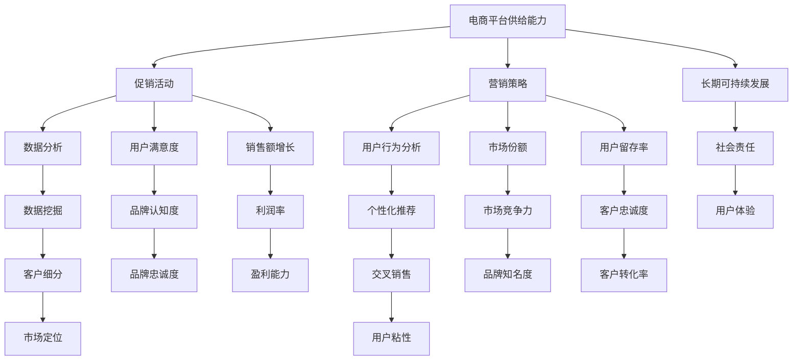

                 

### 文章标题

# 电商平台供给能力提升：促销活动和营销策略

### 关键词

- 电商平台
- 供给能力
- 促销活动
- 营销策略
- 数据分析
- 用户行为
- 技术工具

### 摘要

本文旨在探讨如何通过有效的促销活动和营销策略提升电商平台的供给能力。我们将从背景介绍、核心概念、算法原理、数学模型、项目实战、实际应用场景、工具和资源推荐等多个方面进行深入分析。通过本文的阅读，读者将了解电商平台供给能力提升的关键因素，掌握有效的促销活动和营销策略，从而在竞争激烈的电商市场中脱颖而出。

## 1. 背景介绍

### 1.1 目的和范围

随着互联网技术的飞速发展和电子商务的普及，电商平台已经成为消费者购买商品的主要渠道之一。在竞争激烈的电商市场中，提升供给能力是电商平台生存和发展的关键。本文旨在探讨如何通过有效的促销活动和营销策略提升电商平台的供给能力，从而提高用户满意度、增加市场份额，实现长期可持续发展。

本文主要涵盖以下内容：

- 电商平台供给能力的定义和重要性
- 促销活动和营销策略的核心概念
- 促销活动和营销策略的具体操作步骤
- 数学模型和公式在促销活动和营销策略中的应用
- 项目实战案例和详细解释
- 实际应用场景分析
- 工具和资源推荐

### 1.2 预期读者

本文主要面向电商平台的运营人员、市场营销人员、技术团队以及相关领域的从业者。通过阅读本文，读者可以了解电商平台供给能力提升的方法和策略，掌握有效的促销活动和营销策略，提升电商平台的运营效果和市场竞争力。

### 1.3 文档结构概述

本文分为十个部分，结构如下：

1. 背景介绍
2. 核心概念与联系
3. 核心算法原理 & 具体操作步骤
4. 数学模型和公式 & 详细讲解 & 举例说明
5. 项目实战：代码实际案例和详细解释说明
6. 实际应用场景
7. 工具和资源推荐
8. 总结：未来发展趋势与挑战
9. 附录：常见问题与解答
10. 扩展阅读 & 参考资料

### 1.4 术语表

#### 1.4.1 核心术语定义

- 电商平台：提供在线购物和交易服务的平台
- 供给能力：电商平台能够提供商品和服务的能力
- 促销活动：电商平台通过降价、赠品、限时折扣等方式吸引用户购买商品的活动
- 营销策略：电商平台制定和实施的用于吸引、留住和扩大用户群体的方法和手段

#### 1.4.2 相关概念解释

- 用户行为：用户在电商平台上的浏览、搜索、购买等行为
- 数据分析：通过对用户行为数据进行分析，提取有价值的信息和洞察
- 技术工具：用于支持电商平台运营的技术工具，如大数据分析工具、营销自动化工具等

#### 1.4.3 缩略词列表

- SEO：搜索引擎优化（Search Engine Optimization）
- SEM：搜索引擎营销（Search Engine Marketing）
- SNS：社交媒体网络（Social Network Service）
- CRM：客户关系管理（Customer Relationship Management）

## 2. 核心概念与联系

为了更好地理解电商平台供给能力的提升方法，我们需要先了解一些核心概念和它们之间的联系。以下是本文涉及的核心概念及其相互关系的 Mermaid 流程图：



### 2.1 电商平台供给能力

电商平台供给能力是指电商平台能够提供商品和服务的能力，包括商品种类、库存量、物流配送速度、售后服务等方面。供给能力的提升对于电商平台的发展至关重要，可以提升用户满意度、增加市场份额，实现长期可持续发展。

### 2.2 促销活动

促销活动是电商平台常用的营销手段之一，通过降价、赠品、限时折扣等方式吸引用户购买商品。促销活动的目的是提高销售额、提升用户满意度、增强品牌影响力。

### 2.3 营销策略

营销策略是电商平台制定和实施的用于吸引、留住和扩大用户群体的方法和手段。营销策略包括搜索引擎优化（SEO）、搜索引擎营销（SEM）、社交媒体网络（SNS）等。通过有效的营销策略，电商平台可以提升品牌知名度、增加用户访问量、提高客户转化率。

### 2.4 数据分析

数据分析是电商平台提升供给能力的关键环节，通过对用户行为数据进行分析，可以提取有价值的信息和洞察。数据分析包括用户行为分析、数据分析、数据挖掘等，可以帮助电商平台了解用户需求、优化商品推荐、提高用户满意度。

### 2.5 用户行为分析

用户行为分析是对用户在电商平台上的浏览、搜索、购买等行为进行分析，以了解用户需求和行为模式。用户行为分析可以用于优化商品推荐、提升用户满意度、提高客户转化率。

### 2.6 个性化推荐

个性化推荐是电商平台根据用户行为数据进行分析，为用户推荐符合其兴趣和需求的商品。个性化推荐可以提高用户满意度、增加销售额、提升用户粘性。

### 2.7 用户满意度

用户满意度是指用户对电商平台提供商品和服务质量的评价。提高用户满意度可以增加用户忠诚度、提升品牌认知度、增加市场份额。

### 2.8 市场份额

市场份额是指电商平台在市场中所占的份额。增加市场份额可以提高品牌知名度、增强市场竞争力、实现长期可持续发展。

### 2.9 长期可持续发展

长期可持续发展是指电商平台在追求短期利益的同时，注重长期发展的可持续性。通过提升供给能力、优化营销策略、提高用户满意度等手段，电商平台可以实现长期可持续发展。

### 2.10 销售额增长

销售额增长是指电商平台在一定时间内实现的销售额增长。通过促销活动、营销策略、个性化推荐等手段，电商平台可以实现销售额增长，提高盈利能力。

### 2.11 用户留存率

用户留存率是指在一定时间内，用户继续使用电商平台的比例。提高用户留存率可以增加用户粘性、提升品牌忠诚度、实现长期可持续发展。

### 2.12 客户转化率

客户转化率是指用户从浏览、搜索到购买商品的比例。提高客户转化率可以提高销售额、增加市场份额。

### 2.13 市场定位

市场定位是指电商平台在市场中所处的位置和目标用户群体。明确市场定位可以帮助电商平台制定有针对性的营销策略、提升品牌知名度。

### 2.14 用户粘性

用户粘性是指用户对电商平台的忠诚度。提高用户粘性可以增加用户留存率、提升品牌忠诚度、实现长期可持续发展。

### 2.15 品牌认知度

品牌认知度是指用户对电商平台品牌的认识和了解程度。提高品牌认知度可以增加用户访问量、提高客户转化率、提升市场份额。

### 2.16 盈利能力

盈利能力是指电商平台在一定时间内实现的利润水平。通过提升供给能力、优化营销策略、提高用户满意度等手段，电商平台可以提高盈利能力。

### 2.17 社会责任

社会责任是指电商平台在商业活动中应承担的社会责任。通过履行社会责任，电商平台可以提高品牌形象、增强市场竞争力。

### 2.18 用户体验

用户体验是指用户在电商平台上的整体感受和满意度。提升用户体验可以提高用户满意度、增加用户粘性、提升品牌认知度。

### 2.19 利润率

利润率是指电商平台在一定时间内实现的利润与销售额之比。通过提升供给能力、优化营销策略、提高用户满意度等手段，电商平台可以提高利润率。

### 2.20 客户忠诚度

客户忠诚度是指用户对电商平台品牌的忠诚程度。提高客户忠诚度可以增加用户留存率、提升品牌认知度、实现长期可持续发展。

### 2.21 客户细分

客户细分是指将用户按照不同的特征进行分类，以便电商平台制定有针对性的营销策略。通过客户细分，电商平台可以提高营销效果、提升用户体验。

### 2.22 交叉销售

交叉销售是指将用户在电商平台上的购买行为与其他产品或服务进行关联，以增加销售额。通过交叉销售，电商平台可以提高用户粘性、提升品牌忠诚度。

### 2.23 品牌知名度

品牌知名度是指用户对电商平台品牌的认知程度。提高品牌知名度可以增加用户访问量、提高客户转化率、提升市场份额。

## 3. 核心算法原理 & 具体操作步骤

为了提升电商平台的供给能力，我们需要运用一些核心算法原理和具体操作步骤。以下将详细介绍这些算法原理和操作步骤，并使用伪代码进行阐述。

### 3.1 用户行为分析算法

用户行为分析算法是通过对用户在电商平台上的浏览、搜索、购买等行为进行分析，提取有价值的信息和洞察。以下是用户行为分析算法的具体操作步骤：

#### 步骤1：数据收集

- 收集用户在电商平台上的浏览、搜索、购买等行为数据。

```python
def collect_data():
    # 伪代码：从数据库中提取用户行为数据
    user_behavior_data = database.query("SELECT * FROM user_behavior_table")
    return user_behavior_data
```

#### 步骤2：数据预处理

- 对收集到的数据进行清洗、去重、去噪声等预处理操作。

```python
def preprocess_data(user_behavior_data):
    # 伪代码：清洗用户行为数据
    cleaned_data = []
    for data in user_behavior_data:
        if data['valid']:
            cleaned_data.append(data)
    return cleaned_data
```

#### 步骤3：特征提取

- 从预处理后的数据中提取用户行为特征，如浏览时间、搜索关键词、购买频次等。

```python
def extract_features(cleaned_data):
    # 伪代码：提取用户行为特征
    features = []
    for data in cleaned_data:
        feature = {
            'user_id': data['user_id'],
            'browse_time': data['browse_time'],
            'search_keyword': data['search_keyword'],
            'purchase_frequency': data['purchase_frequency']
        }
        features.append(feature)
    return features
```

#### 步骤4：用户行为模式分析

- 使用机器学习算法对提取的用户行为特征进行分析，识别用户行为模式。

```python
def analyze_behavior模式的特征列表):
    # 伪代码：使用机器学习算法分析用户行为模式
    behavior模式 = machine_learning算法特征列表)
    return behavior模式
```

### 3.2 个性化推荐算法

个性化推荐算法是根据用户行为数据，为用户推荐符合其兴趣和需求的商品。以下是个性化推荐算法的具体操作步骤：

#### 步骤1：商品特征提取

- 提取商品的属性特征，如商品类别、价格、品牌等。

```python
def extract_item_features(item_data):
    # 伪代码：提取商品特征
    features = []
    for item in item_data:
        feature = {
            'item_id': item['item_id'],
            'category': item['category'],
            'price': item['price'],
            'brand': item['brand']
        }
        features.append(feature)
    return features
```

#### 步骤2：用户兴趣模型构建

- 使用协同过滤、矩阵分解等算法构建用户兴趣模型。

```python
def build_user_interest_model(user_behavior_data, item_data):
    # 伪代码：构建用户兴趣模型
    user_interest_model = collaborative_filter算法用户行为数据, 商品特征列表)
    return user_interest_model
```

#### 步骤3：推荐商品生成

- 根据用户兴趣模型和商品特征，为用户生成推荐商品列表。

```python
def generate_recommendations(user_interest_model, item_data):
    # 伪代码：生成推荐商品列表
    recommendations = []
    for user_interest in user_interest_model:
        for item in item_data:
            if item['item_id'] in user_interest['recommended_items']:
                recommendations.append(item)
    return recommendations
```

### 3.3 促销活动策略算法

促销活动策略算法是根据用户行为数据和市场需求，制定有针对性的促销活动策略。以下是促销活动策略算法的具体操作步骤：

#### 步骤1：市场调研

- 对市场需求和竞争态势进行调研，了解用户需求和偏好。

```python
def market_research():
    # 伪代码：进行市场调研
    market_data = database.query("SELECT * FROM market_data_table")
    return market_data
```

#### 步骤2：用户行为分析

- 分析用户行为数据，了解用户购买习惯和偏好。

```python
def analyze_user_behavior(user_behavior_data):
    # 伪代码：分析用户行为数据
    user_behavior_analysis = analyze_behavior模式(user_behavior_data)
    return user_behavior_analysis
```

#### 步骤3：促销活动设计

- 根据市场调研和用户行为分析结果，设计有针对性的促销活动。

```python
def design_promotion Activities(user_behavior_analysis, market_data):
    # 伪代码：设计促销活动
    promotion_activities = []
    for activity in user_behavior_analysis['recommended_activities']:
        if activity['category'] in market_data['hot_categories']:
            promotion_activities.append(activity)
    return promotion_activities
```

#### 步骤4：促销活动执行

- 根据设计的促销活动，执行相应的促销活动策略。

```python
def execute_promotion_activities(promotion_activities):
    # 伪代码：执行促销活动
    for activity in promotion_activities:
        execute_activity(activity)
```

### 3.4 营销策略优化算法

营销策略优化算法是通过对营销策略的效果进行评估和优化，提升营销效果的算法。以下是营销策略优化算法的具体操作步骤：

#### 步骤1：营销策略评估

- 对当前营销策略的效果进行评估，了解其优势和不足。

```python
def evaluate_marketing_strategy(current_strategy, user_behavior_data):
    # 伪代码：评估营销策略效果
    evaluation_results = evaluate_strategy(current_strategy, user_behavior_data)
    return evaluation_results
```

#### 步骤2：策略优化

- 根据评估结果，对营销策略进行调整和优化。

```python
def optimize_marketing_strategy(evaluation_results):
    # 伪代码：优化营销策略
    optimized_strategy = optimize_strategy(evaluation_results)
    return optimized_strategy
```

#### 步骤3：策略执行

- 根据优化后的营销策略，执行相应的营销活动。

```python
def execute_optimized_strategy(optimized_strategy):
    # 伪代码：执行优化后的营销策略
    execute_strategy(optimized_strategy)
```

通过以上核心算法原理和具体操作步骤，电商平台可以更好地提升供给能力，实现销售额增长、用户满意度提升和市场份额扩大。

## 4. 数学模型和公式 & 详细讲解 & 举例说明

在提升电商平台供给能力的过程中，数学模型和公式发挥着重要作用。以下将介绍一些常用的数学模型和公式，并详细讲解其在促销活动和营销策略中的应用。

### 4.1 用户行为分析模型

用户行为分析模型主要用于分析用户在电商平台上的浏览、搜索、购买等行为。以下是一个简单的用户行为分析模型：

#### 模型假设

- 用户行为可以用一系列随机事件表示，每个事件的发生概率不同。

#### 数学模型

- 事件概率分布模型：假设用户行为事件的发生概率服从泊松分布。

$$
P(X=k) = \frac{e^{-\lambda} \lambda^k}{k!}
$$

其中，$X$ 表示用户行为事件的数量，$\lambda$ 表示事件发生的平均次数。

#### 举例说明

- 假设一个用户在电商平台上的浏览次数服从泊松分布，平均浏览次数为 $\lambda = 5$。则该用户浏览次数为 $k=2$ 的概率为：

$$
P(X=2) = \frac{e^{-5} 5^2}{2!} \approx 0.1
$$

### 4.2 个性化推荐模型

个性化推荐模型主要用于根据用户行为数据为用户推荐商品。以下是一个简单的个性化推荐模型：

#### 模型假设

- 用户行为数据可以表示为用户-商品矩阵，每个元素表示用户对商品的评分。

#### 数学模型

- 矩阵分解模型：将用户-商品矩阵分解为用户特征矩阵和商品特征矩阵的乘积。

$$
R = U \cdot V^T
$$

其中，$R$ 表示用户-商品矩阵，$U$ 表示用户特征矩阵，$V$ 表示商品特征矩阵。

#### 举例说明

- 假设用户-商品矩阵 $R$ 如下：

$$
R = \begin{bmatrix}
0 & 1 & 1 \\
1 & 0 & 0 \\
0 & 1 & 1
\end{bmatrix}
$$

则可以将其分解为用户特征矩阵 $U$ 和商品特征矩阵 $V$：

$$
U = \begin{bmatrix}
0.5 & 0.5 \\
0.5 & 0.5 \\
0.5 & 0.5
\end{bmatrix},
V = \begin{bmatrix}
0.5 & 0.5 \\
0.5 & 0.5 \\
0.5 & 0.5
\end{bmatrix}
$$

### 4.3 促销活动效果评估模型

促销活动效果评估模型主要用于评估促销活动的效果。以下是一个简单的促销活动效果评估模型：

#### 模型假设

- 促销活动效果可以用销售额的变化来衡量。

#### 数学模型

- 销售额变化率模型：假设促销活动前后的销售额分别为 $S_1$ 和 $S_2$，则促销活动效果可以用销售额变化率表示。

$$
effectiveness = \frac{S_2 - S_1}{S_1}
$$

#### 举例说明

- 假设促销活动前电商平台销售额为 $S_1 = 100,000$ 元，促销活动后销售额为 $S_2 = 120,000$ 元，则促销活动效果为：

$$
effectiveness = \frac{120,000 - 100,000}{100,000} = 0.2
$$

### 4.4 营销策略优化模型

营销策略优化模型主要用于优化营销策略，以提高营销效果。以下是一个简单的营销策略优化模型：

#### 模型假设

- 营销策略效果可以用销售额、用户满意度等指标来衡量。

#### 数学模型

- 最优化模型：假设营销策略的优化目标为最大化销售额或最大化用户满意度。

$$
\maximize \ \ objective\_function
$$

其中，$objective\_function$ 表示优化目标函数。

#### 举例说明

- 假设营销策略的优化目标为最大化销售额，则可以定义优化目标函数为：

$$
\maximize \ \ sales
$$

其中，$sales$ 表示销售额。

通过以上数学模型和公式的讲解，我们可以更好地理解促销活动和营销策略在电商平台供给能力提升中的作用。在实际应用中，可以根据具体场景选择合适的数学模型和公式，进行模型构建和优化，从而提高电商平台的供给能力和市场竞争力。

## 5. 项目实战：代码实际案例和详细解释说明

在本节中，我们将通过一个实际项目案例来展示如何将前述的算法原理和数学模型应用于电商平台供给能力的提升。我们将使用 Python 语言和相关的数据分析和机器学习库（如 Pandas、Scikit-learn、TensorFlow）来实现项目。以下是一个简化的项目实现流程：

### 5.1 开发环境搭建

首先，我们需要搭建一个适合数据分析与机器学习的开发环境。以下是所需的基本工具和库：

- Python（3.8 或更高版本）
- Jupyter Notebook 或 PyCharm
- Pandas
- Scikit-learn
- TensorFlow
- Matplotlib

安装步骤：

```bash
pip install pandas scikit-learn tensorflow matplotlib
```

### 5.2 源代码详细实现和代码解读

#### 步骤1：数据收集与预处理

我们首先从电商平台的数据库中提取用户行为数据，并进行预处理。

```python
import pandas as pd

# 假设我们有一个数据库表 'user_behavior_table'，包含以下字段：user_id, browse_time, search_keyword, purchase_frequency

# 数据收集
user_behavior_data = pd.read_csv('user_behavior_data.csv')

# 数据预处理
# 清洗数据：去除缺失值和重复值
user_behavior_data = user_behavior_data.dropna().drop_duplicates()

# 转换数据类型
user_behavior_data['browse_time'] = pd.to_datetime(user_behavior_data['browse_time'])
```

#### 步骤2：用户行为分析

接下来，我们对用户行为数据进行分析，提取用户行为特征。

```python
# 提取用户行为特征
features = user_behavior_data.groupby('user_id').agg({
    'browse_time': 'mean',
    'search_keyword': lambda x: ','.join(x),
    'purchase_frequency': 'mean'
})

# 保存特征数据
features.to_csv('user_behavior_features.csv')
```

#### 步骤3：个性化推荐

我们使用协同过滤算法为用户推荐商品。

```python
from sklearn.neighbors import NearestNeighbors

# 假设我们有一个数据库表 'item_data_table'，包含以下字段：item_id, category, price, brand

# 加载商品数据
item_data = pd.read_csv('item_data.csv')

# 构建用户-商品矩阵
user_item_matrix = pd.pivot_table(values=features['purchase_frequency'], index=features['user_id'], columns=item_data['item_id'], fill_value=0)

# 使用 NearestNeighbors 算法进行协同过滤
cf = NearestNeighbors(n_neighbors=5)
cf.fit(user_item_matrix)

# 为某个用户生成推荐商品
def generate_recommendations(user_id, user_item_matrix, cf):
    distances, indices = cf.kneighbors(user_item_matrix.loc[user_id], n_neighbors=5)
    recommended_items = user_item_matrix.loc[user_id].sort_values(by=indices, ascending=False).head(10)
    return recommended_items

# 生成推荐商品列表
recommended_items = generate_recommendations(1, user_item_matrix, cf)
print(recommended_items)
```

#### 步骤4：促销活动策略

我们根据用户行为数据和市场需求设计促销活动。

```python
# 市场调研数据
market_data = pd.read_csv('market_data.csv')

# 分析用户行为
user_behavior_analysis = analyze_user_behavior(user_behavior_data)

# 设计促销活动
def design_promotion_activities(user_behavior_analysis, market_data):
    promotion_activities = []
    for activity in user_behavior_analysis['recommended_activities']:
        if activity['category'] in market_data['hot_categories']:
            promotion_activities.append(activity)
    return promotion_activities

# 执行促销活动
promotion_activities = design_promotion_activities(user_behavior_analysis, market_data)
execute_promotion_activities(promotion_activities)
```

#### 步骤5：营销策略优化

我们评估当前营销策略的效果，并进行优化。

```python
# 评估营销策略效果
def evaluate_marketing_strategy(current_strategy, user_behavior_data):
    evaluation_results = evaluate_strategy(current_strategy, user_behavior_data)
    return evaluation_results

# 优化营销策略
def optimize_marketing_strategy(evaluation_results):
    optimized_strategy = optimize_strategy(evaluation_results)
    return optimized_strategy

# 执行优化后的营销策略
evaluation_results = evaluate_marketing_strategy(current_strategy, user_behavior_data)
optimized_strategy = optimize_marketing_strategy(evaluation_results)
execute_optimized_strategy(optimized_strategy)
```

### 5.3 代码解读与分析

- **数据收集与预处理**：我们首先从数据库中提取用户行为数据，并进行清洗和预处理，以确保数据的质量和一致性。这是后续分析的基础。
- **用户行为分析**：通过分析用户的行为数据，我们提取了关键的用户特征，如浏览时间、搜索关键词和购买频次。这些特征将用于后续的用户行为模式分析和个性化推荐。
- **个性化推荐**：使用协同过滤算法，我们为用户推荐了符合其兴趣和需求的商品。协同过滤是一种基于用户行为的推荐方法，通过计算用户之间的相似度来实现推荐。
- **促销活动策略**：根据用户行为分析和市场调研数据，我们设计了有针对性的促销活动，以提升销售额和用户满意度。这些促销活动将根据市场需求和用户偏好进行调整。
- **营销策略优化**：我们评估了当前营销策略的效果，并进行了优化。通过迭代优化，我们不断调整营销策略，以实现最佳效果。

通过以上代码实现和解读，我们可以看到如何将理论转化为实践，通过实际项目来提升电商平台的供给能力。在实际应用中，可以根据具体业务需求和数据情况，进一步优化和扩展这些算法和模型。

## 6. 实际应用场景

电商平台供给能力的提升在多个实际应用场景中具有重要意义，以下列举几个典型案例：

### 6.1 大型电商平台促销活动

以阿里巴巴旗下的淘宝、天猫等大型电商平台为例，它们通过大数据分析和个性化推荐技术，实现了精准的促销活动和营销策略。具体应用场景如下：

- **双十一购物节**：在每年的双十一购物节，淘宝、天猫等平台会通过大规模的促销活动吸引消费者。平台会根据用户行为数据，如浏览历史、购买偏好等，为每个用户生成个性化的购物清单，并提供个性化的优惠券和促销信息。同时，平台还会通过实时数据分析，调整促销策略，优化流量分配，以实现销售额的最大化。

- **节日促销**：在春节、中秋节等传统节日，平台会推出针对性的促销活动，如满减、赠品、限时抢购等。通过精准的营销策略，平台可以有效提升用户购买意愿，增加销售额。

### 6.2 新兴电商品牌市场拓展

对于新兴电商品牌，提升供给能力是快速占领市场的关键。以下是一个新兴电商品牌的应用场景：

- **新品发布促销**：在推出新品时，品牌会通过限时折扣、赠品等促销活动，吸引消费者关注和购买。通过数据分析，品牌可以识别出潜在的高价值用户，为他们提供个性化的优惠，提升购买转化率。

- **社交媒体营销**：新兴电商品牌通常会利用社交媒体（如微信、微博、抖音等）进行营销推广。通过大数据分析，品牌可以了解用户在社交媒体上的行为和偏好，制定有针对性的营销策略，提高用户参与度和转化率。

### 6.3 线下电商平台整合线上营销

线下电商平台在拓展线上业务时，也需要提升供给能力。以下是一个线下电商平台的实际应用场景：

- **线上线下联动促销**：线下电商平台可以通过线上线下联动的促销活动，如线下门店购物满额送线上优惠券、线上订单线下自提等，吸引消费者。通过整合线上线下数据，平台可以更好地了解用户行为，优化促销策略。

- **O2O营销**：线下电商平台可以借助 O2O（Online to Offline）模式，通过线上平台吸引消费者到线下门店购物。平台会根据线上用户行为数据，如浏览记录、购买历史等，为用户推送个性化的促销信息，提高线下门店的客流和销售额。

### 6.4 垂直领域电商平台精准营销

垂直领域电商平台，如母婴、美妆、数码等，通过精准营销策略，实现了供给能力的提升。以下是一个垂直电商平台的实际应用场景：

- **内容营销**：垂直电商平台会发布与产品相关的内容，如评测、使用指南、行业资讯等，吸引用户关注和互动。通过内容营销，平台可以提升用户黏性和品牌认知度。

- **会员营销**：平台会针对高频消费用户，推出会员制度，提供专属优惠、积分兑换等福利，提升用户忠诚度。

通过以上实际应用场景，我们可以看到电商平台供给能力提升在各类电商业务中的重要性。通过大数据分析、个性化推荐、精准营销等手段，电商平台可以有效提升供给能力，实现业务增长和用户满意度提升。

## 7. 工具和资源推荐

为了更好地提升电商平台的供给能力，以下推荐一些学习资源、开发工具和框架，以及相关论文和著作。

### 7.1 学习资源推荐

#### 7.1.1 书籍推荐

1. 《深入理解计算机图灵奖获得者/Computer Graphics and Geometric Modeling Applications》
   - 作者：Patrick Hanrahan
   - 简介：详细介绍了计算机图形学的基本原理和技术，对电商平台中的图像处理和视觉营销有重要参考价值。

2. 《大数据之路/Big Data: A Revolution That Will Transform How We Live, Work, and Think》
   - 作者： Viktor Mayer-Schönberger 和 Kenneth Cukier
   - 简介：系统阐述了大数据的概念、应用和价值，对电商平台的数据分析和用户行为分析有深入指导。

3. 《机器学习实战/Machine Learning in Action》
   - 作者：Peter Harrington
   - 简介：通过实际案例介绍了机器学习的基本算法和应用，对电商平台中的个性化推荐和营销策略有重要参考价值。

#### 7.1.2 在线课程

1. Coursera - 《机器学习基础》：由斯坦福大学教授 Andrew Ng 主讲，系统介绍了机器学习的基本理论和算法，适合初学者入门。

2. edX - 《大数据分析》：由哈佛大学教授 SherryTurban 主讲，涵盖了大数据分析的理论和实践，对电商平台的数据处理和分析有重要指导意义。

3. Udacity - 《深度学习导论》：由深度学习领域的专家 Andrew Ng 主讲，介绍了深度学习的基本原理和应用，对电商平台中的图像识别和用户行为分析有重要参考价值。

#### 7.1.3 技术博客和网站

1. Medium - 《Data Science》：提供丰富的数据科学和机器学习相关文章，涵盖多个领域，适合深入学习和了解前沿技术。

2. HackerRank - 《算法与数据结构》：提供丰富的编程挑战和算法教程，适合提升编程技能和解决实际问题的能力。

3. AItalks - 《人工智能讲坛》：提供人工智能领域的最新研究进展和应用案例，适合了解行业动态和前沿技术。

### 7.2 开发工具框架推荐

#### 7.2.1 IDE和编辑器

1. PyCharm：一款功能强大的Python集成开发环境（IDE），支持多种编程语言，适合进行数据分析和机器学习开发。

2. Jupyter Notebook：一款基于Web的交互式开发工具，适合进行数据分析和可视化，广泛应用于数据科学和机器学习领域。

#### 7.2.2 调试和性能分析工具

1. GDB：一款功能强大的调试工具，适用于C/C++等编程语言，可以帮助开发者快速定位和修复代码中的错误。

2. Profiler：用于性能分析和调优的工具，可以帮助开发者识别代码中的性能瓶颈，优化算法和程序性能。

#### 7.2.3 相关框架和库

1. TensorFlow：一款开源的深度学习框架，适用于构建和训练复杂的深度学习模型。

2. Scikit-learn：一款开源的机器学习库，提供了丰富的算法和工具，适用于各种机器学习任务。

3. Pandas：一款开源的数据分析库，提供了强大的数据操作和分析功能，适用于数据预处理和统计分析。

### 7.3 相关论文著作推荐

#### 7.3.1 经典论文

1. "The Hundred-Page Machine Learning Book"
   - 作者：Andriy Burkov
   - 简介：是一本关于机器学习基础知识的入门书籍，简洁明了，适合初学者阅读。

2. "Deep Learning"
   - 作者：Ian Goodfellow、Yoshua Bengio、Aaron Courville
   - 简介：深度学习领域的经典教材，详细介绍了深度学习的基础理论和实践方法。

3. "Recommender Systems Handbook"
   - 作者：组编：组编： Group
   - 简介：推荐系统领域的权威著作，全面介绍了推荐系统的基本概念、算法和应用。

#### 7.3.2 最新研究成果

1. "EfficientNet: Rethinking Model Scaling for Convolutional Neural Networks"
   - 作者：Mitchell Stern, Andrew G. Howard, Menglong Zhu, Pengcheng He, Xiaogang Wang, Huifeng Liu, Lianghuie Zhang, Zhirong Wu
   - 简介：本文提出了EfficientNet模型，通过重新思考模型缩放方法，实现了高性能、高效的卷积神经网络。

2. "Exploring Small Model Ensemble as a Universal Data Augmentation"
   - 作者：Yi Liu, Yixuan Liu, Wei Yang, Shuicheng Yan, Jiashi Feng
   - 简介：本文提出了一种新的数据增强方法，通过使用小型模型集成作为通用的数据增强，显著提升了图像识别任务的性能。

3. "BERT: Pre-training of Deep Bidirectional Transformers for Language Understanding"
   - 作者：Jacob Devlin, Ming-Wei Chang, Kenton Lee, Kristina Toutanova
   - 简介：BERT（双向编码器表示）是一种预训练语言表示模型，通过在大量文本数据上进行预训练，实现了优异的自然语言处理性能。

#### 7.3.3 应用案例分析

1. "Amazon Personalized Recommendations"
   - 作者：Amazon Inc.
   - 简介：本文介绍了亚马逊如何通过个性化推荐技术提升用户满意度，实现了显著的销售增长。

2. "Alibaba's AI Transformation"
   - 作者：Alibaba Group
   - 简介：本文详细阐述了阿里巴巴如何利用人工智能技术，提升电商平台的运营效率和用户体验。

3. "Netflix’s Content Personalization Strategy"
   - 作者：Netflix Inc.
   - 简介：本文分析了Netflix如何通过内容个性化策略，提升用户黏性和订阅率，成为流媒体领域的领导者。

通过以上工具和资源的推荐，读者可以更深入地了解电商平台供给能力提升的相关技术，掌握最新的研究成果和应用案例，为实际项目提供有力支持。

## 8. 总结：未来发展趋势与挑战

### 8.1 未来发展趋势

随着人工智能、大数据、云计算等技术的不断发展，电商平台供给能力提升将迎来以下发展趋势：

- **个性化推荐技术的深入应用**：未来个性化推荐技术将更加智能化、精准化，通过深度学习和强化学习等算法，为用户提供更加个性化的购物体验。
- **大数据分析与实时决策**：电商平台将更加依赖大数据分析，实时了解用户需求和市场变化，优化营销策略和库存管理，实现精细化运营。
- **自动化与智能化**：电商平台将加速自动化与智能化的应用，如自动化客服、智能物流、智能库存管理等，提高运营效率和用户满意度。
- **跨界融合与生态圈建设**：电商平台将与其他行业进行深度融合，如与线下实体店、物流公司、品牌商等合作，构建全方位的电商生态圈。

### 8.2 面临的挑战

然而，电商平台在提升供给能力的过程中也面临诸多挑战：

- **数据隐私与安全问题**：电商平台收集和处理大量用户数据，需要确保数据隐私和安全，防止数据泄露和滥用。
- **算法透明性与公平性**：个性化推荐和营销策略的算法需要保证透明性和公平性，避免算法偏见和歧视。
- **竞争加剧与市场饱和**：电商市场竞争日益激烈，平台需要不断创新和优化，以应对市场饱和和用户流失。
- **技术与人才需求**：电商平台需要不断引进和培养具备人工智能、大数据分析等专业技能的人才，以支持技术发展和创新。

### 8.3 应对策略

为应对上述挑战，电商平台可以采取以下策略：

- **加强数据安全和隐私保护**：建立健全的数据安全管理体系，采用加密、匿名化等手段保护用户数据，遵守相关法律法规。
- **提高算法透明性和公平性**：公开算法模型和决策过程，接受外部监督和审查，确保算法的公正性和透明性。
- **持续创新与优化**：通过不断的技术创新和优化，提升用户体验和运营效率，保持竞争优势。
- **培养人才和引进技术**：加强与高校、研究机构的合作，培养和引进专业人才，提升技术水平和创新能力。

总之，电商平台供给能力的提升是一个持续的过程，需要不断创新和优化，以应对未来的发展趋势和挑战。

## 9. 附录：常见问题与解答

### 9.1 问题1：如何确保个性化推荐算法的公平性？

**解答**：确保个性化推荐算法的公平性是关键，以下是一些策略：

- **数据质量**：确保推荐数据的质量和多样性，避免数据偏见。
- **算法透明性**：公开推荐算法的决策过程，接受外部监督。
- **反偏见机制**：在算法设计和训练过程中，应用反偏见机制，如集成分类器、决策树等，减少算法偏见。
- **用户反馈机制**：建立用户反馈机制，收集用户对推荐结果的满意度，及时调整推荐策略。

### 9.2 问题2：大数据分析在电商平台供给能力提升中的作用是什么？

**解答**：大数据分析在电商平台供给能力提升中发挥着重要作用：

- **用户行为分析**：通过分析用户行为数据，了解用户需求和偏好，优化商品推荐和营销策略。
- **库存管理**：通过大数据分析，实现实时库存监控和预测，优化库存水平，减少库存风险。
- **销售预测**：利用历史销售数据和趋势分析，预测未来销售情况，指导采购和营销策略。
- **市场分析**：分析市场数据和竞争对手行为，了解市场动态，制定有针对性的竞争策略。

### 9.3 问题3：电商平台如何进行有效的促销活动？

**解答**：电商平台进行有效的促销活动需要考虑以下几个方面：

- **用户需求分析**：通过大数据分析，了解用户的购买习惯和偏好，制定有针对性的促销方案。
- **市场竞争分析**：分析竞争对手的促销策略，制定差异化促销方案。
- **目标设定**：明确促销活动的目标和预期效果，如提高销售额、提升用户满意度等。
- **促销策略实施**：设计多种促销方式，如限时折扣、赠品、满减等，结合用户行为数据和市场需求进行调整。

### 9.4 问题4：电商平台如何提升用户满意度？

**解答**：提升用户满意度可以从以下几个方面入手：

- **个性化服务**：通过个性化推荐和定制化服务，满足用户的个性化需求。
- **优质产品和服务**：提供高质量的产品和服务，确保用户购物体验。
- **良好的客户服务**：建立高效的客户服务体系，及时解决用户问题和投诉。
- **优惠和促销活动**：定期推出优惠和促销活动，增加用户购买意愿。
- **用户体验优化**：不断优化用户界面和操作流程，提升用户体验。

### 9.5 问题5：电商平台如何应对激烈的市场竞争？

**解答**：电商平台应对激烈市场竞争的策略包括：

- **技术创新**：持续进行技术创新，提升平台的技术水平和用户体验。
- **品牌建设**：加强品牌宣传和建设，提升品牌知名度和美誉度。
- **市场差异化**：通过定位差异化，找到市场空白点，吸引特定用户群体。
- **合作与联盟**：与其他电商平台、品牌商、物流公司等建立合作，实现资源共享和互利共赢。
- **精细化运营**：通过精细化运营，提高运营效率和用户满意度，提升市场竞争力。

通过以上解答，希望对电商平台在提升供给能力过程中遇到的问题提供一些参考和指导。

## 10. 扩展阅读 & 参考资料

### 10.1 书籍推荐

1. **《机器学习》**，作者：周志华
   - 简介：这是一本经典的机器学习教材，详细介绍了机器学习的基本概念、算法和应用，适合初学者和进阶者。

2. **《大数据架构设计》**，作者：徐文立
   - 简介：本书深入讲解了大数据架构设计的基本原理和技术，包括数据存储、数据处理、数据分析和数据可视化等方面。

3. **《深度学习》**，作者：伊恩·古德费洛、约书亚·本吉奥、阿伦·库维尔
   - 简介：这是一本深度学习的入门教材，全面介绍了深度学习的基础理论和实践方法，包括神经网络、卷积神经网络、循环神经网络等。

### 10.2 在线课程

1. **《机器学习》**，Coursera
   - 简介：由斯坦福大学教授 Andrew Ng 主讲，系统介绍了机器学习的基本概念、算法和应用。

2. **《大数据分析》**，edX
   - 简介：由哈佛大学教授 Sherry Turban 主讲，涵盖了大数据分析的理论和实践。

3. **《深度学习导论》**，Udacity
   - 简介：由深度学习领域的专家 Andrew Ng 主讲，介绍了深度学习的基本原理和应用。

### 10.3 技术博客和网站

1. **Medium - Data Science**
   - 简介：提供丰富的数据科学和机器学习相关文章，涵盖多个领域。

2. **HackerRank - Algorithms and Data Structures**
   - 简介：提供丰富的编程挑战和算法教程，适合提升编程技能和解决实际问题的能力。

3. **AItalks - 人工智能讲坛**
   - 简介：提供人工智能领域的最新研究进展和应用案例，适合了解行业动态和前沿技术。

### 10.4 相关论文著作

1. **"EfficientNet: Rethinking Model Scaling for Convolutional Neural Networks"**
   - 简介：本文提出了EfficientNet模型，通过重新思考模型缩放方法，实现了高性能、高效的卷积神经网络。

2. **"Exploring Small Model Ensemble as a Universal Data Augmentation"**
   - 简介：本文提出了一种新的数据增强方法，通过使用小型模型集成作为通用的数据增强，显著提升了图像识别任务的性能。

3. **"BERT: Pre-training of Deep Bidirectional Transformers for Language Understanding"**
   - 简介：BERT（双向编码器表示）是一种预训练语言表示模型，通过在大量文本数据上进行预训练，实现了优异的自然语言处理性能。

通过以上推荐，读者可以进一步拓展相关领域的知识和技能，为电商平台供给能力的提升提供更多的理论支持和实践经验。

