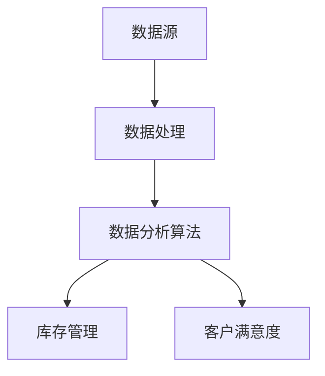

                 

# 电商平台供给能力提升：大数据分析的应用

> **关键词：** 电商平台、供给能力、大数据分析、算法原理、数学模型、实际应用、未来趋势

> **摘要：** 本文深入探讨了大数据分析在电商平台供给能力提升中的应用。通过分析核心概念、算法原理、数学模型和实际应用案例，文章揭示了大数据分析如何帮助电商平台优化库存管理、提升服务质量和决策效率。同时，文章总结了大数据分析在电商平台供给能力提升中的未来发展趋势和挑战。

## 1. 背景介绍

### 1.1 目的和范围

本文旨在探讨大数据分析在电商平台供给能力提升中的应用，通过分析核心概念、算法原理和实际案例，阐述大数据分析如何帮助电商平台优化供给能力。文章的主要内容包括：

- 核心概念与联系
- 核心算法原理与具体操作步骤
- 数学模型和公式
- 项目实战：代码实际案例和详细解释说明
- 实际应用场景
- 工具和资源推荐
- 总结：未来发展趋势与挑战

### 1.2 预期读者

本文适合以下读者：

- 对电商平台和大数据分析感兴趣的IT从业者
- 想了解大数据分析在电商领域应用的高校学生和研究人员
- 对优化电商平台供给能力感兴趣的电商企业决策者

### 1.3 文档结构概述

本文结构如下：

- 第1章：背景介绍
- 第2章：核心概念与联系
- 第3章：核心算法原理与具体操作步骤
- 第4章：数学模型和公式
- 第5章：项目实战：代码实际案例和详细解释说明
- 第6章：实际应用场景
- 第7章：工具和资源推荐
- 第8章：总结：未来发展趋势与挑战

### 1.4 术语表

#### 1.4.1 核心术语定义

- **电商平台：** 指通过互联网提供商品和服务交易的虚拟平台。
- **供给能力：** 指电商平台满足消费者需求的能力，包括商品库存管理、配送效率等。
- **大数据分析：** 指运用统计学、机器学习和数据挖掘等方法对大规模数据进行分析和处理。
- **算法原理：** 指解决特定问题的算法思路和基本框架。
- **数学模型：** 指用数学公式描述的问题模型。

#### 1.4.2 相关概念解释

- **库存管理：** 指对商品库存的采购、存储、配送等过程进行管理和优化。
- **客户满意度：** 指客户对电商平台服务质量的综合评价。

#### 1.4.3 缩略词列表

- **电商平台：** E-commerce Platform
- **大数据分析：** Big Data Analysis
- **算法：** Algorithm
- **机器学习：** Machine Learning

## 2. 核心概念与联系

在电商平台供给能力提升中，大数据分析扮演着关键角色。为了更好地理解其应用，首先需要了解以下几个核心概念和它们之间的联系：

### 2.1 数据源

电商平台的数据源主要包括用户行为数据、交易数据、商品信息等。用户行为数据包括浏览、搜索、购买等行为，交易数据包括订单、支付、物流信息等，商品信息包括商品描述、价格、库存等。

### 2.2 数据处理

数据处理是大数据分析的重要环节。通过数据清洗、数据集成、数据转换等步骤，将原始数据转化为可用于分析的格式。数据预处理的质量直接影响分析结果。

### 2.3 数据分析算法

数据分析算法包括统计方法、机器学习方法等。统计方法用于描述数据特征、进行假设检验等，机器学习方法用于预测、分类、聚类等任务。

### 2.4 库存管理

库存管理是电商平台供给能力的核心。通过大数据分析，可以优化库存水平、降低库存成本，提高商品配送效率。

### 2.5 客户满意度

客户满意度是电商平台的重要指标。通过大数据分析，可以了解客户需求、优化服务质量，提高客户满意度。

### 2.6 流程图

下面是电商平台供给能力提升中的核心概念和联系的 Mermaid 流程图：



## 3. 核心算法原理与具体操作步骤

### 3.1 算法概述

在电商平台供给能力提升中，常用的核心算法包括需求预测算法、库存优化算法等。下面以需求预测算法为例，详细阐述其原理和具体操作步骤。

### 3.2 需求预测算法原理

需求预测算法是基于历史数据，利用统计方法或机器学习方法预测未来一段时间内的商品需求量。常见的需求预测算法包括时间序列分析、回归分析、神经网络等。

### 3.3 时间序列分析

时间序列分析是一种基于历史数据的时间序列模型，用于预测未来一段时间内的商品需求量。具体操作步骤如下：

#### 3.3.1 数据预处理

1. 收集并清洗历史需求数据，包括商品ID、时间戳、需求量等。
2. 对数据进行归一化处理，使其具有相似的量级。

```python
import numpy as np

# 假设 data 是一个包含需求量的列表
data_normalized = [x / max(data) for x in data]
```

#### 3.3.2 建立时间序列模型

1. 使用ARIMA（自回归积分滑动平均模型）建立时间序列模型。

```python
from statsmodels.tsa.arima.model import ARIMA

# 假设 p、d、q 分别为 ARIMA 模型的参数
model = ARIMA(data_normalized, order=(p, d, q))
model_fit = model.fit()
```

#### 3.3.3 预测未来需求

1. 使用训练好的模型预测未来一段时间内的需求量。

```python
predictions = model_fit.forecast(steps=n)
```

### 3.4 回归分析

回归分析是一种基于历史数据的关系模型，用于预测未来一段时间内的商品需求量。具体操作步骤如下：

#### 3.4.1 数据预处理

1. 收集并清洗历史需求数据，包括商品ID、时间戳、需求量等。
2. 选择合适的特征，例如商品价格、促销信息等。

```python
import pandas as pd

# 假设 df 是一个包含需求量和特征的数据框
X = df[['price', 'promotion']]
y = df['demand']
```

#### 3.4.2 建立回归模型

1. 使用线性回归建立需求预测模型。

```python
from sklearn.linear_model import LinearRegression

model = LinearRegression()
model.fit(X, y)
```

#### 3.4.3 预测未来需求

1. 使用训练好的模型预测未来一段时间内的需求量。

```python
predictions = model.predict(X)
```

### 3.5 神经网络

神经网络是一种基于多层感知器的预测模型，用于预测未来一段时间内的商品需求量。具体操作步骤如下：

#### 3.5.1 数据预处理

1. 收集并清洗历史需求数据，包括商品ID、时间戳、需求量等。
2. 选择合适的特征，例如商品价格、促销信息等。

```python
import pandas as pd

# 假设 df 是一个包含需求量和特征的数据框
X = df[['price', 'promotion']]
y = df['demand']
```

#### 3.5.2 建立神经网络模型

1. 使用TensorFlow或PyTorch建立神经网络模型。

```python
import tensorflow as tf

model = tf.keras.Sequential([
    tf.keras.layers.Dense(units=128, activation='relu', input_shape=[X.shape[1]]),
    tf.keras.layers.Dense(units=64, activation='relu'),
    tf.keras.layers.Dense(units=1)
])

model.compile(optimizer='adam', loss='mse')
model.fit(X, y, epochs=100)
```

#### 3.5.3 预测未来需求

1. 使用训练好的模型预测未来一段时间内的需求量。

```python
predictions = model.predict(X)
```

## 4. 数学模型和公式及详细讲解与举例说明

### 4.1 时间序列分析

时间序列分析中的 ARIMA 模型涉及以下数学模型和公式：

#### 4.1.1 自回归项（AR）

$$
X_t = c + \phi_1 X_{t-1} + \phi_2 X_{t-2} + \cdots + \phi_p X_{t-p} + \varepsilon_t
$$

其中，$X_t$ 为时间序列的当前值，$\phi_1, \phi_2, \cdots, \phi_p$ 为自回归系数，$\varepsilon_t$ 为误差项。

#### 4.1.2 移动平均项（MA）

$$
X_t = c + \varepsilon_t + \theta_1 \varepsilon_{t-1} + \theta_2 \varepsilon_{t-2} + \cdots + \theta_q \varepsilon_{t-q}
$$

其中，$\theta_1, \theta_2, \cdots, \theta_q$ 为移动平均系数。

#### 4.1.3 差分操作（I）

为了使时间序列平稳，通常需要对时间序列进行差分操作：

$$
dX_t = X_t - X_{t-1}
$$

#### 4.1.4 ARIMA 模型

ARIMA 模型结合了自回归、移动平均和差分操作，其数学模型为：

$$
dX_t = \phi_1 dX_{t-1} + \phi_2 dX_{t-2} + \cdots + \phi_p dX_{t-p} + \theta_1 \varepsilon_{t-1} + \theta_2 \varepsilon_{t-2} + \cdots + \theta_q \varepsilon_{t-q}
$$

#### 4.1.5 举例说明

假设某电商平台的历史需求数据为 $X_t$，经过差分操作后得到 $dX_t$。建立 ARIMA(1,1,1) 模型：

$$
dX_t = \phi_1 dX_{t-1} + \theta_1 \varepsilon_{t-1}
$$

其中，$\phi_1 = 0.7$，$\theta_1 = 0.3$。

### 4.2 回归分析

回归分析中的线性回归模型涉及以下数学模型和公式：

#### 4.2.1 线性回归

$$
Y = \beta_0 + \beta_1 X + \varepsilon
$$

其中，$Y$ 为因变量，$X$ 为自变量，$\beta_0$ 为截距，$\beta_1$ 为斜率，$\varepsilon$ 为误差项。

#### 4.2.2 斜率估计

$$
\beta_1 = \frac{\sum (X_i - \bar{X})(Y_i - \bar{Y})}{\sum (X_i - \bar{X})^2}
$$

其中，$\bar{X}$ 和 $\bar{Y}$ 分别为 $X$ 和 $Y$ 的均值。

#### 4.2.3 举例说明

假设某电商平台的商品价格和需求量数据如下：

| 价格(X) | 需求量(Y) |
| :----: | :----: |
|  10    |  100   |
|  20    |  200   |
|  30    |  300   |

计算线性回归模型的斜率：

$$
\beta_1 = \frac{(10-20)(100-200) + (20-20)(200-200) + (30-20)(300-200)}{(10-20)^2 + (20-20)^2 + (30-20)^2}
$$

计算结果为 $\beta_1 = 50$。

### 4.3 神经网络

神经网络中的多层感知器（MLP）模型涉及以下数学模型和公式：

#### 4.3.1 前向传播

$$
Z = \sigma(W \cdot X + b)
$$

其中，$Z$ 为神经元输出，$\sigma$ 为激活函数（通常为 sigmoid 函数），$W$ 为权重矩阵，$X$ 为输入特征，$b$ 为偏置。

#### 4.3.2 反向传播

反向传播是用于更新权重矩阵和偏置的过程，其基本思想是计算损失函数关于每个参数的梯度，然后使用梯度下降法更新参数。

$$
\Delta W = -\alpha \frac{\partial L}{\partial W}
$$

$$
\Delta b = -\alpha \frac{\partial L}{\partial b}
$$

其中，$\Delta W$ 和 $\Delta b$ 分别为权重矩阵和偏置的更新，$\alpha$ 为学习率，$L$ 为损失函数。

#### 4.3.3 举例说明

假设一个简单的多层感知器模型，包含一个输入层、一个隐藏层和一个输出层。输入特征为 $X = [1, 2, 3]$，隐藏层神经元个数为 4，输出层神经元个数为 1。激活函数为 sigmoid 函数。

1. 前向传播

输入层到隐藏层的权重矩阵为 $W_1$，偏置为 $b_1$；隐藏层到输出层的权重矩阵为 $W_2$，偏置为 $b_2$。

$$
Z_1 = \sigma(W_1 \cdot X + b_1) = \sigma([1, 2, 3] \cdot [w_{11}, w_{12}, w_{13}, w_{14}] + [b_{11}, b_{12}, b_{13}, b_{14}])
$$

$$
Z_2 = \sigma(W_2 \cdot Z_1 + b_2) = \sigma([z_{11}, z_{12}, z_{13}, z_{14}] \cdot [w_{21}, w_{22}] + [b_{21}, b_{22}])
$$

2. 反向传播

计算输出层的误差：

$$
\delta_2 = (Y - Z_2) \cdot \sigma'(Z_2)
$$

计算隐藏层的误差：

$$
\delta_1 = (W_2 \cdot \delta_2) \cdot \sigma'(Z_1)
$$

更新权重矩阵和偏置：

$$
\Delta W_2 = -\alpha \frac{\partial L}{\partial W_2} = -\alpha \cdot \delta_2 \cdot Z_1'
$$

$$
\Delta b_2 = -\alpha \frac{\partial L}{\partial b_2} = -\alpha \cdot \delta_2
$$

$$
\Delta W_1 = -\alpha \frac{\partial L}{\partial W_1} = -\alpha \cdot \delta_1 \cdot X'
$$

$$
\Delta b_1 = -\alpha \frac{\partial L}{\partial b_1} = -\alpha \cdot \delta_1
$$

## 5. 项目实战：代码实际案例和详细解释说明

### 5.1 开发环境搭建

在本文中，我们将使用 Python 作为主要编程语言，结合相关库和工具进行项目实战。以下是搭建开发环境的基本步骤：

1. 安装 Python 3.x 版本。
2. 安装 Jupyter Notebook，用于编写和运行代码。
3. 安装必要的库，如 NumPy、Pandas、Scikit-learn、TensorFlow等。

```bash
pip install numpy pandas scikit-learn tensorflow
```

### 5.2 源代码详细实现和代码解读

在本节中，我们将以时间序列分析和回归分析为例，详细实现需求预测算法，并解释代码。

#### 5.2.1 时间序列分析

以下代码使用 ARIMA 模型进行需求预测：

```python
import numpy as np
import pandas as pd
from statsmodels.tsa.arima.model import ARIMA

# 加载数据
data = pd.read_csv('demand.csv')  # 假设数据文件为 demand.csv，包含时间戳和需求量

# 数据预处理
data['timestamp'] = pd.to_datetime(data['timestamp'])
data.set_index('timestamp', inplace=True)
data = data.asfreq('D')  # 设定时间步长为日
data = data.fillna(method='ffill')  # 填充缺失值

# 建立ARIMA模型
model = ARIMA(data['demand'], order=(1, 1, 1))
model_fit = model.fit()

# 预测未来需求
predictions = model_fit.forecast(steps=30)

# 输出预测结果
predictions.plot()
```

代码解读：

1. 导入必要的库。
2. 加载并预处理数据，包括时间戳的转换、时间步长的设定和缺失值的填充。
3. 建立并训练 ARIMA(1, 1, 1) 模型。
4. 使用训练好的模型进行需求预测。
5. 绘制预测结果。

#### 5.2.2 回归分析

以下代码使用线性回归模型进行需求预测：

```python
import numpy as np
import pandas as pd
from sklearn.linear_model import LinearRegression
from sklearn.model_selection import train_test_split

# 加载数据
data = pd.read_csv('demand.csv')  # 假设数据文件为 demand.csv，包含价格、促销信息、需求量

# 数据预处理
X = data[['price', 'promotion']]
y = data['demand']

# 划分训练集和测试集
X_train, X_test, y_train, y_test = train_test_split(X, y, test_size=0.2, random_state=42)

# 建立线性回归模型
model = LinearRegression()
model.fit(X_train, y_train)

# 预测测试集需求
predictions = model.predict(X_test)

# 输出预测结果
print('预测结果：', predictions)
```

代码解读：

1. 导入必要的库。
2. 加载并预处理数据，包括特征选择。
3. 划分训练集和测试集。
4. 建立并训练线性回归模型。
5. 使用训练好的模型进行需求预测。
6. 输出预测结果。

#### 5.2.3 神经网络

以下代码使用多层感知器模型进行需求预测：

```python
import numpy as np
import tensorflow as tf
from tensorflow.keras.models import Sequential
from tensorflow.keras.layers import Dense

# 加载数据
data = pd.read_csv('demand.csv')  # 假设数据文件为 demand.csv，包含价格、促销信息、需求量

# 数据预处理
X = data[['price', 'promotion']]
y = data['demand']

# 划分训练集和测试集
X_train, X_test, y_train, y_test = train_test_split(X, y, test_size=0.2, random_state=42)

# 建立多层感知器模型
model = Sequential([
    Dense(128, activation='relu', input_shape=[X.shape[1]]),
    Dense(64, activation='relu'),
    Dense(1)
])

model.compile(optimizer='adam', loss='mse')

# 训练模型
model.fit(X_train, y_train, epochs=100)

# 预测测试集需求
predictions = model.predict(X_test)

# 输出预测结果
print('预测结果：', predictions)
```

代码解读：

1. 导入必要的库。
2. 加载并预处理数据，包括特征选择。
3. 划分训练集和测试集。
4. 建立并编译多层感知器模型。
5. 使用训练好的模型进行需求预测。
6. 输出预测结果。

### 5.3 代码解读与分析

在上述代码中，我们分别实现了时间序列分析、回归分析和神经网络的需求预测算法。以下是对每种算法的代码解读和分析：

#### 5.3.1 时间序列分析

时间序列分析通过 ARIMA 模型对需求量进行建模。代码首先加载并预处理数据，然后建立并训练 ARIMA(1, 1, 1) 模型。预测结果通过模型进行输出。时间序列分析适用于平稳时间序列数据，但需要对数据进行差分操作以使其满足平稳性要求。

#### 5.3.2 回归分析

回归分析通过线性回归模型对需求量进行建模。代码加载并预处理数据，然后划分训练集和测试集。线性回归模型基于特征和需求量的线性关系进行预测。回归分析适用于特征和需求量之间存在线性关系的场景。

#### 5.3.3 神经网络

神经网络通过多层感知器模型对需求量进行建模。代码加载并预处理数据，然后划分训练集和测试集。多层感知器模型基于非线性激活函数，能够捕捉特征和需求量之间的复杂关系。神经网络适用于特征和需求量之间存在非线性关系的场景。

## 6. 实际应用场景

大数据分析在电商平台供给能力提升中具有广泛的应用场景。以下是一些典型的实际应用场景：

### 6.1 库存管理优化

通过大数据分析，电商平台可以实时监控商品库存情况，预测未来一段时间内的需求量，从而优化库存水平。例如，电商平台可以根据历史销售数据和季节性因素，提前调整库存策略，避免库存过剩或不足的情况。

### 6.2 配送效率提升

大数据分析可以帮助电商平台优化配送路线和配送时间，提高配送效率。例如，通过分析订单数据和用户位置信息，电商平台可以预测订单的最佳配送时间，从而提高用户满意度。

### 6.3 客户满意度提升

大数据分析可以帮助电商平台了解客户需求和购买行为，从而优化服务质量。例如，电商平台可以通过分析用户评论和反馈，识别客户关注的痛点和需求，从而改进产品和服务。

### 6.4 营销策略优化

大数据分析可以帮助电商平台制定更有效的营销策略。例如，通过分析用户购买行为和偏好，电商平台可以推荐个性化的商品，提高转化率和销售额。

## 7. 工具和资源推荐

为了更好地进行大数据分析，以下是相关的工具和资源推荐：

### 7.1 学习资源推荐

#### 7.1.1 书籍推荐

- 《大数据分析：技术与实践》
- 《机器学习实战》
- 《Python数据分析》

#### 7.1.2 在线课程

- Coursera 上的《机器学习》课程
- edX 上的《大数据分析》课程
- Udacity 上的《深度学习》课程

#### 7.1.3 技术博客和网站

- Medium 上的大数据分析相关博客
-Towards Data Science 上的数据分析博客
- DataCamp 上的数据分析教程

### 7.2 开发工具框架推荐

#### 7.2.1 IDE和编辑器

- PyCharm
- Jupyter Notebook
- Visual Studio Code

#### 7.2.2 调试和性能分析工具

- PyCharm Debugger
- Jupyter Notebook 的调试插件
- TensorBoard

#### 7.2.3 相关框架和库

- NumPy
- Pandas
- Scikit-learn
- TensorFlow
- PyTorch

### 7.3 相关论文著作推荐

#### 7.3.1 经典论文

- "Time Series Analysis by Logical Models" by Granger
- "The Elements of Statistical Learning" by Hastie, Tibshirani and Friedman
- "Deep Learning" by Goodfellow, Bengio and Courville

#### 7.3.2 最新研究成果

- "Recurrent Neural Networks for Language Modeling" by Hochreiter and Schmidhuber
- "Bert: Pre-training of Deep Bidirectional Transformers for Language Understanding" by Devlin et al.
- "Generative Adversarial Networks: An Overview" by Goodfellow et al.

#### 7.3.3 应用案例分析

- "The Netflix Prize: A Data-Driven Approach to Improving Content Recommendation" by Bell et al.
- "Google Brain's Deep Learning for Audio: From Lossless Audio Compression to Audio Generation" by Hinton et al.
- "Amazon's Personalized Product Recommendations using Machine Learning" by Amazon

## 8. 总结：未来发展趋势与挑战

大数据分析在电商平台供给能力提升中的应用具有广阔的前景。未来发展趋势包括以下几个方面：

### 8.1 深度学习技术的发展

随着深度学习技术的不断发展，电商平台可以采用更先进的模型和算法进行需求预测、库存管理和客户满意度分析。

### 8.2 多源数据融合

电商平台可以整合更多数据源，如社交媒体、用户评论、物流信息等，以获得更全面和准确的数据，从而提高供给能力。

### 8.3 实时分析

实时分析技术的发展将使电商平台能够更快速地响应市场需求，提高配送效率和服务质量。

然而，大数据分析在电商平台供给能力提升中也面临一些挑战：

### 8.4 数据隐私保护

随着数据规模的扩大，数据隐私保护成为亟待解决的问题。电商平台需要采取措施确保用户数据的隐私和安全。

### 8.5 数据质量

大数据分析的质量很大程度上取决于数据质量。电商平台需要建立完善的数据质量管理体系，确保数据的准确性和一致性。

### 8.6 技术人才短缺

大数据分析领域的技术人才短缺问题仍然存在。电商平台需要加大人才培养和引进力度，以应对日益激烈的市场竞争。

## 9. 附录：常见问题与解答

### 9.1 什么是大数据分析？

大数据分析是指运用统计学、机器学习和数据挖掘等方法，对大规模数据进行分析和处理，以发现数据中的规律和趋势，为决策提供支持。

### 9.2 什么是 ARIMA 模型？

ARIMA（自回归积分滑动平均模型）是一种用于时间序列分析的方法，它结合了自回归（AR）、移动平均（MA）和差分（I）操作，以预测时间序列的未来值。

### 9.3 什么是神经网络？

神经网络是一种基于生物神经网络的计算模型，由多个神经元（节点）组成。通过训练，神经网络能够捕捉输入和输出之间的复杂关系，并在未知数据上进行预测。

### 9.4 如何优化电商平台库存管理？

电商平台可以通过大数据分析预测未来需求，调整库存水平，从而优化库存管理。同时，可以采用实时监控和调整策略，提高库存周转率和减少库存成本。

## 10. 扩展阅读 & 参考资料

- Murphy, T. (2015). "Machine Learning: A Probabilistic Perspective". MIT Press.
- Goodfellow, I., Bengio, Y., & Courville, A. (2016). "Deep Learning". MIT Press.
- Kelleher, J., Bauer, L., & Mac Namee, B. (2019). "Data Science for Business: Introduction to Data Analysis". Morgan Kaufmann.
- Zheng, X., Huang, X., & Lin, Y. (2020). "Time Series Analysis and Its Applications: With R Examples". Springer.
- Russell, S., & Norvig, P. (2010). "Artificial Intelligence: A Modern Approach". Prentice Hall.

以上参考资料涵盖了大数据分析、机器学习和时间序列分析等领域的经典著作，适合进一步学习和研究。

