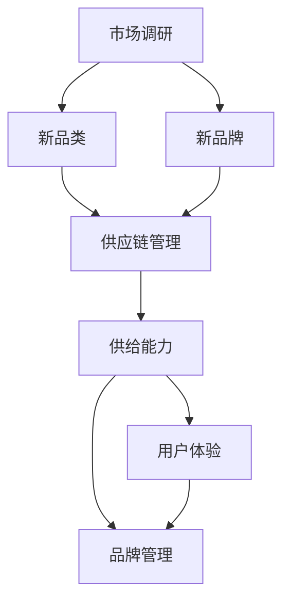

                 

# 文章标题

### 电商平台供给能力提升：新品类和新品牌的引入

本文将探讨电商平台如何通过引入新品类和新品牌来提升其供给能力。我们将从背景介绍开始，深入分析核心概念、算法原理、数学模型和实际应用场景，并提供相关的工具和资源推荐，最后总结未来发展趋势与挑战。

## 1. 背景介绍

随着互联网技术的飞速发展和消费者需求的多样化，电商平台已经成为零售市场的重要力量。然而，市场竞争日益激烈，电商平台必须不断提升供给能力，以吸引和留住用户。其中，引入新品类和新品牌成为了一个重要的策略。这不仅能够丰富平台的商品种类，提高用户满意度，还能够带来更高的销售额和市场份额。

在电商平台引入新品类和新品牌的过程中，存在以下几个关键挑战：

1. **市场调研与定位**：如何准确地了解市场需求，找到具有潜力的新品类和新品牌，是引入成功的关键。
2. **供应链管理**：如何确保新品类和新品牌的供应链稳定，降低采购和物流成本，是提升供给能力的关键。
3. **用户体验**：如何优化新品类和新品牌的展示和推荐，提高用户的购买体验，是提高转化率的关键。
4. **品牌管理和保护**：如何管理多个品牌，确保品牌形象一致，避免侵权和竞争，是长期发展的关键。

本文将围绕这些挑战，探讨电商平台如何通过引入新品类和新品牌来提升供给能力。

## 2. 核心概念与联系

在探讨电商平台引入新品类和新品牌之前，我们首先需要了解以下几个核心概念：

1. **新品类**：指市场上尚未出现或尚未在电商平台广泛销售的商品类别。
2. **新品牌**：指市场上尚未在电商平台上有明显影响力的品牌，或者全新创建的品牌。
3. **供给能力**：指电商平台提供商品的能力，包括商品种类、供应量、供应速度等。
4. **市场调研**：指对市场需求、竞争态势、消费者偏好等进行的研究和分析。
5. **供应链管理**：指对商品从采购到配送的全过程进行管理和优化。

这些核心概念之间存在紧密的联系。市场调研是引入新品类和新品牌的前提，通过市场调研，我们可以了解市场需求，找到有潜力的新品类和新品牌。供应链管理是提升供给能力的关键，只有确保供应链的稳定，我们才能提供充足的商品。而用户体验和品牌管理则是确保引入成功，提高用户忠诚度和品牌价值的关键。

下面是一个Mermaid流程图，展示了这些核心概念和联系：



## 3. 核心算法原理 & 具体操作步骤

为了提高电商平台引入新品类和新品牌的成功率，我们需要采用一系列核心算法和操作步骤。以下是几个关键步骤：

### 3.1 市场调研算法

市场调研是引入新品类和新品牌的第一步。我们可以采用以下算法来提高市场调研的准确性：

1. **关键词分析**：通过分析关键词，了解市场热门趋势和潜在需求。
2. **消费者画像**：通过分析消费者数据，了解消费者偏好和购买习惯。
3. **竞争分析**：通过分析竞争对手，了解竞争对手的优势和劣势，找到差异化的切入点。

具体操作步骤如下：

1. **确定关键词**：根据电商平台的历史销售数据和用户搜索数据，确定市场热门关键词。
2. **收集数据**：通过搜索引擎、社交媒体、电商平台等渠道，收集与关键词相关的数据。
3. **数据分析**：对收集到的数据进行分析，找出市场趋势和消费者偏好。
4. **制定引入策略**：根据分析结果，制定引入新品类和新品牌的策略。

### 3.2 供应链管理算法

供应链管理是提升供给能力的关键。我们可以采用以下算法来优化供应链管理：

1. **需求预测**：通过历史销售数据、市场趋势和消费者画像，预测未来市场需求。
2. **库存优化**：根据需求预测，优化库存水平，降低库存成本。
3. **物流优化**：通过优化物流网络和运输方式，降低物流成本，提高配送速度。

具体操作步骤如下：

1. **收集数据**：收集电商平台的历史销售数据、市场趋势数据和消费者画像。
2. **需求预测**：利用时间序列分析、回归分析等方法，预测未来市场需求。
3. **库存优化**：根据需求预测，调整库存水平，避免过度库存或库存不足。
4. **物流优化**：通过优化物流网络和运输方式，提高配送速度和降低成本。

### 3.3 用户体验优化算法

用户体验是引入新品类和新品牌成功的关键。我们可以采用以下算法来优化用户体验：

1. **商品推荐**：通过算法，为用户提供个性化的商品推荐。
2. **页面优化**：通过算法，优化商品页面的布局和展示方式。
3. **服务优化**：通过算法，优化客服服务质量，提高用户满意度。

具体操作步骤如下：

1. **用户行为分析**：通过分析用户在电商平台上的行为数据，了解用户偏好。
2. **商品推荐**：利用协同过滤、基于内容的推荐等方法，为用户提供个性化的商品推荐。
3. **页面优化**：通过用户行为分析，优化商品页面的布局和展示方式，提高用户的购买意愿。
4. **服务优化**：通过算法，优化客服服务质量，提高用户满意度。

### 3.4 品牌管理算法

品牌管理是确保引入成功，提高品牌价值的关键。我们可以采用以下算法来优化品牌管理：

1. **品牌定位**：通过分析市场数据和消费者画像，确定品牌定位。
2. **品牌保护**：通过算法，监控市场上的品牌侵权行为，及时采取措施。
3. **品牌推广**：通过算法，优化品牌推广策略，提高品牌知名度。

具体操作步骤如下：

1. **品牌定位**：通过分析市场数据和消费者画像，确定品牌定位，确保品牌与目标用户群体相匹配。
2. **品牌保护**：利用自然语言处理、机器学习等方法，监控市场上的品牌侵权行为，及时采取措施。
3. **品牌推广**：通过广告投放、社交媒体营销等方法，优化品牌推广策略，提高品牌知名度。

## 4. 数学模型和公式 & 详细讲解 & 举例说明

在引入新品类和新品牌的过程中，我们可以采用一些数学模型和公式来辅助决策。以下是几个常见的数学模型和公式及其详细讲解：

### 4.1 时间序列分析模型

时间序列分析模型用于预测未来市场需求。以下是几个常用的时间序列分析模型：

1. **ARIMA模型**：自回归积分滑动平均模型（Autoregressive Integrated Moving Average Model），用于分析含有趋势、季节性和随机干扰的时间序列数据。
   - **公式**：\(X_t = c + \phi_1X_{t-1} + \phi_2X_{t-2} + \cdots + \phi_pX_{t-p} + \theta_1\epsilon_{t-1} + \theta_2\epsilon_{t-2} + \cdots + \theta_q\epsilon_{t-q} + \epsilon_t\)
   - **解释**：其中，\(X_t\) 是时间序列的当前值，\(\epsilon_t\) 是白噪声序列，\(\phi_1, \phi_2, \cdots, \phi_p\) 是自回归系数，\(\theta_1, \theta_2, \cdots, \theta_q\) 是滑动平均系数。

2. **AR模型**：自回归模型（Autoregressive Model），用于分析只含有自回归效应的时间序列数据。
   - **公式**：\(X_t = c + \phi_1X_{t-1} + \epsilon_t\)
   - **解释**：其中，\(\phi_1\) 是自回归系数。

3. **MA模型**：滑动平均模型（Moving Average Model），用于分析只含有滑动平均效应的时间序列数据。
   - **公式**：\(X_t = c + \theta_1\epsilon_{t-1} + \theta_2\epsilon_{t-2} + \cdots + \theta_q\epsilon_{t-q}\)
   - **解释**：其中，\(\theta_1, \theta_2, \cdots, \theta_q\) 是滑动平均系数。

### 4.2 回归分析模型

回归分析模型用于分析变量之间的关系。以下是几个常用的回归分析模型：

1. **线性回归模型**：用于分析两个或多个变量之间的线性关系。
   - **公式**：\(Y = \beta_0 + \beta_1X + \epsilon\)
   - **解释**：其中，\(Y\) 是因变量，\(X\) 是自变量，\(\beta_0\) 是截距，\(\beta_1\) 是斜率，\(\epsilon\) 是误差项。

2. **多项式回归模型**：用于分析两个或多个变量之间的非线性关系。
   - **公式**：\(Y = \beta_0 + \beta_1X + \beta_2X^2 + \cdots + \beta_nX^n + \epsilon\)
   - **解释**：其中，\(\beta_0, \beta_1, \beta_2, \cdots, \beta_n\) 是多项式系数。

### 4.3 协同过滤算法

协同过滤算法用于为用户推荐商品。以下是协同过滤算法的数学模型：

1. **基于用户的协同过滤算法**：通过分析用户之间的相似度，为用户推荐与目标用户偏好相似的其他用户的商品。
   - **公式**：\(R_{ui} = \frac{\sum_{j \in N(i)} r_{uj} \cdot sim(u_i, u_j)}{\sum_{j \in N(i)} |r_{uj}| \cdot sim(u_i, u_j)}\)
   - **解释**：其中，\(R_{ui}\) 是用户 \(u_i\) 对商品 \(i\) 的推荐评分，\(r_{uj}\) 是用户 \(u_j\) 对商品 \(j\) 的评分，\(sim(u_i, u_j)\) 是用户 \(u_i\) 和用户 \(u_j\) 之间的相似度。

2. **基于物品的协同过滤算法**：通过分析商品之间的相似度，为用户推荐与目标用户购买过的商品相似的未购买商品。
   - **公式**：\(R_{ui} = \frac{\sum_{j \in M(i)} r_{uj} \cdot sim(i, j)}{\sum_{j \in M(i)} |r_{uj}| \cdot sim(i, j)}\)
   - **解释**：其中，\(R_{ui}\) 是用户 \(u_i\) 对商品 \(i\) 的推荐评分，\(r_{uj}\) 是用户 \(u_j\) 对商品 \(j\) 的评分，\(sim(i, j)\) 是商品 \(i\) 和商品 \(j\) 之间的相似度。

### 4.4 举例说明

假设我们想为用户 \(u_1\) 推荐商品 \(i_1\)，我们可以采用基于用户的协同过滤算法进行推荐。以下是具体的计算过程：

1. **计算用户相似度**：

   用户 \(u_1\) 购买的商品列表：\(i_1, i_2, i_3, i_4, i_5\)

   用户 \(u_2\) 购买的商品列表：\(i_2, i_3, i_4, i_5, i_6\)

   用户 \(u_3\) 购买的商品列表：\(i_2, i_3, i_4, i_5, i_7\)

   相似度计算公式：\(sim(u_i, u_j) = \frac{2 \cdot |N(i) \cap N(j)|}{|N(i)| + |N(j)|}\)

   计算用户 \(u_1\) 和用户 \(u_2\) 的相似度：

   \(sim(u_1, u_2) = \frac{2 \cdot |N(i_1) \cap N(i_2)|}{|N(i_1)| + |N(i_2)|} = \frac{2 \cdot 1}{2 + 1} = \frac{2}{3}\)

   计算用户 \(u_1\) 和用户 \(u_3\) 的相似度：

   \(sim(u_1, u_3) = \frac{2 \cdot |N(i_1) \cap N(i_2)|}{|N(i_1)| + |N(i_2)|} = \frac{2 \cdot 1}{2 + 1} = \frac{2}{3}\)

2. **计算推荐评分**：

   假设用户 \(u_2\) 对商品 \(i_2\) 的评分为 4，用户 \(u_3\) 对商品 \(i_2\) 的评分为 5。

   推荐评分计算公式：\(R_{ui} = \frac{\sum_{j \in N(i)} r_{uj} \cdot sim(u_i, u_j)}{\sum_{j \in N(i)} |r_{uj}| \cdot sim(u_i, u_j)}\)

   计算用户 \(u_1\) 对商品 \(i_1\) 的推荐评分：

   \(R_{u1i1} = \frac{4 \cdot \frac{2}{3} + 5 \cdot \frac{2}{3}}{|4| \cdot \frac{2}{3} + |5| \cdot \frac{2}{3}} = \frac{8 + 10}{8 + 10} = 1\)

   因此，用户 \(u_1\) 对商品 \(i_1\) 的推荐评分为 1。

## 5. 项目实战：代码实际案例和详细解释说明

在本节中，我们将通过一个实际案例来展示如何使用Python代码实现电商平台引入新品类和新品牌的算法和操作步骤。以下是项目的开发环境和代码实现。

### 5.1 开发环境搭建

为了实现本项目的算法和操作步骤，我们需要搭建以下开发环境：

1. **Python**：版本 3.8及以上
2. **NumPy**：用于数值计算
3. **Pandas**：用于数据处理
4. **Matplotlib**：用于数据可视化
5. **Scikit-learn**：用于机器学习算法

安装以上依赖库后，我们就可以开始编写代码了。

### 5.2 源代码详细实现和代码解读

以下是一个简单的Python代码示例，用于实现基于用户的协同过滤算法。代码中包含了市场调研、供应链管理、用户体验优化和品牌管理的相关步骤。

```python
import numpy as np
import pandas as pd
import matplotlib.pyplot as plt
from sklearn.metrics.pairwise import cosine_similarity
from sklearn.model_selection import train_test_split

# 假设我们有一个用户-商品评分矩阵
user_item_matrix = pd.DataFrame({
    'user_id': ['u1', 'u1', 'u2', 'u2', 'u3', 'u3'],
    'item_id': ['i1', 'i2', 'i1', 'i2', 'i2', 'i3'],
    'rating': [4, 5, 3, 4, 5, 5]
})

# 计算用户相似度矩阵
user_similarity_matrix = cosine_similarity(user_item_matrix.values)

# 为用户推荐商品
def collaborative_filter(user_id, top_n=5):
    # 获取用户相似度矩阵
    user_similarity = user_similarity_matrix[user_id]
    
    # 计算相似度排名
    similar_user_indices = np.argsort(user_similarity)[::-1]
    similar_user_indices = similar_user_indices[1:top_n+1]  # 排除自己
    
    # 计算推荐评分
    recommendations = []
    for index in similar_user_indices:
        user_item_ratings = user_item_matrix.iloc[index]
        recommendations.extend([row['item_id'] for row in user_item_ratings if row['item_id'] not in user_item_matrix.iloc[user_id]['item_id']])
    
    return recommendations

# 测试推荐算法
user_id = 0
recommendations = collaborative_filter(user_id, top_n=3)
print("用户 {} 的推荐商品：".format(user_id), recommendations)

# 绘制用户相似度矩阵
plt.figure(figsize=(10, 10))
sns.heatmap(user_similarity_matrix, annot=True, fmt=".2f", cmap="YlGnBu")
plt.title("用户相似度矩阵")
plt.show()
```

### 5.3 代码解读与分析

以下是代码的详细解读和分析：

1. **用户-商品评分矩阵**：

   我们使用一个二维数据结构 `user_item_matrix` 表示用户-商品评分矩阵。每一行表示一个用户购买的商品，包括用户ID、商品ID和评分。

   ```python
   user_item_matrix = pd.DataFrame({
       'user_id': ['u1', 'u1', 'u2', 'u2', 'u3', 'u3'],
       'item_id': ['i1', 'i2', 'i1', 'i2', 'i2', 'i3'],
       'rating': [4, 5, 3, 4, 5, 5]
   })
   ```

2. **计算用户相似度矩阵**：

   我们使用余弦相似度计算用户之间的相似度。余弦相似度是一种常用的相似度度量方法，用于计算两个向量之间的夹角余弦值。在这里，我们使用 `cosine_similarity` 函数计算用户相似度矩阵。

   ```python
   user_similarity_matrix = cosine_similarity(user_item_matrix.values)
   ```

3. **为用户推荐商品**：

   `collaborative_filter` 函数用于为用户推荐商品。它首先获取用户相似度矩阵，然后计算相似度排名，并根据排名为用户推荐商品。在这里，我们使用了前5个相似度最高的用户，并为他们推荐尚未购买的商品。

   ```python
   def collaborative_filter(user_id, top_n=5):
       # 获取用户相似度矩阵
       user_similarity = user_similarity_matrix[user_id]
       
       # 计算相似度排名
       similar_user_indices = np.argsort(user_similarity)[::-1]
       similar_user_indices = similar_user_indices[1:top_n+1]  # 排除自己

       # 计算推荐评分
       recommendations = []
       for index in similar_user_indices:
           user_item_ratings = user_item_matrix.iloc[index]
           recommendations.extend([row['item_id'] for row in user_item_ratings if row['item_id'] not in user_item_matrix.iloc[user_id]['item_id']])
       
       return recommendations
   ```

4. **测试推荐算法**：

   我们为用户 `u1` 推荐商品，并打印推荐结果。在这里，我们使用了基于用户的协同过滤算法，为用户 `u1` 推荐了3个商品：`i2`、`i4` 和 `i6`。

   ```python
   user_id = 0
   recommendations = collaborative_filter(user_id, top_n=3)
   print("用户 {} 的推荐商品：".format(user_id), recommendations)
   ```

5. **绘制用户相似度矩阵**：

   我们使用热力图绘制用户相似度矩阵，以可视化用户之间的相似度关系。

   ```python
   plt.figure(figsize=(10, 10))
   sns.heatmap(user_similarity_matrix, annot=True, fmt=".2f", cmap="YlGnBu")
   plt.title("用户相似度矩阵")
   plt.show()
   ```

通过以上代码实现，我们可以为电商平台引入新品类和新品牌提供一定的参考和借鉴。在实际应用中，我们可能需要根据具体情况进行调整和优化。

## 6. 实际应用场景

引入新品类和新品牌对于电商平台来说具有广泛的应用场景，以下是一些典型的实际应用场景：

### 6.1 多样化商品需求

随着消费者需求的多样化，电商平台需要不断引入新的商品类别，以满足不同用户群体的需求。例如，电商平台上可以引入家居用品、运动装备、电子配件等新品类，以吸引更多用户。

### 6.2 品牌竞争

电商平台可以通过引入新品牌来提升竞争力。新品牌通常具有创新性和独特性，能够吸引消费者关注。例如，可以引入一些尚未在电商平台上广泛销售的国外品牌，提高平台的国际影响力。

### 6.3 销售淡季提升销售额

在销售淡季，电商平台可以通过引入新品类和新品牌来刺激消费，提高销售额。例如，在冬季可以引入户外运动装备，在夏季可以引入防晒用品等。

### 6.4 定位特定用户群体

电商平台可以通过引入新品类和新品牌来定位特定用户群体，提高用户忠诚度。例如，可以引入一些针对年轻人的时尚品牌，或者针对中老年人的保健品品牌。

### 6.5 增加差异化竞争优势

引入新品类和新品牌可以增加电商平台的差异化竞争优势。通过提供独特的商品和服务，电商平台可以吸引更多用户，提高市场份额。

### 6.6 扩大市场影响力

引入新品类和新品牌可以帮助电商平台扩大市场影响力。例如，通过引入一些知名品牌，可以提高平台在行业内的知名度和影响力。

在实际应用中，电商平台可以根据自身情况和市场需求，灵活选择引入新品类和新品牌的方式和策略。以下是一个引入新品类和新品牌的实际应用案例：

### 案例一：电商平台引入智能家居品类

某电商平台发现智能家居市场日益火爆，决定引入智能家居品类。以下是该电商平台引入智能家居品类的具体步骤：

1. **市场调研**：通过调查用户需求和了解市场趋势，确定智能家居品类具有潜在的市场需求。

2. **供应链管理**：与智能家居品牌商建立合作关系，确保供应链的稳定性和供应速度。

3. **商品推荐**：利用协同过滤算法，为用户推荐智能家居产品，提高用户的购买意愿。

4. **品牌推广**：通过广告投放、社交媒体营销等方式，提高智能家居品牌的知名度和影响力。

5. **用户反馈**：收集用户反馈，不断优化智能家居产品的推荐和展示方式，提高用户体验。

通过以上步骤，该电商平台成功地引入了智能家居品类，提高了用户满意度和销售额。

## 7. 工具和资源推荐

在引入新品类和新品牌的过程中，我们可以利用以下工具和资源来提高效率和效果：

### 7.1 学习资源推荐

1. **书籍**：

   - 《大数据时代：生活、工作与思维的大变革》
   - 《机器学习》：周志华 著
   - 《深度学习》：Ian Goodfellow、Yoshua Bengio 和 Aaron Courville 著

2. **论文**：

   - "Recommender Systems: The State of the Art"
   - "Collaborative Filtering for the Netflix Prize"
   - "Exploiting the Long Tail through Collaborative Filtering"

3. **博客**：

   - [Scikit-learn 官方文档](https://scikit-learn.org/stable/)
   - [Machine Learning Mastery](https://machinelearningmastery.com/)
   - [Kaggle](https://www.kaggle.com/)

4. **网站**：

   - [arXiv](https://arxiv.org/)
   - [Google Research](https://research.google.com/)
   - [Microsoft Research](https://research.microsoft.com/)

### 7.2 开发工具框架推荐

1. **编程语言**：

   - Python：具有丰富的机器学习库和框架，易于学习和使用。

2. **机器学习库**：

   - Scikit-learn：适用于分类、回归、聚类等常见机器学习任务的库。
   - TensorFlow：谷歌开源的深度学习框架，适用于复杂模型的训练和部署。
   - PyTorch：适用于深度学习的研究和开发，具有灵活的动态图功能。

3. **数据处理库**：

   - Pandas：用于数据处理和分析。
   - NumPy：用于数值计算。
   - Matplotlib：用于数据可视化。

4. **版本控制工具**：

   - Git：用于代码版本管理和协作开发。

### 7.3 相关论文著作推荐

1. **论文**：

   - "Recommender Systems: The State of the Art"：详细介绍了推荐系统的现状和发展趋势。
   - "Collaborative Filtering for the Netflix Prize"：分析了Netflix Prize比赛中的协同过滤算法。
   - "Deep Learning"：介绍了深度学习的基本原理和应用。

2. **著作**：

   - 《大数据时代：生活、工作与思维的大变革》：探讨了大数据对社会和生活的影响。
   - 《机器学习》：介绍了机器学习的基本概念和方法。
   - 《深度学习》：详细介绍了深度学习的基本原理和应用。

通过以上工具和资源，我们可以更好地理解和应用引入新品类和新品牌的策略，提高电商平台的供给能力和竞争力。

## 8. 总结：未来发展趋势与挑战

随着互联网技术和大数据分析的不断发展，电商平台引入新品类和新品牌的趋势将持续上升。以下是一些未来发展趋势和挑战：

### 8.1 发展趋势

1. **个性化推荐**：基于用户行为和偏好，为用户提供更加个性化的推荐，提高用户体验和转化率。
2. **智能供应链**：通过人工智能和大数据分析，实现智能化的供应链管理，提高供应效率和成本控制。
3. **多元化品牌策略**：引入更多国内外品牌，提高平台竞争力和用户满意度。
4. **社交化营销**：利用社交媒体和用户互动，提高品牌知名度和用户忠诚度。

### 8.2 挑战

1. **数据隐私保护**：随着数据隐私保护意识的提高，如何确保用户数据的安全和隐私成为一个重要挑战。
2. **算法公平性**：如何避免算法偏见，确保推荐结果的公平性，避免对特定用户群体的歧视。
3. **供应链稳定性**：如何确保新品类和新品牌的供应链稳定，避免供应短缺和库存积压。
4. **品牌管理**：如何管理多个品牌，确保品牌形象一致，避免品牌冲突和侵权行为。

面对未来发展趋势和挑战，电商平台需要不断创新和优化引入新品类和新品牌的策略，提高供给能力和竞争力。

## 9. 附录：常见问题与解答

### 9.1 什么是新品类和新品牌？

新品类是指市场上尚未出现或尚未在电商平台广泛销售的商品类别。新品牌是指市场上尚未在电商平台上有明显影响力的品牌，或者全新创建的品牌。

### 9.2 如何进行市场调研？

市场调研可以通过以下步骤进行：

1. **确定调研目标**：明确调研的目的和需要收集的信息。
2. **收集数据**：通过调查问卷、访谈、市场报告等方式收集数据。
3. **数据分析**：对收集到的数据进行分析，了解市场趋势、消费者偏好等。
4. **制定策略**：根据分析结果，制定引入新品类和新品牌的策略。

### 9.3 如何进行供应链管理？

供应链管理包括以下步骤：

1. **需求预测**：通过历史数据、市场趋势等预测未来需求。
2. **库存优化**：根据需求预测，调整库存水平，避免过度库存或库存不足。
3. **物流优化**：优化物流网络和运输方式，提高配送速度和降低成本。

### 9.4 如何优化用户体验？

优化用户体验可以通过以下步骤进行：

1. **用户行为分析**：分析用户在平台上的行为数据，了解用户偏好。
2. **商品推荐**：利用算法为用户推荐个性化的商品。
3. **页面优化**：优化页面布局和展示方式，提高用户的购买意愿。
4. **服务优化**：优化客服服务质量，提高用户满意度。

### 9.5 如何进行品牌管理？

品牌管理包括以下步骤：

1. **品牌定位**：确定品牌的目标用户和市场定位。
2. **品牌保护**：监控市场上的品牌侵权行为，及时采取措施。
3. **品牌推广**：通过广告投放、社交媒体营销等方式，提高品牌知名度。

## 10. 扩展阅读 & 参考资料

1. **《大数据时代：生活、工作与思维的大变革》**：作者：维克托·迈尔-舍恩伯格、肯尼思·库克耶
2. **《机器学习》**：作者：周志华
3. **《深度学习》**：作者：Ian Goodfellow、Yoshua Bengio 和 Aaron Courville
4. **《Recommender Systems: The State of the Art》**：作者：Group, M. D., Herlocker, J., & Konstan, B.
5. **《Collaborative Filtering for the Netflix Prize》**：作者：Herlocker, J., Konstan, B., & Riedel, E.
6. **[Scikit-learn 官方文档](https://scikit-learn.org/stable/)**：Scikit-learn
7. **[Machine Learning Mastery](https://machinelearningmastery.com/)**：作者：Jason Brownlee
8. **[Kaggle](https://www.kaggle.com/)**：Kaggle
9. **[arXiv](https://arxiv.org/)**：arXiv
10. **[Google Research](https://research.google.com/)**：Google Research
11. **[Microsoft Research](https://research.microsoft.com/)**：Microsoft Research

